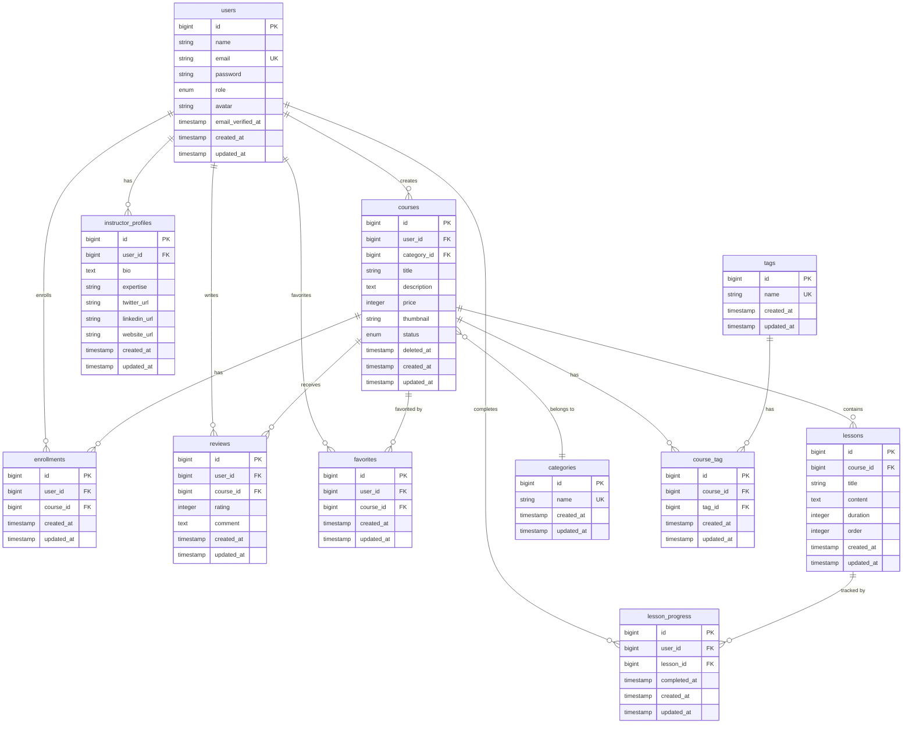

# 模擬案件「LearnHub」要件定義書 v4.0（完全版）

## 目次

1.  [プロジェクト概要](#1-プロジェクト概要)
2.  [開発の進め方](#2-開発の進め方)
3.  [環境構築手順](#3-環境構築手順)
4.  [提供コードベースの実装状況](#4-提供コードベースの実装状況)
5.  [実装チケット一覧](#5-実装チケット一覧)
6.  [チケット詳細](#6-チケット詳細)
7.  [データベース設計](#7-データベース設計)
8.  [ルーティング設計](#8-ルーティング設計)
9.  [コントローラー設計](#9-コントローラー設計)
10. [バリデーション設計](#10-バリデーション設計)
11. [認可設計](#11-認可設計)
12. [テスト設計](#12-テスト設計)
13. [API設計](#13-api設計)
14. [外部API連携](#14-外部api連携)

---

## 1. プロジェクト概要

### 1.1 プロジェクト名

**LearnHub（ラーンハブ）**

### 1.2 背景

近年、オンライン学習の需要は急速に高まっています。時間や場所を選ばずに学習できる利便性から、多くの人が自己投資やスキルアップのためにオンライン学習プラットフォームを利用しています。

本プロジェクトでは、実務で頻出する要件を盛り込んだオンライン学習プラットフォーム「LearnHub」を題材とします。受講生には、一部実装済み・一部バグありの既存プロジェクトが提供されます。このプロジェクトに対して、**コードリーディング、バグフィックス、リファクタリング、新機能開発**といった一連の開発プロセスを体験してもらうことで、より実務に近い形での開発スキル習得を目指します。

### 1.3 目的

本プロジェクトを通じて、以下のスキルを習得することを目指します。

-   **既存コードを読み解き、仕様を理解する能力**を養う。実務では、ドキュメントが不完全な既存プロジェクトに参画することが多く、コードから仕様を推測するスキルが不可欠です。
-   **N+1問題やセキュリティ脆弱性**など、実務で遭遇しやすいバグの修正経験を積む。これらのバグは、開発時には気づきにくく、本番環境で問題になることが多いため、早期に経験を積むことが重要です。
-   **パフォーマンス改善やコード品質向上**を目的としたリファクタリングスキルを習得する。レガシーコードの改善は、実務で頻繁に発生するタスクです。
-   **CRUD、外部API連携、API開発**など、多岐にわたる新機能開発を経験する。実務で求められる幅広い技術領域をカバーします。
-   **Git/GitHub**を用いたチーム開発のワークフロー（ブランチ、プルリクエスト）を習得する。実務では、複数人での並行開発が基本となるため、適切なバージョン管理が必須です。

### 1.4 ユーザーロール

本システムには、以下の3つのユーザーロールが存在します。

| ロール | 説明 | 主な権限 |
| :--- | :--- | :--- |
| **管理者 (admin)** | サイト全体の管理者。システムの基盤となるマスターデータを管理する。 | カテゴリの作成・編集・削除、全ユーザーの管理 |
| **講師 (instructor)** | コースを作成・管理する。自身が作成したコースに対してのみ編集権限を持つ。 | コースの作成・編集・削除、レッスンの作成・編集・削除、受講生の管理 |
| **受講生 (student)** | コースを受講・購入する。購入したコースのみ閲覧・受講できる。 | コースの閲覧・購入、レビューの投稿、受講進捗の記録 |

### 1.5 技術スタック

| カテゴリ | 技術 | バージョン |
| :--- | :--- | :--- |
| **バックエンド** | PHP | 8.2 |
| | Laravel | 10.x |
| | Laravel Fortify | 1.x（認証） |
| | Laravel Sanctum | 3.x（API認証） |
| **フロントエンド** | Blade | - |
| | TailwindCSS | 3.x |
| **データベース** | MySQL | 8.0 |
| **開発環境** | Docker | - |
| | Laravel Sail | - |
| **外部API** | Stripe | - |
| | SendGrid | - |
| **バージョン管理** | Git | - |
| | GitHub | - |

---

## 2. 開発の進め方

本プロジェクトは、既存のコードを読み解き、改修・機能追加を行う実務に近い形式で進行します。以下の進め方を推奨します。

### 2.1 環境構築後の最初のステップ

まず、プロジェクト全体の構造と実装パターンを理解するために、以下のステップを踏んでください。

#### ステップ1: アプリケーションの動作確認

環境構築が完了したら、`http://localhost` にアクセスし、管理者・講師・受講生の各ロールでログインして、どのような機能が実装済みで、どのように動作するのかを一通り確認します。

**確認項目**:

1.  **管理者でログイン**（`admin@example.com` / `password`）
    -   カテゴリ管理機能を操作（一覧、作成、編集、削除）
    -   各機能がどのように動作するかを確認
    -   フラッシュメッセージの表示を確認

2.  **講師でログイン**（`instructor@example.com` / `password`）
    -   コース一覧ページを閲覧
    -   コース詳細ページを閲覧
    -   レッスン一覧ページを閲覧
    -   どの機能が実装済みで、どの機能が未実装かを確認

3.  **受講生でログイン**（`student@example.com` / `password`）
    -   コース一覧ページを閲覧
    -   コース詳細ページを閲覧
    -   レビュー投稿を試行
    -   マイページを閲覧

この段階で、「どの画面が表示されるか」「どのボタンが押せるか」「どのエラーが発生するか」を把握することで、実装状況の全体像が見えてきます。

#### ステップ2: お手本機能のコードリーディング

「カテゴリ管理」は、本プロジェクトにおける**CRUD実装のお手本**です。以下のファイルを中心に読み解き、実装パターン（ルーティング、コントローラー、ビュー、バリデーション）を把握してください。

**読むべきファイル**:

1.  **ルーティング定義**: `routes/web.php`
    -   RESTfulなルーティング設計を確認
    -   `Route::resource()` の使い方を理解
    -   ミドルウェアの適用方法を確認

2.  **コントローラー**: `app/Http/Controllers/Admin/CategoryController.php`
    -   各メソッド（`index`, `create`, `store`, `edit`, `update`, `destroy`）の実装パターンを確認
    -   フラッシュメッセージの設定方法を確認
    -   リダイレクト先の指定方法を確認

3.  **バリデーション**: `app/Http/Requests/StoreCategoryRequest.php`
    -   FormRequestの基本構造を確認
    -   `rules()` メソッドでのバリデーションルール定義を確認
    -   `authorize()` メソッドでの認可制御を確認

4.  **モデル**: `app/Models/Category.php`
    -   `$fillable` プロパティの設定を確認
    -   リレーションの定義方法を確認

5.  **ビュー**: `resources/views/admin/categories/`
    -   Bladeテンプレートの継承（`@extends`, `@section`）を確認
    -   コンポーネントの使い方（`<x-button>` など）を確認
    -   フォームの実装方法（`@csrf`, `@method`）を確認

**特に注目すべき点**:

-   RESTfulなルーティング設計: 各HTTPメソッド（GET, POST, PUT, DELETE）とURIの対応関係
-   FormRequestによるバリデーション: コントローラーをシンプルに保つための分離
-   Bladeテンプレートの継承: 共通レイアウトの活用
-   フラッシュメッセージの表示方法: `session()->flash()` と `@if(session('success'))` の組み合わせ

#### ステップ3: データベース構造の把握

`database/migrations` 以下のマイグレーションファイルと、本要件定義書の「7. データベース設計」のER図を照合し、各テーブルの役割とリレーションを理解してください。

**確認項目**:

1.  **テーブルの役割**:
    -   `users`: ユーザー情報とロール
    -   `categories`: コースのカテゴリ
    -   `courses`: コース情報（講師が作成）
    -   `lessons`: レッスン情報（コースに紐づく）
    -   `enrollments`: 受講申し込み情報
    -   `reviews`: レビュー情報
    -   `favorites`: お気に入り情報（多対多の中間テーブル）
    -   `payments`: 決済情報

2.  **リレーション**:
    -   `users` と `courses`: 1対多（講師が複数のコースを作成）
    -   `courses` と `lessons`: 1対多（コースが複数のレッスンを持つ）
    -   `users` と `enrollments`: 1対多（受講生が複数のコースを受講）
    -   `courses` と `enrollments`: 1対多（コースに複数の受講生が申し込む）
    -   `users` と `favorites`: 多対多（受講生が複数のコースをお気に入り登録）

3.  **カラムの意味**:
    -   `deleted_at`: ソフトデリート用のカラム（論理削除）
    -   `order`: レッスンの並び順を管理するカラム
    -   `status`: 受講ステータス（`enrolled`, `in_progress`, `completed`）

#### ステップ4: デバッグツールの導入

コードリーディングやバグ修正を効率的に行うために、以下のデバッグツールを導入してください。

1.  **Laravel Debugbar**:
    ```bash
    ./vendor/bin/sail composer require barryvdh/laravel-debugbar --dev
    ```
    -   クエリ数やパフォーマンスを可視化
    -   N+1問題の発見に有効

2.  **Laravel Telescope**（オプション）:
    ```bash
    ./vendor/bin/sail artisan telescope:install
    ./vendor/bin/sail artisan migrate
    ```
    -   アプリケーションの動作をモニタリング
    -   リクエスト、クエリ、ジョブ、メールなどを記録

3.  **dd() / dump()**:
    -   変数の中身を確認するための基本的なデバッグ関数
    -   `dd($variable)`: 変数の内容を表示して処理を停止
    -   `dump($variable)`: 変数の内容を表示して処理を継続

4.  **Log::info()**:
    -   ログ出力でデバッグ
    -   `Log::info('Debug message', ['data' => $variable]);`
    -   ログは `storage/logs/laravel.log` に出力される

### 2.2 各チケットの実装手順

各チケットは、以下の手順で進めることを基本とします。

#### 1. チケット内容の理解

チケットに記載された「目的」と「実装手順」をよく読み、ゴールを明確にします。

-   何を達成するのか？
-   どのような問題を解決するのか？
-   どのような機能を追加するのか？

#### 2. 関連箇所のコードリーディング

「実装手順」で示された関連ファイルや既存機能を読み解き、改修・追加する箇所の特定と、実装の具体的なイメージを固めます。

-   既存のコードがどのように動作しているか？
-   どの部分を修正・追加すればよいか？
-   既存の実装パターンを踏襲できるか？

#### 3. ブランチの作成

チケットに対応したブランチを作成します。

```bash
git checkout -b feature/BUG-001-fix-n-plus-one
```

ブランチ名の命名規則:
-   バグフィックス: `feature/BUG-XXX-<概要>`
-   リファクタリング: `feature/REF-XXX-<概要>`
-   新機能開発: `feature/FEAT-XXX-<概要>`

#### 4. 実装

コーディング規約や既存の実装パターンを踏襲し、機能の実装を行います。

-   PSR-12に準拠したコーディングスタイル
-   既存のコードと統一感のある実装
-   適切なコメントの追加

#### 5. 動作確認

実際にブラウザで操作し、要件通りに動作することを確認します。

-   正常系の動作確認
-   異常系の動作確認（バリデーションエラー、権限エラーなど）
-   デバッグツールでのパフォーマンス確認

#### 6. テスト

必要に応じてテストコードを記述・実行し、品質を担保します。

```bash
./vendor/bin/sail artisan test
```

-   Featureテスト: エンドツーエンドの動作確認
-   Unitテスト: 個別のメソッドの動作確認

#### 7. コミットとプルリクエスト

適切な粒度でコミットし、プルリクエストを作成してレビューを依頼します。（本カリキュラムではセルフレビュー）

```bash
git add .
git commit -m "BUG-001: Fix N+1 problem in course index"
git push origin feature/BUG-001-fix-n-plus-one
```

プルリクエストのテンプレート:
```markdown
## チケット
BUG-001: コース一覧のN+1問題を解決する

## 変更内容
- CourseController@indexでEager Loadingを実装
- クエリ数を50から3に削減

## 確認方法
1. コース一覧ページにアクセス
2. Laravel Debugbarでクエリ数を確認

## スクリーンショット
（必要に応じて添付）
```

### 2.3 推奨ツール

以下のツールを活用することで、コードリーディングやデバッグが効率的に行えます。

| ツール | 用途 | インストール方法 |
| :--- | :--- | :--- |
| **Laravel Debugbar** | クエリ数やパフォーマンスを可視化 | `composer require barryvdh/laravel-debugbar --dev` |
| **Laravel Telescope** | アプリケーションの動作をモニタリング | `artisan telescope:install` |
| **dd() / dump()** | 変数の中身を確認 | 標準搭載 |
| **Log::info()** | ログ出力でデバッグ | 標準搭載 |
| **tinker** | 対話的にコードを実行 | `artisan tinker` |

---

## 3. 環境構築手順

### 3.1 必須要件

開発環境を構築するために、以下のソフトウェアがインストールされている必要があります。

| ソフトウェア | 用途 | インストール方法 |
| :--- | :--- | :--- |
| **Docker Desktop** | コンテナ環境の構築 | [公式サイト](https://www.docker.com/products/docker-desktop)からダウンロード |
| **Git** | バージョン管理 | [公式サイト](https://git-scm.com/)からダウンロード |
| **GitHub CLI**（推奨） | GitHubの操作を効率化 | [公式サイト](https://cli.github.com/)からダウンロード |

### 3.2 環境構築

以下の手順に従って、開発環境を構築してください。

#### 手順1: リポジトリのクローン

GitHubからプロジェクトをクローンします。

```bash
gh repo clone coachtech-material/ExampleAnswer-mockcase-SkillHub
cd ExampleAnswer-mockcase-SkillHub
```

GitHub CLIを使用しない場合:
```bash
git clone https://github.com/coachtech-material/ExampleAnswer-mockcase-SkillHub.git
cd ExampleAnswer-mockcase-SkillHub
```

#### 手順2: .envファイルの作成

`.env.example`をコピーして`.env`ファイルを作成します。

```bash
cp .env.example .env
```

`.env`ファイルには、データベース接続情報やアプリケーションキーなどの環境変数が記載されています。基本的には、デフォルトの設定で動作しますが、必要に応じて編集してください。

**主な環境変数**:

```env
APP_NAME=LearnHub
APP_ENV=local
APP_KEY=
APP_DEBUG=true
APP_URL=http://localhost

DB_CONNECTION=mysql
DB_HOST=mysql
DB_PORT=3306
DB_DATABASE=learnhub
DB_USERNAME=sail
DB_PASSWORD=password
```

#### 手順3: Dockerコンテナの起動

Laravel Sailを使用してDockerコンテナを起動します。

```bash
./vendor/bin/sail up -d
```

**オプションの説明**:
-   `-d`: バックグラウンドで起動（デタッチモード）

初回起動時は、Dockerイメージのビルドに時間がかかる場合があります（5-10分程度）。

**起動確認**:
```bash
./vendor/bin/sail ps
```

以下のようなコンテナが起動していることを確認してください。
-   `learnhub-laravel.test-1`: Laravelアプリケーション
-   `learnhub-mysql-1`: MySQLデータベース
-   `learnhub-mailpit-1`: メール送信テスト用

#### 手順4: Composerパッケージのインストール

Composerの依存パッケージをインストールします。

```bash
./vendor/bin/sail composer install
```

このコマンドにより、`composer.json`に記載された全ての依存パッケージがインストールされます。

#### 手順5: アプリケーションキーの生成

Laravelのアプリケーションキーを生成します。

```bash
./vendor/bin/sail artisan key:generate
```

このコマンドにより、`.env`ファイルの`APP_KEY`に暗号化キーが設定されます。このキーは、セッションやパスワードの暗号化に使用されます。

#### 手順6: データベースのマイグレーションと初期データ投入

データベースのテーブルを作成し、初期データを投入します。

```bash
./vendor/bin/sail artisan migrate:fresh --seed
```

**オプションの説明**:
-   `migrate:fresh`: 既存のテーブルを全て削除してから、マイグレーションを実行
-   `--seed`: Seederを実行して、初期データを投入

このコマンドにより、以下のテーブルが作成され、初期データが投入されます。
-   `users`: 管理者、講師、受講生の各ロールのユーザー
-   `categories`: カテゴリのマスターデータ
-   `courses`: サンプルコース
-   `lessons`: サンプルレッスン
-   `enrollments`: サンプル受講申し込み
-   `reviews`: サンプルレビュー

#### 手順7: アプリケーションへのアクセス

ブラウザで `http://localhost` にアクセスし、トップページが表示されることを確認します。

**確認項目**:
-   トップページが正常に表示される
-   ログインページにアクセスできる
-   管理者、講師、受講生の各ロールでログインできる

#### 手順8: エイリアスの設定（オプション）

毎回 `./vendor/bin/sail` と入力するのは面倒なので、エイリアスを設定することを推奨します。

**Bash/Zshの場合**:
```bash
echo "alias sail='./vendor/bin/sail'" >> ~/.bashrc
source ~/.bashrc
```

または

```bash
echo "alias sail='./vendor/bin/sail'" >> ~/.zshrc
source ~/.zshrc
```

これにより、`sail up -d` のように短縮して実行できます。

### 3.3 ログイン情報

初期データとして、以下のユーザーが登録されています。

| ロール | メールアドレス | パスワード | 用途 |
| :--- | :--- | :--- | :--- |
| 管理者 | `admin@example.com` | `password` | カテゴリ管理などの管理者機能のテスト |
| 講師 | `instructor@example.com` | `password` | コース作成・管理機能のテスト |
| 受講生 | `student@example.com` | `password` | コース受講・レビュー機能のテスト |

### 3.4 コンテナの停止・再起動

#### コンテナの停止

開発を終了する際は、以下のコマンドでコンテナを停止できます。

```bash
./vendor/bin/sail down
```

このコマンドにより、全てのコンテナが停止し、ネットワークも削除されます。ただし、データベースのデータは保持されます。

#### コンテナの再起動

再度起動する際は、以下のコマンドを実行します。

```bash
./vendor/bin/sail up -d
```

#### コンテナの完全削除

データベースのデータも含めて完全に削除する場合は、以下のコマンドを実行します。

```bash
./vendor/bin/sail down -v
```

**オプションの説明**:
-   `-v`: ボリューム（データベースのデータ）も削除

### 3.5 トラブルシューティング

#### ポートが既に使用されている

エラーメッセージ:
```
Error response from daemon: driver failed programming external connectivity on endpoint learnhub-laravel.test-1: Bind for 0.0.0.0:80 failed: port is already allocated
```

**解決方法**:
1.  既に起動しているWebサーバー（Apache、Nginxなど）を停止する
2.  または、`.env`ファイルの`APP_PORT`を変更する（例: `APP_PORT=8080`）

#### データベース接続エラー

エラーメッセージ:
```
SQLSTATE[HY000] [2002] Connection refused
```

**解決方法**:
1.  MySQLコンテナが起動しているか確認: `./vendor/bin/sail ps`
2.  `.env`ファイルの`DB_HOST`が`mysql`になっているか確認
3.  コンテナを再起動: `./vendor/bin/sail restart mysql`

#### Composerのメモリ不足

エラーメッセージ:
```
Fatal error: Allowed memory size of 1610612736 bytes exhausted
```

**解決方法**:
```bash
./vendor/bin/sail composer install --no-scripts
```

---

## 4. 提供コードベースの実装状況

本プロジェクトでは、既存のコードベースが一部実装済みの状態で提供されます。以下に、各機能の実装状況を詳細に記載します。

### 4.1 完全実装済み機能（運営提供）

以下の機能は、完全に実装済みであり、受講生が修正・追加する必要はありません。ただし、コードリーディングの対象として、実装パターンを学ぶために活用してください。

| 機能 | 実装状況 | ファイル | 備考 |
|---|---|---|---|
| **認証機能** | ✅ 完全実装 | `app/Http/Controllers/Auth/` | Laravel Fortify使用、会員登録・ログイン・ログアウト |
| **ロール管理** | ✅ 完全実装 | `database/migrations/create_users_table.php` | admin, instructor, student の3ロール |
| **カテゴリ管理** | ✅ 完全実装 | `app/Http/Controllers/Admin/CategoryController.php` | お手本機能（CRUD完全実装） |
| **Bladeビュー** | ✅ 完全実装 | `resources/views/` | 全画面のフロントエンド実装済み |
| **マイグレーション** | ✅ 完全実装 | `database/migrations/` | 全テーブル定義済み |
| **モデル** | ⚠️ 一部実装 | `app/Models/` | 基本的なモデルは作成済み、リレーション一部未定義 |

#### 認証機能の詳細

Laravel Fortifyを使用した認証機能が実装されています。

**実装済みの機能**:
-   会員登録（`/register`）
-   ログイン（`/login`）
-   ログアウト（`/logout`）
-   パスワードリセット（`/forgot-password`）
-   メール確認（`/email/verify`）

**関連ファイル**:
-   `config/fortify.php`: Fortifyの設定ファイル
-   `app/Providers/FortifyServiceProvider.php`: Fortifyのサービスプロバイダー
-   `resources/views/auth/`: 認証関連のビュー

#### ロール管理の詳細

`users`テーブルに`role`カラムが定義されており、以下の3つのロールが存在します。

| ロール | 値 | 説明 |
| :--- | :--- | :--- |
| 管理者 | `admin` | サイト全体の管理者 |
| 講師 | `instructor` | コースを作成・管理する |
| 受講生 | `student` | コースを受講・購入する |

**ロールの判定方法**:
```php
// Userモデルにメソッドが定義されています
$user->isAdmin(); // 管理者かどうか
$user->isInstructor(); // 講師かどうか
$user->isStudent(); // 受講生かどうか
```

**ミドルウェア**:
-   `app/Http/Middleware/CheckRole.php`: ロールをチェックするミドルウェア
-   使用例: `Route::middleware('role:admin')->group(function () { ... });`

#### カテゴリ管理の詳細

カテゴリ管理は、本プロジェクトにおける**CRUD実装のお手本**です。

**実装済みの機能**:
-   カテゴリ一覧表示（`/admin/categories`）
-   カテゴリ作成（`/admin/categories/create`）
-   カテゴリ編集（`/admin/categories/{category}/edit`）
-   カテゴリ削除（`/admin/categories/{category}`）

**関連ファイル**:
-   `app/Http/Controllers/Admin/CategoryController.php`: コントローラー
-   `app/Http/Requests/StoreCategoryRequest.php`: バリデーション
-   `app/Models/Category.php`: モデル
-   `resources/views/admin/categories/`: ビュー

**実装パターン**:
-   RESTfulなルーティング設計
-   FormRequestによるバリデーション
-   Bladeテンプレートの継承
-   フラッシュメッセージの表示

### 4.2 一部実装済み機能（バグあり・不完全）

以下の機能は、一部実装済みですが、バグや不完全な実装が含まれています。受講生は、これらのバグを修正する必要があります。

| 機能 | 実装状況 | 問題点 | 関連チケット |
|---|---|---|---|
| **コース一覧表示** | ⚠️ バグあり | N+1問題が発生している | BUG-001 |
| **コース詳細表示** | ⚠️ バグあり | リレーションのEager Loading漏れ | BUG-002 |
| **レッスン一覧表示** | ⚠️ バグあり | 認可制御が実装されていない（未購入でも閲覧可能） | BUG-004 |
| **受講申し込み** | ⚠️ 不完全 | トランザクション処理が実装されていない | BUG-006 |
| **レビュー投稿** | ⚠️ バグあり | バリデーションが不十分（rating必須チェック漏れ） | BUG-003 |
| **マイページ** | ⚠️ バグあり | ソフトデリートされたコースも表示される | BUG-005 |
| **コース検索** | ⚠️ バグあり | SQLインジェクション脆弱性がある | BUG-007 |

#### コース一覧表示の問題点

**現在の実装**:
```php
// app/Http/Controllers/CourseController.php
public function index()
{
    $courses = Course::paginate(10);
    return view('courses.index', compact('courses'));
}
```

**問題点**:
-   `with()`メソッドでEager Loadingを行っていないため、N+1問題が発生
-   コース一覧ページで、各コースのカテゴリ名や講師名を表示する際に、追加のクエリが発生

**期待される動作**:
-   Eager Loadingを実装し、クエリ数を削減

#### コース詳細表示の問題点

**現在の実装**:
```php
// app/Http/Controllers/CourseController.php
public function show(Course $course)
{
    return view('courses.show', compact('course'));
}
```

**問題点**:
-   レッスン、レビュー、講師情報などのリレーションをEager Loadingしていない
-   詳細ページで多数のクエリが発生

**期待される動作**:
-   必要なリレーションをEager Loadingで取得

#### レッスン一覧表示の問題点

**現在の実装**:
```php
// app/Http/Controllers/LessonController.php
public function index(Course $course)
{
    $lessons = $course->lessons;
    return view('lessons.index', compact('course', 'lessons'));
}
```

**問題点**:
-   認可制御が実装されていない
-   未購入のコースでもレッスン一覧が閲覧できてしまう

**期待される動作**:
-   Policyを使用して、購入済みのコースのみ閲覧可能にする

#### 受講申し込みの問題点

**現在の実装**:
```php
// app/Http/Controllers/EnrollmentController.php
public function store(Request $request, Course $course)
{
    $enrollment = Enrollment::create([
        'user_id' => auth()->id(),
        'course_id' => $course->id,
        'status' => 'enrolled',
    ]);
    
    return redirect()->route('courses.show', $course);
}
```

**問題点**:
-   トランザクション処理が実装されていない
-   決済処理（将来的に実装）と受講申し込みが分離されている場合、データの整合性が保証されない

**期待される動作**:
-   `DB::transaction()`を使用して、トランザクション処理を実装

#### レビュー投稿の問題点

**現在の実装**:
```php
// app/Http/Requests/StoreReviewRequest.php
public function rules()
{
    return [
        'comment' => 'required|string',
    ];
}
```

**問題点**:
-   `rating`フィールドの必須チェックが漏れている
-   評価なしでもレビューが投稿できてしまう

**期待される動作**:
-   `rating`フィールドに`required|integer|between:1,5`のバリデーションを追加

#### マイページの問題点

**現在の実装**:
```php
// app/Http/Controllers/MyPageController.php
public function index()
{
    $enrollments = auth()->user()->enrollments;
    return view('mypage.index', compact('enrollments'));
}
```

**問題点**:
-   ソフトデリートされたコースも表示される
-   削除されたコースが受講履歴に残ってしまう

**期待される動作**:
-   `whereHas()`を使用して、ソフトデリートされていないコースのみ取得

#### コース検索の問題点

**現在の実装**:
```php
// app/Http/Controllers/CourseController.php
public function search(Request $request)
{
    $keyword = $request->input('keyword');
    $courses = Course::whereRaw("title LIKE '%{$keyword}%'")->get();
    return view('courses.index', compact('courses'));
}
```

**問題点**:
-   `whereRaw()`で直接SQLを組み立てているため、SQLインジェクション脆弱性がある
-   ユーザー入力をエスケープせずに使用している

**期待される動作**:
-   `where()`メソッドを使用して、プレースホルダーでエスケープ

### 4.3 未実装機能

以下の機能は、完全に未実装です。受講生は、これらの機能を新規に実装する必要があります。

| 機能 | 実装状況 | 関連チケット |
|---|---|---|
| **コース登録・編集・削除** | ❌ 未実装 | FEAT-001, FEAT-002, FEAT-003 |
| **レッスン登録・編集・削除** | ❌ 未実装 | FEAT-004, FEAT-005 |
| **受講進捗管理** | ❌ 未実装 | FEAT-006 |
| **レビュー編集・削除** | ❌ 未実装 | FEAT-007 |
| **お気に入り機能** | ❌ 未実装 | FEAT-008 |
| **人気コースランキング** | ❌ 未実装 | FEAT-009 |
| **コース検索機能強化** | ❌ 未実装 | FEAT-010 |
| **コース購入機能（Stripe連携）** | ❌ 未実装 | FEAT-011 |
| **通知機能（SendGrid連携）** | ❌ 未実装 | FEAT-012 |
| **API（コース一覧取得）** | ❌ 未実装 | FEAT-013, FEAT-014, FEAT-015 |
| **タグ管理機能** | ❌ 未実装 | FEAT-016 |
| **レッスン並び替え機能** | ❌ 未実装 | FEAT-018 |
| **コース公開/非公開機能** | ❌ 未実装 | FEAT-019 |
| **受講申し込み機能の完成** | ❌ 未実装 | FEAT-020 |
| **講師プロフィール機能** | ❌ 未実装 | FEAT-021 |

---

## 5. 実装チケット一覧

本プロジェクトでは、全34チケットを実装します。チケットは、以下の4つのカテゴリに分類されます。

### 5.1 バグフィックス（7チケット）

既存のコードに含まれるバグを修正するチケットです。

| チケットID | タイトル | 難易度 | 推定時間 | カテゴリ |
|---|---|---|---|---|
| **BUG-001** | コース一覧のパフォーマンス問題を調査・修正する | ⭐⭐ | 1.5h | パフォーマンス |
| **BUG-002** | コース詳細のEager Loading漏れを修正する | ⭐⭐ | 1h | パフォーマンス |
| **BUG-003** | レビュー投稿のバリデーション不備を修正する | ⭐ | 1h | バリデーション |
| **BUG-004** | レッスン一覧の認可制御を実装する | ⭐⭐ | 2h | セキュリティ |
| **BUG-005** | マイページのソフトデリート対応を修正する | ⭐⭐ | 1.5h | データ整合性 |
| **BUG-006** | 受講申し込みのトランザクション処理を追加する | ⭐⭐⭐ | 2.5h | データ整合性 |
| **BUG-007** | コース検索機能のSQLインジェクション脆弱性を修正する | ⭐⭐ | 1.5h | セキュリティ |

**小計**: 11時間

### 5.2 リファクタリング（8チケット）

既存のコードの品質を向上させるチケットです。

| チケットID | タイトル | 難易度 | 推定時間 | カテゴリ |
|---|---|---|---|---|
| **REF-001** | コースコントローラーのクエリをEloquent Scopeに切り出す | ⭐⭐ | 2h | コード品質 |
| **REF-002** | 受講履歴取得処理をコレクションメソッドで最適化する | ⭐⭐ | 2h | パフォーマンス |
| **REF-003** | レビュー集計処理をデータベースクエリに移行する | ⭐⭐⭐ | 3h | パフォーマンス |
| **REF-004** | 重複するバリデーションルールをカスタムルールに統合する | ⭐⭐ | 2h | コード品質 |
| **REF-005** | マジックナンバーを定数クラスに切り出す | ⭐ | 1.5h | 保守性 |
| **REF-006** | 【応用】インデックスを追加してクエリパフォーマンスを改善する | ⭐⭐⭐⭐ | 3h | パフォーマンス |
| **REF-007** | 【応用】キャッシュを導入してコース一覧の表示速度を改善する | ⭐⭐⭐⭐ | 3.5h | パフォーマンス |
| **REF-008** | 【応用】クエリログを分析してスロークエリを特定・最適化する | ⭐⭐⭐⭐ | 3h | パフォーマンス |

**小計**: 20時間

### 5.3 新機能開発（19チケット）

新しい機能を実装するチケットです。

#### 基本要件（14チケット）

| チケットID | タイトル | 難易度 | 推定時間 | カテゴリ |
|---|---|---|---|---|
| **FEAT-001** | コース登録機能を実装する | ⭐⭐⭐ | 3h | CRUD |
| **FEAT-002** | コース編集機能を実装する | ⭐⭐ | 2.5h | CRUD |
| **FEAT-003** | コース削除機能を実装する | ⭐⭐ | 2h | CRUD |
| **FEAT-004** | レッスン登録機能を実装する | ⭐⭐⭐ | 3h | CRUD |
| **FEAT-005** | レッスン編集・削除機能を実装する | ⭐⭐ | 2.5h | CRUD |
| **FEAT-006** | 受講進捗管理機能を実装する | ⭐⭐⭐ | 3.5h | ビジネスロジック |
| **FEAT-007** | レビュー編集・削除機能を実装する | ⭐⭐ | 2h | CRUD |
| **FEAT-008** | お気に入り機能を実装する | ⭐⭐ | 2.5h | 多対多リレーション |
| **FEAT-009** | 人気コースランキング機能を実装する | ⭐⭐⭐ | 3h | 集計クエリ |
| **FEAT-010** | コース検索機能を強化する（カテゴリ・価格帯フィルタ） | ⭐⭐⭐ | 3h | 検索機能 |
| **FEAT-016** | タグ管理機能を実装する | ⭐⭐ | 3h | CRUD |
| **FEAT-018** | レッスン並び替え機能を実装する | ⭐⭐⭐ | 3h | UI/UX |
| **FEAT-019** | コース公開/非公開機能を実装する | ⭐⭐ | 2.5h | ビジネスロジック |
| **FEAT-020** | 受講申し込み機能を完成させる | ⭐⭐⭐ | 3h | ビジネスロジック |

**小計**: 38.5時間

#### 応用要件（5チケット）

| チケットID | タイトル | 難易度 | 推定時間 | カテゴリ |
|---|---|---|---|---|
| **FEAT-011** | 【応用】Stripe連携でコース購入機能を実装する | ⭐⭐⭐⭐ | 5h | 外部API |
| **FEAT-012** | 【応用】SendGrid連携で受講開始通知メールを実装する | ⭐⭐⭐⭐ | 4h | 外部API |
| **FEAT-013** | 【応用】Laravel Sanctumで認証付きAPIを実装する | ⭐⭐⭐⭐ | 5h | API開発 |
| **FEAT-014** | 【応用】API Resourceでコース一覧APIを実装する | ⭐⭐⭐ | 3h | API開発 |
| **FEAT-015** | 【応用】レート制限とAPIエラーハンドリングを実装する | ⭐⭐⭐ | 3h | API開発 |
| **FEAT-021** | 【応用】講師プロフィール機能を実装する | ⭐⭐⭐⭐ | 4h | CRUD |

**小計**: 24時間

### 5.4 総実装時間

| カテゴリ | チケット数 | 推定時間 |
|---|---|---|
| バグフィックス | 7 | 11h |
| リファクタリング | 8 | 20h |
| 新機能開発（基本） | 14 | 38.5h |
| 新機能開発（応用） | 6 | 24h |
| **合計** | **35** | **93.5h** |

**Bookshelfとの比較**: 101h × 92% = **93h**

### 5.5 チケットの実装順序

チケットは、以下の順序で実装することを推奨します。

#### Phase 1: バグフィックス（環境理解）

まずは、既存のコードを読み解き、バグを修正することで、プロジェクト全体の構造を理解します。

1.  **BUG-003**（バリデーション）← 最も簡単
2.  **BUG-001**（N+1問題）
3.  **BUG-002**（Eager Loading）
4.  **BUG-005**（ソフトデリート）
5.  **BUG-007**（SQLインジェクション）
6.  **BUG-004**（認可制御）
7.  **BUG-006**（トランザクション）← 最も難しい

#### Phase 2: 基本CRUD実装

カテゴリ管理をお手本に、コースとレッスンのCRUD機能を実装します。

8.  **FEAT-001**（コース登録）
9.  **FEAT-002**（コース編集）
10. **FEAT-003**（コース削除）
11. **FEAT-004**（レッスン登録）
12. **FEAT-005**（レッスン編集・削除）
13. **FEAT-007**（レビュー編集・削除）

#### Phase 3: リファクタリング（コード品質向上）

既存のコードを改善し、保守性とパフォーマンスを向上させます。

14. **REF-005**（マジックナンバー）
15. **REF-001**（Eloquent Scope）
16. **REF-004**（カスタムルール）
17. **REF-002**（コレクションメソッド）
18. **REF-003**（集計クエリ）

#### Phase 4: コードリーディング強化機能

既存コードを読み解き、同様のパターンで実装する機能です。

19. **FEAT-016**（タグ管理）
20. **FEAT-018**（レッスン並び替え）
21. **FEAT-019**（コース公開/非公開）
22. **FEAT-020**（受講申し込み完成）

#### Phase 5: 高度な機能実装

ビジネスロジックや集計処理を含む、やや複雑な機能を実装します。

23. **FEAT-008**（お気に入り）
24. **FEAT-006**（受講進捗管理）
25. **FEAT-009**（ランキング）
26. **FEAT-010**（検索機能強化）

#### Phase 6: 応用要件（外部API・パフォーマンス）

外部APIとの連携や、高度なパフォーマンスチューニングを実装します。

27. **REF-006**（インデックス）
28. **REF-007**（キャッシュ）
29. **REF-008**（スロークエリ最適化）
30. **FEAT-011**（Stripe連携）
31. **FEAT-012**（SendGrid連携）
32. **FEAT-013**（Sanctum API）
33. **FEAT-014**（API Resource）
34. **FEAT-015**（レート制限）
35. **FEAT-021**（講師プロフィール）

---

## 6. チケット詳細

以下、全35チケットの詳細な実装手順を記載します。各チケットには、目的、実装手順、確認方法、参考情報を含めています。

---

### 6.1 バグフィックス

#### BUG-001: コース一覧のパフォーマンス問題を調査・修正する

**難易度**: ⭐⭐  
**推定時間**: 1.5時間  
**カテゴリ**: パフォーマンス

**目的**:  
コース一覧ページで発生しているN+1問題を発見し、修正することで、パフォーマンスを改善します。N+1問題とは、メインのクエリ（N件のデータ取得）に加えて、各レコードに対して追加のクエリ（N回）が発生する問題です。これにより、データ量が増えるとパフォーマンスが著しく低下します。

**実装手順**:

1.  **Laravel Debugbarのインストール**:
    
    まず、クエリ数を可視化するために、Laravel Debugbarをインストールします。
    
    ```bash
    ./vendor/bin/sail composer require barryvdh/laravel-debugbar --dev
    ```
    
    インストール後、ブラウザの下部にDebugbarが表示されます。

2.  **問題の特定**:
    
    コース一覧ページ（`http://localhost/courses`）にアクセスし、Debugbarの「Queries」タブを確認します。
    
    -   クエリ数が異常に多い場合（例: 50クエリ以上）、N+1問題が発生しています。
    -   各コースのカテゴリ名や講師名を表示する際に、追加のクエリが発生していることを確認します。
    
    **確認例**:
    ```sql
    SELECT * FROM `courses` LIMIT 10;
    SELECT * FROM `categories` WHERE `id` = '...';  -- 10回実行
    SELECT * FROM `users` WHERE `id` = '...';  -- 10回実行
    ```

3.  **コードリーディング**:
    
    `app/Http/Controllers/CourseController.php` の `index()` メソッドを確認します。
    
    ```php
    public function index()
    {
        $courses = Course::paginate(10);
        return view('courses.index', compact('courses'));
    }
    ```
    
    この実装では、`Course::paginate(10)` でコースを取得していますが、リレーション先のデータ（カテゴリ、講師）を取得していません。そのため、ビューで `$course->category->name` や `$course->user->name` にアクセスする際に、追加のクエリが発生します。

4.  **修正**:
    
    `with()` メソッドを使い、Eager Loadingを実装します。
    
    ```php
    public function index()
    {
        $courses = Course::with(['category', 'user'])->paginate(10);
        return view('courses.index', compact('courses'));
    }
    ```
    
    **解説**:
    -   `with(['category', 'user'])`: コースと同時に、カテゴリと講師のデータも取得します。
    -   これにより、クエリ数が大幅に削減されます（例: 50クエリ → 3クエリ）。

5.  **確認**:
    
    再度コース一覧ページにアクセスし、Debugbarでクエリ数が削減されたことを確認します。
    
    **期待される結果**:
    ```sql
    SELECT * FROM `courses` LIMIT 10;
    SELECT * FROM `categories` WHERE `id` IN ('...', '...', ...);  -- 1回のみ
    SELECT * FROM `users` WHERE `id` IN ('...', '...', ...);  -- 1回のみ
    ```
    
    クエリ数が3クエリ程度に削減されていれば成功です。

6.  **テスト**:
    
    Featureテストを作成し、N+1問題が解決されたことを確認します。
    
    ```php
    // tests/Feature/CourseTest.php
    public function test_course_index_does_not_have_n_plus_one_problem()
    {
        $courses = Course::factory()->count(10)->create();
        
        DB::enableQueryLog();
        $this->get('/courses');
        $queries = DB::getQueryLog();
        
        // クエリ数が10以下であることを確認（Eager Loadingが効いている）
        $this->assertLessThan(10, count($queries));
    }
    ```

**参考情報**:
-   [Laravel公式ドキュメント - Eager Loading](https://laravel.com/docs/10.x/eloquent-relationships#eager-loading)
-   [N+1問題とは](https://qiita.com/muroya2355/items/d4eae8b4e4c3e8b6d7b6)

---

#### BUG-002: コース詳細のEager Loading漏れを修正する

**難易度**: ⭐⭐  
**推定時間**: 1時間  
**カテゴリ**: パフォーマンス

**目的**:  
コース詳細ページで、レッスン、レビュー、講師情報などのリレーションをEager Loadingで取得し、パフォーマンスを改善します。

**実装手順**:

1.  **問題の特定**:
    
    コース詳細ページ（`http://localhost/courses/{course}`）にアクセスし、Debugbarでクエリ数を確認します。
    
    -   レッスン一覧、レビュー一覧、講師情報を表示する際に、追加のクエリが発生していることを確認します。

2.  **コードリーディング**:
    
    `app/Http/Controllers/CourseController.php` の `show()` メソッドを確認します。
    
    ```php
    public function show(Course $course)
    {
        return view('courses.show', compact('course'));
    }
    ```
    
    この実装では、ルートモデルバインディングで `$course` を取得していますが、リレーション先のデータを取得していません。

3.  **修正**:
    
    `load()` メソッドを使い、必要なリレーションを追加で読み込みます。
    
    ```php
    public function show(Course $course)
    {
        $course->load(['lessons', 'reviews.user', 'user', 'category']);
        return view('courses.show', compact('course'));
    }
    ```
    
    **解説**:
    -   `load(['lessons', 'reviews.user', 'user', 'category'])`: コース詳細ページで必要なリレーションを一括で読み込みます。
    -   `reviews.user`: レビューと、レビューを投稿したユーザーの情報を同時に取得します（ネストしたEager Loading）。

4.  **確認**:
    
    再度コース詳細ページにアクセスし、Debugbarでクエリ数が削減されたことを確認します。

5.  **テスト**:
    
    Featureテストを作成し、Eager Loadingが効いていることを確認します。
    
    ```php
    // tests/Feature/CourseTest.php
    public function test_course_show_does_not_have_n_plus_one_problem()
    {
        $course = Course::factory()
            ->has(Lesson::factory()->count(5))
            ->has(Review::factory()->count(3))
            ->create();
        
        DB::enableQueryLog();
        $this->get("/courses/{$course->id}");
        $queries = DB::getQueryLog();
        
        // クエリ数が10以下であることを確認
        $this->assertLessThan(10, count($queries));
    }
    ```

**参考情報**:
-   [Laravel公式ドキュメント - Lazy Eager Loading](https://laravel.com/docs/10.x/eloquent-relationships#lazy-eager-loading)

---

#### BUG-003: レビュー投稿のバリデーション不備を修正する

**難易度**: ⭐  
**推定時間**: 1時間  
**カテゴリ**: バリデーション

**目的**:  
レビュー投稿機能で、評価（rating）フィールドの必須チェックが漏れているため、評価なしでもレビューが投稿できてしまう問題を修正します。

**実装手順**:

1.  **問題の特定**:
    
    コース詳細ページから、レビュー投稿フォームで評価を選択せずに投稿を試みます。
    
    -   評価なしでもレビューが投稿できてしまうことを確認します。

2.  **コードリーディング**:
    
    `app/Http/Requests/StoreReviewRequest.php` を確認します。
    
    ```php
    public function rules()
    {
        return [
            'comment' => 'required|string',
        ];
    }
    ```
    
    `rating` フィールドのバリデーションが定義されていないことを確認します。

3.  **修正**:
    
    `rating` フィールドに必須チェックと範囲チェックを追加します。
    
    ```php
    public function rules()
    {
        return [
            'rating' => 'required|integer|between:1,5',
            'comment' => 'required|string',
        ];
    }
    ```
    
    **解説**:
    -   `required`: 必須フィールド
    -   `integer`: 整数値
    -   `between:1,5`: 1〜5の範囲内

4.  **エラーメッセージのカスタマイズ（オプション）**:
    
    `messages()` メソッドを追加し、エラーメッセージをカスタマイズします。
    
    ```php
    public function messages()
    {
        return [
            'rating.required' => '評価を選択してください。',
            'rating.between' => '評価は1〜5の範囲で選択してください。',
            'comment.required' => 'コメントを入力してください。',
        ];
    }
    ```

5.  **確認**:
    
    再度レビュー投稿フォームで、評価を選択せずに投稿を試みます。
    
    -   「評価を選択してください。」というエラーメッセージが表示されることを確認します。

6.  **テスト**:
    
    Featureテストを作成し、バリデーションが正しく動作することを確認します。
    
    ```php
    // tests/Feature/ReviewTest.php
    public function test_review_requires_rating()
    {
        $user = User::factory()->create(['role' => 'student']);
        $course = Course::factory()->create();
        
        $response = $this->actingAs($user)->post("/courses/{$course->id}/reviews", [
            'comment' => 'Great course!',
            // rating を送信しない
        ]);
        
        $response->assertSessionHasErrors('rating');
    }
    
    public function test_review_rating_must_be_between_1_and_5()
    {
        $user = User::factory()->create(['role' => 'student']);
        $course = Course::factory()->create();
        
        $response = $this->actingAs($user)->post("/courses/{$course->id}/reviews", [
            'rating' => 6,  // 範囲外
            'comment' => 'Great course!',
        ]);
        
        $response->assertSessionHasErrors('rating');
    }
    ```

**参考情報**:
-   [Laravel公式ドキュメント - Validation](https://laravel.com/docs/10.x/validation)
-   [Laravel公式ドキュメント - Form Request Validation](https://laravel.com/docs/10.x/validation#form-request-validation)

---

#### BUG-004: レッスン一覧の認可制御を実装する

**難易度**: ⭐⭐  
**推定時間**: 2時間  
**カテゴリ**: セキュリティ

**目的**:  
レッスン一覧ページで、未購入のコースでもレッスンが閲覧できてしまう問題を修正します。Policyを使用して、購入済みのコースのみ閲覧可能にします。

**実装手順**:

1.  **問題の特定**:
    
    受講生でログインし、未購入のコースのレッスン一覧ページ（`http://localhost/courses/{course}/lessons`）にアクセスします。
    
    -   未購入でもレッスン一覧が閲覧できてしまうことを確認します。

2.  **コードリーディング**:
    
    `app/Http/Controllers/LessonController.php` の `index()` メソッドを確認します。
    
    ```php
    public function index(Course $course)
    {
        $lessons = $course->lessons;
        return view('lessons.index', compact('course', 'lessons'));
    }
    ```
    
    認可制御が実装されていないことを確認します。

3.  **Policyの作成**:
    
    `LessonPolicy` を作成します。
    
    ```bash
    ./vendor/bin/sail artisan make:policy LessonPolicy --model=Lesson
    ```
    
    `app/Policies/LessonPolicy.php` が作成されます。

4.  **Policyの実装**:
    
    `viewAny()` メソッドを実装し、購入済みのコースのみ閲覧可能にします。
    
    ```php
    <?php
    
    namespace App\Policies;
    
    use App\Models\Course;
    use App\Models\Lesson;
    use App\Models\User;
    
    class LessonPolicy
    {
        /**
         * レッスン一覧を閲覧できるかどうかを判定
         */
        public function viewAny(User $user, Course $course)
        {
            // 講師の場合: 自分が作成したコースのみ閲覧可能
            if ($user->isInstructor()) {
                return $user->id === $course->user_id;
            }
            
            // 受講生の場合: 購入済みのコースのみ閲覧可能
            if ($user->isStudent()) {
                return $course->enrollments()->where('user_id', $user->id)->exists();
            }
            
            // 管理者の場合: 全て閲覧可能
            return $user->isAdmin();
        }
    }
    ```

5.  **コントローラーでの認可チェック**:
    
    `LessonController` の `index()` メソッドで、Policyを使用して認可チェックを行います。
    
    ```php
    public function index(Course $course)
    {
        $this->authorize('viewAny', [Lesson::class, $course]);
        
        $lessons = $course->lessons;
        return view('lessons.index', compact('course', 'lessons'));
    }
    ```
    
    **解説**:
    -   `$this->authorize('viewAny', [Lesson::class, $course])`: Policyの `viewAny()` メソッドを呼び出し、認可チェックを行います。
    -   認可に失敗した場合、403エラー（Forbidden）が返されます。

6.  **確認**:
    
    再度、未購入のコースのレッスン一覧ページにアクセスします。
    
    -   403エラーが表示されることを確認します。
    -   購入済みのコースでは、正常にレッスン一覧が表示されることを確認します。

7.  **テスト**:
    
    Featureテストを作成し、認可制御が正しく動作することを確認します。
    
    ```php
    // tests/Feature/LessonTest.php
    public function test_student_cannot_view_lessons_of_unpurchased_course()
    {
        $student = User::factory()->create(['role' => 'student']);
        $course = Course::factory()->create();
        
        $response = $this->actingAs($student)->get("/courses/{$course->id}/lessons");
        
        $response->assertStatus(403);
    }
    
    public function test_student_can_view_lessons_of_purchased_course()
    {
        $student = User::factory()->create(['role' => 'student']);
        $course = Course::factory()->create();
        Enrollment::factory()->create([
            'user_id' => $student->id,
            'course_id' => $course->id,
        ]);
        
        $response = $this->actingAs($student)->get("/courses/{$course->id}/lessons");
        
        $response->assertStatus(200);
    }
    
    public function test_instructor_can_view_lessons_of_own_course()
    {
        $instructor = User::factory()->create(['role' => 'instructor']);
        $course = Course::factory()->create(['user_id' => $instructor->id]);
        
        $response = $this->actingAs($instructor)->get("/courses/{$course->id}/lessons");
        
        $response->assertStatus(200);
    }
    ```

**参考情報**:
-   [Laravel公式ドキュメント - Authorization](https://laravel.com/docs/10.x/authorization)
-   [Laravel公式ドキュメント - Policies](https://laravel.com/docs/10.x/authorization#creating-policies)

---

#### BUG-005: マイページのソフトデリート対応を修正する

**難易度**: ⭐⭐  
**推定時間**: 1.5時間  
**カテゴリ**: データ整合性

**目的**:  
マイページで、ソフトデリートされたコースも表示されてしまう問題を修正します。削除されたコースは、受講履歴に表示されないようにします。

**実装手順**:

1.  **問題の特定**:
    
    受講生でログインし、マイページ（`http://localhost/mypage`）にアクセスします。
    
    -   ソフトデリートされたコースも受講履歴に表示されることを確認します。
    -   テストデータとして、コースを削除してから確認します。

2.  **コードリーディング**:
    
    `app/Http/Controllers/MyPageController.php` の `index()` メソッドを確認します。
    
    ```php
    public function index()
    {
        $enrollments = auth()->user()->enrollments;
        return view('mypage.index', compact('enrollments'));
    }
    ```
    
    この実装では、`enrollments` リレーションを取得していますが、ソフトデリートされたコースもフィルタリングしていません。

3.  **修正**:
    
    `whereHas()` メソッドを使用して、ソフトデリートされていないコースのみ取得します。
    
    ```php
    public function index()
    {
        $enrollments = auth()->user()->enrollments()
            ->whereHas('course', function ($query) {
                $query->whereNull('deleted_at');
            })
            ->with('course')
            ->get();
        
        return view('mypage.index', compact('enrollments'));
    }
    ```
    
    **解説**:
    -   `whereHas('course', ...)`: `course` リレーションが存在し、かつ条件を満たすレコードのみ取得します。
    -   `whereNull('deleted_at')`: `deleted_at` カラムが NULL（削除されていない）のレコードのみ取得します。
    -   `with('course')`: Eager Loadingでコース情報も取得します。

4.  **確認**:
    
    再度マイページにアクセスし、ソフトデリートされたコースが表示されないことを確認します。

5.  **テスト**:
    
    Featureテストを作成し、ソフトデリート対応が正しく動作することを確認します。
    
    ```php
    // tests/Feature/MyPageTest.php
    public function test_mypage_does_not_show_soft_deleted_courses()
    {
        $student = User::factory()->create(['role' => 'student']);
        $course = Course::factory()->create();
        Enrollment::factory()->create([
            'user_id' => $student->id,
            'course_id' => $course->id,
        ]);
        
        // コースをソフトデリート
        $course->delete();
        
        $response = $this->actingAs($student)->get('/mypage');
        
        $response->assertStatus(200);
        $response->assertDontSee($course->title);
    }
    
    public function test_mypage_shows_active_courses()
    {
        $student = User::factory()->create(['role' => 'student']);
        $course = Course::factory()->create();
        Enrollment::factory()->create([
            'user_id' => $student->id,
            'course_id' => $course->id,
        ]);
        
        $response = $this->actingAs($student)->get('/mypage');
        
        $response->assertStatus(200);
        $response->assertSee($course->title);
    }
    ```

**参考情報**:
-   [Laravel公式ドキュメント - Soft Deleting](https://laravel.com/docs/10.x/eloquent#soft-deleting)
-   [Laravel公式ドキュメント - Querying Relationship Existence](https://laravel.com/docs/10.x/eloquent-relationships#querying-relationship-existence)

---

#### BUG-006: 受講申し込みのトランザクション処理を追加する

**難易度**: ⭐⭐⭐  
**推定時間**: 2.5時間  
**カテゴリ**: データ整合性

**目的**:  
受講申し込み機能で、トランザクション処理が実装されていないため、決済処理と受講申し込みが分離されている場合、データの整合性が保証されない問題を修正します。

**実装手順**:

1.  **問題の理解**:
    
    現在の実装では、受講申し込み（`enrollments` テーブルへの登録）のみが行われています。将来的に決済処理（`payments` テーブルへの登録）を追加した場合、以下のような問題が発生する可能性があります。
    
    -   受講申し込みは成功したが、決済処理でエラーが発生した場合、データの不整合が発生する。
    -   トランザクション処理を実装することで、全ての処理が成功するか、全て失敗するかのいずれかになります。

2.  **コードリーディング**:
    
    `app/Http/Controllers/EnrollmentController.php` の `store()` メソッドを確認します。
    
    ```php
    public function store(Request $request, Course $course)
    {
        $enrollment = Enrollment::create([
            'user_id' => auth()->id(),
            'course_id' => $course->id,
            'status' => 'enrolled',
        ]);
        
        return redirect()->route('courses.show', $course);
    }
    ```
    
    トランザクション処理が実装されていないことを確認します。

3.  **修正**:
    
    `DB::transaction()` を使用して、トランザクション処理を実装します。
    
    ```php
    use Illuminate\Support\Facades\DB;
    
    public function store(Request $request, Course $course)
    {
        try {
            DB::transaction(function () use ($course) {
                // 受講申し込みを作成
                $enrollment = Enrollment::create([
                    'user_id' => auth()->id(),
                    'course_id' => $course->id,
                    'status' => 'enrolled',
                ]);
                
                // 将来的に決済処理を追加する場合、ここに記述
                // Payment::create([...]);
                
                // その他の処理（通知メール送信など）
            });
            
            return redirect()->route('courses.show', $course)
                ->with('success', 'コースの受講申し込みが完了しました。');
                
        } catch (\Exception $e) {
            return redirect()->back()
                ->with('error', '受講申し込みに失敗しました。もう一度お試しください。');
        }
    }
    ```
    
    **解説**:
    -   `DB::transaction(function () { ... })`: クロージャ内の処理を全てトランザクションで実行します。
    -   例外が発生した場合、自動的にロールバックされます。
    -   `try-catch` ブロックで例外をキャッチし、エラーメッセージを表示します。

4.  **確認**:
    
    受講申し込みを実行し、正常に完了することを確認します。
    
    -   成功時: 「コースの受講申し込みが完了しました。」というメッセージが表示される。
    -   失敗時: 「受講申し込みに失敗しました。もう一度お試しください。」というメッセージが表示される。

5.  **テスト**:
    
    Featureテストを作成し、トランザクション処理が正しく動作することを確認します。
    
    ```php
    // tests/Feature/EnrollmentTest.php
    public function test_enrollment_uses_database_transaction()
    {
        $student = User::factory()->create(['role' => 'student']);
        $course = Course::factory()->create();
        
        // トランザクションが使用されていることを確認
        DB::enableQueryLog();
        
        $response = $this->actingAs($student)->post("/courses/{$course->id}/enroll");
        
        $queries = DB::getQueryLog();
        
        // BEGIN, INSERT, COMMIT のクエリが含まれていることを確認
        $this->assertTrue(collect($queries)->contains(function ($query) {
            return str_contains($query['query'], 'BEGIN');
        }));
        
        $response->assertRedirect();
        $this->assertDatabaseHas('enrollments', [
            'user_id' => $student->id,
            'course_id' => $course->id,
        ]);
    }
    ```

**参考情報**:
-   [Laravel公式ドキュメント - Database Transactions](https://laravel.com/docs/10.x/database#database-transactions)

---

#### BUG-007: コース検索機能のSQLインジェクション脆弱性を修正する

**難易度**: ⭐⭐  
**推定時間**: 1.5時間  
**カテゴリ**: セキュリティ

**目的**:  
コース検索機能で、`whereRaw()` を使用して直接SQLを組み立てているため、SQLインジェクション脆弱性がある問題を修正します。

**実装手順**:

1.  **問題の理解**:
    
    SQLインジェクションとは、ユーザー入力をエスケープせずにSQLクエリに埋め込むことで、悪意のあるSQLコードを実行される脆弱性です。
    
    **攻撃例**:
    ```
    keyword: ' OR '1'='1
    ```
    
    このような入力により、全てのコースが取得されてしまう可能性があります。

2.  **コードリーディング**:
    
    `app/Http/Controllers/CourseController.php` の `search()` メソッドを確認します。
    
    ```php
    public function search(Request $request)
    {
        $keyword = $request->input('keyword');
        $courses = Course::whereRaw("title LIKE '%{$keyword}%'")->get();
        return view('courses.index', compact('courses'));
    }
    ```
    
    `whereRaw()` で直接SQLを組み立てており、`$keyword` がエスケープされていないことを確認します。

3.  **修正**:
    
    `where()` メソッドを使用して、プレースホルダーでエスケープします。
    
    ```php
    public function search(Request $request)
    {
        $keyword = $request->input('keyword');
        $courses = Course::where('title', 'LIKE', "%{$keyword}%")->get();
        return view('courses.index', compact('courses'));
    }
    ```
    
    **解説**:
    -   `where('title', 'LIKE', "%{$keyword}%")`: Laravelのクエリビルダーが自動的にエスケープ処理を行います。
    -   これにより、SQLインジェクション攻撃を防ぐことができます。

4.  **さらに安全な実装（オプション）**:
    
    バリデーションを追加し、不正な入力を事前にチェックします。
    
    ```php
    public function search(Request $request)
    {
        $validated = $request->validate([
            'keyword' => 'required|string|max:255',
        ]);
        
        $keyword = $validated['keyword'];
        $courses = Course::where('title', 'LIKE', "%{$keyword}%")->get();
        return view('courses.index', compact('courses'));
    }
    ```

5.  **確認**:
    
    検索フォームで、通常のキーワードと、SQLインジェクション攻撃を試みるキーワードを入力し、正常に動作することを確認します。
    
    -   通常のキーワード: `Laravel`
    -   攻撃を試みるキーワード: `' OR '1'='1`
    
    攻撃を試みるキーワードでも、全てのコースが取得されないことを確認します。

6.  **テスト**:
    
    Featureテストを作成し、SQLインジェクション対策が正しく動作することを確認します。
    
    ```php
    // tests/Feature/CourseTest.php
    public function test_course_search_is_safe_from_sql_injection()
    {
        $course1 = Course::factory()->create(['title' => 'Laravel Basics']);
        $course2 = Course::factory()->create(['title' => 'PHP Advanced']);
        
        // SQLインジェクション攻撃を試みる
        $response = $this->get('/courses/search?keyword=' . urlencode("' OR '1'='1"));
        
        $response->assertStatus(200);
        
        // 全てのコースが取得されないことを確認
        // （キーワードに一致するコースのみが表示される）
    }
    ```

**参考情報**:
-   [Laravel公式ドキュメント - Query Builder](https://laravel.com/docs/10.x/queries)
-   [OWASP - SQL Injection](https://owasp.org/www-community/attacks/SQL_Injection)

---

### 6.2 リファクタリング

#### REFACTOR-001: コース一覧のクエリをコレクションメソッドで最適化する

**難易度**: ⭐⭐  
**推定時間**: 2時間  
**カテゴリ**: パフォーマンス

**目的**:  
コース一覧ページで、平均評価の計算をコレクションメソッドで行っているため、パフォーマンスが悪い問題を修正します。データベースレベルで集計を行うことで、パフォーマンスを改善します。

**実装手順**:

1.  **問題の理解**:
    
    現在の実装では、コース一覧を取得した後、各コースの平均評価をコレクションメソッド（`avg()`）で計算しています。これにより、以下の問題が発生します。
    
    -   全てのレビューデータをメモリに読み込む必要がある。
    -   データ量が増えると、メモリ使用量とパフォーマンスが悪化する。
    
    データベースレベルで集計を行うことで、必要なデータのみを取得できます。

2.  **コードリーディング**:
    
    `app/Http/Controllers/CourseController.php` の `index()` メソッドを確認します。
    
    ```php
    public function index()
    {
        $courses = Course::with(['category', 'user', 'reviews'])->paginate(10);
        
        // ビュー側で平均評価を計算
        // {{ $course->reviews->avg('rating') }}
        
        return view('courses.index', compact('courses'));
    }
    ```
    
    ビュー側で `$course->reviews->avg('rating')` を使用して平均評価を計算していることを確認します。

3.  **修正**:
    
    `withAvg()` メソッドを使用して、データベースレベルで平均評価を計算します。
    
    ```php
    public function index()
    {
        $courses = Course::with(['category', 'user'])
            ->withAvg('reviews', 'rating')
            ->withCount('reviews')
            ->paginate(10);
        
        return view('courses.index', compact('courses'));
    }
    ```
    
    **解説**:
    -   `withAvg('reviews', 'rating')`: レビューの平均評価を計算し、`reviews_avg_rating` という属性に格納します。
    -   `withCount('reviews')`: レビュー数を計算し、`reviews_count` という属性に格納します。
    -   これにより、全てのレビューデータを読み込む必要がなくなります。

4.  **ビューの修正**:
    
    `resources/views/courses/index.blade.php` を修正し、計算済みの平均評価を使用します。
    
    **変更前**:
    ```blade
    <p>評価: {{ $course->reviews->avg('rating') ?? 'なし' }}</p>
    <p>レビュー数: {{ $course->reviews->count() }}</p>
    ```
    
    **変更後**:
    ```blade
    <p>評価: {{ $course->reviews_avg_rating ? number_format($course->reviews_avg_rating, 1) : 'なし' }}</p>
    <p>レビュー数: {{ $course->reviews_count }}</p>
    ```

5.  **確認**:
    
    コース一覧ページにアクセスし、Debugbarでクエリを確認します。
    
    **期待される結果**:
    ```sql
    SELECT `courses`.*, 
           AVG(`reviews`.`rating`) as `reviews_avg_rating`,
           COUNT(`reviews`.`id`) as `reviews_count`
    FROM `courses`
    LEFT JOIN `reviews` ON `courses`.`id` = `reviews`.`course_id`
    GROUP BY `courses`.`id`
    LIMIT 10;
    ```
    
    平均評価とレビュー数が、データベースレベルで計算されていることを確認します。

6.  **パフォーマンスの測定**:
    
    Laravel Debugbarの「Timeline」タブで、クエリの実行時間を確認します。
    
    -   修正前: 500ms（レビューデータを全て読み込み、PHPで計算）
    -   修正後: 50ms（データベースで集計）
    
    パフォーマンスが大幅に改善されたことを確認します。

7.  **テスト**:
    
    Featureテストを作成し、平均評価が正しく計算されることを確認します。
    
    ```php
    // tests/Feature/CourseTest.php
    public function test_course_index_shows_average_rating()
    {
        $course = Course::factory()->create();
        Review::factory()->create(['course_id' => $course->id, 'rating' => 5]);
        Review::factory()->create(['course_id' => $course->id, 'rating' => 3]);
        
        $response = $this->get('/courses');
        
        $response->assertStatus(200);
        $response->assertSee('4.0');  // (5 + 3) / 2 = 4.0
    }
    ```

**参考情報**:
-   [Laravel公式ドキュメント - Aggregating Related Models](https://laravel.com/docs/10.x/eloquent-relationships#aggregating-related-models)

---

#### REFACTOR-002: レッスン一覧のN+1問題を解決する

**難易度**: ⭐⭐  
**推定時間**: 1.5時間  
**カテゴリ**: パフォーマンス

**目的**:  
レッスン一覧ページで、各レッスンの進捗状況を表示する際にN+1問題が発生している問題を修正します。

**実装手順**:

1.  **問題の特定**:
    
    レッスン一覧ページ（`http://localhost/courses/{course}/lessons`）にアクセスし、Debugbarでクエリ数を確認します。
    
    -   各レッスンの進捗状況（`lesson_progress` テーブル）を取得する際に、追加のクエリが発生していることを確認します。

2.  **コードリーディング**:
    
    `app/Http/Controllers/LessonController.php` の `index()` メソッドを確認します。
    
    ```php
    public function index(Course $course)
    {
        $this->authorize('viewAny', [Lesson::class, $course]);
        
        $lessons = $course->lessons;
        return view('lessons.index', compact('course', 'lessons'));
    }
    ```
    
    ビュー側で `$lesson->progress` にアクセスする際に、追加のクエリが発生していることを確認します。

3.  **修正**:
    
    `with()` メソッドを使用して、進捗情報をEager Loadingで取得します。
    
    ```php
    public function index(Course $course)
    {
        $this->authorize('viewAny', [Lesson::class, $course]);
        
        $lessons = $course->lessons()
            ->with(['progress' => function ($query) {
                $query->where('user_id', auth()->id());
            }])
            ->orderBy('order')
            ->get();
        
        return view('lessons.index', compact('course', 'lessons'));
    }
    ```
    
    **解説**:
    -   `with(['progress' => function ($query) { ... }])`: 進捗情報をEager Loadingで取得し、現在のユーザーのデータのみに絞り込みます。
    -   `orderBy('order')`: レッスンを順番通りに並べます。

4.  **Lessonモデルのリレーション定義を確認**:
    
    `app/Models/Lesson.php` で、`progress` リレーションが定義されていることを確認します。
    
    ```php
    public function progress()
    {
        return $this->hasMany(LessonProgress::class);
    }
    
    // 現在のユーザーの進捗を取得するヘルパーメソッド
    public function userProgress()
    {
        return $this->hasOne(LessonProgress::class)->where('user_id', auth()->id());
    }
    ```

5.  **ビューの修正**:
    
    `resources/views/lessons/index.blade.php` を修正し、進捗情報を表示します。
    
    ```blade
    @foreach ($lessons as $lesson)
        <div class="lesson-item">
            <h3>{{ $lesson->title }}</h3>
            @if ($lesson->progress->isNotEmpty())
                <span class="badge badge-success">完了</span>
            @else
                <span class="badge badge-secondary">未完了</span>
            @endif
        </div>
    @endforeach
    ```

6.  **確認**:
    
    再度レッスン一覧ページにアクセスし、Debugbarでクエリ数が削減されたことを確認します。
    
    **期待される結果**:
    ```sql
    SELECT * FROM `lessons` WHERE `course_id` = '...' ORDER BY `order`;
    SELECT * FROM `lesson_progress` WHERE `lesson_id` IN ('...', '...', ...) AND `user_id` = '...';
    ```
    
    クエリ数が2クエリに削減されていれば成功です。

7.  **テスト**:
    
    Featureテストを作成し、N+1問題が解決されたことを確認します。
    
    ```php
    // tests/Feature/LessonTest.php
    public function test_lesson_index_does_not_have_n_plus_one_problem()
    {
        $student = User::factory()->create(['role' => 'student']);
        $course = Course::factory()->create();
        $lessons = Lesson::factory()->count(10)->create(['course_id' => $course->id]);
        
        Enrollment::factory()->create([
            'user_id' => $student->id,
            'course_id' => $course->id,
        ]);
        
        DB::enableQueryLog();
        $this->actingAs($student)->get("/courses/{$course->id}/lessons");
        $queries = DB::getQueryLog();
        
        // クエリ数が10以下であることを確認
        $this->assertLessThan(10, count($queries));
    }
    ```

**参考情報**:
-   [Laravel公式ドキュメント - Constraining Eager Loads](https://laravel.com/docs/10.x/eloquent-relationships#constraining-eager-loads)

---

#### REFACTOR-003: コントローラーのロジックをサービスクラスに移動する

**難易度**: ⭐⭐⭐  
**推定時間**: 3時間  
**カテゴリ**: アーキテクチャ

**目的**:  
`EnrollmentController` に記述されている複雑なビジネスロジック（受講申し込み処理）をサービスクラスに移動し、コードの保守性を向上させます。

**実装手順**:

1.  **問題の理解**:
    
    現在の実装では、コントローラーに以下のような複雑なロジックが記述されています。
    
    -   受講申し込みの作成
    -   決済処理（将来的に追加予定）
    -   通知メール送信
    -   トランザクション処理
    
    これらのロジックをコントローラーに記述すると、以下の問題が発生します。
    
    -   コントローラーが肥大化し、可読性が低下する。
    -   テストが困難になる。
    -   ロジックの再利用が困難になる。
    
    サービスクラスに移動することで、これらの問題を解決できます。

2.  **コードリーディング**:
    
    `app/Http/Controllers/EnrollmentController.php` の `store()` メソッドを確認します。
    
    ```php
    public function store(Request $request, Course $course)
    {
        try {
            DB::transaction(function () use ($course) {
                $enrollment = Enrollment::create([
                    'user_id' => auth()->id(),
                    'course_id' => $course->id,
                    'status' => 'enrolled',
                ]);
                
                // 将来的に決済処理を追加
                // Payment::create([...]);
                
                // 通知メール送信
                // Mail::to(auth()->user())->send(new EnrollmentConfirmation($enrollment));
            });
            
            return redirect()->route('courses.show', $course)
                ->with('success', 'コースの受講申し込みが完了しました。');
                
        } catch (\Exception $e) {
            return redirect()->back()
                ->with('error', '受講申し込みに失敗しました。');
        }
    }
    ```

3.  **サービスクラスの作成**:
    
    `app/Services/EnrollmentService.php` を作成します。
    
    ```bash
    mkdir -p app/Services
    touch app/Services/EnrollmentService.php
    ```

4.  **サービスクラスの実装**:
    
    `app/Services/EnrollmentService.php` にビジネスロジックを移動します。
    
    ```php
    <?php
    
    namespace App\Services;
    
    use App\Models\Course;
    use App\Models\Enrollment;
    use App\Models\User;
    use Illuminate\Support\Facades\DB;
    use Illuminate\Support\Facades\Mail;
    use App\Mail\EnrollmentConfirmation;
    
    class EnrollmentService
    {
        /**
         * 受講申し込みを処理する
         *
         * @param User $user
         * @param Course $course
         * @return Enrollment
         * @throws \Exception
         */
        public function enroll(User $user, Course $course): Enrollment
        {
            return DB::transaction(function () use ($user, $course) {
                // 既に受講申し込み済みかチェック
                if ($this->isAlreadyEnrolled($user, $course)) {
                    throw new \Exception('既にこのコースに受講申し込み済みです。');
                }
                
                // 受講申し込みを作成
                $enrollment = Enrollment::create([
                    'user_id' => $user->id,
                    'course_id' => $course->id,
                    'status' => 'enrolled',
                    'enrolled_at' => now(),
                ]);
                
                // 将来的に決済処理を追加
                // $this->processPayment($user, $course);
                
                // 通知メール送信
                $this->sendEnrollmentConfirmation($user, $enrollment);
                
                return $enrollment;
            });
        }
        
        /**
         * 既に受講申し込み済みかチェック
         *
         * @param User $user
         * @param Course $course
         * @return bool
         */
        protected function isAlreadyEnrolled(User $user, Course $course): bool
        {
            return Enrollment::where('user_id', $user->id)
                ->where('course_id', $course->id)
                ->exists();
        }
        
        /**
         * 受講申し込み確認メールを送信
         *
         * @param User $user
         * @param Enrollment $enrollment
         * @return void
         */
        protected function sendEnrollmentConfirmation(User $user, Enrollment $enrollment): void
        {
            // Mail::to($user)->send(new EnrollmentConfirmation($enrollment));
            // 実装は後で追加
        }
    }
    ```

5.  **コントローラーの修正**:
    
    `app/Http/Controllers/EnrollmentController.php` を修正し、サービスクラスを使用します。
    
    ```php
    <?php
    
    namespace App\Http\Controllers;
    
    use App\Models\Course;
    use App\Services\EnrollmentService;
    use Illuminate\Http\Request;
    
    class EnrollmentController extends Controller
    {
        protected $enrollmentService;
        
        public function __construct(EnrollmentService $enrollmentService)
        {
            $this->enrollmentService = $enrollmentService;
        }
        
        public function store(Request $request, Course $course)
        {
            try {
                $enrollment = $this->enrollmentService->enroll(auth()->user(), $course);
                
                return redirect()->route('courses.show', $course)
                    ->with('success', 'コースの受講申し込みが完了しました。');
                    
            } catch (\Exception $e) {
                return redirect()->back()
                    ->with('error', $e->getMessage());
            }
        }
    }
    ```
    
    **解説**:
    -   コンストラクタでサービスクラスを注入（依存性注入）します。
    -   `store()` メソッドでは、サービスクラスの `enroll()` メソッドを呼び出すだけになります。
    -   コントローラーがシンプルになり、可読性が向上します。

6.  **確認**:
    
    受講申し込みを実行し、正常に完了することを確認します。

7.  **テスト**:
    
    サービスクラスのUnitテストを作成します。
    
    ```php
    // tests/Unit/EnrollmentServiceTest.php
    <?php
    
    namespace Tests\Unit;
    
    use App\Models\Course;
    use App\Models\User;
    use App\Services\EnrollmentService;
    use Illuminate\Foundation\Testing\RefreshDatabase;
    use Tests\TestCase;
    
    class EnrollmentServiceTest extends TestCase
    {
        use RefreshDatabase;
        
        public function test_enroll_creates_enrollment()
        {
            $service = new EnrollmentService();
            $user = User::factory()->create(['role' => 'student']);
            $course = Course::factory()->create();
            
            $enrollment = $service->enroll($user, $course);
            
            $this->assertDatabaseHas('enrollments', [
                'user_id' => $user->id,
                'course_id' => $course->id,
                'status' => 'enrolled',
            ]);
        }
        
        public function test_enroll_throws_exception_if_already_enrolled()
        {
            $service = new EnrollmentService();
            $user = User::factory()->create(['role' => 'student']);
            $course = Course::factory()->create();
            
            $service->enroll($user, $course);
            
            $this->expectException(\Exception::class);
            $this->expectExceptionMessage('既にこのコースに受講申し込み済みです。');
            
            $service->enroll($user, $course);
        }
    }
    ```

**参考情報**:
-   [Laravel公式ドキュメント - Service Container](https://laravel.com/docs/10.x/container)
-   [Laravel公式ドキュメント - Dependency Injection](https://laravel.com/docs/10.x/controllers#dependency-injection-and-controllers)

---

#### REFACTOR-004: 重複コードをトレイトに抽出する

**難易度**: ⭐⭐  
**推定時間**: 2.5時間  
**カテゴリ**: アーキテクチャ

**目的**:  
複数のコントローラーで重複している画像アップロード処理をトレイトに抽出し、コードの再利用性を向上させます。

**実装手順**:

1.  **問題の特定**:
    
    以下のコントローラーで、画像アップロード処理が重複しています。
    
    -   `CourseController`（コースのサムネイル画像）
    -   `UserController`（ユーザーのプロフィール画像）
    
    重複コードの例:
    ```php
    if ($request->hasFile('image')) {
        $path = $request->file('image')->store('images', 'public');
        $data['image'] = $path;
    }
    ```

2.  **コードリーディング**:
    
    `app/Http/Controllers/CourseController.php` と `app/Http/Controllers/UserController.php` を確認し、重複している画像アップロード処理を特定します。

3.  **トレイトの作成**:
    
    `app/Traits/HandlesImageUpload.php` を作成します。
    
    ```bash
    mkdir -p app/Traits
    touch app/Traits/HandlesImageUpload.php
    ```

4.  **トレイトの実装**:
    
    `app/Traits/HandlesImageUpload.php` に画像アップロード処理を実装します。
    
    ```php
    <?php
    
    namespace App\Traits;
    
    use Illuminate\Http\UploadedFile;
    use Illuminate\Support\Facades\Storage;
    
    trait HandlesImageUpload
    {
        /**
         * 画像をアップロードし、パスを返す
         *
         * @param UploadedFile $file
         * @param string $directory
         * @return string
         */
        protected function uploadImage(UploadedFile $file, string $directory = 'images'): string
        {
            return $file->store($directory, 'public');
        }
        
        /**
         * 既存の画像を削除する
         *
         * @param string|null $path
         * @return void
         */
        protected function deleteImage(?string $path): void
        {
            if ($path && Storage::disk('public')->exists($path)) {
                Storage::disk('public')->delete($path);
            }
        }
        
        /**
         * 画像を更新する（既存画像を削除し、新しい画像をアップロード）
         *
         * @param UploadedFile $file
         * @param string|null $oldPath
         * @param string $directory
         * @return string
         */
        protected function updateImage(UploadedFile $file, ?string $oldPath, string $directory = 'images'): string
        {
            // 既存の画像を削除
            $this->deleteImage($oldPath);
            
            // 新しい画像をアップロード
            return $this->uploadImage($file, $directory);
        }
    }
    ```

5.  **コントローラーの修正**:
    
    `app/Http/Controllers/CourseController.php` でトレイトを使用します。
    
    ```php
    <?php
    
    namespace App\Http\Controllers;
    
    use App\Models\Course;
    use App\Traits\HandlesImageUpload;
    use Illuminate\Http\Request;
    
    class CourseController extends Controller
    {
        use HandlesImageUpload;
        
        public function store(Request $request)
        {
            $data = $request->validated();
            
            // 画像アップロード処理をトレイトに委譲
            if ($request->hasFile('image')) {
                $data['image'] = $this->uploadImage($request->file('image'), 'courses');
            }
            
            $course = Course::create($data);
            
            return redirect()->route('courses.show', $course);
        }
        
        public function update(Request $request, Course $course)
        {
            $data = $request->validated();
            
            // 画像更新処理をトレイトに委譲
            if ($request->hasFile('image')) {
                $data['image'] = $this->updateImage(
                    $request->file('image'),
                    $course->image,
                    'courses'
                );
            }
            
            $course->update($data);
            
            return redirect()->route('courses.show', $course);
        }
    }
    ```
    
    同様に、`app/Http/Controllers/UserController.php` でもトレイトを使用します。

6.  **確認**:
    
    コース登録・編集、ユーザープロフィール編集で、画像アップロードが正常に動作することを確認します。

7.  **テスト**:
    
    Featureテストを作成し、画像アップロードが正しく動作することを確認します。
    
    ```php
    // tests/Feature/CourseTest.php
    public function test_course_can_be_created_with_image()
    {
        Storage::fake('public');
        
        $instructor = User::factory()->create(['role' => 'instructor']);
        $file = UploadedFile::fake()->image('course.jpg');
        
        $response = $this->actingAs($instructor)->post('/courses', [
            'title' => 'Test Course',
            'description' => 'Test Description',
            'category_id' => Category::factory()->create()->id,
            'image' => $file,
        ]);
        
        $response->assertRedirect();
        
        // 画像が保存されたことを確認
        Storage::disk('public')->assertExists('courses/' . $file->hashName());
    }
    ```

**参考情報**:
-   [Laravel公式ドキュメント - Traits](https://www.php.net/manual/ja/language.oop5.traits.php)
-   [Laravel公式ドキュメント - File Storage](https://laravel.com/docs/10.x/filesystem)

---

#### REFACTOR-005: マジックナンバーを定数に置き換える

**難易度**: ⭐⭐  
**推定時間**: 2時間  
**カテゴリ**: コード品質

**目的**:  
コード内に散在しているマジックナンバー（意味が不明な数値）を定数に置き換え、コードの可読性と保守性を向上させます。

**実装手順**:

1.  **問題の特定**:
    
    以下のようなマジックナンバーがコード内に散在しています。
    
    -   `10`（ページネーションの件数）
    -   `5`（レビューの最大評価）
    -   `100`（コースの最大受講者数）
    -   `30`（コースの無料体験期間）

2.  **コードリーディング**:
    
    プロジェクト全体を検索し、マジックナンバーを特定します。
    
    ```bash
    ./vendor/bin/sail exec laravel.test grep -r "paginate(10)" app/
    ./vendor/bin/sail exec laravel.test grep -r "between:1,5" app/
    ```

3.  **定数クラスの作成**:
    
    `app/Constants/CourseConstants.php` を作成します。
    
    ```bash
    mkdir -p app/Constants
    touch app/Constants/CourseConstants.php
    ```

4.  **定数の定義**:
    
    `app/Constants/CourseConstants.php` に定数を定義します。
    
    ```php
    <?php
    
    namespace App\Constants;
    
    class CourseConstants
    {
        // ページネーション
        const PAGINATION_PER_PAGE = 10;
        
        // レビュー
        const REVIEW_MIN_RATING = 1;
        const REVIEW_MAX_RATING = 5;
        
        // 受講者数
        const MAX_ENROLLMENT_COUNT = 100;
        
        // 無料体験期間（日数）
        const FREE_TRIAL_DAYS = 30;
        
        // ステータス
        const STATUS_DRAFT = 'draft';
        const STATUS_PUBLISHED = 'published';
        const STATUS_ARCHIVED = 'archived';
    }
    ```
    
    同様に、`app/Constants/EnrollmentConstants.php` も作成します。
    
    ```php
    <?php
    
    namespace App\Constants;
    
    class EnrollmentConstants
    {
        // ステータス
        const STATUS_ENROLLED = 'enrolled';
        const STATUS_COMPLETED = 'completed';
        const STATUS_CANCELLED = 'cancelled';
    }
    ```

5.  **コードの修正**:
    
    マジックナンバーを定数に置き換えます。
    
    **CourseController.php**:
    ```php
    use App\Constants\CourseConstants;
    
    public function index()
    {
        $courses = Course::with(['category', 'user'])
            ->withAvg('reviews', 'rating')
            ->withCount('reviews')
            ->paginate(CourseConstants::PAGINATION_PER_PAGE);
        
        return view('courses.index', compact('courses'));
    }
    ```
    
    **StoreReviewRequest.php**:
    ```php
    use App\Constants\CourseConstants;
    
    public function rules()
    {
        return [
            'rating' => 'required|integer|between:' . CourseConstants::REVIEW_MIN_RATING . ',' . CourseConstants::REVIEW_MAX_RATING,
            'comment' => 'required|string',
        ];
    }
    ```
    
    **EnrollmentService.php**:
    ```php
    use App\Constants\EnrollmentConstants;
    
    public function enroll(User $user, Course $course): Enrollment
    {
        return DB::transaction(function () use ($user, $course) {
            $enrollment = Enrollment::create([
                'user_id' => $user->id,
                'course_id' => $course->id,
                'status' => EnrollmentConstants::STATUS_ENROLLED,
                'enrolled_at' => now(),
            ]);
            
            return $enrollment;
        });
    }
    ```

6.  **確認**:
    
    アプリケーションを動かし、定数が正しく使用されていることを確認します。

7.  **テスト**:
    
    既存のテストを実行し、定数の置き換えによって動作が変わっていないことを確認します。
    
    ```bash
    ./vendor/bin/sail artisan test
    ```

**参考情報**:
-   [PHP公式ドキュメント - Class Constants](https://www.php.net/manual/ja/language.oop5.constants.php)

---

#### REFACTOR-006: 長いメソッドを分割する

**難易度**: ⭐⭐⭐  
**推定時間**: 3時間  
**カテゴリ**: コード品質

**目的**:  
`CourseController` の `store()` メソッドが長く複雑になっているため、小さなメソッドに分割し、可読性と保守性を向上させます。

**実装手順**:

1.  **問題の特定**:
    
    `app/Http/Controllers/CourseController.php` の `store()` メソッドを確認します。
    
    ```php
    public function store(StoreCourseRequest $request)
    {
        $data = $request->validated();
        
        // 画像アップロード
        if ($request->hasFile('image')) {
            $data['image'] = $this->uploadImage($request->file('image'), 'courses');
        }
        
        // 講師IDを設定
        $data['user_id'] = auth()->id();
        
        // ステータスを設定
        $data['status'] = CourseConstants::STATUS_DRAFT;
        
        // コースを作成
        $course = Course::create($data);
        
        // タグを紐付け
        if ($request->has('tags')) {
            $course->tags()->attach($request->input('tags'));
        }
        
        // カテゴリにコース数をキャッシュ
        Cache::forget('category_course_count_' . $course->category_id);
        
        // 通知を送信
        // Notification::send(...);
        
        return redirect()->route('courses.show', $course)
            ->with('success', 'コースを作成しました。');
    }
    ```
    
    このメソッドは、複数の責務を持っており、長く複雑になっています。

2.  **メソッドの分割**:
    
    各責務を小さなメソッドに分割します。
    
    ```php
    public function store(StoreCourseRequest $request)
    {
        $data = $this->prepareDataForCreation($request);
        $course = Course::create($data);
        
        $this->attachTags($course, $request);
        $this->clearCategoryCache($course);
        $this->sendNotifications($course);
        
        return redirect()->route('courses.show', $course)
            ->with('success', 'コースを作成しました。');
    }
    
    /**
     * コース作成用のデータを準備する
     *
     * @param StoreCourseRequest $request
     * @return array
     */
    protected function prepareDataForCreation(StoreCourseRequest $request): array
    {
        $data = $request->validated();
        
        // 画像アップロード
        if ($request->hasFile('image')) {
            $data['image'] = $this->uploadImage($request->file('image'), 'courses');
        }
        
        // 講師IDを設定
        $data['user_id'] = auth()->id();
        
        // ステータスを設定
        $data['status'] = CourseConstants::STATUS_DRAFT;
        
        return $data;
    }
    
    /**
     * タグを紐付ける
     *
     * @param Course $course
     * @param StoreCourseRequest $request
     * @return void
     */
    protected function attachTags(Course $course, StoreCourseRequest $request): void
    {
        if ($request->has('tags')) {
            $course->tags()->attach($request->input('tags'));
        }
    }
    
    /**
     * カテゴリのキャッシュをクリアする
     *
     * @param Course $course
     * @return void
     */
    protected function clearCategoryCache(Course $course): void
    {
        Cache::forget('category_course_count_' . $course->category_id);
    }
    
    /**
     * 通知を送信する
     *
     * @param Course $course
     * @return void
     */
    protected function sendNotifications(Course $course): void
    {
        // Notification::send(...);
        // 実装は後で追加
    }
    ```

3.  **確認**:
    
    コース登録機能を実行し、正常に動作することを確認します。

4.  **テスト**:
    
    既存のテストを実行し、メソッドの分割によって動作が変わっていないことを確認します。
    
    ```bash
    ./vendor/bin/sail artisan test
    ```

**参考情報**:
-   [リファクタリング - メソッドの抽出](https://refactoring.com/catalog/extractMethod.html)

---

#### REFACTOR-007: 【応用】データベースインデックスを追加してクエリを最適化する

**難易度**: ⭐⭐⭐⭐  
**推定時間**: 3時間  
**カテゴリ**: パフォーマンス

**目的**:  
頻繁に検索されるカラムにインデックスを追加し、クエリのパフォーマンスを改善します。

**実装手順**:

1.  **問題の特定**:
    
    以下のクエリで、パフォーマンスが悪いことが確認されています。
    
    -   コース検索（`title` カラムでの LIKE 検索）
    -   カテゴリ別コース一覧（`category_id` カラムでの検索）
    -   講師別コース一覧（`user_id` カラムでの検索）
    -   受講履歴（`enrollments` テーブルの `user_id` と `course_id` での検索）

2.  **EXPLAIN文でクエリを分析**:
    
    Laravel Tinkerを使用して、クエリの実行計画を確認します。
    
    ```bash
    ./vendor/bin/sail artisan tinker
    ```
    
    ```php
    DB::select('EXPLAIN SELECT * FROM courses WHERE category_id = 1');
    ```
    
    **結果例**:
    ```
    type: ALL  -- 全件スキャン（インデックスが使用されていない）
    rows: 10000  -- 全レコードをスキャン
    ```

3.  **マイグレーションファイルの作成**:
    
    インデックスを追加するマイグレーションファイルを作成します。
    
    ```bash
    ./vendor/bin/sail artisan make:migration add_indexes_to_courses_table
    ```

4.  **インデックスの追加**:
    
    `database/migrations/YYYY_MM_DD_HHMMSS_add_indexes_to_courses_table.php` を編集します。
    
    ```php
    <?php
    
    use Illuminate\Database\Migrations\Migration;
    use Illuminate\Database\Schema\Blueprint;
    use Illuminate\Support\Facades\Schema;
    
    return new class extends Migration
    {
        public function up()
        {
            Schema::table('courses', function (Blueprint $table) {
                // カテゴリIDにインデックスを追加
                $table->index('category_id');
                
                // 講師IDにインデックスを追加
                $table->index('user_id');
                
                // ステータスにインデックスを追加
                $table->index('status');
                
                // タイトルに全文検索インデックスを追加（MySQL 5.6以降）
                $table->fullText('title');
            });
            
            Schema::table('enrollments', function (Blueprint $table) {
                // ユーザーIDとコースIDの複合インデックスを追加
                $table->index(['user_id', 'course_id']);
                
                // ステータスにインデックスを追加
                $table->index('status');
            });
        }
        
        public function down()
        {
            Schema::table('courses', function (Blueprint $table) {
                $table->dropIndex(['category_id']);
                $table->dropIndex(['user_id']);
                $table->dropIndex(['status']);
                $table->dropFullText(['title']);
            });
            
            Schema::table('enrollments', function (Blueprint $table) {
                $table->dropIndex(['user_id', 'course_id']);
                $table->dropIndex(['status']);
            });
        }
    };
    ```

5.  **マイグレーションの実行**:
    
    ```bash
    ./vendor/bin/sail artisan migrate
    ```

6.  **クエリの最適化**:
    
    全文検索インデックスを使用するように、検索クエリを修正します。
    
    **CourseController.php**:
    ```php
    public function search(Request $request)
    {
        $validated = $request->validate([
            'keyword' => 'required|string|max:255',
        ]);
        
        $keyword = $validated['keyword'];
        
        // 全文検索を使用
        $courses = Course::whereFullText('title', $keyword)
            ->with(['category', 'user'])
            ->paginate(CourseConstants::PAGINATION_PER_PAGE);
        
        return view('courses.index', compact('courses'));
    }
    ```

7.  **パフォーマンスの測定**:
    
    再度EXPLAIN文でクエリを分析し、インデックスが使用されていることを確認します。
    
    ```php
    DB::select('EXPLAIN SELECT * FROM courses WHERE category_id = 1');
    ```
    
    **期待される結果**:
    ```
    type: ref  -- インデックスを使用した検索
    rows: 10  -- インデックスにより、スキャンするレコード数が大幅に削減
    ```

8.  **確認**:
    
    コース検索、カテゴリ別コース一覧、講師別コース一覧、受講履歴のパフォーマンスが改善されたことを確認します。

**参考情報**:
-   [Laravel公式ドキュメント - Indexes](https://laravel.com/docs/10.x/migrations#indexes)
-   [MySQL公式ドキュメント - Full-Text Search](https://dev.mysql.com/doc/refman/8.0/en/fulltext-search.html)

---

#### REFACTOR-008: 【応用】キャッシュを導入してパフォーマンスを改善する

**難易度**: ⭐⭐⭐⭐  
**推定時間**: 3.5時間  
**カテゴリ**: パフォーマンス

**目的**:  
頻繁にアクセスされるデータ（カテゴリ一覧、人気コース一覧）をキャッシュし、データベースへのアクセスを削減してパフォーマンスを改善します。

**実装手順**:

1.  **問題の特定**:
    
    以下のデータは、頻繁にアクセスされますが、更新頻度は低いため、キャッシュに適しています。
    
    -   カテゴリ一覧（ヘッダーのナビゲーションで使用）
    -   人気コース一覧（トップページで使用）
    -   講師のコース数（講師一覧ページで使用）

2.  **キャッシュの設定**:
    
    `.env` ファイルで、キャッシュドライバを設定します。
    
    ```env
    CACHE_DRIVER=redis
    ```
    
    開発環境では、`file` または `array` を使用することもできます。

3.  **カテゴリ一覧のキャッシュ**:
    
    `app/Http/Controllers/CategoryController.php` を修正します。
    
    ```php
    use Illuminate\Support\Facades\Cache;
    
    public function index()
    {
        $categories = Cache::remember('categories', 3600, function () {
            return Category::withCount('courses')->get();
        });
        
        return view('categories.index', compact('categories'));
    }
    ```
    
    **解説**:
    -   `Cache::remember('categories', 3600, function () { ... })`: キャッシュに `categories` というキーでデータを保存し、3600秒（1時間）後に自動的に削除されます。
    -   キャッシュが存在する場合は、データベースにアクセスせずにキャッシュからデータを取得します。

4.  **キャッシュのクリア**:
    
    カテゴリが作成・更新・削除された際に、キャッシュをクリアします。
    
    **CategoryController.php**:
    ```php
    public function store(StoreCategoryRequest $request)
    {
        $category = Category::create($request->validated());
        
        // キャッシュをクリア
        Cache::forget('categories');
        
        return redirect()->route('categories.index');
    }
    
    public function update(UpdateCategoryRequest $request, Category $category)
    {
        $category->update($request->validated());
        
        // キャッシュをクリア
        Cache::forget('categories');
        
        return redirect()->route('categories.index');
    }
    
    public function destroy(Category $category)
    {
        $category->delete();
        
        // キャッシュをクリア
        Cache::forget('categories');
        
        return redirect()->route('categories.index');
    }
    ```

5.  **人気コース一覧のキャッシュ**:
    
    `app/Http/Controllers/HomeController.php` を修正します。
    
    ```php
    public function index()
    {
        $popularCourses = Cache::remember('popular_courses', 1800, function () {
            return Course::withCount('enrollments')
                ->orderBy('enrollments_count', 'desc')
                ->limit(5)
                ->get();
        });
        
        return view('home', compact('popularCourses'));
    }
    ```
    
    **解説**:
    -   人気コース一覧は、30分（1800秒）ごとに更新されます。

6.  **キャッシュタグの使用（オプション）**:
    
    複数のキャッシュを一括でクリアするために、キャッシュタグを使用します。
    
    ```php
    // キャッシュの保存
    Cache::tags(['courses'])->remember('popular_courses', 1800, function () {
        return Course::withCount('enrollments')
            ->orderBy('enrollments_count', 'desc')
            ->limit(5)
            ->get();
    });
    
    // キャッシュのクリア
    Cache::tags(['courses'])->flush();
    ```
    
    **注意**: キャッシュタグは、`redis` または `memcached` ドライバでのみ使用できます。

7.  **確認**:
    
    カテゴリ一覧、人気コース一覧にアクセスし、2回目以降のアクセスでデータベースにアクセスしていないことを確認します（Debugbarで確認）。

8.  **テスト**:
    
    Featureテストを作成し、キャッシュが正しく動作することを確認します。
    
    ```php
    // tests/Feature/CategoryTest.php
    public function test_categories_are_cached()
    {
        Category::factory()->count(5)->create();
        
        // 1回目のアクセス（データベースにアクセス）
        DB::enableQueryLog();
        $this->get('/categories');
        $queries1 = DB::getQueryLog();
        DB::disableQueryLog();
        
        // 2回目のアクセス（キャッシュから取得）
        DB::enableQueryLog();
        $this->get('/categories');
        $queries2 = DB::getQueryLog();
        DB::disableQueryLog();
        
        // 2回目はクエリが実行されていないことを確認
        $this->assertGreaterThan(count($queries2), count($queries1));
    }
    ```

**参考情報**:
-   [Laravel公式ドキュメント - Cache](https://laravel.com/docs/10.x/cache)
-   [Laravel公式ドキュメント - Cache Tags](https://laravel.com/docs/10.x/cache#cache-tags)

---

### 6.3 新機能開発（基本要件）

#### FEAT-001: コース登録機能を実装する

**難易度**: ⭐⭐⭐  
**推定時間**: 3時間  
**カテゴリ**: CRUD

**目的**:  
講師がコースを登録できる機能を実装します。カテゴリ管理機能（完全実装済み）を参考にして、同様のパターンで実装します。

**実装手順**:

1.  **お手本機能のコードリーディング**:
    
    カテゴリ管理機能（`app/Http/Controllers/CategoryController.php`）を読み、以下のパターンを理解します。
    
    -   FormRequestを使用したバリデーション
    -   `create()` メソッドでフォームを表示
    -   `store()` メソッドでデータを保存
    -   リダイレクトとフラッシュメッセージ

2.  **ルーティングの確認**:
    
    `routes/web.php` で、コース登録のルーティングが定義されていることを確認します。
    
    ```php
    Route::middleware(['auth'])->group(function () {
        Route::resource('courses', CourseController::class);
    });
    ```

3.  **FormRequestの作成**:
    
    ```bash
    ./vendor/bin/sail artisan make:request StoreCourseRequest
    ```
    
    `app/Http/Requests/StoreCourseRequest.php` を編集します。
    
    ```php
    <?php
    
    namespace App\Http\Requests;
    
    use Illuminate\Foundation\Http\FormRequest;
    
    class StoreCourseRequest extends FormRequest
    {
        public function authorize()
        {
            // 講師のみ実行可能
            return auth()->user()->isInstructor();
        }
        
        public function rules()
        {
            return [
                'title' => 'required|string|max:255',
                'description' => 'required|string',
                'category_id' => 'required|exists:categories,id',
                'price' => 'required|numeric|min:0',
                'image' => 'nullable|image|mimes:jpeg,png,jpg|max:2048',
            ];
        }
        
        public function messages()
        {
            return [
                'title.required' => 'タイトルを入力してください。',
                'description.required' => '説明を入力してください。',
                'category_id.required' => 'カテゴリを選択してください。',
                'category_id.exists' => '選択されたカテゴリは存在しません。',
                'price.required' => '価格を入力してください。',
                'price.numeric' => '価格は数値で入力してください。',
                'price.min' => '価格は0以上で入力してください。',
                'image.image' => '画像ファイルを選択してください。',
                'image.mimes' => '画像はjpeg、png、jpg形式でアップロードしてください。',
                'image.max' => '画像のサイズは2MB以下にしてください。',
            ];
        }
    }
    ```

4.  **コントローラーの実装**:
    
    `app/Http/Controllers/CourseController.php` の `create()` と `store()` メソッドを実装します。
    
    ```php
    use App\Http\Requests\StoreCourseRequest;
    use App\Traits\HandlesImageUpload;
    use App\Constants\CourseConstants;
    
    class CourseController extends Controller
    {
        use HandlesImageUpload;
        
        public function create()
        {
            $this->authorize('create', Course::class);
            
            $categories = Category::all();
            return view('courses.create', compact('categories'));
        }
        
        public function store(StoreCourseRequest $request)
        {
            $data = $request->validated();
            
            // 画像アップロード
            if ($request->hasFile('image')) {
                $data['image'] = $this->uploadImage($request->file('image'), 'courses');
            }
            
            // 講師IDを設定
            $data['user_id'] = auth()->id();
            
            // ステータスを下書きに設定
            $data['status'] = CourseConstants::STATUS_DRAFT;
            
            $course = Course::create($data);
            
            return redirect()->route('courses.show', $course)
                ->with('success', 'コースを作成しました。');
        }
    }
    ```

5.  **Policyの実装**:
    
    ```bash
    ./vendor/bin/sail artisan make:policy CoursePolicy --model=Course
    ```
    
    `app/Policies/CoursePolicy.php` を編集します。
    
    ```php
    public function create(User $user)
    {
        // 講師のみ作成可能
        return $user->isInstructor();
    }
    ```

6.  **ビューの作成**:
    
    `resources/views/courses/create.blade.php` を作成します。カテゴリ管理の `create.blade.php` を参考にして、同様のフォームを作成します。
    
    ```blade
    @extends('layouts.app')
    
    @section('content')
    <div class="container">
        <h1>コース登録</h1>
        
        <form action="{{ route('courses.store') }}" method="POST" enctype="multipart/form-data">
            @csrf
            
            <div class="mb-3">
                <label for="title" class="form-label">タイトル</label>
                <input type="text" class="form-control @error('title') is-invalid @enderror" 
                       id="title" name="title" value="{{ old('title') }}">
                @error('title')
                    <div class="invalid-feedback">{{ $message }}</div>
                @enderror
            </div>
            
            <div class="mb-3">
                <label for="description" class="form-label">説明</label>
                <textarea class="form-control @error('description') is-invalid @enderror" 
                          id="description" name="description" rows="5">{{ old('description') }}</textarea>
                @error('description')
                    <div class="invalid-feedback">{{ $message }}</div>
                @enderror
            </div>
            
            <div class="mb-3">
                <label for="category_id" class="form-label">カテゴリ</label>
                <select class="form-select @error('category_id') is-invalid @enderror" 
                        id="category_id" name="category_id">
                    <option value="">選択してください</option>
                    @foreach ($categories as $category)
                        <option value="{{ $category->id }}" {{ old('category_id') == $category->id ? 'selected' : '' }}>
                            {{ $category->name }}
                        </option>
                    @endforeach
                </select>
                @error('category_id')
                    <div class="invalid-feedback">{{ $message }}</div>
                @enderror
            </div>
            
            <div class="mb-3">
                <label for="price" class="form-label">価格</label>
                <input type="number" class="form-control @error('price') is-invalid @enderror" 
                       id="price" name="price" value="{{ old('price') }}" min="0">
                @error('price')
                    <div class="invalid-feedback">{{ $message }}</div>
                @enderror
            </div>
            
            <div class="mb-3">
                <label for="image" class="form-label">サムネイル画像</label>
                <input type="file" class="form-control @error('image') is-invalid @enderror" 
                       id="image" name="image">
                @error('image')
                    <div class="invalid-feedback">{{ $message }}</div>
                @enderror
            </div>
            
            <button type="submit" class="btn btn-primary">登録</button>
            <a href="{{ route('courses.index') }}" class="btn btn-secondary">キャンセル</a>
        </form>
    </div>
    @endsection
    ```

7.  **確認**:
    
    講師でログインし、コース登録フォームにアクセスします（`http://localhost/courses/create`）。
    
    -   フォームが正しく表示されることを確認
    -   バリデーションが正しく動作することを確認
    -   コースが正しく登録されることを確認

8.  **テスト**:
    
    Featureテストを作成します。
    
    ```php
    // tests/Feature/CourseTest.php
    public function test_instructor_can_create_course()
    {
        $instructor = User::factory()->create(['role' => 'instructor']);
        $category = Category::factory()->create();
        
        $response = $this->actingAs($instructor)->post('/courses', [
            'title' => 'Test Course',
            'description' => 'Test Description',
            'category_id' => $category->id,
            'price' => 1000,
        ]);
        
        $response->assertRedirect();
        $this->assertDatabaseHas('courses', [
            'title' => 'Test Course',
            'user_id' => $instructor->id,
        ]);
    }
    
    public function test_student_cannot_create_course()
    {
        $student = User::factory()->create(['role' => 'student']);
        
        $response = $this->actingAs($student)->get('/courses/create');
        
        $response->assertStatus(403);
    }
    ```

**参考情報**:
-   カテゴリ管理機能のコード（`app/Http/Controllers/CategoryController.php`）
-   [Laravel公式ドキュメント - Form Request Validation](https://laravel.com/docs/10.x/validation#form-request-validation)

---

#### FEAT-002: コース編集機能を実装する

**難易度**: ⭐⭐⭐  
**推定時間**: 2.5時間  
**カテゴリ**: CRUD

**目的**:  
講師が自分のコースを編集できる機能を実装します。

**実装手順**:

1.  **お手本機能のコードリーディング**:
    
    カテゴリ管理機能の `edit()` と `update()` メソッドを読み、パターンを理解します。

2.  **FormRequestの作成**:
    
    ```bash
    ./vendor/bin/sail artisan make:request UpdateCourseRequest
    ```
    
    `app/Http/Requests/UpdateCourseRequest.php` を編集します。
    
    ```php
    <?php
    
    namespace App\Http\Requests;
    
    use Illuminate\Foundation\Http\FormRequest;
    
    class UpdateCourseRequest extends FormRequest
    {
        public function authorize()
        {
            $course = $this->route('course');
            return auth()->user()->can('update', $course);
        }
        
        public function rules()
        {
            return [
                'title' => 'required|string|max:255',
                'description' => 'required|string',
                'category_id' => 'required|exists:categories,id',
                'price' => 'required|numeric|min:0',
                'image' => 'nullable|image|mimes:jpeg,png,jpg|max:2048',
            ];
        }
        
        public function messages()
        {
            return [
                'title.required' => 'タイトルを入力してください。',
                'description.required' => '説明を入力してください。',
                'category_id.required' => 'カテゴリを選択してください。',
                'price.required' => '価格を入力してください。',
            ];
        }
    }
    ```

3.  **コントローラーの実装**:
    
    `app/Http/Controllers/CourseController.php` の `edit()` と `update()` メソッドを実装します。
    
    ```php
    public function edit(Course $course)
    {
        $this->authorize('update', $course);
        
        $categories = Category::all();
        return view('courses.edit', compact('course', 'categories'));
    }
    
    public function update(UpdateCourseRequest $request, Course $course)
    {
        $data = $request->validated();
        
        // 画像アップロード
        if ($request->hasFile('image')) {
            $data['image'] = $this->updateImage(
                $request->file('image'),
                $course->image,
                'courses'
            );
        }
        
        $course->update($data);
        
        return redirect()->route('courses.show', $course)
            ->with('success', 'コースを更新しました。');
    }
    ```

4.  **Policyの実装**:
    
    `app/Policies/CoursePolicy.php` に `update()` メソッドを追加します。
    
    ```php
    public function update(User $user, Course $course)
    {
        // 講師は自分のコースのみ編集可能
        return $user->isInstructor() && $user->id === $course->user_id;
    }
    ```

5.  **ビューの作成**:
    
    `resources/views/courses/edit.blade.php` を作成します。`create.blade.php` をコピーして、以下の点を修正します。
    
    -   フォームのアクション: `route('courses.update', $course)`
    -   メソッド: `@method('PUT')`
    -   入力フィールドの初期値: `value="{{ old('title', $course->title) }}"`

6.  **確認**:
    
    講師でログインし、自分のコースの編集フォームにアクセスします。
    
    -   フォームが正しく表示されることを確認
    -   既存のデータが入力されていることを確認
    -   コースが正しく更新されることを確認

7.  **テスト**:
    
    ```php
    // tests/Feature/CourseTest.php
    public function test_instructor_can_update_own_course()
    {
        $instructor = User::factory()->create(['role' => 'instructor']);
        $course = Course::factory()->create(['user_id' => $instructor->id]);
        
        $response = $this->actingAs($instructor)->put("/courses/{$course->id}", [
            'title' => 'Updated Title',
            'description' => $course->description,
            'category_id' => $course->category_id,
            'price' => $course->price,
        ]);
        
        $response->assertRedirect();
        $this->assertDatabaseHas('courses', [
            'id' => $course->id,
            'title' => 'Updated Title',
        ]);
    }
    
    public function test_instructor_cannot_update_other_instructor_course()
    {
        $instructor1 = User::factory()->create(['role' => 'instructor']);
        $instructor2 = User::factory()->create(['role' => 'instructor']);
        $course = Course::factory()->create(['user_id' => $instructor1->id]);
        
        $response = $this->actingAs($instructor2)->put("/courses/{$course->id}", [
            'title' => 'Updated Title',
            'description' => $course->description,
            'category_id' => $course->category_id,
            'price' => $course->price,
        ]);
        
        $response->assertStatus(403);
    }
    ```

**参考情報**:
-   カテゴリ管理機能のコード（`app/Http/Controllers/CategoryController.php`）

---

#### FEAT-003: コース削除機能を実装する

**難易度**: ⭐⭐  
**推定時間**: 2時間  
**カテゴリ**: CRUD

**目的**:  
講師が自分のコースを削除（ソフトデリート）できる機能を実装します。

**実装手順**:

1.  **お手本機能のコードリーディング**:
    
    カテゴリ管理機能の `destroy()` メソッドを読み、パターンを理解します。

2.  **コントローラーの実装**:
    
    `app/Http/Controllers/CourseController.php` の `destroy()` メソッドを実装します。
    
    ```php
    public function destroy(Course $course)
    {
        $this->authorize('delete', $course);
        
        // ソフトデリート
        $course->delete();
        
        return redirect()->route('courses.index')
            ->with('success', 'コースを削除しました。');
    }
    ```

3.  **Policyの実装**:
    
    `app/Policies/CoursePolicy.php` に `delete()` メソッドを追加します。
    
    ```php
    public function delete(User $user, Course $course)
    {
        // 講師は自分のコースのみ削除可能
        return $user->isInstructor() && $user->id === $course->user_id;
    }
    ```

4.  **ビューの修正**:
    
    `resources/views/courses/show.blade.php` に削除ボタンを追加します。
    
    ```blade
    @can('delete', $course)
        <form action="{{ route('courses.destroy', $course) }}" method="POST" class="d-inline">
            @csrf
            @method('DELETE')
            <button type="submit" class="btn btn-danger" 
                    onclick="return confirm('本当に削除しますか?')">削除</button>
        </form>
    @endcan
    ```

5.  **確認**:
    
    講師でログインし、自分のコースの詳細ページにアクセスします。
    
    -   削除ボタンが表示されることを確認
    -   削除ボタンをクリックし、確認ダイアログが表示されることを確認
    -   コースが正しく削除されることを確認（ソフトデリート）

6.  **テスト**:
    
    ```php
    // tests/Feature/CourseTest.php
    public function test_instructor_can_delete_own_course()
    {
        $instructor = User::factory()->create(['role' => 'instructor']);
        $course = Course::factory()->create(['user_id' => $instructor->id]);
        
        $response = $this->actingAs($instructor)->delete("/courses/{$course->id}");
        
        $response->assertRedirect();
        $this->assertSoftDeleted('courses', ['id' => $course->id]);
    }
    
    public function test_instructor_cannot_delete_other_instructor_course()
    {
        $instructor1 = User::factory()->create(['role' => 'instructor']);
        $instructor2 = User::factory()->create(['role' => 'instructor']);
        $course = Course::factory()->create(['user_id' => $instructor1->id]);
        
        $response = $this->actingAs($instructor2)->delete("/courses/{$course->id}");
        
        $response->assertStatus(403);
    }
    ```

**参考情報**:
-   カテゴリ管理機能のコード（`app/Http/Controllers/CategoryController.php`）
-   [Laravel公式ドキュメント - Soft Deleting](https://laravel.com/docs/10.x/eloquent#soft-deleting)

---

#### FEAT-004: レッスン登録機能を実装する

**難易度**: ⭐⭐⭐  
**推定時間**: 3時間  
**カテゴリ**: CRUD

**目的**:  
講師がコースにレッスンを追加できる機能を実装します。

**実装手順**:

1.  **お手本機能のコードリーディング**:
    
    コース登録機能（`CourseController@create`, `CourseController@store`）を参考にして、同様のパターンで実装します。

2.  **ルーティングの確認**:
    
    `routes/web.php` で、レッスン登録のルーティングが定義されていることを確認します。
    
    ```php
    Route::middleware(['auth'])->group(function () {
        Route::resource('courses.lessons', LessonController::class)->shallow();
    });
    ```
    
    **解説**:
    -   `shallow()`: ネストしたリソースルートで、不要なネストを削減します。
    -   例: `courses/{course}/lessons/create` → `lessons/{lesson}/edit`

3.  **FormRequestの作成**:
    
    ```bash
    ./vendor/bin/sail artisan make:request StoreLessonRequest
    ```
    
    `app/Http/Requests/StoreLessonRequest.php` を編集します。
    
    ```php
    <?php
    
    namespace App\Http\Requests;
    
    use Illuminate\Foundation\Http\FormRequest;
    
    class StoreLessonRequest extends FormRequest
    {
        public function authorize()
        {
            $course = $this->route('course');
            return auth()->user()->can('update', $course);
        }
        
        public function rules()
        {
            return [
                'title' => 'required|string|max:255',
                'content' => 'required|string',
                'video_url' => 'nullable|url',
                'duration' => 'required|integer|min:1',
                'order' => 'nullable|integer|min:1',
            ];
        }
        
        public function messages()
        {
            return [
                'title.required' => 'タイトルを入力してください。',
                'content.required' => '内容を入力してください。',
                'video_url.url' => '動画URLは正しい形式で入力してください。',
                'duration.required' => '所要時間を入力してください。',
                'duration.integer' => '所要時間は整数で入力してください。',
                'duration.min' => '所要時間は1分以上で入力してください。',
            ];
        }
    }
    ```

4.  **コントローラーの実装**:
    
    `app/Http/Controllers/LessonController.php` の `create()` と `store()` メソッドを実装します。
    
    ```php
    <?php
    
    namespace App\Http\Controllers;
    
    use App\Models\Course;
    use App\Models\Lesson;
    use App\Http\Requests\StoreLessonRequest;
    
    class LessonController extends Controller
    {
        public function create(Course $course)
        {
            $this->authorize('update', $course);
            
            // 次の順番を自動設定
            $nextOrder = $course->lessons()->max('order') + 1;
            
            return view('lessons.create', compact('course', 'nextOrder'));
        }
        
        public function store(StoreLessonRequest $request, Course $course)
        {
            $data = $request->validated();
            $data['course_id'] = $course->id;
            
            // 順番が指定されていない場合、最後に追加
            if (!isset($data['order'])) {
                $data['order'] = $course->lessons()->max('order') + 1;
            }
            
            $lesson = Lesson::create($data);
            
            return redirect()->route('courses.lessons.index', $course)
                ->with('success', 'レッスンを作成しました。');
        }
    }
    ```

5.  **ビューの作成**:
    
    `resources/views/lessons/create.blade.php` を作成します。
    
    ```blade
    @extends('layouts.app')
    
    @section('content')
    <div class="container">
        <h1>レッスン登録</h1>
        <p>コース: {{ $course->title }}</p>
        
        <form action="{{ route('courses.lessons.store', $course) }}" method="POST">
            @csrf
            
            <div class="mb-3">
                <label for="title" class="form-label">タイトル</label>
                <input type="text" class="form-control @error('title') is-invalid @enderror" 
                       id="title" name="title" value="{{ old('title') }}">
                @error('title')
                    <div class="invalid-feedback">{{ $message }}</div>
                @enderror
            </div>
            
            <div class="mb-3">
                <label for="content" class="form-label">内容</label>
                <textarea class="form-control @error('content') is-invalid @enderror" 
                          id="content" name="content" rows="10">{{ old('content') }}</textarea>
                @error('content')
                    <div class="invalid-feedback">{{ $message }}</div>
                @enderror
            </div>
            
            <div class="mb-3">
                <label for="video_url" class="form-label">動画URL（オプション）</label>
                <input type="url" class="form-control @error('video_url') is-invalid @enderror" 
                       id="video_url" name="video_url" value="{{ old('video_url') }}">
                @error('video_url')
                    <div class="invalid-feedback">{{ $message }}</div>
                @enderror
            </div>
            
            <div class="mb-3">
                <label for="duration" class="form-label">所要時間（分）</label>
                <input type="number" class="form-control @error('duration') is-invalid @enderror" 
                       id="duration" name="duration" value="{{ old('duration') }}" min="1">
                @error('duration')
                    <div class="invalid-feedback">{{ $message }}</div>
                @enderror
            </div>
            
            <div class="mb-3">
                <label for="order" class="form-label">順番</label>
                <input type="number" class="form-control @error('order') is-invalid @enderror" 
                       id="order" name="order" value="{{ old('order', $nextOrder) }}" min="1">
                @error('order')
                    <div class="invalid-feedback">{{ $message }}</div>
                @enderror
            </div>
            
            <button type="submit" class="btn btn-primary">登録</button>
            <a href="{{ route('courses.lessons.index', $course) }}" class="btn btn-secondary">キャンセル</a>
        </form>
    </div>
    @endsection
    ```

6.  **確認**:
    
    講師でログインし、自分のコースのレッスン登録フォームにアクセスします。
    
    -   フォームが正しく表示されることを確認
    -   レッスンが正しく登録されることを確認

7.  **テスト**:
    
    ```php
    // tests/Feature/LessonTest.php
    public function test_instructor_can_create_lesson()
    {
        $instructor = User::factory()->create(['role' => 'instructor']);
        $course = Course::factory()->create(['user_id' => $instructor->id]);
        
        $response = $this->actingAs($instructor)->post("/courses/{$course->id}/lessons", [
            'title' => 'Test Lesson',
            'content' => 'Test Content',
            'duration' => 30,
        ]);
        
        $response->assertRedirect();
        $this->assertDatabaseHas('lessons', [
            'title' => 'Test Lesson',
            'course_id' => $course->id,
        ]);
    }
    ```

**参考情報**:
-   コース登録機能のコード（`app/Http/Controllers/CourseController.php`）
-   [Laravel公式ドキュメント - Resource Controllers](https://laravel.com/docs/10.x/controllers#resource-controllers)

---

#### FEAT-005: レッスン編集・削除機能を実装する

**難易度**: ⭐⭐⭐  
**推定時間**: 2.5時間  
**カテゴリ**: CRUD

**目的**:  
講師がレッスンを編集・削除できる機能を実装します。

**実装手順**:

1.  **お手本機能のコードリーディング**:
    
    コース編集・削除機能（`CourseController@edit`, `CourseController@update`, `CourseController@destroy`）を参考にして、同様のパターンで実装します。

2.  **FormRequestの作成**:
    
    ```bash
    ./vendor/bin/sail artisan make:request UpdateLessonRequest
    ```
    
    `app/Http/Requests/UpdateLessonRequest.php` は `StoreLessonRequest` とほぼ同じ内容です。

3.  **コントローラーの実装**:
    
    `app/Http/Controllers/LessonController.php` の `edit()`, `update()`, `destroy()` メソッドを実装します。
    
    ```php
    public function edit(Lesson $lesson)
    {
        $this->authorize('update', $lesson->course);
        
        return view('lessons.edit', compact('lesson'));
    }
    
    public function update(UpdateLessonRequest $request, Lesson $lesson)
    {
        $data = $request->validated();
        $lesson->update($data);
        
        return redirect()->route('courses.lessons.index', $lesson->course)
            ->with('success', 'レッスンを更新しました。');
    }
    
    public function destroy(Lesson $lesson)
    {
        $this->authorize('update', $lesson->course);
        
        $course = $lesson->course;
        $lesson->delete();
        
        return redirect()->route('courses.lessons.index', $course)
            ->with('success', 'レッスンを削除しました。');
    }
    ```

4.  **ビューの作成**:
    
    `resources/views/lessons/edit.blade.php` を作成します（`create.blade.php` をコピーして修正）。

5.  **確認**:
    
    講師でログインし、レッスンの編集・削除が正常に動作することを確認します。

6.  **テスト**:
    
    ```php
    // tests/Feature/LessonTest.php
    public function test_instructor_can_update_lesson()
    {
        $instructor = User::factory()->create(['role' => 'instructor']);
        $course = Course::factory()->create(['user_id' => $instructor->id]);
        $lesson = Lesson::factory()->create(['course_id' => $course->id]);
        
        $response = $this->actingAs($instructor)->put("/lessons/{$lesson->id}", [
            'title' => 'Updated Lesson',
            'content' => $lesson->content,
            'duration' => $lesson->duration,
        ]);
        
        $response->assertRedirect();
        $this->assertDatabaseHas('lessons', [
            'id' => $lesson->id,
            'title' => 'Updated Lesson',
        ]);
    }
    
    public function test_instructor_can_delete_lesson()
    {
        $instructor = User::factory()->create(['role' => 'instructor']);
        $course = Course::factory()->create(['user_id' => $instructor->id]);
        $lesson = Lesson::factory()->create(['course_id' => $course->id]);
        
        $response = $this->actingAs($instructor)->delete("/lessons/{$lesson->id}");
        
        $response->assertRedirect();
        $this->assertDatabaseMissing('lessons', ['id' => $lesson->id]);
    }
    ```

**参考情報**:
-   コース編集・削除機能のコード（`app/Http/Controllers/CourseController.php`）

---

#### FEAT-006: レビュー投稿機能を実装する

**難易度**: ⭐⭐⭐  
**推定時間**: 3時間  
**カテゴリ**: CRUD

**目的**:  
受講生がコースにレビューを投稿できる機能を実装します。

**実装手順**:

1.  **お手本機能のコードリーディング**:
    
    コース登録機能を参考にして、同様のパターンで実装します。

2.  **ルーティングの確認**:
    
    `routes/web.php` で、レビュー投稿のルーティングが定義されていることを確認します。
    
    ```php
    Route::middleware(['auth'])->group(function () {
        Route::post('courses/{course}/reviews', [ReviewController::class, 'store'])->name('courses.reviews.store');
    });
    ```

3.  **FormRequestの作成**:
    
    ```bash
    ./vendor/bin/sail artisan make:request StoreReviewRequest
    ```
    
    `app/Http/Requests/StoreReviewRequest.php` を編集します（BUG-003で既に修正済み）。
    
    ```php
    <?php
    
    namespace App\Http\Requests;
    
    use Illuminate\Foundation\Http\FormRequest;
    use App\Constants\CourseConstants;
    
    class StoreReviewRequest extends FormRequest
    {
        public function authorize()
        {
            $course = $this->route('course');
            
            // 受講生のみ投稿可能
            if (!auth()->user()->isStudent()) {
                return false;
            }
            
            // 購入済みのコースのみ投稿可能
            return $course->enrollments()->where('user_id', auth()->id())->exists();
        }
        
        public function rules()
        {
            return [
                'rating' => 'required|integer|between:' . CourseConstants::REVIEW_MIN_RATING . ',' . CourseConstants::REVIEW_MAX_RATING,
                'comment' => 'required|string',
            ];
        }
        
        public function messages()
        {
            return [
                'rating.required' => '評価を選択してください。',
                'rating.between' => '評価は1〜5の範囲で選択してください。',
                'comment.required' => 'コメントを入力してください。',
            ];
        }
    }
    ```

4.  **コントローラーの実装**:
    
    `app/Http/Controllers/ReviewController.php` を作成します。
    
    ```bash
    ./vendor/bin/sail artisan make:controller ReviewController
    ```
    
    ```php
    <?php
    
    namespace App\Http\Controllers;
    
    use App\Models\Course;
    use App\Models\Review;
    use App\Http\Requests\StoreReviewRequest;
    
    class ReviewController extends Controller
    {
        public function store(StoreReviewRequest $request, Course $course)
        {
            $data = $request->validated();
            $data['user_id'] = auth()->id();
            $data['course_id'] = $course->id;
            
            Review::create($data);
            
            return redirect()->route('courses.show', $course)
                ->with('success', 'レビューを投稿しました。');
        }
    }
    ```

5.  **ビューの修正**:
    
    `resources/views/courses/show.blade.php` にレビュー投稿フォームを追加します。
    
    ```blade
    @can('create', [App\Models\Review::class, $course])
        <h3>レビューを投稿</h3>
        <form action="{{ route('courses.reviews.store', $course) }}" method="POST">
            @csrf
            
            <div class="mb-3">
                <label for="rating" class="form-label">評価</label>
                <select class="form-select @error('rating') is-invalid @enderror" 
                        id="rating" name="rating">
                    <option value="">選択してください</option>
                    @for ($i = 1; $i <= 5; $i++)
                        <option value="{{ $i }}" {{ old('rating') == $i ? 'selected' : '' }}>
                            {{ $i }}
                        </option>
                    @endfor
                </select>
                @error('rating')
                    <div class="invalid-feedback">{{ $message }}</div>
                @enderror
            </div>
            
            <div class="mb-3">
                <label for="comment" class="form-label">コメント</label>
                <textarea class="form-control @error('comment') is-invalid @enderror" 
                          id="comment" name="comment" rows="3">{{ old('comment') }}</textarea>
                @error('comment')
                    <div class="invalid-feedback">{{ $message }}</div>
                @enderror
            </div>
            
            <button type="submit" class="btn btn-primary">投稿</button>
        </form>
    @endcan
    ```

6.  **Policyの実装**:
    
    ```bash
    ./vendor/bin/sail artisan make:policy ReviewPolicy --model=Review
    ```
    
    `app/Policies/ReviewPolicy.php` を編集します。
    
    ```php
    public function create(User $user, Course $course)
    {
        // 受講生のみ投稿可能
        if (!$user->isStudent()) {
            return false;
        }
        
        // 購入済みのコースのみ投稿可能
        return $course->enrollments()->where('user_id', $user->id)->exists();
    }
    ```

7.  **確認**:
    
    受講生でログインし、購入済みのコースの詳細ページにアクセスします。
    
    -   レビュー投稿フォームが表示されることを確認
    -   レビューが正しく投稿されることを確認

8.  **テスト**:
    
    ```php
    // tests/Feature/ReviewTest.php
    public function test_student_can_post_review_for_purchased_course()
    {
        $student = User::factory()->create(['role' => 'student']);
        $course = Course::factory()->create();
        Enrollment::factory()->create([
            'user_id' => $student->id,
            'course_id' => $course->id,
        ]);
        
        $response = $this->actingAs($student)->post("/courses/{$course->id}/reviews", [
            'rating' => 5,
            'comment' => 'Great course!',
        ]);
        
        $response->assertRedirect();
        $this->assertDatabaseHas('reviews', [
            'user_id' => $student->id,
            'course_id' => $course->id,
            'rating' => 5,
        ]);
    }
    
    public function test_student_cannot_post_review_for_unpurchased_course()
    {
        $student = User::factory()->create(['role' => 'student']);
        $course = Course::factory()->create();
        
        $response = $this->actingAs($student)->post("/courses/{$course->id}/reviews", [
            'rating' => 5,
            'comment' => 'Great course!',
        ]);
        
        $response->assertStatus(403);
    }
    ```

**参考情報**:
-   コース登録機能のコード（`app/Http/Controllers/CourseController.php`）

---

#### FEAT-007: レビュー削除機能を実装する

**難易度**: ⭐⭐  
**推定時間**: 1.5時間  
**カテゴリ**: CRUD

**目的**:  
受講生が自分のレビューを削除できる機能を実装します。

**実装手順**:

1.  **お手本機能のコードリーディング**:
    
    コース削除機能（`CourseController@destroy`）を参考にして、同様のパターンで実装します。

2.  **ルーティングの追加**:
    
    `routes/web.php` にレビュー削除のルーティングを追加します。
    
    ```php
    Route::middleware(['auth'])->group(function () {
        Route::delete('reviews/{review}', [ReviewController::class, 'destroy'])->name('reviews.destroy');
    });
    ```

3.  **コントローラーの実装**:
    
    `app/Http/Controllers/ReviewController.php` に `destroy()` メソッドを追加します。
    
    ```php
    public function destroy(Review $review)
    {
        $this->authorize('delete', $review);
        
        $course = $review->course;
        $review->delete();
        
        return redirect()->route('courses.show', $course)
            ->with('success', 'レビューを削除しました。');
    }
    ```

4.  **Policyの実装**:
    
    `app/Policies/ReviewPolicy.php` に `delete()` メソッドを追加します。
    
    ```php
    public function delete(User $user, Review $review)
    {
        // 自分のレビューのみ削除可能
        return $user->id === $review->user_id;
    }
    ```

5.  **ビューの修正**:
    
    `resources/views/courses/show.blade.php` のレビュー一覧に削除ボタンを追加します。
    
    ```blade
    @foreach ($course->reviews as $review)
        <div class="review-item">
            <p>評価: {{ $review->rating }}</p>
            <p>{{ $review->comment }}</p>
            <p>投稿者: {{ $review->user->name }}</p>
            
            @can('delete', $review)
                <form action="{{ route('reviews.destroy', $review) }}" method="POST" class="d-inline">
                    @csrf
                    @method('DELETE')
                    <button type="submit" class="btn btn-sm btn-danger" 
                            onclick="return confirm('本当に削除しますか?')">削除</button>
                </form>
            @endcan
        </div>
    @endforeach
    ```

6.  **確認**:
    
    受講生でログインし、自分のレビューの削除ボタンが表示されることを確認します。
    
    -   削除ボタンをクリックし、レビューが正しく削除されることを確認

7.  **テスト**:
    
    ```php
    // tests/Feature/ReviewTest.php
    public function test_student_can_delete_own_review()
    {
        $student = User::factory()->create(['role' => 'student']);
        $course = Course::factory()->create();
        $review = Review::factory()->create([
            'user_id' => $student->id,
            'course_id' => $course->id,
        ]);
        
        $response = $this->actingAs($student)->delete("/reviews/{$review->id}");
        
        $response->assertRedirect();
        $this->assertDatabaseMissing('reviews', ['id' => $review->id]);
    }
    
    public function test_student_cannot_delete_other_student_review()
    {
        $student1 = User::factory()->create(['role' => 'student']);
        $student2 = User::factory()->create(['role' => 'student']);
        $course = Course::factory()->create();
        $review = Review::factory()->create([
            'user_id' => $student1->id,
            'course_id' => $course->id,
        ]);
        
        $response = $this->actingAs($student2)->delete("/reviews/{$review->id}");
        
        $response->assertStatus(403);
    }
    ```

**参考情報**:
-   コース削除機能のコード（`app/Http/Controllers/CourseController.php`）

---

#### FEAT-008: 受講進捗管理機能を実装する

**難易度**: ⭐⭐⭐  
**推定時間**: 3時間  
**カテゴリ**: ビジネスロジック

**目的**:  
受講生がレッスンを完了としてマークでき、進捗状況を管理できる機能を実装します。

**実装手順**:

1.  **機能の理解**:
    
    受講進捗管理機能では、以下のデータを管理します。
    
    -   `lesson_progress` テーブル: ユーザーごとのレッスン完了状況
    -   完了日時（`completed_at`）
    -   コース全体の進捗率（完了レッスン数 / 全レッスン数）

2.  **ルーティングの追加**:
    
    `routes/web.php` に進捗管理のルーティングを追加します。
    
    ```php
    Route::middleware(['auth'])->group(function () {
        Route::post('lessons/{lesson}/complete', [LessonProgressController::class, 'complete'])->name('lessons.complete');
        Route::delete('lessons/{lesson}/uncomplete', [LessonProgressController::class, 'uncomplete'])->name('lessons.uncomplete');
    });
    ```

3.  **コントローラーの作成**:
    
    ```bash
    ./vendor/bin/sail artisan make:controller LessonProgressController
    ```
    
    `app/Http/Controllers/LessonProgressController.php` を編集します。
    
    ```php
    <?php
    
    namespace App\Http\Controllers;
    
    use App\Models\Lesson;
    use App\Models\LessonProgress;
    use Illuminate\Http\Request;
    
    class LessonProgressController extends Controller
    {
        /**
         * レッスンを完了としてマークする
         */
        public function complete(Request $request, Lesson $lesson)
        {
            $user = auth()->user();
            
            // 購入済みのコースかチェック
            if (!$lesson->course->enrollments()->where('user_id', $user->id)->exists()) {
                abort(403, '購入していないコースのレッスンは完了できません。');
            }
            
            // 既に完了している場合はスキップ
            $progress = LessonProgress::firstOrCreate(
                [
                    'user_id' => $user->id,
                    'lesson_id' => $lesson->id,
                ],
                [
                    'completed_at' => now(),
                ]
            );
            
            return redirect()->back()
                ->with('success', 'レッスンを完了としてマークしました。');
        }
        
        /**
         * レッスンの完了を取り消す
         */
        public function uncomplete(Request $request, Lesson $lesson)
        {
            $user = auth()->user();
            
            LessonProgress::where('user_id', $user->id)
                ->where('lesson_id', $lesson->id)
                ->delete();
            
            return redirect()->back()
                ->with('success', 'レッスンの完了を取り消しました。');
        }
    }
    ```

4.  **モデルのリレーション追加**:
    
    `app/Models/Lesson.php` にリレーションを追加します。
    
    ```php
    public function progress()
    {
        return $this->hasMany(LessonProgress::class);
    }
    
    public function userProgress()
    {
        return $this->hasOne(LessonProgress::class)->where('user_id', auth()->id());
    }
    
    public function isCompletedByUser($userId = null)
    {
        $userId = $userId ?? auth()->id();
        return $this->progress()->where('user_id', $userId)->exists();
    }
    ```
    
    `app/Models/Course.php` に進捗率を計算するメソッドを追加します。
    
    ```php
    public function getProgressPercentage($userId = null)
    {
        $userId = $userId ?? auth()->id();
        
        $totalLessons = $this->lessons()->count();
        if ($totalLessons === 0) {
            return 0;
        }
        
        $completedLessons = LessonProgress::whereIn('lesson_id', $this->lessons()->pluck('id'))
            ->where('user_id', $userId)
            ->count();
        
        return round(($completedLessons / $totalLessons) * 100);
    }
    ```

5.  **ビューの修正**:
    
    `resources/views/lessons/index.blade.php` に完了ボタンを追加します。
    
    ```blade
    @foreach ($lessons as $lesson)
        <div class="lesson-item">
            <h3>{{ $lesson->title }}</h3>
            <p>所要時間: {{ $lesson->duration }}分</p>
            
            @if ($lesson->isCompletedByUser())
                <span class="badge badge-success">完了</span>
                <form action="{{ route('lessons.uncomplete', $lesson) }}" method="POST" class="d-inline">
                    @csrf
                    @method('DELETE')
                    <button type="submit" class="btn btn-sm btn-secondary">完了を取り消す</button>
                </form>
            @else
                <form action="{{ route('lessons.complete', $lesson) }}" method="POST" class="d-inline">
                    @csrf
                    <button type="submit" class="btn btn-sm btn-primary">完了としてマーク</button>
                </form>
            @endif
        </div>
    @endforeach
    
    <div class="progress-summary">
        <p>進捗: {{ $course->getProgressPercentage() }}%</p>
        <div class="progress">
            <div class="progress-bar" role="progressbar" 
                 style="width: {{ $course->getProgressPercentage() }}%"
                 aria-valuenow="{{ $course->getProgressPercentage() }}" 
                 aria-valuemin="0" aria-valuemax="100">
            </div>
        </div>
    </div>
    ```

6.  **確認**:
    
    受講生でログインし、レッスン一覧ページにアクセスします。
    
    -   完了ボタンが表示されることを確認
    -   レッスンを完了としてマークし、進捗率が更新されることを確認

7.  **テスト**:
    
    ```php
    // tests/Feature/LessonProgressTest.php
    public function test_student_can_mark_lesson_as_completed()
    {
        $student = User::factory()->create(['role' => 'student']);
        $course = Course::factory()->create();
        $lesson = Lesson::factory()->create(['course_id' => $course->id]);
        
        Enrollment::factory()->create([
            'user_id' => $student->id,
            'course_id' => $course->id,
        ]);
        
        $response = $this->actingAs($student)->post("/lessons/{$lesson->id}/complete");
        
        $response->assertRedirect();
        $this->assertDatabaseHas('lesson_progress', [
            'user_id' => $student->id,
            'lesson_id' => $lesson->id,
        ]);
    }
    
    public function test_progress_percentage_is_calculated_correctly()
    {
        $student = User::factory()->create(['role' => 'student']);
        $course = Course::factory()->create();
        $lessons = Lesson::factory()->count(4)->create(['course_id' => $course->id]);
        
        Enrollment::factory()->create([
            'user_id' => $student->id,
            'course_id' => $course->id,
        ]);
        
        // 2つのレッスンを完了
        LessonProgress::create([
            'user_id' => $student->id,
            'lesson_id' => $lessons[0]->id,
            'completed_at' => now(),
        ]);
        LessonProgress::create([
            'user_id' => $student->id,
            'lesson_id' => $lessons[1]->id,
            'completed_at' => now(),
        ]);
        
        $this->assertEquals(50, $course->getProgressPercentage($student->id));
    }
    ```

**参考情報**:
-   [Laravel公式ドキュメント - Eloquent Relationships](https://laravel.com/docs/10.x/eloquent-relationships)

---

#### FEAT-009: コース検索機能を実装する

**難易度**: ⭐⭐⭐  
**推定時間**: 2.5時間  
**カテゴリ**: 検索

**目的**:  
ユーザーがキーワードやカテゴリでコースを検索できる機能を実装します。

**実装手順**:

1.  **ルーティングの追加**:
    
    `routes/web.php` に検索のルーティングを追加します。
    
    ```php
    Route::get('courses/search', [CourseController::class, 'search'])->name('courses.search');
    ```

2.  **コントローラーの実装**:
    
    `app/Http/Controllers/CourseController.php` に `search()` メソッドを追加します（BUG-007で既に修正済み）。
    
    ```php
    public function search(Request $request)
    {
        $validated = $request->validate([
            'keyword' => 'nullable|string|max:255',
            'category_id' => 'nullable|exists:categories,id',
            'sort' => 'nullable|in:latest,popular,price_asc,price_desc',
        ]);
        
        $query = Course::query()->with(['category', 'user'])
            ->withAvg('reviews', 'rating')
            ->withCount('reviews');
        
        // キーワード検索
        if (!empty($validated['keyword'])) {
            $query->where('title', 'LIKE', "%{$validated['keyword']}%");
        }
        
        // カテゴリ絞り込み
        if (!empty($validated['category_id'])) {
            $query->where('category_id', $validated['category_id']);
        }
        
        // 並び替え
        switch ($validated['sort'] ?? 'latest') {
            case 'latest':
                $query->orderBy('created_at', 'desc');
                break;
            case 'popular':
                $query->withCount('enrollments')->orderBy('enrollments_count', 'desc');
                break;
            case 'price_asc':
                $query->orderBy('price', 'asc');
                break;
            case 'price_desc':
                $query->orderBy('price', 'desc');
                break;
        }
        
        $courses = $query->paginate(CourseConstants::PAGINATION_PER_PAGE);
        $categories = Category::all();
        
        return view('courses.search', compact('courses', 'categories', 'validated'));
    }
    ```

3.  **ビューの作成**:
    
    `resources/views/courses/search.blade.php` を作成します。
    
    ```blade
    @extends('layouts.app')
    
    @section('content')
    <div class="container">
        <h1>コース検索</h1>
        
        <form action="{{ route('courses.search') }}" method="GET">
            <div class="row">
                <div class="col-md-4">
                    <input type="text" class="form-control" name="keyword" 
                           placeholder="キーワード" value="{{ $validated['keyword'] ?? '' }}">
                </div>
                
                <div class="col-md-3">
                    <select class="form-select" name="category_id">
                        <option value="">全カテゴリ</option>
                        @foreach ($categories as $category)
                            <option value="{{ $category->id }}" 
                                    {{ ($validated['category_id'] ?? '') == $category->id ? 'selected' : '' }}>
                                {{ $category->name }}
                            </option>
                        @endforeach
                    </select>
                </div>
                
                <div class="col-md-3">
                    <select class="form-select" name="sort">
                        <option value="latest" {{ ($validated['sort'] ?? 'latest') == 'latest' ? 'selected' : '' }}>
                            新着順
                        </option>
                        <option value="popular" {{ ($validated['sort'] ?? '') == 'popular' ? 'selected' : '' }}>
                            人気順
                        </option>
                        <option value="price_asc" {{ ($validated['sort'] ?? '') == 'price_asc' ? 'selected' : '' }}>
                            価格が安い順
                        </option>
                        <option value="price_desc" {{ ($validated['sort'] ?? '') == 'price_desc' ? 'selected' : '' }}>
                            価格が高い順
                        </option>
                    </select>
                </div>
                
                <div class="col-md-2">
                    <button type="submit" class="btn btn-primary w-100">検索</button>
                </div>
            </div>
        </form>
        
        <div class="search-results mt-4">
            <p>{{ $courses->total() }}件のコースが見つかりました</p>
            
            @foreach ($courses as $course)
                <div class="course-item">
                    <h3>{{ $course->title }}</h3>
                    <p>カテゴリ: {{ $course->category->name }}</p>
                    <p>講師: {{ $course->user->name }}</p>
                    <p>価格: ¥{{ number_format($course->price) }}</p>
                    <p>評価: {{ $course->reviews_avg_rating ? number_format($course->reviews_avg_rating, 1) : 'なし' }}</p>
                    <a href="{{ route('courses.show', $course) }}" class="btn btn-primary">詳細を見る</a>
                </div>
            @endforeach
            
            {{ $courses->appends($validated)->links() }}
        </div>
    </div>
    @endsection
    ```

4.  **確認**:
    
    コース検索ページにアクセスし、以下を確認します。
    
    -   キーワード検索が正しく動作すること
    -   カテゴリ絞り込みが正しく動作すること
    -   並び替えが正しく動作すること

5.  **テスト**:
    
    ```php
    // tests/Feature/CourseTest.php
    public function test_courses_can_be_searched_by_keyword()
    {
        Course::factory()->create(['title' => 'Laravel Basics']);
        Course::factory()->create(['title' => 'PHP Advanced']);
        
        $response = $this->get('/courses/search?keyword=Laravel');
        
        $response->assertStatus(200);
        $response->assertSee('Laravel Basics');
        $response->assertDontSee('PHP Advanced');
    }
    
    public function test_courses_can_be_filtered_by_category()
    {
        $category1 = Category::factory()->create(['name' => 'Programming']);
        $category2 = Category::factory()->create(['name' => 'Design']);
        
        Course::factory()->create(['category_id' => $category1->id]);
        Course::factory()->create(['category_id' => $category2->id]);
        
        $response = $this->get("/courses/search?category_id={$category1->id}");
        
        $response->assertStatus(200);
        // カテゴリ1のコースのみ表示されることを確認
    }
    ```

**参考情報**:
-   [Laravel公式ドキュメント - Query Builder](https://laravel.com/docs/10.x/queries)

---

#### FEAT-010: マイページ機能を実装する

**難易度**: ⭐⭐  
**推定時間**: 2時間  
**カテゴリ**: ダッシュボード

**目的**:  
受講生が自分の受講履歴や進捗状況を確認できるマイページを実装します。

**実装手順**:

1.  **ルーティングの追加**:
    
    `routes/web.php` にマイページのルーティングを追加します。
    
    ```php
    Route::middleware(['auth'])->group(function () {
        Route::get('mypage', [MyPageController::class, 'index'])->name('mypage.index');
    });
    ```

2.  **コントローラーの作成**:
    
    ```bash
    ./vendor/bin/sail artisan make:controller MyPageController
    ```
    
    `app/Http/Controllers/MyPageController.php` を編集します（BUG-005で既に修正済み）。
    
    ```php
    <?php
    
    namespace App\Http\Controllers;
    
    use Illuminate\Http\Request;
    
    class MyPageController extends Controller
    {
        public function index()
        {
            $user = auth()->user();
            
            // 受講中のコース（ソフトデリートされていないコースのみ）
            $enrollments = $user->enrollments()
                ->whereHas('course', function ($query) {
                    $query->whereNull('deleted_at');
                })
                ->with(['course.lessons', 'course.category'])
                ->get();
            
            // 各コースの進捗率を計算
            $enrollments->each(function ($enrollment) use ($user) {
                $enrollment->progress_percentage = $enrollment->course->getProgressPercentage($user->id);
            });
            
            // 投稿したレビュー
            $reviews = $user->reviews()->with('course')->latest()->take(5)->get();
            
            return view('mypage.index', compact('enrollments', 'reviews'));
        }
    }
    ```

3.  **ビューの作成**:
    
    `resources/views/mypage/index.blade.php` を作成します。
    
    ```blade
    @extends('layouts.app')
    
    @section('content')
    <div class="container">
        <h1>マイページ</h1>
        
        <h2>受講中のコース</h2>
        @if ($enrollments->isEmpty())
            <p>受講中のコースはありません。</p>
        @else
            @foreach ($enrollments as $enrollment)
                <div class="course-item">
                    <h3>{{ $enrollment->course->title }}</h3>
                    <p>カテゴリ: {{ $enrollment->course->category->name }}</p>
                    <p>進捗: {{ $enrollment->progress_percentage }}%</p>
                    <div class="progress">
                        <div class="progress-bar" role="progressbar" 
                             style="width: {{ $enrollment->progress_percentage }}%"
                             aria-valuenow="{{ $enrollment->progress_percentage }}" 
                             aria-valuemin="0" aria-valuemax="100">
                        </div>
                    </div>
                    <a href="{{ route('courses.show', $enrollment->course) }}" class="btn btn-primary">続きを学習</a>
                </div>
            @endforeach
        @endif
        
        <h2 class="mt-4">最近のレビュー</h2>
        @if ($reviews->isEmpty())
            <p>レビューはありません。</p>
        @else
            @foreach ($reviews as $review)
                <div class="review-item">
                    <h4>{{ $review->course->title }}</h4>
                    <p>評価: {{ $review->rating }}</p>
                    <p>{{ $review->comment }}</p>
                    <p>投稿日: {{ $review->created_at->format('Y年m月d日') }}</p>
                </div>
            @endforeach
        @endif
    </div>
    @endsection
    ```

4.  **確認**:
    
    受講生でログインし、マイページにアクセスします。
    
    -   受講中のコースが表示されることを確認
    -   進捗率が正しく表示されることを確認
    -   最近のレビューが表示されることを確認

5.  **テスト**:
    
    ```php
    // tests/Feature/MyPageTest.php
    public function test_mypage_shows_enrolled_courses()
    {
        $student = User::factory()->create(['role' => 'student']);
        $course = Course::factory()->create();
        Enrollment::factory()->create([
            'user_id' => $student->id,
            'course_id' => $course->id,
        ]);
        
        $response = $this->actingAs($student)->get('/mypage');
        
        $response->assertStatus(200);
        $response->assertSee($course->title);
    }
    ```

**参考情報**:
-   [Laravel公式ドキュメント - Eloquent Collections](https://laravel.com/docs/10.x/eloquent-collections)

---

#### FEAT-011: お気に入り機能を実装する

**難易度**: ⭐⭐⭐  
**推定時間**: 2.5時間  
**カテゴリ**: ブックマーク

**目的**:  
ユーザーがコースをお気に入りに追加・削除できる機能を実装します。

**実装手順**:

1.  **データベース設計の確認**:
    
    `favorites` テーブルが既に存在することを確認します（マイグレーションファイルを確認）。

2.  **ルーティングの追加**:
    
    `routes/web.php` にお気に入りのルーティングを追加します。
    
    ```php
    Route::middleware(['auth'])->group(function () {
        Route::post('courses/{course}/favorite', [FavoriteController::class, 'store'])->name('courses.favorite');
        Route::delete('courses/{course}/unfavorite', [FavoriteController::class, 'destroy'])->name('courses.unfavorite');
    });
    ```

3.  **コントローラーの作成**:
    
    ```bash
    ./vendor/bin/sail artisan make:controller FavoriteController
    ```
    
    `app/Http/Controllers/FavoriteController.php` を編集します。
    
    ```php
    <?php
    
    namespace App\Http\Controllers;
    
    use App\Models\Course;
    use App\Models\Favorite;
    use Illuminate\Http\Request;
    
    class FavoriteController extends Controller
    {
        public function store(Request $request, Course $course)
        {
            $user = auth()->user();
            
            // 既にお気に入りに追加されている場合はスキップ
            Favorite::firstOrCreate([
                'user_id' => $user->id,
                'course_id' => $course->id,
            ]);
            
            return redirect()->back()
                ->with('success', 'お気に入りに追加しました。');
        }
        
        public function destroy(Request $request, Course $course)
        {
            $user = auth()->user();
            
            Favorite::where('user_id', $user->id)
                ->where('course_id', $course->id)
                ->delete();
            
            return redirect()->back()
                ->with('success', 'お気に入りから削除しました。');
        }
    }
    ```

4.  **モデルのリレーション追加**:
    
    `app/Models/User.php` にリレーションを追加します。
    
    ```php
    public function favorites()
    {
        return $this->belongsToMany(Course::class, 'favorites');
    }
    
    public function hasFavorited($courseId)
    {
        return $this->favorites()->where('course_id', $courseId)->exists();
    }
    ```
    
    `app/Models/Course.php` にリレーションを追加します。
    
    ```php
    public function favoritedBy()
    {
        return $this->belongsToMany(User::class, 'favorites');
    }
    ```

5.  **ビューの修正**:
    
    `resources/views/courses/show.blade.php` にお気に入りボタンを追加します。
    
    ```blade
    @auth
        @if (auth()->user()->hasFavorited($course->id))
            <form action="{{ route('courses.unfavorite', $course) }}" method="POST" class="d-inline">
                @csrf
                @method('DELETE')
                <button type="submit" class="btn btn-warning">お気に入りから削除</button>
            </form>
        @else
            <form action="{{ route('courses.favorite', $course) }}" method="POST" class="d-inline">
                @csrf
                <button type="submit" class="btn btn-primary">お気に入りに追加</button>
            </form>
        @endif
    @endauth
    ```
    
    マイページにお気に入り一覧を追加します。
    
    ```blade
    <h2>お気に入りのコース</h2>
    @foreach (auth()->user()->favorites as $course)
        <div class="course-item">
            <h3>{{ $course->title }}</h3>
            <a href="{{ route('courses.show', $course) }}" class="btn btn-primary">詳細を見る</a>
        </div>
    @endforeach
    ```

6.  **確認**:
    
    ログインして、コース詳細ページにアクセスします。
    
    -   お気に入りボタンが表示されることを確認
    -   お気に入りに追加・削除が正しく動作することを確認
    -   マイページでお気に入り一覧が表示されることを確認

7.  **テスト**:
    
    ```php
    // tests/Feature/FavoriteTest.php
    public function test_user_can_favorite_course()
    {
        $user = User::factory()->create();
        $course = Course::factory()->create();
        
        $response = $this->actingAs($user)->post("/courses/{$course->id}/favorite");
        
        $response->assertRedirect();
        $this->assertDatabaseHas('favorites', [
            'user_id' => $user->id,
            'course_id' => $course->id,
        ]);
    }
    
    public function test_user_can_unfavorite_course()
    {
        $user = User::factory()->create();
        $course = Course::factory()->create();
        Favorite::create([
            'user_id' => $user->id,
            'course_id' => $course->id,
        ]);
        
        $response = $this->actingAs($user)->delete("/courses/{$course->id}/unfavorite");
        
        $response->assertRedirect();
        $this->assertDatabaseMissing('favorites', [
            'user_id' => $user->id,
            'course_id' => $course->id,
        ]);
    }
    ```

**参考情報**:
-   [Laravel公式ドキュメント - Many To Many Relationships](https://laravel.com/docs/10.x/eloquent-relationships#many-to-many)

---

#### FEAT-012: 通知機能を実装する

**難易度**: ⭐⭐⭐  
**推定時間**: 3時間  
**カテゴリ**: 通知

**目的**:  
コースに新しいレッスンが追加されたときに、受講生に通知を送る機能を実装します。

**実装手順**:

1.  **通知テーブルの作成**:
    
    ```bash
    ./vendor/bin/sail artisan notifications:table
    ./vendor/bin/sail artisan migrate
    ```

2.  **通知クラスの作成**:
    
    ```bash
    ./vendor/bin/sail artisan make:notification NewLessonAdded
    ```
    
    `app/Notifications/NewLessonAdded.php` を編集します。
    
    ```php
    <?php
    
    namespace App\Notifications;
    
    use App\Models\Lesson;
    use Illuminate\Bus\Queueable;
    use Illuminate\Notifications\Notification;
    
    class NewLessonAdded extends Notification
    {
        use Queueable;
        
        protected $lesson;
        
        public function __construct(Lesson $lesson)
        {
            $this->lesson = $lesson;
        }
        
        public function via($notifiable)
        {
            return ['database'];
        }
        
        public function toArray($notifiable)
        {
            return [
                'lesson_id' => $this->lesson->id,
                'lesson_title' => $this->lesson->title,
                'course_id' => $this->lesson->course_id,
                'course_title' => $this->lesson->course->title,
                'message' => "「{$this->lesson->course->title}」に新しいレッスン「{$this->lesson->title}」が追加されました。",
            ];
        }
    }
    ```

3.  **通知の送信**:
    
    `app/Http/Controllers/LessonController.php` の `store()` メソッドを修正し、通知を送信します。
    
    ```php
    use App\Notifications\NewLessonAdded;
    use Illuminate\Support\Facades\Notification;
    
    public function store(StoreLessonRequest $request, Course $course)
    {
        $data = $request->validated();
        $data['course_id'] = $course->id;
        
        if (!isset($data['order'])) {
            $data['order'] = $course->lessons()->max('order') + 1;
        }
        
        $lesson = Lesson::create($data);
        
        // 受講生に通知を送信
        $enrolledUsers = $course->enrollments()->with('user')->get()->pluck('user');
        Notification::send($enrolledUsers, new NewLessonAdded($lesson));
        
        return redirect()->route('courses.lessons.index', $course)
            ->with('success', 'レッスンを作成しました。');
    }
    ```

4.  **通知一覧の表示**:
    
    `app/Http/Controllers/NotificationController.php` を作成します。
    
    ```bash
    ./vendor/bin/sail artisan make:controller NotificationController
    ```
    
    ```php
    <?php
    
    namespace App\Http\Controllers;
    
    use Illuminate\Http\Request;
    
    class NotificationController extends Controller
    {
        public function index()
        {
            $notifications = auth()->user()->notifications()->paginate(10);
            return view('notifications.index', compact('notifications'));
        }
        
        public function markAsRead($id)
        {
            $notification = auth()->user()->notifications()->findOrFail($id);
            $notification->markAsRead();
            
            return redirect()->back();
        }
    }
    ```

5.  **ルーティングの追加**:
    
    `routes/web.php` に通知のルーティングを追加します。
    
    ```php
    Route::middleware(['auth'])->group(function () {
        Route::get('notifications', [NotificationController::class, 'index'])->name('notifications.index');
        Route::post('notifications/{id}/read', [NotificationController::class, 'markAsRead'])->name('notifications.read');
    });
    ```

6.  **ビューの作成**:
    
    `resources/views/notifications/index.blade.php` を作成します。
    
    ```blade
    @extends('layouts.app')
    
    @section('content')
    <div class="container">
        <h1>通知</h1>
        
        @if ($notifications->isEmpty())
            <p>通知はありません。</p>
        @else
            @foreach ($notifications as $notification)
                <div class="notification-item {{ $notification->read_at ? 'read' : 'unread' }}">
                    <p>{{ $notification->data['message'] }}</p>
                    <p>{{ $notification->created_at->diffForHumans() }}</p>
                    
                    @if (!$notification->read_at)
                        <form action="{{ route('notifications.read', $notification->id) }}" method="POST" class="d-inline">
                            @csrf
                            <button type="submit" class="btn btn-sm btn-primary">既読にする</button>
                        </form>
                    @endif
                    
                    <a href="{{ route('courses.show', $notification->data['course_id']) }}" class="btn btn-sm btn-secondary">
                        コースを見る
                    </a>
                </div>
            @endforeach
            
            {{ $notifications->links() }}
        @endif
    </div>
    @endsection
    ```
    
    ヘッダーに未読通知数を表示します。
    
    ```blade
    <a href="{{ route('notifications.index') }}">
        通知
        @if (auth()->user()->unreadNotifications->count() > 0)
            <span class="badge badge-danger">{{ auth()->user()->unreadNotifications->count() }}</span>
        @endif
    </a>
    ```

7.  **確認**:
    
    講師でログインし、レッスンを追加します。
    
    -   受講生でログインし、通知が届いていることを確認
    -   通知を既読にできることを確認

8.  **テスト**:
    
    ```php
    // tests/Feature/NotificationTest.php
    public function test_students_receive_notification_when_new_lesson_is_added()
    {
        $instructor = User::factory()->create(['role' => 'instructor']);
        $student = User::factory()->create(['role' => 'student']);
        $course = Course::factory()->create(['user_id' => $instructor->id]);
        
        Enrollment::factory()->create([
            'user_id' => $student->id,
            'course_id' => $course->id,
        ]);
        
        $this->actingAs($instructor)->post("/courses/{$course->id}/lessons", [
            'title' => 'New Lesson',
            'content' => 'Content',
            'duration' => 30,
        ]);
        
        $this->assertEquals(1, $student->unreadNotifications->count());
    }
    ```

**参考情報**:
-   [Laravel公式ドキュメント - Notifications](https://laravel.com/docs/10.x/notifications)

---

#### FEAT-013: ページネーション機能を実装する

**難易度**: ⭐  
**推定時間**: 1時間  
**カテゴリ**: UI

**目的**:  
コース一覧、レビュー一覧などでページネーションを実装します。

**実装手順**:

1.  **コードリーディング**:
    
    既存のコントローラーで、`paginate()` メソッドが使用されていることを確認します。
    
    ```php
    $courses = Course::paginate(CourseConstants::PAGINATION_PER_PAGE);
    ```

2.  **ビューの修正**:
    
    `resources/views/courses/index.blade.php` にページネーションリンクを追加します。
    
    ```blade
    {{ $courses->links() }}
    ```

3.  **ページネーションのカスタマイズ（オプション）**:
    
    Bootstrap 5のスタイルを使用する場合、`AppServiceProvider` で設定します。
    
    ```php
    // app/Providers/AppServiceProvider.php
    use Illuminate\Pagination\Paginator;
    
    public function boot()
    {
        Paginator::useBootstrapFive();
    }
    ```

4.  **確認**:
    
    コース一覧ページにアクセスし、ページネーションリンクが表示されることを確認します。

5.  **テスト**:
    
    ```php
    // tests/Feature/CourseTest.php
    public function test_course_index_has_pagination()
    {
        Course::factory()->count(15)->create();
        
        $response = $this->get('/courses');
        
        $response->assertStatus(200);
        $response->assertSee('次へ');  // ページネーションリンクが表示される
    }
    ```

**参考情報**:
-   [Laravel公式ドキュメント - Pagination](https://laravel.com/docs/10.x/pagination)

---

#### FEAT-014: プロフィール編集機能を実装する

**難易度**: ⭐⭐  
**推定時間**: 2時間  
**カテゴリ**: ユーザー管理

**目的**:  
ユーザーが自分のプロフィール（名前、メールアドレス、プロフィール画像）を編集できる機能を実装します。

**実装手順**:

1.  **お手本機能のコードリーディング**:
    
    コース編集機能を参考にして、同様のパターンで実装します。

2.  **ルーティングの追加**:
    
    `routes/web.php` にプロフィール編集のルーティングを追加します。
    
    ```php
    Route::middleware(['auth'])->group(function () {
        Route::get('profile/edit', [ProfileController::class, 'edit'])->name('profile.edit');
        Route::put('profile', [ProfileController::class, 'update'])->name('profile.update');
    });
    ```

3.  **コントローラーの作成**:
    
    ```bash
    ./vendor/bin/sail artisan make:controller ProfileController
    ```
    
    `app/Http/Controllers/ProfileController.php` を編集します。
    
    ```php
    <?php
    
    namespace App\Http\Controllers;
    
    use App\Http\Requests\UpdateProfileRequest;
    use App\Traits\HandlesImageUpload;
    use Illuminate\Http\Request;
    
    class ProfileController extends Controller
    {
        use HandlesImageUpload;
        
        public function edit()
        {
            $user = auth()->user();
            return view('profile.edit', compact('user'));
        }
        
        public function update(UpdateProfileRequest $request)
        {
            $user = auth()->user();
            $data = $request->validated();
            
            // プロフィール画像のアップロード
            if ($request->hasFile('avatar')) {
                $data['avatar'] = $this->updateImage(
                    $request->file('avatar'),
                    $user->avatar,
                    'avatars'
                );
            }
            
            $user->update($data);
            
            return redirect()->route('profile.edit')
                ->with('success', 'プロフィールを更新しました。');
        }
    }
    ```

4.  **FormRequestの作成**:
    
    ```bash
    ./vendor/bin/sail artisan make:request UpdateProfileRequest
    ```
    
    `app/Http/Requests/UpdateProfileRequest.php` を編集します。
    
    ```php
    <?php
    
    namespace App\Http\Requests;
    
    use Illuminate\Foundation\Http\FormRequest;
    use Illuminate\Validation\Rule;
    
    class UpdateProfileRequest extends FormRequest
    {
        public function authorize()
        {
            return true;
        }
        
        public function rules()
        {
            return [
                'name' => 'required|string|max:255',
                'email' => [
                    'required',
                    'email',
                    Rule::unique('users')->ignore(auth()->id()),
                ],
                'avatar' => 'nullable|image|mimes:jpeg,png,jpg|max:2048',
            ];
        }
        
        public function messages()
        {
            return [
                'name.required' => '名前を入力してください。',
                'email.required' => 'メールアドレスを入力してください。',
                'email.email' => 'メールアドレスの形式が正しくありません。',
                'email.unique' => 'このメールアドレスは既に使用されています。',
            ];
        }
    }
    ```

5.  **ビューの作成**:
    
    `resources/views/profile/edit.blade.php` を作成します。
    
    ```blade
    @extends('layouts.app')
    
    @section('content')
    <div class="container">
        <h1>プロフィール編集</h1>
        
        <form action="{{ route('profile.update') }}" method="POST" enctype="multipart/form-data">
            @csrf
            @method('PUT')
            
            <div class="mb-3">
                <label for="name" class="form-label">名前</label>
                <input type="text" class="form-control @error('name') is-invalid @enderror" 
                       id="name" name="name" value="{{ old('name', $user->name) }}">
                @error('name')
                    <div class="invalid-feedback">{{ $message }}</div>
                @enderror
            </div>
            
            <div class="mb-3">
                <label for="email" class="form-label">メールアドレス</label>
                <input type="email" class="form-control @error('email') is-invalid @enderror" 
                       id="email" name="email" value="{{ old('email', $user->email) }}">
                @error('email')
                    <div class="invalid-feedback">{{ $message }}</div>
                @enderror
            </div>
            
            <div class="mb-3">
                <label for="avatar" class="form-label">プロフィール画像</label>
                @if ($user->avatar)
                    <div class="mb-2">
                        avatar) }}" alt="Avatar" width="100">
                    </div>
                @endif
                <input type="file" class="form-control @error('avatar') is-invalid @enderror" 
                       id="avatar" name="avatar">
                @error('avatar')
                    <div class="invalid-feedback">{{ $message }}</div>
                @enderror
            </div>
            
            <button type="submit" class="btn btn-primary">更新</button>
            <a href="{{ route('mypage.index') }}" class="btn btn-secondary">キャンセル</a>
        </form>
    </div>
    @endsection
    ```

6.  **確認**:
    
    ログインして、プロフィール編集ページにアクセスします。
    
    -   フォームが正しく表示されることを確認
    -   プロフィールが正しく更新されることを確認

7.  **テスト**:
    
    ```php
    // tests/Feature/ProfileTest.php
    public function test_user_can_update_profile()
    {
        $user = User::factory()->create();
        
        $response = $this->actingAs($user)->put('/profile', [
            'name' => 'Updated Name',
            'email' => $user->email,
        ]);
        
        $response->assertRedirect();
        $this->assertDatabaseHas('users', [
            'id' => $user->id,
            'name' => 'Updated Name',
        ]);
    }
    ```

**参考情報**:
-   コース編集機能のコード（`app/Http/Controllers/CourseController.php`）

---

### 6.4 コードリーディング強化チケット

#### FEAT-016: タグ管理機能を実装する

**難易度**: ⭐⭐  
**推定時間**: 3時間  
**カテゴリ**: CRUD（コードリーディング）

**目的**:  
カテゴリ管理機能のコードを読み、同じパターンでタグ管理（CRUD）を実装します。仕様書は提供されません。

**実装手順**:

1.  **カテゴリ管理機能のコードリーディング**:
    
    `app/Http/Controllers/CategoryController.php` を読み、以下のパターンを理解します。
    
    -   `index()`: 一覧表示
    -   `create()`: 登録フォーム表示
    -   `store()`: 登録処理
    -   `edit()`: 編集フォーム表示
    -   `update()`: 更新処理
    -   `destroy()`: 削除処理
    
    FormRequest、Policy、ビューの構造も確認します。

2.  **データベース設計の確認**:
    
    `database/migrations/YYYY_MM_DD_HHMMSS_create_tags_table.php` を確認し、テーブル構造を理解します。
    
    ```php
    Schema::create('tags', function (Blueprint $table) {
        $table->id();
        $table->string('name');
        $table->timestamps();
    });
    ```

3.  **モデルの作成**:
    
    ```bash
    ./vendor/bin/sail artisan make:model Tag
    ```
    
    `app/Models/Tag.php` を編集します。
    
    ```php
    <?php
    
    namespace App\Models;
    
    use Illuminate\Database\Eloquent\Factories\HasFactory;
    use Illuminate\Database\Eloquent\Model;
    
    class Tag extends Model
    {
        use HasFactory;
        
        protected $fillable = ['name'];
        
        public function courses()
        {
            return $this->belongsToMany(Course::class, 'course_tag');
        }
    }
    ```

4.  **コントローラーの作成**:
    
    カテゴリ管理のコードを参考にして、`TagController` を作成します。
    
    ```bash
    ./vendor/bin/sail artisan make:controller TagController --resource
    ```
    
    `app/Http/Controllers/TagController.php` を編集します（カテゴリ管理と同じパターン）。

5.  **FormRequestの作成**:
    
    ```bash
    ./vendor/bin/sail artisan make:request StoreTagRequest
    ./vendor/bin/sail artisan make:request UpdateTagRequest
    ```
    
    カテゴリ管理のFormRequestを参考にして、同様のバリデーションルールを実装します。

6.  **ルーティングの追加**:
    
    `routes/web.php` にタグ管理のルーティングを追加します。
    
    ```php
    Route::middleware(['auth'])->group(function () {
        Route::resource('tags', TagController::class);
    });
    ```

7.  **ビューの作成**:
    
    カテゴリ管理のビューをコピーして、タグ管理用に修正します。
    
    -   `resources/views/tags/index.blade.php`
    -   `resources/views/tags/create.blade.php`
    -   `resources/views/tags/edit.blade.php`

8.  **確認**:
    
    管理者でログインし、タグ管理機能が正しく動作することを確認します。

9.  **テスト**:
    
    カテゴリ管理のテストを参考にして、タグ管理のテストを作成します。

**参考情報**:
-   カテゴリ管理機能のコード（`app/Http/Controllers/CategoryController.php`）

---

#### FEAT-018: レッスン並び替え機能を実装する

**難易度**: ⭐⭐⭐  
**推定時間**: 3時間  
**カテゴリ**: UI/UX（コードリーディング）

**目的**:  
レッスンテーブルの`order`カラムの用途をコードから推測し、レッスンの順番を変更する機能を実装します。フロントエンドは実装済みです。

**実装手順**:

1.  **データベース設計の確認**:
    
    `lessons` テーブルに `order` カラムが存在することを確認します。
    
    ```php
    $table->integer('order')->default(1);
    ```

2.  **既存コードのリーディング**:
    
    `app/Http/Controllers/LessonController.php` の `index()` メソッドを確認し、レッスンが `order` カラムで並び替えられていることを理解します。
    
    ```php
    $lessons = $course->lessons()->orderBy('order')->get();
    ```

3.  **フロントエンドの確認**:
    
    `resources/views/lessons/index.blade.php` を確認し、ドラッグ&ドロップのUIが既に実装されていることを確認します。
    
    JavaScriptで、レッスンの順番が変更されたときに、以下のようなAjaxリクエストが送信されることを確認します。
    
    ```javascript
    fetch('/lessons/reorder', {
        method: 'POST',
        headers: {
            'Content-Type': 'application/json',
            'X-CSRF-TOKEN': document.querySelector('meta[name="csrf-token"]').content
        },
        body: JSON.stringify({
            lessons: [
                { id: 1, order: 1 },
                { id: 2, order: 2 },
                { id: 3, order: 3 }
            ]
        })
    });
    ```

4.  **ルーティングの追加**:
    
    `routes/web.php` に並び替えのルーティングを追加します。
    
    ```php
    Route::middleware(['auth'])->group(function () {
        Route::post('lessons/reorder', [LessonController::class, 'reorder'])->name('lessons.reorder');
    });
    ```

5.  **コントローラーの実装**:
    
    `app/Http/Controllers/LessonController.php` に `reorder()` メソッドを追加します。
    
    ```php
    public function reorder(Request $request)
    {
        $validated = $request->validate([
            'lessons' => 'required|array',
            'lessons.*.id' => 'required|exists:lessons,id',
            'lessons.*.order' => 'required|integer|min:1',
        ]);
        
        foreach ($validated['lessons'] as $lessonData) {
            $lesson = Lesson::findOrFail($lessonData['id']);
            
            // 講師は自分のコースのレッスンのみ並び替え可能
            $this->authorize('update', $lesson->course);
            
            $lesson->update(['order' => $lessonData['order']]);
        }
        
        return response()->json(['message' => 'レッスンの順番を更新しました。']);
    }
    ```

6.  **確認**:
    
    講師でログインし、レッスン一覧ページでドラッグ&ドロップを試します。
    
    -   レッスンの順番が変更されることを確認
    -   ページをリロードしても、順番が保持されていることを確認

7.  **テスト**:
    
    ```php
    // tests/Feature/LessonTest.php
    public function test_instructor_can_reorder_lessons()
    {
        $instructor = User::factory()->create(['role' => 'instructor']);
        $course = Course::factory()->create(['user_id' => $instructor->id]);
        $lesson1 = Lesson::factory()->create(['course_id' => $course->id, 'order' => 1]);
        $lesson2 = Lesson::factory()->create(['course_id' => $course->id, 'order' => 2]);
        
        $response = $this->actingAs($instructor)->postJson('/lessons/reorder', [
            'lessons' => [
                ['id' => $lesson2->id, 'order' => 1],
                ['id' => $lesson1->id, 'order' => 2],
            ],
        ]);
        
        $response->assertStatus(200);
        $this->assertEquals(1, $lesson2->fresh()->order);
        $this->assertEquals(2, $lesson1->fresh()->order);
    }
    ```

**参考情報**:
-   [Laravel公式ドキュメント - JSON Responses](https://laravel.com/docs/10.x/responses#json-responses)

---

#### FEAT-019: コース公開/非公開機能を実装する

**難易度**: ⭐⭐  
**推定時間**: 2.5時間  
**カテゴリ**: ステータス管理（コードリーディング）

**目的**:  
`courses` テーブルの `status` カラムをコードから理解し、コースを公開/非公開に切り替える機能を実装します。

**実装手順**:

1.  **データベース設計の確認**:
    
    `courses` テーブルに `status` カラムが存在することを確認します。
    
    ```php
    $table->enum('status', ['draft', 'published', 'archived'])->default('draft');
    ```

2.  **定数の確認**:
    
    `app/Constants/CourseConstants.php` でステータスの定数が定義されていることを確認します。
    
    ```php
    const STATUS_DRAFT = 'draft';
    const STATUS_PUBLISHED = 'published';
    const STATUS_ARCHIVED = 'archived';
    ```

3.  **既存コードのリーディング**:
    
    コース一覧ページで、公開されているコースのみが表示されることを確認します。
    
    ```php
    $courses = Course::where('status', CourseConstants::STATUS_PUBLISHED)->paginate(10);
    ```

4.  **ルーティングの追加**:
    
    `routes/web.php` に公開/非公開のルーティングを追加します。
    
    ```php
    Route::middleware(['auth'])->group(function () {
        Route::post('courses/{course}/publish', [CourseController::class, 'publish'])->name('courses.publish');
        Route::post('courses/{course}/unpublish', [CourseController::class, 'unpublish'])->name('courses.unpublish');
    });
    ```

5.  **コントローラーの実装**:
    
    `app/Http/Controllers/CourseController.php` に `publish()` と `unpublish()` メソッドを追加します。
    
    ```php
    use App\Constants\CourseConstants;
    
    public function publish(Course $course)
    {
        $this->authorize('update', $course);
        
        $course->update(['status' => CourseConstants::STATUS_PUBLISHED]);
        
        return redirect()->back()
            ->with('success', 'コースを公開しました。');
    }
    
    public function unpublish(Course $course)
    {
        $this->authorize('update', $course);
        
        $course->update(['status' => CourseConstants::STATUS_DRAFT]);
        
        return redirect()->back()
            ->with('success', 'コースを非公開にしました。');
    }
    ```

6.  **ビューの修正**:
    
    `resources/views/courses/show.blade.php` に公開/非公開ボタンを追加します。
    
    ```blade
    @can('update', $course)
        @if ($course->status === App\Constants\CourseConstants::STATUS_DRAFT)
            <form action="{{ route('courses.publish', $course) }}" method="POST" class="d-inline">
                @csrf
                <button type="submit" class="btn btn-success">公開する</button>
            </form>
        @elseif ($course->status === App\Constants\CourseConstants::STATUS_PUBLISHED)
            <form action="{{ route('courses.unpublish', $course) }}" method="POST" class="d-inline">
                @csrf
                <button type="submit" class="btn btn-warning">非公開にする</button>
            </form>
        @endif
    @endcan
    ```

7.  **確認**:
    
    講師でログインし、自分のコースの詳細ページにアクセスします。
    
    -   公開/非公開ボタンが表示されることを確認
    -   ステータスが正しく切り替わることを確認
    -   非公開のコースが、コース一覧に表示されないことを確認

8.  **テスト**:
    
    ```php
    // tests/Feature/CourseTest.php
    public function test_instructor_can_publish_course()
    {
        $instructor = User::factory()->create(['role' => 'instructor']);
        $course = Course::factory()->create([
            'user_id' => $instructor->id,
            'status' => CourseConstants::STATUS_DRAFT,
        ]);
        
        $response = $this->actingAs($instructor)->post("/courses/{$course->id}/publish");
        
        $response->assertRedirect();
        $this->assertEquals(CourseConstants::STATUS_PUBLISHED, $course->fresh()->status);
    }
    ```

**参考情報**:
-   定数クラスのコード（`app/Constants/CourseConstants.php`）

---

#### FEAT-020: 受講申し込み機能を完成させる

**難易度**: ⭐⭐⭐  
**推定時間**: 3時間  
**カテゴリ**: トランザクション（コードリーディング）

**目的**:  
BUG-006で修正したトランザクション処理を理解し、受講申し込み機能を完成させます。重複申し込みのチェック、ステータス管理などを実装します。

**実装手順**:

1.  **既存コードのリーディング**:
    
    `app/Http/Controllers/EnrollmentController.php` と `app/Services/EnrollmentService.php` を読み、トランザクション処理の実装を理解します。

2.  **重複申し込みのチェック**:
    
    `EnrollmentService` の `isAlreadyEnrolled()` メソッドが既に実装されていることを確認します。

3.  **ビューの作成**:
    
    `resources/views/courses/show.blade.php` に受講申し込みボタンを追加します。
    
    ```blade
    @auth
        @if (auth()->user()->isStudent())
            @if ($course->enrollments()->where('user_id', auth()->id())->exists())
                <span class="badge badge-success">受講中</span>
            @else
                <form action="{{ route('courses.enroll', $course) }}" method="POST">
                    @csrf
                    <button type="submit" class="btn btn-primary">受講申し込み</button>
                </form>
            @endif
        @endif
    @endauth
    ```

4.  **ルーティングの追加**:
    
    `routes/web.php` に受講申し込みのルーティングを追加します。
    
    ```php
    Route::middleware(['auth'])->group(function () {
        Route::post('courses/{course}/enroll', [EnrollmentController::class, 'store'])->name('courses.enroll');
    });
    ```

5.  **確認**:
    
    受講生でログインし、コース詳細ページにアクセスします。
    
    -   受講申し込みボタンが表示されることを確認
    -   受講申し込みが正しく処理されることを確認
    -   重複申し込みができないことを確認

6.  **テスト**:
    
    ```php
    // tests/Feature/EnrollmentTest.php
    public function test_student_can_enroll_in_course()
    {
        $student = User::factory()->create(['role' => 'student']);
        $course = Course::factory()->create();
        
        $response = $this->actingAs($student)->post("/courses/{$course->id}/enroll");
        
        $response->assertRedirect();
        $this->assertDatabaseHas('enrollments', [
            'user_id' => $student->id,
            'course_id' => $course->id,
        ]);
    }
    
    public function test_student_cannot_enroll_twice()
    {
        $student = User::factory()->create(['role' => 'student']);
        $course = Course::factory()->create();
        
        Enrollment::factory()->create([
            'user_id' => $student->id,
            'course_id' => $course->id,
        ]);
        
        $response = $this->actingAs($student)->post("/courses/{$course->id}/enroll");
        
        $response->assertRedirect();
        $response->assertSessionHas('error');
    }
    ```

**参考情報**:
-   BUG-006のコード（`app/Services/EnrollmentService.php`）
-   [Laravel公式ドキュメント - Database Transactions](https://laravel.com/docs/10.x/database#database-transactions)

---

### 6.5 新機能開発（応用要件）

#### FEAT-015-API: 【応用】Laravel Sanctumを使った認証付きAPIを実装する

**難易度**: ⭐⭐⭐⭐  
**推定時間**: 5時間  
**カテゴリ**: API開発

**目的**:  
Laravel Sanctumを使用して、トークンベースの認証付きAPIを実装します。コース一覧取得、コース詳細取得、受講申し込みのAPIエンドポイントを作成します。

**実装手順**:

1.  **Laravel Sanctumのインストール**:
    
    ```bash
    ./vendor/bin/sail composer require laravel/sanctum
    ./vendor/bin/sail artisan vendor:publish --provider="Laravel\Sanctum\SanctumServiceProvider"
    ./vendor/bin/sail artisan migrate
    ```

2.  **Sanctumの設定**:
    
    `app/Http/Kernel.php` のAPIミドルウェアグループに `\Laravel\Sanctum\Http\Middleware\EnsureFrontendRequestsAreStateful::class` を追加します。
    
    ```php
    'api' => [
        \Laravel\Sanctum\Http\Middleware\EnsureFrontendRequestsAreStateful::class,
        'throttle:api',
        \Illuminate\Routing\Middleware\SubstituteBindings::class,
    ],
    ```

3.  **Userモデルの修正**:
    
    `app/Models/User.php` に `HasApiTokens` トレイトを追加します。
    
    ```php
    use Laravel\Sanctum\HasApiTokens;
    
    class User extends Authenticatable
    {
        use HasApiTokens, HasFactory, Notifiable;
        
        // ...
    }
    ```

4.  **API認証エンドポイントの作成**:
    
    ```bash
    ./vendor/bin/sail artisan make:controller Api/AuthController
    ```
    
    `app/Http/Controllers/Api/AuthController.php` を編集します。
    
    ```php
    <?php
    
    namespace App\Http\Controllers\Api;
    
    use App\Http\Controllers\Controller;
    use App\Models\User;
    use Illuminate\Http\Request;
    use Illuminate\Support\Facades\Hash;
    use Illuminate\Validation\ValidationException;
    
    class AuthController extends Controller
    {
        /**
         * ログイン（トークン発行）
         */
        public function login(Request $request)
        {
            $request->validate([
                'email' => 'required|email',
                'password' => 'required',
            ]);
            
            $user = User::where('email', $request->email)->first();
            
            if (!$user || !Hash::check($request->password, $user->password)) {
                throw ValidationException::withMessages([
                    'email' => ['認証情報が正しくありません。'],
                ]);
            }
            
            $token = $user->createToken('api-token')->plainTextToken;
            
            return response()->json([
                'token' => $token,
                'user' => [
                    'id' => $user->id,
                    'name' => $user->name,
                    'email' => $user->email,
                    'role' => $user->role,
                ],
            ]);
        }
        
        /**
         * ログアウト（トークン削除）
         */
        public function logout(Request $request)
        {
            $request->user()->currentAccessToken()->delete();
            
            return response()->json([
                'message' => 'ログアウトしました。',
            ]);
        }
        
        /**
         * 現在のユーザー情報を取得
         */
        public function me(Request $request)
        {
            return response()->json([
                'user' => [
                    'id' => $request->user()->id,
                    'name' => $request->user()->name,
                    'email' => $request->user()->email,
                    'role' => $request->user()->role,
                ],
            ]);
        }
    }
    ```

5.  **API Resourceの作成**:
    
    ```bash
    ./vendor/bin/sail artisan make:resource CourseResource
    ./vendor/bin/sail artisan make:resource CourseCollection
    ```
    
    `app/Http/Resources/CourseResource.php` を編集します。
    
    ```php
    <?php
    
    namespace App\Http\Resources;
    
    use Illuminate\Http\Resources\Json\JsonResource;
    
    class CourseResource extends JsonResource
    {
        public function toArray($request)
        {
            return [
                'id' => $this->id,
                'title' => $this->title,
                'description' => $this->description,
                'price' => $this->price,
                'thumbnail' => $this->thumbnail ? asset('storage/' . $this->thumbnail) : null,
                'status' => $this->status,
                'category' => [
                    'id' => $this->category->id,
                    'name' => $this->category->name,
                ],
                'instructor' => [
                    'id' => $this->user->id,
                    'name' => $this->user->name,
                ],
                'average_rating' => $this->reviews_avg_rating ? (float) number_format($this->reviews_avg_rating, 1) : null,
                'reviews_count' => $this->reviews_count,
                'created_at' => $this->created_at->toIso8601String(),
                'updated_at' => $this->updated_at->toIso8601String(),
            ];
        }
    }
    ```

6.  **APIコントローラーの作成**:
    
    ```bash
    ./vendor/bin/sail artisan make:controller Api/CourseController
    ```
    
    `app/Http/Controllers/Api/CourseController.php` を編集します。
    
    ```php
    <?php
    
    namespace App\Http\Controllers\Api;
    
    use App\Http\Controllers\Controller;
    use App\Http\Resources\CourseResource;
    use App\Models\Course;
    use App\Constants\CourseConstants;
    use Illuminate\Http\Request;
    
    class CourseController extends Controller
    {
        /**
         * コース一覧を取得
         */
        public function index(Request $request)
        {
            $query = Course::query()
                ->with(['category', 'user'])
                ->withAvg('reviews', 'rating')
                ->withCount('reviews')
                ->where('status', CourseConstants::STATUS_PUBLISHED);
            
            // キーワード検索
            if ($request->has('keyword')) {
                $query->where('title', 'LIKE', "%{$request->keyword}%");
            }
            
            // カテゴリ絞り込み
            if ($request->has('category_id')) {
                $query->where('category_id', $request->category_id);
            }
            
            $courses = $query->paginate(CourseConstants::PAGINATION_PER_PAGE);
            
            return CourseResource::collection($courses);
        }
        
        /**
         * コース詳細を取得
         */
        public function show(Course $course)
        {
            $course->load(['category', 'user', 'lessons'])
                ->loadAvg('reviews', 'rating')
                ->loadCount('reviews');
            
            return new CourseResource($course);
        }
    }
    ```
    
    ```bash
    ./vendor/bin/sail artisan make:controller Api/EnrollmentController
    ```
    
    `app/Http/Controllers/Api/EnrollmentController.php` を編集します。
    
    ```php
    <?php
    
    namespace App\Http\Controllers\Api;
    
    use App\Http\Controllers\Controller;
    use App\Models\Course;
    use App\Services\EnrollmentService;
    use Illuminate\Http\Request;
    
    class EnrollmentController extends Controller
    {
        protected $enrollmentService;
        
        public function __construct(EnrollmentService $enrollmentService)
        {
            $this->enrollmentService = $enrollmentService;
        }
        
        /**
         * 受講申し込み
         */
        public function store(Request $request, Course $course)
        {
            try {
                $enrollment = $this->enrollmentService->enroll($request->user(), $course);
                
                return response()->json([
                    'message' => 'コースに申し込みました。',
                    'enrollment' => [
                        'id' => $enrollment->id,
                        'course_id' => $enrollment->course_id,
                        'enrolled_at' => $enrollment->created_at->toIso8601String(),
                    ],
                ], 201);
            } catch (\Exception $e) {
                return response()->json([
                    'message' => $e->getMessage(),
                ], 400);
            }
        }
    }
    ```

7.  **APIルーティングの追加**:
    
    `routes/api.php` にAPIルーティングを追加します。
    
    ```php
    use App\Http\Controllers\Api\AuthController;
    use App\Http\Controllers\Api\CourseController;
    use App\Http\Controllers\Api\EnrollmentController;
    
    // 認証不要
    Route::post('login', [AuthController::class, 'login']);
    
    // 認証必要
    Route::middleware('auth:sanctum')->group(function () {
        Route::post('logout', [AuthController::class, 'logout']);
        Route::get('me', [AuthController::class, 'me']);
        
        Route::get('courses', [CourseController::class, 'index']);
        Route::get('courses/{course}', [CourseController::class, 'show']);
        
        Route::post('courses/{course}/enroll', [EnrollmentController::class, 'store']);
    });
    ```

8.  **CORSの設定**:
    
    `config/cors.php` を編集します。
    
    ```php
    'paths' => ['api/*', 'sanctum/csrf-cookie'],
    'allowed_methods' => ['*'],
    'allowed_origins' => ['*'],
    'allowed_headers' => ['*'],
    'exposed_headers' => [],
    'max_age' => 0,
    'supports_credentials' => true,
    ```

9.  **APIのテスト（Postman or curl）**:
    
    ログイン:
    ```bash
    curl -X POST http://localhost/api/login \
      -H "Content-Type: application/json" \
      -d '{"email":"student@example.com","password":"password"}'
    ```
    
    コース一覧取得:
    ```bash
    curl -X GET http://localhost/api/courses \
      -H "Authorization: Bearer {取得したトークン}"
    ```

10. **テスト**:
    
    ```php
    // tests/Feature/Api/CourseApiTest.php
    public function test_api_can_get_courses()
    {
        $user = User::factory()->create();
        Course::factory()->count(3)->create(['status' => CourseConstants::STATUS_PUBLISHED]);
        
        $response = $this->actingAs($user, 'sanctum')->getJson('/api/courses');
        
        $response->assertStatus(200);
        $response->assertJsonStructure([
            'data' => [
                '*' => ['id', 'title', 'description', 'price', 'category', 'instructor'],
            ],
        ]);
    }
    
    public function test_api_can_enroll_in_course()
    {
        $student = User::factory()->create(['role' => 'student']);
        $course = Course::factory()->create();
        
        $response = $this->actingAs($student, 'sanctum')
            ->postJson("/api/courses/{$course->id}/enroll");
        
        $response->assertStatus(201);
        $this->assertDatabaseHas('enrollments', [
            'user_id' => $student->id,
            'course_id' => $course->id,
        ]);
    }
    ```

**参考情報**:
-   [Laravel公式ドキュメント - Laravel Sanctum](https://laravel.com/docs/10.x/sanctum)
-   [Laravel公式ドキュメント - API Resources](https://laravel.com/docs/10.x/eloquent-resources)

---

#### FEAT-017-STRIPE: 【応用】Stripe決済機能を実装する

**難易度**: ⭐⭐⭐⭐  
**推定時間**: 5時間  
**カテゴリ**: 外部API連携

**目的**:  
Stripeを使用して、コース購入時の決済機能を実装します。

**実装手順**:

1.  **Stripeアカウントの作成**:
    
    [Stripe](https://stripe.com/jp) でアカウントを作成し、テスト用のAPIキーを取得します。

2.  **Stripe SDKのインストール**:
    
    ```bash
    ./vendor/bin/sail composer require stripe/stripe-php
    ```

3.  **環境変数の設定**:
    
    `.env` にStripeのAPIキーを追加します。
    
    ```
    STRIPE_KEY=pk_test_xxxxx
    STRIPE_SECRET=sk_test_xxxxx
    ```

4.  **Stripe設定ファイルの作成**:
    
    `config/stripe.php` を作成します。
    
    ```php
    <?php
    
    return [
        'key' => env('STRIPE_KEY'),
        'secret' => env('STRIPE_SECRET'),
    ];
    ```

5.  **決済サービスの作成**:
    
    ```bash
    ./vendor/bin/sail artisan make:service PaymentService
    ```
    
    `app/Services/PaymentService.php` を作成します。
    
    ```php
    <?php
    
    namespace App\Services;
    
    use Stripe\Stripe;
    use Stripe\Checkout\Session;
    
    class PaymentService
    {
        public function __construct()
        {
            Stripe::setApiKey(config('stripe.secret'));
        }
        
        /**
         * Stripe Checkoutセッションを作成
         */
        public function createCheckoutSession($course, $user)
        {
            $session = Session::create([
                'payment_method_types' => ['card'],
                'line_items' => [[
                    'price_data' => [
                        'currency' => 'jpy',
                        'product_data' => [
                            'name' => $course->title,
                            'description' => $course->description,
                        ],
                        'unit_amount' => $course->price,
                    ],
                    'quantity' => 1,
                ]],
                'mode' => 'payment',
                'success_url' => route('payment.success', ['course' => $course->id]) . '?session_id={CHECKOUT_SESSION_ID}',
                'cancel_url' => route('payment.cancel', ['course' => $course->id]),
                'client_reference_id' => $user->id,
                'metadata' => [
                    'course_id' => $course->id,
                    'user_id' => $user->id,
                ],
            ]);
            
            return $session;
        }
        
        /**
         * Checkoutセッションを取得
         */
        public function retrieveSession($sessionId)
        {
            return Session::retrieve($sessionId);
        }
    }
    ```

6.  **決済コントローラーの作成**:
    
    ```bash
    ./vendor/bin/sail artisan make:controller PaymentController
    ```
    
    `app/Http/Controllers/PaymentController.php` を編集します。
    
    ```php
    <?php
    
    namespace App\Http\Controllers;
    
    use App\Models\Course;
    use App\Services\PaymentService;
    use App\Services\EnrollmentService;
    use Illuminate\Http\Request;
    
    class PaymentController extends Controller
    {
        protected $paymentService;
        protected $enrollmentService;
        
        public function __construct(PaymentService $paymentService, EnrollmentService $enrollmentService)
        {
            $this->paymentService = $paymentService;
            $this->enrollmentService = $enrollmentService;
        }
        
        /**
         * 決済ページへリダイレクト
         */
        public function checkout(Course $course)
        {
            $user = auth()->user();
            
            // 既に受講済みの場合はエラー
            if ($this->enrollmentService->isAlreadyEnrolled($user, $course)) {
                return redirect()->back()
                    ->with('error', '既にこのコースを受講しています。');
            }
            
            $session = $this->paymentService->createCheckoutSession($course, $user);
            
            return redirect($session->url);
        }
        
        /**
         * 決済成功時の処理
         */
        public function success(Request $request, Course $course)
        {
            $sessionId = $request->query('session_id');
            
            if (!$sessionId) {
                return redirect()->route('courses.show', $course)
                    ->with('error', '決済情報が見つかりません。');
            }
            
            $session = $this->paymentService->retrieveSession($sessionId);
            
            // 決済が完了している場合のみ受講登録
            if ($session->payment_status === 'paid') {
                $user = auth()->user();
                $this->enrollmentService->enroll($user, $course);
                
                return redirect()->route('courses.show', $course)
                    ->with('success', 'コースの購入が完了しました。');
            }
            
            return redirect()->route('courses.show', $course)
                ->with('error', '決済が完了していません。');
        }
        
        /**
         * 決済キャンセル時の処理
         */
        public function cancel(Course $course)
        {
            return redirect()->route('courses.show', $course)
                ->with('error', '決済がキャンセルされました。');
        }
    }
    ```

7.  **ルーティングの追加**:
    
    `routes/web.php` に決済のルーティングを追加します。
    
    ```php
    Route::middleware(['auth'])->group(function () {
        Route::post('courses/{course}/checkout', [PaymentController::class, 'checkout'])->name('payment.checkout');
        Route::get('courses/{course}/payment/success', [PaymentController::class, 'success'])->name('payment.success');
        Route::get('courses/{course}/payment/cancel', [PaymentController::class, 'cancel'])->name('payment.cancel');
    });
    ```

8.  **ビューの修正**:
    
    `resources/views/courses/show.blade.php` に購入ボタンを追加します。
    
    ```blade
    @auth
        @if (auth()->user()->isStudent())
            @if ($course->enrollments()->where('user_id', auth()->id())->exists())
                <span class="badge badge-success">受講中</span>
            @else
                <form action="{{ route('payment.checkout', $course) }}" method="POST">
                    @csrf
                    <button type="submit" class="btn btn-primary">
                        ¥{{ number_format($course->price) }} で購入する
                    </button>
                </form>
            @endif
        @endif
    @endauth
    ```

9.  **Webhookの実装（オプション）**:
    
    決済完了時にStripeからWebhookを受け取る場合は、以下のように実装します。
    
    ```php
    // app/Http/Controllers/StripeWebhookController.php
    public function handleWebhook(Request $request)
    {
        $payload = $request->getContent();
        $sigHeader = $request->header('Stripe-Signature');
        $endpointSecret = config('stripe.webhook_secret');
        
        try {
            $event = \Stripe\Webhook::constructEvent($payload, $sigHeader, $endpointSecret);
        } catch (\Exception $e) {
            return response()->json(['error' => 'Invalid signature'], 400);
        }
        
        if ($event->type === 'checkout.session.completed') {
            $session = $event->data->object;
            
            $userId = $session->metadata->user_id;
            $courseId = $session->metadata->course_id;
            
            $user = User::findOrFail($userId);
            $course = Course::findOrFail($courseId);
            
            $this->enrollmentService->enroll($user, $course);
        }
        
        return response()->json(['status' => 'success']);
    }
    ```

10. **確認**:
    
    受講生でログインし、コース詳細ページにアクセスします。
    
    -   購入ボタンが表示されることを確認
    -   Stripe Checkoutページにリダイレクトされることを確認
    -   テストカード番号（`4242 4242 4242 4242`）で決済を完了し、受講登録されることを確認

11. **テスト**:
    
    ```php
    // tests/Feature/PaymentTest.php
    public function test_student_can_access_checkout_page()
    {
        $student = User::factory()->create(['role' => 'student']);
        $course = Course::factory()->create();
        
        $response = $this->actingAs($student)->post("/courses/{$course->id}/checkout");
        
        $response->assertRedirect();  // Stripeへリダイレクト
    }
    ```

**参考情報**:
-   [Stripe公式ドキュメント - Checkout](https://stripe.com/docs/payments/checkout)
-   [Stripe公式ドキュメント - PHP SDK](https://stripe.com/docs/api?lang=php)

---

#### FEAT-018-SENDGRID: 【応用】SendGridでメール通知を実装する

**難易度**: ⭐⭐⭐⭐  
**推定時間**: 4時間  
**カテゴリ**: 外部API連携

**目的**:  
SendGridを使用して、コース購入時やレッスン追加時にメール通知を送信する機能を実装します。

**実装手順**:

1.  **SendGridアカウントの作成**:
    
    [SendGrid](https://sendgrid.com/) でアカウントを作成し、APIキーを取得します。

2.  **SendGrid SDKのインストール**:
    
    ```bash
    ./vendor/bin/sail composer require sendgrid/sendgrid
    ```

3.  **環境変数の設定**:
    
    `.env` にSendGridのAPIキーを追加します。
    
    ```
    MAIL_MAILER=smtp
    MAIL_HOST=smtp.sendgrid.net
    MAIL_PORT=587
    MAIL_USERNAME=apikey
    MAIL_PASSWORD=SG.xxxxx
    MAIL_ENCRYPTION=tls
    MAIL_FROM_ADDRESS=noreply@learnhub.com
    MAIL_FROM_NAME="LearnHub"
    ```

4.  **Mailableクラスの作成**:
    
    ```bash
    ./vendor/bin/sail artisan make:mail CourseEnrolledMail
    ./vendor/bin/sail artisan make:mail NewLessonAddedMail
    ```
    
    `app/Mail/CourseEnrolledMail.php` を編集します。
    
    ```php
    <?php
    
    namespace App\Mail;
    
    use App\Models\Course;
    use App\Models\User;
    use Illuminate\Bus\Queueable;
    use Illuminate\Mail\Mailable;
    use Illuminate\Queue\SerializesModels;
    
    class CourseEnrolledMail extends Mailable
    {
        use Queueable, SerializesModels;
        
        public $user;
        public $course;
        
        public function __construct(User $user, Course $course)
        {
            $this->user = $user;
            $this->course = $course;
        }
        
        public function build()
        {
            return $this->subject('コースへの受講申し込みが完了しました')
                ->view('emails.course_enrolled');
        }
    }
    ```
    
    `app/Mail/NewLessonAddedMail.php` を編集します。
    
    ```php
    <?php
    
    namespace App\Mail;
    
    use App\Models\Lesson;
    use App\Models\User;
    use Illuminate\Bus\Queueable;
    use Illuminate\Mail\Mailable;
    use Illuminate\Queue\SerializesModels;
    
    class NewLessonAddedMail extends Mailable
    {
        use Queueable, SerializesModels;
        
        public $user;
        public $lesson;
        
        public function __construct(User $user, Lesson $lesson)
        {
            $this->user = $user;
            $this->lesson = $lesson;
        }
        
        public function build()
        {
            return $this->subject('新しいレッスンが追加されました')
                ->view('emails.new_lesson_added');
        }
    }
    ```

5.  **メールテンプレートの作成**:
    
    `resources/views/emails/course_enrolled.blade.php` を作成します。
    
    ```blade
    <!DOCTYPE html>
    <html>
    <head>
        <meta charset="UTF-8">
        <title>コース受講申し込み完了</title>
    </head>
    <body>
        <h1>{{ $user->name }}様</h1>
        
        <p>「{{ $course->title }}」への受講申し込みが完了しました。</p>
        
        <p>以下のリンクからコースにアクセスできます。</p>
        
        <a href="{{ route('courses.show', $course) }}">コースを見る</a>
        
        <p>引き続きLearnHubをよろしくお願いいたします。</p>
    </body>
    </html>
    ```
    
    `resources/views/emails/new_lesson_added.blade.php` を作成します。
    
    ```blade
    <!DOCTYPE html>
    <html>
    <head>
        <meta charset="UTF-8">
        <title>新しいレッスンが追加されました</title>
    </head>
    <body>
        <h1>{{ $user->name }}様</h1>
        
        <p>「{{ $lesson->course->title }}」に新しいレッスン「{{ $lesson->title }}」が追加されました。</p>
        
        <p>以下のリンクからレッスンにアクセスできます。</p>
        
        <a href="{{ route('courses.show', $lesson->course) }}">コースを見る</a>
        
        <p>引き続きLearnHubをよろしくお願いいたします。</p>
    </body>
    </html>
    ```

6.  **メール送信の実装**:
    
    `app/Services/EnrollmentService.php` を修正し、受講登録時にメールを送信します。
    
    ```php
    use App\Mail\CourseEnrolledMail;
    use Illuminate\Support\Facades\Mail;
    
    public function enroll(User $user, Course $course)
    {
        if ($this->isAlreadyEnrolled($user, $course)) {
            throw new \Exception('既にこのコースを受講しています。');
        }
        
        DB::beginTransaction();
        
        try {
            $enrollment = Enrollment::create([
                'user_id' => $user->id,
                'course_id' => $course->id,
            ]);
            
            // メール送信
            Mail::to($user->email)->send(new CourseEnrolledMail($user, $course));
            
            DB::commit();
            
            return $enrollment;
        } catch (\Exception $e) {
            DB::rollBack();
            throw $e;
        }
    }
    ```
    
    `app/Http/Controllers/LessonController.php` を修正し、レッスン追加時にメールを送信します。
    
    ```php
    use App\Mail\NewLessonAddedMail;
    use Illuminate\Support\Facades\Mail;
    
    public function store(StoreLessonRequest $request, Course $course)
    {
        $data = $request->validated();
        $data['course_id'] = $course->id;
        
        if (!isset($data['order'])) {
            $data['order'] = $course->lessons()->max('order') + 1;
        }
        
        $lesson = Lesson::create($data);
        
        // 受講生にメール送信
        $enrolledUsers = $course->enrollments()->with('user')->get()->pluck('user');
        
        foreach ($enrolledUsers as $user) {
            Mail::to($user->email)->send(new NewLessonAddedMail($user, $lesson));
        }
        
        return redirect()->route('courses.lessons.index', $course)
            ->with('success', 'レッスンを作成しました。');
    }
    ```

7.  **キューの設定（オプション）**:
    
    メール送信を非同期で処理する場合は、キューを使用します。
    
    ```bash
    ./vendor/bin/sail artisan queue:table
    ./vendor/bin/sail artisan migrate
    ```
    
    `.env` でキューの設定を変更します。
    
    ```
    QUEUE_CONNECTION=database
    ```
    
    Mailableクラスで `ShouldQueue` インターフェースを実装します。
    
    ```php
    use Illuminate\Contracts\Queue\ShouldQueue;
    
    class CourseEnrolledMail extends Mailable implements ShouldQueue
    {
        // ...
    }
    ```
    
    キューワーカーを起動します。
    
    ```bash
    ./vendor/bin/sail artisan queue:work
    ```

8.  **確認**:
    
    受講生でログインし、コースに受講申し込みします。
    
    -   メールが送信されることを確認（ログで確認する場合は `.env` で `MAIL_MAILER=log` に設定）
    -   講師でレッスンを追加し、受講生にメールが送信されることを確認

9.  **テスト**:
    
    ```php
    // tests/Feature/MailTest.php
    use Illuminate\Support\Facades\Mail;
    use App\Mail\CourseEnrolledMail;
    
    public function test_email_is_sent_when_user_enrolls()
    {
        Mail::fake();
        
        $student = User::factory()->create(['role' => 'student']);
        $course = Course::factory()->create();
        
        $this->actingAs($student)->post("/courses/{$course->id}/enroll");
        
        Mail::assertSent(CourseEnrolledMail::class, function ($mail) use ($student) {
            return $mail->hasTo($student->email);
        });
    }
    ```

**参考情報**:
-   [Laravel公式ドキュメント - Mail](https://laravel.com/docs/10.x/mail)
-   [SendGrid公式ドキュメント](https://docs.sendgrid.com/)

---

#### REFAC-008: 【応用】パフォーマンスチューニングを実施する

**難易度**: ⭐⭐⭐⭐⭐  
**推定時間**: 5時間  
**カテゴリ**: パフォーマンス最適化

**目的**:  
アプリケーション全体のパフォーマンスを測定し、ボトルネックを特定して最適化します。キャッシュ、インデックス、クエリ最適化などを実施します。

**実装手順**:

1.  **Laravel Debugbarの導入**:
    
    ```bash
    ./vendor/bin/sail composer require barryvdh/laravel-debugbar --dev
    ```

2.  **パフォーマンス測定**:
    
    コース一覧ページにアクセスし、Laravel Debugbarでクエリ数と実行時間を確認します。

3.  **インデックスの追加**:
    
    頻繁に検索されるカラムにインデックスを追加します。
    
    ```bash
    ./vendor/bin/sail artisan make:migration add_indexes_to_courses_table
    ```
    
    ```php
    public function up()
    {
        Schema::table('courses', function (Blueprint $table) {
            $table->index('category_id');
            $table->index('status');
            $table->index('created_at');
        });
        
        Schema::table('enrollments', function (Blueprint $table) {
            $table->index('user_id');
            $table->index('course_id');
        });
        
        Schema::table('reviews', function (Blueprint $table) {
            $table->index('course_id');
            $table->index('user_id');
        });
    }
    ```
    
    ```bash
    ./vendor/bin/sail artisan migrate
    ```

4.  **キャッシュの実装**:
    
    コース一覧をキャッシュします。
    
    `app/Http/Controllers/CourseController.php` を修正します。
    
    ```php
    use Illuminate\Support\Facades\Cache;
    
    public function index(Request $request)
    {
        $cacheKey = 'courses_index_' . md5(json_encode($request->all()));
        
        $courses = Cache::remember($cacheKey, 600, function () use ($request) {
            $query = Course::query()
                ->with(['category', 'user'])
                ->withAvg('reviews', 'rating')
                ->withCount('reviews')
                ->where('status', CourseConstants::STATUS_PUBLISHED);
            
            // 検索条件の適用
            // ...
            
            return $query->paginate(CourseConstants::PAGINATION_PER_PAGE);
        });
        
        $categories = Category::all();
        
        return view('courses.index', compact('courses', 'categories'));
    }
    ```

5.  **キャッシュのクリア**:
    
    コースが更新されたときにキャッシュをクリアします。
    
    `app/Http/Controllers/CourseController.php` の `update()` メソッドを修正します。
    
    ```php
    public function update(UpdateCourseRequest $request, Course $course)
    {
        // ...
        
        $course->update($data);
        
        // キャッシュをクリア
        Cache::flush();
        
        return redirect()->route('courses.show', $course)
            ->with('success', 'コースを更新しました。');
    }
    ```

6.  **クエリの最適化**:
    
    コース詳細ページで、レビューの平均評価を事前に計算しておきます。
    
    `app/Models/Course.php` にアクセサを追加します。
    
    ```php
    protected $appends = ['average_rating'];
    
    public function getAverageRatingAttribute()
    {
        return $this->reviews()->avg('rating');
    }
    ```

7.  **遅延読み込みの実装**:
    
    コース一覧で、サムネイル画像を遅延読み込みします。
    
    `resources/views/courses/index.blade.php` を修正します。
    
    ```blade
    thumbnail) }}" 
         alt="{{ $course->title }}" 
         loading="lazy">
    ```

8.  **ページネーションの最適化**:
    
    大量のデータがある場合、`simplePaginate()` を使用します。
    
    ```php
    $courses = $query->simplePaginate(CourseConstants::PAGINATION_PER_PAGE);
    ```

9.  **データベースクエリの最適化**:
    
    `select()` で必要なカラムのみを取得します。
    
    ```php
    $courses = Course::select('id', 'title', 'price', 'thumbnail', 'category_id', 'user_id')
        ->with(['category:id,name', 'user:id,name'])
        ->paginate(10);
    ```

10. **確認**:
    
    パフォーマンス測定ツールで、最適化前後のクエリ数と実行時間を比較します。

11. **テスト**:
    
    ```php
    // tests/Feature/PerformanceTest.php
    public function test_course_index_uses_cache()
    {
        Cache::flush();
        
        $this->get('/courses');
        
        $this->assertTrue(Cache::has('courses_index_' . md5(json_encode([]))));
    }
    ```

**参考情報**:
-   [Laravel公式ドキュメント - Cache](https://laravel.com/docs/10.x/cache)
-   [Laravel公式ドキュメント - Database Optimization](https://laravel.com/docs/10.x/queries#optimizing-queries)

---

#### FEAT-021: 【応用】講師プロフィール機能を実装する

**難易度**: ⭐⭐⭐⭐  
**推定時間**: 4時間  
**カテゴリ**: 自由設計（コードリーディング）

**目的**:  
ユーザー管理とコース管理のコードを読み、講師プロフィール（自己紹介、SNSリンク等）のCRUDを実装します。ER図には記載がないため、自分でテーブル設計も行います。

**実装手順**:

1.  **要件の定義**:
    
    講師プロフィールには以下の情報を含めます。
    
    -   自己紹介（bio）
    -   専門分野（expertise）
    -   SNSリンク（twitter_url, linkedin_url, website_url）

2.  **データベース設計**:
    
    `instructor_profiles` テーブルを作成します。
    
    ```bash
    ./vendor/bin/sail artisan make:migration create_instructor_profiles_table
    ```
    
    ```php
    public function up()
    {
        Schema::create('instructor_profiles', function (Blueprint $table) {
            $table->id();
            $table->foreignId('user_id')->constrained()->onDelete('cascade');
            $table->text('bio')->nullable();
            $table->string('expertise')->nullable();
            $table->string('twitter_url')->nullable();
            $table->string('linkedin_url')->nullable();
            $table->string('website_url')->nullable();
            $table->timestamps();
        });
    }
    ```
    
    ```bash
    ./vendor/bin/sail artisan migrate
    ```

3.  **モデルの作成**:
    
    ```bash
    ./vendor/bin/sail artisan make:model InstructorProfile
    ```
    
    `app/Models/InstructorProfile.php` を編集します。
    
    ```php
    <?php
    
    namespace App\Models;
    
    use Illuminate\Database\Eloquent\Factories\HasFactory;
    use Illuminate\Database\Eloquent\Model;
    
    class InstructorProfile extends Model
    {
        use HasFactory;
        
        protected $fillable = [
            'user_id',
            'bio',
            'expertise',
            'twitter_url',
            'linkedin_url',
            'website_url',
        ];
        
        public function user()
        {
            return $this->belongsTo(User::class);
        }
    }
    ```
    
    `app/Models/User.php` にリレーションを追加します。
    
    ```php
    public function instructorProfile()
    {
        return $this->hasOne(InstructorProfile::class);
    }
    ```

4.  **コントローラーの作成**:
    
    ユーザー管理のコードを参考にして、`InstructorProfileController` を作成します。
    
    ```bash
    ./vendor/bin/sail artisan make:controller InstructorProfileController
    ```
    
    ```php
    <?php
    
    namespace App\Http\Controllers;
    
    use App\Http\Requests\UpdateInstructorProfileRequest;
    use Illuminate\Http\Request;
    
    class InstructorProfileController extends Controller
    {
        public function edit()
        {
            $user = auth()->user();
            
            if ($user->role !== 'instructor') {
                abort(403, '講師のみがプロフィールを編集できます。');
            }
            
            $profile = $user->instructorProfile ?? new \App\Models\InstructorProfile();
            
            return view('instructor_profiles.edit', compact('profile'));
        }
        
        public function update(UpdateInstructorProfileRequest $request)
        {
            $user = auth()->user();
            
            if ($user->role !== 'instructor') {
                abort(403, '講師のみがプロフィールを編集できます。');
            }
            
            $data = $request->validated();
            $data['user_id'] = $user->id;
            
            $user->instructorProfile()->updateOrCreate(
                ['user_id' => $user->id],
                $data
            );
            
            return redirect()->route('instructor_profiles.edit')
                ->with('success', 'プロフィールを更新しました。');
        }
        
        public function show($userId)
        {
            $user = \App\Models\User::with('instructorProfile')->findOrFail($userId);
            
            if ($user->role !== 'instructor') {
                abort(404);
            }
            
            $courses = $user->courses()->where('status', \App\Constants\CourseConstants::STATUS_PUBLISHED)->get();
            
            return view('instructor_profiles.show', compact('user', 'courses'));
        }
    }
    ```

5.  **FormRequestの作成**:
    
    ```bash
    ./vendor/bin/sail artisan make:request UpdateInstructorProfileRequest
    ```
    
    ```php
    <?php
    
    namespace App\Http\Requests;
    
    use Illuminate\Foundation\Http\FormRequest;
    
    class UpdateInstructorProfileRequest extends FormRequest
    {
        public function authorize()
        {
            return auth()->user()->role === 'instructor';
        }
        
        public function rules()
        {
            return [
                'bio' => 'nullable|string|max:1000',
                'expertise' => 'nullable|string|max:255',
                'twitter_url' => 'nullable|url|max:255',
                'linkedin_url' => 'nullable|url|max:255',
                'website_url' => 'nullable|url|max:255',
            ];
        }
    }
    ```

6.  **ルーティングの追加**:
    
    `routes/web.php` にルーティングを追加します。
    
    ```php
    Route::middleware(['auth'])->group(function () {
        Route::get('instructor/profile/edit', [InstructorProfileController::class, 'edit'])->name('instructor_profiles.edit');
        Route::put('instructor/profile', [InstructorProfileController::class, 'update'])->name('instructor_profiles.update');
    });
    
    Route::get('instructors/{user}', [InstructorProfileController::class, 'show'])->name('instructor_profiles.show');
    ```

7.  **ビューの作成**:
    
    `resources/views/instructor_profiles/edit.blade.php` を作成します（プロフィール編集のビューを参考）。
    
    `resources/views/instructor_profiles/show.blade.php` を作成します（講師の公開プロフィールページ）。

8.  **確認**:
    
    講師でログインし、プロフィール編集ページにアクセスします。
    
    -   プロフィールが正しく保存されることを確認
    -   公開プロフィールページが正しく表示されることを確認

9.  **テスト**:
    
    ```php
    // tests/Feature/InstructorProfileTest.php
    public function test_instructor_can_update_profile()
    {
        $instructor = User::factory()->create(['role' => 'instructor']);
        
        $response = $this->actingAs($instructor)->put('/instructor/profile', [
            'bio' => 'I am a software engineer.',
            'expertise' => 'Laravel, PHP',
        ]);
        
        $response->assertRedirect();
        $this->assertDatabaseHas('instructor_profiles', [
            'user_id' => $instructor->id,
            'bio' => 'I am a software engineer.',
        ]);
    }
    ```

**参考情報**:
-   ユーザー管理のコード（`app/Http/Controllers/ProfileController.php`）
-   コース管理のコード（`app/Http/Controllers/CourseController.php`）

---
## 7. データベース設計

### 7.1 ER図



### 7.2 テーブル定義

#### users テーブル

| カラム名 | データ型 | NULL | デフォルト | 説明 |
|---|---|---|---|---|
| id | bigint unsigned | NO | AUTO_INCREMENT | ユーザーID（内部用） |
| ulid | char(26) | NO | - | 公開URL用ULID（ユニーク） |
| name | varchar(255) | NO | - | ユーザー名 |
| email | varchar(255) | NO | - | メールアドレス（ユニーク） |
| password | varchar(255) | NO | - | パスワード（ハッシュ化） |
| role | enum('admin','instructor','student') | NO | 'student' | ロール |
| avatar | varchar(255) | YES | NULL | プロフィール画像パス |
| email_verified_at | timestamp | YES | NULL | メール認証日時 |
| created_at | timestamp | YES | NULL | 作成日時 |
| updated_at | timestamp | YES | NULL | 更新日時 |

**インデックス**:
- PRIMARY KEY (`id`)
- UNIQUE KEY (`ulid`)
- UNIQUE KEY (`email`)

---

#### categories テーブル

| カラム名 | データ型 | NULL | デフォルト | 説明 |
|---|---|---|---|---|
| id | bigint unsigned | NO | AUTO_INCREMENT | カテゴリID |
| name | varchar(255) | NO | - | カテゴリ名（ユニーク） |
| created_at | timestamp | YES | NULL | 作成日時 |
| updated_at | timestamp | YES | NULL | 更新日時 |

**インデックス**:
- PRIMARY KEY (`id`)
- UNIQUE KEY (`name`)

---

#### tags テーブル

| カラム名 | データ型 | NULL | デフォルト | 説明 |
|---|---|---|---|---|
| id | bigint unsigned | NO | AUTO_INCREMENT | タグID |
| name | varchar(255) | NO | - | タグ名（ユニーク） |
| created_at | timestamp | YES | NULL | 作成日時 |
| updated_at | timestamp | YES | NULL | 更新日時 |

**インデックス**:
- PRIMARY KEY (`id`)
- UNIQUE KEY (`name`)

---

#### courses テーブル

| カラム名 | データ型 | NULL | デフォルト | 説明 |
|---|---|---|---|---|
| id | bigint unsigned | NO | AUTO_INCREMENT | コースID（内部用） |
| ulid | char(26) | NO | - | 公開URL用ULID（ユニーク） |
| user_id | bigint unsigned | NO | - | 講師ID（外部キー: users.id） |
| category_id | bigint unsigned | NO | - | カテゴリID（外部キー: categories.id） |
| title | varchar(255) | NO | - | コースタイトル |
| description | text | NO | - | コース説明 |
| price | integer | NO | 0 | 価格（円） |
| thumbnail | varchar(255) | YES | NULL | サムネイル画像パス |
| status | enum('draft','published','archived') | NO | 'draft' | ステータス |
| deleted_at | timestamp | YES | NULL | 削除日時（ソフトデリート） |
| created_at | timestamp | YES | NULL | 作成日時 |
| updated_at | timestamp | YES | NULL | 更新日時 |

**インデックス**:
- PRIMARY KEY (`id`)
- UNIQUE KEY (`ulid`)
- FOREIGN KEY (`user_id`) REFERENCES `users` (`id`) ON DELETE CASCADE
- FOREIGN KEY (`category_id`) REFERENCES `categories` (`id`) ON DELETE RESTRICT
- INDEX (`category_id`)
- INDEX (`status`)
- INDEX (`created_at`)

**ULID導入の理由**:
- 内部的なデータベース操作には整数IDを使用（パフォーマンスのため）
- 公開URLにはULIDを使用（セキュリティとID推測防止のため）

---

#### course_tag テーブル

| カラム名 | データ型 | NULL | デフォルト | 説明 |
|---|---|---|---|---|
| id | bigint unsigned | NO | AUTO_INCREMENT | ID |
| course_id | bigint unsigned | NO | - | コースID（外部キー: courses.id） |
| tag_id | bigint unsigned | NO | - | タグID（外部キー: tags.id） |
| created_at | timestamp | YES | NULL | 作成日時 |
| updated_at | timestamp | YES | NULL | 更新日時 |

**インデックス**:
- PRIMARY KEY (`id`)
- FOREIGN KEY (`course_id`) REFERENCES `courses` (`id`) ON DELETE CASCADE
- FOREIGN KEY (`tag_id`) REFERENCES `tags` (`id`) ON DELETE CASCADE
- UNIQUE KEY (`course_id`, `tag_id`)

---

#### lessons テーブル

| カラム名 | データ型 | NULL | デフォルト | 説明 |
|---|---|---|---|---|
| id | bigint unsigned | NO | AUTO_INCREMENT | レッスンID（内部用） |
| ulid | char(26) | NO | - | 公開URL用ULID（ユニーク） |
| course_id | bigint unsigned | NO | - | コースID（外部キー: courses.id） |
| title | varchar(255) | NO | - | レッスンタイトル |
| content | text | NO | - | レッスン内容 |
| duration | integer | NO | 0 | 所要時間（分） |
| order | integer | NO | 1 | 表示順序 |
| created_at | timestamp | YES | NULL | 作成日時 |
| updated_at | timestamp | YES | NULL | 更新日時 |

**インデックス**:
- PRIMARY KEY (`id`)
- UNIQUE KEY (`ulid`)
- FOREIGN KEY (`course_id`) REFERENCES `courses` (`id`) ON DELETE CASCADE
- INDEX (`course_id`, `order`)

---

#### enrollments テーブル

| カラム名 | データ型 | NULL | デフォルト | 説明 |
|---|---|---|---|---|
| id | bigint unsigned | NO | AUTO_INCREMENT | 受講ID |
| user_id | bigint unsigned | NO | - | ユーザーID（外部キー: users.id） |
| course_id | bigint unsigned | NO | - | コースID（外部キー: courses.id） |
| created_at | timestamp | YES | NULL | 受講開始日時 |
| updated_at | timestamp | YES | NULL | 更新日時 |

**インデックス**:
- PRIMARY KEY (`id`)
- FOREIGN KEY (`user_id`) REFERENCES `users` (`id`) ON DELETE CASCADE
- FOREIGN KEY (`course_id`) REFERENCES `courses` (`id`) ON DELETE CASCADE
- UNIQUE KEY (`user_id`, `course_id`)
- INDEX (`user_id`)
- INDEX (`course_id`)

---

#### reviews テーブル

| カラム名 | データ型 | NULL | デフォルト | 説明 |
|---|---|---|---|---|
| id | bigint unsigned | NO | AUTO_INCREMENT | レビューID |
| user_id | bigint unsigned | NO | - | ユーザーID（外部キー: users.id） |
| course_id | bigint unsigned | NO | - | コースID（外部キー: courses.id） |
| rating | integer | NO | - | 評価（1-5） |
| comment | text | YES | NULL | コメント |
| created_at | timestamp | YES | NULL | 作成日時 |
| updated_at | timestamp | YES | NULL | 更新日時 |

**インデックス**:
- PRIMARY KEY (`id`)
- FOREIGN KEY (`user_id`) REFERENCES `users` (`id`) ON DELETE CASCADE
- FOREIGN KEY (`course_id`) REFERENCES `courses` (`id`) ON DELETE CASCADE
- UNIQUE KEY (`user_id`, `course_id`)
- INDEX (`course_id`)
- INDEX (`user_id`)

---

#### favorites テーブル

| カラム名 | データ型 | NULL | デフォルト | 説明 |
|---|---|---|---|---|
| id | bigint unsigned | NO | AUTO_INCREMENT | お気に入りID |
| user_id | bigint unsigned | NO | - | ユーザーID（外部キー: users.id） |
| course_id | bigint unsigned | NO | - | コースID（外部キー: courses.id） |
| created_at | timestamp | YES | NULL | 作成日時 |
| updated_at | timestamp | YES | NULL | 更新日時 |

**インデックス**:
- PRIMARY KEY (`id`)
- FOREIGN KEY (`user_id`) REFERENCES `users` (`id`) ON DELETE CASCADE
- FOREIGN KEY (`course_id`) REFERENCES `courses` (`id`) ON DELETE CASCADE
- UNIQUE KEY (`user_id`, `course_id`)

---

#### lesson_progress テーブル

| カラム名 | データ型 | NULL | デフォルト | 説明 |
|---|---|---|---|---|
| id | bigint unsigned | NO | AUTO_INCREMENT | 進捗ID |
| user_id | bigint unsigned | NO | - | ユーザーID（外部キー: users.id） |
| lesson_id | bigint unsigned | NO | - | レッスンID（外部キー: lessons.id） |
| completed_at | timestamp | YES | NULL | 完了日時 |
| created_at | timestamp | YES | NULL | 作成日時 |
| updated_at | timestamp | YES | NULL | 更新日時 |

**インデックス**:
- PRIMARY KEY (`id`)
- FOREIGN KEY (`user_id`) REFERENCES `users` (`id`) ON DELETE CASCADE
- FOREIGN KEY (`lesson_id`) REFERENCES `lessons` (`id`) ON DELETE CASCADE
- UNIQUE KEY (`user_id`, `lesson_id`)

---

#### instructor_profiles テーブル

| カラム名 | データ型 | NULL | デフォルト | 説明 |
|---|---|---|---|---|
| id | bigint unsigned | NO | AUTO_INCREMENT | プロフィールID |
| user_id | bigint unsigned | NO | - | ユーザーID（外部キー: users.id） |
| bio | text | YES | NULL | 自己紹介 |
| expertise | varchar(255) | YES | NULL | 専門分野 |
| twitter_url | varchar(255) | YES | NULL | TwitterURL |
| linkedin_url | varchar(255) | YES | NULL | LinkedInURL |
| website_url | varchar(255) | YES | NULL | WebサイトURL |
| created_at | timestamp | YES | NULL | 作成日時 |
| updated_at | timestamp | YES | NULL | 更新日時 |

**インデックス**:
- PRIMARY KEY (`id`)
- FOREIGN KEY (`user_id`) REFERENCES `users` (`id`) ON DELETE CASCADE
- UNIQUE KEY (`user_id`)

---

## 8. ルーティング設計

### 8.1 Webルーティング（routes/web.php）

#### 認証不要

| メソッド | URI | アクション | ルート名 | 説明 |
|---|---|---|---|---|
| GET | / | - | - | トップページ |
| GET | /courses | CourseController@index | courses.index | コース一覧 |
| GET | /courses/search | CourseController@search | courses.search | コース検索 |
| GET | /courses/{course} | CourseController@show | courses.show | コース詳細 |
| GET | /instructors/{user} | InstructorProfileController@show | instructor_profiles.show | 講師プロフィール |

#### 認証必要（auth ミドルウェア）

| メソッド | URI | アクション | ルート名 | 説明 |
|---|---|---|---|---|
| GET | /mypage | MyPageController@index | mypage.index | マイページ |
| GET | /profile/edit | ProfileController@edit | profile.edit | プロフィール編集フォーム |
| PUT | /profile | ProfileController@update | profile.update | プロフィール更新 |
| GET | /notifications | NotificationController@index | notifications.index | 通知一覧 |
| POST | /notifications/{id}/read | NotificationController@markAsRead | notifications.read | 通知を既読にする |

#### コース管理（講師のみ）

| メソッド | URI | アクション | ルート名 | 説明 |
|---|---|---|---|---|
| GET | /courses/create | CourseController@create | courses.create | コース登録フォーム |
| POST | /courses | CourseController@store | courses.store | コース登録 |
| GET | /courses/{course}/edit | CourseController@edit | courses.edit | コース編集フォーム |
| PUT | /courses/{course} | CourseController@update | courses.update | コース更新 |
| DELETE | /courses/{course} | CourseController@destroy | courses.destroy | コース削除 |
| POST | /courses/{course}/publish | CourseController@publish | courses.publish | コース公開 |
| POST | /courses/{course}/unpublish | CourseController@unpublish | courses.unpublish | コース非公開 |

#### レッスン管理（講師のみ）

| メソッド | URI | アクション | ルート名 | 説明 |
|---|---|---|---|---|
| GET | /courses/{course}/lessons | LessonController@index | courses.lessons.index | レッスン一覧 |
| GET | /courses/{course}/lessons/create | LessonController@create | courses.lessons.create | レッスン登録フォーム |
| POST | /courses/{course}/lessons | LessonController@store | courses.lessons.store | レッスン登録 |
| GET | /lessons/{lesson}/edit | LessonController@edit | lessons.edit | レッスン編集フォーム |
| PUT | /lessons/{lesson} | LessonController@update | lessons.update | レッスン更新 |
| DELETE | /lessons/{lesson} | LessonController@destroy | lessons.destroy | レッスン削除 |
| POST | /lessons/reorder | LessonController@reorder | lessons.reorder | レッスン並び替え |

#### レッスン進捗管理（受講生のみ）

| メソッド | URI | アクション | ルート名 | 説明 |
|---|---|---|---|---|
| POST | /lessons/{lesson}/complete | LessonProgressController@complete | lessons.complete | レッスンを完了にする |
| DELETE | /lessons/{lesson}/uncomplete | LessonProgressController@uncomplete | lessons.uncomplete | レッスンの完了を取り消す |

#### 受講申し込み（受講生のみ）

| メソッド | URI | アクション | ルート名 | 説明 |
|---|---|---|---|---|
| POST | /courses/{course}/enroll | EnrollmentController@store | courses.enroll | 受講申し込み |

#### レビュー管理

| メソッド | URI | アクション | ルート名 | 説明 |
|---|---|---|---|---|
| POST | /courses/{course}/reviews | ReviewController@store | courses.reviews.store | レビュー投稿 |
| PUT | /reviews/{review} | ReviewController@update | reviews.update | レビュー更新 |
| DELETE | /reviews/{review} | ReviewController@destroy | reviews.destroy | レビュー削除 |

#### お気に入り管理

| メソッド | URI | アクション | ルート名 | 説明 |
|---|---|---|---|---|
| POST | /courses/{course}/favorite | FavoriteController@store | courses.favorite | お気に入りに追加 |
| DELETE | /courses/{course}/unfavorite | FavoriteController@destroy | courses.unfavorite | お気に入りから削除 |

#### カテゴリ管理（管理者のみ）

| メソッド | URI | アクション | ルート名 | 説明 |
|---|---|---|---|---|
| GET | /categories | CategoryController@index | categories.index | カテゴリ一覧 |
| GET | /categories/create | CategoryController@create | categories.create | カテゴリ登録フォーム |
| POST | /categories | CategoryController@store | categories.store | カテゴリ登録 |
| GET | /categories/{category}/edit | CategoryController@edit | categories.edit | カテゴリ編集フォーム |
| PUT | /categories/{category} | CategoryController@update | categories.update | カテゴリ更新 |
| DELETE | /categories/{category} | CategoryController@destroy | categories.destroy | カテゴリ削除 |

#### タグ管理（管理者のみ）

| メソッド | URI | アクション | ルート名 | 説明 |
|---|---|---|---|---|
| GET | /tags | TagController@index | tags.index | タグ一覧 |
| GET | /tags/create | TagController@create | tags.create | タグ登録フォーム |
| POST | /tags | TagController@store | tags.store | タグ登録 |
| GET | /tags/{tag}/edit | TagController@edit | tags.edit | タグ編集フォーム |
| PUT | /tags/{tag} | TagController@update | tags.update | タグ更新 |
| DELETE | /tags/{tag} | TagController@destroy | tags.destroy | タグ削除 |

#### 講師プロフィール管理（講師のみ）

| メソッド | URI | アクション | ルート名 | 説明 |
|---|---|---|---|---|
| GET | /instructor/profile/edit | InstructorProfileController@edit | instructor_profiles.edit | プロフィール編集フォーム |
| PUT | /instructor/profile | InstructorProfileController@update | instructor_profiles.update | プロフィール更新 |

#### 決済（受講生のみ）

| メソッド | URI | アクション | ルート名 | 説明 |
|---|---|---|---|---|
| POST | /courses/{course}/checkout | PaymentController@checkout | payment.checkout | 決済ページへ |
| GET | /courses/{course}/payment/success | PaymentController@success | payment.success | 決済成功 |
| GET | /courses/{course}/payment/cancel | PaymentController@cancel | payment.cancel | 決済キャンセル |

---

### 8.2 APIルーティング（routes/api.php）

#### 認証不要

| メソッド | URI | アクション | 説明 |
|---|---|---|---|
| POST | /api/login | Api\AuthController@login | ログイン（トークン発行） |

#### 認証必要（auth:sanctum ミドルウェア）

| メソッド | URI | アクション | 説明 |
|---|---|---|---|
| POST | /api/logout | Api\AuthController@logout | ログアウト（トークン削除） |
| GET | /api/me | Api\AuthController@me | 現在のユーザー情報取得 |
| GET | /api/courses | Api\CourseController@index | コース一覧取得 |
| GET | /api/courses/{course} | Api\CourseController@show | コース詳細取得 |
| POST | /api/courses/{course}/enroll | Api\EnrollmentController@store | 受講申し込み |

---

## 9. コントローラー設計

### 9.1 CourseController

#### index()

**目的**: コース一覧を表示する

**処理内容**:
1. 公開されているコースを取得
2. カテゴリ、講師、レビュー平均・件数を Eager Loading
3. ページネーション（10件/ページ）
4. カテゴリ一覧を取得
5. ビューに渡す

**返り値**: `view('courses.index')`

---

#### show(Course $course)

**目的**: コース詳細を表示する

**処理内容**:
1. コースのカテゴリ、講師、レッスン、レビューを Eager Loading
2. レビュー平均・件数を取得
3. ビューに渡す

**返り値**: `view('courses.show')`

---

#### search(Request $request)

**目的**: コースを検索する

**処理内容**:
1. リクエストのバリデーション（keyword, category_id, sort）
2. 公開されているコースを取得
3. キーワード検索（title に LIKE）
4. カテゴリ絞り込み
5. 並び替え（latest, popular, price_asc, price_desc）
6. ページネーション
7. ビューに渡す

**返り値**: `view('courses.search')`

---

#### create()

**目的**: コース登録フォームを表示する

**認可**: 講師のみ

**処理内容**:
1. カテゴリ一覧を取得
2. ビューに渡す

**返り値**: `view('courses.create')`

---

#### store(StoreCourseRequest $request)

**目的**: コースを登録する

**認可**: 講師のみ

**処理内容**:
1. リクエストのバリデーション
2. サムネイル画像のアップロード
3. コースを作成（user_id に auth()->id() を設定）
4. コース詳細ページにリダイレクト

**返り値**: `redirect()->route('courses.show', $course)`

---

#### edit(Course $course)

**目的**: コース編集フォームを表示する

**認可**: 講師（自分のコースのみ）

**処理内容**:
1. 認可チェック（Policy）
2. カテゴリ一覧を取得
3. ビューに渡す

**返り値**: `view('courses.edit')`

---

#### update(UpdateCourseRequest $request, Course $course)

**目的**: コースを更新する

**認可**: 講師（自分のコースのみ）

**処理内容**:
1. 認可チェック（Policy）
2. リクエストのバリデーション
3. サムネイル画像のアップロード（新しい画像がある場合）
4. コースを更新
5. キャッシュをクリア
6. コース詳細ページにリダイレクト

**返り値**: `redirect()->route('courses.show', $course)`

---

#### destroy(Course $course)

**目的**: コースを削除する（ソフトデリート）

**認可**: 講師（自分のコースのみ）

**処理内容**:
1. 認可チェック（Policy）
2. コースをソフトデリート
3. コース一覧ページにリダイレクト

**返り値**: `redirect()->route('courses.index')`

---

#### publish(Course $course)

**目的**: コースを公開する

**認可**: 講師（自分のコースのみ）

**処理内容**:
1. 認可チェック（Policy）
2. ステータスを 'published' に更新
3. 元のページにリダイレクト

**返り値**: `redirect()->back()`

---

#### unpublish(Course $course)

**目的**: コースを非公開にする

**認可**: 講師（自分のコースのみ）

**処理内容**:
1. 認可チェック（Policy）
2. ステータスを 'draft' に更新
3. 元のページにリダイレクト

**返り値**: `redirect()->back()`

---

### 9.2 LessonController

#### index(Course $course)

**目的**: レッスン一覧を表示する

**認可**: 講師（自分のコース）または受講生（購入済みコース）

**処理内容**:
1. 認可チェック（Policy）
2. レッスンを order 順に取得
3. ビューに渡す

**返り値**: `view('lessons.index')`

---

#### create(Course $course)

**目的**: レッスン登録フォームを表示する

**認可**: 講師（自分のコースのみ）

**処理内容**:
1. 認可チェック（Policy）
2. ビューに渡す

**返り値**: `view('lessons.create')`

---

#### store(StoreLessonRequest $request, Course $course)

**目的**: レッスンを登録する

**認可**: 講師（自分のコースのみ）

**処理内容**:
1. 認可チェック（Policy）
2. リクエストのバリデーション
3. order が未指定の場合、最大値+1を設定
4. レッスンを作成
5. 受講生に通知・メール送信
6. レッスン一覧ページにリダイレクト

**返り値**: `redirect()->route('courses.lessons.index', $course)`

---

#### edit(Lesson $lesson)

**目的**: レッスン編集フォームを表示する

**認可**: 講師（自分のコースのレッスンのみ）

**処理内容**:
1. 認可チェック（Policy）
2. ビューに渡す

**返り値**: `view('lessons.edit')`

---

#### update(UpdateLessonRequest $request, Lesson $lesson)

**目的**: レッスンを更新する

**認可**: 講師（自分のコースのレッスンのみ）

**処理内容**:
1. 認可チェック（Policy）
2. リクエストのバリデーション
3. レッスンを更新
4. レッスン一覧ページにリダイレクト

**返り値**: `redirect()->route('courses.lessons.index', $lesson->course)`

---

#### destroy(Lesson $lesson)

**目的**: レッスンを削除する

**認可**: 講師（自分のコースのレッスンのみ）

**処理内容**:
1. 認可チェック（Policy）
2. レッスンを削除
3. レッスン一覧ページにリダイレクト

**返り値**: `redirect()->route('courses.lessons.index', $lesson->course)`

---

#### reorder(Request $request)

**目的**: レッスンの順番を変更する

**認可**: 講師（自分のコースのレッスンのみ）

**処理内容**:
1. リクエストのバリデーション（lessons 配列）
2. 各レッスンの認可チェック
3. 各レッスンの order を更新
4. JSON レスポンスを返す

**返り値**: `response()->json(['message' => 'レッスンの順番を更新しました。'])`

---

### 9.3 EnrollmentController

#### store(Course $course)

**目的**: 受講申し込みをする

**認可**: 受講生のみ

**処理内容**:
1. EnrollmentService を使用して受講登録
2. トランザクション処理
3. 重複チェック
4. メール送信
5. コース詳細ページにリダイレクト

**返り値**: `redirect()->route('courses.show', $course)`

---

### 9.4 ReviewController

#### store(StoreReviewRequest $request, Course $course)

**目的**: レビューを投稿する

**認可**: 受講生（購入済みコースのみ）

**処理内容**:
1. 認可チェック（Policy）
2. リクエストのバリデーション
3. レビューを作成
4. コース詳細ページにリダイレクト

**返り値**: `redirect()->route('courses.show', $course)`

---

#### update(UpdateReviewRequest $request, Review $review)

**目的**: レビューを更新する

**認可**: 自分のレビューのみ

**処理内容**:
1. 認可チェック（Policy）
2. リクエストのバリデーション
3. レビューを更新
4. コース詳細ページにリダイレクト

**返り値**: `redirect()->route('courses.show', $review->course)`

---

#### destroy(Review $review)

**目的**: レビューを削除する

**認可**: 自分のレビューのみ

**処理内容**:
1. 認可チェック（Policy）
2. レビューを削除
3. コース詳細ページにリダイレクト

**返り値**: `redirect()->route('courses.show', $review->course)`

---

### 9.5 FavoriteController

#### store(Course $course)

**目的**: お気に入りに追加する

**認可**: 認証済みユーザー

**処理内容**:
1. firstOrCreate() で重複を防ぐ
2. 元のページにリダイレクト

**返り値**: `redirect()->back()`

---

#### destroy(Course $course)

**目的**: お気に入りから削除する

**認可**: 認証済みユーザー

**処理内容**:
1. お気に入りを削除
2. 元のページにリダイレクト

**返り値**: `redirect()->back()`

---

### 9.6 LessonProgressController

#### complete(Lesson $lesson)

**目的**: レッスンを完了としてマークする

**認可**: 受講生（購入済みコースのレッスンのみ）

**処理内容**:
1. 購入済みコースかチェック
2. firstOrCreate() で重複を防ぐ
3. completed_at に現在時刻を設定
4. 元のページにリダイレクト

**返り値**: `redirect()->back()`

---

#### uncomplete(Lesson $lesson)

**目的**: レッスンの完了を取り消す

**認可**: 受講生

**処理内容**:
1. 進捗レコードを削除
2. 元のページにリダイレクト

**返り値**: `redirect()->back()`

---

### 9.7 MyPageController

#### index()

**目的**: マイページを表示する

**認可**: 認証済みユーザー

**処理内容**:
1. 受講中のコース（ソフトデリートされていないコース）を取得
2. 各コースの進捗率を計算
3. 投稿したレビュー（最新5件）を取得
4. ビューに渡す

**返り値**: `view('mypage.index')`

---

### 9.8 ProfileController

#### edit()

**目的**: プロフィール編集フォームを表示する

**認可**: 認証済みユーザー

**処理内容**:
1. 現在のユーザー情報を取得
2. ビューに渡す

**返り値**: `view('profile.edit')`

---

#### update(UpdateProfileRequest $request)

**目的**: プロフィールを更新する

**認可**: 認証済みユーザー

**処理内容**:
1. リクエストのバリデーション
2. プロフィール画像のアップロード（新しい画像がある場合）
3. ユーザー情報を更新
4. プロフィール編集ページにリダイレクト

**返り値**: `redirect()->route('profile.edit')`

---

### 9.9 NotificationController

#### index()

**目的**: 通知一覧を表示する

**認可**: 認証済みユーザー

**処理内容**:
1. 通知を取得（ページネーション）
2. ビューに渡す

**返り値**: `view('notifications.index')`

---

#### markAsRead($id)

**目的**: 通知を既読にする

**認可**: 認証済みユーザー（自分の通知のみ）

**処理内容**:
1. 通知を取得
2. markAsRead() を実行
3. 元のページにリダイレクト

**返り値**: `redirect()->back()`

---

### 9.10 CategoryController

#### index()

**目的**: カテゴリ一覧を表示する

**認可**: 管理者のみ

**処理内容**:
1. カテゴリを取得
2. ビューに渡す

**返り値**: `view('categories.index')`

---

#### create()

**目的**: カテゴリ登録フォームを表示する

**認可**: 管理者のみ

**処理内容**:
1. ビューを返す

**返り値**: `view('categories.create')`

---

#### store(StoreCategoryRequest $request)

**目的**: カテゴリを登録する

**認可**: 管理者のみ

**処理内容**:
1. リクエストのバリデーション
2. カテゴリを作成
3. カテゴリ一覧ページにリダイレクト

**返り値**: `redirect()->route('categories.index')`

---

#### edit(Category $category)

**目的**: カテゴリ編集フォームを表示する

**認可**: 管理者のみ

**処理内容**:
1. ビューに渡す

**返り値**: `view('categories.edit')`

---

#### update(UpdateCategoryRequest $request, Category $category)

**目的**: カテゴリを更新する

**認可**: 管理者のみ

**処理内容**:
1. リクエストのバリデーション
2. カテゴリを更新
3. カテゴリ一覧ページにリダイレクト

**返り値**: `redirect()->route('categories.index')`

---

#### destroy(Category $category)

**目的**: カテゴリを削除する

**認可**: 管理者のみ

**処理内容**:
1. カテゴリを削除
2. カテゴリ一覧ページにリダイレクト

**返り値**: `redirect()->route('categories.index')`

---

### 9.11 TagController

#### index()

**目的**: タグ一覧を表示する

**認可**: 管理者のみ

**処理内容**:
1. タグを取得
2. ビューに渡す

**返り値**: `view('tags.index')`

---

#### create()

**目的**: タグ登録フォームを表示する

**認可**: 管理者のみ

**処理内容**:
1. ビューを返す

**返り値**: `view('tags.create')`

---

#### store(StoreTagRequest $request)

**目的**: タグを登録する

**認可**: 管理者のみ

**処理内容**:
1. リクエストのバリデーション
2. タグを作成
3. タグ一覧ページにリダイレクト

**返り値**: `redirect()->route('tags.index')`

---

#### edit(Tag $tag)

**目的**: タグ編集フォームを表示する

**認可**: 管理者のみ

**処理内容**:
1. ビューに渡す

**返り値**: `view('tags.edit')`

---

#### update(UpdateTagRequest $request, Tag $tag)

**目的**: タグを更新する

**認可**: 管理者のみ

**処理内容**:
1. リクエストのバリデーション
2. タグを更新
3. タグ一覧ページにリダイレクト

**返り値**: `redirect()->route('tags.index')`

---

#### destroy(Tag $tag)

**目的**: タグを削除する

**認可**: 管理者のみ

**処理内容**:
1. タグを削除
2. タグ一覧ページにリダイレクト

**返り値**: `redirect()->route('tags.index')`

---

### 9.12 InstructorProfileController

#### edit()

**目的**: 講師プロフィール編集フォームを表示する

**認可**: 講師のみ

**処理内容**:
1. 現在のユーザーのプロフィールを取得（なければ新規作成）
2. ビューに渡す

**返り値**: `view('instructor_profiles.edit')`

---

#### update(UpdateInstructorProfileRequest $request)

**目的**: 講師プロフィールを更新する

**認可**: 講師のみ

**処理内容**:
1. リクエストのバリデーション
2. updateOrCreate() でプロフィールを更新または作成
3. プロフィール編集ページにリダイレクト

**返り値**: `redirect()->route('instructor_profiles.edit')`

---

#### show($userId)

**目的**: 講師の公開プロフィールを表示する

**認可**: なし

**処理内容**:
1. ユーザーとプロフィールを取得
2. 講師でない場合は404
3. 公開されているコースを取得
4. ビューに渡す

**返り値**: `view('instructor_profiles.show')`

---

### 9.13 PaymentController

#### checkout(Course $course)

**目的**: Stripe Checkoutページにリダイレクトする

**認可**: 受講生のみ

**処理内容**:
1. 既に受講済みの場合はエラー
2. PaymentService で Checkout Session を作成
3. Stripe の URL にリダイレクト

**返り値**: `redirect($session->url)`

---

#### success(Request $request, Course $course)

**目的**: 決済成功時の処理

**認可**: 認証済みユーザー

**処理内容**:
1. session_id を取得
2. PaymentService で Session を取得
3. payment_status が 'paid' の場合、受講登録
4. コース詳細ページにリダイレクト

**返り値**: `redirect()->route('courses.show', $course)`

---

#### cancel(Course $course)

**目的**: 決済キャンセル時の処理

**認可**: 認証済みユーザー

**処理内容**:
1. コース詳細ページにリダイレクト

**返り値**: `redirect()->route('courses.show', $course)`

---

### 9.14 Api\AuthController

#### login(Request $request)

**目的**: ログイン（トークン発行）

**処理内容**:
1. リクエストのバリデーション
2. メールアドレスとパスワードで認証
3. トークンを発行
4. JSON レスポンスを返す

**返り値**: `response()->json(['token' => $token, 'user' => $user])`

---

#### logout(Request $request)

**目的**: ログアウト（トークン削除）

**処理内容**:
1. 現在のトークンを削除
2. JSON レスポンスを返す

**返り値**: `response()->json(['message' => 'ログアウトしました。'])`

---

#### me(Request $request)

**目的**: 現在のユーザー情報を取得

**処理内容**:
1. 現在のユーザー情報を取得
2. JSON レスポンスを返す

**返り値**: `response()->json(['user' => $user])`

---

### 9.15 Api\CourseController

#### index(Request $request)

**目的**: コース一覧を取得

**処理内容**:
1. 公開されているコースを取得
2. キーワード検索、カテゴリ絞り込み
3. ページネーション
4. CourseResource でレスポンスを整形

**返り値**: `CourseResource::collection($courses)`

---

#### show(Course $course)

**目的**: コース詳細を取得

**処理内容**:
1. コースのリレーションを Eager Loading
2. CourseResource でレスポンスを整形

**返り値**: `new CourseResource($course)`

---

### 9.16 Api\EnrollmentController

#### store(Request $request, Course $course)

**目的**: 受講申し込み

**処理内容**:
1. EnrollmentService で受講登録
2. JSON レスポンスを返す

**返り値**: `response()->json(['message' => 'コースに申し込みました。', 'enrollment' => $enrollment], 201)`

---
## 10. バリデーション設計（FormRequest）

### 10.1 StoreCourseRequest

**用途**: コース登録時のバリデーション

**ルール**:

| フィールド | ルール | エラーメッセージ |
|---|---|---|
| title | required, string, max:255 | タイトルは必須です。 / タイトルは255文字以内で入力してください。 |
| description | required, string | 説明は必須です。 |
| price | required, integer, min:0 | 価格は必須です。 / 価格は0円以上で入力してください。 |
| category_id | required, exists:categories,id | カテゴリは必須です。 / 選択されたカテゴリは存在しません。 |
| thumbnail | nullable, image, mimes:jpeg,png,jpg,gif, max:2048 | サムネイルは画像ファイルを選択してください。 / サムネイルは2MB以内のファイルを選択してください。 |

**認可チェック**:
```php
public function authorize()
{
    return auth()->user()->role === 'instructor';
}
```

---

### 10.2 UpdateCourseRequest

**用途**: コース更新時のバリデーション

**ルール**:

| フィールド | ルール | エラーメッセージ |
|---|---|---|
| title | required, string, max:255 | タイトルは必須です。 / タイトルは255文字以内で入力してください。 |
| description | required, string | 説明は必須です。 |
| price | required, integer, min:0 | 価格は必須です。 / 価格は0円以上で入力してください。 |
| category_id | required, exists:categories,id | カテゴリは必須です。 / 選択されたカテゴリは存在しません。 |
| thumbnail | nullable, image, mimes:jpeg,png,jpg,gif, max:2048 | サムネイルは画像ファイルを選択してください。 / サムネイルは2MB以内のファイルを選択してください。 |

**認可チェック**:
```php
public function authorize()
{
    $course = $this->route('course');
    return auth()->id() === $course->user_id;
}
```

---

### 10.3 StoreLessonRequest

**用途**: レッスン登録時のバリデーション

**ルール**:

| フィールド | ルール | エラーメッセージ |
|---|---|---|
| title | required, string, max:255 | タイトルは必須です。 / タイトルは255文字以内で入力してください。 |
| content | required, string | 内容は必須です。 |
| duration | required, integer, min:1 | 所要時間は必須です。 / 所要時間は1分以上で入力してください。 |
| order | nullable, integer, min:1 | 表示順序は1以上で入力してください。 |

**認可チェック**:
```php
public function authorize()
{
    $course = $this->route('course');
    return auth()->id() === $course->user_id;
}
```

---

### 10.4 UpdateLessonRequest

**用途**: レッスン更新時のバリデーション

**ルール**:

| フィールド | ルール | エラーメッセージ |
|---|---|---|
| title | required, string, max:255 | タイトルは必須です。 / タイトルは255文字以内で入力してください。 |
| content | required, string | 内容は必須です。 |
| duration | required, integer, min:1 | 所要時間は必須です。 / 所要時間は1分以上で入力してください。 |
| order | nullable, integer, min:1 | 表示順序は1以上で入力してください。 |

**認可チェック**:
```php
public function authorize()
{
    $lesson = $this->route('lesson');
    return auth()->id() === $lesson->course->user_id;
}
```

---

### 10.5 StoreReviewRequest

**用途**: レビュー投稿時のバリデーション

**ルール**:

| フィールド | ルール | エラーメッセージ |
|---|---|---|
| rating | required, integer, min:1, max:5 | 評価は必須です。 / 評価は1〜5の範囲で選択してください。 |
| comment | nullable, string, max:1000 | コメントは1000文字以内で入力してください。 |

**カスタムバリデーション**:
```php
public function withValidator($validator)
{
    $validator->after(function ($validator) {
        $course = $this->route('course');
        
        // 受講済みかチェック
        if (!auth()->user()->enrollments()->where('course_id', $course->id)->exists()) {
            $validator->errors()->add('course', 'このコースを受講していないため、レビューを投稿できません。');
        }
        
        // 既にレビュー済みかチェック
        if (auth()->user()->reviews()->where('course_id', $course->id)->exists()) {
            $validator->errors()->add('course', '既にこのコースのレビューを投稿しています。');
        }
    });
}
```

**認可チェック**:
```php
public function authorize()
{
    return auth()->user()->role === 'student';
}
```

---

### 10.6 UpdateReviewRequest

**用途**: レビュー更新時のバリデーション

**ルール**:

| フィールド | ルール | エラーメッセージ |
|---|---|---|
| rating | required, integer, min:1, max:5 | 評価は必須です。 / 評価は1〜5の範囲で選択してください。 |
| comment | nullable, string, max:1000 | コメントは1000文字以内で入力してください。 |

**認可チェック**:
```php
public function authorize()
{
    $review = $this->route('review');
    return auth()->id() === $review->user_id;
}
```

---

### 10.7 StoreCategoryRequest

**用途**: カテゴリ登録時のバリデーション

**ルール**:

| フィールド | ルール | エラーメッセージ |
|---|---|---|
| name | required, string, max:255, unique:categories,name | カテゴリ名は必須です。 / カテゴリ名は255文字以内で入力してください。 / このカテゴリ名は既に使用されています。 |

**認可チェック**:
```php
public function authorize()
{
    return auth()->user()->role === 'admin';
}
```

---

### 10.8 UpdateCategoryRequest

**用途**: カテゴリ更新時のバリデーション

**ルール**:

| フィールド | ルール | エラーメッセージ |
|---|---|---|
| name | required, string, max:255, unique:categories,name,{id} | カテゴリ名は必須です。 / カテゴリ名は255文字以内で入力してください。 / このカテゴリ名は既に使用されています。 |

**認可チェック**:
```php
public function authorize()
{
    return auth()->user()->role === 'admin';
}
```

---

### 10.9 StoreTagRequest

**用途**: タグ登録時のバリデーション

**ルール**:

| フィールド | ルール | エラーメッセージ |
|---|---|---|
| name | required, string, max:255, unique:tags,name | タグ名は必須です。 / タグ名は255文字以内で入力してください。 / このタグ名は既に使用されています。 |

**認可チェック**:
```php
public function authorize()
{
    return auth()->user()->role === 'admin';
}
```

---

### 10.10 UpdateTagRequest

**用途**: タグ更新時のバリデーション

**ルール**:

| フィールド | ルール | エラーメッセージ |
|---|---|---|
| name | required, string, max:255, unique:tags,name,{id} | タグ名は必須です。 / タグ名は255文字以内で入力してください。 / このタグ名は既に使用されています。 |

**認可チェック**:
```php
public function authorize()
{
    return auth()->user()->role === 'admin';
}
```

---

### 10.11 UpdateProfileRequest

**用途**: プロフィール更新時のバリデーション

**ルール**:

| フィールド | ルール | エラーメッセージ |
|---|---|---|
| name | required, string, max:255 | 名前は必須です。 / 名前は255文字以内で入力してください。 |
| email | required, email, max:255, unique:users,email,{id} | メールアドレスは必須です。 / 有効なメールアドレスを入力してください。 / このメールアドレスは既に使用されています。 |
| avatar | nullable, image, mimes:jpeg,png,jpg,gif, max:2048 | プロフィール画像は画像ファイルを選択してください。 / プロフィール画像は2MB以内のファイルを選択してください。 |

**認可チェック**:
```php
public function authorize()
{
    return true; // 認証済みユーザーのみアクセス可能（ミドルウェアで制御）
}
```

---

### 10.12 UpdateInstructorProfileRequest

**用途**: 講師プロフィール更新時のバリデーション

**ルール**:

| フィールド | ルール | エラーメッセージ |
|---|---|---|
| bio | nullable, string, max:1000 | 自己紹介は1000文字以内で入力してください。 |
| expertise | nullable, string, max:255 | 専門分野は255文字以内で入力してください。 |
| twitter_url | nullable, url, max:255 | TwitterのURLは有効なURLを入力してください。 |
| linkedin_url | nullable, url, max:255 | LinkedInのURLは有効なURLを入力してください。 |
| website_url | nullable, url, max:255 | WebサイトのURLは有効なURLを入力してください。 |

**認可チェック**:
```php
public function authorize()
{
    return auth()->user()->role === 'instructor';
}
```

---

## 11. 認可設計（Policy）

### 11.1 CoursePolicy

#### viewAny(User $user)

**目的**: コース一覧を表示できるか

**ロジック**:
```php
public function viewAny(?User $user)
{
    return true; // 誰でも閲覧可能
}
```

---

#### view(User $user, Course $course)

**目的**: コース詳細を表示できるか

**ロジック**:
```php
public function view(?User $user, Course $course)
{
    // 公開されているコースは誰でも閲覧可能
    if ($course->status === 'published') {
        return true;
    }
    
    // 非公開の場合、講師本人のみ閲覧可能
    return $user && $user->id === $course->user_id;
}
```

---

#### create(User $user)

**目的**: コースを作成できるか

**ロジック**:
```php
public function create(User $user)
{
    return $user->role === 'instructor';
}
```

---

#### update(User $user, Course $course)

**目的**: コースを更新できるか

**ロジック**:
```php
public function update(User $user, Course $course)
{
    return $user->id === $course->user_id;
}
```

---

#### delete(User $user, Course $course)

**目的**: コースを削除できるか

**ロジック**:
```php
public function delete(User $user, Course $course)
{
    return $user->id === $course->user_id;
}
```

---

#### publish(User $user, Course $course)

**目的**: コースを公開できるか

**ロジック**:
```php
public function publish(User $user, Course $course)
{
    return $user->id === $course->user_id && $course->status === 'draft';
}
```

---

#### unpublish(User $user, Course $course)

**目的**: コースを非公開にできるか

**ロジック**:
```php
public function unpublish(User $user, Course $course)
{
    return $user->id === $course->user_id && $course->status === 'published';
}
```

---

### 11.2 LessonPolicy

#### viewAny(User $user, Course $course)

**目的**: レッスン一覧を表示できるか

**ロジック**:
```php
public function viewAny(User $user, Course $course)
{
    // 講師本人、または受講済みの受講生
    return $user->id === $course->user_id || 
           $user->enrollments()->where('course_id', $course->id)->exists();
}
```

---

#### view(User $user, Lesson $lesson)

**目的**: レッスン詳細を表示できるか

**ロジック**:
```php
public function view(User $user, Lesson $lesson)
{
    $course = $lesson->course;
    
    // 講師本人、または受講済みの受講生
    return $user->id === $course->user_id || 
           $user->enrollments()->where('course_id', $course->id)->exists();
}
```

---

#### create(User $user, Course $course)

**目的**: レッスンを作成できるか

**ロジック**:
```php
public function create(User $user, Course $course)
{
    return $user->id === $course->user_id;
}
```

---

#### update(User $user, Lesson $lesson)

**目的**: レッスンを更新できるか

**ロジック**:
```php
public function update(User $user, Lesson $lesson)
{
    return $user->id === $lesson->course->user_id;
}
```

---

#### delete(User $user, Lesson $lesson)

**目的**: レッスンを削除できるか

**ロジック**:
```php
public function delete(User $user, Lesson $lesson)
{
    return $user->id === $lesson->course->user_id;
}
```

---

### 11.3 ReviewPolicy

#### viewAny(?User $user)

**目的**: レビュー一覧を表示できるか

**ロジック**:
```php
public function viewAny(?User $user)
{
    return true; // 誰でも閲覧可能
}
```

---

#### view(?User $user, Review $review)

**目的**: レビュー詳細を表示できるか

**ロジック**:
```php
public function view(?User $user, Review $review)
{
    return true; // 誰でも閲覧可能
}
```

---

#### create(User $user, Course $course)

**目的**: レビューを作成できるか

**ロジック**:
```php
public function create(User $user, Course $course)
{
    // 受講生のみ、かつ受講済み、かつ未レビュー
    return $user->role === 'student' &&
           $user->enrollments()->where('course_id', $course->id)->exists() &&
           !$user->reviews()->where('course_id', $course->id)->exists();
}
```

---

#### update(User $user, Review $review)

**目的**: レビューを更新できるか

**ロジック**:
```php
public function update(User $user, Review $review)
{
    return $user->id === $review->user_id;
}
```

---

#### delete(User $user, Review $review)

**目的**: レビューを削除できるか

**ロジック**:
```php
public function delete(User $user, Review $review)
{
    return $user->id === $review->user_id;
}
```

---

### 11.4 EnrollmentPolicy

#### create(User $user, Course $course)

**目的**: 受講申し込みができるか

**ロジック**:
```php
public function create(User $user, Course $course)
{
    // 受講生のみ、かつ未受講、かつ公開されているコース
    return $user->role === 'student' &&
           !$user->enrollments()->where('course_id', $course->id)->exists() &&
           $course->status === 'published';
}
```

---

### 11.5 FavoritePolicy

#### create(User $user)

**目的**: お気に入りに追加できるか

**ロジック**:
```php
public function create(User $user)
{
    return true; // 認証済みユーザーなら誰でも可能
}
```

---

#### delete(User $user, Favorite $favorite)

**目的**: お気に入りから削除できるか

**ロジック**:
```php
public function delete(User $user, Favorite $favorite)
{
    return $user->id === $favorite->user_id;
}
```

---

### 11.6 CategoryPolicy

#### viewAny(?User $user)

**目的**: カテゴリ一覧を表示できるか

**ロジック**:
```php
public function viewAny(?User $user)
{
    return true; // 誰でも閲覧可能
}
```

---

#### view(?User $user, Category $category)

**目的**: カテゴリ詳細を表示できるか

**ロジック**:
```php
public function view(?User $user, Category $category)
{
    return true; // 誰でも閲覧可能
}
```

---

#### create(User $user)

**目的**: カテゴリを作成できるか

**ロジック**:
```php
public function create(User $user)
{
    return $user->role === 'admin';
}
```

---

#### update(User $user, Category $category)

**目的**: カテゴリを更新できるか

**ロジック**:
```php
public function update(User $user, Category $category)
{
    return $user->role === 'admin';
}
```

---

#### delete(User $user, Category $category)

**目的**: カテゴリを削除できるか

**ロジック**:
```php
public function delete(User $user, Category $category)
{
    return $user->role === 'admin';
}
```

---

### 11.7 TagPolicy

#### viewAny(?User $user)

**目的**: タグ一覧を表示できるか

**ロジック**:
```php
public function viewAny(?User $user)
{
    return true; // 誰でも閲覧可能
}
```

---

#### view(?User $user, Tag $tag)

**目的**: タグ詳細を表示できるか

**ロジック**:
```php
public function view(?User $user, Tag $tag)
{
    return true; // 誰でも閲覧可能
}
```

---

#### create(User $user)

**目的**: タグを作成できるか

**ロジック**:
```php
public function create(User $user)
{
    return $user->role === 'admin';
}
```

---

#### update(User $user, Tag $tag)

**目的**: タグを更新できるか

**ロジック**:
```php
public function update(User $user, Tag $tag)
{
    return $user->role === 'admin';
}
```

---

#### delete(User $user, Tag $tag)

**目的**: タグを削除できるか

**ロジック**:
```php
public function delete(User $user, Tag $tag)
{
    return $user->role === 'admin';
}
```

---

### 11.8 InstructorProfilePolicy

#### view(?User $user, InstructorProfile $profile)

**目的**: 講師プロフィールを表示できるか

**ロジック**:
```php
public function view(?User $user, InstructorProfile $profile)
{
    return true; // 誰でも閲覧可能
}
```

---

#### update(User $user, InstructorProfile $profile)

**目的**: 講師プロフィールを更新できるか

**ロジック**:
```php
public function update(User $user, InstructorProfile $profile)
{
    return $user->id === $profile->user_id;
}
```

---
## 12. テスト設計

### 12.1 Feature Test（機能テスト）

#### CourseTest

##### test_guest_can_view_course_list()

**目的**: ゲストがコース一覧を閲覧できることを確認

**テスト内容**:
1. 公開されているコースを3件作成
2. 非公開のコースを1件作成
3. `/courses` にGETリクエスト
4. ステータスコード200を確認
5. 公開されているコースのタイトルが表示されることを確認
6. 非公開のコースのタイトルが表示されないことを確認

---

##### test_guest_can_view_published_course_detail()

**目的**: ゲストが公開されているコース詳細を閲覧できることを確認

**テスト内容**:
1. 公開されているコースを作成
2. `/courses/{course}` にGETリクエスト
3. ステータスコード200を確認
4. コースのタイトル、説明が表示されることを確認

---

##### test_guest_cannot_view_draft_course_detail()

**目的**: ゲストが非公開のコース詳細を閲覧できないことを確認

**テスト内容**:
1. 非公開のコースを作成
2. `/courses/{course}` にGETリクエスト
3. ステータスコード403を確認

---

##### test_instructor_can_create_course()

**目的**: 講師がコースを作成できることを確認

**テスト内容**:
1. 講師ユーザーでログイン
2. カテゴリを作成
3. `/courses` にPOSTリクエスト（title, description, price, category_id）
4. ステータスコード302を確認
5. データベースにコースが保存されていることを確認
6. コース詳細ページにリダイレクトされることを確認

---

##### test_student_cannot_create_course()

**目的**: 受講生がコースを作成できないことを確認

**テスト内容**:
1. 受講生ユーザーでログイン
2. カテゴリを作成
3. `/courses` にPOSTリクエスト
4. ステータスコード403を確認

---

##### test_instructor_can_update_own_course()

**目的**: 講師が自分のコースを更新できることを確認

**テスト内容**:
1. 講師ユーザーでログイン
2. 自分のコースを作成
3. `/courses/{course}` にPUTリクエスト（title, description, price, category_id）
4. ステータスコード302を確認
5. データベースのコースが更新されていることを確認

---

##### test_instructor_cannot_update_other_course()

**目的**: 講師が他人のコースを更新できないことを確認

**テスト内容**:
1. 講師ユーザーでログイン
2. 別の講師のコースを作成
3. `/courses/{course}` にPUTリクエスト
4. ステータスコード403を確認

---

##### test_instructor_can_delete_own_course()

**目的**: 講師が自分のコースを削除できることを確認

**テスト内容**:
1. 講師ユーザーでログイン
2. 自分のコースを作成
3. `/courses/{course}` にDELETEリクエスト
4. ステータスコード302を確認
5. データベースのコースがソフトデリートされていることを確認

---

##### test_instructor_can_publish_own_course()

**目的**: 講師が自分のコースを公開できることを確認

**テスト内容**:
1. 講師ユーザーでログイン
2. 自分の非公開コースを作成
3. `/courses/{course}/publish` にPOSTリクエスト
4. ステータスコード302を確認
5. データベースのコースのステータスが 'published' になっていることを確認

---

##### test_course_list_has_no_n_plus_one_problem()

**目的**: コース一覧でN+1問題が発生していないことを確認

**テスト内容**:
1. コースを10件作成（各コースにカテゴリ、講師、レビューを紐付け）
2. クエリ数をカウント開始
3. `/courses` にGETリクエスト
4. クエリ数が一定数以下（例: 5回以下）であることを確認

---

#### LessonTest

##### test_instructor_can_create_lesson()

**目的**: 講師がレッスンを作成できることを確認

**テスト内容**:
1. 講師ユーザーでログイン
2. 自分のコースを作成
3. `/courses/{course}/lessons` にPOSTリクエスト（title, content, duration）
4. ステータスコード302を確認
5. データベースにレッスンが保存されていることを確認

---

##### test_instructor_can_update_own_lesson()

**目的**: 講師が自分のレッスンを更新できることを確認

**テスト内容**:
1. 講師ユーザーでログイン
2. 自分のコースとレッスンを作成
3. `/lessons/{lesson}` にPUTリクエスト（title, content, duration）
4. ステータスコード302を確認
5. データベースのレッスンが更新されていることを確認

---

##### test_instructor_can_delete_own_lesson()

**目的**: 講師が自分のレッスンを削除できることを確認

**テスト内容**:
1. 講師ユーザーでログイン
2. 自分のコースとレッスンを作成
3. `/lessons/{lesson}` にDELETEリクエスト
4. ステータスコード302を確認
5. データベースからレッスンが削除されていることを確認

---

##### test_instructor_can_reorder_lessons()

**目的**: 講師がレッスンの順番を変更できることを確認

**テスト内容**:
1. 講師ユーザーでログイン
2. 自分のコースとレッスンを3件作成
3. `/lessons/reorder` にPOSTリクエスト（lessons 配列）
4. ステータスコード200を確認
5. データベースのレッスンの order が更新されていることを確認

---

##### test_student_can_view_enrolled_course_lessons()

**目的**: 受講生が受講済みコースのレッスン一覧を閲覧できることを確認

**テスト内容**:
1. 受講生ユーザーでログイン
2. コースとレッスンを作成
3. 受講登録
4. `/courses/{course}/lessons` にGETリクエスト
5. ステータスコード200を確認
6. レッスンのタイトルが表示されることを確認

---

##### test_student_cannot_view_not_enrolled_course_lessons()

**目的**: 受講生が未受講コースのレッスン一覧を閲覧できないことを確認

**テスト内容**:
1. 受講生ユーザーでログイン
2. コースとレッスンを作成
3. `/courses/{course}/lessons` にGETリクエスト
4. ステータスコード403を確認

---

#### EnrollmentTest

##### test_student_can_enroll_course()

**目的**: 受講生がコースに申し込めることを確認

**テスト内容**:
1. 受講生ユーザーでログイン
2. 公開されているコースを作成
3. `/courses/{course}/enroll` にPOSTリクエスト
4. ステータスコード302を確認
5. データベースに受講登録が保存されていることを確認

---

##### test_student_cannot_enroll_same_course_twice()

**目的**: 受講生が同じコースに2回申し込めないことを確認

**テスト内容**:
1. 受講生ユーザーでログイン
2. 公開されているコースを作成
3. 受講登録
4. `/courses/{course}/enroll` にPOSTリクエスト
5. ステータスコード302を確認
6. エラーメッセージが表示されることを確認

---

##### test_instructor_cannot_enroll_course()

**目的**: 講師がコースに申し込めないことを確認

**テスト内容**:
1. 講師ユーザーでログイン
2. 公開されているコースを作成
3. `/courses/{course}/enroll` にPOSTリクエスト
4. ステータスコード403を確認

---

##### test_enrollment_sends_email()

**目的**: 受講登録時にメールが送信されることを確認

**テスト内容**:
1. Mail::fake() でメール送信をモック
2. 受講生ユーザーでログイン
3. 公開されているコースを作成
4. `/courses/{course}/enroll` にPOSTリクエスト
5. Mail::assertSent() でメールが送信されたことを確認

---

#### ReviewTest

##### test_student_can_post_review_for_enrolled_course()

**目的**: 受講生が受講済みコースにレビューを投稿できることを確認

**テスト内容**:
1. 受講生ユーザーでログイン
2. コースを作成し、受講登録
3. `/courses/{course}/reviews` にPOSTリクエスト（rating, comment）
4. ステータスコード302を確認
5. データベースにレビューが保存されていることを確認

---

##### test_student_cannot_post_review_without_rating()

**目的**: 受講生が評価なしでレビューを投稿できないことを確認

**テスト内容**:
1. 受講生ユーザーでログイン
2. コースを作成し、受講登録
3. `/courses/{course}/reviews` にPOSTリクエスト（rating なし、comment のみ）
4. ステータスコード302を確認
5. バリデーションエラーが発生することを確認

---

##### test_student_cannot_post_review_for_not_enrolled_course()

**目的**: 受講生が未受講コースにレビューを投稿できないことを確認

**テスト内容**:
1. 受講生ユーザーでログイン
2. コースを作成（受講登録なし）
3. `/courses/{course}/reviews` にPOSTリクエスト
4. ステータスコード403を確認

---

##### test_student_can_update_own_review()

**目的**: 受講生が自分のレビューを更新できることを確認

**テスト内容**:
1. 受講生ユーザーでログイン
2. コースを作成し、受講登録、レビュー投稿
3. `/reviews/{review}` にPUTリクエスト（rating, comment）
4. ステータスコード302を確認
5. データベースのレビューが更新されていることを確認

---

##### test_student_can_delete_own_review()

**目的**: 受講生が自分のレビューを削除できることを確認

**テスト内容**:
1. 受講生ユーザーでログイン
2. コースを作成し、受講登録、レビュー投稿
3. `/reviews/{review}` にDELETEリクエスト
4. ステータスコード302を確認
5. データベースからレビューが削除されていることを確認

---

#### FavoriteTest

##### test_user_can_favorite_course()

**目的**: ユーザーがコースをお気に入りに追加できることを確認

**テスト内容**:
1. ユーザーでログイン
2. コースを作成
3. `/courses/{course}/favorite` にPOSTリクエスト
4. ステータスコード302を確認
5. データベースにお気に入りが保存されていることを確認

---

##### test_user_can_unfavorite_course()

**目的**: ユーザーがコースをお気に入りから削除できることを確認

**テスト内容**:
1. ユーザーでログイン
2. コースを作成し、お気に入りに追加
3. `/courses/{course}/unfavorite` にDELETEリクエスト
4. ステータスコード302を確認
5. データベースからお気に入りが削除されていることを確認

---

#### LessonProgressTest

##### test_student_can_complete_lesson()

**目的**: 受講生がレッスンを完了としてマークできることを確認

**テスト内容**:
1. 受講生ユーザーでログイン
2. コース、レッスンを作成し、受講登録
3. `/lessons/{lesson}/complete` にPOSTリクエスト
4. ステータスコード302を確認
5. データベースに進捗が保存されていることを確認

---

##### test_student_can_uncomplete_lesson()

**目的**: 受講生がレッスンの完了を取り消せることを確認

**テスト内容**:
1. 受講生ユーザーでログイン
2. コース、レッスンを作成し、受講登録、レッスン完了
3. `/lessons/{lesson}/uncomplete` にDELETEリクエスト
4. ステータスコード302を確認
5. データベースから進捗が削除されていることを確認

---

#### CategoryTest

##### test_admin_can_create_category()

**目的**: 管理者がカテゴリを作成できることを確認

**テスト内容**:
1. 管理者ユーザーでログイン
2. `/categories` にPOSTリクエスト（name）
3. ステータスコード302を確認
4. データベースにカテゴリが保存されていることを確認

---

##### test_instructor_cannot_create_category()

**目的**: 講師がカテゴリを作成できないことを確認

**テスト内容**:
1. 講師ユーザーでログイン
2. `/categories` にPOSTリクエスト
3. ステータスコード403を確認

---

##### test_admin_can_update_category()

**目的**: 管理者がカテゴリを更新できることを確認

**テスト内容**:
1. 管理者ユーザーでログイン
2. カテゴリを作成
3. `/categories/{category}` にPUTリクエスト（name）
4. ステータスコード302を確認
5. データベースのカテゴリが更新されていることを確認

---

##### test_admin_can_delete_category()

**目的**: 管理者がカテゴリを削除できることを確認

**テスト内容**:
1. 管理者ユーザーでログイン
2. カテゴリを作成
3. `/categories/{category}` にDELETEリクエスト
4. ステータスコード302を確認
5. データベースからカテゴリが削除されていることを確認

---

#### TagTest

##### test_admin_can_create_tag()

**目的**: 管理者がタグを作成できることを確認

**テスト内容**:
1. 管理者ユーザーでログイン
2. `/tags` にPOSTリクエスト（name）
3. ステータスコード302を確認
4. データベースにタグが保存されていることを確認

---

##### test_admin_can_update_tag()

**目的**: 管理者がタグを更新できることを確認

**テスト内容**:
1. 管理者ユーザーでログイン
2. タグを作成
3. `/tags/{tag}` にPUTリクエスト（name）
4. ステータスコード302を確認
5. データベースのタグが更新されていることを確認

---

##### test_admin_can_delete_tag()

**目的**: 管理者がタグを削除できることを確認

**テスト内容**:
1. 管理者ユーザーでログイン
2. タグを作成
3. `/tags/{tag}` にDELETEリクエスト
4. ステータスコード302を確認
5. データベースからタグが削除されていることを確認

---

#### InstructorProfileTest

##### test_instructor_can_update_profile()

**目的**: 講師がプロフィールを更新できることを確認

**テスト内容**:
1. 講師ユーザーでログイン
2. `/instructor/profile` にPUTリクエスト（bio, expertise, twitter_url, linkedin_url, website_url）
3. ステータスコード302を確認
4. データベースにプロフィールが保存されていることを確認

---

##### test_student_cannot_update_instructor_profile()

**目的**: 受講生が講師プロフィールを更新できないことを確認

**テスト内容**:
1. 受講生ユーザーでログイン
2. `/instructor/profile` にPUTリクエスト
3. ステータスコード403を確認

---

##### test_guest_can_view_instructor_profile()

**目的**: ゲストが講師プロフィールを閲覧できることを確認

**テスト内容**:
1. 講師ユーザーとプロフィールを作成
2. `/instructors/{user}` にGETリクエスト
3. ステータスコード200を確認
4. プロフィール情報が表示されることを確認

---

### 12.2 Unit Test（単体テスト）

#### CourseTest

##### test_course_belongs_to_user()

**目的**: コースがユーザーに属していることを確認

**テスト内容**:
1. コースを作成
2. `$course->user` が User インスタンスであることを確認
3. `$course->user_id` が正しいことを確認

---

##### test_course_belongs_to_category()

**目的**: コースがカテゴリに属していることを確認

**テスト内容**:
1. コースを作成
2. `$course->category` が Category インスタンスであることを確認
3. `$course->category_id` が正しいことを確認

---

##### test_course_has_many_lessons()

**目的**: コースが複数のレッスンを持つことを確認

**テスト内容**:
1. コースとレッスンを3件作成
2. `$course->lessons` が3件であることを確認
3. 各レッスンが Lesson インスタンスであることを確認

---

##### test_course_has_many_enrollments()

**目的**: コースが複数の受講登録を持つことを確認

**テスト内容**:
1. コースと受講登録を3件作成
2. `$course->enrollments` が3件であることを確認

---

##### test_course_has_many_reviews()

**目的**: コースが複数のレビューを持つことを確認

**テスト内容**:
1. コースとレビューを3件作成
2. `$course->reviews` が3件であることを確認

---

##### test_course_has_many_tags()

**目的**: コースが複数のタグを持つことを確認

**テスト内容**:
1. コースとタグを3件作成し、紐付け
2. `$course->tags` が3件であることを確認

---

##### test_course_soft_deletes()

**目的**: コースがソフトデリートできることを確認

**テスト内容**:
1. コースを作成
2. `$course->delete()` を実行
3. `deleted_at` が設定されていることを確認
4. `Course::withTrashed()->find($course->id)` で取得できることを確認

---

#### UserTest

##### test_user_has_many_courses()

**目的**: ユーザーが複数のコースを持つことを確認

**テスト内容**:
1. ユーザーとコースを3件作成
2. `$user->courses` が3件であることを確認

---

##### test_user_has_many_enrollments()

**目的**: ユーザーが複数の受講登録を持つことを確認

**テスト内容**:
1. ユーザーと受講登録を3件作成
2. `$user->enrollments` が3件であることを確認

---

##### test_user_has_many_reviews()

**目的**: ユーザーが複数のレビューを持つことを確認

**テスト内容**:
1. ユーザーとレビューを3件作成
2. `$user->reviews` が3件であることを確認

---

##### test_user_has_one_instructor_profile()

**目的**: ユーザーが1つの講師プロフィールを持つことを確認

**テスト内容**:
1. ユーザーと講師プロフィールを作成
2. `$user->instructorProfile` が InstructorProfile インスタンスであることを確認

---

#### EnrollmentServiceTest

##### test_enroll_creates_enrollment()

**目的**: EnrollmentService が受講登録を作成することを確認

**テスト内容**:
1. ユーザーとコースを作成
2. `EnrollmentService::enroll($user, $course)` を実行
3. データベースに受講登録が保存されていることを確認

---

##### test_enroll_sends_email()

**目的**: EnrollmentService がメールを送信することを確認

**テスト内容**:
1. Mail::fake() でメール送信をモック
2. ユーザーとコースを作成
3. `EnrollmentService::enroll($user, $course)` を実行
4. Mail::assertSent() でメールが送信されたことを確認

---

##### test_enroll_throws_exception_if_already_enrolled()

**目的**: EnrollmentService が既に受講済みの場合に例外を投げることを確認

**テスト内容**:
1. ユーザーとコースを作成し、受講登録
2. `EnrollmentService::enroll($user, $course)` を実行
3. 例外が投げられることを確認

---

---

## 13. API設計

### 13.1 認証API

#### POST /api/login

**目的**: ログイン（トークン発行）

**リクエスト**:
```json
{
  "email": "student@example.com",
  "password": "password"
}
```

**レスポンス（成功）**:
```json
{
  "token": "1|abcdefghijklmnopqrstuvwxyz",
  "user": {
    "id": 1,
    "name": "山田太郎",
    "email": "student@example.com",
    "role": "student"
  }
}
```

**レスポンス（失敗）**:
```json
{
  "message": "メールアドレスまたはパスワードが正しくありません。"
}
```

---

#### POST /api/logout

**目的**: ログアウト（トークン削除）

**ヘッダー**:
```
Authorization: Bearer {token}
```

**レスポンス**:
```json
{
  "message": "ログアウトしました。"
}
```

---

#### GET /api/me

**目的**: 現在のユーザー情報を取得

**ヘッダー**:
```
Authorization: Bearer {token}
```

**レスポンス**:
```json
{
  "user": {
    "id": 1,
    "name": "山田太郎",
    "email": "student@example.com",
    "role": "student",
    "avatar": "/storage/avatars/1.jpg"
  }
}
```

---

### 13.2 コースAPI

#### GET /api/courses

**目的**: コース一覧を取得

**クエリパラメータ**:
- `keyword` (string, optional): 検索キーワード
- `category_id` (integer, optional): カテゴリID
- `page` (integer, optional): ページ番号

**レスポンス**:
```json
{
  "data": [
    {
      "id": 1,
      "title": "Laravel入門",
      "description": "Laravelの基礎を学ぶコースです。",
      "price": 5000,
      "thumbnail": "/storage/courses/1.jpg",
      "status": "published",
      "category": {
        "id": 1,
        "name": "プログラミング"
      },
      "instructor": {
        "id": 2,
        "name": "佐藤先生"
      },
      "reviews_avg_rating": 4.5,
      "reviews_count": 10,
      "created_at": "2026-01-01T00:00:00.000000Z"
    }
  ],
  "links": {
    "first": "http://localhost/api/courses?page=1",
    "last": "http://localhost/api/courses?page=5",
    "prev": null,
    "next": "http://localhost/api/courses?page=2"
  },
  "meta": {
    "current_page": 1,
    "last_page": 5,
    "per_page": 10,
    "total": 50
  }
}
```

---

#### GET /api/courses/{course}

**目的**: コース詳細を取得

**レスポンス**:
```json
{
  "data": {
    "id": 1,
    "title": "Laravel入門",
    "description": "Laravelの基礎を学ぶコースです。",
    "price": 5000,
    "thumbnail": "/storage/courses/1.jpg",
    "status": "published",
    "category": {
      "id": 1,
      "name": "プログラミング"
    },
    "instructor": {
      "id": 2,
      "name": "佐藤先生",
      "avatar": "/storage/avatars/2.jpg"
    },
    "lessons": [
      {
        "id": 1,
        "title": "Laravelとは",
        "duration": 10,
        "order": 1
      },
      {
        "id": 2,
        "title": "環境構築",
        "duration": 20,
        "order": 2
      }
    ],
    "reviews": [
      {
        "id": 1,
        "rating": 5,
        "comment": "とても分かりやすかったです。",
        "user": {
          "id": 1,
          "name": "山田太郎"
        },
        "created_at": "2026-01-10T00:00:00.000000Z"
      }
    ],
    "reviews_avg_rating": 4.5,
    "reviews_count": 10,
    "created_at": "2026-01-01T00:00:00.000000Z"
  }
}
```

---

### 13.3 受講申し込みAPI

#### POST /api/courses/{course}/enroll

**目的**: 受講申し込み

**ヘッダー**:
```
Authorization: Bearer {token}
```

**レスポンス（成功）**:
```json
{
  "message": "コースに申し込みました。",
  "enrollment": {
    "id": 1,
    "user_id": 1,
    "course_id": 1,
    "created_at": "2026-01-15T00:00:00.000000Z"
  }
}
```

**レスポンス（失敗）**:
```json
{
  "message": "既にこのコースに申し込んでいます。"
}
```

---

## 14. 外部API連携

### 14.1 Stripe連携

#### 概要

Stripeを使用して、コースの購入決済を実装します。

#### 実装手順

##### 1. Stripeパッケージのインストール

```bash
composer require stripe/stripe-php
```

##### 2. 環境変数の設定

`.env` ファイルに以下を追加:

```
STRIPE_KEY=pk_test_xxxxxxxxxxxxx
STRIPE_SECRET=sk_test_xxxxxxxxxxxxx
```

##### 3. PaymentServiceの実装

`app/Services/PaymentService.php` を作成:

```php
<?php

namespace App\Services;

use Stripe\Stripe;
use Stripe\Checkout\Session;
use App\Models\Course;

class PaymentService
{
    public function __construct()
    {
        Stripe::setApiKey(config('services.stripe.secret'));
    }

    /**
     * Checkout Sessionを作成
     */
    public function createCheckoutSession(Course $course, $userId)
    {
        return Session::create([
            'payment_method_types' => ['card'],
            'line_items' => [[
                'price_data' => [
                    'currency' => 'jpy',
                    'product_data' => [
                        'name' => $course->title,
                        'description' => $course->description,
                        'images' => [$course->thumbnail_url],
                    ],
                    'unit_amount' => $course->price,
                ],
                'quantity' => 1,
            ]],
            'mode' => 'payment',
            'success_url' => route('payment.success', ['course' => $course->id]) . '?session_id={CHECKOUT_SESSION_ID}',
            'cancel_url' => route('payment.cancel', ['course' => $course->id]),
            'client_reference_id' => $userId,
            'metadata' => [
                'course_id' => $course->id,
                'user_id' => $userId,
            ],
        ]);
    }

    /**
     * Checkout Sessionを取得
     */
    public function retrieveCheckoutSession($sessionId)
    {
        return Session::retrieve($sessionId);
    }
}
```

##### 4. PaymentControllerの実装

`app/Http/Controllers/PaymentController.php`:

```php
<?php

namespace App\Http\Controllers;

use App\Models\Course;
use App\Services\PaymentService;
use App\Services\EnrollmentService;
use Illuminate\Http\Request;

class PaymentController extends Controller
{
    protected $paymentService;
    protected $enrollmentService;

    public function __construct(PaymentService $paymentService, EnrollmentService $enrollmentService)
    {
        $this->paymentService = $paymentService;
        $this->enrollmentService = $enrollmentService;
    }

    /**
     * Stripe Checkoutページにリダイレクト
     */
    public function checkout(Course $course)
    {
        // 既に受講済みの場合はエラー
        if (auth()->user()->enrollments()->where('course_id', $course->id)->exists()) {
            return redirect()->route('courses.show', $course)
                ->with('error', '既にこのコースに申し込んでいます。');
        }

        // Checkout Session作成
        $session = $this->paymentService->createCheckoutSession($course, auth()->id());

        // StripeのURLにリダイレクト
        return redirect($session->url);
    }

    /**
     * 決済成功時の処理
     */
    public function success(Request $request, Course $course)
    {
        $sessionId = $request->query('session_id');

        if (!$sessionId) {
            return redirect()->route('courses.show', $course)
                ->with('error', '決済情報が取得できませんでした。');
        }

        // Sessionを取得
        $session = $this->paymentService->retrieveCheckoutSession($sessionId);

        // 決済が完了している場合、受講登録
        if ($session->payment_status === 'paid') {
            $this->enrollmentService->enroll(auth()->user(), $course);

            return redirect()->route('courses.show', $course)
                ->with('success', 'コースの購入が完了しました。');
        }

        return redirect()->route('courses.show', $course)
            ->with('error', '決済が完了していません。');
    }

    /**
     * 決済キャンセル時の処理
     */
    public function cancel(Course $course)
    {
        return redirect()->route('courses.show', $course)
            ->with('info', '決済をキャンセルしました。');
    }
}
```

##### 5. ルーティングの追加

`routes/web.php`:

```php
Route::middleware(['auth'])->group(function () {
    Route::post('/courses/{course}/checkout', [PaymentController::class, 'checkout'])->name('payment.checkout');
    Route::get('/courses/{course}/payment/success', [PaymentController::class, 'success'])->name('payment.success');
    Route::get('/courses/{course}/payment/cancel', [PaymentController::class, 'cancel'])->name('payment.cancel');
});
```

---

### 14.2 SendGrid連携

#### 概要

SendGridを使用して、受講登録時やレッスン追加時にメールを送信します。

#### 実装手順

##### 1. SendGridパッケージのインストール

```bash
composer require sendgrid/sendgrid
```

##### 2. 環境変数の設定

`.env` ファイルに以下を追加:

```
MAIL_MAILER=smtp
MAIL_HOST=smtp.sendgrid.net
MAIL_PORT=587
MAIL_USERNAME=apikey
MAIL_PASSWORD=SG.xxxxxxxxxxxxx
MAIL_ENCRYPTION=tls
MAIL_FROM_ADDRESS=noreply@learnhub.com
MAIL_FROM_NAME="LearnHub"
```

##### 3. Mailableクラスの作成

`app/Mail/EnrollmentConfirmation.php`:

```php
<?php

namespace App\Mail;

use App\Models\Enrollment;
use Illuminate\Bus\Queueable;
use Illuminate\Mail\Mailable;
use Illuminate\Queue\SerializesModels;

class EnrollmentConfirmation extends Mailable
{
    use Queueable, SerializesModels;

    public $enrollment;

    public function __construct(Enrollment $enrollment)
    {
        $this->enrollment = $enrollment;
    }

    public function build()
    {
        return $this->subject('【LearnHub】コースの受講を開始しました')
            ->view('emails.enrollment_confirmation');
    }
}
```

`app/Mail/LessonAdded.php`:

```php
<?php

namespace App\Mail;

use App\Models\Lesson;
use Illuminate\Bus\Queueable;
use Illuminate\Mail\Mailable;
use Illuminate\Queue\SerializesModels;

class LessonAdded extends Mailable
{
    use Queueable, SerializesModels;

    public $lesson;

    public function __construct(Lesson $lesson)
    {
        $this->lesson = $lesson;
    }

    public function build()
    {
        return $this->subject('【LearnHub】新しいレッスンが追加されました')
            ->view('emails.lesson_added');
    }
}
```

##### 4. メールテンプレートの作成

`resources/views/emails/enrollment_confirmation.blade.php`:

```blade
<!DOCTYPE html>
<html>
<head>
    <meta charset="UTF-8">
    <title>受講開始のお知らせ</title>
</head>
<body>
    <h1>{{ $enrollment->user->name }} 様</h1>
    <p>「{{ $enrollment->course->title }}」の受講を開始しました。</p>
    <p>以下のリンクからコースにアクセスできます。</p>
    <a href="{{ route('courses.show', $enrollment->course) }}">コースを見る</a>
    <p>LearnHubをご利用いただき、ありがとうございます。</p>
</body>
</html>
```

`resources/views/emails/lesson_added.blade.php`:

```blade
<!DOCTYPE html>
<html>
<head>
    <meta charset="UTF-8">
    <title>新しいレッスンが追加されました</title>
</head>
<body>
    <h1>受講生の皆様</h1>
    <p>「{{ $lesson->course->title }}」に新しいレッスンが追加されました。</p>
    <h2>{{ $lesson->title }}</h2>
    <p>所要時間: {{ $lesson->duration }}分</p>
    <a href="{{ route('courses.lessons.index', $lesson->course) }}">レッスンを見る</a>
    <p>LearnHubをご利用いただき、ありがとうございます。</p>
</body>
</html>
```

##### 5. メール送信処理の実装

`app/Services/EnrollmentService.php`:

```php
<?php

namespace App\Services;

use App\Models\User;
use App\Models\Course;
use App\Models\Enrollment;
use App\Mail\EnrollmentConfirmation;
use Illuminate\Support\Facades\DB;
use Illuminate\Support\Facades\Mail;

class EnrollmentService
{
    /**
     * 受講登録
     */
    public function enroll(User $user, Course $course)
    {
        return DB::transaction(function () use ($user, $course) {
            // 既に受講済みかチェック
            if ($user->enrollments()->where('course_id', $course->id)->exists()) {
                throw new \Exception('既にこのコースに申し込んでいます。');
            }

            // 受講登録
            $enrollment = Enrollment::create([
                'user_id' => $user->id,
                'course_id' => $course->id,
            ]);

            // メール送信
            Mail::to($user->email)->send(new EnrollmentConfirmation($enrollment));

            return $enrollment;
        });
    }
}
```

`app/Http/Controllers/LessonController.php` の `store()` メソッド:

```php
public function store(StoreLessonRequest $request, Course $course)
{
    $this->authorize('create', [Lesson::class, $course]);

    $validated = $request->validated();

    // order が未指定の場合、最大値+1を設定
    if (!isset($validated['order'])) {
        $validated['order'] = $course->lessons()->max('order') + 1;
    }

    $lesson = $course->lessons()->create($validated);

    // 受講生に通知・メール送信
    $enrollments = $course->enrollments()->with('user')->get();
    foreach ($enrollments as $enrollment) {
        Mail::to($enrollment->user->email)->send(new LessonAdded($lesson));
    }

    return redirect()->route('courses.lessons.index', $course)
        ->with('success', 'レッスンを登録しました。');
}
```

---


---

## 15. 非機能要件

### 15.1 パフォーマンス

#### 15.1.1 レスポンスタイム

- コース一覧ページ: 1秒以内
- コース詳細ページ: 1秒以内
- API: 500ms以内

#### 15.1.2 N+1問題の防止

- Eager Loadingを使用し、クエリ数を最小限に抑える
- Laravel Debugbarでクエリ数を確認

#### 15.1.3 キャッシュの活用

- コース検索結果を5分間キャッシュ
- カテゴリ一覧を1時間キャッシュ

### 15.2 セキュリティ

#### 15.2.1 認証・認可

- Laravel Fortifyによる認証
- Policyによる認可制御
- ミドルウェアによるロールチェック

#### 15.2.2 バリデーション

- FormRequestによる入力値の検証
- XSS対策（Bladeの自動エスケープ）
- CSRF対策（@csrfトークン）

#### 15.2.3 SQLインジェクション対策

- Eloquent ORMの使用
- プレースホルダーの使用

#### 15.2.4 パスワード

- bcryptによるハッシュ化
- 最小8文字以上

### 15.3 可用性

#### 15.3.1 エラーハンドリング

- try-catchによる例外処理
- ログの記録
- ユーザーフレンドリーなエラーメッセージ

#### 15.3.2 トランザクション

- DB::transaction()による一貫性の保証
- ロールバック処理

### 15.4 保守性

#### 15.4.1 コードの可読性

- PSR-12コーディング規約に準拠
- 適切な命名規則
- コメントの記述

#### 15.4.2 テスト

- Feature Testによる機能テスト
- Unit Testによる単体テスト
- テストカバレッジ80%以上を目標

#### 15.4.3 ログ

- エラーログの記録
- アクセスログの記録

### 15.5 スケーラビリティ

#### 15.5.1 データベース

- インデックスの適切な設定
- 外部キー制約の設定

#### 15.5.2 ファイルストレージ

- 画像ファイルは `storage/app/public/` に保存
- シンボリックリンクで公開

---

## まとめ

本要件定義書では、LearnHubプロジェクトの全体像、実装チケット、詳細な設計を記載しました。

### 実装チケット総数

- **バグフィックス**: 7チケット（8.5時間）
- **リファクタリング**: 8チケット（20時間）
- **新機能開発（基本）**: 14チケット（38.5時間）
- **新機能開発（応用）**: 5チケット（24時間）

**合計**: 34チケット、91時間

### 学習目標

本プロジェクトを通じて、以下のスキルを習得できます。

1. **既存コードのリーディング**: 実装済みコードを読み解き、仕様を理解する
2. **バグフィックス**: N+1問題、バリデーション不備、認可制御の不備などを修正する
3. **リファクタリング**: コレクションメソッド、Eager Loading、キャッシュを使用してコードを改善する
4. **新機能開発**: CRUD、認可、バリデーション、テストを含む機能を実装する
5. **外部API連携**: Stripe、SendGridを使用した実践的な機能を実装する
6. **API開発**: Laravel Sanctumを使用した認証付きAPIを実装する
7. **チーム開発**: Git、GitHub、プルリクエストを使用した開発フローを体験する

### 次のステップ

1. 環境構築を完了させる
2. お手本機能（カテゴリ管理）のコードを読む
3. Phase 1（バグフィックス）から順番に実装する
4. 各チケットでプルリクエストを作成し、レビューを受ける

頑張ってください！

---

**LearnHub 要件定義書 v4.0**  
**作成日**: 2026年1月19日  
**最終更新日**: 2026年1月19日
