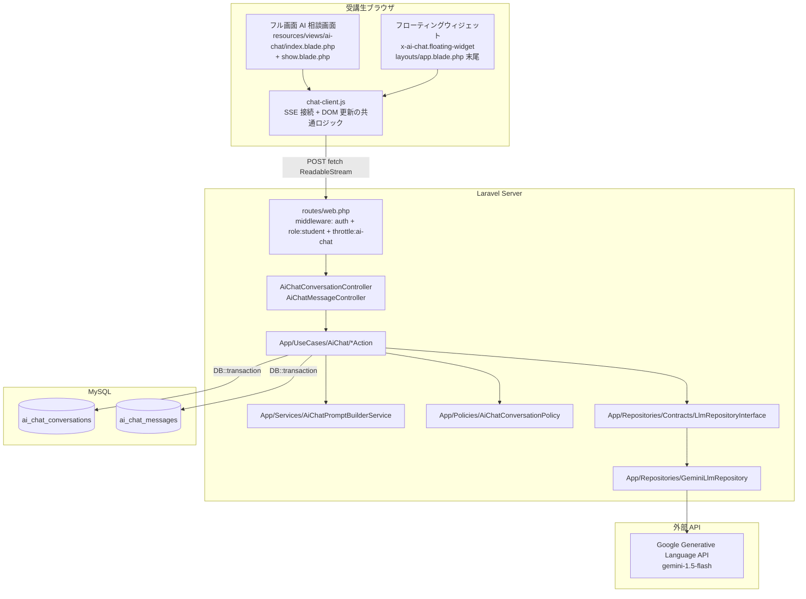
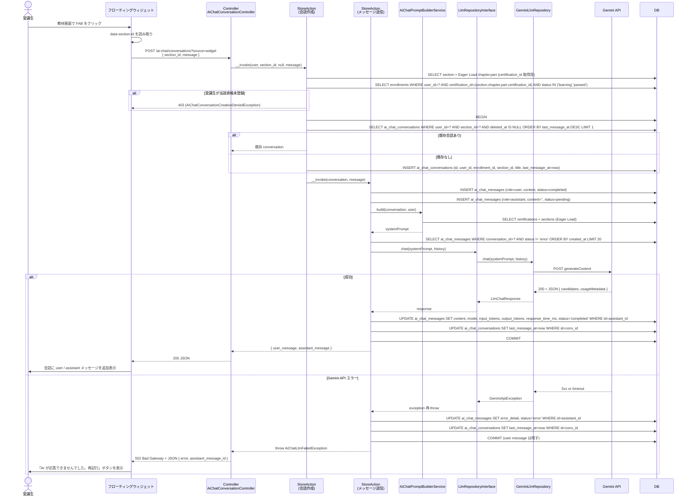
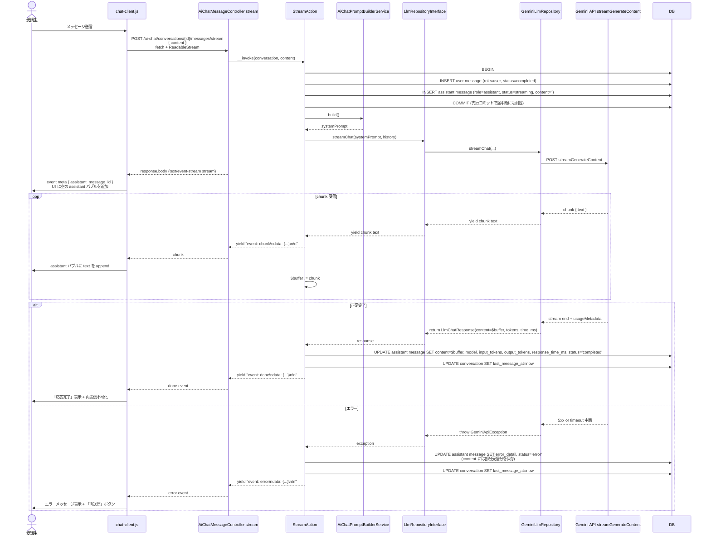
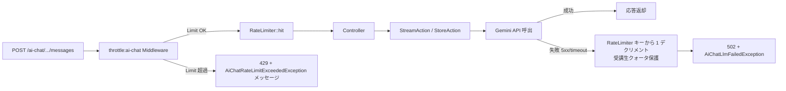
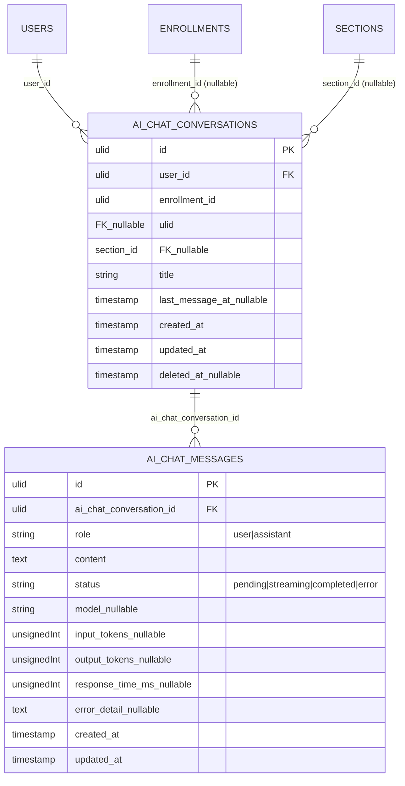
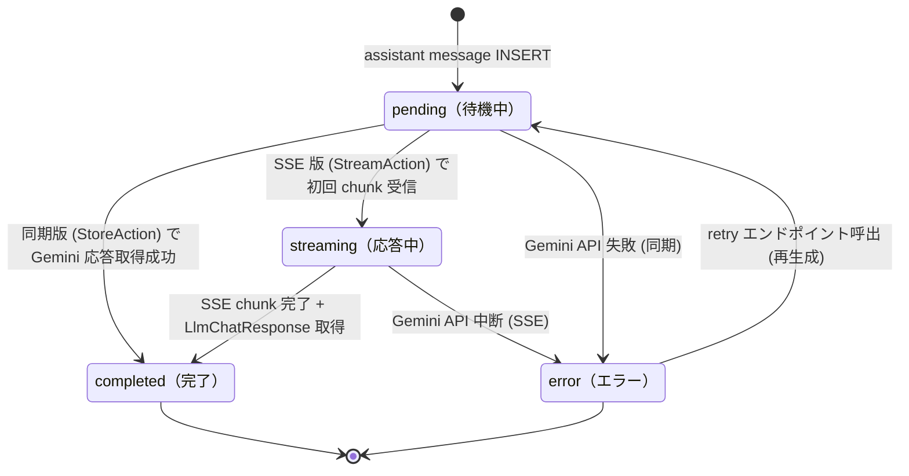

# ai-chat 設計

## アーキテクチャ概要

Clean Architecture（軽量版）に従い、Controller → Action → Service / Repository → Eloquent Model の構造で実装する。LLM 呼出は `LlmRepositoryInterface` で抽象化し、Gemini API への HTTP 呼出を `GeminiLlmRepository` に閉じ込める。**フル画面 AI 相談画面** と **フローティングウィジェット** は同じ Controller / Action / Endpoint を共有し、Blade と JS のレイヤーのみ別実装で差別化する。

ストリーミングは Server-Sent Events 形式で `response()->stream()` を使い、Gemini API の `streamGenerateContent` を Generator として yield する。クライアントは `fetch + ReadableStream` で chunk を受信し、`aria-live="polite"` のメッセージリストに逐次追記する（`EventSource` は POST 不可で CSRF 強制困難のため不採用）。



### 主要な設計判断（Why の言語化）

| 論点 | 採用方針 | Why |
|---|---|---|
| LLM 呼出の抽象化 | `LlmRepositoryInterface` + `GeminiLlmRepository` 単一実装 | `backend-repositories.md` 規約「外部 API 依存切り離し」に厳格準拠。将来 OpenAI / Claude への差替を Adapter Pattern で 1 行 binding 切替で可能に。Vercel AI SDK / LangChain の設計と同パターン |
| ストリーミング方式 | SSE（`response()->stream()` + `fetch ReadableStream`） | OpenAI / Anthropic / Google 公式 API の業界標準。Pusher / WebSocket は LLM 用途で過剰、`notification` Feature の Broadcasting と題材重複も避ける |
| メッセージモデル | `role` enum 分離（OpenAI 形式） | LangChain / OpenAI SDK / Vercel AI SDK の業界標準。COACHTECH 流の `input/output` ペアより柔軟。受講生も OpenAI / Claude API 経験との橋渡しが効く |
| Section コンテキスト注入 | `ai_chat_conversations.section_id` nullable FK + `AiChatPromptBuilderService` で本文埋め込み | Khan Academy Khanmigo / Notion AI の標準パターン。完全 RAG（Embedding + vector）は MySQL ベースの本プロジェクトで過剰、`section_id` 1 件のみで十分実用的 |
| ウィジェット / フル画面の責務 | 同じ Controller / Action / Endpoint、Blade と JS のみ分離 | コード重複を排除。SSE 接続ロジックは `chat-client.js` で一元化、`floating-widget.js` と `full-screen.js` は UI 制御のみに専念 |
| プロンプト管理 | `config/ai-chat.php` で静的管理、Service で動的変数組立 | LangChain / Vercel AI SDK の業界標準。DB 管理（COACHTECH 流 `AiChatbotPrompt` + admin UI）は教育 PJ スコープ過剰、AB テスト等の運用要件もない |
| Rate Limit | Laravel `RateLimiter::for()` + `throttle:ai-chat` ミドルウェア + Gemini エラー時の補正カウント | Laravel 10+ 公式推奨。DB カウント方式はキャッシュ非利用で非効率。受講生の Gemini 無料枠保護のため、API 失敗時にカウンタを戻す補正ロジックを併用 |
| 同期版 → SSE 版の段階分け | tasks.md で Step を分離（Step N: 同期、Step N+1: SSE 化） | 受講生視点で「外部 API 連携の最小サイクル」を先に体験し、UX 拡張として SSE を上乗せ。デバッグ容易性 + 学習曲線のなだらか化 |

## システムフロー

### 会話作成 + 同期メッセージ送信フロー（B-1 Step N）



### SSE ストリーミングフロー（B-1 Step N+1）



### Rate Limit カウント補正フロー



> Note: Laravel 標準の `throttle` ミドルウェアは「リクエスト到達」でカウントするため、Gemini 失敗時にデクリメントするには `RateLimiter::availableIn()` 等の Facade を Action 内から直接呼ぶ補正ロジックを併用する。`cache.default` (`redis` or `database`) のキーを直接操作する。

## データモデル

### Eloquent モデル

- **`AiChatConversation`** — 会話。`HasUlids` + `SoftDeletes`。`belongsTo(User::class)` + `belongsTo(Enrollment::class)` + `belongsTo(Section::class)` + `hasMany(AiChatMessage::class)`。
- **`AiChatMessage`** — メッセージ。`HasUlids`（SoftDeletes 不要、cascade で削除）。`belongsTo(AiChatConversation::class)`。

### ER 図



### 主要カラム + Enum

| Model | Enum | 値 | 日本語ラベル |
|---|---|---|---|
| `AiChatMessage.role` | `AiChatMessageRole` | `User` `Assistant` | `あなた` `AI` |
| `AiChatMessage.status` | `AiChatMessageStatus` | `Pending` `Streaming` `Completed` `Error` | `待機中` `応答中` `完了` `エラー` |

### インデックス・制約

- `ai_chat_conversations`:
  - `user_id` 単独 FK + INDEX
  - `(user_id, last_message_at DESC)` 複合 INDEX — 一覧画面の並び順用
  - `(user_id, section_id)` 複合 INDEX — フローティングウィジェットの既存会話再開検索用
  - `enrollment_id` FK + `onDelete('set null')` — Enrollment 削除時に会話を保持
  - `section_id` FK + `onDelete('set null')` — Section 削除時に会話を保持
- `ai_chat_messages`:
  - `ai_chat_conversation_id` FK + `onDelete('cascade')` + INDEX
  - `(ai_chat_conversation_id, created_at)` 複合 INDEX — 会話内メッセージ取得用

## 状態遷移

### AiChatMessage.status

`assistant` role のみ意味を持つ。`user` role は INSERT 直後に `completed` 固定。



## コンポーネント

### Controller

`app/Http/Controllers/`:

- **`AiChatConversationController`** — 会話 CRUD
  - `index(IndexAction $action)` → `ai-chat/index` ビュー
  - `show(AiChatConversation $conversation, ShowAction $action)` → `ai-chat/show` ビュー（Policy `view`）
  - `store(StoreRequest $request, StoreAction $action)` → 303 redirect or 201 JSON（Policy `create`）
  - `update(AiChatConversation $conversation, UpdateRequest $request, UpdateAction $action)` → 204 No Content（Policy `update`）
  - `destroy(AiChatConversation $conversation, DestroyAction $action)` → 204 No Content（Policy `delete`）
- **`AiChatMessageController`** — メッセージ送信
  - `store(AiChatConversation $conversation, StoreRequest $request, StoreAction $action)` — 同期送信、200 JSON（Policy `view` で当該会話アクセス権を確認）
  - `stream(AiChatConversation $conversation, StreamRequest $request, StreamAction $action)` — SSE ストリーミング、`response()->stream()` で text/event-stream 配信
  - `retry(AiChatMessage $message, RetryAction $action)` — error 状態メッセージの再生成（Policy `update` で会話オーナーシップを確認）

すべての Controller は `EnsureUserRole:student` Middleware 適用済。

### Action

`app/UseCases/AiChat/`:

```php
// app/UseCases/AiChat/IndexAction.php
class IndexAction
{
    public function __invoke(User $user, int $perPage = 20): LengthAwarePaginator
    {
        return $user->aiChatConversations()
            ->with(['enrollment.certification', 'section', 'latestMessage'])
            ->whereNull('deleted_at')
            ->orderByDesc('last_message_at')
            ->paginate($perPage)
            ->withQueryString();
    }
}

// app/UseCases/AiChat/ShowAction.php
class ShowAction
{
    public function __invoke(AiChatConversation $conversation): AiChatConversation
    {
        return $conversation->load([
            'enrollment.certification',
            'section.chapter.part',
            'messages' => fn ($q) => $q->orderBy('created_at'),
        ]);
    }
}

// app/UseCases/AiChat/StoreAction.php
class StoreAction
{
    public function __construct(
        private \App\UseCases\AiChatMessage\StoreAction $messageStore,
    ) {}

    /**
     * 会話を作成する。section_id 指定時かつ source=widget の場合は既存再開を許容。
     *
     * @throws AiChatConversationCreationDeniedException 受講生が当該資格未登録
     */
    public function __invoke(
        User $user,
        ?string $enrollmentId,
        ?string $sectionId,
        ?string $initialMessage,
        bool $reuseExisting = false,
    ): AiChatConversation;
}

// app/UseCases/AiChat/UpdateAction.php
class UpdateAction
{
    public function __invoke(AiChatConversation $conversation, array $validated): AiChatConversation;
}

// app/UseCases/AiChat/DestroyAction.php
class DestroyAction
{
    public function __invoke(AiChatConversation $conversation): void
    {
        $conversation->delete();
    }
}
```

```php
// app/UseCases/AiChatMessage/StoreAction.php
class StoreAction
{
    public function __construct(
        private LlmRepositoryInterface $llm,
        private AiChatPromptBuilderService $promptBuilder,
        private AiChatRateLimiterService $rateLimiter,
    ) {}

    /**
     * 同期メッセージ送信。user message + assistant message を DB に INSERT し、
     * Gemini API を呼び出して assistant message を completed / error に UPDATE する。
     *
     * @throws AiChatLlmFailedException Gemini API 呼出失敗
     * @throws AiChatRateLimitExceededException 日次上限超過（Middleware で先にチェックされるが防衛的に Action 側でも確認）
     */
    public function __invoke(AiChatConversation $conversation, string $content): array;
    // 戻り値: ['user_message' => AiChatMessage, 'assistant_message' => AiChatMessage]
}

// app/UseCases/AiChatMessage/StreamAction.php
class StreamAction
{
    public function __construct(
        private LlmRepositoryInterface $llm,
        private AiChatPromptBuilderService $promptBuilder,
        private AiChatRateLimiterService $rateLimiter,
    ) {}

    /**
     * SSE ストリーミング送信。Generator を返し、Controller の response()->stream() が yield された SSE event を flush する。
     *
     * yield する SSE event:
     *   - "event: meta\ndata: {...}\n\n"
     *   - "event: chunk\ndata: {...}\n\n"  (複数回)
     *   - "event: done\ndata: {...}\n\n"
     *   - "event: error\ndata: {...}\n\n"  (エラー時)
     */
    public function __invoke(AiChatConversation $conversation, string $content): \Generator;
}

// app/UseCases/AiChatMessage/RetryAction.php
class RetryAction
{
    public function __construct(
        private StoreAction $store,
    ) {}

    /**
     * error 状態の assistant message を再生成する。
     *
     * @throws AiChatMessageNotRetryableException status が error でない
     */
    public function __invoke(AiChatMessage $message): AiChatMessage;
}
```

`StoreAction`（会話）と `StoreAction`（メッセージ）は同名だが namespace で区別（`App\UseCases\AiChat\StoreAction` / `App\UseCases\AiChatMessage\StoreAction`）。Controller method 名 = Action クラス名規約（`backend-usecases.md`）に厳格準拠。

### Service

`app/Services/`:

- **`AiChatPromptBuilderService`** — システムプロンプトを動的に組み立てる
  - `build(AiChatConversation $conversation, User $user): string`
  - 内部処理:
    1. `config('ai-chat.system_prompt_template')` を読み込む
    2. プレースホルダ `{user_name}` / `{certification_name}` / `{section_context}` / `{current_term}` を置換
    3. `section_id` 紐付け時、`Section.body`（Markdown）を `{section_context}` に埋め込み（HTML 変換せず Markdown のまま、Gemini が解釈する）
    4. トークン数チェック: `config('ai-chat.max_context_tokens', 30000)` を超える場合は履歴を古い順に切り詰める（粗い概算: 1 文字 = 1 トークンで計算）

- **`AiChatRateLimiterService`** — Rate Limit のカウント補正
  - `decrement(User $user): void` — Gemini エラー時に呼んでカウンタを 1 戻す
  - `availableIn(User $user): int` — 次のリセットまでの秒数
  - 内部実装: `RateLimiter::for('ai-chat', ...)` で定義したキーを `Cache` 経由で直接操作

### Repository

`app/Repositories/Contracts/LlmRepositoryInterface.php`:

```php
namespace App\Repositories\Contracts;

use App\ValueObjects\LlmChatResponse;

interface LlmRepositoryInterface
{
    /**
     * 同期チャット呼出。完全な応答を返す。
     *
     * @param array $messages [{ role: 'user'|'assistant', content: string }, ...]
     * @throws LlmApiException
     */
    public function chat(string $systemPrompt, array $messages, ?string $model = null): LlmChatResponse;

    /**
     * ストリーミングチャット呼出。chunk text を yield する Generator を返す。
     * Generator が return した時の値は LlmChatResponse（全文 + メタ情報）。
     *
     * @return \Generator yields string (chunk text), returns LlmChatResponse
     * @throws LlmApiException
     */
    public function streamChat(string $systemPrompt, array $messages, ?string $model = null): \Generator;
}
```

`app/ValueObjects/LlmChatResponse.php`:

```php
namespace App\ValueObjects;

final class LlmChatResponse
{
    public function __construct(
        public readonly string $content,
        public readonly string $model,
        public readonly int $inputTokens,
        public readonly int $outputTokens,
        public readonly int $responseTimeMs,
    ) {}
}
```

`app/Repositories/GeminiLlmRepository.php`:

```php
namespace App\Repositories;

use App\Repositories\Contracts\LlmRepositoryInterface;
use App\Exceptions\AiChat\AiChatLlmApiException;
use App\ValueObjects\LlmChatResponse;
use Illuminate\Support\Facades\Http;

class GeminiLlmRepository implements LlmRepositoryInterface
{
    public function __construct(
        private string $endpoint,
        private string $apiKey,
        private string $defaultModel,
    ) {}

    public function chat(string $systemPrompt, array $messages, ?string $model = null): LlmChatResponse
    {
        $start = microtime(true);
        $model = $model ?? $this->defaultModel;

        $response = Http::retry(2, 100)
            ->timeout(30)
            ->post("{$this->endpoint}/models/{$model}:generateContent?key={$this->apiKey}", [
                'systemInstruction' => ['parts' => [['text' => $systemPrompt]]],
                'contents' => $this->formatMessages($messages),
            ]);

        if ($response->failed()) {
            throw new AiChatLlmApiException(
                "Gemini API failed: HTTP {$response->status()}",
                $response->status(),
            );
        }

        $json = $response->json();
        return new LlmChatResponse(
            content: $json['candidates'][0]['content']['parts'][0]['text'] ?? '',
            model: $model,
            inputTokens: $json['usageMetadata']['promptTokenCount'] ?? 0,
            outputTokens: $json['usageMetadata']['candidatesTokenCount'] ?? 0,
            responseTimeMs: (int) ((microtime(true) - $start) * 1000),
        );
    }

    public function streamChat(string $systemPrompt, array $messages, ?string $model = null): \Generator
    {
        // streamGenerateContent + alt=sse でストリーミング、各 chunk から text を抽出して yield
        // 完了時に return new LlmChatResponse(...)
        // エラー時は AiChatLlmApiException throw
    }

    private function formatMessages(array $messages): array { /* OpenAI形式 → Gemini contents 形式へ変換 */ }
}
```

`AppServiceProvider::register()`:

```php
$this->app->bind(LlmRepositoryInterface::class, function ($app) {
    return match (config('ai-chat.driver')) {
        'gemini' => new GeminiLlmRepository(
            endpoint: config('ai-chat.gemini.endpoint'),
            apiKey: config('ai-chat.gemini.api_key'),
            defaultModel: config('ai-chat.gemini.model'),
        ),
        default => throw new \RuntimeException('Unsupported LLM driver: ' . config('ai-chat.driver')),
    };
});
```

### Policy

`app/Policies/AiChatConversationPolicy.php`:

```php
class AiChatConversationPolicy
{
    public function viewAny(User $user): bool
    {
        return $user->role === UserRole::Student && $user->status === UserStatus::Active;
    }

    public function view(User $user, AiChatConversation $conversation): bool
    {
        return $conversation->user_id === $user->id;
    }

    public function create(User $user): bool
    {
        return $this->viewAny($user);
    }

    public function update(User $user, AiChatConversation $conversation): bool
    {
        return $conversation->user_id === $user->id;
    }

    public function delete(User $user, AiChatConversation $conversation): bool
    {
        return $conversation->user_id === $user->id;
    }
}
```

admin / coach に対する `before()` バイパスは **意図的に作らない**（admin / coach も他者会話閲覧不可）。

### FormRequest

`app/Http/Requests/AiChat/`:

```php
// StoreRequest.php (会話作成)
class StoreRequest extends FormRequest
{
    public function authorize(): bool
    {
        return $this->user()->can('create', AiChatConversation::class);
    }

    public function rules(): array
    {
        return [
            'enrollment_id' => ['nullable', 'ulid', 'exists:enrollments,id'],
            'section_id' => ['nullable', 'ulid', 'exists:sections,id'],
            'message' => ['nullable', 'string', 'min:1', 'max:2000'],
            'source' => ['nullable', 'string', 'in:widget,full-screen'],
        ];
    }
}

// UpdateRequest.php (タイトル編集)
class UpdateRequest extends FormRequest
{
    public function authorize(): bool
    {
        return $this->user()->can('update', $this->route('conversation'));
    }

    public function rules(): array
    {
        return ['title' => ['required', 'string', 'min:1', 'max:100']];
    }
}
```

`app/Http/Requests/AiChatMessage/`:

```php
// StoreRequest.php (同期送信)
// StreamRequest.php (SSE 送信)
class StoreRequest extends FormRequest
{
    public function authorize(): bool
    {
        return $this->user()->can('view', $this->route('conversation'));
    }

    public function rules(): array
    {
        return ['content' => ['required', 'string', 'min:1', 'max:2000']];
    }
}
```

### Route

`routes/web.php`（[[auth]] の `auth` middleware group 内）:

```php
Route::middleware(['auth', 'role:student'])->prefix('ai-chat')->name('ai-chat.')->group(function () {
    // 会話 CRUD
    Route::get('/', [AiChatConversationController::class, 'index'])->name('index');
    Route::get('/conversations/{conversation}', [AiChatConversationController::class, 'show'])->name('conversations.show');
    Route::post('/conversations', [AiChatConversationController::class, 'store'])->name('conversations.store');
    Route::patch('/conversations/{conversation}', [AiChatConversationController::class, 'update'])->name('conversations.update');
    Route::delete('/conversations/{conversation}', [AiChatConversationController::class, 'destroy'])->name('conversations.destroy');

    // メッセージ送信（throttle:ai-chat で日次上限ガード）
    Route::middleware('throttle:ai-chat')->group(function () {
        Route::post('/conversations/{conversation}/messages', [AiChatMessageController::class, 'store'])->name('messages.store');
        Route::post('/conversations/{conversation}/messages/stream', [AiChatMessageController::class, 'stream'])->name('messages.stream');
        Route::post('/messages/{message}/retry', [AiChatMessageController::class, 'retry'])->name('messages.retry');
    });
});
```

`config('ai-chat.enabled') === false` の場合は **ルート登録自体をスキップ**（`if (config('ai-chat.enabled')) { Route::middleware(...)->group(...); }`）。

### Middleware（Rate Limit 定義）

`app/Providers/RouteServiceProvider.php` の `configureRateLimiting()`:

```php
RateLimiter::for('ai-chat', function (Request $request) {
    return Limit::perDay(config('ai-chat.daily_message_limit', 50))
        ->by($request->user()->id)
        ->response(function () {
            throw new AiChatRateLimitExceededException();
        });
});
```

`config('ai-chat.daily_message_limit')` の値は `.env` の `AI_CHAT_DAILY_MESSAGE_LIMIT` で上書き可能。

### Config

`config/ai-chat.php`（新規作成）:

```php
return [
    'enabled' => env('AI_CHAT_ENABLED', true),
    'driver' => env('AI_CHAT_DRIVER', 'gemini'),
    'streaming_enabled' => env('AI_CHAT_STREAMING_ENABLED', true),

    'gemini' => [
        'endpoint' => env('GEMINI_API_ENDPOINT', 'https://generativelanguage.googleapis.com/v1beta'),
        'api_key' => env('GEMINI_API_KEY'),
        'model' => env('GEMINI_MODEL', 'gemini-1.5-flash'),
    ],

    'daily_message_limit' => (int) env('AI_CHAT_DAILY_MESSAGE_LIMIT', 50),
    'history_window' => (int) env('AI_CHAT_HISTORY_WINDOW', 20),
    'max_context_tokens' => (int) env('AI_CHAT_MAX_CONTEXT_TOKENS', 30000),

    'system_prompt_template' => <<<'PROMPT'
あなたは Certify LMS の学習支援アシスタントです。
資格試験の合格を目標としている受講生「{user_name}」さんをサポートしてください。

現在の学習状況:
- 対象資格: {certification_name}
- 学習段階: {current_term}

{section_context}

応答方針:
- 必ず日本語で回答してください。
- 正答の暗記ではなく、理解を促すヒントや解説を心がけてください。
- 不適切・差別的・違法な要求には応じないでください。
- 受講生が読んでいる教材の文脈がある場合、その内容を踏まえて回答してください。
PROMPT,
];
```

`config/logging.php` に新規 channel 追加:

```php
'channels' => [
    // ... 既存 channel ...
    'ai-chat' => [
        'driver' => 'daily',
        'path' => storage_path('logs/ai-chat.log'),
        'level' => env('LOG_LEVEL', 'info'),
        'days' => 14,
    ],
],
```

### Exception

`app/Exceptions/AiChat/`:

- **`AiChatConversationCreationDeniedException`** — `AccessDeniedHttpException` 継承（HTTP 403）
  - メッセージ: 「指定された教材の資格に登録していないため、この会話を作成できません。」
  - 発生: `StoreAction`（会話作成）で受講生が当該資格未登録時
- **`AiChatLlmFailedException`** — `HttpException(502)` 継承
  - メッセージ: 「AI が応答できませんでした。しばらく時間をおいて再試行してください。」
  - 発生: `LlmRepositoryInterface::chat()` / `streamChat()` 実装内
- **`AiChatRateLimitExceededException`** — `HttpException(429)` 継承
  - メッセージ: 「本日の利用上限（{limit} 通）に達しました。明日 0:00 以降に再度ご利用ください。」
  - 発生: `RateLimiter::for('ai-chat')` の `response()` クロージャ
- **`AiChatMessageNotRetryableException`** — `UnprocessableEntityHttpException` 継承（HTTP 422）
  - メッセージ: 「このメッセージは再送信できません（エラー状態のメッセージのみ再送信可能です）。」
  - 発生: `RetryAction` が `error` 状態以外のメッセージに対して呼ばれた場合
- **`AiChatNotConfiguredException`** — `HttpException(500)` 継承
  - メッセージ: 「AI 相談機能は現在ご利用いただけません。管理者にお問い合わせください。」
  - 発生: Gemini API キー未設定時、`AppServiceProvider` の Repository binding 時

### Blade ビュー

`resources/views/ai-chat/`:

| ファイル | 役割 |
|---|---|
| `ai-chat/index.blade.php` | フル画面の会話一覧画面。`<x-card>` + テーブル形式で会話一覧、`<x-paginator>` でページネーション、「新規相談」ボタン + 受講中資格セレクト |
| `ai-chat/show.blade.php` | フル画面の会話詳細画面。メッセージリスト（user / assistant バブル）+ 入力フォーム + 「タイトル編集」「削除」ボタン |
| `ai-chat/_partials/message-list.blade.php` | メッセージリスト部分テンプレ（フル画面とウィジェットで共有） |
| `ai-chat/_partials/message-bubble.blade.php` | 1 メッセージのバブル（user / assistant の表示分岐、status バッジ）|
| `ai-chat/_partials/input-form.blade.php` | テキスト入力 + 送信ボタン（フル画面とウィジェットで共有） |

`resources/views/components/ai-chat/`:

| ファイル | 役割 |
|---|---|
| `components/ai-chat/floating-widget.blade.php` | フローティングウィジェット本体（FAB + 折り畳まれたモーダル）|

`layouts/app.blade.php` の末尾:

```blade
@if(config('ai-chat.enabled') && auth()->check() && auth()->user()->role === \App\Enums\UserRole::Student)
    <x-ai-chat.floating-widget
        :section-id="$pageMeta['section_id'] ?? null"
    />
@endif
```

`$pageMeta['section_id']` は教材閲覧画面（[[learning]] Feature）の Controller / View Composer が `view()->share('pageMeta', ['section_id' => $section->id])` で渡す。

### JavaScript

`resources/js/ai-chat/`:

```
resources/js/ai-chat/
├── chat-client.js         # SSE 接続 + 同期送信 + DOM 更新の共通ロジック
├── floating-widget.js     # FAB 制御 + モーダル開閉 + sessionStorage 状態保持
├── full-screen.js         # フル画面画面の追加 UI（タイトル編集モーダル等）
└── message-renderer.js    # メッセージバブル DOM 生成 + Markdown レンダリング（任意）
```

#### `chat-client.js`（業界標準パターン）

```javascript
// resources/js/ai-chat/chat-client.js
import { postJson } from '../utils/fetch-json.js';

export class AiChatClient {
    constructor({ conversationId, onChunk, onDone, onError, onUserMessage }) {
        this.conversationId = conversationId;
        this.onChunk = onChunk;
        this.onDone = onDone;
        this.onError = onError;
        this.onUserMessage = onUserMessage;
    }

    async sendStream(content) {
        const csrf = document.querySelector('meta[name="csrf-token"]').content;
        const response = await fetch(`/ai-chat/conversations/${this.conversationId}/messages/stream`, {
            method: 'POST',
            headers: {
                'Content-Type': 'application/json',
                'X-CSRF-TOKEN': csrf,
                'Accept': 'text/event-stream',
            },
            body: JSON.stringify({ content }),
        });

        if (response.status === 429) {
            this.onError({ type: 'rate-limit', message: 'rate limit' });
            return;
        }
        if (!response.ok) {
            this.onError({ type: 'http', status: response.status });
            return;
        }

        // SSE 解析: response.body.getReader() を loop
        const reader = response.body.getReader();
        const decoder = new TextDecoder();
        let buffer = '';
        let currentEvent = null;

        while (true) {
            const { done, value } = await reader.read();
            if (done) break;
            buffer += decoder.decode(value, { stream: true });
            // "event: xxx\ndata: {...}\n\n" 形式を parse
            // currentEvent + data を組合せて onChunk / onDone / onError 呼出
        }
    }

    async sendSync(content) { /* POST .../messages */ }
}
```

#### `floating-widget.js`

```javascript
// resources/js/ai-chat/floating-widget.js
import { AiChatClient } from './chat-client.js';

document.addEventListener('DOMContentLoaded', () => {
    const fab = document.querySelector('#ai-chat-fab');
    const modal = document.querySelector('#ai-chat-widget-modal');
    if (!fab || !modal) return;

    const sectionId = fab.dataset.sectionId || null;
    let currentConversationId = sessionStorage.getItem('ai-chat:current-conversation-id');

    fab.addEventListener('click', async () => {
        modal.classList.remove('hidden');
        if (!currentConversationId) {
            const conv = await createOrReuseConversation(sectionId);
            currentConversationId = conv.id;
            sessionStorage.setItem('ai-chat:current-conversation-id', conv.id);
        }
        loadMessages(currentConversationId);
    });

    // 送信、フル画面遷移、閉じる等の handler
});
```

業界標準アクセシビリティ:
- FAB は `<button aria-label="AI 相談を開く">` で命名
- モーダルは `role="dialog" aria-modal="true" aria-labelledby="ai-chat-widget-title"` + フォーカストラップ
- メッセージリストは `aria-live="polite"` で SSE chunk を読み上げ可能化
- `Esc` でモーダル閉じる、`Tab` でモーダル内に閉じ込め

## エラーハンドリング

### Controller / Action の境界

- **Policy 拒否**: Controller の `$this->authorize()` で自動 403 → Laravel が `errors/403.blade.php` を表示
- **Section 紐付け資格未登録**: `StoreAction` で `AiChatConversationCreationDeniedException` を throw、Laravel が 403
- **Gemini API 失敗**: `LlmRepositoryInterface` 実装内で `AiChatLlmApiException` を throw、`StoreAction` / `StreamAction` がキャッチして:
  - assistant message を `error` 状態 + `error_detail` に UPDATE
  - `AiChatChatRateLimiterService::decrement()` で Rate Limit カウンタを 1 戻す
  - `Log::channel('ai-chat')->error(...)` で記録
  - `AiChatLlmFailedException` を再 throw（Controller 経由で 502 + JSON）
- **Rate Limit 超過**: Middleware で `AiChatRateLimitExceededException` を throw → 429 + メッセージ
- **CSRF 失効**: Laravel 標準 419 → `errors/419.blade.php` 表示
- **API キー未設定**: `AppServiceProvider::register()` の binding 時に `AiChatNotConfiguredException` を throw、500

### SSE エラー event のクライアント処理

SSE の `event: error` を受信した場合、JS は:
1. メッセージリストの assistant バブルを `error` 状態スタイル（赤背景 + アイコン）に切替
2. 「再送信」ボタンを表示（クリックで `POST /ai-chat/messages/{id}/retry`）
3. Rate Limit 由来の場合は再送信ボタンを表示せず、「明日 0:00 にリセット」を表示

## 関連要件マッピング

| 要件 ID | 実装ポイント |
|---|---|
| REQ-ai-chat-010 | `database/migrations/{date}_create_ai_chat_conversations_table.php` / `App\Models\AiChatConversation`（ULID + SoftDeletes + fillable + casts + リレーション）|
| REQ-ai-chat-011 | `database/migrations/{date}_create_ai_chat_messages_table.php` / `App\Models\AiChatMessage`（ULID + fillable + casts + リレーション）|
| REQ-ai-chat-012 | `App\Enums\AiChatMessageRole` / `App\Enums\AiChatMessageStatus`（`label()` メソッド含む）|
| REQ-ai-chat-013 | `App\UseCases\AiChat\StoreAction::__invoke` 内で `Enrollment` 自動補完 + 未登録時の `AiChatConversationCreationDeniedException` throw |
| REQ-ai-chat-020 | `routes/web.php` の `role:student` Middleware 適用 / `<x-ai-chat.floating-widget>` の Blade 条件レンダリング |
| REQ-ai-chat-021 | `App\Policies\AiChatConversationPolicy`（`view` / `update` / `delete` で `$conversation->user_id === $user->id` 判定、admin/coach バイパスなし）|
| REQ-ai-chat-022 | `App\UseCases\AiChat\StoreAction` 内の Enrollment 検索 / `Enrollment.status IN ('learning', 'passed')` フィルタ |
| REQ-ai-chat-023 | `AiChatConversationPolicy::viewAny` で `$user->status === UserStatus::Active` 判定 + Fortify 認証ガード |
| REQ-ai-chat-030 | `AiChatConversationController::index` / `App\UseCases\AiChat\IndexAction`（Eager Load + paginate + orderByDesc）|
| REQ-ai-chat-031 | `AiChatConversationController::store` / `App\Http\Requests\AiChat\StoreRequest` / `App\UseCases\AiChat\StoreAction`（タイトル自動生成含む）|
| REQ-ai-chat-032 | `AiChatConversationController::update` / `App\Http\Requests\AiChat\UpdateRequest` / `App\UseCases\AiChat\UpdateAction` |
| REQ-ai-chat-033 | `AiChatConversationController::destroy` / `App\UseCases\AiChat\DestroyAction` + Model の `SoftDeletes` trait |
| REQ-ai-chat-034 | `App\UseCases\AiChat\StoreAction::__invoke` の `$reuseExisting=true` 経路 + `(user_id, section_id)` INDEX |
| REQ-ai-chat-040 | `AiChatMessageController::store` / `App\Http\Requests\AiChatMessage\StoreRequest` / `App\UseCases\AiChatMessage\StoreAction`（`DB::transaction` 内で user + assistant INSERT → Gemini 呼出 → UPDATE）|
| REQ-ai-chat-041 | `AiChatMessageController::stream` / `App\UseCases\AiChatMessage\StreamAction`（Generator + `response()->stream()`）/ `config/ai-chat.php` `streaming_enabled` チェック |
| REQ-ai-chat-042 | `StreamAction` 内の先行 DB::transaction COMMIT + Generator try/finally でメッセージ最終状態を保証 |
| REQ-ai-chat-043 | `AiChatMessageController::retry` / `App\UseCases\AiChatMessage\RetryAction` + `AiChatMessageNotRetryableException` |
| REQ-ai-chat-050 | `App\Services\AiChatPromptBuilderService::build` + `config/ai-chat.php` `system_prompt_template` |
| REQ-ai-chat-051 | `AiChatPromptBuilderService` 内の履歴取得クエリ（`status != 'error'` フィルタ + `history_window` LIMIT）|
| REQ-ai-chat-060 | `App\Providers\RouteServiceProvider::configureRateLimiting()` の `RateLimiter::for('ai-chat', ...)` / `routes/web.php` の `throttle:ai-chat` |
| REQ-ai-chat-061 | `App\Services\AiChatRateLimiterService::decrement` + Action 内の Gemini 失敗時呼出 |
| REQ-ai-chat-070 | `resources/views/components/ai-chat/floating-widget.blade.php` + `resources/views/layouts/app.blade.php` 末尾の `@if` 条件レンダリング |
| REQ-ai-chat-071 | [[learning]] Feature の Section 表示 Controller が `view()->share('pageMeta', ['section_id' => $id])` で渡す + Widget Blade が `data-section-id` 属性として出力 + `floating-widget.js` が読み取り |
| REQ-ai-chat-072 | `floating-widget.blade.php` のセミモーダル CSS（`fixed bottom-4 right-4 w-96 md:h-[600px] md:inset-auto inset-0` 等）|
| REQ-ai-chat-073 | `floating-widget.js` の `sessionStorage` 操作（`ai-chat:current-conversation-id` キー）|
| REQ-ai-chat-074 | `floating-widget.js` のフル画面遷移ボタン handler（`window.location = ...`）|
| REQ-ai-chat-080 | `App\Repositories\Contracts\LlmRepositoryInterface` / `App\ValueObjects\LlmChatResponse` / `App\Repositories\GeminiLlmRepository` / `App\Providers\AppServiceProvider::register` の binding |
| REQ-ai-chat-081 | `GeminiLlmRepository::chat` / `streamChat`（`Illuminate\Support\Facades\Http` + `->retry(2, 100)->timeout(30)`）|
| REQ-ai-chat-082 | `AppServiceProvider::register` の binding closure 内で `config('ai-chat.gemini.api_key')` 空チェック → `AiChatNotConfiguredException` |
| REQ-ai-chat-090 | `routes/web.php` の `if (config('ai-chat.enabled'))` ガード + サイドバー Blade の `Route::has` ガード + Widget の `@if(config('ai-chat.enabled'))` ガード |
| REQ-ai-chat-091 | `config/logging.php` の `ai-chat` channel 追加 + `StoreAction` / `StreamAction` / `GeminiLlmRepository` の `Log::channel('ai-chat')->info/error` 呼出 |
| REQ-ai-chat-092 | （実装なし、明示的スコープ外として spec のみ記述）|
| NFR-ai-chat-001 | Eager Load（`with(['enrollment.certification', 'section', 'latestMessage'])`）+ DB INDEX（`(user_id, last_message_at)`）+ Eloquent `paginate` |
| NFR-ai-chat-002 | （実装なし、運用上の注意点として spec のみ記述、Sail デフォルト 5 worker 制約）|
| NFR-ai-chat-003 | `@csrf` Blade + `X-CSRF-TOKEN` JS ヘッダ + `fetch ReadableStream`（EventSource 不採用）+ `{{ }}` 自動エスケープ + `.env` の API キー管理 |
| NFR-ai-chat-004 | `tests/Feature/Http/AiChat/*Test.php` / `tests/Feature/UseCases/AiChat/*Test.php` / `tests/Unit/Services/AiChatPromptBuilderServiceTest.php` / `tests/Unit/Repositories/GeminiLlmRepositoryTest.php`（`Http::fake()` + `Http::fakeSequence()`）|
| NFR-ai-chat-005 | `config/ai-chat.php` の `daily_message_limit` 50 既定 + `max_context_tokens` 30000 既定 + `AiChatPromptBuilderService` 内の履歴切詰めロジック |
| NFR-ai-chat-006 | Blade / システムプロンプトの全文を日本語で記述、`system_prompt_template` に「必ず日本語で回答してください」を明示 |
| NFR-ai-chat-007 | `floating-widget.blade.php` の `aria-label` / `role="dialog"` / `aria-live="polite"` / `Esc` key handler / フォーカストラップ JS |
