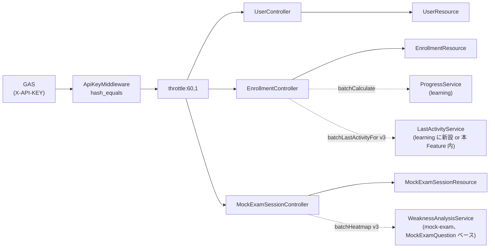
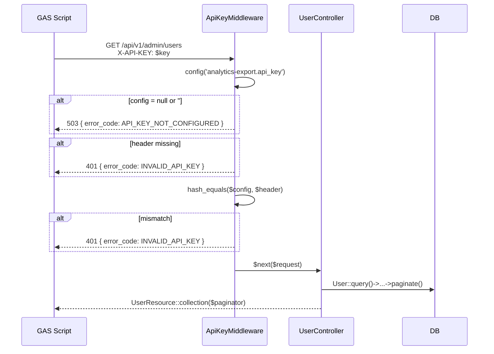
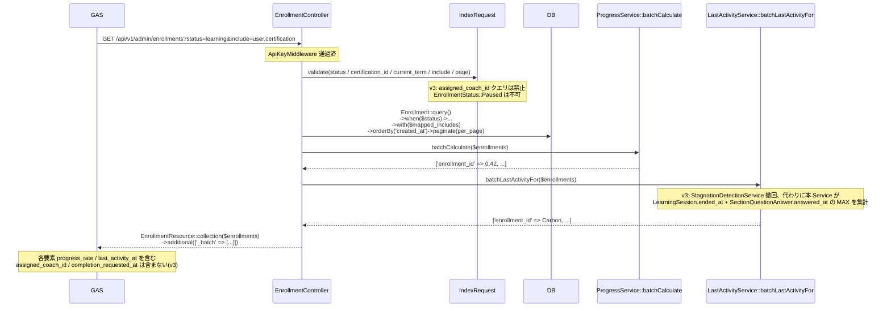
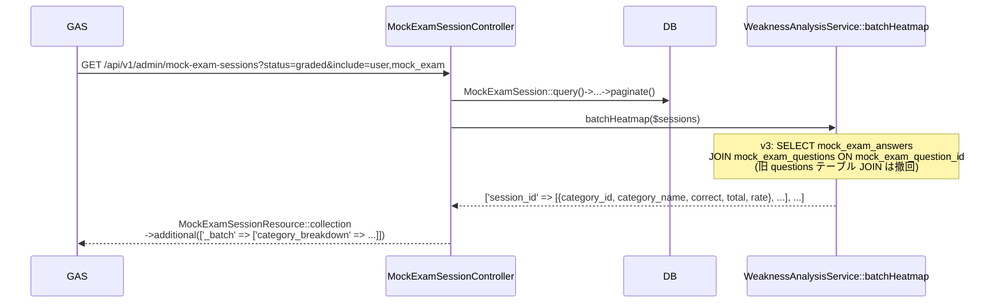

# analytics-export 設計

> **v3 改修反映**(2026-05-16):
> - `Enrollment.assigned_coach_id` カラム削除に伴い、**`?assigned_coach_id` クエリ撤回** / `EnrollmentResource` から `assigned_coach_id` / `assigned_coach`(whenLoaded) / `completion_requested_at` 削除
> - `User.status` enum 拡張(`graduated` 値追加)に伴い、**`?status=graduated` フィルタ追加**
> - `User.plan_*` カラム追加に伴い、`UserResource` に `plan_id` / `plan_started_at` / `plan_expires_at` / `max_meetings` 追加
> - 旧 `questions` テーブル廃止 → `section_questions` / `mock_exam_questions` 分離影響: **`WeaknessAnalysisService::batchHeatmap` の集計クエリを `MockExamAnswer JOIN MockExamQuestion` ベースに修正**(旧 `Question` JOIN 撤回)
> - `Enrollment.status` から `paused` 撤回 → 3 値(`learning` / `passed` / `failed`)に縮減
> - **`StagnationDetectionService::batchLastActivityFor` 撤回** → 本 Feature 内に `last_activity_at` バッチ集計を内製 or [[learning]] に新規 `LastActivityService::batchLastActivityFor` を持つ

## アーキテクチャ概要

`X-API-KEY` ヘッダで保護された読み取り専用 JSON API を 3 本(`users` / `enrollments` / `mock-exam-sessions`)提供する。Laravel コミュニティ標準の **薄い Controller + JSON Resource + IndexRequest + 独自 Middleware** 構成で、Clean Architecture の Action / Service / Policy 層は本 Feature では新設しない。`enrollments.progress_rate` / `last_activity_at` および `mock-exam-sessions.category_breakdown` 算出のために [[learning]] / [[mock-exam]] 所有 Service の `batch*` 系メソッドを読み取り再利用。Web セッション / Sanctum / Fortify は一切利用せず、`ApiKeyMiddleware` の `hash_equals` 比較のみで認可する。

### 全体構造



### 1. API キー認証フロー



### 2. /api/v1/admin/enrollments(v3 で assigned_coach_id 撤回)



### 3. /api/v1/admin/mock-exam-sessions(v3 で MockExamQuestion ベース)



## コンポーネント

### Config

`config/analytics-export.php`(新規):
```php
return ['api_key' => env('ANALYTICS_API_KEY')];
```

### Middleware

`app/Http/Middleware/ApiKeyMiddleware`:
```php
public function handle(Request $request, Closure $next): Response
{
    $configured = config('analytics-export.api_key');
    if (empty($configured)) {
        return response()->json([
            'message' => 'API キー未設定',
            'error_code' => 'API_KEY_NOT_CONFIGURED',
            'status' => 503,
        ], 503);
    }
    $provided = $request->header('X-API-KEY');
    if (empty($provided) || !hash_equals($configured, $provided)) {
        return response()->json([
            'message' => 'API キーが無効です。',
            'error_code' => 'INVALID_API_KEY',
            'status' => 401,
        ], 401);
    }
    return $next($request);
}
```

`Kernel.php` の `$middlewareAliases` に `'api.key' => ApiKeyMiddleware::class` 登録。

### Controller

`app/Http/Controllers/Api/Admin/`:

```php
class UserController
{
    public function index(IndexRequest $request): AnonymousResourceCollection
    {
        return UserResource::collection(
            User::query()
                ->where('status', '!=', UserStatus::Withdrawn)
                ->whereNull('deleted_at')
                ->when($request->validated('role'), fn ($q, $v) => $q->where('role', $v))
                ->when($request->validated('status'), fn ($q, $v) => $q->where('status', $v))
                ->orderBy('created_at')
                ->paginate($request->validated('per_page', 100))
        );
    }
}

class EnrollmentController
{
    public function __construct(
        private ProgressService $progressService,
        private LastActivityService $lastActivityService,  // v3 で StagnationDetectionService から差し替え
    ) {}

    public function index(IndexRequest $request): AnonymousResourceCollection
    {
        $enrollments = Enrollment::query()
            ->whereNull('deleted_at')
            ->when($request->validated('status'), fn ($q, $v) => $q->where('status', $v))
            ->when($request->validated('certification_id'), fn ($q, $v) => $q->where('certification_id', $v))
            ->when($request->validated('current_term'), fn ($q, $v) => $q->where('current_term', $v))
            // v3: assigned_coach_id クエリは撤回
            ->with($this->mapIncludes($request->resolveIncludes()))
            ->orderBy('created_at')
            ->paginate($request->validated('per_page', 100));

        $progressMap = $this->progressService->batchCalculate($enrollments->getCollection());
        $activityMap = $this->lastActivityService->batchLastActivityFor($enrollments->getCollection());

        return EnrollmentResource::collection($enrollments)->additional([
            '_batch' => ['progress_rate' => $progressMap, 'last_activity_at' => $activityMap],
        ]);
    }

    private function mapIncludes(array $resolved): array
    {
        $map = ['user' => 'user', 'certification' => 'certification'];
        // v3: 'assigned_coach' マッピングは撤回
        return array_values(array_intersect_key($map, array_flip($resolved)));
    }
}

class MockExamSessionController
{
    public function __construct(private WeaknessAnalysisService $weaknessService) {}

    public function index(IndexRequest $request): AnonymousResourceCollection
    {
        $sessions = MockExamSession::query()
            ->whereNull('deleted_at')
            ->when($request->validated('mock_exam_id'), fn ($q, $v) => $q->where('mock_exam_id', $v))
            ->when(!is_null($request->validated('pass')), fn ($q) => $q->where('pass', $request->validated('pass')))
            ->when($request->validated('status'), fn ($q, $v) => $q->where('status', $v))
            ->when($request->validated('from'), fn ($q, $v) => $q->where('submitted_at', '>=', $v))
            ->when($request->validated('to'), fn ($q, $v) => $q->where('submitted_at', '<=', $v))
            ->with($this->mapIncludes($request->resolveIncludes()))
            ->orderBy('created_at')
            ->paginate($request->validated('per_page', 100));

        // v3: batchHeatmap は MockExamQuestion JOIN ベース(旧 Question JOIN 撤回)
        $heatmapMap = $this->weaknessService->batchHeatmap($sessions->getCollection());

        return MockExamSessionResource::collection($sessions)->additional([
            '_batch' => ['category_breakdown' => $heatmapMap],
        ]);
    }

    private function mapIncludes(array $resolved): array
    {
        $map = ['user' => 'user', 'mock_exam' => 'mockExam', 'enrollment' => 'enrollment'];
        return array_values(array_intersect_key($map, array_flip($resolved)));
    }
}
```

### IndexRequest

`app/Http/Requests/Api/Admin/`:

```php
namespace App\Http\Requests\Api\Admin\User;

class IndexRequest extends FormRequest
{
    public function authorize(): bool { return true; }
    public function rules(): array
    {
        return [
            'role' => ['nullable', Rule::enum(UserRole::class)],
            // v3: status enum 拡張、graduated 追加、withdrawn 不可
            'status' => ['nullable', Rule::in([
                UserStatus::Invited->value,
                UserStatus::InProgress->value,
                UserStatus::Graduated->value,
            ])],
            'per_page' => ['nullable', 'integer', 'min:1', 'max:500'],
            'page' => ['nullable', 'integer', 'min:1'],
        ];
    }
}

namespace App\Http\Requests\Api\Admin\Enrollment;

class IndexRequest extends FormRequest
{
    public function rules(): array
    {
        return [
            // v3: EnrollmentStatus は paused 撤回(learning / passed / failed の 3 値のみ)
            'status' => ['nullable', Rule::enum(EnrollmentStatus::class)],
            'certification_id' => ['nullable', 'ulid', 'exists:certifications,id'],
            'current_term' => ['nullable', Rule::enum(TermType::class)],
            // v3: assigned_coach_id rule は撤回
            'include' => ['nullable', 'string'],
            'per_page' => ['nullable', 'integer', 'min:1', 'max:500'],
            'page' => ['nullable', 'integer', 'min:1'],
        ];
    }

    public function resolveIncludes(): array
    {
        $raw = $this->validated('include', '');
        // v3: allowed から 'assigned_coach' 撤回
        $allowed = ['user', 'certification'];
        return array_values(array_intersect(explode(',', $raw), $allowed));
    }
}

namespace App\Http\Requests\Api\Admin\MockExamSession;

class IndexRequest extends FormRequest
{
    public function rules(): array
    {
        return [
            'mock_exam_id' => ['nullable', 'ulid', 'exists:mock_exams,id'],
            'pass' => ['nullable', 'boolean'],
            'status' => ['nullable', Rule::enum(MockExamSessionStatus::class)],
            'from' => ['nullable', 'date_format:Y-m-d'],
            'to' => ['nullable', 'date_format:Y-m-d', 'after_or_equal:from'],
            'include' => ['nullable', 'string'],
            'per_page' => ['nullable', 'integer', 'min:1', 'max:500'],
            'page' => ['nullable', 'integer', 'min:1'],
        ];
    }
}
```

### Resource

`app/Http/Resources/Api/Admin/`:

```php
class UserResource extends JsonResource
{
    public function toArray($request): array
    {
        return [
            'id' => $this->id,
            'name' => $this->name,
            'email' => $this->email,
            'role' => $this->role->value,
            'status' => $this->status->value,
            'last_login_at' => optional($this->last_login_at)?->toIso8601String(),
            // v3 新規: Plan 関連
            'plan_id' => $this->plan_id,
            'plan_started_at' => optional($this->plan_started_at)?->toIso8601String(),
            'plan_expires_at' => optional($this->plan_expires_at)?->toIso8601String(),
            'max_meetings' => $this->max_meetings,
            'created_at' => $this->created_at->toIso8601String(),
            'updated_at' => $this->updated_at->toIso8601String(),
        ];
        // 絶対に含めない: password / remember_token / bio / avatar_url / meeting_url / profile_setup_completed / email_verified_at
    }
}

class EnrollmentResource extends JsonResource
{
    public function toArray($request): array
    {
        $batch = $this->additional['_batch'] ?? [];
        return [
            'id' => $this->id,
            'user_id' => $this->user_id,
            'certification_id' => $this->certification_id,
            // v3: assigned_coach_id / completion_requested_at は含まない
            'status' => $this->status->value,  // learning / passed / failed の 3 値
            'current_term' => $this->current_term->value,
            'exam_date' => $this->exam_date?->format('Y-m-d'),
            'passed_at' => $this->passed_at?->toIso8601String(),
            'progress_rate' => $batch['progress_rate'][$this->id] ?? null,
            'last_activity_at' => $batch['last_activity_at'][$this->id]?->toIso8601String(),
            'created_at' => $this->created_at->toIso8601String(),
            'updated_at' => $this->updated_at->toIso8601String(),
            'user' => UserResource::make($this->whenLoaded('user')),
            'certification' => CertificationResource::make($this->whenLoaded('certification')),
            // v3: 'assigned_coach' は撤回
        ];
    }
}

class MockExamSessionResource extends JsonResource
{
    public function toArray($request): array
    {
        $batch = $this->additional['_batch'] ?? [];
        return [
            'id' => $this->id,
            'user_id' => $this->user_id,
            'mock_exam_id' => $this->mock_exam_id,
            'enrollment_id' => $this->enrollment_id,
            'status' => $this->status->value,
            'total_correct' => $this->total_correct,
            'passing_score_snapshot' => $this->passing_score_snapshot,
            'pass' => $this->pass,
            'started_at' => $this->started_at?->toIso8601String(),
            'submitted_at' => $this->submitted_at?->toIso8601String(),
            'graded_at' => $this->graded_at?->toIso8601String(),
            // v3: category_breakdown は MockExamQuestion ベース
            'category_breakdown' => $batch['category_breakdown'][$this->id] ?? [],
            'created_at' => $this->created_at->toIso8601String(),
            'user' => UserResource::make($this->whenLoaded('user')),
            'mock_exam' => MockExamResource::make($this->whenLoaded('mockExam')),
            'enrollment' => EnrollmentResource::make($this->whenLoaded('enrollment')),
        ];
    }
}

class CertificationResource extends JsonResource
{
    public function toArray($request): array
    {
        return [
            'id' => $this->id,
            'name' => $this->name,
            'category_id' => $this->category_id,
            'difficulty' => $this->difficulty,
            // v3: code / slug / passing_score / total_questions / exam_duration_minutes は含まない
            'description' => $this->description,
        ];
    }
}

class MockExamResource extends JsonResource
{
    public function toArray($request): array
    {
        return [
            'id' => $this->id,
            'certification_id' => $this->certification_id,
            'title' => $this->title,
            'order' => $this->order,
            'is_published' => $this->is_published,
            'passing_score' => $this->passing_score,
            'time_limit_minutes' => $this->time_limit_minutes,
        ];
    }
}
```

### Service の前提

本 Feature が呼ぶ batch 系メソッドは以下が前提:

| Service | メソッド | 所有 Feature | v3 影響 |
|---|---|---|---|
| `ProgressService::batchCalculate` | `array<string, float>` | [[learning]] | 変更なし |
| **`LastActivityService::batchLastActivityFor`(v3 新規)** | `array<string, Carbon>` | [[learning]] | **StagnationDetectionService の機能を移管 / 新設** |
| **`WeaknessAnalysisService::batchHeatmap`(v3 修正)** | `array<string, array>` | [[mock-exam]] | **MockExamAnswer JOIN MockExamQuestion ベース**(旧 Question JOIN 撤回) |

### Route

```php
Route::prefix('v1/admin')
    ->middleware(['api.key', 'throttle:60,1'])
    ->name('api.v1.admin.')
    ->group(function () {
        Route::get('users', [UserController::class, 'index'])->name('users.index');
        Route::get('enrollments', [EnrollmentController::class, 'index'])->name('enrollments.index');
        Route::get('mock-exam-sessions', [MockExamSessionController::class, 'index'])->name('mock-exam-sessions.index');
    });
```

> Web セッション / Sanctum / Fortify は一切使用しない、`api.key + throttle:60,1` のみ。

### Handler

`app/Exceptions/Handler.php::register()` に以下を追加:
- `ThrottleRequestsException` → API では JSON `{ message, error_code: 'RATE_LIMIT_EXCEEDED', status: 429 }`
- `NotFoundHttpException` / `MethodNotAllowedHttpException` → API では JSON 404 / 405

## 関連要件マッピング

| 要件 ID | 実装ポイント |
|---|---|
| REQ-analytics-export-001〜007 | `ApiKeyMiddleware` + `config/analytics-export.php` + `.env.example` |
| REQ-analytics-export-010〜017 | `UserController::index` + `UserResource`(v3 で `plan_*` 追加 / `graduated` filter 追加) |
| REQ-analytics-export-020〜028 | `EnrollmentController::index` + `EnrollmentResource`(v3 で `assigned_coach_id` 撤回) + `ProgressService::batchCalculate` + `LastActivityService::batchLastActivityFor` |
| REQ-analytics-export-027 | **削除**(v3 撤回): `?assigned_coach_id` クエリ提供しない |
| REQ-analytics-export-030〜039 | `MockExamSessionController::index` + `MockExamSessionResource`(v3 で `category_breakdown` を `MockExamQuestion` JOIN ベース) + `WeaknessAnalysisService::batchHeatmap` |
| REQ-analytics-export-040〜045 | `routes/api.php` の `prefix + middleware` group + Handler |
| REQ-analytics-export-060〜063 | `関連ドキュメント/analytics-export/gas-template.gs` + `README.md` |
| REQ-analytics-export-070〜072 | API キーのみ認可、ユーザー単位ロールなし |
| NFR-analytics-export-001〜011 | 各 Resource / Controller / Middleware の実装 |

## テスト戦略

### Feature(`tests/Feature/Http/Api/Admin/`)

- `ApiKeyMiddlewareTest`(キー一致 200 / 欠落 401 / 不一致 401 / config 空 503)
- **`UserIndexTest`(v3 更新)** — 全件取得 / `?role` フィルタ / `?status=graduated` フィルタ(v3 新規) / `?status=withdrawn` で 422 / `?per_page=200` / `?per_page=501` で 422 / **`UserResource` に `plan_id` / `plan_started_at` / `plan_expires_at` / `max_meetings` 含む**(v3) / センシティブカラム除外検証(`password` / `meeting_url` 等) / キー不一致 401
- **`EnrollmentIndexTest`(v3 更新)** — 全件取得 + `progress_rate` / `last_activity_at` 含有 / `?status=learning` / `?status=passed` / `?status=failed` フィルタ / `?status=paused` で 422(v3 撤回) / **`?assigned_coach_id` で 422**(v3 撤回) / **`?include=assigned_coach` 無効化**(v3) / `?include=user,certification` で Eager Loading + JSON 同梱 / N+1 検証 / **`EnrollmentResource` に `assigned_coach_id` / `completion_requested_at` 含まない**(v3) / キー不一致 401
- **`MockExamSessionIndexTest`(v3 更新)** — 全件取得 + `category_breakdown` 含有(graded のみ非空) / **`category_breakdown` の各要素が `category_id` / `category_name` / `correct` / `total` / `rate` を持つ**(MockExamQuestion ベース、v3) / `?pass=true` / `?from=Y-m-d&to=Y-m-d` / `?from > to` で 422 / `?include=user,mock_exam,enrollment` / キー不一致 401
- `ThrottleResponseTest`(61 回連投で 429 JSON)
- `NotFoundJsonTest`(`/api/v1/admin/undefined-path` で 404 JSON)
