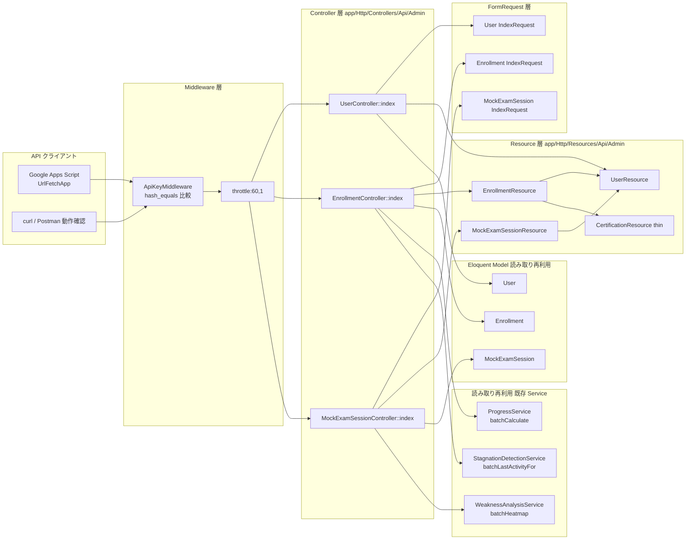
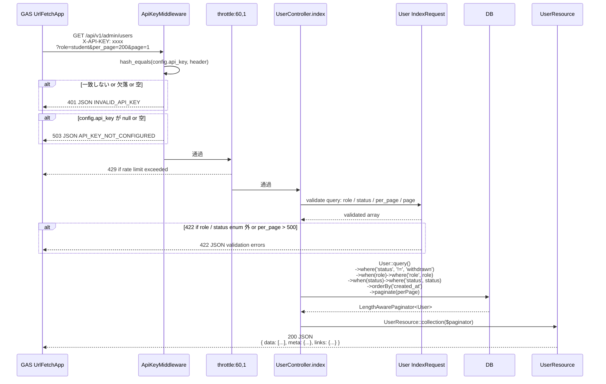
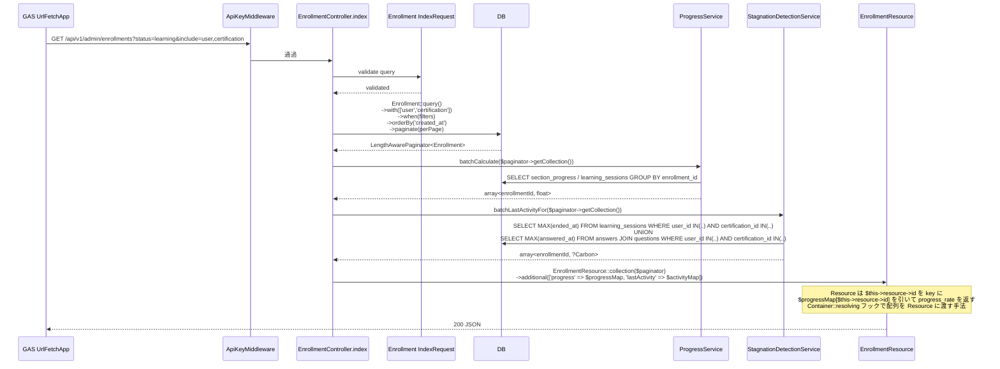
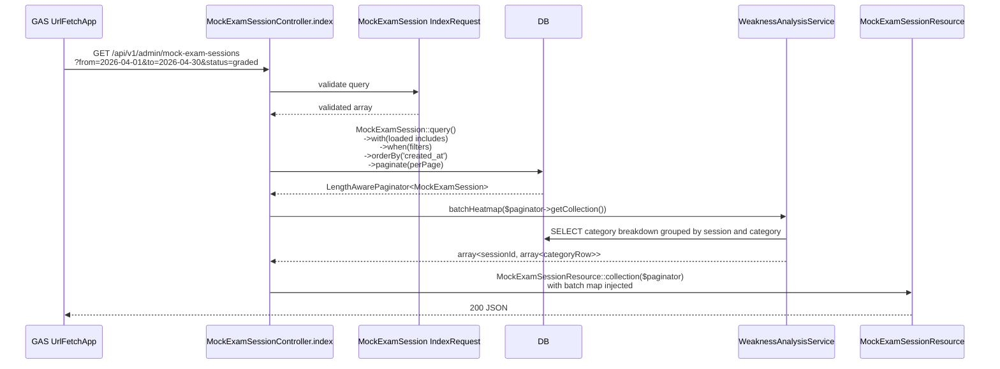
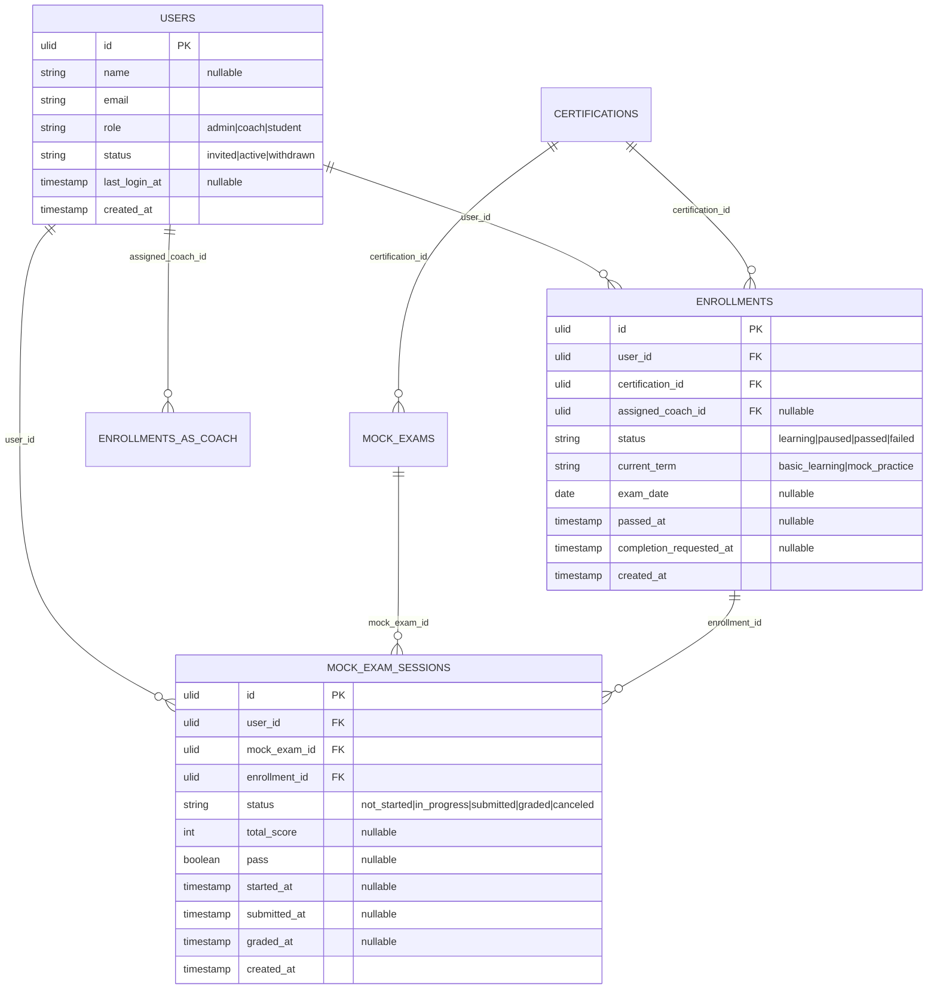

# analytics-export 設計

## アーキテクチャ概要

`X-API-KEY` ヘッダで保護された読み取り専用 JSON API を 3 本（`users` / `enrollments` / `mock-exam-sessions`）提供する。Laravel コミュニティ標準の **薄い Controller + JSON Resource + IndexRequest + 独自 Middleware** 構成で、Clean Architecture の Action / Service / Policy 層は本 Feature では **新設しない**。`enrollments.progress_rate` / `last_activity_at` および `mock-exam-sessions.category_breakdown` 算出のために [[learning]] / [[mock-exam]] 所有 Service の `batch*` 系メソッドを **読み取り再利用** する例外あり。Web セッション / Sanctum / Fortify は一切利用せず、`ApiKeyMiddleware` の `hash_equals` ベース比較のみで認可する。

### 全体構造



### `/api/v1/admin/users` リクエストフロー



### `/api/v1/admin/enrollments` リクエストフロー（バッチ計算ハイライト）



> **Resource への bag 受け渡しパターン**: `additional()` は collection 全体に対するキーで `meta` に出るが、要素単位でないため、本 Feature では Controller 内で **`Resource` を直接コンストラクトする工夫** を採る（後述 `EnrollmentResource::makeWithBatchData()` ファクトリメソッド）。

### `/api/v1/admin/mock-exam-sessions` リクエストフロー



## データモデル

### Eloquent モデル一覧

本 Feature は **独自モデル / Migration / Enum を新設しない**。以下を **読み取り再利用** するのみ:

| Model | 所有 Feature | 用途 |
|---|---|---|
| `User` | [[auth]] / [[user-management]] | `UserResource` の出力ソース、`status != withdrawn` フィルタ条件 |
| `UserRole` Enum | [[auth]] | `?role=` フィルタの enum 値 |
| `UserStatus` Enum | [[auth]] | `?status=` フィルタの enum 値（`Withdrawn` は除外） |
| `Enrollment` | [[enrollment]] | `EnrollmentResource` の出力ソース |
| `EnrollmentStatus` Enum | [[enrollment]] | `?status=` フィルタ |
| `TermType` Enum | [[enrollment]] | `?current_term=` フィルタ |
| `Certification` | [[certification-management]] | `?include=certification` で同梱出力 |
| `MockExam` | [[mock-exam]] | `?include=mock_exam` で同梱出力、`passing_score` 取得 |
| `MockExamSession` | [[mock-exam]] | `MockExamSessionResource` の出力ソース |
| `MockExamSessionStatus` Enum | [[mock-exam]] | `?status=` フィルタ |

### ER 図（読み取り経路）

本 Feature は新規テーブルを持たないため、参照する既存テーブル間の関係のみを以下に示す（既存 Feature spec の ER 図と整合）:



> 上記カラム定義は [[auth]] / [[enrollment]] / [[mock-exam]] の各 design.md と整合する想定（本 Feature では Migration を発行しないため、不整合があれば所有 Feature 側を直す）。

## 状態遷移

本 Feature 所有のエンティティが存在しないため、**状態遷移図は描かない**（参照する `User` / `Enrollment` / `MockExamSession` の状態遷移は [[product.md]] の「## ステータス遷移」セクション A / B / D に既出、本 Feature で再記述しない）。API レスポンスは状態値（`status` / `current_term`）を **string でそのまま出力**し、状態遷移ロジックは持たない。

## コンポーネント

### Middleware

#### `App\Http\Middleware\ApiKeyMiddleware`

`app/Http/Middleware/ApiKeyMiddleware.php`:

```php
namespace App\Http\Middleware;

use Closure;
use Illuminate\Http\Request;
use Symfony\Component\HttpFoundation\Response;

class ApiKeyMiddleware
{
    public function handle(Request $request, Closure $next): Response
    {
        $configured = (string) config('analytics-export.api_key', '');

        if ($configured === '') {
            return response()->json([
                'message' => 'API キー未設定',
                'error_code' => 'API_KEY_NOT_CONFIGURED',
                'status' => 503,
            ], 503);
        }

        $provided = (string) $request->header('X-API-KEY', '');

        if ($provided === '' || ! hash_equals($configured, $provided)) {
            return response()->json([
                'message' => 'API キーが無効です。',
                'error_code' => 'INVALID_API_KEY',
                'status' => 401,
            ], 401);
        }

        return $next($request);
    }
}
```

`app/Http/Kernel.php`:

```php
protected $middlewareAliases = [
    // ...
    'api.key' => \App\Http\Middleware\ApiKeyMiddleware::class,
];
```

責務: `X-API-KEY` ヘッダと `config('analytics-export.api_key')` を `hash_equals` で比較し、不一致 / 欠落 / 空文字で 401、設定未完了で 503 を返す。Web セッション / Cookie 系は触らない。

### Config

`config/analytics-export.php`:

```php
return [
    'api_key' => env('ANALYTICS_API_KEY'),
];
```

`.env.example`:

```
ANALYTICS_API_KEY=
```

`.env`（模範解答プロジェクト初期値）に 32 文字以上のランダム文字列をセード値として設定（`base64:` プレフィックスや `app:key:generate` 風ではなく、シンプルに `bin2hex(random_bytes(16))` 相当の 32 文字 16 進）。

### Controller

すべて `app/Http/Controllers/Api/Admin/` 配下、ロール別 namespace は使わない（`structure.md` 規約）。`/api/v1/admin/...` プレフィックスで `api.key + throttle:60,1` Middleware を適用。`auth` / `auth:sanctum` Middleware は **適用しない**（共通 API キーのみ）。

#### `App\Http\Controllers\Api\Admin\UserController`

```php
namespace App\Http\Controllers\Api\Admin;

use App\Enums\UserStatus;
use App\Http\Controllers\Controller;
use App\Http\Requests\Api\Admin\User\IndexRequest;
use App\Http\Resources\Api\Admin\UserResource;
use App\Models\User;
use Illuminate\Http\Resources\Json\AnonymousResourceCollection;

class UserController extends Controller
{
    public function index(IndexRequest $request): AnonymousResourceCollection
    {
        $validated = $request->validated();

        $users = User::query()
            ->where('status', '!=', UserStatus::Withdrawn)
            ->whereNull('deleted_at')
            ->when($validated['role'] ?? null, fn ($q, $v) => $q->where('role', $v))
            ->when($validated['status'] ?? null, fn ($q, $v) => $q->where('status', $v))
            ->orderBy('created_at')
            ->paginate($validated['per_page'] ?? 100);

        return UserResource::collection($users);
    }
}
```

責務: `users` を `status != withdrawn` でフィルタ + `?role` / `?status` クエリ絞り込み + ページネーション + `UserResource` 整形。Action は介さず Controller 内で完結（NFR-001）。

#### `App\Http\Controllers\Api\Admin\EnrollmentController`

```php
namespace App\Http\Controllers\Api\Admin;

use App\Http\Controllers\Controller;
use App\Http\Requests\Api\Admin\Enrollment\IndexRequest;
use App\Http\Resources\Api\Admin\EnrollmentResource;
use App\Models\Enrollment;
use App\Services\ProgressService;
use App\Services\StagnationDetectionService;
use Illuminate\Http\Resources\Json\AnonymousResourceCollection;

class EnrollmentController extends Controller
{
    public function __construct(
        private ProgressService $progressService,
        private StagnationDetectionService $stagnationService,
    ) {}

    public function index(IndexRequest $request): AnonymousResourceCollection
    {
        $validated = $request->validated();
        $includes = $this->resolveIncludes($validated['include'] ?? null, ['user', 'certification', 'assigned_coach']);

        $enrollments = Enrollment::query()
            ->whereNull('deleted_at')
            ->when($validated['status'] ?? null, fn ($q, $v) => $q->where('status', $v))
            ->when($validated['certification_id'] ?? null, fn ($q, $v) => $q->where('certification_id', $v))
            ->when($validated['current_term'] ?? null, fn ($q, $v) => $q->where('current_term', $v))
            ->when($validated['assigned_coach_id'] ?? null, fn ($q, $v) => $q->where('assigned_coach_id', $v))
            ->with($this->mapIncludes($includes))
            ->orderBy('created_at')
            ->paginate($validated['per_page'] ?? 100);

        $progressMap = $this->progressService->batchCalculate($enrollments->getCollection());
        $activityMap = $this->stagnationService->batchLastActivityFor($enrollments->getCollection());

        return EnrollmentResource::collection($enrollments)
            ->additional([
                '_batch' => [
                    'progress_rate' => $progressMap,
                    'last_activity_at' => $activityMap,
                ],
            ]);
    }

    private function resolveIncludes(?string $raw, array $allowed): array
    {
        if (! $raw) {
            return [];
        }
        return array_values(array_intersect(array_map('trim', explode(',', $raw)), $allowed));
    }

    private function mapIncludes(array $includes): array
    {
        return array_map(fn ($i) => match ($i) {
            'user' => 'user',
            'certification' => 'certification',
            'assigned_coach' => 'assignedCoach',
        }, $includes);
    }
}
```

> **`additional()` で `_batch` キーを送り込み、`EnrollmentResource::toArray()` 内で `$this->collection->additional['_batch']['progress_rate'][$this->id]` のように引く**。Laravel `AnonymousResourceCollection` は `additional()` 経由で meta に同梱する標準機能なので、Resource 側で `$this->additional` を `static::$wrap` 経由参照可能。実装詳細は `EnrollmentResource` セクション参照。

責務: `enrollments` を多軸フィルタ + `?include` Eager Loading + ページネーション、ページ内 Enrollment 群に対して `progress_rate` / `last_activity_at` をバッチ計算、`EnrollmentResource` で整形。

#### `App\Http\Controllers\Api\Admin\MockExamSessionController`

```php
namespace App\Http\Controllers\Api\Admin;

use App\Http\Controllers\Controller;
use App\Http\Requests\Api\Admin\MockExamSession\IndexRequest;
use App\Http\Resources\Api\Admin\MockExamSessionResource;
use App\Models\MockExamSession;
use App\Services\WeaknessAnalysisService;
use Illuminate\Http\Resources\Json\AnonymousResourceCollection;

class MockExamSessionController extends Controller
{
    public function __construct(private WeaknessAnalysisService $weaknessService) {}

    public function index(IndexRequest $request): AnonymousResourceCollection
    {
        $validated = $request->validated();
        $includes = $this->resolveIncludes($validated['include'] ?? null, ['user', 'mock_exam', 'enrollment']);

        $sessions = MockExamSession::query()
            ->whereNull('deleted_at')
            ->when($validated['mock_exam_id'] ?? null, fn ($q, $v) => $q->where('mock_exam_id', $v))
            ->when(array_key_exists('pass', $validated), fn ($q) => $q->where('pass', $validated['pass']))
            ->when($validated['status'] ?? null, fn ($q, $v) => $q->where('status', $v))
            ->when($validated['from'] ?? null, fn ($q, $v) => $q->where('submitted_at', '>=', $v.' 00:00:00'))
            ->when($validated['to'] ?? null, fn ($q, $v) => $q->where('submitted_at', '<=', $v.' 23:59:59'))
            ->with($this->mapIncludes($includes))
            ->orderBy('created_at')
            ->paginate($validated['per_page'] ?? 100);

        $heatmapMap = $this->weaknessService->batchHeatmap($sessions->getCollection());

        return MockExamSessionResource::collection($sessions)
            ->additional([
                '_batch' => [
                    'category_breakdown' => $heatmapMap,
                ],
            ]);
    }

    private function resolveIncludes(?string $raw, array $allowed): array
    {
        if (! $raw) {
            return [];
        }
        return array_values(array_intersect(array_map('trim', explode(',', $raw)), $allowed));
    }

    private function mapIncludes(array $includes): array
    {
        return array_map(fn ($i) => match ($i) {
            'user' => 'user',
            'mock_exam' => 'mockExam',
            'enrollment' => 'enrollment',
        }, $includes);
    }
}
```

責務: `mock_exam_sessions` を多軸フィルタ + ページネーション、`category_breakdown` をバッチ計算、`MockExamSessionResource` で整形。

### Action

**本 Feature では新設しない**（NFR-001、API シンプル構成）。Controller 内で `Model::query()` を直接組み立て、ビジネスロジックは既存 Service の `batch*` メソッド呼出に限定する。

### Service

**本 Feature では新設しない**。以下 3 つの既存 Service を **読み取り再利用** する:

| Service | 所有 Feature | 呼出メソッド | 引数 | 戻り値 |
|---|---|---|---|---|
| `ProgressService` | [[learning]] | `batchCalculate(Collection $enrollments): array` | `Collection<Enrollment>` | `array<string $enrollmentId, float $rate>` |
| `StagnationDetectionService` | [[learning]] | `batchLastActivityFor(Collection $enrollments): array` | `Collection<Enrollment>` | `array<string $enrollmentId, ?Carbon $lastActivityAt>` |
| `WeaknessAnalysisService` | [[mock-exam]] | `batchHeatmap(Collection $sessions): array` | `Collection<MockExamSession>` | `array<string $sessionId, array<categoryRow>>` |

> **batch 系メソッドが各 Feature spec で既に定義されているか確認が必要**。未提供の場合は本 spec のセルフレビューループ R5（スコープ・関連 Feature リンクの最終確認）で検出し、所有 Feature の design.md に追記提案する（[[learning]] / [[mock-exam]] の spec 修正は次回 spec-generate or `/feature-implement` 開始前のタスク）。

### Policy

**本 Feature では新設しない**（NFR-001、API キーで認可、ユーザー単位のロール認可なし、REQ-070）。

### FormRequest

#### `App\Http\Requests\Api\Admin\User\IndexRequest`

```php
namespace App\Http\Requests\Api\Admin\User;

use App\Enums\UserRole;
use App\Enums\UserStatus;
use Illuminate\Foundation\Http\FormRequest;
use Illuminate\Validation\Rule;

class IndexRequest extends FormRequest
{
    public function authorize(): bool
    {
        return true; // 認可は ApiKeyMiddleware で済
    }

    public function rules(): array
    {
        return [
            'role' => ['nullable', Rule::enum(UserRole::class)],
            'status' => ['nullable', Rule::in([UserStatus::Invited->value, UserStatus::Active->value])],
            'per_page' => ['nullable', 'integer', 'min:1', 'max:500'],
            'page' => ['nullable', 'integer', 'min:1'],
        ];
    }

    public function messages(): array
    {
        return [
            'role.enum' => 'role は admin / coach / student のいずれかで指定してください。',
            'status.in' => 'status は invited / active のいずれかで指定してください（withdrawn は本 API では返却されません）。',
            'per_page.max' => 'per_page は 500 以下で指定してください。',
            'per_page.integer' => 'per_page は整数で指定してください。',
        ];
    }
}
```

#### `App\Http\Requests\Api\Admin\Enrollment\IndexRequest`

```php
namespace App\Http\Requests\Api\Admin\Enrollment;

use App\Enums\EnrollmentStatus;
use App\Enums\TermType;
use Illuminate\Foundation\Http\FormRequest;
use Illuminate\Validation\Rule;

class IndexRequest extends FormRequest
{
    public function authorize(): bool { return true; }

    public function rules(): array
    {
        return [
            'status' => ['nullable', Rule::enum(EnrollmentStatus::class)],
            'certification_id' => ['nullable', 'ulid', 'exists:certifications,id'],
            'current_term' => ['nullable', Rule::enum(TermType::class)],
            'assigned_coach_id' => ['nullable', 'ulid', 'exists:users,id'],
            'include' => ['nullable', 'string', 'max:255'],
            'per_page' => ['nullable', 'integer', 'min:1', 'max:500'],
            'page' => ['nullable', 'integer', 'min:1'],
        ];
    }

    public function messages(): array
    {
        return [
            'certification_id.exists' => '指定された資格が存在しません。',
            'assigned_coach_id.exists' => '指定されたコーチが存在しません。',
        ];
    }
}
```

#### `App\Http\Requests\Api\Admin\MockExamSession\IndexRequest`

```php
namespace App\Http\Requests\Api\Admin\MockExamSession;

use App\Enums\MockExamSessionStatus;
use Illuminate\Foundation\Http\FormRequest;
use Illuminate\Validation\Rule;

class IndexRequest extends FormRequest
{
    public function authorize(): bool { return true; }

    public function rules(): array
    {
        return [
            'mock_exam_id' => ['nullable', 'ulid', 'exists:mock_exams,id'],
            'pass' => ['nullable', 'boolean'],
            'status' => ['nullable', Rule::enum(MockExamSessionStatus::class)],
            'from' => ['nullable', 'date_format:Y-m-d'],
            'to' => ['nullable', 'date_format:Y-m-d', 'after_or_equal:from'],
            'include' => ['nullable', 'string', 'max:255'],
            'per_page' => ['nullable', 'integer', 'min:1', 'max:500'],
            'page' => ['nullable', 'integer', 'min:1'],
        ];
    }
}
```

### Resource

すべて `app/Http/Resources/Api/Admin/` 配下、`json:api` 風カスタム整形はせず Laravel 標準 `JsonResource`。

#### `App\Http\Resources\Api\Admin\UserResource`

```php
namespace App\Http\Resources\Api\Admin;

use Illuminate\Http\Resources\Json\JsonResource;

class UserResource extends JsonResource
{
    public function toArray($request): array
    {
        return [
            'id' => $this->id,
            'name' => $this->name,
            'email' => $this->email,
            'role' => $this->role->value,
            'status' => $this->status->value,
            'last_login_at' => $this->last_login_at?->toIso8601String(),
            'created_at' => $this->created_at->toIso8601String(),
            'updated_at' => $this->updated_at->toIso8601String(),
        ];
    }
}
```

> `password` / `remember_token` / `bio` / `avatar_url` / `profile_setup_completed` / `email_verified_at` は **絶対に出力に含めない**（REQ-011、センシティブ + 分析不要）。

#### `App\Http\Resources\Api\Admin\EnrollmentResource`

```php
namespace App\Http\Resources\Api\Admin;

use Illuminate\Http\Resources\Json\JsonResource;

class EnrollmentResource extends JsonResource
{
    public function toArray($request): array
    {
        // additional() で受け取った _batch を AnonymousResourceCollection から引き出す
        // Resource 単独利用時は null fallback
        $batch = $this->additional['_batch'] ?? [];
        $progressMap = $batch['progress_rate'] ?? [];
        $activityMap = $batch['last_activity_at'] ?? [];

        return [
            'id' => $this->id,
            'user_id' => $this->user_id,
            'certification_id' => $this->certification_id,
            'assigned_coach_id' => $this->assigned_coach_id,
            'status' => $this->status->value,
            'current_term' => $this->current_term->value,
            'exam_date' => $this->exam_date?->toDateString(),
            'passed_at' => $this->passed_at?->toIso8601String(),
            'completion_requested_at' => $this->completion_requested_at?->toIso8601String(),
            'progress_rate' => $progressMap[$this->id] ?? null,
            'last_activity_at' => isset($activityMap[$this->id]) ? $activityMap[$this->id]?->toIso8601String() : null,
            'created_at' => $this->created_at->toIso8601String(),
            'updated_at' => $this->updated_at->toIso8601String(),
            'user' => UserResource::make($this->whenLoaded('user')),
            'certification' => CertificationResource::make($this->whenLoaded('certification')),
            'assigned_coach' => UserResource::make($this->whenLoaded('assignedCoach')),
        ];
    }
}
```

> **`$this->additional` パターンの注意**: `JsonResource::$additional` プロパティは `AnonymousResourceCollection::additional(['_batch' => ...])` で渡された配列を各 Resource インスタンスからも参照可能。これは Laravel 標準機能だが、ドキュメントには明記されていないので spec 内コメントで明示する。代替実装として「Controller 内で `$paginator->getCollection()->each(fn ($e) => $e->_progress = $progressMap[$e->id] ?? null)` のように **モデルに動的プロパティを生やしてから Resource に渡す**」も妥当（Laravel `Model` は dynamic property を許容するが、`HasUlids` + `$fillable` 厳格運用と相性が悪い場合は前者を採る）。実装時は前者を採用し、Resource ファイル冒頭にコメントで意図説明する。

#### `App\Http\Resources\Api\Admin\CertificationResource`

`certification-management` Feature が公開 API Resource を持たない前提で、本 Feature 内に **薄い `CertificationResource`** を新設:

```php
namespace App\Http\Resources\Api\Admin;

use Illuminate\Http\Resources\Json\JsonResource;

class CertificationResource extends JsonResource
{
    public function toArray($request): array
    {
        return [
            'id' => $this->id,
            'code' => $this->code,
            'name' => $this->name,
            'category_id' => $this->category_id,
            'difficulty' => $this->difficulty,
            'passing_score' => $this->passing_score,
            'total_questions' => $this->total_questions,
            'exam_duration_minutes' => $this->exam_duration_minutes,
            'status' => $this->status?->value,
            'published_at' => $this->published_at?->toIso8601String(),
            'archived_at' => $this->archived_at?->toIso8601String(),
        ];
    }
}
```

#### `App\Http\Resources\Api\Admin\MockExamSessionResource`

```php
namespace App\Http\Resources\Api\Admin;

use Illuminate\Http\Resources\Json\JsonResource;

class MockExamSessionResource extends JsonResource
{
    public function toArray($request): array
    {
        $batch = $this->additional['_batch'] ?? [];
        $heatmapMap = $batch['category_breakdown'] ?? [];

        return [
            'id' => $this->id,
            'user_id' => $this->user_id,
            'mock_exam_id' => $this->mock_exam_id,
            'enrollment_id' => $this->enrollment_id,
            'status' => $this->status->value,
            'total_score' => $this->total_score,
            'passing_score_threshold' => $this->mockExam?->passing_score,
            'pass' => $this->pass,
            'started_at' => $this->started_at?->toIso8601String(),
            'submitted_at' => $this->submitted_at?->toIso8601String(),
            'graded_at' => $this->graded_at?->toIso8601String(),
            'category_breakdown' => $heatmapMap[$this->id] ?? [],
            'created_at' => $this->created_at->toIso8601String(),
            'user' => UserResource::make($this->whenLoaded('user')),
            'mock_exam' => MockExamResource::make($this->whenLoaded('mockExam')),
            'enrollment' => EnrollmentResource::make($this->whenLoaded('enrollment')),
        ];
    }
}
```

`MockExamResource`（同 namespace、薄い）:

```php
class MockExamResource extends JsonResource
{
    public function toArray($request): array
    {
        return [
            'id' => $this->id,
            'certification_id' => $this->certification_id,
            'title' => $this->title,
            'order' => $this->order,
            'is_published' => (bool) $this->is_published,
            'passing_score' => $this->passing_score,
            'question_count' => $this->question_count ?? null,
            'time_limit_minutes' => $this->time_limit_minutes ?? null,
        ];
    }
}
```

> `MockExam` モデルのカラム構成は [[mock-exam]] design.md に厳格依存。`question_count` / `time_limit_minutes` は同 spec で確定。

### Route

`routes/api.php`:

```php
use App\Http\Controllers\Api\Admin\EnrollmentController;
use App\Http\Controllers\Api\Admin\MockExamSessionController;
use App\Http\Controllers\Api\Admin\UserController;
use Illuminate\Support\Facades\Route;

Route::prefix('v1/admin')
    ->middleware(['api.key', 'throttle:60,1'])
    ->name('api.v1.admin.')
    ->group(function () {
        Route::get('users', [UserController::class, 'index'])->name('users.index');
        Route::get('enrollments', [EnrollmentController::class, 'index'])->name('enrollments.index');
        Route::get('mock-exam-sessions', [MockExamSessionController::class, 'index'])->name('mock-exam-sessions.index');
    });
```

### GAS スクリプト雛形

`関連ドキュメント/analytics-export/gas-template.gs`:

```javascript
/**
 * Certify LMS analytics-export API 用 GAS 雛形
 * 利用前に: プロジェクトの設定 → スクリプト プロパティ で以下 2 つを設定
 *   - ANALYTICS_BASE_URL: 例 https://lms.example.com (末尾スラなし)
 *   - ANALYTICS_API_KEY: .env で発行したキー
 *
 * 注意:
 *   - API キーを Sheet 上に絶対に貼らない (Script Properties に閉じ込め)
 *   - 採点者シェアは Sheet → 共有 → 採点者の Google アカウントに閲覧権限
 *   - PR 動作確認には 4 点必須: Sheet URL / 採点者シェア / Sheet スクショ / GAS コード
 */

function getApiKey_() {
  const key = PropertiesService.getScriptProperties().getProperty('ANALYTICS_API_KEY');
  if (!key) {
    throw new Error('ANALYTICS_API_KEY が Script Properties に設定されていません');
  }
  return key;
}

function getApiBaseUrl_() {
  const url = PropertiesService.getScriptProperties().getProperty('ANALYTICS_BASE_URL');
  if (!url) {
    throw new Error('ANALYTICS_BASE_URL が Script Properties に設定されていません');
  }
  return url.replace(/\/+$/, '');
}

/**
 * 単一ページの API を叩き JSON を返す
 * @param {string} path - 例 '/api/v1/admin/users'
 * @param {object} params - クエリパラメータ
 * @returns {object} - { data: [...], meta: {...}, links: {...} }
 */
function fetchJson_(path, params) {
  params = params || {};
  const query = Object.keys(params)
    .filter((k) => params[k] !== undefined && params[k] !== null && params[k] !== '')
    .map((k) => encodeURIComponent(k) + '=' + encodeURIComponent(params[k]))
    .join('&');

  const url = getApiBaseUrl_() + path + (query ? '?' + query : '');

  const response = UrlFetchApp.fetch(url, {
    method: 'get',
    headers: { 'X-API-KEY': getApiKey_(), 'Accept': 'application/json' },
    muteHttpExceptions: true,
  });

  const code = response.getResponseCode();
  const body = response.getContentText();

  if (code !== 200) {
    throw new Error('API エラー (HTTP ' + code + '): ' + body);
  }

  return JSON.parse(body);
}

/**
 * 全頁を取得して data 配列を連結
 * @param {string} path
 * @param {object} params
 * @returns {Array} - 全ページの data を連結した配列
 */
function fetchAllPages_(path, params) {
  params = params || {};
  let page = 1;
  let allData = [];
  while (true) {
    const result = fetchJson_(path, Object.assign({}, params, { page: page }));
    allData = allData.concat(result.data);
    if (page >= result.meta.last_page) break;
    page += 1;
  }
  return allData;
}

// ----- ここから受講生実装範囲 -----
// 例: fetchAllPages_('/api/v1/admin/users', { role: 'student', per_page: 200 })
//     を呼び出して Sheet に書き込む関数を追加してください
```

> Sheet への書き込みロジック / 分析ロジックは含めない（受講生実装、REQ-061）。

### README ドキュメント

`関連ドキュメント/analytics-export/README.md` — REQ-062 に列挙の通り、(a) Sheet 作成 / (b) Apps Script エディタ / (c) Script Properties 設定 / (d) gas-template.gs コピペ / (e) 実行確認 / (f) 採点者シェア手順 / (g) PR 4 点 / (h) API キー秘匿の注意 を含む手順書（Markdown 4-6 ページ相当）。

## エラーハンドリング

### 想定エラー（Middleware / FormRequest 段階）

`app/Exceptions/AnalyticsExport/` 配下に独立例外クラスは **作らない**（ドメイン例外要件なし）。エラーは Middleware / FormRequest / Laravel 標準で返却:

| 状況 | HTTP | 返却 JSON |
|---|---|---|
| `X-API-KEY` 欠落 / 不一致 / 空 | 401 | `{ message, error_code: "INVALID_API_KEY", status: 401 }`（`ApiKeyMiddleware`）|
| `config.api_key` 未設定 | 503 | `{ message, error_code: "API_KEY_NOT_CONFIGURED", status: 503 }`（`ApiKeyMiddleware`）|
| クエリパラメータ不正 | 422 | Laravel 標準 `ValidationException` の JSON（`{ message, errors: { field: [...] } }`）|
| rate limit 超過 | 429 | `{ message, error_code: "RATE_LIMIT_EXCEEDED", status: 429 }`（`app/Exceptions/Handler.php` で `ThrottleRequestsException` を JSON 化）|
| 存在しないパス | 404 | `{ message: "Not Found", status: 404 }`（Laravel 標準）|
| サーバエラー | 500 | `{ message: "Server Error", status: 500 }`（本番 `debug=false` 時）|

### `app/Exceptions/Handler.php` 修正

API リクエスト（path が `api/*` に一致）に対して `ThrottleRequestsException` / `NotFoundHttpException` を JSON 化するレンダラを追加:

```php
public function register(): void
{
    $this->renderable(function (\Illuminate\Http\Exceptions\ThrottleRequestsException $e, $request) {
        if ($request->is('api/*')) {
            return response()->json([
                'message' => 'リクエスト過多',
                'error_code' => 'RATE_LIMIT_EXCEEDED',
                'status' => 429,
            ], 429);
        }
    });
}
```

> [[quiz-answering]] の API 系も同 Handler を共有するため、`$request->is('api/*')` 一括判定で OK（[[quiz-answering]] design.md の Handler 規約と整合）。

### セキュリティ配慮

- **API キーの存在情報の漏洩防止**: 401 と 503 のメッセージで「キー未設定」と「キー不一致」を区別する設計だが、攻撃者から見て 503 は環境設定の手がかりになる。トレードオフとしては、**開発時のセルフ運用エラー検知優先** を選択（本番環境では `config` 必ず設定済みの前提）
- **`hash_equals` 利用**: PHP 標準のタイミング攻撃耐性関数。NFR-003
- **エラーレスポンスでカラムを漏洩しない**: 例外メッセージにモデル属性を含めない（特に `validation errors` で `email` 等の存在情報を返さないよう、`exists` バリデーションは「存在しません」の汎用メッセージで返却）

## 関連要件マッピング

| 要件ID | 実装ポイント |
|---|---|
| REQ-analytics-export-001 | `app/Http/Middleware/ApiKeyMiddleware.php`（`handle()` メソッド + hash_equals 比較 + 401 JSON 返却） |
| REQ-analytics-export-002 | `app/Http/Kernel.php` `$middlewareAliases` 追加 |
| REQ-analytics-export-003 | `config/analytics-export.php` 新規作成 |
| REQ-analytics-export-004 | `.env.example` に `ANALYTICS_API_KEY=` 追加 / `.env` 初期値設定 |
| REQ-analytics-export-005 | `ApiKeyMiddleware::handle` の `$configured === ''` ブランチで 503 JSON |
| REQ-analytics-export-006 | `ApiKeyMiddleware::handle` の `hash_equals($configured, $provided)` |
| REQ-analytics-export-007 | `ApiKeyMiddleware` の `response()->json(...)` で `Content-Type: application/json` 自動付与 |
| REQ-analytics-export-010 | `App\Http\Controllers\Api\Admin\UserController::index` + `User::query()->where('status', '!=', UserStatus::Withdrawn)` |
| REQ-analytics-export-011 | `App\Http\Resources\Api\Admin\UserResource::toArray` の返却フィールド（センシティブ除外） |
| REQ-analytics-export-012 | `UserController::index` `when($validated['role'] ...)` チェーン + `User\IndexRequest::rules` |
| REQ-analytics-export-013 | `UserController::index` `when($validated['status'] ...)` + `User\IndexRequest::rules` の `Rule::in([Invited, Active])` |
| REQ-analytics-export-014 | `User\IndexRequest::rules` の `per_page` `min:1 max:500` + `paginate($validated['per_page'])` |
| REQ-analytics-export-015 | `paginate()` の Laravel 標準ページネーション（範囲外は空 data） |
| REQ-analytics-export-016 | `UserController::index` の `where('status', '!=', UserStatus::Withdrawn)` |
| REQ-analytics-export-017 | `User\IndexRequest::rules` の `Rule::enum(UserRole::class)` / `Rule::in([Invited, Active])` |
| REQ-analytics-export-020 | `App\Http\Controllers\Api\Admin\EnrollmentController::index` + `Enrollment::query()->whereNull('deleted_at')` |
| REQ-analytics-export-021 | `App\Http\Resources\Api\Admin\EnrollmentResource::toArray` の返却フィールド |
| REQ-analytics-export-022 | `EnrollmentController::index` の `$this->progressService->batchCalculate($enrollments->getCollection())` + Resource 内 `$progressMap[$this->id]` 参照 |
| REQ-analytics-export-023 | `EnrollmentController::index` の `$this->stagnationService->batchLastActivityFor(...)` + Resource 内 `$activityMap[$this->id]` 参照 |
| REQ-analytics-export-024 | `EnrollmentController::index` `when($validated['status'] ...)` + `Enrollment\IndexRequest::rules` の `Rule::enum(EnrollmentStatus::class)` |
| REQ-analytics-export-025 | `EnrollmentController::index` `when($validated['certification_id'] ...)` + `Enrollment\IndexRequest::rules` の `'exists:certifications,id'` |
| REQ-analytics-export-026 | `EnrollmentController::index` `when($validated['current_term'] ...)` + `Rule::enum(TermType::class)` |
| REQ-analytics-export-027 | `EnrollmentController::index` `when($validated['assigned_coach_id'] ...)` + `'exists:users,id'` |
| REQ-analytics-export-028 | `EnrollmentController::index` の `resolveIncludes()` / `mapIncludes()` ヘルパ + `with(...)` |
| REQ-analytics-export-030 | `App\Http\Controllers\Api\Admin\MockExamSessionController::index` + `MockExamSession::query()->whereNull('deleted_at')` |
| REQ-analytics-export-031 | `App\Http\Resources\Api\Admin\MockExamSessionResource::toArray` の返却フィールド |
| REQ-analytics-export-032 | `MockExamSessionController::index` の `$this->weaknessService->batchHeatmap(...)` + Resource 内 `$heatmapMap[$this->id]` 参照 |
| REQ-analytics-export-033 | `MockExamSessionController::index` `when($validated['mock_exam_id'] ...)` + `'exists:mock_exams,id'` |
| REQ-analytics-export-034 | `MockExamSessionController::index` `when(array_key_exists('pass', $validated), ...)` + `MockExamSession\IndexRequest::rules` の `'boolean'` |
| REQ-analytics-export-035 | `MockExamSessionController::index` の `from` / `to` `when(...)` チェーン + `submitted_at` 範囲指定 |
| REQ-analytics-export-036 | `MockExamSessionController::index` `when($validated['status'] ...)` + `Rule::enum(MockExamSessionStatus::class)` |
| REQ-analytics-export-037 | `MockExamSessionController::index` の `resolveIncludes()` / `mapIncludes()` |
| REQ-analytics-export-038 | `MockExamSession\IndexRequest::rules` の `'boolean'` |
| REQ-analytics-export-039 | `MockExamSession\IndexRequest::rules` の `'date_format:Y-m-d'` + `'after_or_equal:from'` |
| REQ-analytics-export-040 | `routes/api.php` の `Route::prefix('v1/admin')->middleware(['api.key', 'throttle:60,1'])->name('api.v1.admin.')->group(...)` |
| REQ-analytics-export-041 | Laravel 標準 `AnonymousResourceCollection` + `paginate()` の出力構造（追加実装不要） |
| REQ-analytics-export-042 | `ApiKeyMiddleware::handle` および Controller が常に `response()->json(...)` を返す（Blade フォールバックなし） |
| REQ-analytics-export-043 | `app/Exceptions/Handler.php` の `renderable(ThrottleRequestsException)` JSON 化 |
| REQ-analytics-export-044 | `routes/api.php` の Middleware に `auth` / `auth:sanctum` を含めず `api.key + throttle:60,1` のみ |
| REQ-analytics-export-045 | Laravel 標準 404 ハンドラ + `app/Exceptions/Handler.php` の API JSON 化 |
| REQ-analytics-export-060 | `関連ドキュメント/analytics-export/gas-template.gs` の `getApiKey_` / `getApiBaseUrl_` / `fetchJson_` / `fetchAllPages_` 関数群 |
| REQ-analytics-export-061 | gas-template.gs に Sheet 書き込みロジックを含めない（コメントで明示） |
| REQ-analytics-export-062 | `関連ドキュメント/analytics-export/README.md` の (a)〜(h) セクション |
| REQ-analytics-export-063 | `関連ドキュメント/評価シート.md` への追記想定（spec レベル記述のみ、実ファイルは Step 5 で対応） |
| REQ-analytics-export-070 | `routes/api.php` の Middleware が `api.key` のみ、Policy / Sanctum 不採用 |
| REQ-analytics-export-071 | `関連ドキュメント/analytics-export/README.md` の運用注意セクション |
| REQ-analytics-export-072 | 同上 README の API キー秘匿セクション |
| NFR-analytics-export-001 | 3 Controller の `index` メソッドが薄い（`Model::query() + Resource` のみ、Action なし）。`EnrollmentController` / `MockExamSessionController` のコンストラクタ DI で Service 注入 |
| NFR-analytics-export-002 | 3 Controller の `with(...)` Eager Loading + `batchCalculate` / `batchLastActivityFor` / `batchHeatmap` の利用 |
| NFR-analytics-export-003 | `ApiKeyMiddleware::handle` の `hash_equals()` 利用 |
| NFR-analytics-export-004 | 3 Resource の `toArray` で snake_case キー（`last_login_at` / `progress_rate` / `assigned_coach_id` 等） |
| NFR-analytics-export-005 | 3 Resource の `toIso8601String()` / `toDateString()` 利用 |
| NFR-analytics-export-006 | `config/cors.php` のデフォルト（変更なし） |
| NFR-analytics-export-007 | `lang/ja/validation.php` の活用 + `IndexRequest::messages()` での日本語化 |
| NFR-analytics-export-008 | `tests/Feature/Http/Api/Admin/` 配下 4 ファイル（4 ケース × 3 エンドポイント + Middleware 単体） |
| NFR-analytics-export-009 | README に「v2 へ昇格時の運用ルール」を記述 |
| NFR-analytics-export-010 | Controller / Resource / Service すべて Eloquent ベース、`DB::raw` 不使用（既存 Service の内部実装は所有 Feature 側責務） |
| NFR-analytics-export-011 | Controller が `Model::query()` 結果を直接 `response()->json($model)` しない、必ず `Resource::collection()` 経由 |
