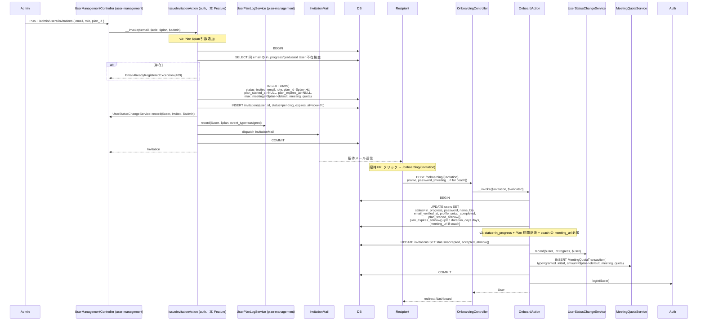
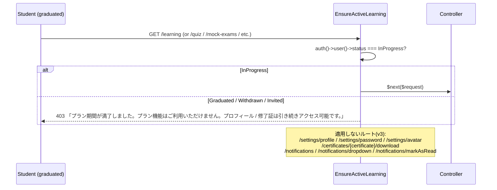
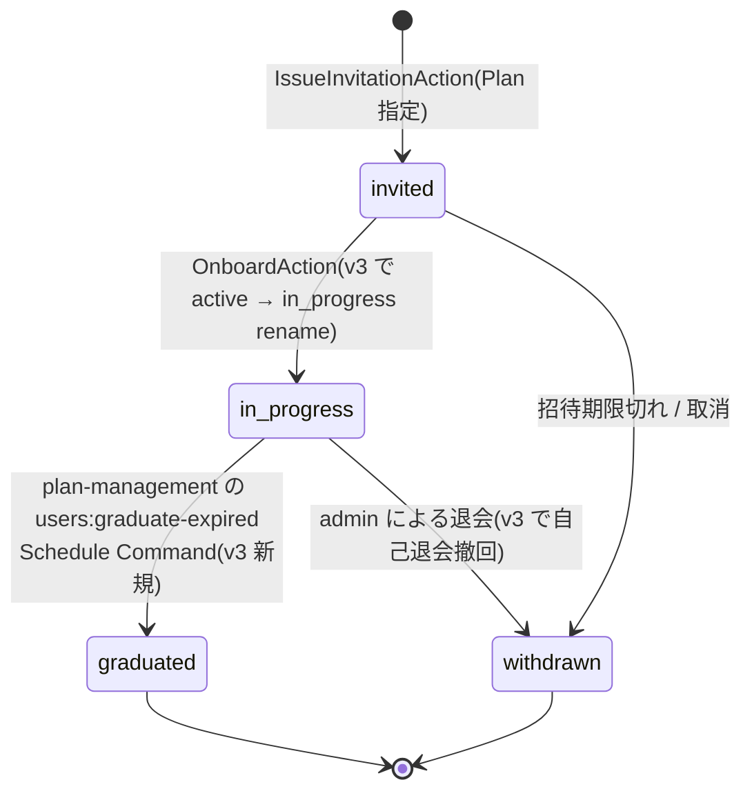

# auth 設計

> **v3 改修反映**（2026-05-16）:
> - `UserStatus` 4 値化（`Invited` / `InProgress` / `Graduated` / `Withdrawn`、旧 `Active` → `InProgress` rename + `Graduated` 新規）
> - `users` テーブルに `meeting_url` カラム追加（本 Migration、D4 決定）/ `plan_id` / `plan_started_at` / `plan_expires_at` / `max_meetings` の宣言（[[plan-management]] が Migration 所有、本 Feature では Model リレーション宣言のみ）
> - `IssueInvitationAction` に `Plan $plan` 引数追加（Plan 起点）
> - `OnboardAction` で `status = InProgress` + coach の `meeting_url` 必須化 + `plan_started_at` / `plan_expires_at` 確定 + `MeetingQuotaTransaction(granted_initial)` 起票
> - **`EnsureActiveLearning` Middleware 新規定義**（graduated ユーザーのプラン機能ロック、プロフィール / 修了証 DL は許可）

## アーキテクチャ概要

招待制 + Fortify セッション認証の Clean Architecture（軽量版）実装。Controller は Action / Service を組み合わせ、ロール存在確認は `EnsureUserRole` Middleware、**graduated ロックは `EnsureActiveLearning` Middleware**（v3 新規）、リソース固有認可は Policy、状態変更は Action 内 `DB::transaction()` で囲む。

### 1. 招待発行 → オンボーディング → 自動ログイン（v3 で Plan 起点）



### 2. EnsureActiveLearning Middleware（v3 新規）



## データモデル

### Eloquent モデル

- **`User`** — `HasUlids` + `HasFactory` + `SoftDeletes` + `Notifiable`、`role` `UserRole` cast / `status` `UserStatus` cast / `last_login_at` / **`plan_started_at`** / **`plan_expires_at`** datetime cast、`belongsTo(Plan)`(v3) / `hasMany(Invitation)`、`scopeActive`(v3 で `whereIn('status', [InProgress, Graduated])`)
- **`Invitation`** — `HasUlids` + `HasFactory` + `SoftDeletes`、`role` `UserRole` cast / `status` `InvitationStatus` cast / `expires_at` / `accepted_at` / `revoked_at` datetime cast、`belongsTo(User)` / `belongsTo(User, invited_by_user_id, invitedBy)`

### ER 図

```mermaid
erDiagram
    USERS ||--o{ INVITATIONS : "user_id"
    USERS ||--o{ INVITATIONS : "invited_by_user_id"
    PLANS ||--o{ USERS : "plan_id (v3)"

    USERS {
        ulid id PK
        string email UNIQUE
        string password "nullable"
        string role "admin/coach/student"
        string status "v3: invited/in_progress/graduated/withdrawn"
        string name "nullable"
        text bio "nullable"
        string avatar_url "nullable"
        boolean profile_setup_completed
        timestamp email_verified_at "nullable"
        timestamp last_login_at "nullable"
        ulid plan_id "v3 nullable, plan-management migration"
        timestamp plan_started_at "v3 nullable"
        timestamp plan_expires_at "v3 nullable"
        unsignedSmallInteger max_meetings "v3 default 0"
        string meeting_url "v3 nullable, this migration"
        string remember_token "nullable"
        timestamps
        timestamp deleted_at "nullable"
    }
    INVITATIONS {
        ulid id PK
        ulid user_id FK
        string email
        string role
        ulid invited_by_user_id FK
        timestamp expires_at
        timestamp accepted_at "nullable"
        timestamp revoked_at "nullable"
        string status "pending/accepted/expired/revoked"
        timestamps
        timestamp deleted_at "nullable"
    }
```

### Enum

| Model | Enum | 値（v3） | 日本語ラベル |
|---|---|---|---|
| `User.role` | `UserRole` | `Admin` / `Coach` / `Student` | `管理者` / `コーチ` / `受講生` |
| `User.status` | `UserStatus`(v3 で 4 値化) | `Invited` / **`InProgress`** / **`Graduated`** / `Withdrawn` | `招待中` / `受講中` / `修了` / `退会済` |
| `Invitation.status` | `InvitationStatus` | `Pending` / `Accepted` / `Expired` / `Revoked` | `招待中` / `承諾済` / `期限切れ` / `取消済` |

## 状態遷移



## コンポーネント

### Controller

- `OnboardingController` — `show($invitation)` / `store($invitation, OnboardingRequest)`
- Fortify が `/login` / `/logout` / `/forgot-password` / `/reset-password` を提供（本 Feature では Controller 持たない、Fortify Action を `App\Actions\Fortify\` に配置）

### Action

`app/UseCases/Auth/`:

```php
class IssueInvitationAction
{
    public function __construct(private UserStatusChangeService $statusService, private UserPlanLogService $planLog) {}

    // v3: Plan $plan 引数追加
    public function __invoke(string $email, UserRole $role, Plan $plan, User $invitedBy, bool $force = false): Invitation
    {
        return DB::transaction(function () use ($email, $role, $plan, $invitedBy, $force) {
            // v3: in_progress / graduated 不在検査
            if (User::where('email', $email)->whereIn('status', [UserStatus::InProgress, UserStatus::Graduated])->exists()) {
                throw new EmailAlreadyRegisteredException();
            }
            // 既存 invited User + pending Invitation の場合は $force 分岐
            // ...

            $user = User::create([
                'email' => $email,
                'role' => $role,
                'status' => UserStatus::Invited,
                'plan_id' => $plan->id,  // v3
                'plan_started_at' => null,
                'plan_expires_at' => null,
                'max_meetings' => $plan->default_meeting_quota,  // v3
            ]);

            $invitation = Invitation::create([
                'user_id' => $user->id,
                'email' => $email,
                'role' => $role,
                'invited_by_user_id' => $invitedBy->id,
                'expires_at' => now()->addDays(config('auth.invitation_expire_days', 7)),
                'status' => InvitationStatus::Pending,
            ]);

            $this->statusService->record($user, UserStatus::Invited, $invitedBy, '新規招待');
            $this->planLog->record($user, $plan, UserPlanEvent::Assigned, $invitedBy);  // v3
            InvitationMail::dispatch($invitation);
            return $invitation;
        });
    }
}

class OnboardAction
{
    public function __construct(
        private UserStatusChangeService $statusService,
        private GrantInitialQuotaAction $grantInitial,  // v3、D-1 統一シグネチャ
    ) {}

    public function __invoke(Invitation $invitation, array $validated): User
    {
        return DB::transaction(function () use ($invitation, $validated) {
            $user = $invitation->user;

            $attrs = [
                'status' => UserStatus::InProgress,  // v3
                'password' => Hash::make($validated['password']),
                'name' => $validated['name'],
                'bio' => $validated['bio'] ?? null,
                'email_verified_at' => now(),
                'profile_setup_completed' => true,
                'plan_started_at' => now(),  // v3
                'plan_expires_at' => now()->addDays($user->plan->duration_days),  // v3
            ];

            if ($user->role === UserRole::Coach) {
                $attrs['meeting_url'] = $validated['meeting_url'];  // v3 必須
            }

            $user->update($attrs);
            $invitation->update(['status' => InvitationStatus::Accepted, 'accepted_at' => now()]);
            $this->statusService->record($user, UserStatus::InProgress, $user, 'オンボーディング完了');
            ($this->grantInitial)($user, $user->plan->default_meeting_quota, null, 'オンボーディング初期付与');  // v3、D-1 統一シグネチャ

            Auth::login($user);
            return $user;
        });
    }
}

class RevokeInvitationAction { /* 変更なし */ }
class ExpireInvitationsAction { /* 変更なし */ }
```

### Middleware

`app/Http/Middleware/`:

- `EnsureUserRole`(既存): `role:admin,coach` 形式でロール許可リスト判定、不一致で 403
- **`EnsureActiveLearning`(v3 新規)**:

```php
namespace App\Http\Middleware;

class EnsureActiveLearning
{
    public function handle(Request $request, Closure $next): Response
    {
        if (!auth()->check()) {
            return $next($request);  // auth middleware で処理済
        }

        if (auth()->user()->status !== UserStatus::InProgress) {
            abort(403, 'プラン期間が満了しました。プラン機能はご利用いただけません。プロフィール / 修了証は引き続きアクセス可能です。');
        }

        return $next($request);
    }
}
```

`Kernel.php` の `$middlewareAliases` に `'active-learning' => EnsureActiveLearning::class` 追加。

### Policy

- `InvitationPolicy::create / viewAny / revoke`(admin のみ true)

### FormRequest

- `OnboardingRequest`(`name: required string max:50` / `bio: nullable string max:1000` / `password: required string min:8 confirmed` / **`meeting_url: required_if:role,coach string url max:500`**(v3、coach の場合必須))

### Route

`routes/web.php`:

```php
// 未認証(署名付き URL が認可)
Route::get('/onboarding/{invitation}', [OnboardingController::class, 'show'])
    ->middleware('signed')
    ->name('onboarding.show');
Route::post('/onboarding/{invitation}', [OnboardingController::class, 'store'])
    ->middleware('signed')
    ->name('onboarding.store');

// Fortify ルートは Fortify が自動登録
```

各 Feature の routes/web.php で:
```php
Route::middleware(['auth', 'role:student', EnsureActiveLearning::class])->group(function () {
    // learning / quiz-answering / mock-exam / mentoring / chat / qa-board / ai-chat の student ルート
});
```

## エラーハンドリング

`app/Exceptions/Auth/`:

- `EmailAlreadyRegisteredException`(HTTP 409)
- `PendingInvitationAlreadyExistsException`(HTTP 409)
- `InvalidInvitationTokenException`(HTTP 410)

## 関連要件マッピング

| 要件 ID | 実装ポイント |
|---|---|
| REQ-auth-001 | `database/migrations/{date}_create_users_table.php` + 追加 migration `{date}_add_meeting_url_to_users_table.php`(v3、D4) |
| REQ-auth-003 | `App\Enums\UserStatus`(v3 で 4 値化) |
| REQ-auth-011 | `App\UseCases\Auth\IssueInvitationAction`(v3 で Plan $plan 引数) |
| REQ-auth-022 | `App\UseCases\Auth\OnboardAction`(v3 で status=InProgress + coach の meeting_url 必須) |
| REQ-auth-025 | `App\Http\Requests\Auth\OnboardingRequest`(v3 で `meeting_url: required_if:role,coach`) |
| REQ-auth-031〜032 | `App\Actions\Fortify\AuthenticateUserUsing`(`status IN (InProgress, Graduated)` でログイン許可) |
| **REQ-auth-043〜045** | **`App\Http\Middleware\EnsureActiveLearning`**(v3 新規) |
| REQ-auth-050 | `app/Console/Commands/ExpireInvitationsCommand` |

## テスト戦略

### Feature

- `Auth/IssueInvitationActionTest`(Plan 必須引数検証 / 既存 in_progress / graduated 不在検査 / `UserPlanLog assigned` 記録)
- **`Auth/OnboardActionTest`(v3)** — status=InProgress 遷移 / coach の meeting_url 必須(空文字で 422) / plan_started_at + plan_expires_at セット / MeetingQuotaTransaction granted_initial 記録
- **`Middleware/EnsureActiveLearningTest`(v3 新規)** — InProgress で 200 / Graduated で 403 / Withdrawn で 403 / 適用除外ルート(`/settings/profile` / `/certificates/{id}/download` 等)で graduated も 200

### Unit

- `Enums/UserStatusTest`(`label()` 日本語表記 + 4 値網羅)
