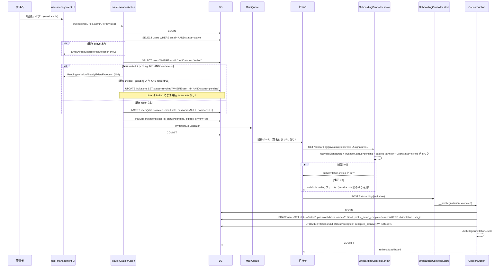
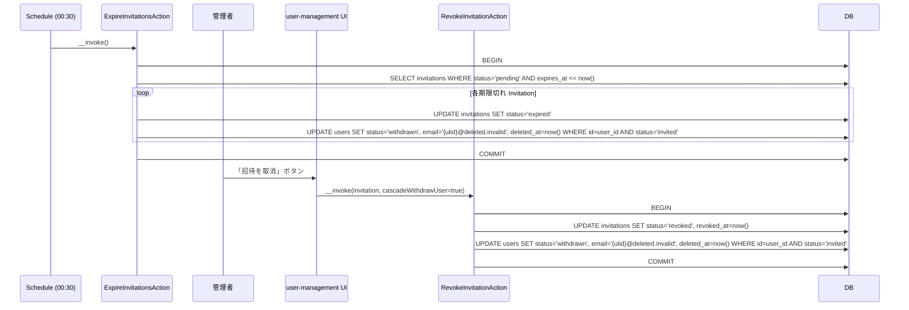
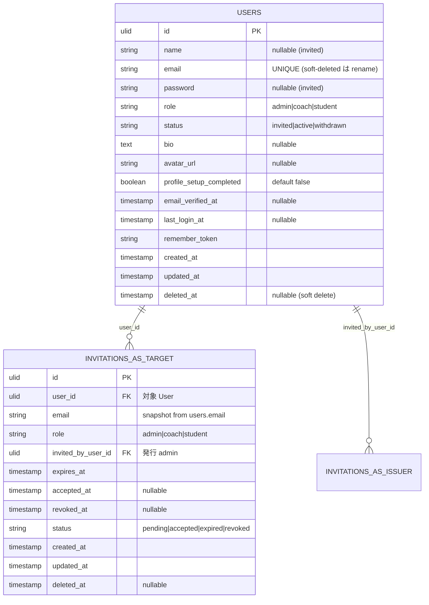
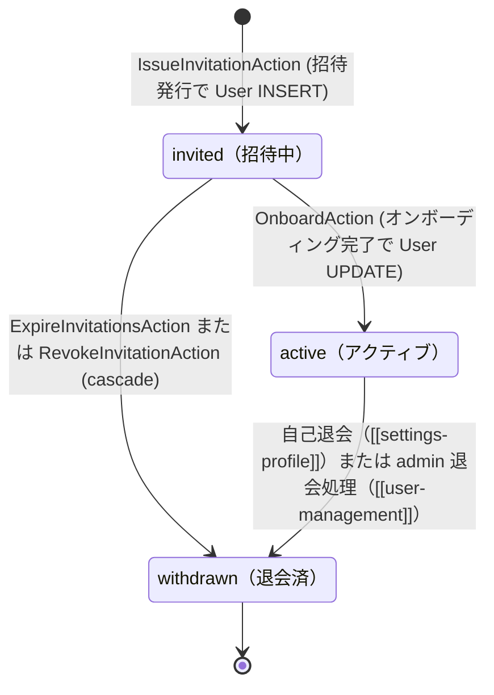
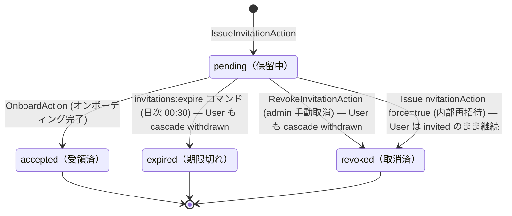

# auth 設計

## アーキテクチャ概要

招待制 + Fortify セッション認証の Clean Architecture（軽量版）実装。Controller は Action / Service を組み合わせ、ロール存在確認は Middleware、リソース固有認可は Policy、状態変更は Action 内 `DB::transaction()` で囲む。

### 招待 → オンボーディング → 自動ログイン

User と Invitation は **招待発行時に両方 INSERT**（product.md state diagram `[*] → invited` 準拠）。オンボーディング時は既存 invited User を UPDATE する（新規 INSERT しない）。



### Invitation 期限切れ / 取消 → User cascade withdrawn

`product.md` の state diagram `invited → withdrawn: 招待期限切れ または 取り消し` に対応。



### ログイン / ログアウト / パスワードリセット（Fortify）

```mermaid
flowchart LR
    L[GET /login] --> LF[Fortify::loginView]
    LF --> LP[auth/login.blade.php]
    LP --> LS[POST /login Fortify]
    LS --> Auth{credentials + status=active?}
    Auth -- NG --> LP
    Auth -- OK --> UL[UpdateLastLoginAt Listener]
    UL --> Dash[redirect /dashboard]

    Lo[POST /logout] --> Inv[Auth::logout + session invalidate]
    Inv --> Login2[redirect /login]

    F[GET /forgot-password] --> FF[auth/forgot-password.blade.php]
    FF --> FS[POST /forgot-password Fortify]
    FS --> Send[ResetPassword Notification 送信]
    Send --> Same[「メールを送信しました」共通メッセージ]

    R[GET /reset-password/{token}] --> RF[auth/reset-password.blade.php]
    RF --> RS[POST /reset-password Fortify]
    RS --> Hash[Hash::make + トークン失効]
    Hash --> Login3[redirect /login + 成功メッセージ]
```

## データモデル

### Eloquent モデル一覧

- **`User`** — 認証主体。3ロール（`admin` / `coach` / `student`）を `role` enum で識別。3状態（`invited` / `active` / `withdrawn`）を `status` enum で識別。`HasUlids` + `SoftDeletes` + `Notifiable`。**`password` と `name` は nullable**（invited 状態では未設定）。`hasMany(Invitation::class, 'user_id')`（履歴）。
- **`Invitation`** — 招待トークン。`status` enum で4状態を管理。`HasUlids` + `SoftDeletes`。`belongsTo(User::class, 'user_id')`（対象 User）+ `belongsTo(User::class, 'invited_by_user_id')`（発行 admin）。1 User × N Invitations（再招待の履歴を保持）。

### ER 図



> Mermaid の制約で同じテーブルへの 2 つの FK を 1 つの ER box では描き分けにくいため、図上は `INVITATIONS_AS_TARGET` として表現。実テーブルは `invitations` 1 つで、`user_id` と `invited_by_user_id` の 2 つの FK を持つ。

### 主要カラム + Enum

| Model | Enum | 値 | 日本語ラベル |
|---|---|---|---|
| `User.role` | `UserRole` | `Admin` `Coach` `Student` | `管理者` `コーチ` `受講生` |
| `User.status` | `UserStatus` | `Invited` `Active` `Withdrawn` | `招待中` `アクティブ` `退会済` |
| `Invitation.status` | `InvitationStatus` | `Pending` `Accepted` `Expired` `Revoked` | `保留中` `受領済` `期限切れ` `取消済` |
| `Invitation.role` | `UserRole`（共用） | — | — |

### インデックス・制約

- `users.email`: UNIQUE。MySQL 8 では部分 UNIQUE INDEX が直接書けないため、**soft delete を行う Action が email を `{ulid}@deleted.invalid` 形式へリネーム** することで実 email の重複を回避（REQ-auth-004, REQ-auth-070）。
- `invitations.user_id`: 外部キー（`onDelete('cascade')` ではなく Action 側で明示削除 — soft delete を保持するため）+ INDEX（User → Invitations 履歴の高速引き）
- `invitations.expires_at + status`: 複合 INDEX（`invitations:expire` Schedule Command で `WHERE status='pending' AND expires_at <= now()` を高速化）
- `invitations.invited_by_user_id`: 外部キー（`onDelete('restrict')` — 招待発行者の退会は user-management 側でブロック）
- `invitations.user_id + status` 部分 UNIQUE: 1 User あたり同時に存在する `pending` Invitation は最大 1 件（再招待は旧 pending を revoke してから新 pending を INSERT する設計と整合）。MySQL 8 の制約として書ききれない場合は Action 側の事前検査で担保。

## 状態遷移

`product.md` の state diagram に厳格に従う。User と Invitation の状態は **同一トランザクション内で連動** する（cascade）。

### A. User.status（product.md 準拠）



### B. Invitation.status



> **cascade ルール**: Invitation が `expired` または `revoked`（admin 手動）になったとき、対応する User が `invited` 状態なら `withdrawn` + soft delete + email リネーム を同一トランザクション内で行う。**例外**: `IssueInvitationAction(force=true)` 内で旧 Invitation を revoke するときは User を残す（同じ user_id に新 Invitation を紐付けるため）。

## コンポーネント

### Controller

すべて `auth` ガードを前提。Onboarding 系のみ未認証アクセス可（署名付き URL が認可）。

- **`Auth\OnboardingController`** — オンボーディング画面の表示・送信
  - `show(Invitation $invitation)` → `auth/onboarding` ビューまたは `auth/invitation-invalid`
  - `store(Invitation $invitation, OnboardingRequest $request, OnboardAction $action)` → `/dashboard` リダイレクト
- **Fortify のデフォルト Controller** — ログイン / ログアウト / パスワードリセットは Fortify が標準提供
  - 画面は `App\Providers\FortifyServiceProvider` で Blade に紐付け
  - ログイン成功時のフックは `FortifyServiceProvider::boot()` 内で `Fortify::authenticateUsing()` または Listener 経由

> 招待発行 / 取消 / 一覧の Controller は [[user-management]] 側に置く（本 Feature は Action だけ提供）。

### Action（UseCase）

`app/UseCases/Auth/`。各 Action は単一トランザクション境界。

#### `IssueInvitationAction`

```php
class IssueInvitationAction
{
    public function __construct(private InvitationTokenService $tokenService) {}

    /**
     * 招待を発行する。force=true なら同 email に既存 pending Invitation がある場合に
     * 旧 Invitation を revoke（User は invited のまま継続）して新 Invitation を発行する。
     *
     * @throws EmailAlreadyRegisteredException 同 email の active User が存在
     * @throws PendingInvitationAlreadyExistsException force=false で既存 pending Invitation あり
     */
    public function __invoke(
        string $email,
        UserRole $role,
        User $invitedBy,
        bool $force = false,
    ): Invitation;
}
```

責務: (1) active User 重複検査、(2) invited User + pending Invitation 検査と force 分岐、(3) User INSERT or 既存 invited User の再利用、(4) Invitation INSERT、(5) `InvitationMail` dispatch。`DB::transaction()` でラップ。

#### `OnboardAction`

```php
class OnboardAction
{
    /**
     * 招待を受領し、既存 invited User を active に遷移させ、自動ログインする。
     *
     * @throws InvalidInvitationTokenException Invitation が pending でない / 期限切れ / User が invited でない
     */
    public function __invoke(Invitation $invitation, array $validated): User;
}
```

責務: (1) Invitation + User の状態整合性チェック、(2) User UPDATE（`status=active` / `password` / `name` / `bio` / `email_verified_at` / `profile_setup_completed=true`）、(3) Invitation UPDATE（`status=accepted` / `accepted_at=now()`）、(4) `Auth::login($invitation->user)`。

#### `RevokeInvitationAction`

```php
class RevokeInvitationAction
{
    /**
     * pending Invitation を revoke する。cascadeWithdrawUser=true なら User も withdrawn + soft delete + email リネーム。
     *
     * @throws InvitationNotPendingException Invitation.status が pending でない
     */
    public function __invoke(
        Invitation $invitation,
        bool $cascadeWithdrawUser = true,
    ): void;
}
```

責務: (1) Invitation を `revoked` に UPDATE、(2) `cascadeWithdrawUser=true` なら紐付く invited User を `withdrawn` + `deleted_at=now()` + `email='{ulid}@deleted.invalid'` に UPDATE。admin 手動取消では `true`（デフォルト）、`IssueInvitationAction(force=true)` 内部呼び出しでは `false`。

#### `ExpireInvitationsAction`

```php
class ExpireInvitationsAction
{
    /**
     * 期限切れの pending Invitation をすべて expired にし、対応する invited User を cascade withdrawn する。
     *
     * @return int 処理された Invitation の件数
     */
    public function __invoke(): int;
}
```

責務: (1) `pending AND expires_at <= now()` の Invitation を抽出、(2) 各 Invitation を `expired` に UPDATE、(3) 紐付く invited User を cascade withdraw（`status=withdrawn` + soft delete + email リネーム）。すべて `DB::transaction()` 内。

#### Fortify 標準採用（独自 Action を作らない）

Login / Logout / ForgotPassword / ResetPassword は **Fortify 標準実装を採用** し独自 Action は作らない（Fortify の Actions / Pipelines をカスタマイズ用フックがあるため）。例外として「`status === active` でないと認証通さない」だけ `FortifyServiceProvider::boot()` 内の `Fortify::authenticateUsing(...)` クロージャでガード。

### Service

`app/Services/`:

- **`InvitationTokenService`** — 署名付きオンボーディング URL の生成と検証ヘルパ
  - `generateUrl(Invitation $invitation): string` — `URL::signedRoute('onboarding.show', ['invitation' => $invitation->id, 'expires' => $invitation->expires_at->timestamp])`
  - `verify(Request $request, Invitation $invitation): bool` — `hasValidSignature()` + status / expires_at チェックを 1 メソッドに集約

### Policy

`app/Policies/InvitationPolicy.php`:

- `viewAny(User $user): bool` — admin のみ
- `create(User $user): bool` — admin のみ
- `revoke(User $user, Invitation $invitation): bool` — admin かつ `invitation.status === pending`

### FormRequest

`app/Http/Requests/Auth/`:

- **`OnboardingRequest`** — `name` required string / `bio` nullable string / `password` required string min:8 confirmed
  - `authorize()` は **always true**（署名付き URL が認可、Controller 側で署名検証）

Login / ForgotPassword / ResetPassword は Fortify の Pipeline 内バリデーションを使うため独自 FormRequest を作らない。

### Notification / Mailable

`app/Mail/`:

- **`InvitationMail`** — Markdown Mailable
  - 件名: 「Certify LMS への招待」
  - 本文: 招待者名 / ロール / 有効期限 / 「アカウントを作成」ボタン（署名付きオンボーディング URL）
  - テンプレ: `resources/views/emails/invitation.blade.php`

Laravel 標準の `ResetPassword` Notification をパスワードリセットに使う（カスタマイズは `User::sendPasswordResetNotification()` をオーバーライドして件名・本文の日本語化のみ）。

### Middleware

`app/Http/Middleware/EnsureUserRole.php`:

```php
public function handle(Request $request, Closure $next, string ...$roles): Response
{
    $user = $request->user();
    if (! $user || ! in_array($user->role->value, $roles, true)) {
        abort(403);
    }
    return $next($request);
}
```

`app/Http/Kernel.php` の `$middlewareAliases` に `'role' => EnsureUserRole::class` を追加。

### Schedule Command

`app/Console/Commands/Auth/ExpireInvitationsCommand.php`:

- signature: `invitations:expire`
- handle: `ExpireInvitationsAction` を呼ぶだけの薄いラッパー
- `app/Console/Kernel.php::schedule()` で `->command('invitations:expire')->dailyAt('00:30')`

### FortifyServiceProvider のカスタマイズ

`app/Providers/FortifyServiceProvider.php`:

- `Fortify::loginView(fn () => view('auth.login'))`
- `Fortify::requestPasswordResetLinkView(fn () => view('auth.forgot-password'))`
- `Fortify::resetPasswordView(fn ($request) => view('auth.reset-password', ['token' => $request->route('token'), 'email' => $request->email]))`
- `Fortify::authenticateUsing(function (Request $request) { ... })` — email + password 検証後に `status === active` をチェック
- `Fortify::rateLimit('login')` の閾値（5回/分）をそのまま採用

## Blade ビュー

`resources/views/auth/`:

| ファイル | 役割 |
|---|---|
| `auth/login.blade.php` | ログインフォーム（email + password + 「パスワードを忘れた方」リンク）|
| `auth/forgot-password.blade.php` | パスワードリセット要求フォーム（email のみ）|
| `auth/reset-password.blade.php` | パスワードリセット確認フォーム（password + confirmation + token + email hidden）|
| `auth/onboarding.blade.php` | オンボーディングフォーム（name + bio + password + confirmation）。`Invitation` の email / role を読み取り専用で表示 |
| `auth/invitation-invalid.blade.php` | 「招待リンクが無効または期限切れです」エラー表示。「管理者へお問い合わせください」案内 |
| `emails/invitation.blade.php` | InvitationMail の Markdown テンプレ |
| `layouts/guest.blade.php` | 認証系の共通レイアウト（ロゴ + 中央カード）。本 Feature ではなく Wave 0b で先に用意される共通基盤 |

### 主要コンポーネント

すべて Wave 0b の Design System で先に整備済みの想定:

- `<x-button>` — Primary / Outline / Ghost variant
- `<x-form.input>` — label + input + error スロット
- `<x-form.error>` — `@error` 直結のエラーメッセージ
- `<x-alert>` — `success` / `error` / `info` variant（リダイレクト後の `session('status')` 表示）

## エラーハンドリング

### 想定例外（`app/Exceptions/Auth/`）

- **`EmailAlreadyRegisteredException`** — `ConflictHttpException` 継承（HTTP 409）
  - メッセージ: 「このメールアドレスは既に登録されています。」
  - 発生: `IssueInvitationAction` の事前検査（active User あり）
- **`PendingInvitationAlreadyExistsException`** — `ConflictHttpException` 継承（HTTP 409）
  - メッセージ: 「このメールアドレスへの招待は既に保留中です。」
  - 発生: `IssueInvitationAction(force=false)` で既存 invited User + pending Invitation 重複時
- **`InvalidInvitationTokenException`** — `\Symfony\Component\HttpKernel\Exception\HttpException`（HTTP 410 Gone）継承
  - メッセージ: 「招待リンクが無効または期限切れです。管理者へお問い合わせください。」
  - 発生: `OnboardAction` の整合性チェック（Invitation 非 pending / 期限切れ / User 非 invited）
- **`InvitationNotPendingException`** — `ConflictHttpException` 継承（HTTP 409）
  - メッセージ: 「この招待は既に処理済みのため取り消せません。」
  - 発生: `RevokeInvitationAction` が pending 以外の Invitation に対して呼ばれた場合

### Controller / Action の境界

- **署名 / 期限 / status のチェック**: `OnboardingController::show` では `auth/invitation-invalid` ビューを返す（ユーザーフレンドリ）
- **同じ条件で `store` に到達した場合**: `OnboardAction` 内で `InvalidInvitationTokenException` を throw（直接 POST を試した攻撃者・期限が show と store の間で切れたケースをガード）

### 列挙攻撃の防止

- パスワードリセット要求: email 存在有無に関わらず同一メッセージ（NFR-auth 該当）
- ログイン失敗: status 漏洩を避けるため、`invited` / `withdrawn` / 不正 password はすべて「認証情報が正しくありません」に統一

## 関連要件マッピング

| 要件ID | 実装ポイント |
|---|---|
| REQ-auth-001 〜 005 | `database/migrations/{date}_create_users_table.php`（`name` `password` を nullable）/ `App\Models\User` / `App\Enums\UserRole` / `App\Enums\UserStatus` / email rename ロジック（OnWithdrawUserAction 等の cascade Action） |
| REQ-auth-010 〜 015 | `database/migrations/{date}_create_invitations_table.php`（`user_id` FK + 複合 INDEX）/ `App\Models\Invitation` / `App\Enums\InvitationStatus` / `IssueInvitationAction`（force flag 含む）/ `InvitationTokenService::generateUrl` / `App\Mail\InvitationMail` |
| REQ-auth-020 〜 024 | `OnboardingController::show` / `OnboardingController::store` / `OnboardingRequest` / `OnboardAction`（User UPDATE 方式）/ `InvitationTokenService::verify` / `auth/invitation-invalid.blade.php` |
| REQ-auth-030 〜 036 | `FortifyServiceProvider::boot` / `auth/login.blade.php` / `auth/forgot-password.blade.php` / `auth/reset-password.blade.php` / `User::sendPasswordResetNotification` overrides |
| REQ-auth-040 〜 042 | `App\Http\Middleware\EnsureUserRole` / `App\Http\Kernel::$middlewareAliases` |
| REQ-auth-050 〜 052 | `ExpireInvitationsAction`（cascade User withdraw 含む）/ `App\Console\Commands\Auth\ExpireInvitationsCommand` / `App\Console\Kernel::schedule()` / `RevokeInvitationAction`（cascade flag 含む） |
| REQ-auth-060 〜 062 | `App\Policies\InvitationPolicy` / `routes/web.php`（`onboarding.*` ルートが `auth` middleware の **外** にあること）|
| REQ-auth-070 〜 071 | User soft delete + email rename を行う共通ヘルパ（例: `User::withdraw()` メソッドまたは `OnWithdrawUserAction`、本 Feature では cascade Action 内で呼ぶ）。能動退会 UI は [[settings-profile]] / [[user-management]] |
| NFR-auth-001 | `config/hashing.php` (default) |
| NFR-auth-002 | `FortifyServiceProvider::boot` の `Fortify::rateLimit('login')` |
| NFR-auth-003 | `layouts.guest` を全認証ビューで継承 |
| NFR-auth-004 | `lang/ja/auth.php` / 各ドメイン例外のコンストラクタ |
| NFR-auth-005 | 各 Action 内の `DB::transaction(function () { ... })` |
