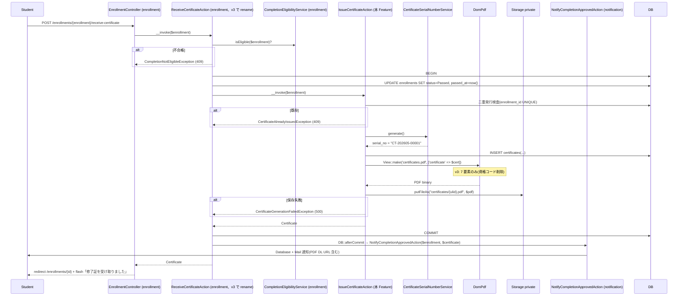
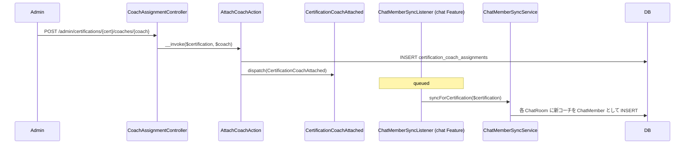

# certification-management 設計

> **v3 改修反映**（2026-05-16）:
> - `certifications` テーブル 4 カラム化（`name` / `category_id` / `difficulty` / `description`、`code` / `slug` / `passing_score` / `total_questions` / `exam_duration_minutes` 撤回）
> - `code` UNIQUE INDEX 削除、`(status, category_id)` 複合 INDEX 維持
> - **修了証発行の発火元を [[enrollment]] `ReceiveCertificateAction`（v3、受講生自己発火）に変更**（旧 `ApproveCompletionAction` 撤回）
> - 修了証 PDF テンプレから「資格コード」表示削除（7 要素構成、v3）

## アーキテクチャ概要

admin の資格マスタ運用画面、受講生のカタログ閲覧画面、修了証発行と PDF 配信を一体で提供する。Clean Architecture（軽量版）に従い、Controller / FormRequest / Policy / UseCase（Action）/ Service / Eloquent Model を分離する。Certificate INSERT + PDF 生成のドメイン本体は本 Feature の `App\UseCases\Certificate\IssueAction` に閉じ、**[[enrollment]] の `ReceiveCertificateAction`（v3、受講生自己発火）** がそれを呼ぶ形で責務分離する。

### 1. 修了証発行フロー（v3 で受講生自己発火型）



### 2. 担当コーチ割当 + ChatMember 自動同期



## データモデル

### Eloquent モデル

- **`Certification`**(v3 で 4 カラム) — `HasUlids` + `HasFactory` + `SoftDeletes`、`difficulty` enum cast / `status` enum cast / `published_at` / `archived_at` datetime cast、`belongsTo(CertificationCategory)` / `hasMany(Part)`([[content-management]]) / `hasMany(MockExam)`([[mock-exam]]) / `hasMany(Enrollment)` / `belongsToMany(User, 'certification_coach_assignments', 'certification_id', 'user_id')->withTimestamps()->wherePivot('unassigned_at', null)` を `coaches()` で公開
- **`CertificationCategory`** — `HasUlids` + `HasFactory` + `SoftDeletes`、`belongsTo` なし、`hasMany(Certification)` / `hasMany(QuestionCategory)`
- **`Certificate`** — `HasUlids` + `HasFactory`(SoftDelete 不要)、`issued_at` datetime cast、`belongsTo(User)` / `belongsTo(Enrollment)` / `belongsTo(Certification)`

### ER 図(v3 で certifications 4 カラム化)

```mermaid
erDiagram
    CERTIFICATION_CATEGORIES ||--o{ CERTIFICATIONS : "category_id"
    USERS ||--o{ CERTIFICATIONS : "created_by / updated_by"
    CERTIFICATIONS ||--o{ CERTIFICATION_COACH_ASSIGNMENTS : "certification_id"
    USERS ||--o{ CERTIFICATION_COACH_ASSIGNMENTS : "user_id (coach)"
    USERS ||--o{ CERTIFICATES : "user_id"
    ENROLLMENTS ||--|| CERTIFICATES : "enrollment_id UNIQUE"
    CERTIFICATIONS ||--o{ CERTIFICATES : "certification_id"

    CERTIFICATIONS {
        ulid id PK
        string name "max 100 NOT NULL (v3)"
        ulid category_id FK "v3"
        string difficulty "beginner/intermediate/advanced (v3)"
        text description "nullable (v3)"
        string status "draft/published/archived"
        ulid created_by_user_id FK
        ulid updated_by_user_id FK
        timestamp published_at "nullable"
        timestamp archived_at "nullable"
        timestamps
        timestamp deleted_at "nullable"
    }
    CERTIFICATES {
        ulid id PK
        ulid user_id FK
        ulid enrollment_id FK UNIQUE
        ulid certification_id FK
        string serial_no UNIQUE
        string pdf_path
        timestamp issued_at
        timestamps
    }
```

> **v3 で certifications に 5 カラム削除**: `code` / `slug` / `passing_score` / `total_questions` / `exam_duration_minutes`。`code` UNIQUE INDEX も削除。`(status, category_id)` 複合 INDEX 維持。

### Enum

| 項目 | Enum | 値 | 日本語ラベル |
|---|---|---|---|
| `Certification.difficulty` | `CertificationDifficulty` | `Beginner` / `Intermediate` / `Advanced` | `初級` / `中級` / `上級` |
| `Certification.status` | `CertificationStatus` | `Draft` / `Published` / `Archived` | `下書き` / `公開中` / `アーカイブ` |

## コンポーネント

### Controller

`app/Http/Controllers/`:

- `Admin\CertificationController`(`index` / `create` / `store` / `show` / `edit` / `update` / `destroy` / `publish` / `unpublish` / `archive`、admin)
- `Admin\CertificationCategoryController`(CRUD、admin)
- `Admin\CertificationCoachAssignmentController`(`attach($certification, $coach)` / `detach($certification, $coach)`、admin)
- `CertificationCatalogController`(`index` / `show`、student、`role:student + EnsureActiveLearning`)
- `CertificateController`(`download($certificate)`、auth のみ、`EnsureActiveLearning` 非適用)

### Action

`app/UseCases/`:

- `Certification\StoreAction` / `UpdateAction` / `DestroyAction` / `PublishAction` / `UnpublishAction` / `ArchiveAction`
- `CertificationCoachAssignment\AttachAction` / `DetachAction`(`CertificationCoachAttached` / `CertificationCoachDetached` イベント発火)
- **`Certificate\IssueAction`** — [[enrollment]] `ReceiveCertificateAction`(v3) から呼ばれる、`DB::transaction()` 内で `serial_no` 採番 + INSERT + PDF 生成 + Storage 保存

```php
class IssueAction
{
    public function __construct(private CertificateSerialNumberService $serialNo) {}

    public function __invoke(Enrollment $enrollment): Certificate
    {
        if ($enrollment->status !== EnrollmentStatus::Passed || !$enrollment->passed_at) {
            throw new \LogicException('Enrollment not passed');
        }
        if (Certificate::where('enrollment_id', $enrollment->id)->exists()) {
            throw new CertificateAlreadyIssuedException();
        }

        return DB::transaction(function () use ($enrollment) {
            $ulid = Str::ulid();
            $pdfPath = "certificates/{$ulid}.pdf";

            $certificate = Certificate::create([
                'user_id' => $enrollment->user_id,
                'enrollment_id' => $enrollment->id,
                'certification_id' => $enrollment->certification_id,
                'serial_no' => $this->serialNo->generate(),
                'pdf_path' => $pdfPath,
                'issued_at' => now(),
            ]);

            try {
                $pdf = Pdf::loadView('certificates.pdf', ['certificate' => $certificate->load(['user', 'certification'])]);
                Storage::disk('private')->put($pdfPath, $pdf->output());
            } catch (\Throwable $e) {
                throw new CertificateGenerationFailedException(previous: $e);
            }

            return $certificate;
        });
    }
}
```

### Service

- `App\Services\CertificateSerialNumberService::generate(): string` — `CT-{YYYYMM}-{連番5桁}` 形式(年月内連番、DB SELECT で次番算出)

### Policy

- `CertificationPolicy::view`(admin true / coach 担当 / student published のみ) / `update` / `delete` / `publish` 等
- `CertificateDownloadPolicy::download(User, Certificate)`(admin true / coach 担当資格 / student 本人)

### FormRequest

- `Admin\Certification\StoreRequest` / `UpdateRequest`(**v3 で 4 フィールド構成**: `name: required string max:100` / `category_id: required ulid exists:certification_categories,id` / `difficulty: required Rule::enum(CertificationDifficulty)` / `description: nullable string max:1000`)
- **削除(v3 撤回)**: `code` / `slug` / `passing_score` / `total_questions` / `exam_duration_minutes` のバリデーション

### Route

```php
Route::middleware(['auth', 'role:admin'])->prefix('admin')->name('admin.')->group(function () {
    Route::resource('certifications', Admin\CertificationController::class);
    Route::post('certifications/{certification}/publish', [Admin\CertificationController::class, 'publish'])->name('certifications.publish');
    Route::post('certifications/{certification}/unpublish', [Admin\CertificationController::class, 'unpublish'])->name('certifications.unpublish');
    Route::post('certifications/{certification}/archive', [Admin\CertificationController::class, 'archive'])->name('certifications.archive');

    Route::resource('certification-categories', Admin\CertificationCategoryController::class);

    Route::post('certifications/{certification}/coaches/{coach}', [Admin\CertificationCoachAssignmentController::class, 'attach'])
        ->name('certifications.coaches.attach');
    Route::delete('certifications/{certification}/coaches/{coach}', [Admin\CertificationCoachAssignmentController::class, 'detach'])
        ->name('certifications.coaches.detach');
});

// 受講生カタログ(v3 で EnsureActiveLearning 適用)
Route::middleware(['auth', 'role:student', EnsureActiveLearning::class])->group(function () {
    Route::get('certifications', [CertificationCatalogController::class, 'index'])->name('certifications.index');
    Route::get('certifications/{certification}', [CertificationCatalogController::class, 'show'])->name('certifications.show');
});

// 修了証 DL(v3 で EnsureActiveLearning 適用しない、graduated でも DL 可)
Route::middleware('auth')->group(function () {
    Route::get('certificates/{certificate}/download', [CertificateController::class, 'download'])->name('certificates.download');
});
```

## Blade ビュー

- `admin/certifications/index.blade.php` / `create.blade.php` / `edit.blade.php` / `show.blade.php`(**v3 で `code` / `slug` / `passing_score` / `total_questions` / `exam_duration_minutes` 入力欄削除**)
- `admin/certification-categories/index.blade.php` 等
- `certifications/index.blade.php` / `show.blade.php`(受講生カタログ、v3 で資格コード表示削除)
- **`certificates/pdf.blade.php`(v3 で 7 要素構成)** — タイトル + 証書定型文 + 発行元 + **受講生氏名 / 資格名 / 発行日 / 証書番号**(資格コード撤回)

## エラーハンドリング

`app/Exceptions/Certification/`:
- `CertificationNotDeletableException`(HTTP 409)
- `CertificateAlreadyIssuedException`(HTTP 409)
- `CertificateGenerationFailedException`(HTTP 500)

## 関連要件マッピング

| 要件 ID | 実装ポイント |
|---|---|
| REQ-certification-management-001 | `database/migrations/{date}_create_certifications_table.php`(**v3 で 4 カラム + 監査 + status**) / `App\Models\Certification` |
| **REQ-certification-management-002** | **撤回(v3)**: `code` / `slug` / `passing_score` / `total_questions` / `exam_duration_minutes` カラム持たない / `code` UNIQUE INDEX 持たない |
| REQ-certification-management-011 | `App\Http\Requests\Admin\Certification\IndexRequest` の `keyword` rule + `Certification::scopeKeyword('name only')` |
| REQ-certification-management-014 | `App\Http\Requests\Admin\Certification\UpdateRequest`(v3 で 4 フィールドのみ) |
| **REQ-certification-management-062**(v3) | `App\UseCases\Certificate\IssueAction` + **呼出元 [[enrollment]] `ReceiveCertificateAction`**(v3 rename) |
| REQ-certification-management-063 | `App\Http\Controllers\CertificateController::download` + Policy + **EnsureActiveLearning 非適用**(v3) |
| **REQ-certification-management-068**(v3) | `resources/views/certificates/pdf.blade.php`(**7 要素**、資格コード撤回) |

## テスト戦略

### Feature(HTTP)

- `Admin/Certification/{Index,Store,Update,Publish,Destroy}Test`(**v3 で 4 フィールドのみ**: name / category_id / difficulty / description)
- `Admin/Certification/InvalidColumnsTest`(v3、`code` / `slug` / `passing_score` 等送信時に **422 にならず無視**(rule で許容しない))
- `Catalog/IndexTest` / `ShowTest`(`EnsureActiveLearning` 適用、graduated 403)
- `Certificate/DownloadTest`(自分 200 / 他者 403 / **`graduated` でも 200**(v3、EnsureActiveLearning 非適用) / admin 全件 200 / coach 担当のみ 200)
- `CoachAssignment/{Attach,Detach}Test`(`CertificationCoachAttached` / `CertificationCoachDetached` イベント発火検証)

### Feature(UseCases)

- **`Certificate/IssueActionTest`(v3)** — Enrollment passed 検証 / 二重発行 409 / serial_no 採番 / PDF 生成 + Storage 保存 / **呼出元は [[enrollment]] `ReceiveCertificateAction`**(v3) / PDF 内容に **資格コード含まれない**(v3)

### Unit(Services)

- `CertificateSerialNumberServiceTest`(年月別連番、`CT-202605-00001` 形式)
