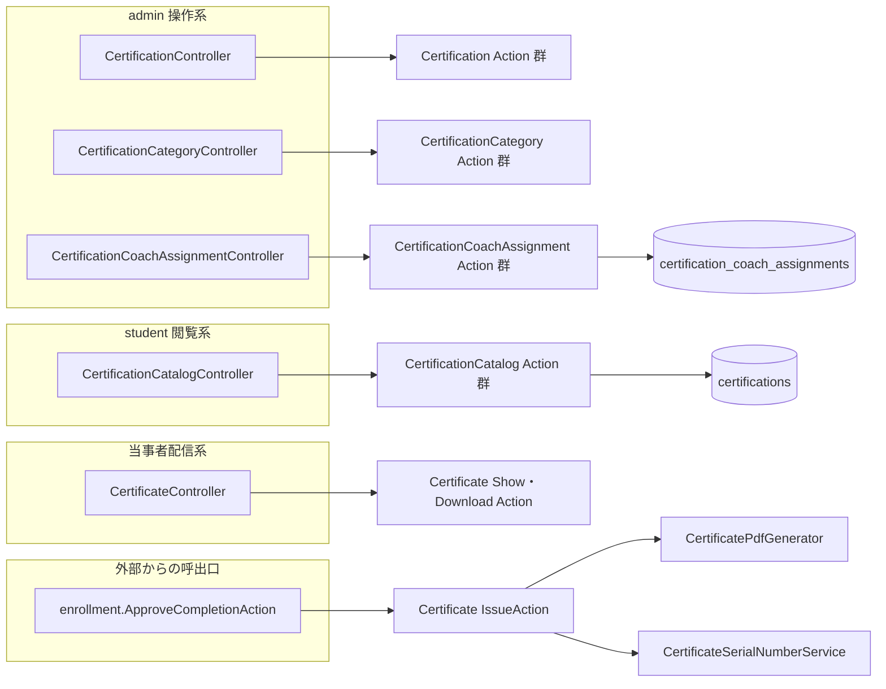
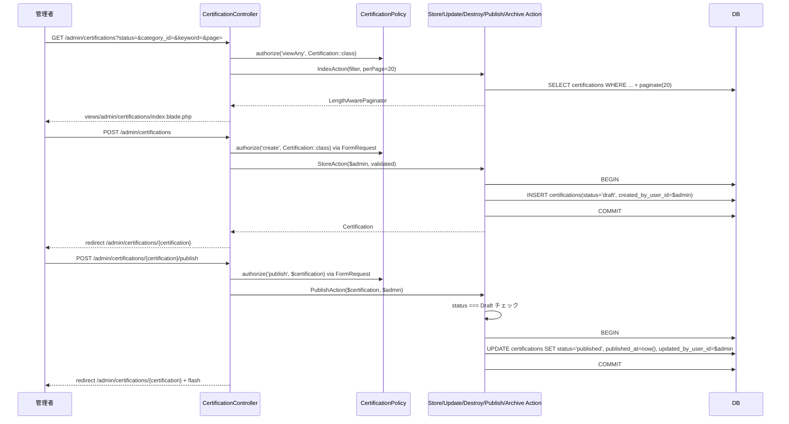
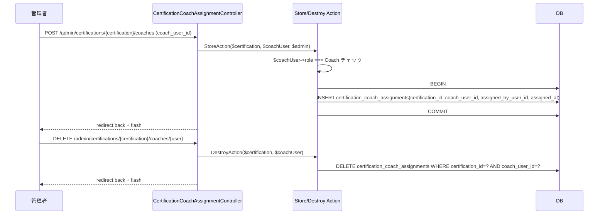
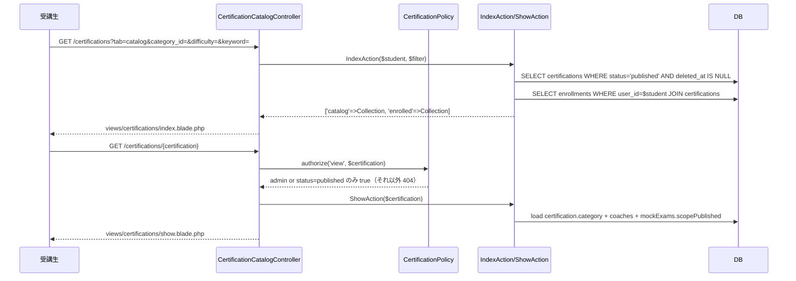
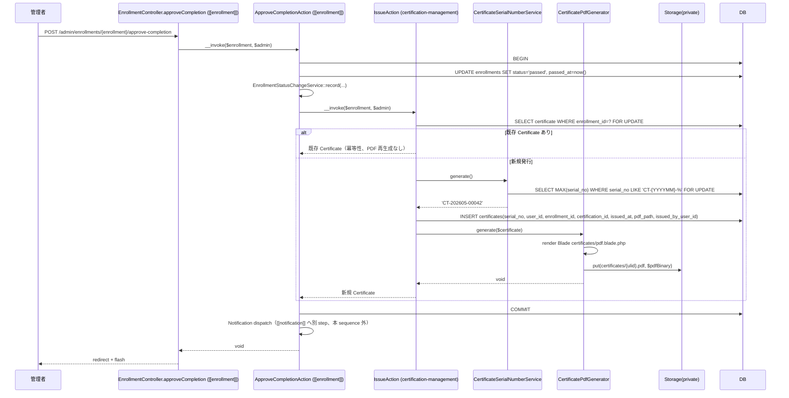
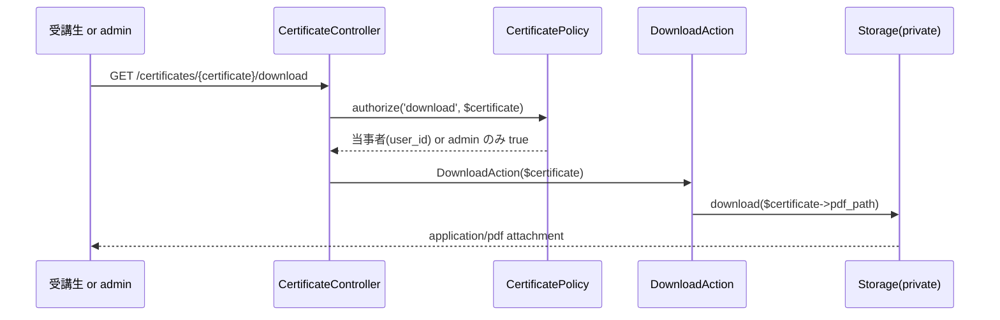
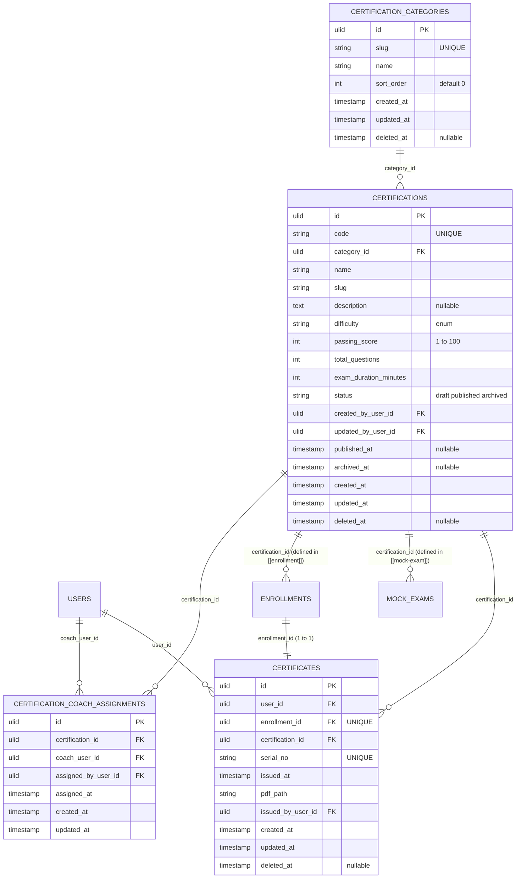
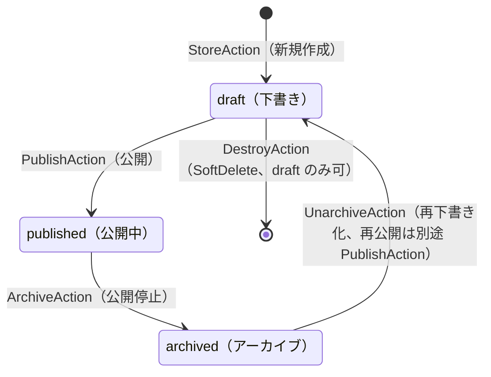

# certification-management 設計

## アーキテクチャ概要

admin の資格マスタ運用画面、受講生のカタログ閲覧画面、修了証発行と PDF 配信を一体で提供する。Clean Architecture（軽量版）に従い、Controller / FormRequest / Policy / UseCase（Action）/ Service / Eloquent Model を分離する。Certificate INSERT + PDF 生成のドメイン本体は本 Feature の `App\UseCases\Certificate\IssueAction` に閉じ、[[enrollment]] の `ApproveCompletionAction` がそれを呼ぶ形で責務分離する（[[user-management]] の `Invitation\StoreAction` が [[auth]] の `IssueInvitationAction` を呼ぶのと同じ流儀）。

### 全体構造



### admin 資格マスタ CRUD + 公開状態遷移



### 担当コーチ割当



### 受講生カタログ閲覧



### 修了証発行（[[enrollment]] からの呼出）



### 修了証ダウンロード



## データモデル

### Eloquent モデル一覧

- **`Certification`** — 資格マスタ。`HasUlids` + `HasFactory` + `SoftDeletes`。`belongsTo(CertificationCategory::class)` / `belongsToMany(User::class, 'certification_coach_assignments', 'certification_id', 'coach_user_id')->withPivot(['assigned_by_user_id','assigned_at'])` （リレーション名 `coaches()`）/ `hasMany(Certificate::class)` / `hasMany(Enrollment::class)` / `hasMany(MockExam::class)`（[[mock-exam]] が定義する側、本 Model からはリレーション宣言のみ）。スコープ: `scopePublished()` / `scopeAssignedTo(User $coach)` / `scopeKeyword(?string $keyword)`。
- **`CertificationCategory`** — 資格分類マスタ。`HasUlids` + `HasFactory` + `SoftDeletes`。`hasMany(Certification::class)`。スコープ: `scopeOrdered()`（`sort_order ASC, created_at DESC`）。
- **`CertificationCoachAssignment`** — 中間テーブル用 Pivot Model（必要に応じて）。本 Feature では BelongsToMany の pivot で十分なので独立 Model を作らないが、`assigned_by_user_id` などの pivot メタデータを Action から書き込むため `withPivot` で扱う。
- **`Certificate`** — 修了証。`HasUlids` + `HasFactory` + `SoftDeletes`。`belongsTo(User::class)` / `belongsTo(Enrollment::class)` / `belongsTo(Certification::class)` / `belongsTo(User::class, 'issued_by_user_id', 'issuedBy')`。スコープ: `scopeIssuedThisMonth()`（`CertificateSerialNumberService` 用）。

### ER 図



> Mermaid の制約で `assignedBy` / `issuedBy` の 2 つ目の FK は 1 つの ER box では描き分けにくいため、テキストで明示している。実テーブルは上記のとおり 1 つで、`certification_coach_assignments.assigned_by_user_id` と `certificates.issued_by_user_id` がそれぞれ `users.id` を参照する追加 FK。

### 主要カラム + Enum

| Model | Enum | 値 | 日本語ラベル |
|---|---|---|---|
| `Certification.status` | `CertificationStatus` | `Draft` / `Published` / `Archived` | `下書き` / `公開中` / `アーカイブ` |
| `Certification.difficulty` | `CertificationDifficulty` | `Beginner` / `Intermediate` / `Advanced` / `Expert` | `初級` / `中級` / `上級` / `エキスパート` |

### インデックス・制約

`certifications`:
- `code`: UNIQUE INDEX
- `(status, category_id)`: 複合 INDEX（受講生カタログ・admin 一覧の絞込）
- `deleted_at`: 単体 INDEX（SoftDelete 行の除外を高速化）
- `category_id`: 外部キー（`->constrained('certification_categories')->restrictOnDelete()` — 参照中の category 削除は `CertificationCategoryInUseException` で防ぐ）
- `created_by_user_id` / `updated_by_user_id`: 外部キー（`->constrained('users')->restrictOnDelete()`）

`certification_categories`:
- `slug`: UNIQUE INDEX
- `sort_order`: 単体 INDEX

`certification_coach_assignments`:
- `(certification_id, coach_user_id)`: UNIQUE INDEX（重複割当防止）
- `certification_id`: 外部キー（`->constrained('certifications')->cascadeOnDelete()` — Certification SoftDelete 時のクリーンアップは Action 側で明示削除する想定。物理 cascade に頼らない）
- `coach_user_id`: 外部キー（`->constrained('users')->restrictOnDelete()` — coach を物理削除しないので restrict で十分）
- `assigned_by_user_id`: 外部キー（`->constrained('users')->restrictOnDelete()`）

`certificates`:
- `enrollment_id`: UNIQUE INDEX（1 Enrollment = 1 Certificate）
- `serial_no`: UNIQUE INDEX
- `user_id`: 単体 INDEX（受講生の修了証一覧）
- `certification_id`: 外部キー（`->constrained('certifications')->restrictOnDelete()`）
- `enrollment_id`: 外部キー（`->constrained('enrollments')->restrictOnDelete()`）
- `issued_by_user_id`: 外部キー（`->constrained('users')->restrictOnDelete()`）

## 状態遷移

`Certification.status` の遷移。`product.md` にも本 Feature の独立 state diagram は無いが、Feature 一覧表で言及されている `draft / published / archived` の 3 値に整合する。



> `published` から `draft` への直接遷移は提供しない。公開停止したい場合は `ArchiveAction` → `UnarchiveAction` の 2 ステップ。`archived` の物理削除も提供しない（SoftDelete 済みデータは履歴保持のため温存）。

## コンポーネント

### Controller

ロール別 namespace は使わず（`structure.md` 規約）、ルートは admin 操作系を `/admin/...` プレフィックスで `auth + role:admin` Middleware、受講生カタログは `/certifications` で `auth` Middleware、修了証は `/certificates` で `auth` + Policy。

- **`CertificationController`** — admin 用資格マスタ CRUD + 公開状態遷移
  - `index(IndexRequest, IndexAction)` — 一覧 + フィルタ + ページネーション
  - `show(Certification $certification, ShowAction)` — admin 用詳細（status 問わず閲覧可、コーチ割当・修了証発行数等のメタ含む）
  - `create()` — 新規作成フォーム表示（薄い）
  - `store(StoreRequest, StoreAction)` — 新規作成
  - `edit(Certification $certification)` — 編集フォーム表示
  - `update(Certification $certification, UpdateRequest, UpdateAction)` — 更新
  - `destroy(Certification $certification, DestroyAction)` — SoftDelete（draft のみ）
  - `publish(Certification $certification, PublishAction)` — draft → published
  - `archive(Certification $certification, ArchiveAction)` — published → archived
  - `unarchive(Certification $certification, UnarchiveAction)` — archived → draft

- **`CertificationCategoryController`** — admin 用カテゴリマスタ CRUD
  - `index(IndexAction)` — 一覧
  - `store(StoreRequest, StoreAction)` — 新規作成
  - `update(CertificationCategory $category, UpdateRequest, UpdateAction)` — 更新
  - `destroy(CertificationCategory $category, DestroyAction)` — SoftDelete（参照ゼロ時のみ）

- **`CertificationCoachAssignmentController`** — admin 用担当コーチ割当
  - `store(Certification $certification, StoreRequest, StoreAction)` — 割当追加
  - `destroy(Certification $certification, User $coach, DestroyAction)` — 割当解除

- **`CertificationCatalogController`** — student/auth 用カタログ閲覧
  - `index(IndexRequest, IndexAction)` — カタログ一覧（catalog タブ / enrolled タブ）
  - `show(Certification $certification, ShowAction)` — カタログ詳細（公開済または admin のみ閲覧可、Policy で制御）

- **`CertificateController`** — student/admin 用修了証配信
  - `show(Certificate $certificate, ShowAction)` — 達成画面（Blade）
  - `download(Certificate $certificate, DownloadAction)` — PDF ダウンロード

> 修了証発行（INSERT）の Controller は本 Feature に無い。[[enrollment]] の `EnrollmentController::approveCompletion` から `ApproveCompletionAction` 経由で本 Feature の `IssueAction` が呼ばれる。

### Action（UseCase）

Entity 単位ディレクトリで配置。各 Action は単一トランザクション境界、`__invoke()` を主とする。Controller method 名と Action クラス名は完全一致（`backend-usecases.md` 規約）。

#### `App\UseCases\Certification\IndexAction`

```php
namespace App\UseCases\Certification;

class IndexAction
{
    public function __invoke(
        ?string $keyword,
        ?CertificationStatus $status,
        ?string $categoryId,
        ?CertificationDifficulty $difficulty,
        int $perPage = 20,
    ): LengthAwarePaginator;
}
```

責務: (1) `Certification::query()->with('category')->withCount('coaches', 'certificates')` を起点に、(2) `keyword` は `code` / `name` の OR 部分一致、(3) `status` / `category_id` / `difficulty` は完全一致、(4) `withTrashed()` は付けない（admin 一覧で SoftDelete 済は隠す）、(5) 並び順 `ORDER BY FIELD(status, 'published', 'draft', 'archived'), updated_at DESC`、(6) `paginate(20)`。

#### `App\UseCases\Certification\ShowAction`

```php
class ShowAction
{
    public function __invoke(Certification $certification): Certification;
}
```

責務: `with(['category', 'coaches', 'certificates' => fn ($q) => $q->latest('issued_at')->limit(10)])->loadCount(['certificates', 'enrollments'])` で eager load して返す。

#### `App\UseCases\Certification\StoreAction`

```php
class StoreAction
{
    public function __invoke(User $admin, array $validated): Certification
    {
        return DB::transaction(fn () => Certification::create([
            ...$validated,
            'status' => CertificationStatus::Draft,
            'created_by_user_id' => $admin->id,
            'updated_by_user_id' => $admin->id,
        ]));
    }
}
```

責務: `status=draft` 固定、`created_by_user_id` / `updated_by_user_id` を $admin で固定して INSERT。

#### `App\UseCases\Certification\UpdateAction`

```php
class UpdateAction
{
    public function __invoke(Certification $certification, User $admin, array $validated): Certification
    {
        return DB::transaction(function () use ($certification, $admin, $validated) {
            $certification->update([
                ...$validated,
                'updated_by_user_id' => $admin->id,
            ]);
            return $certification->fresh();
        });
    }
}
```

責務: `status` は本 Action では UPDATE しない（FormRequest 側でも `status` フィールドを除外）。`updated_by_user_id` を $admin に書き換える。

#### `App\UseCases\Certification\DestroyAction`

```php
class DestroyAction
{
    public function __invoke(Certification $certification): void
    {
        if ($certification->status !== CertificationStatus::Draft) {
            throw new CertificationNotDeletableException();
        }
        DB::transaction(fn () => $certification->delete());
    }
}
```

責務: `draft` 以外なら `CertificationNotDeletableException`（HTTP 409）。draft のみ SoftDelete。

#### `App\UseCases\Certification\PublishAction` / `ArchiveAction` / `UnarchiveAction`

```php
class PublishAction
{
    public function __invoke(Certification $certification, User $admin): Certification
    {
        if ($certification->status !== CertificationStatus::Draft) {
            throw new CertificationInvalidTransitionException(
                from: $certification->status,
                to: CertificationStatus::Published,
            );
        }
        return DB::transaction(function () use ($certification, $admin) {
            $certification->update([
                'status' => CertificationStatus::Published,
                'published_at' => now(),
                'updated_by_user_id' => $admin->id,
            ]);
            return $certification->fresh();
        });
    }
}
```

`ArchiveAction` は `published → archived` + `archived_at=now()`、`UnarchiveAction` は `archived → draft` + `archived_at=null` + `published_at=null` を同様パターンで実装。いずれも遷移チェック失敗時に `CertificationInvalidTransitionException`（HTTP 409）。

#### `App\UseCases\CertificationCategory\*`

`IndexAction` / `StoreAction` / `UpdateAction` / `DestroyAction` を提供。`DestroyAction` は `$category->certifications()->exists()` を検査し、参照中なら `CertificationCategoryInUseException`（HTTP 409）。

#### `App\UseCases\CertificationCoachAssignment\StoreAction` / `DestroyAction`

```php
namespace App\UseCases\CertificationCoachAssignment;

class StoreAction
{
    public function __invoke(Certification $certification, User $coach, User $admin): void
    {
        if ($coach->role !== UserRole::Coach) {
            throw new NotCoachUserException();
        }
        DB::transaction(function () use ($certification, $coach, $admin) {
            $certification->coaches()->syncWithoutDetaching([
                $coach->id => [
                    'id' => (string) Str::ulid(),
                    'assigned_by_user_id' => $admin->id,
                    'assigned_at' => now(),
                ],
            ]);
        });
    }
}

class DestroyAction
{
    public function __invoke(Certification $certification, User $coach): void
    {
        DB::transaction(fn () => $certification->coaches()->detach($coach->id));
    }
}
```

`syncWithoutDetaching` を使うことで `(certification_id, coach_user_id)` 既存組合せの場合はノーオペ（REQ-certification-management-041 と整合、UNIQUE 違反を回避）。

#### `App\UseCases\CertificationCatalog\IndexAction` / `ShowAction`

```php
namespace App\UseCases\CertificationCatalog;

class IndexAction
{
    public function __invoke(User $student, array $filter): array
    {
        $base = Certification::query()
            ->published()
            ->with('category', 'coaches')
            ->keyword($filter['keyword'] ?? null)
            ->when($filter['category_id'] ?? null, fn ($q, $id) => $q->where('category_id', $id))
            ->when($filter['difficulty'] ?? null, fn ($q, $d) => $q->where('difficulty', $d));

        $enrolledIds = $student->enrollments()->pluck('certification_id');

        return [
            'catalog' => $base->clone()->orderBy('name')->get(),
            'enrolled' => $base->clone()->whereIn('id', $enrolledIds)->get(),
            'enrolled_ids' => $enrolledIds, // バッジ表示用
        ];
    }
}

class ShowAction
{
    public function __invoke(Certification $certification, User $viewer): Certification
    {
        return $certification->load(['category', 'coaches', 'mockExams' => fn ($q) => $q->published()]);
    }
}
```

`Show` の認可は Policy 側（`view`）で「public 状態 OR admin」を判定する。

#### `App\UseCases\Certificate\IssueAction`（外部 Feature からのエントリポイント）

```php
namespace App\UseCases\Certificate;

class IssueAction
{
    public function __construct(
        private CertificateSerialNumberService $serialService,
        private CertificatePdfGenerator $pdfGenerator,
    ) {}

    /**
     * 修了証を発行する。冪等性: 同一 Enrollment で 2 回呼ばれた場合、既存 Certificate を返却し副作用なし。
     *
     * @throws EnrollmentNotPassedException Enrollment が status=passed でない / passed_at が null
     */
    public function __invoke(Enrollment $enrollment, User $admin): Certificate
    {
        if ($enrollment->status !== EnrollmentStatus::Passed || $enrollment->passed_at === null) {
            throw new EnrollmentNotPassedException();
        }

        return DB::transaction(function () use ($enrollment, $admin) {
            // 冪等性: FOR UPDATE ロックを取りつつ既存 Certificate を引く
            $existing = Certificate::lockForUpdate()
                ->where('enrollment_id', $enrollment->id)
                ->first();
            if ($existing) {
                return $existing;
            }

            $certificate = Certificate::create([
                'user_id' => $enrollment->user_id,
                'enrollment_id' => $enrollment->id,
                'certification_id' => $enrollment->certification_id,
                'serial_no' => $this->serialService->generate(),
                'issued_at' => now(),
                'pdf_path' => 'certificates/' . Str::ulid() . '.pdf',
                'issued_by_user_id' => $admin->id,
            ]);

            $this->pdfGenerator->generate($certificate);

            return $certificate;
        });
    }
}
```

責務: (1) Enrollment 整合性チェック、(2) `lockForUpdate` で冪等性確保、(3) `serial_no` 採番、(4) `pdf_path` 予約、(5) Certificate INSERT、(6) PDF 生成 + storage 保存。Notification dispatch は本 Action では行わず、呼出元 [[enrollment]] `ApproveCompletionAction` の責務（[[notification]] への dispatch）。

#### `App\UseCases\Certificate\ShowAction` / `DownloadAction`

```php
namespace App\UseCases\Certificate;

class ShowAction
{
    public function __invoke(Certificate $certificate): Certificate
    {
        return $certificate->load(['user', 'certification.category', 'enrollment', 'issuedBy']);
    }
}

class DownloadAction
{
    public function __invoke(Certificate $certificate): StreamedResponse
    {
        if (! Storage::disk('private')->exists($certificate->pdf_path)) {
            throw new CertificatePdfNotFoundException();
        }
        return Storage::disk('private')->download(
            $certificate->pdf_path,
            "certificate-{$certificate->serial_no}.pdf",
            ['Content-Type' => 'application/pdf'],
        );
    }
}
```

### Service

`app/Services/`（フラット配置、`structure.md` 準拠）:

#### `CertificateSerialNumberService`

```php
namespace App\Services;

class CertificateSerialNumberService
{
    /**
     * `CT-{YYYYMM}-{NNNNN}` 形式の serial_no を採番する。
     * 当月内最大連番に FOR UPDATE ロックを掛け、競合下でも UNIQUE 違反しないように同期する。
     */
    public function generate(): string
    {
        $yyyymm = now()->format('Ym');
        $prefix = "CT-{$yyyymm}-";

        $maxNo = Certificate::query()
            ->where('serial_no', 'LIKE', "{$prefix}%")
            ->lockForUpdate()
            ->max('serial_no');

        $next = $maxNo
            ? (int) substr($maxNo, -5) + 1
            : 1;

        return $prefix . str_pad((string) $next, 5, '0', STR_PAD_LEFT);
    }
}
```

> `lockForUpdate` を `max()` と組み合わせるために、内側で `select` クエリを変える必要がある。実装上は `Certificate::where(...)->lockForUpdate()->orderByDesc('serial_no')->value('serial_no')` で代用可能。`IssueAction` 側の `DB::transaction()` 内で呼ばれる前提のため、トランザクション境界は呼出側に任せる（NFR-certification-management-001）。

#### `CertificatePdfGenerator`

```php
namespace App\Services;

use Barryvdh\DomPDF\Facade\Pdf;

class CertificatePdfGenerator
{
    /**
     * Certificate に対応する PDF を Blade テンプレートから生成し、Storage(private) に保存する。
     */
    public function generate(Certificate $certificate): void
    {
        $certificate->load(['user', 'certification.category', 'enrollment']);

        $pdf = Pdf::loadView('certificates.pdf', ['certificate' => $certificate])
            ->setPaper('a4', 'portrait')
            ->setOptions([
                'defaultFont' => 'IPAGothic',
                'isHtml5ParserEnabled' => true,
            ]);

        Storage::disk('private')->put(
            $certificate->pdf_path,
            $pdf->output(),
        );
    }
}
```

> `IPAGothic` 等の日本語フォントを `dompdf` に登録する設定は [[dashboard]] 等で共有する PDF 配信が増える前提で Wave 0b の `config/dompdf.php` に持たせる（本 Feature では設定値のみ要求）。

### Policy

`app/Policies/`:

#### `CertificationPolicy`

```php
class CertificationPolicy
{
    public function viewAny(User $auth): bool
    {
        return $auth->role === UserRole::Admin;
    }

    public function view(User $auth, Certification $certification): bool
    {
        return match ($auth->role) {
            UserRole::Admin => true,
            UserRole::Coach, UserRole::Student => $certification->status === CertificationStatus::Published
                && $certification->deleted_at === null,
        };
    }

    public function create(User $auth): bool { return $auth->role === UserRole::Admin; }
    public function update(User $auth, Certification $certification): bool { return $auth->role === UserRole::Admin; }
    public function delete(User $auth, Certification $certification): bool { return $auth->role === UserRole::Admin; }
    public function publish(User $auth, Certification $certification): bool { return $auth->role === UserRole::Admin; }
    public function archive(User $auth, Certification $certification): bool { return $auth->role === UserRole::Admin; }
    public function unarchive(User $auth, Certification $certification): bool { return $auth->role === UserRole::Admin; }
}
```

#### `CertificationCategoryPolicy`

```php
class CertificationCategoryPolicy
{
    public function viewAny(User $auth): bool { return $auth->role === UserRole::Admin; }
    public function create(User $auth): bool { return $auth->role === UserRole::Admin; }
    public function update(User $auth, CertificationCategory $category): bool { return $auth->role === UserRole::Admin; }
    public function delete(User $auth, CertificationCategory $category): bool { return $auth->role === UserRole::Admin; }
}
```

#### `CertificationCoachAssignmentPolicy`

```php
class CertificationCoachAssignmentPolicy
{
    public function create(User $auth): bool { return $auth->role === UserRole::Admin; }
    public function delete(User $auth): bool { return $auth->role === UserRole::Admin; }
}
```

#### `CertificatePolicy`

```php
class CertificatePolicy
{
    public function view(User $auth, Certificate $certificate): bool
    {
        return $auth->role === UserRole::Admin
            || $certificate->user_id === $auth->id;
    }

    public function download(User $auth, Certificate $certificate): bool
    {
        return $this->view($auth, $certificate);
    }
}
```

> Policy は「ロール / 当事者」観点のみで判定。状態整合性チェック（`draft` のみ削除可、状態遷移の起点制限）は **Action 内ドメイン例外** で表現する（[[user-management]] と同じ流儀、`backend-policies.md` の役割分担に整合）。

### FormRequest

| FormRequest | rules | authorize |
|---|---|---|
| `Certification\IndexRequest` | `keyword: nullable string max:100` / `status: nullable in:draft,published,archived` / `category_id: nullable ulid exists:certification_categories,id` / `difficulty: nullable in:beginner,intermediate,advanced,expert` / `page: nullable integer min:1` | `can('viewAny', Certification::class)` |
| `Certification\StoreRequest` | `code: required string max:50 unique:certifications,code` / `category_id: required ulid exists:certification_categories,id` / `name: required string max:100` / `slug: required string max:120 unique:certifications,slug` / `description: nullable string max:2000` / `difficulty: required in:beginner,intermediate,advanced,expert` / `passing_score: required integer min:1 max:100` / `total_questions: required integer min:1` / `exam_duration_minutes: required integer min:1` | `can('create', Certification::class)` |
| `Certification\UpdateRequest` | StoreRequest と同等。ただし `code: unique:certifications,code,{certification}` / `slug: unique:certifications,slug,{certification}` でルート Model 自身を除外 | `can('update', $this->route('certification'))` |
| `CertificationCategory\StoreRequest` | `name: required string max:50` / `slug: required string max:60 unique:certification_categories,slug` / `sort_order: nullable integer min:0` | `can('create', CertificationCategory::class)` |
| `CertificationCategory\UpdateRequest` | StoreRequest 同等 + ルート除外 | `can('update', $this->route('category'))` |
| `CertificationCoachAssignment\StoreRequest` | `coach_user_id: required ulid exists:users,id` | `can('create', CertificationCoachAssignment::class)` |
| `CertificationCatalog\IndexRequest` | `keyword: nullable string max:100` / `category_id: nullable ulid exists:certification_categories,id` / `difficulty: nullable in:beginner,intermediate,advanced,expert` / `tab: nullable in:catalog,enrolled` | always true（公開済を見るだけは `auth` で十分） |

`Certificate*` 系の操作（`show` / `download`）は FormRequest を作らず、Controller / Action 内で Policy + Action 完結とする（パラメータが Route Model だけのため）。

### Route

`routes/web.php`:

```php
// admin only
Route::middleware(['auth', 'role:admin'])->prefix('admin')->group(function () {
    Route::resource('certifications', CertificationController::class)
        ->parameters(['certifications' => 'certification'])
        ->names('admin.certifications');
    Route::post('certifications/{certification}/publish', [CertificationController::class, 'publish'])
        ->name('admin.certifications.publish');
    Route::post('certifications/{certification}/archive', [CertificationController::class, 'archive'])
        ->name('admin.certifications.archive');
    Route::post('certifications/{certification}/unarchive', [CertificationController::class, 'unarchive'])
        ->name('admin.certifications.unarchive');

    Route::post('certifications/{certification}/coaches', [CertificationCoachAssignmentController::class, 'store'])
        ->name('admin.certifications.coaches.store');
    Route::delete('certifications/{certification}/coaches/{user}', [CertificationCoachAssignmentController::class, 'destroy'])
        ->name('admin.certifications.coaches.destroy');

    Route::resource('certification-categories', CertificationCategoryController::class)
        ->parameters(['certification-categories' => 'category'])
        ->except(['show', 'create', 'edit'])
        ->names('admin.certification-categories');
});

// auth (any role)
Route::middleware('auth')->group(function () {
    Route::get('certifications', [CertificationCatalogController::class, 'index'])->name('certifications.index');
    Route::get('certifications/{certification}', [CertificationCatalogController::class, 'show'])->name('certifications.show');

    Route::get('certificates/{certificate}', [CertificateController::class, 'show'])->name('certificates.show');
    Route::get('certificates/{certificate}/download', [CertificateController::class, 'download'])->name('certificates.download');
});
```

> admin の `/admin/certifications` と受講生の `/certifications` は **URL も Controller も別**。Laravel 標準のリソースルートと自然に同居できる。

## Blade ビュー

`resources/views/`:

### admin 用

| ファイル | 役割 |
|---|---|
| `admin/certifications/index.blade.php` | 資格一覧 + フィルタ + ページネーション + 「+新規作成」ボタン |
| `admin/certifications/create.blade.php` | 新規作成フォーム |
| `admin/certifications/edit.blade.php` | 編集フォーム |
| `admin/certifications/show.blade.php` | 詳細（プロフィール / 状態遷移ボタン / 担当コーチセクション / 発行済 Certificate 一覧 / 受講者数） |
| `admin/certifications/_partials/info-card.blade.php` | 資格情報カード |
| `admin/certifications/_partials/coach-list.blade.php` | 担当コーチ一覧 + 追加ボタン |
| `admin/certifications/_partials/recent-certificates.blade.php` | 発行済 Certificate 直近 10 件 |
| `admin/certifications/_modals/assign-coach-form.blade.php` | コーチ割当モーダル（coach ロール User を select 提示）|
| `admin/certifications/_modals/transition-confirm.blade.php` | 公開 / アーカイブ / 再下書き化 の確認モーダル |
| `admin/certifications/_modals/delete-confirm.blade.php` | 削除確認モーダル（draft のみ表示）|
| `admin/certification-categories/index.blade.php` | カテゴリ一覧 + 追加 / 編集 / 削除（インライン or モーダル）|
| `admin/certification-categories/_modals/form.blade.php` | カテゴリ追加 / 編集モーダル |

### student / カタログ用

| ファイル | 役割 |
|---|---|
| `certifications/index.blade.php` | カタログ一覧（タブ: カタログ / 受講中 + フィルタ + 検索バー + 資格カードグリッド）|
| `certifications/show.blade.php` | カタログ詳細（資格情報 + 担当コーチ + 公開模試サマリ + 「この資格を受講する」ボタン）|
| `certifications/_partials/certification-card.blade.php` | カードコンポーネント（受講中バッジ付与）|

### 修了証

| ファイル | 役割 |
|---|---|
| `certificates/show.blade.php` | 達成画面（受講生名 / 資格名 / 合格点 / 発行日 / serial_no / PDF ダウンロードボタン）|
| `certificates/pdf.blade.php` | **dompdf 用 PDF テンプレート**（共通レイアウト非継承 / 外部 CSS / JS 依存なし / インライン `<style>` ブロックのみ）。日本語フォント `IPAGothic` を `font-family` で指定 |

### 主要コンポーネント（Wave 0b 整備済を前提）

`<x-button>` / `<x-form.input>` / `<x-form.select>` / `<x-form.textarea>` / `<x-form.error>` / `<x-modal>` / `<x-alert>` / `<x-card>` / `<x-badge>` / `<x-paginator>` を利用する。`<x-card>` をカタログ・admin 一覧の両方で再利用。

## エラーハンドリング

### 想定例外（`app/Exceptions/Certification/`）

- **`CertificationNotFoundException`** — `NotFoundHttpException` 継承（HTTP 404）
  - メッセージ: 「資格が見つかりません。」
  - 発生: 受講生が `status != published` または SoftDelete 済の Certification を URL 指定（admin は閲覧可なので 404 にしない）

- **`CertificationNotDeletableException`** — `ConflictHttpException` 継承（HTTP 409）
  - メッセージ: 「公開中またはアーカイブ済の資格は削除できません。先にアーカイブから再下書き化してください。」
  - 発生: `DestroyAction` で `status != Draft`

- **`CertificationInvalidTransitionException`** — `ConflictHttpException` 継承（HTTP 409）
  - メッセージ: 「現在の状態（{from}）からはこの操作（{to}）を行えません。」
  - 発生: `PublishAction` / `ArchiveAction` / `UnarchiveAction` の遷移チェック失敗

- **`CertificationCategoryInUseException`** — `ConflictHttpException` 継承（HTTP 409）
  - メッセージ: 「このカテゴリは資格に紐付いているため削除できません。」
  - 発生: `CertificationCategory\DestroyAction` で参照中

- **`NotCoachUserException`** — `UnprocessableEntityHttpException` 継承（HTTP 422）
  - メッセージ: 「指定したユーザーはコーチではありません。」
  - 発生: `CertificationCoachAssignment\StoreAction` で `coach_user_id` の User が `role !== Coach`

- **`EnrollmentNotPassedException`** — `ConflictHttpException` 継承（HTTP 409）
  - メッセージ: 「受講登録が修了状態ではないため、修了証を発行できません。」
  - 発生: `Certificate\IssueAction` で Enrollment が `status != passed` または `passed_at = null`

- **`CertificatePdfNotFoundException`** — `NotFoundHttpException` 継承（HTTP 404）
  - メッセージ: 「修了証 PDF ファイルが見つかりません。管理者にお問い合わせください。」
  - 発生: `Certificate\DownloadAction` で Storage に PDF ファイルが無い（運用ミス・障害想定）

### 共通エラー表示

- ドメイン例外 → `app/Exceptions/Handler.php` で `HttpException` 系を catch し、`session()->flash('error', $e->getMessage())` + `back()` でリダイレクト + alert 表示（[[user-management]] と同パターン）
- FormRequest バリデーション失敗 → Laravel 標準の `back()->withErrors()`、Blade 内で `@error` 表示
- Certificate URL の不正アクセス → Policy 違反は HTTP 403、enumeration 回避のため Certificate 自体が存在しなければ 404（Route Model Binding が標準で返す）

### 列挙・推測攻撃の配慮

- Certificate ULID 推測攻撃: `download` には Policy で当事者チェック + admin 以外は 403。serial_no は URL から取得できないため列挙不可
- カタログから非公開資格を URL 直叩き: `CertificationCatalogController::show` → `CertificationPolicy::view` で受講生は `status=published` 以外 false → 404 で隠す

## 関連要件マッピング

| 要件ID | 実装ポイント |
|---|---|
| REQ-certification-management-001 | `database/migrations/{date}_create_certifications_table.php` / `App\Models\Certification` / `database/factories/CertificationFactory.php` |
| REQ-certification-management-002 | `App\Enums\CertificationStatus`（`label()` 含む）/ `Certification::$casts` |
| REQ-certification-management-003 | `App\Enums\CertificationDifficulty`（`label()` 含む）/ `Certification::$casts` |
| REQ-certification-management-010 | `routes/web.php`（`admin.certifications.index`）/ `CertificationController::index` / `Http\Requests\Certification\IndexRequest` / `UseCases\Certification\IndexAction` / `views/admin/certifications/index.blade.php` |
| REQ-certification-management-011 | `Certification::scopeKeyword()` + `IndexAction` 内 `LIKE %keyword%` |
| REQ-certification-management-012 | `CertificationController::store` / `Http\Requests\Certification\StoreRequest` / `UseCases\Certification\StoreAction`（`status=draft` 固定）|
| REQ-certification-management-013 | `Http\Requests\Certification\StoreRequest::rules` の `unique:certifications,code` |
| REQ-certification-management-014 | `CertificationController::update` / `Http\Requests\Certification\UpdateRequest`（`status` フィールドなし）/ `UseCases\Certification\UpdateAction` |
| REQ-certification-management-015 | `UseCases\Certification\DestroyAction`（`CertificationNotDeletableException`）|
| REQ-certification-management-016 | `Certification` の `SoftDeletes` trait + `DestroyAction` の `$certification->delete()` |
| REQ-certification-management-017 | `Http\Requests\Certification\StoreRequest::rules` / `UpdateRequest::rules` の `passing_score: integer min:1 max:100` |
| REQ-certification-management-020 | `CertificationController::publish` / `UseCases\Certification\PublishAction` |
| REQ-certification-management-021 | `PublishAction` 内 `CertificationInvalidTransitionException` |
| REQ-certification-management-022 | `CertificationController::archive` / `UseCases\Certification\ArchiveAction` |
| REQ-certification-management-023 | `CertificationController::unarchive` / `UseCases\Certification\UnarchiveAction`（`published_at=null` / `archived_at=null` のリセット含む）|
| REQ-certification-management-030 | `database/migrations/{date}_create_certification_categories_table.php` / `App\Models\CertificationCategory` / `database/factories/CertificationCategoryFactory.php` |
| REQ-certification-management-031 | `CertificationCategoryController::index` / `UseCases\CertificationCategory\IndexAction` / `CertificationCategory::scopeOrdered()` / `views/admin/certification-categories/index.blade.php` |
| REQ-certification-management-032 | `CertificationCategoryController::store` / `update` / `destroy` / `Http\Requests\CertificationCategory\StoreRequest` / `UpdateRequest` |
| REQ-certification-management-033 | `UseCases\CertificationCategory\DestroyAction`（`CertificationCategoryInUseException`）|
| REQ-certification-management-040 | `database/migrations/{date}_create_certification_coach_assignments_table.php` |
| REQ-certification-management-041 | migration 内 `$table->unique(['certification_id', 'coach_user_id'])` + `Certification::coaches()` の `syncWithoutDetaching` |
| REQ-certification-management-042 | `CertificationCoachAssignmentController::store` / `Http\Requests\CertificationCoachAssignment\StoreRequest` / `UseCases\CertificationCoachAssignment\StoreAction`（`assigned_by_user_id` / `assigned_at` 自動セット）|
| REQ-certification-management-043 | `UseCases\CertificationCoachAssignment\StoreAction`（`NotCoachUserException`）|
| REQ-certification-management-044 | `CertificationCoachAssignmentController::destroy` / `UseCases\CertificationCoachAssignment\DestroyAction` |
| REQ-certification-management-045 | `Certification::coaches()` BelongsToMany / `User::assignedCertifications()` BelongsToMany / `Certification::scopeAssignedTo(User $coach)` |
| REQ-certification-management-050 | `CertificationCatalogController::index` / `UseCases\CertificationCatalog\IndexAction` / `Certification::scopePublished()` |
| REQ-certification-management-051 | `IndexAction` 内の `$student->enrollments()->pluck('certification_id')` + `whereIn` |
| REQ-certification-management-052 | `views/certifications/index.blade.php`（タブ切替）+ `_partials/certification-card.blade.php`（受講中バッジ）|
| REQ-certification-management-053 | `Http\Requests\CertificationCatalog\IndexRequest` / `IndexAction` 内の `when()` チェーン |
| REQ-certification-management-054 | `CertificationCatalogController::show` / `UseCases\CertificationCatalog\ShowAction`（`with('coaches')` 含む）|
| REQ-certification-management-055 | `CertificationPolicy::view`（受講生は `status=published` 以外 false → 自動 404）+ Route Model Binding |
| REQ-certification-management-060 | `database/migrations/{date}_create_certificates_table.php` / `App\Models\Certificate` / `database/factories/CertificateFactory.php` |
| REQ-certification-management-061 | migration 内 `$table->unique('enrollment_id')` + `IssueAction` 内 `lockForUpdate` での冪等性確保 |
| REQ-certification-management-062 | `App\UseCases\Certificate\IssueAction`（[[enrollment]] の `ApproveCompletionAction` から DI で呼ばれる）/ `views/certificates/pdf.blade.php` / `CertificatePdfGenerator` |
| REQ-certification-management-063 | `IssueAction` 内 `lockForUpdate` で既存検索 → ある場合は既存を return（冪等性）|
| REQ-certification-management-064 | `App\Services\CertificateSerialNumberService::generate` |
| REQ-certification-management-065 | `CertificateController::show` / `UseCases\Certificate\ShowAction` / `views/certificates/show.blade.php` |
| REQ-certification-management-066 | `CertificateController::download` / `UseCases\Certificate\DownloadAction` / `CertificatePolicy::download` / `config/filesystems.php` の `private` disk 設定 |
| REQ-certification-management-067 | `CertificatePolicy::download` の当事者チェック / `routes/web.php` の `auth` middleware |
| NFR-certification-management-001 | 各 Action 内 `DB::transaction()` |
| NFR-certification-management-002 | migration `create_certifications_table` の `$table->index(['status', 'category_id'])` + `$table->index('deleted_at')` |
| NFR-certification-management-003 | migration `create_certificates_table` の `unique` / `index` 群 |
| NFR-certification-management-004 | `app/Exceptions/Certification/*.php`（7 ファイル）|
| NFR-certification-management-005 | `Storage::disk('private')` 利用 / `routes/web.php` で `certificates/{certificate}/download` を Controller 経由配信に限定 |
| NFR-certification-management-006 | `views/certificates/pdf.blade.php`（インライン `<style>` / 共通レイアウト非継承）|
| NFR-certification-management-007 | `routes/web.php` の middleware group 構成 / Policy 群 |
