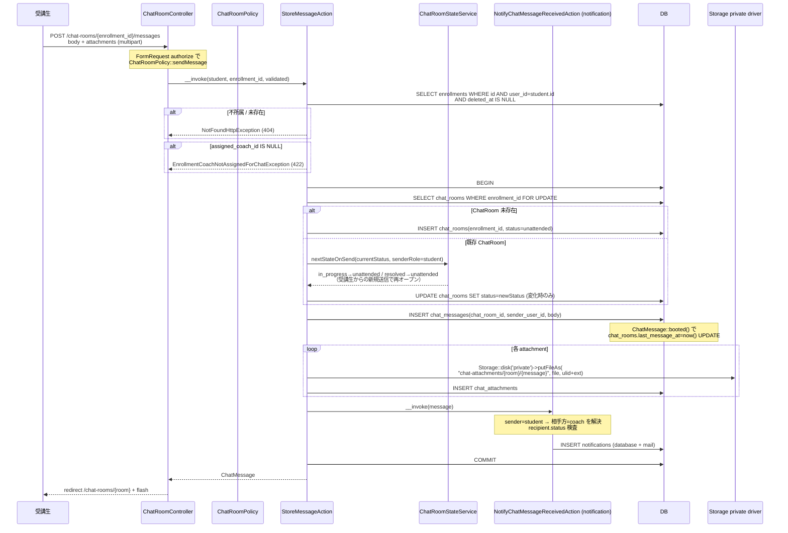
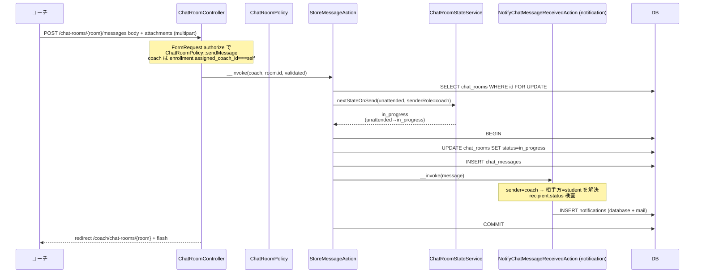
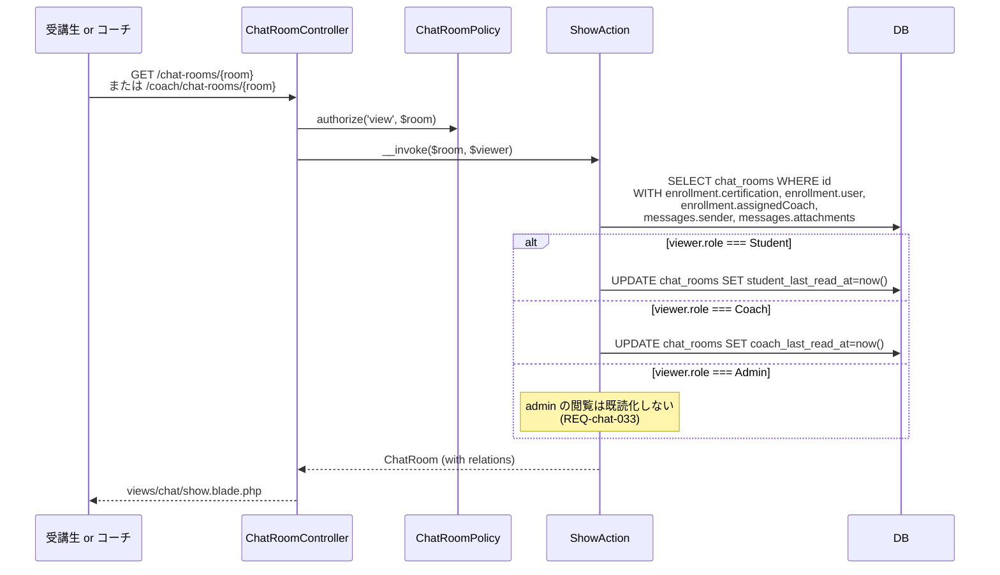
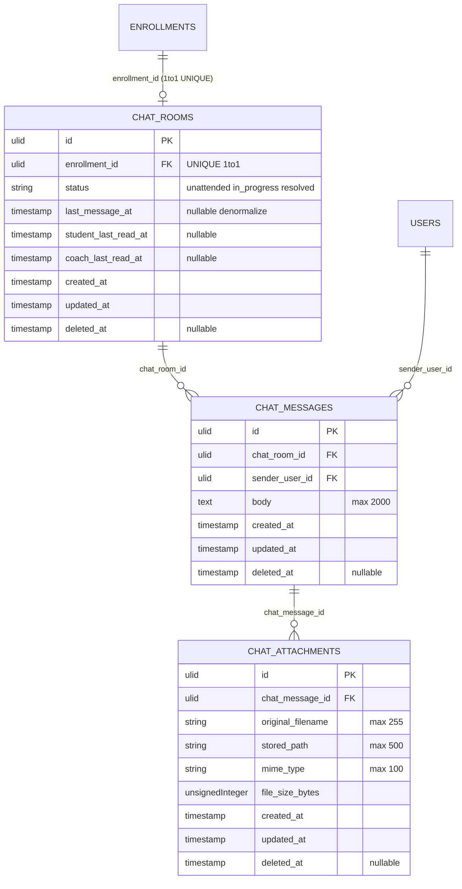

# chat 設計

## アーキテクチャ概要

[[enrollment]] が示す「受講生 × 資格 × 担当コーチ」の三項関係を親として、1 ChatRoom = 1 Enrollment の私的メッセージング Feature を構築する。Clean Architecture（軽量版）に従い、Controller は薄く、Action（UseCase）が状態遷移 + 添付保存 + [[notification]] 発火を `DB::transaction()` 内で 1 トランザクションに束ねる。Controller / Policy はロール別 namespace を使わず（`structure.md` 準拠）、受講生用一覧（`index`）/ コーチ用一覧（`indexAsCoach`）/ admin 監査用 Controller（`Admin\ChatRoomController`）の 3 つに分けて URL を区別する。`ChatUnreadCountService` が「未読件数の集計」を一手に提供し、本 Feature の一覧バッジ / `SidebarBadgeComposer` / [[dashboard]] の coach 用ウィジェットが再利用する。

非同期方式（Phase 0 合意 B 案）のため chat 画面では `fetch` ポーリングや WebSocket を使わず、画面遷移 / リロードで最新化する。Pusher 連携は本 Feature には含めず、新着通知のリアルタイム push は [[notification]] Feature の Advance Broadcasting セクションに集約する。

### 1. 受講生 → 担当コーチ 初回送信（ChatRoom 自動生成）



### 2. コーチ返信 → unattended → in_progress



### 3. 解決済化（コーチ / 受講生）

```mermaid
sequenceDiagram
    participant Actor as コーチ or 受講生
    participant CRC as ChatRoomController
    participant Pol as ChatRoomPolicy
    participant RA as ResolveAction
    participant DB as DB

    Actor->>CRC: POST /chat-rooms/{room}/resolve
    CRC->>Pol: authorize('resolve', $room)
    Note over Pol: coach: 当事者かつ全状態 OK<br/>student: 当事者かつ status=in_progress
    CRC->>RA: __invoke($room, $actor)
    RA->>RA: status === Resolved チェック（冪等性）
    alt 既に resolved
        RA-->>CRC: ChatRoomAlreadyResolvedException (409)
    end
    RA->>DB: BEGIN
    RA->>DB: UPDATE chat_rooms SET status=resolved
    RA->>DB: COMMIT
    RA-->>CRC: ChatRoom
    CRC-->>Actor: redirect back + flash「解決済にしました」
```

### 4. ルーム詳細閲覧 → last_read_at 自動更新（既読化）



### 5. 添付ダウンロード（signed URL）

```mermaid
sequenceDiagram
    participant Viewer as 当事者 or admin
    participant ACL as ChatAttachmentController
    participant Pol as ChatAttachmentPolicy
    participant DA as DownloadAction
    participant FS as Storage private driver

    Note over Viewer: Blade 内で signed URL 生成済<br/>URL::temporarySignedRoute(<br/>'chat-attachments.download',<br/>now()+10min, attachment-id)
    Viewer->>ACL: GET signed URL
    Note over ACL: 'signed' middleware で<br/>署名 + 期限を検証
    alt 署名不一致 or 期限切れ
        ACL-->>Viewer: 403 Forbidden (REQ-chat-025)
    end
    ACL->>Pol: authorize('download', $attachment)
    Note over Pol: $attachment->message->chatRoom に対する<br/>ChatRoomPolicy::view 委譲 (REQ-chat-053)
    ACL->>DA: __invoke($attachment)
    DA->>FS: Storage::disk('private')->path($attachment->stored_path)
    DA-->>ACL: BinaryFileResponse<br/>(Content-Disposition: attachment; filename=...)
    ACL-->>Viewer: ファイルダウンロード
```

## データモデル

### Eloquent モデル一覧

- **`ChatRoom`** — 1 ChatRoom = 1 Enrollment の私的ルーム。`HasUlids` + `HasFactory` + `SoftDeletes`、`ChatRoomStatus` enum cast、`last_message_at` / `student_last_read_at` / `coach_last_read_at` を `datetime` cast。`belongsTo(Enrollment::class)` / `hasMany(ChatMessage::class)` / `hasOne(ChatMessage::class, 'chat_room_id')->latestOfMany('created_at')` を `latestMessage()` で公開（一覧プレビュー用）。スコープ: `scopeForStudent(User $student)` / `scopeForCoach(User $coach)` / `scopeWithStatus(ChatRoomStatus $status)` / `scopeOrderByLastMessage()`（`orderByDesc('last_message_at')`）。
- **`ChatMessage`** — 個別メッセージ。`HasUlids` + `HasFactory` + `SoftDeletes`、`belongsTo(ChatRoom::class)` / `belongsTo(User::class, 'sender_user_id', 'sender')` / `hasMany(ChatAttachment::class)`。`booted()` の `created` フックで親 `chat_rooms.last_message_at = $message->created_at` を UPDATE（denormalize、NFR-chat-003）。スコープ: `scopeForRoom(ChatRoom $room)` / `scopeAfter(?CarbonInterface $at)`（未読カウント用）。
- **`ChatAttachment`** — 添付メタ。`HasUlids` + `HasFactory` + `SoftDeletes`、`belongsTo(ChatMessage::class)`。**実ファイルは Storage private driver** の `chat-attachments/{room-ulid}/{message-ulid}/{attachment-ulid}.{ext}` に保存。

### ER 図



### 主要カラム + Enum

| Model | Enum | 値 | 日本語ラベル |
|---|---|---|---|
| `ChatRoom.status` | `ChatRoomStatus` | `Unattended` / `InProgress` / `Resolved` | `未対応` / `対応中` / `解決済` |
| `ChatAttachment.mime_type` | （enum 化しない、文字列保持） | `image/png` / `image/jpeg` / `image/webp` / `application/pdf` | — |

`ChatRoomStatus` enum の `badgeVariant()` メソッドで `<x-badge>` の variant 名（`warning` / `info` / `success`）を返し、Blade からの直接マッピングを排除する。

### インデックス・制約

`chat_rooms`:
- `enrollment_id`: 外部キー `->constrained()->restrictOnDelete()` + UNIQUE INDEX（1 Enrollment = 1 ChatRoom、REQ-chat-001。Enrollment が物理削除されることは通常ないが restrict で安全）
- `(status, last_message_at DESC)`: 複合 INDEX（コーチ一覧で `WHERE status=unattended ORDER BY last_message_at DESC` を高速化）
- `last_message_at`: 単体 INDEX（受講生一覧で `ORDER BY last_message_at DESC` を高速化、NFR-chat-004）
- `deleted_at`: 単体 INDEX

`chat_messages`:
- `chat_room_id`: 外部キー `->constrained()->cascadeOnDelete()` + `(chat_room_id, created_at)` 複合 INDEX（時系列描画 + 未読カウント `WHERE created_at > last_read_at` を高速化、NFR-chat-004）
- `sender_user_id`: 外部キー `->constrained('users')->restrictOnDelete()` + 単体 INDEX
- `deleted_at`: 単体 INDEX

`chat_attachments`:
- `chat_message_id`: 外部キー `->constrained()->cascadeOnDelete()` + 単体 INDEX
- `deleted_at`: 単体 INDEX

> 物理削除を行わない前提（`SoftDeletes` 採用）。`cascadeOnDelete()` は将来の運用清掃用、通常運用では発火しない。

## 状態遷移

`product.md` 「## ステータス遷移 F」に厳格準拠 + Phase 0 で合意した受講生主導 `resolve` を反映。

```mermaid
stateDiagram-v2
    unattended: unattended（未対応）
    in_progress: in_progress（対応中）
    resolved: resolved（解決済）

    [*] --> unattended: StoreMessageAction（受講生初回送信）
    unattended --> in_progress: StoreMessageAction（コーチ返信、ChatRoomStateService が遷移決定）
    in_progress --> resolved: ResolveAction（コーチが完了化）
    in_progress --> resolved: ResolveAction（受講生が解決マーク、ChatRoomPolicy::resolve で許可）
    resolved --> unattended: StoreMessageAction（受講生が新規送信、ChatRoomStateService が遷移決定）
    in_progress --> unattended: StoreMessageAction（受講生が新規送信、ChatRoomStateService が遷移決定）
    resolved --> [*]
```

> **遷移ロジックの一意化**: 「送信時の遷移」は `ChatRoomStateService::nextStateOnSend(ChatRoomStatus, UserRole): ChatRoomStatus` に集約し、`StoreMessageAction` から呼ぶ。「解決済化」は `ResolveAction` が直接 UPDATE する。状態遷移 UPDATE はすべて `DB::transaction()` 内の `SELECT ... FOR UPDATE` の後で行う（race condition 防止、NFR-chat-001）。

## コンポーネント

### Controller

`app/Http/Controllers/`（ロール別 namespace は使わず、URL とメソッドで分岐 / `structure.md` 準拠）。受講生用と admin 監査用は Controller を分離し、コーチ用一覧は受講生用 Controller の別 method として併置する（mentoring spec の `index` / `indexAsCoach` パターンと整合）。

- **`ChatRoomController`** — 受講生 + コーチ向け
  - `index(IndexRequest, IndexAction)` — 受講生の自分のルーム一覧（受講生のみ呼出、`Route::middleware('role:student')` でガード）
  - `indexAsCoach(IndexAsCoachRequest, IndexAsCoachAction)` — コーチ担当ルーム一覧（コーチのみ、status / certification / keyword フィルタ + paginate）
  - `show(ChatRoom $room, ShowAction)` — ルーム詳細（当事者 + admin、Policy で分岐、admin は read-only ビューへリダイレクト）
  - `storeMessage(ChatRoom $room, StoreMessageRequest, StoreMessageAction)` — メッセージ送信（当事者のみ、admin 不可）
  - `resolve(ChatRoom $room, ResolveAction)` — 解決済化（当事者のみ、Policy で `student` は `status=in_progress` のみ許可）

- **`Admin\ChatRoomController`** — admin 監査専用
  - `index(Admin\IndexRequest, Admin\IndexAction)` — 全ルーム一覧 + 受講生 / コーチ / 資格フィルタ
  - `show(ChatRoom $room, Admin\ShowAction)` — 詳細閲覧（last_read_at UPDATE せず、送信フォーム描画なし）

- **`ChatAttachmentController`** — 添付ダウンロード
  - `download(ChatAttachment $attachment, DownloadAction)` — `signed` middleware で署名検証後、当事者または admin に `BinaryFileResponse` を返す

### Action（UseCase）

`structure.md` 規約「Controller method 名 = Action クラス名」に厳格準拠。`app/UseCases/Chat/` 配下に受講生 + コーチ用、`app/UseCases/Admin/Chat/` 配下に admin 監査用、`app/UseCases/ChatAttachment/` 配下に添付ダウンロード用を配置。

#### `IndexAction`

```php
// app/UseCases/Chat/IndexAction.php
namespace App\UseCases\Chat;

use App\Models\User;
use Illuminate\Pagination\LengthAwarePaginator;

class IndexAction
{
    public function __construct(private ChatUnreadCountService $unread) {}

    /**
     * 受講生の自分宛 ChatRoom 一覧を最終メッセージ降順で返す。
     * 各 Room に未読件数を unread service で attach する。
     */
    public function __invoke(User $student, int $perPage = 20): LengthAwarePaginator;
}
```

責務: (1) `ChatRoom::forStudent($student)->with(['enrollment.certification', 'enrollment.assignedCoach', 'latestMessage.sender'])->orderByLastMessage()->paginate($perPage)`、(2) `$paginator->items()` に `ChatUnreadCountService::messageCountInRoom()` の結果を attach（`$room->unread_count`）、(3) `enrollment.assigned_coach_id IS NULL` のルームは `coach_unassigned = true` フラグを attach。

#### `IndexAsCoachAction`

```php
class IndexAsCoachAction
{
    public function __construct(private ChatUnreadCountService $unread) {}

    public function __invoke(
        User $coach,
        ?ChatRoomStatus $status,
        ?string $certificationId,
        ?string $keyword,
        int $perPage = 20,
    ): LengthAwarePaginator;
}
```

責務: (1) `ChatRoom::forCoach($coach)` を起点に `$status` フィルタ（指定なしは `unattended` デフォルト、`all` 指定で全件）、`$certificationId` フィルタ、`$keyword`（`enrollment.user.name` LIKE）、(2) 同様に eager load + `orderByLastMessage()` + `paginate`、(3) 未読件数 attach。

#### `ShowAction`

```php
class ShowAction
{
    public function __invoke(ChatRoom $room, User $viewer): ChatRoom;
}
```

責務: (1) `$room->load(['enrollment.certification', 'enrollment.user', 'enrollment.assignedCoach', 'messages' => fn ($q) => $q->with(['sender', 'attachments'])->oldest()])`、(2) `$viewer->role` に応じて `student_last_read_at` または `coach_last_read_at` を `now()` で UPDATE（`admin` は UPDATE しない、REQ-chat-031〜033）、(3) `DB::transaction()` で囲む。

#### `StoreMessageAction`

```php
class StoreMessageAction
{
    public function __construct(
        private ChatRoomStateService $stateService,
        private NotifyChatMessageReceivedAction $notify,
    ) {}

    /**
     * メッセージ送信 + ルーム状態遷移 + 添付保存 + 通知発火 を 1 トランザクションで実行。
     * ChatRoom 未存在時は受講生送信のみ許容して INSERT、コーチ送信時に未存在は 404。
     *
     * @param User $sender 当事者（student または coach）
     * @param string $enrollmentOrRoomId 受講生の初回送信時は enrollment_id、それ以外は chat_room_id
     * @param array $validated body + attachments[]
     * @throws EnrollmentCoachNotAssignedForChatException assigned_coach_id IS NULL
     * @throws ChatRoomNotFoundException コーチ送信時に ChatRoom 未存在
     * @throws ModelNotFoundException 受講生が他人の Enrollment に送信しようとした場合
     */
    public function __invoke(User $sender, string $enrollmentOrRoomId, array $validated): ChatMessage;
}
```

責務（実装の主軸）:
- (1) sender role 別の入口分岐: `student` なら `Enrollment` 経由で `ChatRoom` を upsert（`firstOrCreate(['enrollment_id' => ...], ['status' => Unattended])`）、`coach` なら `ChatRoom::findOrFail($enrollmentOrRoomId)` + `assigned_coach_id === sender.id` 検証
- (2) `assigned_coach_id IS NULL` 検査 → `EnrollmentCoachNotAssignedForChatException`
- (3) `SELECT ... FOR UPDATE` でルームを取り、`ChatRoomStateService::nextStateOnSend($room->status, $sender->role)` で新状態決定。変化時のみ UPDATE
- (4) `ChatMessage` INSERT、`ChatMessage::booted()` の `created` フックが `chat_rooms.last_message_at` を自動 UPDATE
- (5) 各 attachment を Storage private driver に保存し `ChatAttachment` INSERT
- (6) `NotifyChatMessageReceivedAction($message)` を呼んで Database + Mail 両方の通知を発火（sender role 判定 + 相手方解決は notification 側責務、本 Feature 側は `$message` のみを渡す、A-1 合意で双方向通知）
- (7) すべて `DB::transaction()` 内（NFR-chat-001）

#### `ResolveAction`

```php
class ResolveAction
{
    public function __invoke(ChatRoom $room, User $actor): ChatRoom
    {
        if ($room->status === ChatRoomStatus::Resolved) {
            throw new ChatRoomAlreadyResolvedException();
        }
        // student が呼ぶケースは Policy で status=in_progress 限定済（REQ-chat-052）
        return DB::transaction(function () use ($room) {
            $room->update(['status' => ChatRoomStatus::Resolved]);
            return $room->fresh();
        });
    }
}
```

責務: 既 `Resolved` ガード → `Resolved` へ UPDATE。`unattended → resolved` パスは state diagram に無いが、Policy で coach も `view` 条件のみで `resolve` 可とするため、コーチが `unattended` から直接 `resolved` 化できる経路は API レベルで存在する。学習相談として「コーチが見てすぐ完了化」というケースに対応（product.md state diagram 上はメッセージ送信を介さない遷移として暗黙）。

> 受講生は Policy で `status=in_progress` のみ許可 → `unattended` ルームを生徒が解決済化することはない（生徒は自分で送信した直後のルームを `resolved` 化したくなる文脈がない）。

#### `Admin\Chat\IndexAction` / `Admin\Chat\ShowAction`

```php
namespace App\UseCases\Admin\Chat;

class IndexAction
{
    public function __invoke(
        ?string $studentName,
        ?string $coachName,
        ?string $certificationId,
        ?ChatRoomStatus $status,
        int $perPage = 30,
    ): LengthAwarePaginator;
}

class ShowAction
{
    public function __invoke(ChatRoom $room): ChatRoom;
}
```

責務: admin 監査用に全 ChatRoom を横断検索 + 詳細閲覧。`ShowAction` は `last_read_at` を UPDATE しない（REQ-chat-033）。

#### `ChatAttachment\DownloadAction`

```php
namespace App\UseCases\ChatAttachment;

class DownloadAction
{
    public function __invoke(ChatAttachment $attachment): BinaryFileResponse
    {
        return Storage::disk('private')->download(
            $attachment->stored_path,
            $attachment->original_filename,
            ['Content-Type' => $attachment->mime_type],
        );
    }
}
```

責務: Policy / signed middleware を通過した後の純粋なファイル配信のみ。`Storage::disk('private')->download()` が `Content-Disposition: attachment; filename="{original}"` を自動付与（REQ-chat-026）。

### Service

`app/Services/`:

- **`ChatRoomStateService`** — ルーム状態遷移ロジックの一意化。`StoreMessageAction` からのみ呼ばれる純粋関数。

```php
namespace App\Services;

use App\Enums\ChatRoomStatus;
use App\Enums\UserRole;

class ChatRoomStateService
{
    /**
     * 送信時のルーム状態遷移を決定する純粋関数。
     * - student が送信: 現状態が in_progress / resolved なら unattended へ遷移（再要対応）、unattended は不変
     * - coach が送信: 現状態が unattended なら in_progress へ遷移、それ以外は不変
     *
     * admin は送信不可（Policy で防御済、本関数の呼出経路には到達しない前提）。
     */
    public function nextStateOnSend(ChatRoomStatus $current, UserRole $senderRole): ChatRoomStatus
    {
        return match (true) {
            $senderRole === UserRole::Student && $current === ChatRoomStatus::Unattended => ChatRoomStatus::Unattended,
            $senderRole === UserRole::Student => ChatRoomStatus::Unattended,
            $senderRole === UserRole::Coach && $current === ChatRoomStatus::Unattended => ChatRoomStatus::InProgress,
            $senderRole === UserRole::Coach => $current,
            default => $current,
        };
    }
}
```

- **`ChatUnreadCountService`** — 未読件数集計（`product.md` 集計責務マトリクス記載、所有 Feature = chat、利用先 = chat + dashboard + SidebarBadgeComposer）。

```php
namespace App\Services;

use App\Models\ChatRoom;
use App\Models\User;
use App\Enums\UserRole;

class ChatUnreadCountService
{
    /**
     * 指定ルーム内で、user 宛（自分以外が送信した）かつ last_read_at 以降のメッセージ件数を返す。
     */
    public function messageCountInRoom(ChatRoom $room, User $user): int;

    /**
     * user が当事者の全ルームのうち、自分宛未読メッセージを 1 件以上含むルームの数を返す。
     * サイドバー badge / dashboard で使用。
     */
    public function roomCountForUser(User $user): int;
}
```

実装: `messageCountInRoom` は `$room->messages()->where('sender_user_id', '!=', $user->id)->where('created_at', '>', $lastReadAt)->count()`、`$lastReadAt` は `$user->role` で `student_last_read_at` / `coach_last_read_at` から取得（NULL は `Carbon::createFromTimestamp(0)` 相当）。`roomCountForUser` は SQL レベル集計（1 クエリで `chat_rooms` を JOIN + `EXISTS` 副問い合わせ、N+1 回避、NFR-chat-002）。

### Policy

`app/Policies/`:

- **`ChatRoomPolicy`**

```php
class ChatRoomPolicy
{
    public function viewAny(User $user): bool
    {
        return in_array($user->role, [UserRole::Admin, UserRole::Coach, UserRole::Student], true);
    }

    public function view(User $user, ChatRoom $room): bool
    {
        return match ($user->role) {
            UserRole::Admin => true,
            UserRole::Coach => $room->enrollment->assigned_coach_id === $user->id,
            UserRole::Student => $room->enrollment->user_id === $user->id,
        };
    }

    public function sendMessage(User $user, ChatRoom $room): bool
    {
        if ($user->role === UserRole::Admin) return false;
        if (! $this->view($user, $room)) return false;
        return $room->enrollment->assigned_coach_id !== null;
    }

    public function resolve(User $user, ChatRoom $room): bool
    {
        return match ($user->role) {
            UserRole::Admin => false,
            UserRole::Coach => $this->view($user, $room),
            UserRole::Student => $this->view($user, $room) && $room->status === ChatRoomStatus::InProgress,
        };
    }
}
```

- **`ChatAttachmentPolicy`**

```php
class ChatAttachmentPolicy
{
    public function __construct(private ChatRoomPolicy $roomPolicy) {}

    public function download(User $user, ChatAttachment $attachment): bool
    {
        return $this->roomPolicy->view($user, $attachment->message->chatRoom);
    }
}
```

> Policy の `view` 委譲で `ChatAttachmentPolicy` は最小化（REQ-chat-053）。

### FormRequest

`app/Http/Requests/`:

- **`Chat\IndexRequest`** — `page: nullable integer min:1`、`authorize`: `$this->user()->role === UserRole::Student`
- **`Chat\IndexAsCoachRequest`** — `status: nullable in:unattended,in_progress,resolved,all` / `certification_id: nullable ulid exists:certifications,id` / `keyword: nullable string max:50` / `page: nullable integer min:1`、`authorize`: `$this->user()->role === UserRole::Coach`
- **`Chat\StoreMessageRequest`** — `body: required string max:2000` / `attachments: nullable array max:3` / `attachments.*: file mimes:png,jpg,jpeg,webp,pdf max:5120`（5120KB = 5MB、`mimes` で MIME 検査 + 拡張子検査の二重防御）、`authorize`: `$this->user()->can('sendMessage', $this->route('room'))`
- **`Admin\Chat\IndexRequest`** — `student_name: nullable string max:50` / `coach_name: nullable string max:50` / `certification_id: nullable ulid` / `status: nullable in:...` / `page: nullable integer min:1`、`authorize`: `$this->user()->role === UserRole::Admin`

> `Chat\StoreMessageRequest` の `attachments` で `mimes:png,jpg,jpeg,webp,pdf` を指定すると Laravel が拡張子と MIME の両方を検査（PHP の `finfo` 経由）。REQ-chat-021 で要求される拡張子バリデーションの一次防御として機能する。

### Route

`routes/web.php`（structure.md 規約「単一 web.php」準拠）:

```php
// 認証後共通
Route::middleware('auth')->group(function () {

    // 受講生用一覧 / 詳細 / 送信 / 解決済化
    Route::middleware('role:student')->group(function () {
        Route::get('chat-rooms', [ChatRoomController::class, 'index'])->name('chat.index');
    });

    // コーチ用一覧
    Route::middleware('role:coach')->group(function () {
        Route::get('coach/chat-rooms', [ChatRoomController::class, 'indexAsCoach'])->name('coach.chat.index');
    });

    // ルーム詳細・送信・解決化（当事者共通、Policy で分岐）
    Route::get('chat-rooms/{room}', [ChatRoomController::class, 'show'])->name('chat.show');
    Route::post('chat-rooms/{room}/messages', [ChatRoomController::class, 'storeMessage'])
        ->name('chat.storeMessage');
    Route::post('chat-rooms/{room}/resolve', [ChatRoomController::class, 'resolve'])
        ->name('chat.resolve');

    // 受講生の初回送信用（ChatRoom 未存在時、enrollment_id 経由）
    Route::post('enrollments/{enrollment}/chat/messages', [ChatRoomController::class, 'storeMessage'])
        ->name('chat.storeFirstMessage');

    // 添付ダウンロード（signed URL のみ受付）
    Route::get('chat-attachments/{attachment}/download', [ChatAttachmentController::class, 'download'])
        ->middleware('signed')
        ->name('chat-attachments.download');
});

// admin 監査
Route::middleware(['auth', 'role:admin'])->prefix('admin')->group(function () {
    Route::get('chat-rooms', [Admin\ChatRoomController::class, 'index'])->name('admin.chat-rooms.index');
    Route::get('chat-rooms/{room}', [Admin\ChatRoomController::class, 'show'])
        ->name('admin.chat-rooms.show');
});
```

> 受講生の初回送信は ChatRoom が未存在のため、`enrollments/{enrollment}/chat/messages` POST を別 route として用意し `storeMessage` Action 内で sender role + 第 2 引数を見て分岐する（DRY のため Controller method は 1 つ）。

## Blade ビュー

`resources/views/chat/` および `resources/views/admin/chat-rooms/`:

| ファイル | 役割 |
|---|---|
| `chat/index.blade.php` | 受講生ルーム一覧。`<x-card>` に Enrollment ごとのカード、未割当の場合 `<x-badge variant="warning">コーチ未割当</x-badge>` + 開くボタン disabled |
| `chat/coach-index.blade.php` | コーチ用一覧。`<x-tabs>` で `status` 切替（unattended デフォルト）、`<x-form.input>` で keyword、`<x-form.select>` で certification、`<x-table>` で結果表示 + `<x-paginator>` |
| `chat/show.blade.php` | ルーム詳細。ヘッダーに資格名 + 相手名 + `<x-badge>` で status、メッセージ一覧（`@foreach` で `_partials/message-item`）、フッターに送信フォーム（admin は表示しない）|
| `chat/_partials/message-item.blade.php` | 1 メッセージの吹き出し。自分 = 右寄せ + `bg-primary-50`、相手 = 左寄せ + `bg-gray-50`。`<x-avatar>` + sender 名 + `body` + `_partials/attachment-list` |
| `chat/_partials/attachment-list.blade.php` | 添付一覧。`<x-icon name="paperclip">` + ファイル名 + ダウンロードリンク（`<x-link-button>` に `URL::temporarySignedRoute('chat-attachments.download', now()->addMinutes(10), [...])` を当てる）|
| `chat/_partials/message-form.blade.php` | 送信フォーム。`<x-form.textarea name="body" :maxlength="2000">` + `<x-form.file name="attachments[]" multiple accept="image/png,image/jpeg,image/webp,application/pdf">` + `<x-button type="submit">送信</x-button>`。`@can('sendMessage', $room)` で囲み、admin / 当事者外には描画しない |
| `chat/_partials/empty-message.blade.php` | `<x-empty-state icon="chat-bubble-left-right">` で空状態（初回送信前 / 一覧 0 件）|
| `admin/chat-rooms/index.blade.php` | 全 ChatRoom 一覧 + 検索 + フィルタ |
| `admin/chat-rooms/show.blade.php` | admin 用詳細閲覧。送信フォーム描画なし、`<x-alert type="info">監査モード（閲覧のみ）</x-alert>` を上部に表示 |

主要コンポーネント（Wave 0b で整備済み、REQ-chat-NFR-007）:
- `<x-button>` / `<x-link-button>` / `<x-form.textarea>` / `<x-form.file>` / `<x-form.input>` / `<x-form.select>`
- `<x-modal>`（解決済化の確認モーダル）/ `<x-alert>` / `<x-card>` / `<x-badge>` / `<x-avatar>` / `<x-icon>`
- `<x-empty-state>` / `<x-tabs>` / `<x-paginator>` / `<x-table>` / `<x-breadcrumb>`

## エラーハンドリング

### 想定例外（`app/Exceptions/Chat/`）

- **`EnrollmentCoachNotAssignedForChatException`** — `\Symfony\Component\HttpKernel\Exception\HttpException`（HTTP 422）継承
  - メッセージ: 「担当コーチが割り当てられていません。管理者にお問い合わせください。」
  - 発生: `StoreMessageAction` で `enrollment.assigned_coach_id IS NULL` の場合（REQ-chat-002）
- **`ChatRoomNotFoundException`** — `NotFoundHttpException`（HTTP 404）継承
  - メッセージ: 「チャットルームが見つかりません。」
  - 発生: `StoreMessageAction` のコーチ送信経路で `ChatRoom` 未存在の場合（通常は Route Model Binding で 404、これは API 経路や race condition 用）
- **`ChatRoomAlreadyResolvedException`** — `\Symfony\Component\HttpKernel\Exception\ConflictHttpException`（HTTP 409）継承
  - メッセージ: 「このチャットルームは既に解決済です。」
  - 発生: `ResolveAction` で `$room->status === Resolved` の場合（冪等性ガード）
- **`ChatAttachmentTooManyException`** — `HttpException`（HTTP 422）継承（FormRequest で先に検知されるが、API 経路の二次防御として保持）
- **`ChatAttachmentSizeExceededException`** — `HttpException`（HTTP 422）継承（同上）

### Controller / Action の境界

- **FormRequest が一次防御**: `body` 文字数 / `attachments` 件数 / `attachments.*` MIME + サイズはすべて FormRequest で 422 返却
- **Action が二次防御 + ドメイン制約**: `assigned_coach_id IS NULL` / ルーム所有検査 / 状態整合性チェックは Action 内で具象例外を throw（FormRequest では掬えないドメイン状態）
- **Route Model Binding**: `ChatRoom $room` / `ChatAttachment $attachment` / `Enrollment $enrollment` は標準の Implicit Binding を使い、未存在は 404

### 列挙攻撃 / 情報漏洩の防止

- `ChatRoomPolicy::view` で 403 を返すと「ルームが存在しない」と「他人のルーム」を区別できる。これを避けるため `Route` に `withTrashed()` を付けず、`SoftDeletes` 除外 + Policy 403 という二段で外形上は **同じ 404 / 403** に揃える。
- 添付の signed URL は 10 分有効、URL 自体が直接アクセス制御の責任を負わない（Policy + signed の二段防御、REQ-chat-024〜025、NFR-chat-005）。

## 関連要件マッピング

| 要件 ID | 実装ポイント |
|---|---|
| REQ-chat-001 | `database/migrations/{date}_create_chat_rooms_table.php`（`enrollment_id` UNIQUE）/ `App\Models\ChatRoom` |
| REQ-chat-002 | `App\UseCases\Chat\StoreMessageAction`（`enrollment.assigned_coach_id IS NULL` 検査）/ `App\Exceptions\Chat\EnrollmentCoachNotAssignedForChatException` |
| REQ-chat-003 | `App\UseCases\Chat\StoreMessageAction`（受講生送信時の `ChatRoom::firstOrCreate` ロジック）|
| REQ-chat-004 | `App\Enums\ChatRoomStatus` / `database/migrations/{date}_create_chat_rooms_table.php`（`status` enum 列） |
| REQ-chat-005 | `App\UseCases\Chat\StoreMessageAction`（受講生初回時 INSERT 時の `status=Unattended` 固定）|
| REQ-chat-006 / REQ-chat-008 / REQ-chat-009 | `App\Services\ChatRoomStateService::nextStateOnSend` / `App\UseCases\Chat\StoreMessageAction` |
| REQ-chat-007 / REQ-chat-008 | `App\UseCases\Chat\ResolveAction` / `App\Policies\ChatRoomPolicy::resolve`（student は status=in_progress 限定）|
| REQ-chat-010 | `App\Policies\ChatRoomPolicy::sendMessage` / `App\Http\Requests\Chat\StoreMessageRequest::authorize` |
| REQ-chat-011 | `App\Http\Requests\Chat\StoreMessageRequest::rules`（`body: required string max:2000`）|
| REQ-chat-012 | `App\UseCases\Chat\ShowAction`（`messages` リレーション eager load 時に `oldest()`）|
| REQ-chat-013 | `resources/views/chat/_partials/message-item.blade.php`（`@if($message->sender_user_id === auth()->id())` で左右切替）|
| REQ-chat-014 | Controller / Action / Route ともに edit / delete を**実装しない**（明示的非実装、tasks.md に「実装しない」を記録）|
| REQ-chat-015 | `resources/views/chat/show.blade.php`（`@can('sendMessage', $room)` でフォームを囲む）/ `App\Policies\ChatRoomPolicy::sendMessage`（admin は false）|
| REQ-chat-020 | `App\Http\Requests\Chat\StoreMessageRequest::rules`（`attachments: max:3` + `attachments.*: file mimes:... max:5120`）|
| REQ-chat-021 | 同上 `mimes:png,jpg,jpeg,webp,pdf` 制約 |
| REQ-chat-022 | `App\UseCases\Chat\StoreMessageAction`（`Storage::disk('private')->putFileAs(...)`）/ `config/filesystems.php` の `private` disk 定義（Wave 0b 整備）|
| REQ-chat-023 | `App\Http\Controllers\ChatAttachmentController` / `App\Policies\ChatAttachmentPolicy::download` |
| REQ-chat-024 | `routes/web.php` の `chat-attachments.download` ルートに `middleware('signed')` / Blade での `URL::temporarySignedRoute(..., now()->addMinutes(10))` 呼出 |
| REQ-chat-025 | Laravel `signed` middleware の標準 403 動作 |
| REQ-chat-026 | `App\Models\ChatAttachment`（`original_filename` / `stored_path` / `mime_type` / `file_size_bytes`）/ `App\UseCases\ChatAttachment\DownloadAction`（`Storage::disk('private')->download($path, $filename)`）|
| REQ-chat-030 | `database/migrations/{date}_create_chat_rooms_table.php`（`student_last_read_at` / `coach_last_read_at`）|
| REQ-chat-031 / REQ-chat-032 / REQ-chat-033 | `App\UseCases\Chat\ShowAction`（role 別 UPDATE 分岐、admin は UPDATE しない）|
| REQ-chat-034 / REQ-chat-035 | `App\Services\ChatUnreadCountService::messageCountInRoom` |
| REQ-chat-036 | `App\Services\ChatUnreadCountService::roomCountForUser` / `App\View\Composers\SidebarBadgeComposer`（Wave 0b 整備済、本 Feature で `chat-rooms` キー追加）|
| REQ-chat-040 | `App\Http\Controllers\ChatRoomController::index` / `App\UseCases\Chat\IndexAction` / `resources/views/chat/index.blade.php` |
| REQ-chat-041 / REQ-chat-042 | `App\Http\Controllers\ChatRoomController::indexAsCoach` / `App\UseCases\Chat\IndexAsCoachAction` / `App\Http\Requests\Chat\IndexAsCoachRequest` / `resources/views/chat/coach-index.blade.php` |
| REQ-chat-043 | `App\Http\Controllers\Admin\ChatRoomController::index` / `App\UseCases\Admin\Chat\IndexAction` / `resources/views/admin/chat-rooms/index.blade.php` |
| REQ-chat-044 | `App\UseCases\Chat\IndexAction`（`coach_unassigned` フラグ attach）/ `resources/views/chat/index.blade.php`（`@if($room->coach_unassigned)` 表示分岐 + 開くボタン disabled）|
| REQ-chat-045 | `App\UseCases\Chat\IndexAction` / `IndexAsCoachAction` / `Admin\Chat\IndexAction`（`with(...)` Eager Loading）|
| REQ-chat-046 | `resources/views/chat/_partials/empty-message.blade.php` |
| REQ-chat-050 | `App\Policies\ChatRoomPolicy::view` |
| REQ-chat-051 | `App\Policies\ChatRoomPolicy::sendMessage` |
| REQ-chat-052 | `App\Policies\ChatRoomPolicy::resolve` |
| REQ-chat-053 | `App\Policies\ChatAttachmentPolicy::download`（`ChatRoomPolicy::view` 委譲）|
| REQ-chat-054 | Route Model Binding（404）+ Policy（403）の二段 |
| REQ-chat-060 / REQ-chat-061 / REQ-chat-062 | `App\Policies\ChatRoomPolicy::view` が `$room->enrollment->assigned_coach_id` を都度参照（追加 migration / 処理不要、自動追従）/ `tests/Feature/Http/Chat/CoachReassignmentTest.php` で挙動を担保 |
| REQ-chat-070 / REQ-chat-071 | `App\UseCases\Chat\StoreMessageAction`（`NotifyChatMessageReceivedAction($message)` 呼出、引数は `$message` のみ）/ [[notification]] 側の `App\UseCases\Notification\NotifyChatMessageReceivedAction`（sender role 判定 + 相手方解決を内部で実施、双方向通知）|
| REQ-chat-072 | [[notification]] 側の `ChatMessageReceivedNotification::toDatabase` の data 構造に `chat_room_id` / `chat_message_id` / `sender_user_id` / `sender_name` / `body_preview`（先頭 100 文字）を含める設計（chat 側からは `$message` 経由で必要情報を渡す）|
| REQ-chat-073 | `App\UseCases\Chat\StoreMessageAction` の `DB::transaction()` で `NotifyChatMessageReceivedAction` 呼出も内包（`DB::afterCommit` ではなく同期呼出で、失敗時に全体ロールバック）|
| NFR-chat-001 | 各 Action 内 `DB::transaction()` |
| NFR-chat-002 | `IndexAction` / `IndexAsCoachAction` / `Admin\Chat\IndexAction` / `ShowAction` の `with(...)` Eager Loading / `ChatUnreadCountService::roomCountForUser` の SQL 集計 |
| NFR-chat-003 | `App\Models\ChatMessage::booted` `created` フックの `chat_rooms.last_message_at` UPDATE |
| NFR-chat-004 | `database/migrations/{date}_create_chat_rooms_table.php` の複合 INDEX `(status, last_message_at DESC)` / 単体 INDEX `last_message_at` + `database/migrations/{date}_create_chat_messages_table.php` の複合 INDEX `(chat_room_id, created_at)` |
| NFR-chat-005 | `chat-attachments.download` ルートの `signed` middleware + Blade の `URL::temporarySignedRoute(..., now()->addMinutes(10))` |
| NFR-chat-006 | `App\Exceptions\Chat\*Exception.php`（4 クラス）|
| NFR-chat-007 | `resources/views/chat/**` のすべての Blade が `frontend-blade.md` 規約のコンポーネントのみで構成 |
| NFR-chat-008 | `resources/views/chat/_partials/message-form.blade.php` の `<x-form.textarea aria-label="メッセージ本文">` / `<x-form.file accept="...">` / 未読バッジ `<x-badge aria-label="未読 {{ $count }} 件">` |
