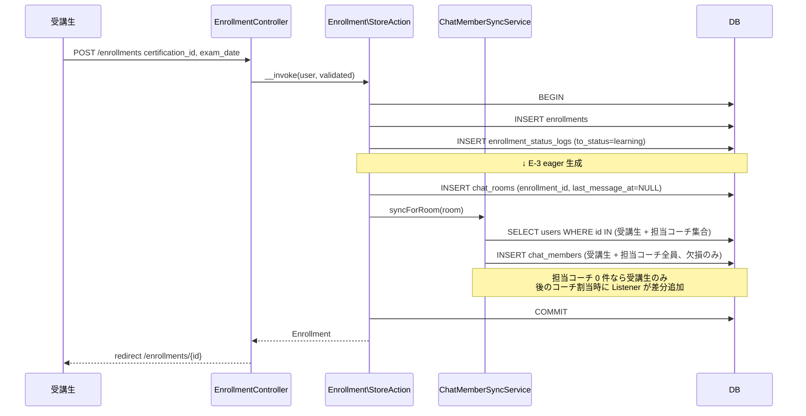
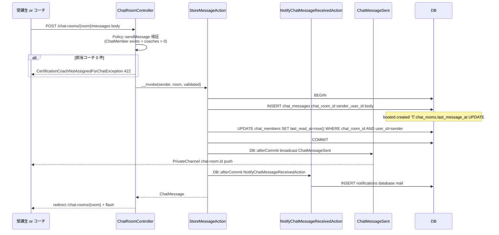
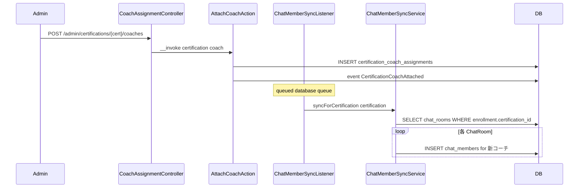
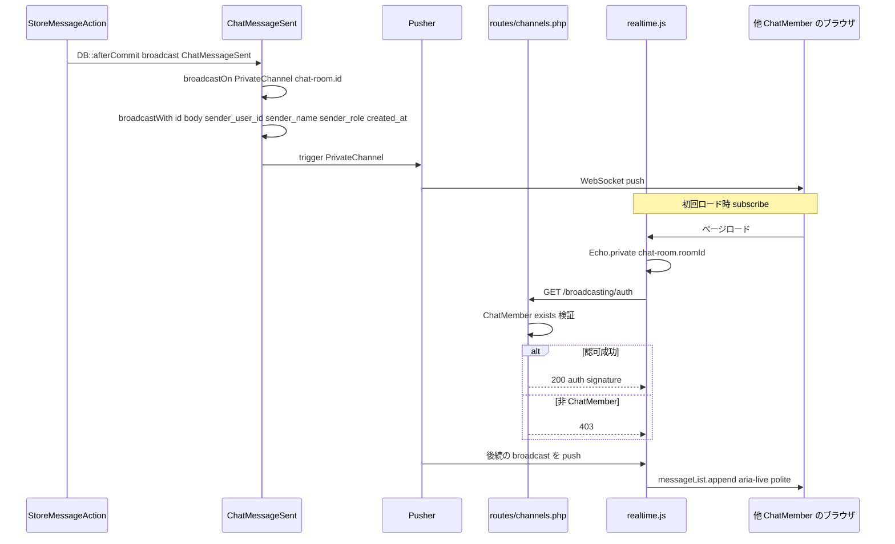
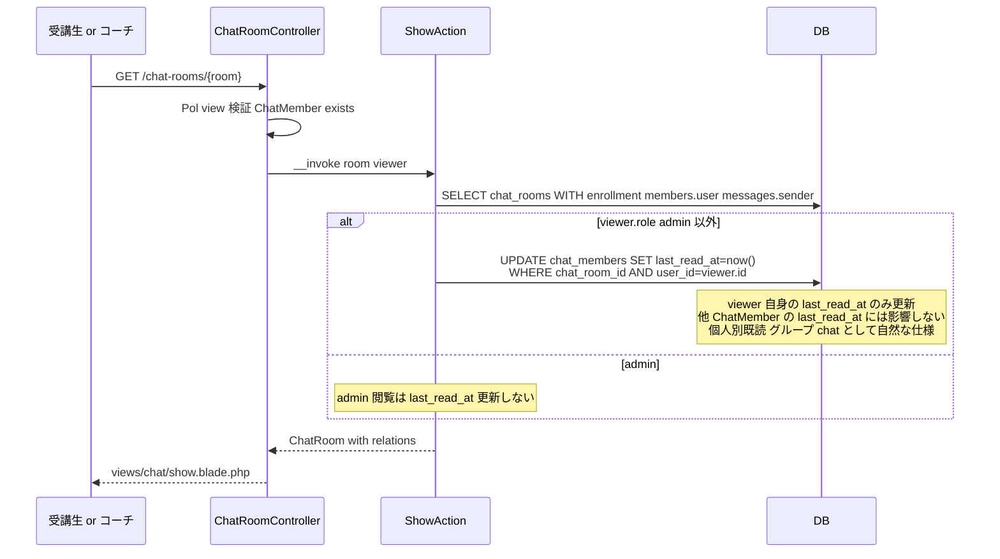
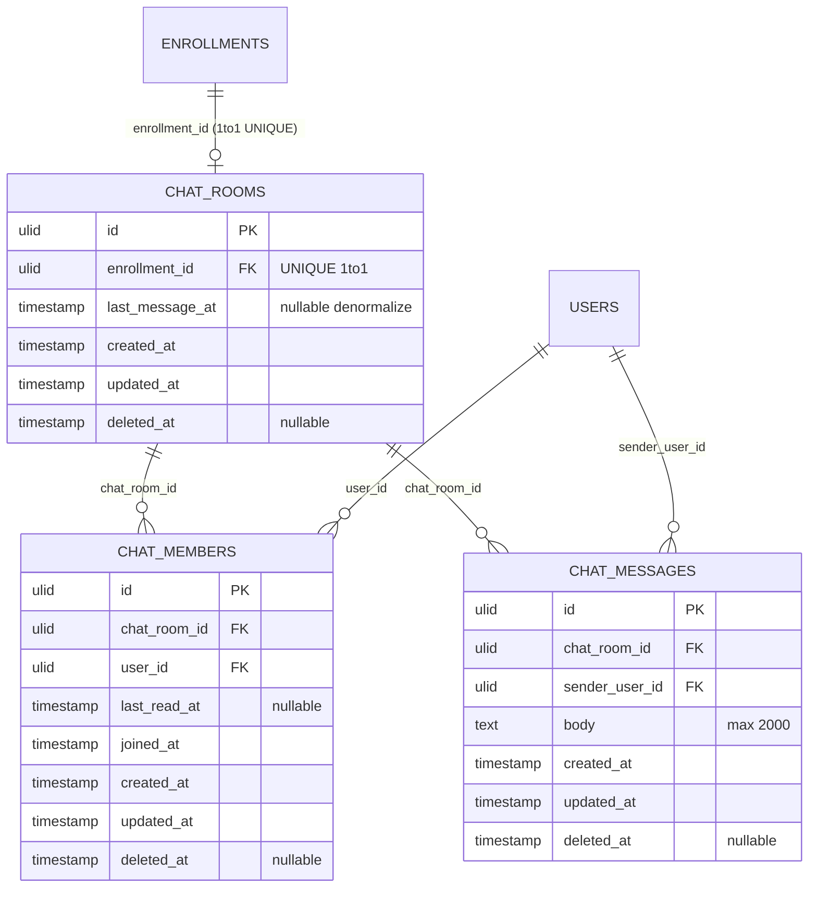

# chat 設計

> **v3 改修反映**(2026-05-16) + **E-2 添付削除** + **E-3 ChatRoom eager 生成**(2026-05-18):
> - 1 受講生 × 1 コーチ → **1 Enrollment = 1 ChatRoom + N ChatMember**(受講生 + 担当資格コーチ全員)のグループルーム化
> - `ChatRoom.status` 撤回(状態遷移を持たない)
> - `chat_members` 中間テーブル新設(`last_read_at` を **個人別**に保持、グループ chat として自然な仕様)
> - **Pusher Broadcasting** によるリアルタイム配信(`PrivateChannel("chat-room.{id}")`)
> - 担当コーチ集合変更を反映する `ChatMemberSyncService` 新設
> - `EnsureActiveLearning` Middleware 連動(graduated は chat 利用不可)
> - **添付ファイル機能を完全撤回**(`chat_attachments` テーブル / `ChatAttachment` Model / `ChatAttachmentController` / `ChatAttachmentPolicy` / Storage private / signed URL すべて削除)
> - **`ChatRoom` + `ChatMember` を `Enrollment` 作成と同一トランザクションで eager 生成**(E-3、旧「初回送信時 lazy 生成」を撤回)。`StoreFirstMessageAction` ラッパー / `chat.storeFirstMessage` ルート / `StoreFirstMessageRequest` / `Policy::sendMessageForEnrollment` / `StoreMessageAction(ChatRoom|Enrollment $target)` の union 引数分岐をすべて撤回し、`StoreMessageAction(User, ChatRoom, array)` に統一。

## アーキテクチャ概要

[[enrollment]] の「受講生 × 資格」を親キーとして、1 Enrollment = 1 ChatRoom の **グループ型 + テキスト専用** メッセージング Feature を構築する。資格に登録されたコーチ集合が全員 ChatMember として参加し、当事者は対等にチャットできる。Clean Architecture(軽量版)に則り、Controller は薄く、Action(UseCase)がメッセージ送信 + 自送信者の `last_read_at` 更新 + Broadcast + [[notification]] 発火を `DB::transaction()` で 1 トランザクションに束ねる(Pusher / 通知 dispatch は `DB::afterCommit()`)。

**E-2 で添付ファイル機能完全撤回**。短期相談用途のため、画像 / ファイル共有は qa-board(公開掲示板) / 教材本文(image 埋め込み) / 面談メモへ誘導、ファイル共有は LMS 外で完結させる。これにより `chat_attachments` テーブル / `ChatAttachment` 関連クラス / Storage private driver の chat 領域 / signed URL ルートをすべて削除し、設計を大幅に簡素化する。

**E-3 で ChatRoom + ChatMember を `Enrollment` 作成時に eager 生成** に変更。[[enrollment]] の `StoreAction` が `DB::transaction()` 内で `ChatRoom::create(['enrollment_id' => $enrollment->id])` + `ChatMemberSyncService::syncForRoom($room)` を呼ぶ(同サービスが受講生本人 + 担当資格コーチ集合を `ChatMember` に INSERT)。これにより:
- 受講登録直後から `/chat-rooms` 一覧にルームが表示され、UI 動線(REQ-chat-050)が整合する
- chat 側の `StoreMessageAction` は `ChatRoom` 確定で受け取れば良くなり、`StoreFirstMessageAction` ラッパーや union 引数分岐が不要になる
- 担当コーチ未割当時は ChatMember に受講生のみ INSERT され、後のコーチ割当時に `SyncChatMembersOnCoachAssignmentChanged` Listener が差分追加する

`ChatMemberSyncService` は **担当コーチ集合の変更**(`CertificationCoachAttached` / `CertificationCoachDetached` Event)に Event Listener として反応し、対応する全 ChatRoom の ChatMember を整合する。`ChatUnreadCountService` は `ChatMember.last_read_at` 基準で **個人別** 未読件数を集計する。

### 1. 受講登録時 ChatRoom + ChatMember 一括 eager 生成(E-3、[[enrollment]] 連携)



### 1b. 受講生送信 → メッセージ INSERT + Broadcast(E-3 で簡素化、ChatRoom は eager 済み)



### 2. 担当コーチ集合変更時の ChatMember 同期



### 3. リアルタイム配信(Pusher Broadcasting)



### 4. ルーム詳細閲覧 → ChatMember.last_read_at 個人別更新



> **E-2 で添付ダウンロードのシーケンス図(旧 §5)は完全撤回**。

## データモデル

### Eloquent モデル一覧

- **`ChatRoom`** — 1 ChatRoom = 1 Enrollment のグループルーム。`HasUlids` + `HasFactory` + `SoftDeletes`、`last_message_at` を `datetime` cast。`belongsTo(Enrollment::class)` / `hasMany(ChatMessage::class)` / `hasMany(ChatMember::class)` / `hasOne(ChatMessage::class)->latestOfMany()` を `latestMessage()` で公開。スコープ: `scopeForUser(User)` / `scopeOrderByLastMessage()`。**`status` は持たない**。
- **`ChatMember`**(新設) — ChatRoom 参加者中間テーブル。`HasUlids` + `HasFactory` + `SoftDeletes`、`last_read_at` / `joined_at` を `datetime` cast。`belongsTo(ChatRoom::class)` / `belongsTo(User::class)`。スコープ: `scopeForRoom` / `scopeForUser` / `scopeUnread`。`UNIQUE (chat_room_id, user_id)`。
- **`ChatMessage`** — 個別メッセージ。`HasUlids` + `HasFactory` + `SoftDeletes`、`belongsTo(ChatRoom)` / `belongsTo(User, sender_user_id)`。`booted()::created` フックで `chat_rooms.last_message_at` UPDATE。

> **E-2 で `ChatAttachment` Model 完全撤回**。`hasMany(ChatAttachment)` 関連も削除。

### ER 図(E-2 で chat_attachments 削除)



### インデックス・制約

`chat_rooms`:
- `enrollment_id`: 外部キー `->constrained()->restrictOnDelete()` + UNIQUE INDEX
- `last_message_at`: 単体 INDEX
- `deleted_at`: 単体 INDEX

`chat_members`(新設):
- `(chat_room_id, user_id)`: UNIQUE INDEX
- `chat_room_id`: 外部キー `->constrained()->cascadeOnDelete()`
- `user_id`: 外部キー `->constrained('users')->restrictOnDelete()`
- `(user_id, last_read_at)`: 複合 INDEX
- `deleted_at`: 単体 INDEX

`chat_messages`:
- `chat_room_id`: 外部キー `->constrained()->cascadeOnDelete()` + `(chat_room_id, created_at)` 複合 INDEX
- `sender_user_id`: 外部キー `->constrained('users')->restrictOnDelete()` + 単体 INDEX
- `deleted_at`: 単体 INDEX

## 状態遷移

**ChatRoom.status は v3 で撤回**。状態遷移ロジック自体を持たない。

## コンポーネント

### Controller

- **`ChatRoomController`**(受講生 + コーチ向け)
  - `index(IndexRequest, IndexAction)` — 自分が ChatMember のルーム一覧
  - `indexAsCoach(IndexAsCoachRequest, IndexAsCoachAction)` — コーチ用一覧
  - `show(ChatRoom $room, ShowAction)` — ルーム詳細
  - `storeMessage(ChatRoom $room, StoreMessageRequest, StoreMessageAction)` — メッセージ送信(ChatRoom は eager 生成済みのため、すべての送信がこの 1 本に集約される)

- **`Admin\ChatRoomController`** — `index` / `show`(admin 監査専用)

> **E-2 で `ChatAttachmentController` 完全撤回**。
> **E-3 で `storeFirstMessage` メソッド完全撤回**(ChatRoom eager 生成のため初回送信専用エンドポイント不要)。

### Action(UseCase)

`app/UseCases/Chat/`:

#### `StoreMessageAction`(E-2 で添付ループ削除 + E-3 でシグネチャ簡素化)

```php
class StoreMessageAction
{
    public function __construct(
        private NotifyChatMessageReceivedAction $notify,
    ) {}

    public function __invoke(User $sender, ChatRoom $room, array $validated): ChatMessage
    {
        // 担当コーチ存在チェックは ChatRoomPolicy::sendMessage が Controller で実行済み
        // ChatRoom は受講登録時に eager 生成済みなので未存在分岐は持たない

        return DB::transaction(function () use ($sender, $room, $validated) {
            $message = ChatMessage::create([
                'chat_room_id' => $room->id,
                'sender_user_id' => $sender->id,
                'body' => $validated['body'],
            ]);

            // E-2: attachments ループ削除

            ChatMember::where('chat_room_id', $room->id)
                ->where('user_id', $sender->id)
                ->update(['last_read_at' => now()]);

            DB::afterCommit(function () use ($message) {
                broadcast(new ChatMessageSent($message->load('sender')))->toOthers();
                ($this->notify)($message);
            });

            return $message;
        });
    }
}
```

> **E-2 で添付保存ロジック完全削除**。`Storage::disk('private')->putFileAs(...)` も `ChatAttachment::create(...)` も持たない。
> **E-3 で `ChatRoom|Enrollment $target` の union 引数撤回**。`StoreMessageAction` は `ChatRoom` 確定で受け取り、`resolveOrCreateRoom()` / `ChatMemberSyncService::syncForRoom()` 呼出 / `lockForUpdate()` ロジックは削除。`ChatRoom + ChatMember` の生成責務は [[enrollment]] の `StoreAction` に移管。

#### `IndexAction` / `IndexAsCoachAction` / `ShowAction`

`ChatRoom` + `ChatMember` + `latestMessage.sender` Eager Loading。viewer の `ChatMember.last_read_at` 更新は **自分自身のみ**(個人別既読、グループ chat として自然)。

#### `Admin\Chat\IndexAction` / `Admin\Chat\ShowAction`

admin 監査用、横断検索 + 閲覧(`last_read_at` 更新せず)。

> **E-2 で `ChatAttachment\DownloadAction` 完全撤回**。

### Service

- **`ChatMemberSyncService`** — 担当コーチ集合 ↔ ChatMember 集合の整合。`syncForRoom(ChatRoom)`(受講登録時の eager 生成 / 担当コーチ変更時の差分追加に使用、受講生 + 担当コーチ集合を `ChatMember` に upsert)/ `syncForCertification(Certification)`(該当資格の全 ChatRoom に対し `syncForRoom` を反復)。
- **`ChatUnreadCountService`** — `ChatMember.last_read_at` 基準の **個人別** 未読件数集計。`messageCountInRoom(ChatRoom, User)` / `roomCountForUser(User)`。

### Event / Broadcast

`app/Events/ChatMessageSent.php`(E-2 で `attachments` 削除):

```php
class ChatMessageSent implements ShouldBroadcast
{
    use Dispatchable, InteractsWithSockets, SerializesModels;

    public function __construct(public ChatMessage $message) {}

    public function broadcastOn(): PrivateChannel
    {
        return new PrivateChannel("chat-room.{$this->message->chat_room_id}");
    }

    public function broadcastAs(): string { return 'ChatMessageSent'; }

    public function broadcastWith(): array
    {
        return [
            'id' => $this->message->id,
            'chat_room_id' => $this->message->chat_room_id,
            'body' => $this->message->body,
            'sender_user_id' => $this->message->sender_user_id,
            'sender_name' => $this->message->sender->name,
            'sender_role' => $this->message->sender->role->value,
            'created_at' => $this->message->created_at->toIso8601String(),
            // E-2: attachments フィールド削除
        ];
    }
}
```

`routes/channels.php`:

```php
Broadcast::channel('chat-room.{chatRoomId}', function (User $user, string $chatRoomId) {
    return ChatMember::where('chat_room_id', $chatRoomId)
        ->where('user_id', $user->id)
        ->whereNull('deleted_at')
        ->exists();
});
```

### Listener

`SyncChatMembersOnCoachAssignmentChanged`(queued listener)。`CertificationCoachAttached` / `CertificationCoachDetached` 購読。

### Policy

#### `ChatRoomPolicy`

```php
class ChatRoomPolicy
{
    public function viewAny(User $user): bool { /* admin/coach/student すべて */ }

    public function view(User $user, ChatRoom $room): bool
    {
        if ($user->role === UserRole::Admin) return true;
        return ChatMember::where('chat_room_id', $room->id)
            ->where('user_id', $user->id)
            ->whereNull('deleted_at')
            ->exists();
    }

    public function sendMessage(User $user, ChatRoom $room): bool
    {
        if ($user->role === UserRole::Admin) return false;
        if (!$this->view($user, $room)) return false;
        return $room->enrollment->certification->coaches->isNotEmpty();
    }

    // E-3 で sendMessageForEnrollment メソッド完全撤回
    // (ChatRoom が eager 生成されるため Enrollment ベースの認可は不要、
    //  すべての送信は sendMessage($user, $room) に集約される)
}
```

> **E-2 で `ChatAttachmentPolicy` 完全撤回**。

### FormRequest

- `Chat\IndexRequest`(`page`、`student` または `coach`)
- `Chat\IndexAsCoachRequest`(`filter`(`unread`/`all`) / `certification_id` / `keyword` / `page`)
- **`Chat\StoreMessageRequest`(E-2 簡素化 + E-3 で唯一の送信用 Request)** — `body: required string max:2000` のみ、**`attachments` rules 完全削除**、authorize: `Policy::sendMessage` 委譲
- `Admin\Chat\IndexRequest`(admin 検索)

> **E-3 で `Chat\StoreFirstMessageRequest` 完全撤回**(ChatRoom eager 生成のため初回送信専用 Request 不要)。

### Route

```php
Route::middleware(['auth', 'verified'])->group(function () {
    Route::middleware(['role:student,coach', EnsureActiveLearning::class])->group(function () {
        Route::get('chat-rooms', [ChatRoomController::class, 'index'])->name('chat.index');
    });

    Route::middleware('role:coach')->group(function () {
        Route::get('coach/chat-rooms', [ChatRoomController::class, 'indexAsCoach'])->name('coach.chat.index');
    });

    Route::middleware(EnsureActiveLearning::class)->group(function () {
        Route::get('chat-rooms/{room}', [ChatRoomController::class, 'show'])->name('chat.show');
        Route::post('chat-rooms/{room}/messages', [ChatRoomController::class, 'storeMessage'])
            ->name('chat.storeMessage');

        // E-2: chat-attachments.download ルート完全撤回
        // E-3: chat.storeFirstMessage ルート完全撤回(ChatRoom eager 生成のため不要、
        //      送信はすべて chat.storeMessage に集約)
    });
});

// admin
Route::middleware(['auth', 'role:admin'])->prefix('admin')->group(function () {
    Route::get('chat-rooms', [Admin\ChatRoomController::class, 'index'])->name('admin.chat-rooms.index');
    Route::get('chat-rooms/{room}', [Admin\ChatRoomController::class, 'show'])->name('admin.chat-rooms.show');
});
```

## Blade ビュー

| ファイル | 役割 |
|---|---|
| `chat/index.blade.php` | 受講生用ルーム一覧 + 「コーチ未割当」バッジ |
| `chat/coach-index.blade.php` | コーチ用一覧 + 未読 / すべて タブ + フィルタ |
| `chat/show.blade.php` | ルーム詳細 + メッセージ一覧 + 送信フォーム |
| `chat/_partials/message-item.blade.php` | 1 メッセージ吹き出し(自分 / 相手 切替) |
| **`chat/_partials/message-form.blade.php`(E-2 簡素化)** | `<x-form.textarea name="body" maxlength="2000">` + 送信ボタンのみ、**`<x-form.file>` 削除**、`@can('sendMessage', $room)` で囲む |
| `chat/_partials/empty-message.blade.php` | 空状態 |
| `chat/_partials/member-list.blade.php` | メンバー一覧 |
| `admin/chat-rooms/index.blade.php` / `show.blade.php` | admin 監査用 |

> **E-2 で `chat/_partials/attachment-list.blade.php` 完全撤回**。

## JS リアルタイム実装

`resources/js/chat/realtime.js`(E-2 で `attachments` 描画削除):

```javascript
import Echo from 'laravel-echo';
import Pusher from 'pusher-js';

window.Pusher = Pusher;
const echo = new Echo({ broadcaster: 'pusher', key: import.meta.env.VITE_PUSHER_APP_KEY, cluster: import.meta.env.VITE_PUSHER_APP_CLUSTER, forceTLS: true });

if (window.chatRoomId) {
    echo.private(`chat-room.${window.chatRoomId}`)
        .listen('.ChatMessageSent', (data) => {
            const list = document.getElementById('chat-messages-list');
            const tpl = document.getElementById('chat-message-template');
            if (!list || !tpl) return;

            const node = tpl.content.cloneNode(true);
            node.querySelector('[data-body]').textContent = data.body;
            node.querySelector('[data-sender-name]').textContent = data.sender_name;
            node.querySelector('[data-created-at]').textContent = new Date(data.created_at).toLocaleString();
            // E-2: attachments 描画ループ削除

            const messageRoot = node.querySelector('[data-message-root]');
            const isSelf = data.sender_user_id === window.authUserId;
            messageRoot.classList.add(isSelf ? 'self-message' : 'other-message');

            list.appendChild(node);
            list.scrollTop = list.scrollHeight;
        });
}
```

## エラーハンドリング

`app/Exceptions/Chat/`(E-2 で簡素化):

- **`CertificationCoachNotAssignedForChatException`**(HTTP 422)

> **E-2 で `ChatRoomNotFoundException` / 添付関連例外完全撤回**(Route Model Binding が掬う、添付 Action 自体が存在しない)。

## 関連要件マッピング

| 要件 ID | 実装ポイント |
|---|---|
| REQ-chat-001 | `database/migrations/{date}_create_chat_rooms_table.php` / `App\Models\ChatRoom` |
| REQ-chat-002 | `database/migrations/{date}_create_chat_members_table.php` / `App\Models\ChatMember` |
| REQ-chat-003 | **[[enrollment]] `Enrollment\StoreAction`** が `DB::transaction()` 内で `ChatRoom::create` + `App\Services\ChatMemberSyncService::syncForRoom` を呼出(E-3 eager 生成) |
| REQ-chat-004 | `App\Policies\ChatRoomPolicy::sendMessage`(coaches 0 件で false → Controller が `CertificationCoachNotAssignedForChatException` を throw)+ `App\Exceptions\Chat\CertificationCoachNotAssignedForChatException` |
| REQ-chat-005 | `App\Services\ChatMemberSyncService::syncForCertification` + `SyncChatMembersOnCoachAssignmentChanged` Listener |
| REQ-chat-010 | `database/migrations/{date}_create_chat_messages_table.php` / `App\Models\ChatMessage` |
| REQ-chat-011 | `App\Policies\ChatRoomPolicy::sendMessage` |
| REQ-chat-012 | `App\UseCases\Chat\ShowAction`(`messages` eager load + `ChatMember.last_read_at` UPDATE) |
| REQ-chat-014 | edit / delete エンドポイント / Action / Blade いずれも持たない(`PUT/DELETE /chat-rooms/{room}/messages/{message}` ルート不在で 404 動作確認) |
| REQ-chat-015 | `@can('sendMessage', $room)` でフォーム囲み + Admin\Show は last_read_at 更新しない |
| REQ-chat-030 | `App\Services\ChatUnreadCountService::messageCountInRoom` |
| REQ-chat-031 | `App\Services\ChatUnreadCountService::roomCountForUser` / `SidebarBadgeComposer` |
| REQ-chat-032 | `App\UseCases\Chat\ShowAction`(**viewer 自身の `ChatMember.last_read_at` のみ UPDATE**、個人別既読) |
| REQ-chat-040〜045 | `App\Events\ChatMessageSent` + `routes/channels.php` + `resources/js/chat/realtime.js` |
| REQ-chat-050〜054 | `App\UseCases\Chat\IndexAction` / `IndexAsCoachAction` + Blade |
| REQ-chat-060 | `App\Policies\ChatRoomPolicy::view` |
| REQ-chat-061 | `App\Policies\ChatRoomPolicy::sendMessage`(coaches > 0 検査) |
| REQ-chat-062 | `App\Policies\ChatRoomPolicy` に `sendMessageForEnrollment` メソッドを **追加しない**(E-3 撤回) |
| REQ-chat-063 | `routes/web.php` の `EnsureActiveLearning::class` middleware |
| REQ-chat-070〜072 | `App\UseCases\Notification\NotifyChatMessageReceivedAction`(student / coach の双方向通知 + 他コーチ DB only)+ `App\Events\ChatMessageSent`(Pusher Broadcasting は別経路、`StoreMessageAction` が `DB::afterCommit()` 内で直接 dispatch) |
| NFR-chat-001 | 各 Action の `DB::transaction()` + `DB::afterCommit()` で Broadcast / 通知 dispatch、ChatMember 作成は [[enrollment]] 側で実施 |
| NFR-chat-002 | Eager Loading で N+1 回避 |
| NFR-chat-003 | `ChatMessage::booted` `created` フックで `last_message_at` UPDATE |
| NFR-chat-004 | 各 INDEX 定義 |
| NFR-chat-005 | 欠番(明示) |
| NFR-chat-006 | `app/Exceptions/Chat/CertificationCoachNotAssignedForChatException` のみ |
| NFR-chat-009 | `routes/channels.php` で `ChatMember::exists()` 厳格判定 |

## テスト戦略

### Feature(HTTP)

- `IndexTest.php` / `IndexAsCoachTest.php` / `ShowTest.php`
- **`StoreMessageTest.php`(E-2 で添付テスト削除 + E-3 で唯一の送信テストに集約)** — body 必須 / body 超過 422 / 非 ChatMember 送信 403 / 担当コーチ 0 件で 422 / Broadcast 発火 / 通知 INSERT / 編集・削除エンドポイント不在(`PUT/DELETE` 404 確認)
- `CoachAssignmentChangeTest.php`(ChatMember 同期、コーチ追加で全該当 ChatRoom に ChatMember INSERT)
- `Broadcasting/ChatMessageSentTest.php`(payload に `attachments` フィールドが **含まれない** ことを assert)
- `EnsureActiveLearningTest.php`(graduated 403)
- `Admin/Chat/{Index,Show}Test.php`

> **E-2 で `ChatAttachment/DownloadTest.php` 完全撤回**。
> **E-3 で `StoreFirstMessageTest.php` 完全撤回**。ChatRoom + ChatMember 一括 eager 生成のテストは [[enrollment]] 側 `StoreActionTest` が担う(本 Feature 側のテストでは「Enrollment ファクトリ作成後に ChatRoom が存在する」前提を `assertDatabaseHas('chat_rooms', ['enrollment_id' => ...])` で軽く確認)。
> **E-3 で `attachments silently drop テスト` 完全撤回**(提供 PJ 側に送信フォーム / JS 経路がないため、後方互換性の根拠が薄い)。

### Feature(Action)

- `StoreMessageActionTest.php`(E-3 で簡素化) — ChatMessage INSERT / 送信者の `last_read_at` UPDATE / Broadcast + 通知 dispatch / トランザクションロールバック / **`ChatRoom|Enrollment` union 受取りやラッパー呼出 / `lockForUpdate` / `firstOrCreate` などのロジックを持たない**ことを確認

### Unit(Service / Policy / Event)

- `ChatMemberSyncServiceTest.php`(E-3 で重要度上昇、enrollment 経由の eager 生成と Listener 経由の差分追加の両方をカバー) / `ChatUnreadCountServiceTest.php` / `ChatRoomPolicyTest.php`(`sendMessageForEnrollment` が存在しないことを `method_exists` で assert) / `ChatMessageSentEventTest.php`

> **E-2 で `ChatAttachmentPolicyTest.php` 完全撤回**。
