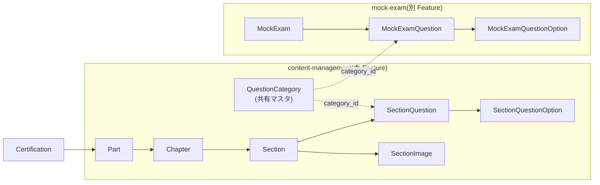
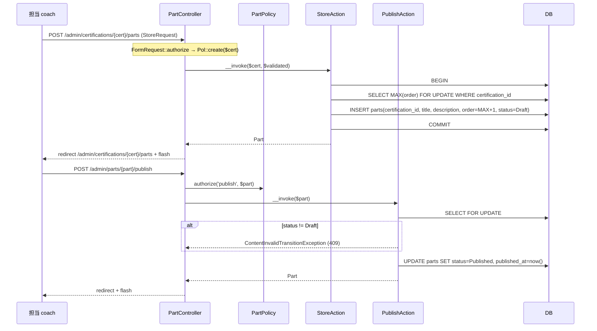
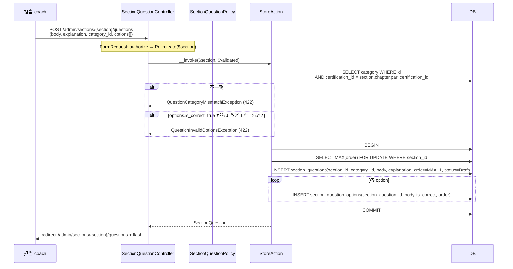
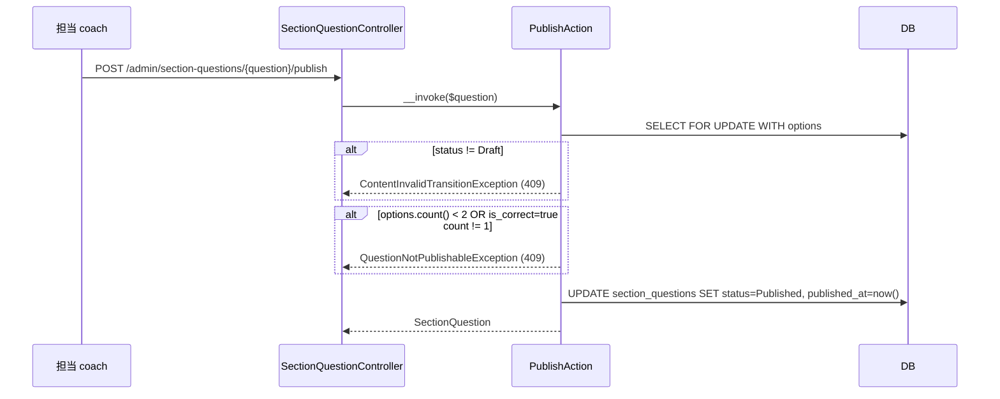
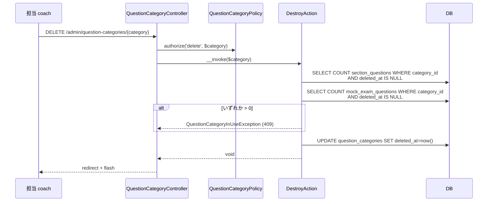
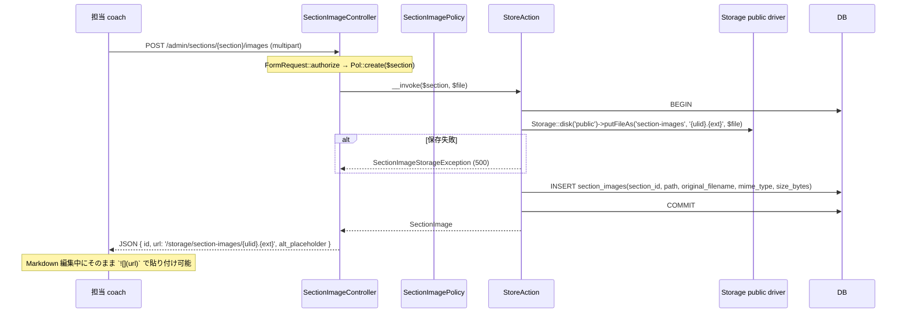
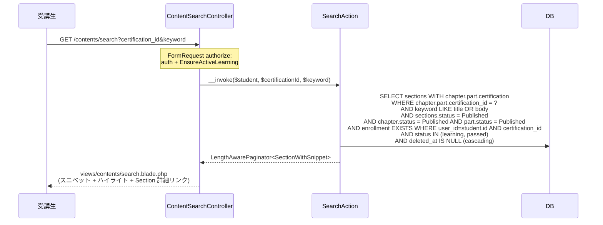
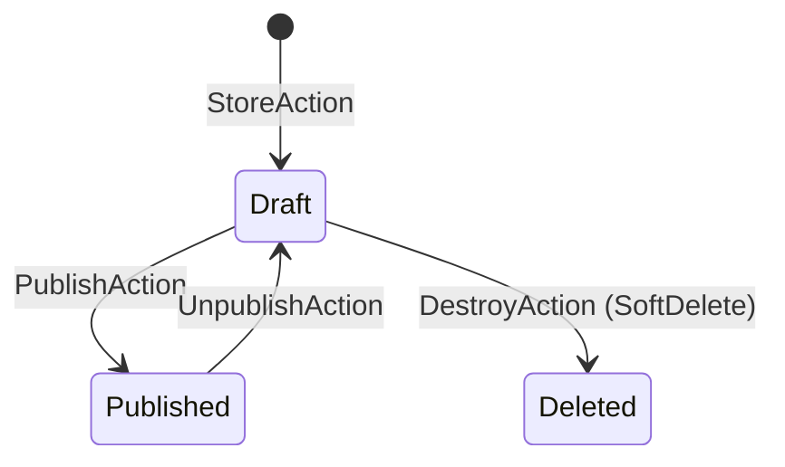

# content-management 設計

> **v3 改修反映**(2026-05-16):
> - 旧 `Question` テーブル / Model 廃止、**`SectionQuestion`(`section_id` NOT NULL) + `SectionQuestionOption`** に分離
> - `difficulty` カラム削除(v3 撤回、教材ドメインで難易度を持たない)
> - **`certification_id` カラム削除**(`section → chapter → part → certification` で辿る、直接参照を持たない)
> - **mock-exam 専用問題管理 UI / Action / Controller / Route を撤回**([[mock-exam]] が `MockExamQuestion` を独自管理)
> - `QuestionInUseException` / `QuestionCertificationMismatchException` 撤回(中間テーブル経由の依存判定が不要に)
> - `QuestionFactory` → `SectionQuestionFactory`、Policy / Action / Blade すべて `SectionQuestion` 系にリネーム

## アーキテクチャ概要

担当資格のコンテンツ階層(**Part → Chapter → Section**)と **Section 紐づき問題(`SectionQuestion` / `SectionQuestionOption`)**、**問題カテゴリマスタ(`QuestionCategory`、共有マスタ)**、**教材内画像(`SectionImage`)** を管理する Feature。Clean Architecture(軽量版)に従い、Controller は薄く、Action(UseCase)が CRUD ロジックと整合性検証を `DB::transaction()` 内に束ねる。受講生向けには **Section の全文検索 API のみ** を提供し、教材閲覧 UI と読了マークは [[learning]] が担う(本 Feature は Model + Policy + `MarkdownRenderingService` の供給に徹する)。

**模試問題は本 Feature では扱わない**([[mock-exam]] が `MockExamQuestion` / `MockExamQuestionOption` を独自管理)。`QuestionCategory` は **両系統の共有マスタ** として本 Feature が CRUD を所有(SectionQuestion と MockExamQuestion 両方で `category_id` で参照)。`QuestionCategory` SoftDelete 時は両系統からの参照を確認する。

### 全体構造



### 1. Part / Chapter / Section CRUD + 公開遷移



### 2. SectionQuestion 直接 CRUD(v3 で `section_id` NOT NULL 化)



### 3. SectionQuestion 公開



### 4. QuestionCategory 削除(両系統からの参照を確認)



### 5. SectionImage アップロード



### 6. 受講生 Section 全文検索



## データモデル

### Eloquent モデル一覧

- **`Part`** — 大単元。`HasUlids` + `HasFactory` + `SoftDeletes`、`status` `ContentStatus` cast / `published_at` datetime cast、`belongsTo(Certification)` / `hasMany(Chapter::class)`。`scopePublished` / `scopeOrdered`。
- **`Chapter`** — 中単元。`belongsTo(Part)` / `hasMany(Section::class)`。`scopePublished`(親 Part を whereHas 経由) / `scopeOrdered`。
- **`Section`** — 小単元。`belongsTo(Chapter)` / **`hasMany(SectionQuestion::class)`**(v3) / `hasMany(SectionImage)`。`body` longtext(Markdown)、`scopePublished`(Chapter / Part を連鎖 whereHas) / `scopeOrdered` / `scopeKeyword(?string)`。
- **`SectionQuestion`**(v3 で `Question` から rename + 構造変更) — `HasUlids` + `HasFactory` + `SoftDeletes`、`belongsTo(Section)` / `belongsTo(QuestionCategory, category_id)` / `hasMany(SectionQuestionOption::class)` / `hasMany(SectionQuestionAttempt)`([[quiz-answering]] 所有テーブル)。`status` `ContentStatus` cast、**`difficulty` 持たない**、**`certification_id` 持たない**(section から辿る)。
- **`SectionQuestionOption`**(v3 で `QuestionOption` から rename) — `HasUlids` + `HasFactory`(SoftDelete 不採用、delete-and-insert で同期)、`is_correct` boolean cast、`belongsTo(SectionQuestion)`。
- **`QuestionCategory`**(共有マスタ、変更なし) — `HasUlids` + `HasFactory` + `SoftDeletes`、`belongsTo(Certification)` / `hasMany(SectionQuestion::class)` / `hasMany(MockExamQuestion::class)`([[mock-exam]] Model)。
- **`SectionImage`** — `HasUlids` + `HasFactory` + `SoftDeletes`、`belongsTo(Section)`。実ファイルは Storage public driver の `section-images/{ulid}.{ext}` に保存。

### ER 図

```mermaid
erDiagram
    CERTIFICATIONS ||--o{ PARTS : "certification_id"
    PARTS ||--o{ CHAPTERS : "part_id"
    CHAPTERS ||--o{ SECTIONS : "chapter_id"
    SECTIONS ||--o{ SECTION_QUESTIONS : "section_id (NOT NULL v3)"
    SECTION_QUESTIONS ||--o{ SECTION_QUESTION_OPTIONS : "section_question_id"
    SECTIONS ||--o{ SECTION_IMAGES : "section_id"
    CERTIFICATIONS ||--o{ QUESTION_CATEGORIES : "certification_id"
    QUESTION_CATEGORIES ||--o{ SECTION_QUESTIONS : "category_id"

    PARTS {
        ulid id PK
        ulid certification_id FK
        string title "max 200"
        text description "nullable"
        unsignedSmallInteger order
        string status "Draft / Published"
        timestamp published_at "nullable"
        timestamp created_at
        timestamp updated_at
        timestamp deleted_at "nullable"
    }
    CHAPTERS {
        ulid id PK
        ulid part_id FK
        string title
        text description "nullable"
        unsignedSmallInteger order
        string status
        timestamp published_at "nullable"
        timestamps
    }
    SECTIONS {
        ulid id PK
        ulid chapter_id FK
        string title
        text description "nullable"
        longtext body "max 50000 Markdown"
        unsignedSmallInteger order
        string status
        timestamp published_at "nullable"
        timestamps
    }
    SECTION_QUESTIONS {
        ulid id PK
        ulid section_id FK "NOT NULL v3"
        ulid category_id FK
        text body
        text explanation "nullable"
        unsignedSmallInteger order
        string status
        timestamp published_at "nullable"
        timestamps
    }
    SECTION_QUESTION_OPTIONS {
        ulid id PK
        ulid section_question_id FK
        text body
        boolean is_correct
        unsignedSmallInteger order
        timestamp created_at
        timestamp updated_at
    }
    QUESTION_CATEGORIES {
        ulid id PK
        ulid certification_id FK
        string name "max 50"
        string slug "max 60"
        unsignedSmallInteger sort_order
        text description "nullable max 500"
        timestamps
    }
    SECTION_IMAGES {
        ulid id PK
        ulid section_id FK
        string path UNIQUE
        string original_filename
        string mime_type
        unsignedInteger size_bytes
        timestamps
    }
```

### Enum

| Model | Enum | 値 | 日本語ラベル |
|---|---|---|---|
| `Part.status` / `Chapter.status` / `Section.status` / `SectionQuestion.status` | `ContentStatus` | `Draft` / `Published` | `下書き` / `公開中` |

> **v3 撤回**: `QuestionDifficulty` enum(`Easy` / `Medium` / `Hard`)。教材ドメインで difficulty を持たないため、Enum も削除。

### インデックス・制約

`parts`:
- `(certification_id, order)`: 複合 INDEX
- `(certification_id, status)`: 複合 INDEX
- `deleted_at`: 単体 INDEX

`chapters`:
- `(part_id, order)` / `(part_id, status)`: 複合 INDEX

`sections`:
- `(chapter_id, order)` / `(chapter_id, status)`: 複合 INDEX
- `sections.title`: 単体 INDEX(全文検索の前方一致用)

`section_questions`(v3 新構造):
- `section_id`: `->constrained()->cascadeOnDelete()` NOT NULL
- `category_id`: `->constrained('question_categories')->restrictOnDelete()`
- `(section_id, status)`: 複合 INDEX
- `(section_id, order)`: 複合 INDEX

`section_question_options`(v3 新構造):
- `section_question_id`: `->constrained()->cascadeOnDelete()`
- `(section_question_id, order)`: 複合 INDEX

`question_categories`:
- `(certification_id, slug)`: UNIQUE INDEX(資格内 UNIQUE)
- `(certification_id, sort_order)`: 複合 INDEX

`section_images`:
- `path`: UNIQUE INDEX
- `(section_id, deleted_at)`: 複合 INDEX

## 状態遷移

`Part` / `Chapter` / `Section` / `SectionQuestion` で共通の遷移。



> **cascade visibility**(REQ-content-management-022): 親 Entity が `Draft` の場合、子 Entity の状態に関わらず受講生向け公開ビューで非公開として扱う。SQL は `whereHas('chapter.part', fn ($q) => $q->where('status', 'published'))` の連鎖で実装。

> **公開ガード**(REQ-content-management-014, 036): 公開済 Part / Chapter は SoftDelete 不可(`ContentNotDeletableException`)。SectionQuestion 公開時は options 2 件以上 + is_correct=1 件を検証(`QuestionNotPublishableException`)。

## コンポーネント

### Controller

`app/Http/Controllers/`(`structure.md` 規約「単一名前空間」準拠):

**admin / coach 用**(`auth + role:admin,coach`):
- `PartController` — `index($certification)` / `create($certification)` / `store($certification)` / `show(Part)` / `update(Part)` / `destroy(Part)` / `publish(Part)` / `unpublish(Part)` / `reorder($certification)`
- `ChapterController` — `store($part)` / `show(Chapter)` / `update(Chapter)` / `destroy(Chapter)` / `publish(Chapter)` / `unpublish(Chapter)` / `reorder($part)`
- `SectionController` — `store($chapter)` / `show(Section)` / `update(Section)` / `destroy(Section)` / `publish(Section)` / `unpublish(Section)` / `reorder($chapter)` / `preview(Section)`(AJAX JSON、`MarkdownRenderingService::toHtml` 呼出)
- **`SectionQuestionController`(v3 rename)** — `index($section)` / `create($section)` / `store($section)` / `show(SectionQuestion)` / `update(SectionQuestion)` / `destroy(SectionQuestion)` / `publish(SectionQuestion)` / `unpublish(SectionQuestion)`
- `SectionImageController` — `store($section)`(JSON 応答) / `destroy(SectionImage)`(JSON 応答)
- `QuestionCategoryController`(共有マスタ) — `index($certification)` / `store($certification)` / `update(QuestionCategory)` / `destroy(QuestionCategory)`

**student 用**(`auth + role:student + EnsureActiveLearning`):
- `ContentSearchController` — `search(SearchRequest, SearchAction)`

### 明示的に持たないもの(v3 撤回)

- `QuestionController`(旧 Question の単独 CRUD は撤回、Section 紐づき問題のみ)
- `MockExamQuestion` 関連 Controller / Action / Route(本 Feature では扱わない、[[mock-exam]] が所有)
- mock-exam 専用問題管理画面 / タブ

### Action(UseCase)

`app/UseCases/`:

#### Part / Chapter / Section 系(変更なし)

```php
// 各 Entity ごとに以下を持つ
// IndexAction / StoreAction / ShowAction / UpdateAction / DestroyAction / PublishAction / UnpublishAction / ReorderAction
namespace App\UseCases\Part;
class StoreAction
{
    public function __invoke(Certification $certification, array $validated): Part
    {
        return DB::transaction(function () use ($certification, $validated) {
            $maxOrder = Part::where('certification_id', $certification->id)
                ->lockForUpdate()->max('order');
            return Part::create([
                'certification_id' => $certification->id,
                'title' => $validated['title'],
                'description' => $validated['description'] ?? null,
                'order' => ($maxOrder ?? -1) + 1,
                'status' => ContentStatus::Draft,
            ]);
        });
    }
}

class PublishAction
{
    public function __invoke(Part $part): Part
    {
        if ($part->status !== ContentStatus::Draft) throw new ContentInvalidTransitionException();
        return DB::transaction(fn () => tap($part)->update([
            'status' => ContentStatus::Published,
            'published_at' => now(),
        ])->fresh());
    }
}

class ReorderAction
{
    public function __invoke(Certification $certification, array $items): void
    {
        // items: [{ id, order }] を検証(同一親、order 1..N 連番、id 重複なし)
        DB::transaction(function () use ($certification, $items) {
            foreach ($items as $item) {
                Part::where('id', $item['id'])
                    ->where('certification_id', $certification->id)
                    ->update(['order' => $item['order']]);
            }
        });
    }
}
```

#### SectionQuestion 系(v3 で大幅刷新)

```php
namespace App\UseCases\SectionQuestion;

class StoreAction
{
    public function __invoke(Section $section, array $validated): SectionQuestion
    {
        $certificationId = $section->chapter->part->certification_id;
        $category = QuestionCategory::find($validated['category_id']);
        if (!$category || $category->certification_id !== $certificationId) {
            throw new QuestionCategoryMismatchException();
        }
        $correctCount = collect($validated['options'])->where('is_correct', true)->count();
        if ($correctCount !== 1) throw new QuestionInvalidOptionsException();

        return DB::transaction(function () use ($section, $validated) {
            $maxOrder = SectionQuestion::where('section_id', $section->id)
                ->lockForUpdate()->max('order');

            $question = SectionQuestion::create([
                'section_id' => $section->id,
                'category_id' => $validated['category_id'],
                'body' => $validated['body'],
                'explanation' => $validated['explanation'] ?? null,
                'order' => ($maxOrder ?? -1) + 1,
                'status' => ContentStatus::Draft,
            ]);

            foreach ($validated['options'] as $i => $opt) {
                SectionQuestionOption::create([
                    'section_question_id' => $question->id,
                    'body' => $opt['body'],
                    'is_correct' => $opt['is_correct'],
                    'order' => $i,
                ]);
            }
            return $question->load('options');
        });
    }
}

class UpdateAction
{
    public function __invoke(SectionQuestion $question, array $validated): SectionQuestion
    {
        // body / explanation / category_id UPDATE、section_id 不可変
        // options を delete-and-insert で同期
        return DB::transaction(function () use ($question, $validated) {
            $question->update([
                'body' => $validated['body'],
                'explanation' => $validated['explanation'] ?? null,
                'category_id' => $validated['category_id'],
            ]);
            if (isset($validated['options'])) {
                $question->options()->delete();
                foreach ($validated['options'] as $i => $opt) {
                    SectionQuestionOption::create([
                        'section_question_id' => $question->id,
                        'body' => $opt['body'],
                        'is_correct' => $opt['is_correct'],
                        'order' => $i,
                    ]);
                }
            }
            return $question->fresh('options');
        });
    }
}

class PublishAction
{
    public function __invoke(SectionQuestion $question): SectionQuestion
    {
        if ($question->status !== ContentStatus::Draft) throw new ContentInvalidTransitionException();
        $options = $question->options()->get();
        if ($options->count() < 2 || $options->where('is_correct', true)->count() !== 1) {
            throw new QuestionNotPublishableException();
        }
        return DB::transaction(fn () => tap($question)->update([
            'status' => ContentStatus::Published,
            'published_at' => now(),
        ])->fresh());
    }
}

class DestroyAction
{
    public function __invoke(SectionQuestion $question): void
    {
        // SoftDelete: SectionQuestionAttempt / SectionQuestionAnswer (quiz-answering 所有) は withTrashed で参照可能
        DB::transaction(fn () => $question->delete());
    }
}
```

#### QuestionCategory 系(共有マスタ)

```php
namespace App\UseCases\QuestionCategory;

class DestroyAction
{
    public function __invoke(QuestionCategory $category): void
    {
        $sectionQuestionCount = SectionQuestion::where('category_id', $category->id)
            ->whereNull('deleted_at')->count();
        $mockExamQuestionCount = MockExamQuestion::where('category_id', $category->id)
            ->whereNull('deleted_at')->count();
        if ($sectionQuestionCount > 0 || $mockExamQuestionCount > 0) {
            throw new QuestionCategoryInUseException();
        }
        DB::transaction(fn () => $category->delete());
    }
}
```

#### SectionImage 系

```php
namespace App\UseCases\SectionImage;

class StoreAction
{
    public function __invoke(Section $section, UploadedFile $file): SectionImage
    {
        return DB::transaction(function () use ($section, $file) {
            $ulid = Str::ulid();
            $ext = $file->getClientOriginalExtension();
            $path = "section-images/{$ulid}.{$ext}";

            try {
                Storage::disk('public')->putFileAs(dirname($path), $file, basename($path));
            } catch (\Throwable $e) {
                throw new SectionImageStorageException(previous: $e);
            }

            return SectionImage::create([
                'section_id' => $section->id,
                'path' => $path,
                'original_filename' => $file->getClientOriginalName(),
                'mime_type' => $file->getMimeType(),
                'size_bytes' => $file->getSize(),
            ]);
        });
    }
}

class DestroyAction
{
    public function __invoke(SectionImage $image): void
    {
        DB::transaction(function () use ($image) {
            Storage::disk('public')->delete($image->path);
            $image->delete();
        });
    }
}
```

#### ContentSearch 系

```php
namespace App\UseCases\ContentSearch;

class SearchAction
{
    public function __invoke(User $student, string $certificationId, string $keyword): LengthAwarePaginator
    {
        if ($keyword === '') return new LengthAwarePaginator([], 0, 20);

        $enrolled = Enrollment::where('user_id', $student->id)
            ->where('certification_id', $certificationId)
            ->whereIn('status', [EnrollmentStatus::Learning, EnrollmentStatus::Passed])
            ->exists();
        if (!$enrolled) return new LengthAwarePaginator([], 0, 20);

        return Section::query()
            ->with(['chapter.part.certification'])
            ->where('status', ContentStatus::Published)
            ->whereHas('chapter', fn ($q) => $q
                ->where('status', ContentStatus::Published)
                ->whereHas('part', fn ($pq) => $pq
                    ->where('status', ContentStatus::Published)
                    ->where('certification_id', $certificationId)))
            ->where(fn ($q) => $q->where('title', 'like', "%{$keyword}%")
                ->orWhere('body', 'like', "%{$keyword}%"))
            ->paginate(20)
            ->through(fn (Section $section) => tap($section, fn ($s) => $s->snippet = $this->buildSnippet($s, $keyword)));
    }

    private function buildSnippet(Section $section, string $keyword): string;
    // body から keyword 前後 80 文字を抽出、ハイライト用 marker を挿入
}
```

### Service

`app/Services/`:

#### `MarkdownRenderingService`

```php
namespace App\Services;

use League\CommonMark\CommonMarkConverter;
use League\CommonMark\Environment\Environment;
use League\CommonMark\Extension\CommonMark\CommonMarkCoreExtension;
use League\CommonMark\Extension\Table\TableExtension;
use League\CommonMark\Extension\Autolink\AutolinkExtension;

class MarkdownRenderingService
{
    public function toHtml(string $markdown): string
    {
        $config = [
            'html_input' => 'strip',  // 危険タグを strip
            'allow_unsafe_links' => false,
            'safe_links_policy' => [
                'external_targets' => ['nofollow', 'noopener', 'noreferrer'],
                'external_target' => '_blank',
            ],
            'unallowed_attributes' => ['onclick', 'onerror', 'onload', 'style'],
            'img_src_whitelist' => ['/storage/section-images/', 'https://'],
        ];
        $env = new Environment($config);
        $env->addExtension(new CommonMarkCoreExtension());
        $env->addExtension(new TableExtension());
        $env->addExtension(new AutolinkExtension());

        $converter = new CommonMarkConverter([], $env);
        return $converter->convert($markdown)->getContent();
    }
}
```

### Policy

`app/Policies/`:

- `PartPolicy` / `ChapterPolicy` / `SectionPolicy` — admin 全、coach は `certification_coach_assignments` 経由判定、student は `enrollments` + `status=Published` のみ閲覧
- **`SectionQuestionPolicy`**(v3 rename) — 同上、`view` は `Draft` を admin / 担当 coach のみ true
- `SectionImagePolicy` — `create(User, Section)` / `delete(User, SectionImage)`、`SectionPolicy::update` 委譲
- `QuestionCategoryPolicy` — admin 全、coach 担当資格のみ CRUD

### FormRequest

`app/Http/Requests/`:

- `Part\StoreRequest` / `UpdateRequest`(`title: required string max:200` / `description: nullable string max:1000`) / `ReorderRequest`(`items.*.id ulid` / `items.*.order integer min:1`)
- 同様に `Chapter\*Request` / `Section\*Request`(`Section\StoreRequest` は `body: required string max:50000` を追加) / `Section\PreviewRequest`(`body: required string max:50000`)
- `SectionImage\StoreRequest`(`file: required file mimes:png,jpg,jpeg,webp max:2048`)
- **`SectionQuestion\IndexRequest`**(`category_id` / `status` フィルタ) / **`StoreRequest`**(`body: required text` / `explanation: nullable text` / `category_id: required ulid exists:question_categories,id` / `options: required array between:2,6` / `options.*.body: required string` / `options.*.is_correct: required boolean` / `options.*.order: required integer min:0`) / **`UpdateRequest`**(同 rules、`section_id` 不可変)
- `QuestionCategory\StoreRequest` / `UpdateRequest`(`name: required string max:50` / `slug: required string max:60 unique:question_categories,slug,NULL,id,certification_id,{certification.id}` / `sort_order: nullable integer min:0` / `description: nullable string max:500`)
- `ContentSearch\SearchRequest`(`certification_id: required ulid` / `keyword: nullable string max:200`)

### Route

`routes/web.php`:

```php
// admin / coach 用
Route::middleware(['auth', 'role:admin,coach'])->prefix('admin')->name('admin.')->group(function () {
    // Part: 親 Certification 経由 + shallow
    Route::resource('certifications.parts', PartController::class)->shallow();
    Route::post('parts/{part}/publish', [PartController::class, 'publish'])->name('parts.publish');
    Route::post('parts/{part}/unpublish', [PartController::class, 'unpublish'])->name('parts.unpublish');
    Route::patch('certifications/{certification}/parts/reorder', [PartController::class, 'reorder'])
        ->name('certifications.parts.reorder');

    // Chapter
    Route::resource('parts.chapters', ChapterController::class)->shallow();
    Route::post('chapters/{chapter}/publish', [ChapterController::class, 'publish']);
    Route::post('chapters/{chapter}/unpublish', [ChapterController::class, 'unpublish']);

    // Section
    Route::resource('chapters.sections', SectionController::class)->shallow();
    Route::post('sections/{section}/preview', [SectionController::class, 'preview'])->name('sections.preview');
    Route::post('sections/{section}/publish', [SectionController::class, 'publish']);

    // SectionQuestion(v3)
    Route::resource('sections.questions', SectionQuestionController::class)
        ->parameters(['questions' => 'sectionQuestion'])->shallow();
    Route::post('section-questions/{sectionQuestion}/publish', [SectionQuestionController::class, 'publish'])
        ->name('section-questions.publish');

    // SectionImage
    Route::post('sections/{section}/images', [SectionImageController::class, 'store'])->name('section-images.store');
    Route::delete('section-images/{image}', [SectionImageController::class, 'destroy'])->name('section-images.destroy');

    // QuestionCategory(共有マスタ)
    Route::resource('certifications.question-categories', QuestionCategoryController::class)->shallow();
});

// 受講生向け検索
Route::middleware(['auth', 'role:student', EnsureActiveLearning::class])->group(function () {
    Route::get('contents/search', [ContentSearchController::class, 'search'])->name('contents.search');
});
```

## Blade ビュー

| ファイル | 役割 |
|---|---|
| `admin/contents/parts/index.blade.php` | Part 一覧 + drag-and-drop reorder |
| `admin/contents/parts/show.blade.php` | Part 詳細 + Chapter 一覧 + 子 reorder |
| `admin/contents/chapters/show.blade.php` | Chapter 詳細 + Section 一覧 |
| `admin/contents/sections/show.blade.php` | Section 編集(Markdown エディタ + プレビュー + 画像アップ + SectionQuestion 一覧へのリンク) |
| `admin/contents/sections/_partials/markdown-editor.blade.php` | Markdown エディタ + プレビューペイン |
| `admin/contents/sections/_partials/image-uploader.blade.php` | drag-and-drop 画像アップローダ |
| `admin/contents/sections/_partials/image-list.blade.php` | アップロード済画像一覧 |
| **`admin/contents/section-questions/index.blade.php`(v3 rename)** | 当該 Section 配下の SectionQuestion 一覧 + reorder |
| **`admin/contents/section-questions/create.blade.php`** | SectionQuestion 作成フォーム(`body` / `explanation` / `category_id` / `options[]` 2..6 件) |
| `admin/contents/section-questions/_partials/option-fieldset.blade.php` | options 入力(is_correct radio で 1 件のみ選択可能化) |
| `admin/contents/section-questions/_partials/category-select.blade.php` | 対象 Certification 配下の QuestionCategory のみ select |
| `admin/contents/question-categories/index.blade.php` | QuestionCategory CRUD(モーダル UI) |
| `admin/contents/question-categories/_modals/form.blade.php` | 作成 / 編集モーダル |
| `admin/contents/question-categories/_modals/delete-confirm.blade.php` | 削除確認モーダル |
| `admin/contents/_partials/status-pill.blade.php` | Draft / Published バッジ |
| `admin/contents/_modals/{delete,publish}-confirm.blade.php` | 共通モーダル |
| `contents/search.blade.php` | 受講生検索画面(キーワード入力 + 結果スニペット表示) |

## JavaScript(`resources/js/content-management/`)

- `section-editor.js` — Markdown エディタ + サーバプレビュー API 呼出
- `image-uploader.js` — drag-and-drop アップロード(FormData + fetch)
- `reorder.js` — drag-and-drop で reorder ペイロード送信

## エラーハンドリング

### 想定例外(`app/Exceptions/Content/`)

- `ContentNotDeletableException`(409)
- `ContentInvalidTransitionException`(409)
- `ContentReorderInvalidException`(422)
- `QuestionInvalidOptionsException`(422)
- `QuestionNotPublishableException`(409)
- `QuestionCategoryMismatchException`(422)
- `QuestionCategoryInUseException`(409)
- `SectionImageStorageException`(500)

> **v3 撤回**: `QuestionInUseException` / `QuestionCertificationMismatchException`(中間テーブル経由の依存判定が不要に)。

## 関連要件マッピング

| 要件 ID | 実装ポイント |
|---|---|
| REQ-content-management-001 | 各 migration ファイル / 各 Eloquent モデル(`section_questions` / `section_question_options` v3 新構造、旧 `questions` 廃止) |
| REQ-content-management-002〜003 | `Part.belongsTo(Certification)` / `Chapter.belongsTo(Part)` / `Section.belongsTo(Chapter)` |
| REQ-content-management-004 | `database/migrations/{date}_create_section_questions_table.php`(v3、`section_id` NOT NULL、`certification_id` なし) |
| REQ-content-management-005 | `database/migrations/{date}_create_section_question_options_table.php` / `App\Models\SectionQuestionOption` |
| REQ-content-management-007 | `App\Enums\ContentStatus` |
| REQ-content-management-008 | `App\Models\SectionQuestion::$casts['category_id']`(v3、`difficulty` 持たない) |
| REQ-content-management-010〜014 / 020〜024 | `App\UseCases\Part\*Action` / `App\UseCases\Chapter\*Action` / `App\UseCases\Section\*Action` |
| REQ-content-management-030〜037 | `App\UseCases\SectionQuestion\*Action` / `App\Http\Controllers\SectionQuestionController`(v3 rename) |
| REQ-content-management-042〜048 | `App\UseCases\QuestionCategory\*Action`(`DestroyAction` で SectionQuestion + MockExamQuestion 両方の参照確認) |
| REQ-content-management-050〜054 | `App\UseCases\SectionImage\StoreAction` / `DestroyAction` |
| REQ-content-management-060〜064 | `App\Services\MarkdownRenderingService` |
| REQ-content-management-070〜075 | `App\UseCases\ContentSearch\SearchAction` |
| REQ-content-management-080〜085 | `routes/web.php` の middleware group + 各 Policy + `EnsureActiveLearning` |
| NFR-content-management-001 | 各 Action の `DB::transaction()` |
| NFR-content-management-002 | 各 Index/Show Action の `with(...)` Eager Loading |
| NFR-content-management-003 | 各 migration の複合 INDEX 定義 |
| NFR-content-management-004 | `app/Exceptions/Content/*Exception.php`(v3 で `QuestionInUseException` / `QuestionCertificationMismatchException` 撤回) |
| NFR-content-management-005 | `SectionImage\StoreAction` の `DB::transaction()` 内で Storage + DB 操作 |

## テスト戦略

`tests/Feature/Http/Admin/` 配下に HTTP 層、`tests/Feature/UseCases/` 配下に Action 層、`tests/Unit/Services/` 配下に Service。

### Feature(HTTP)

- `Part/{Index,Store,Update,Destroy,Publish,Unpublish,Reorder}Test.php`
- `Chapter/CrudTest.php` / `Section/CrudTest.php`(Section 編集 + Preview API)
- **`SectionQuestion/CrudTest.php`(v3 rename)** — Store / Update / Publish / Destroy + category_id 不一致 422 + is_correct 多重 422 / options 1 件で 422 / public 化条件チェック / 担当外 coach 403
- `QuestionCategory/CrudTest.php` — Store + UNIQUE + Destroy ガード(SectionQuestion + MockExamQuestion 両参照確認) + 認可
- `SectionImage/StoreTest.php`(Storage 保存 + サイズ/MIME 422)
- `ContentSearch/SearchTest.php`(登録資格内のみ / Published のみ / cascade visibility / `graduated` 403 / 空キーワードゼロ件)

### Feature(UseCases)

- `SectionQuestion/StoreActionTest.php`(category_id 不一致 / is_correct 多重 / options delete-and-insert 同期)
- `SectionQuestion/PublishActionTest.php`(options 1 件で 409 / is_correct ≠ 1 で 409 / 正常 200)
- `QuestionCategory/DestroyActionTest.php`(SectionQuestion 参照ありで 409 / MockExamQuestion 参照ありで 409 / 両ゼロで SoftDelete)

### Unit(Services)

- `MarkdownRenderingServiceTest.php`(基本変換 / `<script>` strip / `<a>` rel 付与 / `` ホワイトリスト / イベント属性除去)
