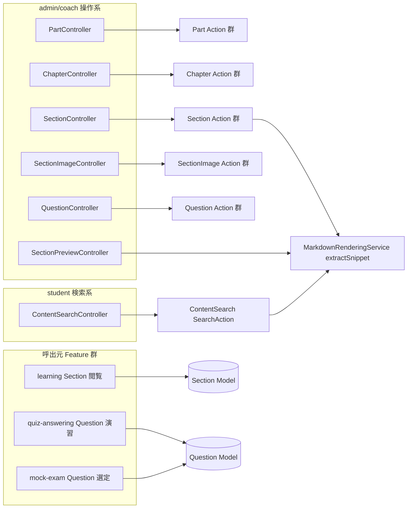
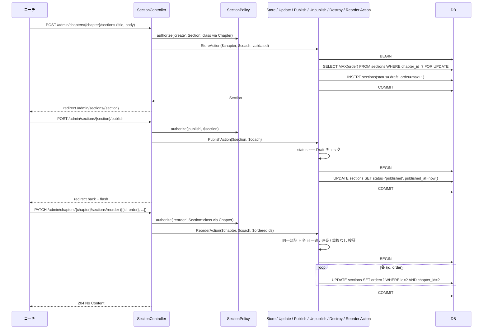
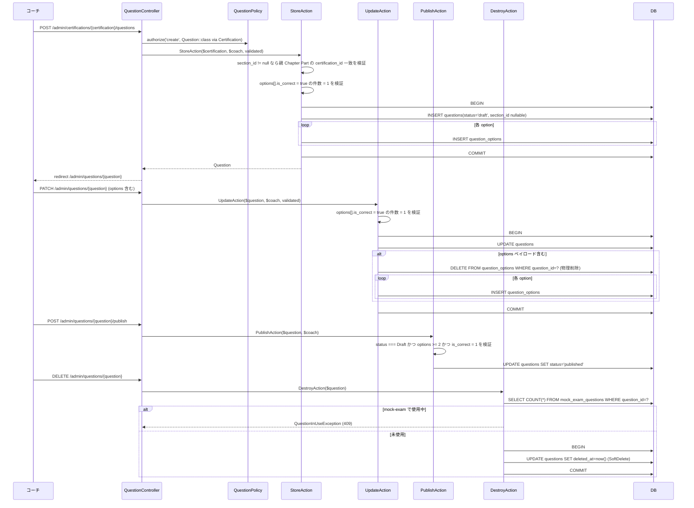
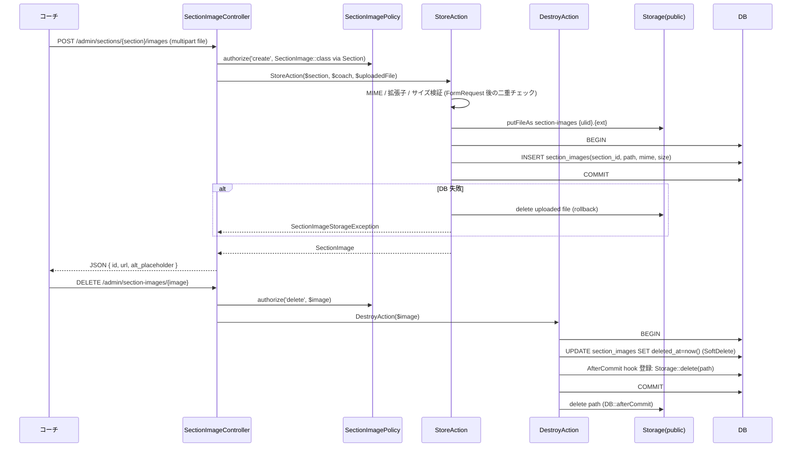
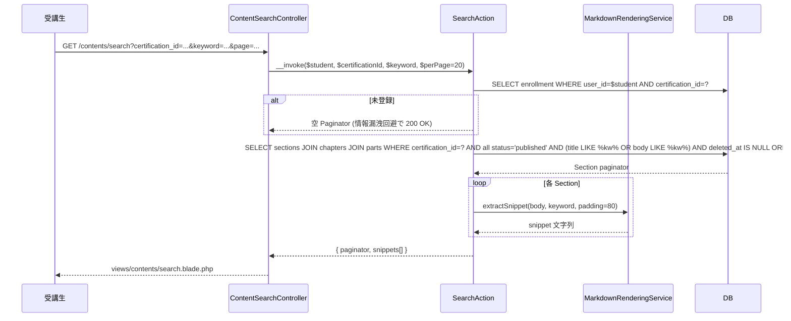
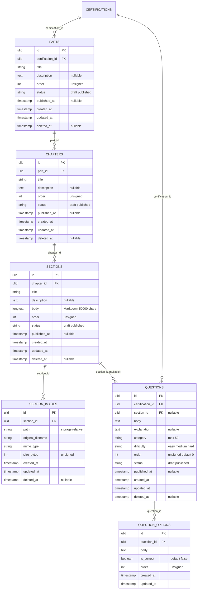
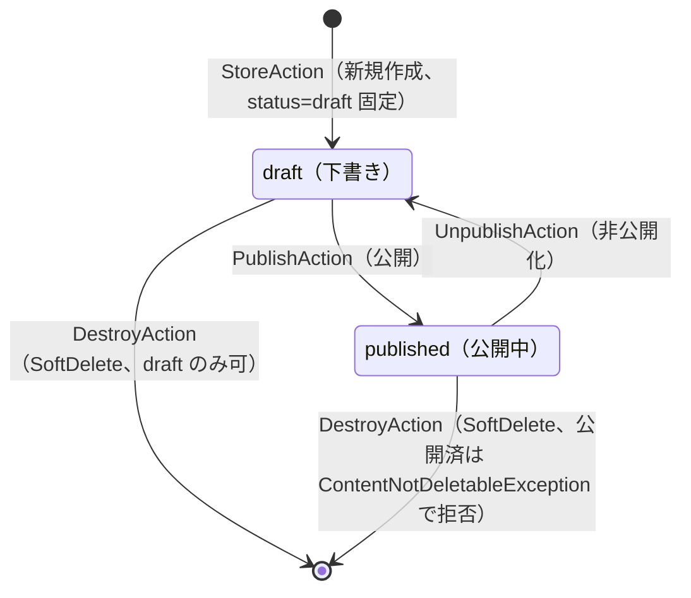

# content-management 設計

## アーキテクチャ概要

担当資格のコンテンツ階層（Part → Chapter → Section）、問題（Question / QuestionOption）、教材内画像（SectionImage）を管理する Feature。Clean Architecture（軽量版）に従い、Controller / FormRequest / Policy / UseCase（Action）/ Service / Eloquent Model を分離する。受講生向けには **Section の全文検索 API のみ**を提供し、教材閲覧 UI と読了マークは [[learning]] が担う（本 Feature は Model + Policy + Markdown レンダリング Service の供給に徹する）。Question は本 Feature が CRUD を所有するが、`MockExamQuestion` 中間テーブルでの問題セット組成は [[mock-exam]] の責務として分離する（[[certification-management]] の Certificate INSERT が [[enrollment]] から呼ばれる構造と同じ流儀）。

### 全体構造



### Part / Chapter / Section CRUD と公開遷移



### Question CRUD（QuestionOption 同時管理）



### SectionImage アップロード / 削除



> 画像削除は **DB を SoftDelete してから afterCommit で Storage 物理削除**。Storage 失敗時に DB レコードが残るが、SoftDelete 済なので Markdown 内参照は image-not-found となり影響限定。逆順（Storage → DB）で行うと DB 失敗時に画像だけ消えて参照切れになるため避ける。

### 受講生向け教材全文検索



## データモデル

### Eloquent モデル一覧

- **`Part`** — 教材階層トップ。`HasUlids` + `HasFactory` + `SoftDeletes`。`belongsTo(Certification::class)`（[[certification-management]] 既存）/ `hasMany(Chapter::class)`。スコープ: `scopePublished()` / `scopeOrdered()`（`order ASC`）。
- **`Chapter`** — 中区分。`HasUlids` + `HasFactory` + `SoftDeletes`。`belongsTo(Part::class)` / `hasMany(Section::class)`。スコープ: `scopePublished()` / `scopeOrdered()`。
- **`Section`** — 小区分（Markdown 本文）。`HasUlids` + `HasFactory` + `SoftDeletes`。`belongsTo(Chapter::class)` / `hasMany(Question::class)` / `hasMany(SectionImage::class)` / `hasOne(SectionProgress::class)`（[[learning]] が定義）。スコープ: `scopePublished()` / `scopeOrdered()` / `scopeKeyword(?string $keyword)`（`title LIKE` または `body LIKE`）。
- **`Question`** — 問題。`HasUlids` + `HasFactory` + `SoftDeletes`。`belongsTo(Certification::class)` / `belongsTo(Section::class)`（nullable、`section_id IS NULL` は mock-exam 専用）/ `hasMany(QuestionOption::class)` / `belongsToMany(MockExam::class, 'mock_exam_questions')`（[[mock-exam]] が中間テーブルを所有、本 Model からはリレーション宣言）/ `hasMany(Answer::class)`（[[quiz-answering]] が定義）/ `hasMany(MockExamAnswer::class)`（[[mock-exam]] が定義）。スコープ: `scopePublished()` / `scopeBySection(?string $sectionId)` / `scopeStandalone()`（`section_id IS NULL`）/ `scopeCategory(?string $category)` / `scopeDifficulty(?QuestionDifficulty $difficulty)`。
- **`QuestionOption`** — 選択肢。`HasUlids` + `HasFactory`（SoftDeletes は採用しない、delete-and-insert 方式）。`belongsTo(Question::class)`。スコープ: `scopeOrdered()`（`order ASC`）。
- **`SectionImage`** — 教材内画像メタ。`HasUlids` + `HasFactory` + `SoftDeletes`。`belongsTo(Section::class)`。

### ER 図



### 主要カラム + Enum

| Model | Enum | 値 | 日本語ラベル |
|---|---|---|---|
| `Part.status` / `Chapter.status` / `Section.status` / `Question.status` | `ContentStatus` | `Draft` / `Published` | `下書き` / `公開中` |
| `Question.difficulty` | `QuestionDifficulty` | `Easy` / `Medium` / `Hard` | `易` / `中` / `難` |

`Question.category` は文字列カラム（max 50、自由記述、出題分野タグ）。Enum 化しない（マスタ化はスコープ外、`product.md` の方針）。

### インデックス・制約

`parts`:
- `(certification_id, order)`: 複合 INDEX（資格内の Part 並び順取得）
- `(certification_id, status)`: 複合 INDEX（公開済 Part 抽出）
- `certification_id`: 外部キー（`->constrained('certifications')->restrictOnDelete()` — Certification の SoftDelete は本 Feature では関知しない）
- `deleted_at`: 単体 INDEX

`chapters`:
- `(part_id, order)`: 複合 INDEX
- `(part_id, status)`: 複合 INDEX
- `part_id`: 外部キー（`->constrained('parts')->restrictOnDelete()`）
- `deleted_at`: 単体 INDEX

`sections`:
- `(chapter_id, order)`: 複合 INDEX
- `(chapter_id, status)`: 複合 INDEX
- `chapter_id`: 外部キー（`->constrained('chapters')->restrictOnDelete()`）
- `title`: 単体 INDEX（前方一致検索の最適化、`LIKE 'keyword%'` のケース）
- 全文検索の `body LIKE` は MySQL InnoDB の FULLTEXT INDEX が候補だが、`product.md` スコープ外（部分一致で十分）として **採用しない**。`body LIKE '%keyword%'` のフルテーブルスキャン許容（教材件数想定が小さく、現実的性能で十分）。
- `deleted_at`: 単体 INDEX

`section_images`:
- `section_id`: 外部キー（`->constrained('sections')->restrictOnDelete()`）
- `(section_id, deleted_at)`: 複合 INDEX
- `path`: UNIQUE INDEX（重複保存防止、`{ulid}.{ext}` 命名で衝突回避）

`questions`:
- `(certification_id, status)`: 複合 INDEX
- `section_id`: 単体 INDEX（NULL 含む、Section 紐づき問題の高速引き）
- `category`: 単体 INDEX（出題分野フィルタ）
- `(certification_id, difficulty)`: 複合 INDEX（弱点ドリル時の difficulty フィルタ最適化、[[quiz-answering]] が利用）
- `certification_id`: 外部キー（`->constrained('certifications')->restrictOnDelete()`）
- `section_id`: 外部キー（`->nullable()->constrained('sections')->nullOnDelete()`、Section SoftDelete 時は手動で Question 側を再評価する想定で物理削除では cascade null とする保険）
- `deleted_at`: 単体 INDEX

`question_options`:
- `question_id`: 外部キー（`->constrained('questions')->cascadeOnDelete()`、delete-and-insert 方式で物理削除されるため cascade）
- `(question_id, order)`: 複合 INDEX

## 状態遷移

`product.md` には content-management 所有の state diagram は無いため、Feature 一覧表の「公開制御 + 順序入替」を根拠に **Part / Chapter / Section / Question に共通の `ContentStatus`（`Draft` / `Published`）** を独自定義する。`archived` は採用しない（[[certification-management]] の `Certification.status` とは異なる方針 — 教材コンテンツは「公開停止して保存」より「下書きへ戻す」のが運用上自然）。



> **cascade visibility ルール**: 親 Entity が `Draft` の場合、子 Entity の `status` 値に関わらず受講生向けの公開ビュー（[[learning]] / `/contents/search`）で非可視化する。本 Feature の Eloquent スコープ `scopePublished()` を **Section → Chapter → Part の各層で連鎖適用**することで担保する（`Section::scopePublished()` 内で `whereHas('chapter', fn ($q) => $q->where('status', Published)->whereHas('part', fn ($q) => $q->where('status', Published)))`）。本 Feature の状態カラム自体は子側を変更しない。`Question.status` は親 Section の status に依存しない（mock-exam 専用問題は `section_id=NULL` のため）が、Section 紐づき問題のうち親 Section / Chapter / Part のいずれかが Draft であれば [[quiz-answering]] 側のスコープで非可視化される（同じ連鎖ロジック）。

## コンポーネント

### Controller

すべて `app/Http/Controllers/` 配下、ロール別 namespace は使わず（`structure.md` 規約）、ルートは admin/coach 操作系を `/admin/...` プレフィックスで `auth + role:admin,coach` Middleware、受講生検索系は `/contents/...` で `auth` Middleware。

- **`PartController`**
  - `index(Certification $certification, IndexAction)` — 一覧 + 作成フォーム同居（薄い）
  - `store(Certification $certification, StoreRequest, StoreAction)` — 新規作成
  - `show(Part $part, ShowAction)` — 詳細 + 編集フォーム同居 + 配下 Chapter 一覧
  - `update(Part $part, UpdateRequest, UpdateAction)` — 更新
  - `destroy(Part $part, DestroyAction)` — SoftDelete（draft のみ）
  - `publish(Part $part, PublishAction)` / `unpublish(Part $part, UnpublishAction)` — 状態遷移
  - `reorder(Certification $certification, ReorderRequest, ReorderAction)` — 順序入替

- **`ChapterController`**
  - `store(Part $part, StoreRequest, StoreAction)`
  - `show(Chapter $chapter, ShowAction)` — 詳細 + 編集 + 配下 Section 一覧
  - `update(Chapter $chapter, UpdateRequest, UpdateAction)`
  - `destroy(Chapter $chapter, DestroyAction)`
  - `publish(Chapter $chapter, PublishAction)` / `unpublish(Chapter $chapter, UnpublishAction)`
  - `reorder(Part $part, ReorderRequest, ReorderAction)`

- **`SectionController`**
  - `store(Chapter $chapter, StoreRequest, StoreAction)`
  - `show(Section $section, ShowAction)` — 詳細 + Markdown 編集 + プレビュー領域 + SectionImage 一覧
  - `update(Section $section, UpdateRequest, UpdateAction)`
  - `destroy(Section $section, DestroyAction)`
  - `publish(Section $section, PublishAction)` / `unpublish(Section $section, UnpublishAction)`
  - `reorder(Chapter $chapter, ReorderRequest, ReorderAction)`
  - `preview(Section $section, PreviewRequest, PreviewAction)` — 編集中 Markdown のサーバプレビュー（JSON で HTML 返却）

- **`SectionImageController`**
  - `store(Section $section, StoreRequest, StoreAction)` — 画像アップロード（JSON 返却）
  - `destroy(SectionImage $image, DestroyAction)` — 画像削除

- **`QuestionController`**
  - `index(Certification $certification, IndexRequest, IndexAction)` — 一覧 + フィルタ + ページネーション
  - `create(Certification $certification)` — 新規作成フォーム表示
  - `store(Certification $certification, StoreRequest, StoreAction)` — 新規作成（QuestionOption 同時）
  - `show(Question $question, ShowAction)` — 詳細 + 編集フォーム同居
  - `update(Question $question, UpdateRequest, UpdateAction)` — 更新（QuestionOption delete-and-insert）
  - `destroy(Question $question, DestroyAction)` — SoftDelete（mock-exam 未参照のみ）
  - `publish(Question $question, PublishAction)` / `unpublish(Question $question, UnpublishAction)`

- **`ContentSearchController`** — 受講生向け Section 全文検索
  - `search(SearchRequest, SearchAction)` — `/contents/search` でカスタム業務操作（Controller method = `search` / Action = `SearchAction`、`backend-usecases.md` 規約）

### Action（UseCase）

Entity 単位ディレクトリで配置（`app/UseCases/Part/`, `app/UseCases/Chapter/`, `app/UseCases/Section/`, `app/UseCases/SectionImage/`, `app/UseCases/Question/`, `app/UseCases/ContentSearch/`）。各 Action は単一トランザクション境界、`__invoke()` を主とする。Controller method 名と Action クラス名は完全一致（`backend-usecases.md` 規約）。

#### `App\UseCases\Part\IndexAction`

```php
namespace App\UseCases\Part;

class IndexAction
{
    public function __invoke(Certification $certification): Collection
    {
        return $certification->parts()
            ->with(['chapters' => fn ($q) => $q->ordered()->withCount('sections')])
            ->ordered()
            ->get();
    }
}
```

責務: 資格配下の Part 一覧を `with('chapters')` + `withCount('sections')` で N+1 回避しつつ取得。SoftDelete 済は除外（admin 一覧で見せない）。

#### `App\UseCases\Part\StoreAction`

```php
class StoreAction
{
    public function __invoke(Certification $certification, User $actor, array $validated): Part
    {
        return DB::transaction(function () use ($certification, $validated) {
            $maxOrder = $certification->parts()->lockForUpdate()->max('order') ?? 0;
            return $certification->parts()->create([
                ...$validated,
                'status' => ContentStatus::Draft,
                'order' => $maxOrder + 1,
            ]);
        });
    }
}
```

責務: `status=Draft` 固定、`order` を `MAX + 1` で自動採番（`lockForUpdate` で並列 INSERT 競合を抑止）。

#### `App\UseCases\Part\UpdateAction`

```php
class UpdateAction
{
    public function __invoke(Part $part, User $actor, array $validated): Part
    {
        return DB::transaction(function () use ($part, $validated) {
            $part->update(Arr::only($validated, ['title', 'description']));
            return $part->fresh();
        });
    }
}
```

責務: `title` / `description` のみ更新。`status` / `order` は本 Action で更新しない（専用 Action 経由）。

#### `App\UseCases\Part\DestroyAction`

```php
class DestroyAction
{
    public function __invoke(Part $part): void
    {
        if ($part->status !== ContentStatus::Draft) {
            throw new ContentNotDeletableException(entity: 'Part');
        }
        DB::transaction(fn () => $part->delete());
    }
}
```

責務: `Draft` 以外なら `ContentNotDeletableException`（HTTP 409）。`Draft` のみ SoftDelete。子 Chapter / Section / SectionImage は親の SoftDelete で連鎖的に不可視化（物理削除は行わない）。

#### `App\UseCases\Part\PublishAction` / `UnpublishAction`

```php
class PublishAction
{
    public function __invoke(Part $part, User $actor): Part
    {
        if ($part->status !== ContentStatus::Draft) {
            throw new ContentInvalidTransitionException(
                entity: 'Part',
                from: $part->status,
                to: ContentStatus::Published,
            );
        }
        return DB::transaction(function () use ($part) {
            $part->update([
                'status' => ContentStatus::Published,
                'published_at' => now(),
            ]);
            return $part->fresh();
        });
    }
}

class UnpublishAction
{
    public function __invoke(Part $part, User $actor): Part
    {
        if ($part->status !== ContentStatus::Published) {
            throw new ContentInvalidTransitionException(
                entity: 'Part',
                from: $part->status,
                to: ContentStatus::Draft,
            );
        }
        return DB::transaction(function () use ($part) {
            $part->update(['status' => ContentStatus::Draft]);
            return $part->fresh();
        });
    }
}
```

責務: 状態遷移 + `published_at` 設定（`Publish` 時のみ、`Unpublish` は `published_at` を保持して履歴とする）。

#### `App\UseCases\Part\ReorderAction`

```php
class ReorderAction
{
    /**
     * @param string[] $orderedIds Part ID を表示順に並べた配列
     */
    public function __invoke(Certification $certification, User $actor, array $orderedIds): void
    {
        $existing = $certification->parts()->pluck('id')->all();

        if (count(array_diff($orderedIds, $existing)) > 0
            || count(array_diff($existing, $orderedIds)) > 0
            || count($orderedIds) !== count(array_unique($orderedIds))
        ) {
            throw new ContentReorderInvalidException();
        }

        DB::transaction(function () use ($certification, $orderedIds) {
            foreach ($orderedIds as $idx => $id) {
                Part::where('id', $id)
                    ->where('certification_id', $certification->id)
                    ->update(['order' => $idx + 1]);
            }
        });
    }
}
```

責務: (1) 同一親配下の全 Part を 1 度だけ参照する厳密検証、(2) `1..N` 連番で UPDATE。`ContentReorderInvalidException`（HTTP 422）は ID 不一致 / 重複時。`Chapter\ReorderAction` / `Section\ReorderAction` も同パターン。

#### `App\UseCases\Chapter\*` / `App\UseCases\Section\*`

Chapter / Section も Part と同様の `Store / Show / Update / Destroy / Publish / Unpublish / Reorder` を提供。差分:

- `Chapter\StoreAction(Part $part, ...)` — 親が Part
- `Section\StoreAction(Chapter $chapter, ...)` — 親が Chapter
- `Section\UpdateAction` は `body`（Markdown 50000 文字以内）も更新対象
- `Chapter\DestroyAction` / `Section\DestroyAction` — `Draft` 以外なら `ContentNotDeletableException`
- `Section\PreviewAction(Section $section, string $markdown): string` — Section 編集時のローカルプレビュー、`MarkdownRenderingService::toHtml` を呼ぶ pure passthrough。データ書き換えなしのため `DB::transaction()` 不要

#### `App\UseCases\SectionImage\StoreAction`

```php
namespace App\UseCases\SectionImage;

class StoreAction
{
    public function __invoke(Section $section, User $actor, UploadedFile $file): SectionImage
    {
        $ulid = (string) Str::ulid();
        $ext = strtolower($file->getClientOriginalExtension());
        $path = "section-images/{$ulid}.{$ext}";

        Storage::disk('public')->putFileAs(
            'section-images',
            "{$ulid}.{$ext}",
            $file,
        );

        try {
            return DB::transaction(fn () => $section->images()->create([
                'path' => $path,
                'original_filename' => $file->getClientOriginalName(),
                'mime_type' => $file->getMimeType(),
                'size_bytes' => $file->getSize(),
            ]));
        } catch (\Throwable $e) {
            Storage::disk('public')->delete($path);
            throw new SectionImageStorageException(previous: $e);
        }
    }
}
```

責務: (1) Storage 書き込み、(2) DB INSERT。DB 失敗時に **手動 Storage 削除** で巻き戻し（DB rollback では Storage は元に戻らないため）。FormRequest 側で MIME / 拡張子 / サイズの validation 済を前提だが、Action 内でも防御的に `getMimeType()` と拡張子を再チェック（攻撃者が `image.png.php` のような細工をしても、Storage 保存名は `{ulid}.{ext}` 形式で固定）。

#### `App\UseCases\SectionImage\DestroyAction`

```php
class DestroyAction
{
    public function __invoke(SectionImage $image): void
    {
        DB::transaction(function () use ($image) {
            $image->delete(); // SoftDelete
            DB::afterCommit(fn () => Storage::disk('public')->delete($image->path));
        });
    }
}
```

責務: DB SoftDelete を先に commit、`afterCommit` で Storage 物理削除。Storage 失敗時は DB は SoftDelete 済（参照切れに留まる）。

#### `App\UseCases\Question\IndexAction`

```php
namespace App\UseCases\Question;

class IndexAction
{
    public function __invoke(
        Certification $certification,
        ?string $category,
        ?QuestionDifficulty $difficulty,
        ?ContentStatus $status,
        bool $standaloneOnly,
        int $perPage = 20,
    ): LengthAwarePaginator {
        return $certification->questions()
            ->with(['section.chapter.part', 'options' => fn ($q) => $q->ordered()])
            ->when($category, fn ($q) => $q->category($category))
            ->when($difficulty, fn ($q) => $q->difficulty($difficulty))
            ->when($status, fn ($q) => $q->where('status', $status))
            ->when($standaloneOnly, fn ($q) => $q->standalone())
            ->orderByRaw("FIELD(status, 'draft', 'published'), updated_at DESC")
            ->paginate($perPage);
    }
}
```

責務: (1) フィルタ条件の組合せ、(2) Section 紐づき / 専用問題の切替、(3) `with('section.chapter.part', 'options')` で N+1 回避、(4) `paginate(20)`。

#### `App\UseCases\Question\StoreAction`

```php
class StoreAction
{
    public function __invoke(Certification $certification, User $actor, array $validated): Question
    {
        $sectionId = $validated['section_id'] ?? null;
        if ($sectionId !== null) {
            $section = Section::with('chapter.part')->findOrFail($sectionId);
            if ($section->chapter->part->certification_id !== $certification->id) {
                throw new QuestionCertificationMismatchException();
            }
        }

        $options = $validated['options'] ?? [];
        $correctCount = collect($options)->where('is_correct', true)->count();
        if ($correctCount !== 1) {
            throw new QuestionInvalidOptionsException();
        }

        return DB::transaction(function () use ($certification, $validated, $options) {
            $question = $certification->questions()->create([
                ...Arr::only($validated, ['body', 'explanation', 'category', 'difficulty', 'section_id']),
                'status' => ContentStatus::Draft,
                'order' => 0, // Question には Section 内順序を持たせない設計（必要なら将来拡張）
            ]);

            foreach ($options as $idx => $opt) {
                $question->options()->create([
                    'body' => $opt['body'],
                    'is_correct' => (bool) $opt['is_correct'],
                    'order' => $idx + 1,
                ]);
            }

            return $question->fresh(['options']);
        });
    }
}
```

責務: (1) `section_id` 指定時の certification 一致検証、(2) `is_correct` 件数検証、(3) Question INSERT + QuestionOption 一括 INSERT。

#### `App\UseCases\Question\UpdateAction`

```php
class UpdateAction
{
    public function __invoke(Question $question, User $actor, array $validated): Question
    {
        $sectionId = $validated['section_id'] ?? $question->section_id;
        if ($sectionId !== null && $sectionId !== $question->section_id) {
            $section = Section::with('chapter.part')->findOrFail($sectionId);
            if ($section->chapter->part->certification_id !== $question->certification_id) {
                throw new QuestionCertificationMismatchException();
            }
        }

        if (array_key_exists('options', $validated)) {
            $correctCount = collect($validated['options'])->where('is_correct', true)->count();
            if ($correctCount !== 1) {
                throw new QuestionInvalidOptionsException();
            }
        }

        return DB::transaction(function () use ($question, $validated) {
            $question->update(Arr::only(
                $validated,
                ['body', 'explanation', 'category', 'difficulty', 'section_id'],
            ));

            if (array_key_exists('options', $validated)) {
                $question->options()->delete(); // 物理削除
                foreach ($validated['options'] as $idx => $opt) {
                    $question->options()->create([
                        'body' => $opt['body'],
                        'is_correct' => (bool) $opt['is_correct'],
                        'order' => $idx + 1,
                    ]);
                }
            }

            return $question->fresh(['options']);
        });
    }
}
```

責務: (1) `section_id` 変更時の certification 整合性チェック、(2) options 同期は delete-and-insert、(3) `certification_id` は変更不可。

#### `App\UseCases\Question\DestroyAction`

```php
class DestroyAction
{
    public function __invoke(Question $question): void
    {
        if (DB::table('mock_exam_questions')->where('question_id', $question->id)->exists()) {
            throw new QuestionInUseException();
        }
        DB::transaction(fn () => $question->delete());
    }
}
```

責務: (1) `mock_exam_questions` 参照チェック、(2) 未参照なら SoftDelete。`answers` / `question_attempts` / `mock_exam_answers` は SoftDelete 済 Question を引き続き参照可能（履歴保持）なので阻害しない。

#### `App\UseCases\Question\PublishAction` / `UnpublishAction`

```php
class PublishAction
{
    public function __invoke(Question $question, User $actor): Question
    {
        if ($question->status !== ContentStatus::Draft) {
            throw new ContentInvalidTransitionException('Question', $question->status, ContentStatus::Published);
        }

        $options = $question->options()->get();
        if ($options->count() < 2 || $options->where('is_correct', true)->count() !== 1) {
            throw new QuestionNotPublishableException();
        }

        return DB::transaction(function () use ($question) {
            $question->update([
                'status' => ContentStatus::Published,
                'published_at' => now(),
            ]);
            return $question->fresh();
        });
    }
}
```

責務: (1) draft 状態チェック、(2) **options >= 2 件 AND is_correct=true が 1 件** の二重検証（store/update でも検証するが publish 時にもガード）、(3) 公開遷移。

#### `App\UseCases\ContentSearch\SearchAction`

```php
namespace App\UseCases\ContentSearch;

class SearchAction
{
    public function __construct(private MarkdownRenderingService $markdown) {}

    /**
     * @return array{paginator: LengthAwarePaginator, snippets: array<string, string>}
     */
    public function __invoke(
        User $student,
        string $certificationId,
        string $keyword,
        int $perPage = 20,
    ): array {
        if (trim($keyword) === '') {
            return ['paginator' => new LengthAwarePaginator([], 0, $perPage), 'snippets' => []];
        }

        $enrolled = $student->enrollments()
            ->where('certification_id', $certificationId)
            ->exists();
        if (! $enrolled) {
            return ['paginator' => new LengthAwarePaginator([], 0, $perPage), 'snippets' => []];
        }

        $paginator = Section::query()
            ->with(['chapter.part.certification'])
            ->published() // Section / Chapter / Part が全て Published を whereHas で連鎖
            ->whereHas('chapter.part', fn ($q) => $q->where('certification_id', $certificationId))
            ->where(fn ($q) => $q
                ->where('title', 'LIKE', "%{$keyword}%")
                ->orWhere('body', 'LIKE', "%{$keyword}%"))
            ->orderBy(/* 親 Part.order, 親 Chapter.order, Section.order の順に並べる */)
            ->paginate($perPage);

        $snippets = [];
        foreach ($paginator->items() as $section) {
            $snippets[$section->id] = $this->markdown->extractSnippet($section->body, $keyword);
        }

        return compact('paginator', 'snippets');
    }
}
```

責務: (1) keyword 空 / 資格未登録 → 空 paginator（情報漏洩回避で 200 OK）、(2) Section / Chapter / Part 全 Published のスコープを連鎖、(3) `title` または `body` の部分一致、(4) スニペット生成。

> `orderBy` での親階層を含む並び替えは Eloquent の `join` または raw 順序で実装する。

### Service

`app/Services/`（フラット配置、`structure.md` 準拠）。

#### `MarkdownRenderingService`

```php
namespace App\Services;

use League\CommonMark\CommonMarkConverter;
use League\CommonMark\Environment\Environment;
use League\CommonMark\Extension\CommonMark\CommonMarkCoreExtension;
use League\CommonMark\Extension\GithubFlavoredMarkdownExtension;

class MarkdownRenderingService
{
    private CommonMarkConverter $converter;

    public function __construct()
    {
        $environment = new Environment([
            'html_input' => 'strip',                  // 危険な生HTMLを除去
            'allow_unsafe_links' => false,            // javascript: 等の擬似プロトコル拒否
            'max_nesting_level' => 50,
            'renderer' => ['soft_break' => "<br />"],
        ]);
        $environment->addExtension(new CommonMarkCoreExtension());
        $environment->addExtension(new GithubFlavoredMarkdownExtension());
        // 必要に応じて attributes extension で safe_links を制御

        $this->converter = new CommonMarkConverter([], $environment);
    }

    /**
     * Markdown を HTML 文字列へ変換する。<script> / <iframe> は CommonMark の html_input=strip で除去される。
     * 外部リンクは rel="nofollow noopener noreferrer" + target="_blank" を後段で付与（必要なら HTML パース + DOM 書換）。
     */
    public function toHtml(string $markdown): string
    {
        return (string) $this->converter->convert($markdown);
    }

    /**
     * Markdown 本文から keyword 周辺のスニペット文字列を抽出する。
     * - keyword が見つかれば前後 $padding 文字を切り出し
     * - 見つからなければ先頭から 2 * $padding 文字
     * - HTML タグ・改行・Markdown 記法は素のテキストとして残す（呼出側で escape して描画する前提）
     */
    public function extractSnippet(string $body, string $keyword, int $padding = 80): string
    {
        $pos = mb_stripos($body, $keyword);
        if ($pos === false) {
            return mb_substr($body, 0, $padding * 2);
        }
        $start = max(0, $pos - $padding);
        $length = $padding * 2 + mb_strlen($keyword);
        $snippet = mb_substr($body, $start, $length);
        return ($start > 0 ? '…' : '') . $snippet . (mb_strlen($body) > $start + $length ? '…' : '');
    }
}
```

責務: (1) `toHtml` で `league/commonmark` を `html_input=strip` + `allow_unsafe_links=false` で安全変換、(2) `extractSnippet` で検索結果スニペット抽出。pure utility のため `product.md` 集計責務マトリクスには登場しない（横断計算 Service ではないため、所有 Feature の概念は適用しない）。

> 外部リンク `rel="nofollow"` + `target="_blank"` の付与は CommonMark の標準拡張で十分達成できないケースがある。Wave 0b で `MarkdownRenderingService` の単体テストを書きつつ、必要なら自前の `LinkRendererInterface` 実装で補強する。本 spec では「サニタイズ動作が機能する」レベルを保証し、属性付与の詳細は実装テスト時に確定。

### Policy

`app/Policies/`:

#### `PartPolicy` / `ChapterPolicy` / `SectionPolicy`

3 Policy は同じ判定構造（差分は Model 種別のみ）のため、`PartPolicy` を代表例として示し、Chapter / Section は同様パターンで実装する。

```php
namespace App\Policies;

class PartPolicy
{
    public function viewAny(User $auth, Certification $certification): bool
    {
        return match ($auth->role) {
            UserRole::Admin => true,
            UserRole::Coach => $auth->assignedCertifications()->whereKey($certification->id)->exists(),
            UserRole::Student => $auth->enrollments()->where('certification_id', $certification->id)->exists(),
        };
    }

    public function view(User $auth, Part $part): bool
    {
        return match ($auth->role) {
            UserRole::Admin => true,
            UserRole::Coach => $this->coachCanManage($auth, $part->certification_id),
            UserRole::Student => $part->status === ContentStatus::Published
                && $part->deleted_at === null
                && $auth->enrollments()->where('certification_id', $part->certification_id)->exists(),
        };
    }

    public function create(User $auth, Certification $certification): bool
    {
        return match ($auth->role) {
            UserRole::Admin => true,
            UserRole::Coach => $this->coachCanManage($auth, $certification->id),
            default => false,
        };
    }

    public function update(User $auth, Part $part): bool { return $this->createLike($auth, $part->certification_id); }
    public function delete(User $auth, Part $part): bool { return $this->createLike($auth, $part->certification_id); }
    public function publish(User $auth, Part $part): bool { return $this->createLike($auth, $part->certification_id); }
    public function unpublish(User $auth, Part $part): bool { return $this->createLike($auth, $part->certification_id); }
    public function reorder(User $auth, Certification $certification): bool { return $this->createLike($auth, $certification->id); }

    private function createLike(User $auth, string $certificationId): bool
    {
        return match ($auth->role) {
            UserRole::Admin => true,
            UserRole::Coach => $this->coachCanManage($auth, $certificationId),
            default => false,
        };
    }

    private function coachCanManage(User $coach, string $certificationId): bool
    {
        return $coach->assignedCertifications()->whereKey($certificationId)->exists();
    }
}
```

> [[certification-management]] の `Certification::coaches()` BelongsToMany リレーション の逆向き（`User::assignedCertifications()`）を本 Feature 実装時に [[certification-management]] へ追加する（依存先 spec 内 REQ-certification-management-045 で既に予告されているリレーション）。

#### `QuestionPolicy`

```php
class QuestionPolicy
{
    public function viewAny(User $auth, Certification $certification): bool { return $this->scopedBy($auth, $certification->id); }
    public function view(User $auth, Question $question): bool
    {
        return match ($auth->role) {
            UserRole::Admin => true,
            UserRole::Coach => $this->coachCanManage($auth, $question->certification_id),
            UserRole::Student => $question->status === ContentStatus::Published
                && $question->deleted_at === null
                && $auth->enrollments()->where('certification_id', $question->certification_id)->exists(),
        };
    }
    public function create(User $auth, Certification $certification): bool { return $this->coachOrAdmin($auth, $certification->id); }
    public function update(User $auth, Question $question): bool { return $this->coachOrAdmin($auth, $question->certification_id); }
    public function delete(User $auth, Question $question): bool { return $this->coachOrAdmin($auth, $question->certification_id); }
    public function publish(User $auth, Question $question): bool { return $this->coachOrAdmin($auth, $question->certification_id); }
    public function unpublish(User $auth, Question $question): bool { return $this->coachOrAdmin($auth, $question->certification_id); }

    private function coachOrAdmin(User $auth, string $certificationId): bool
    {
        return $auth->role === UserRole::Admin
            || ($auth->role === UserRole::Coach && $this->coachCanManage($auth, $certificationId));
    }

    private function scopedBy(User $auth, string $certificationId): bool
    {
        return match ($auth->role) {
            UserRole::Admin => true,
            UserRole::Coach => $this->coachCanManage($auth, $certificationId),
            UserRole::Student => $auth->enrollments()->where('certification_id', $certificationId)->exists(),
        };
    }

    private function coachCanManage(User $coach, string $certificationId): bool
    {
        return $coach->assignedCertifications()->whereKey($certificationId)->exists();
    }
}
```

#### `SectionImagePolicy`

```php
class SectionImagePolicy
{
    public function create(User $auth, Section $section): bool
    {
        // Section に対する update 権限と同じ判定（画像追加 = Section の編集に等しい）
        return app(SectionPolicy::class)->update($auth, $section);
    }

    public function delete(User $auth, SectionImage $image): bool
    {
        return app(SectionPolicy::class)->update($auth, $image->section);
    }
}
```

> Policy は「ロール × 担当資格 × 登録資格」観点のみで判定。状態整合性チェック（`Draft` のみ削除可、状態遷移制限）は **Action 内ドメイン例外** で表現する（[[certification-management]] と同じ流儀、`backend-policies.md` の役割分担に整合）。

### FormRequest

`app/Http/Requests/{Entity}/` ディレクトリで分割。

| FormRequest | rules | authorize |
|---|---|---|
| `Part\StoreRequest` | `title: required string max:200` / `description: nullable string max:1000` | `can('create', [Part::class, $this->route('certification')])` |
| `Part\UpdateRequest` | `title: required string max:200` / `description: nullable string max:1000` | `can('update', $this->route('part'))` |
| `Part\ReorderRequest` | `ordered_ids: required array min:1` / `ordered_ids.*: required ulid distinct` | `can('reorder', [Part::class, $this->route('certification')])` |
| `Chapter\StoreRequest` | `title: required string max:200` / `description: nullable string max:1000` | `can('create', [Chapter::class, $this->route('part')])` |
| `Chapter\UpdateRequest` | 同上 | `can('update', $this->route('chapter'))` |
| `Chapter\ReorderRequest` | 同 Part 構造 | `can('reorder', [Chapter::class, $this->route('part')])` |
| `Section\StoreRequest` | `title: required string max:200` / `description: nullable string max:1000` / `body: required string max:50000` | `can('create', [Section::class, $this->route('chapter')])` |
| `Section\UpdateRequest` | 同上 | `can('update', $this->route('section'))` |
| `Section\ReorderRequest` | 同 Part 構造 | `can('reorder', [Section::class, $this->route('chapter')])` |
| `Section\PreviewRequest` | `body: required string max:50000` | `can('update', $this->route('section'))` |
| `SectionImage\StoreRequest` | `file: required file mimes:png,jpg,jpeg,webp max:2048` (2048 KB = 2 MB) | `can('create', [SectionImage::class, $this->route('section')])` |
| `Question\IndexRequest` | `category: nullable string max:50` / `difficulty: nullable in:easy,medium,hard` / `status: nullable in:draft,published` / `standalone_only: nullable boolean` / `page: nullable integer min:1` | `can('viewAny', [Question::class, $this->route('certification')])` |
| `Question\StoreRequest` | `body: required string max:5000` / `explanation: nullable string max:5000` / `category: required string max:50` / `difficulty: required in:easy,medium,hard` / `section_id: nullable ulid exists:sections,id` / `options: required array min:2 max:6` / `options.*.body: required string max:1000` / `options.*.is_correct: required boolean` | `can('create', [Question::class, $this->route('certification')])` |
| `Question\UpdateRequest` | StoreRequest 構造（`options` は `sometimes`）。`certification_id` フィールドは無し | `can('update', $this->route('question'))` |
| `ContentSearch\SearchRequest` | `certification_id: required ulid exists:certifications,id` / `keyword: nullable string max:200` / `page: nullable integer min:1` | always true（`auth` middleware で十分、student 制限は Action 内で扱う）|

### Route

`routes/web.php`:

```php
// admin / coach 共有
Route::middleware(['auth', 'role:admin,coach'])->prefix('admin')->group(function () {
    // Part
    Route::get('certifications/{certification}/parts', [PartController::class, 'index'])->name('admin.parts.index');
    Route::post('certifications/{certification}/parts', [PartController::class, 'store'])->name('admin.parts.store');
    Route::patch('certifications/{certification}/parts/reorder', [PartController::class, 'reorder'])->name('admin.parts.reorder');
    Route::get('parts/{part}', [PartController::class, 'show'])->name('admin.parts.show');
    Route::patch('parts/{part}', [PartController::class, 'update'])->name('admin.parts.update');
    Route::delete('parts/{part}', [PartController::class, 'destroy'])->name('admin.parts.destroy');
    Route::post('parts/{part}/publish', [PartController::class, 'publish'])->name('admin.parts.publish');
    Route::post('parts/{part}/unpublish', [PartController::class, 'unpublish'])->name('admin.parts.unpublish');

    // Chapter
    Route::post('parts/{part}/chapters', [ChapterController::class, 'store'])->name('admin.chapters.store');
    Route::patch('parts/{part}/chapters/reorder', [ChapterController::class, 'reorder'])->name('admin.chapters.reorder');
    Route::get('chapters/{chapter}', [ChapterController::class, 'show'])->name('admin.chapters.show');
    Route::patch('chapters/{chapter}', [ChapterController::class, 'update'])->name('admin.chapters.update');
    Route::delete('chapters/{chapter}', [ChapterController::class, 'destroy'])->name('admin.chapters.destroy');
    Route::post('chapters/{chapter}/publish', [ChapterController::class, 'publish'])->name('admin.chapters.publish');
    Route::post('chapters/{chapter}/unpublish', [ChapterController::class, 'unpublish'])->name('admin.chapters.unpublish');

    // Section
    Route::post('chapters/{chapter}/sections', [SectionController::class, 'store'])->name('admin.sections.store');
    Route::patch('chapters/{chapter}/sections/reorder', [SectionController::class, 'reorder'])->name('admin.sections.reorder');
    Route::get('sections/{section}', [SectionController::class, 'show'])->name('admin.sections.show');
    Route::patch('sections/{section}', [SectionController::class, 'update'])->name('admin.sections.update');
    Route::delete('sections/{section}', [SectionController::class, 'destroy'])->name('admin.sections.destroy');
    Route::post('sections/{section}/publish', [SectionController::class, 'publish'])->name('admin.sections.publish');
    Route::post('sections/{section}/unpublish', [SectionController::class, 'unpublish'])->name('admin.sections.unpublish');
    Route::post('sections/{section}/preview', [SectionController::class, 'preview'])->name('admin.sections.preview');

    // SectionImage
    Route::post('sections/{section}/images', [SectionImageController::class, 'store'])->name('admin.section-images.store');
    Route::delete('section-images/{image}', [SectionImageController::class, 'destroy'])->name('admin.section-images.destroy');

    // Question
    Route::get('certifications/{certification}/questions', [QuestionController::class, 'index'])->name('admin.questions.index');
    Route::get('certifications/{certification}/questions/create', [QuestionController::class, 'create'])->name('admin.questions.create');
    Route::post('certifications/{certification}/questions', [QuestionController::class, 'store'])->name('admin.questions.store');
    Route::get('questions/{question}', [QuestionController::class, 'show'])->name('admin.questions.show');
    Route::patch('questions/{question}', [QuestionController::class, 'update'])->name('admin.questions.update');
    Route::delete('questions/{question}', [QuestionController::class, 'destroy'])->name('admin.questions.destroy');
    Route::post('questions/{question}/publish', [QuestionController::class, 'publish'])->name('admin.questions.publish');
    Route::post('questions/{question}/unpublish', [QuestionController::class, 'unpublish'])->name('admin.questions.unpublish');
});

// student
Route::middleware('auth')->group(function () {
    Route::get('contents/search', [ContentSearchController::class, 'search'])->name('contents.search');
});
```

## Blade ビュー

`resources/views/admin/contents/` + `resources/views/contents/`:

### admin / coach 用

| ファイル | 役割 |
|---|---|
| `admin/contents/parts/index.blade.php` | 資格配下の Part 一覧 + 「+新規 Part」ボタン + 並び替えハンドル（reorder API 連動）|
| `admin/contents/parts/show.blade.php` | Part 詳細 + 編集フォーム + 配下 Chapter 一覧 + 「+新規 Chapter」 + reorder ハンドル |
| `admin/contents/chapters/show.blade.php` | Chapter 詳細 + 編集フォーム + 配下 Section 一覧 + 「+新規 Section」 + reorder ハンドル |
| `admin/contents/sections/show.blade.php` | Section 詳細 + Markdown 編集テキストエリア + プレビューペイン（preview API 連動）+ 画像アップロード UI + SectionImage 一覧 + 公開ボタン |
| `admin/contents/sections/_partials/markdown-editor.blade.php` | 編集テキストエリア + プレビュー領域（JS で `/admin/sections/{section}/preview` を POST → HTML 描画）|
| `admin/contents/sections/_partials/image-uploader.blade.php` | 画像アップロード UI（`<input type="file">` → fetch で `/admin/sections/{section}/images` POST → 成功時に Markdown editor に `` 自動挿入）|
| `admin/contents/sections/_partials/image-list.blade.php` | アップロード済 SectionImage 一覧 + 削除ボタン |
| `admin/contents/questions/index.blade.php` | Question 一覧 + フィルタ（category / difficulty / status / 専用 mock-exam のみ）+ ページネーション |
| `admin/contents/questions/create.blade.php` | Question 新規作成フォーム（body / explanation / category / difficulty / section_id / options[]）|
| `admin/contents/questions/show.blade.php` | Question 詳細 + 編集フォーム + 公開ボタン |
| `admin/contents/questions/_partials/option-fieldset.blade.php` | 選択肢入力フィールドセット（2-6 個、追加/削除ボタン、`is_correct` ラジオで唯一性担保）|
| `admin/contents/_partials/status-pill.blade.php` | `draft` / `published` のステータスバッジ表示 |
| `admin/contents/_modals/delete-confirm.blade.php` | 削除確認モーダル |
| `admin/contents/_modals/publish-confirm.blade.php` | 公開確認モーダル |

### student / 検索用

| ファイル | 役割 |
|---|---|
| `contents/search.blade.php` | 検索フォーム（`certification_id` プルダウン + キーワード入力）+ 検索結果リスト（Section タイトル + 階層パンくず + スニペット + 「閲覧」リンク）|

### JavaScript（素のJS）

```
resources/js/content-management/
├── section-editor.js     # textarea の input イベント → debounce → preview API POST → プレビュー描画
├── image-uploader.js     # ファイル選択 → multipart POST → 成功時 Markdown 挿入
└── reorder.js            # ドラッグ&ドロップで [{id, order}, ...] を構築 → reorder API PATCH
```

Wave 0b で整備済の `resources/js/utils/fetch-json.js` を経由して CSRF + JSON ヘッダを統一。

### 主要コンポーネント（Wave 0b 整備済を前提）

`<x-button>` / `<x-form.input>` / `<x-form.textarea>` / `<x-form.select>` / `<x-form.error>` / `<x-modal>` / `<x-alert>` / `<x-card>` / `<x-badge>` / `<x-paginator>` を利用。

## エラーハンドリング

### 想定例外（`app/Exceptions/Content/`）

- **`ContentNotDeletableException`** — `ConflictHttpException` 継承（HTTP 409）
  - メッセージ: 「公開中の {entity} は削除できません。先に非公開化してから削除してください。」
  - 発生: `Part / Chapter / Section\DestroyAction` で `status !== Draft`
- **`ContentInvalidTransitionException`** — `ConflictHttpException` 継承（HTTP 409）
  - メッセージ: 「{entity} は現在の状態（{from}）からはこの操作（{to}）を行えません。」
  - 発生: `PublishAction` / `UnpublishAction` の遷移チェック失敗
- **`ContentReorderInvalidException`** — `UnprocessableEntityHttpException` 継承（HTTP 422）
  - メッセージ: 「並び替えの指定に不正があります。対象 ID の重複・欠落・連番違反を確認してください。」
  - 発生: `ReorderAction` の ID 検証失敗
- **`QuestionInvalidOptionsException`** — `UnprocessableEntityHttpException` 継承（HTTP 422）
  - メッセージ: 「正答の選択肢はちょうど 1 件指定してください。」
  - 発生: `Question\StoreAction` / `UpdateAction` で `is_correct=true` が 0 または 2 件以上
- **`QuestionNotPublishableException`** — `ConflictHttpException` 継承（HTTP 409）
  - メッセージ: 「公開には選択肢 2 件以上 + 正答 1 件が必要です。」
  - 発生: `Question\PublishAction` の二重ガード違反
- **`QuestionInUseException`** — `ConflictHttpException` 継承（HTTP 409）
  - メッセージ: 「この問題は模擬試験で使用されているため削除できません。」
  - 発生: `Question\DestroyAction` で `mock_exam_questions` 参照あり
- **`QuestionCertificationMismatchException`** — `UnprocessableEntityHttpException` 継承（HTTP 422）
  - メッセージ: 「問題と指定セクションの資格が一致しません。」
  - 発生: `Question\StoreAction` / `UpdateAction` で `section_id` の親 Part が Question の `certification_id` と不一致
- **`SectionImageStorageException`** — `HttpException(500)` 継承
  - メッセージ: 「画像のアップロードに失敗しました。時間をおいて再試行してください。」
  - 発生: `SectionImage\StoreAction` の DB 失敗（Storage 巻き戻し後）

### 共通エラー表示

- ドメイン例外 → `app/Exceptions/Handler.php` で `HttpException` 系を catch し、Form 送信系は `session()->flash('error', $e->getMessage())` + `back()`、AJAX 系（preview / images / reorder）は `response()->json(['message' => $e->getMessage()], $statusCode)` を返す。
- FormRequest バリデーション失敗 → Laravel 標準の `back()->withErrors()` フロー、Blade 内で `@error` 表示（AJAX 系は `422` で `errors` を返す）。

### 列挙・推測攻撃の配慮

- **下書きコンテンツの隠蔽**: Policy `view` が `Draft` を admin/担当 coach のみ true とし、その他は HTTP 404（Route Model Binding が `findOrFail` で先に Section を引き、Policy 違反は 403 ではなく **存在自体を隠す 404** へ落とす運用）。
- **未登録資格の検索拒否**: `ContentSearch\SearchAction` で `certification_id` 未登録時は **404 / 403 ではなく 200 + 空結果**。これにより「登録していない資格が存在するか」が外部から判定不能（admin 経由のロール変更や未経験資格の試験的 enrollment などのプライバシー配慮）。
- **画像 URL 推測**: `section_images.path` は `{ulid}.{ext}` で衝突不可、`/storage/section-images/` 配下は public driver で公開だが、ULID は推測困難。Markdown プレビュー API は認可済ユーザーのみ呼べる。

## 関連要件マッピング

| 要件ID | 実装ポイント |
|---|---|
| REQ-content-management-001 | `database/migrations/{date}_create_parts_table.php` / `..._create_chapters_table.php` / `..._create_sections_table.php` / `..._create_questions_table.php` / `..._create_question_options_table.php` / `..._create_section_images_table.php` |
| REQ-content-management-002 | `parts.certification_id` FK + `App\Models\Part::certification()` belongsTo |
| REQ-content-management-003 | `chapters.part_id` / `sections.chapter_id` FK + Eloquent リレーション |
| REQ-content-management-004 | `questions.certification_id` (NOT NULL) / `questions.section_id` (NULLABLE) FK + `Question::section()` belongsTo |
| REQ-content-management-005 | `question_options.question_id` FK + `is_correct boolean` + `QuestionOption::question()` belongsTo |
| REQ-content-management-006 | `section_images.section_id` FK + `SectionImage::section()` belongsTo |
| REQ-content-management-007 | `App\Enums\ContentStatus`（`label()` 含む）+ `Part::$casts` / `Chapter::$casts` / `Section::$casts` / `Question::$casts` |
| REQ-content-management-008 | `App\Enums\QuestionDifficulty`（`label()` 含む）+ `questions.category` 文字列カラム + `Question::$casts['difficulty']` |
| REQ-content-management-009 | 各 migration の `$table->unsignedInteger('order')` + `(parent_id, order)` 複合 INDEX |
| REQ-content-management-010 | `routes/web.php`（`admin.parts.index`）/ `PartController::index` / `UseCases\Part\IndexAction` / `views/admin/contents/parts/index.blade.php` |
| REQ-content-management-011 | `UseCases\Part\StoreAction` / `Chapter\StoreAction` / `Section\StoreAction`（`lockForUpdate` + `MAX(order)+1`、`status=Draft` 固定）|
| REQ-content-management-012 | `Part\UpdateAction` / `Chapter\UpdateAction` / `Section\UpdateAction` + `Http\Requests\Part\UpdateRequest` 等の `rules()` |
| REQ-content-management-013 | 各 `DestroyAction`（`status=Draft` のみ SoftDelete）|
| REQ-content-management-014 | 各 `DestroyAction` 内 `ContentNotDeletableException` throw |
| REQ-content-management-020 | `Part\PublishAction` / `Chapter\PublishAction` / `Section\PublishAction` / `Question\PublishAction`（遷移ガード + `ContentInvalidTransitionException`）|
| REQ-content-management-021 | 各 `UnpublishAction`（遷移ガード + `ContentInvalidTransitionException`）|
| REQ-content-management-022 | `Section::scopePublished()` 内 `whereHas('chapter', fn ($q) => $q->where('status', Published)->whereHas('part', fn ($q) => $q->where('status', Published)))` の連鎖スコープ（cascade visibility）+ `Question::scopePublished()` の同種連鎖 |
| REQ-content-management-023 | `Part\ReorderAction` / `Chapter\ReorderAction` / `Section\ReorderAction`（`(parent_id, order)` 一斉 UPDATE）|
| REQ-content-management-024 | 各 `ReorderAction` 冒頭の ID 検証 + `ContentReorderInvalidException` throw + `ReorderRequest::rules()` の `distinct` |
| REQ-content-management-030 | `QuestionController::index` / `UseCases\Question\IndexAction` / `Http\Requests\Question\IndexRequest` / `views/admin/contents/questions/index.blade.php` |
| REQ-content-management-031 | `Question\StoreAction`（`status=Draft` 固定、`section_id` nullable 受領）|
| REQ-content-management-032 | `Question\StoreAction` のトランザクション内 `options()->create()` 一括 |
| REQ-content-management-033 | `Question\StoreAction` / `UpdateAction` 内の `is_correct=true` 件数検証 + `QuestionInvalidOptionsException` |
| REQ-content-management-034 | `Question\UpdateAction`（`Arr::only` で `certification_id` を弾く）+ `UpdateRequest::rules()` に `certification_id` 不在 |
| REQ-content-management-035 | `Question\UpdateAction` 内 `$question->options()->delete()` → 再 INSERT（物理 delete-and-insert）|
| REQ-content-management-036 | `Question\PublishAction` 内の二重ガード + `QuestionNotPublishableException` |
| REQ-content-management-037 | `Question\DestroyAction` 内 `mock_exam_questions` 参照チェック + `QuestionInUseException` |
| REQ-content-management-040 | `Question::scopeStandalone()`（`section_id IS NULL`）+ `IndexRequest::rules` の `standalone_only` |
| REQ-content-management-041 | `Question\StoreAction` / `UpdateAction` 内の `section.chapter.part.certification_id` 一致検証 + `QuestionCertificationMismatchException` |
| REQ-content-management-050 | `SectionImageController::store` / `UseCases\SectionImage\StoreAction` / `Storage::disk('public')->putFileAs(...)` |
| REQ-content-management-051 | `Http\Requests\SectionImage\StoreRequest::rules` の `mimes:png,jpg,jpeg,webp` |
| REQ-content-management-052 | `StoreRequest::rules` の `max:2048`（KB 単位）|
| REQ-content-management-053 | `SectionImageController::destroy` / `UseCases\SectionImage\DestroyAction`（SoftDelete + `afterCommit` で `Storage::delete`）|
| REQ-content-management-054 | `StoreAction` 戻り値 JSON の `url` フィールドが `/storage/section-images/{ulid}.{ext}` を返す |
| REQ-content-management-055 | `Section::images()` リレーション + `SectionImage` の SoftDelete trait（Section SoftDelete 時に SectionImage は物理削除しない）|
| REQ-content-management-060 | `App\Services\MarkdownRenderingService::toHtml` / `composer.json` の `league/commonmark` |
| REQ-content-management-061 | `Environment` 構成 `html_input=strip` + `unallowed_attributes` 相当の挙動（CommonMark 設定）|
| REQ-content-management-062 | `MarkdownRenderingService` 内 `LinkRenderer` カスタム実装（または `safe_links_policy` 相当の DOM 後処理）|
| REQ-content-management-063 | `html_input=strip` 設定により `<script>` / `<iframe>` 等を除去 |
| REQ-content-management-064 | `allow_unsafe_links=false` で `javascript:` 拒否 + `` src の `https://` / `/storage/section-images/` プレフィックスチェックを後段で実施（必要なら追加 LinkRenderer / ImageRenderer）|
| REQ-content-management-065 | `league/commonmark` の標準動作で fenced code block を `<pre><code class="language-...">` 出力 |
| REQ-content-management-070 | `ContentSearchController::search` / `UseCases\ContentSearch\SearchAction` / `Section::scopeKeyword` |
| REQ-content-management-071 | `SearchAction` 内の `Enrollment` 存在チェック + `Section::scopePublished()`（cascade Part/Chapter）|
| REQ-content-management-072 | `SearchAction` 戻り値の `paginator.items` に `chapter.part.certification` を eager load + Blade で `/learning/sections/{section}` への遷移リンク描画 |
| REQ-content-management-073 | `MarkdownRenderingService::extractSnippet` + `SearchAction` 内のスニペット組成 |
| REQ-content-management-074 | `SearchAction` 内 `paginate(20)` |
| REQ-content-management-075 | `SearchAction` 冒頭の `trim($keyword) === ''` 分岐で空 paginator 返却 |
| REQ-content-management-080 | `routes/web.php` の `Route::middleware(['auth', 'role:admin,coach'])->prefix('admin')` グループ + 受講生用 `Route::middleware('auth')` |
| REQ-content-management-081 | `App\Policies\PartPolicy` / `ChapterPolicy` / `SectionPolicy` / `QuestionPolicy` / `SectionImagePolicy`（admin / coach / student のロール × 担当資格 × 登録資格判定）|
| REQ-content-management-082 | FormRequest の `authorize()` で Policy 呼出 → 403 |
| REQ-content-management-083 | `ContentSearch\SearchAction` 冒頭の `enrollments` 存在チェック → 200 + 空 paginator |
| REQ-content-management-084 | `PartPolicy::view` / `SectionPolicy::view` / `QuestionPolicy::view` で `status=Draft` を admin / 担当 coach のみ true → それ以外 Route Model Binding 後 Policy 拒否を Handler で 404 化（Section 等の存在を隠す）|
| REQ-content-management-085 | `Question\UpdateAction` 内の `section_id` 変更時の `certification_id` 整合チェック + Policy の `update` で coach の担当範囲を確認 |
| NFR-content-management-001 | 各 Action 内 `DB::transaction()` |
| NFR-content-management-002 | `Part\IndexAction` / `Question\IndexAction` 等の `with()` Eager Loading |
| NFR-content-management-003 | 各 migration の `$table->index(...)` 群（`(certification_id, order)` / `(part_id, order)` / `(chapter_id, order)` / `questions.section_id` / `questions.category` / `(certification_id, difficulty)` / `question_options.question_id` / `section_images.section_id` / `sections.title`）|
| NFR-content-management-004 | `app/Exceptions/Content/*.php`（8 ファイル）|
| NFR-content-management-005 | `SectionImage\StoreAction` の try-catch で DB 失敗時 Storage 巻き戻し + `DestroyAction` の `DB::afterCommit` で順序保証 |
| NFR-content-management-006 | `views/admin/contents/*` で Wave 0b 共通コンポーネント参照 |
| NFR-content-management-007 | `SectionController::preview` / `Section\PreviewAction` + `resources/js/content-management/section-editor.js` |
