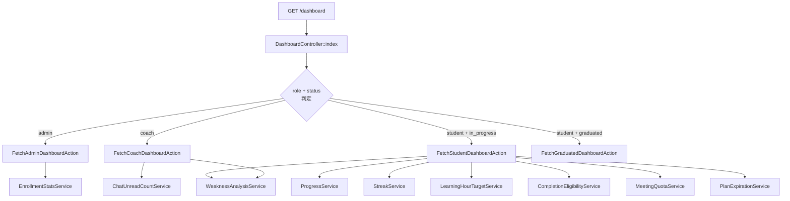
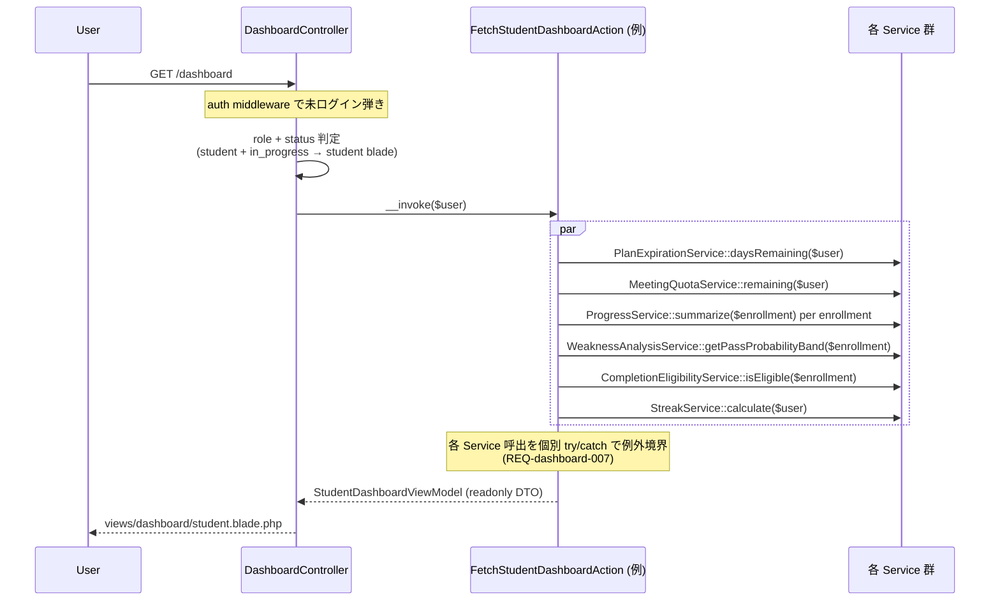
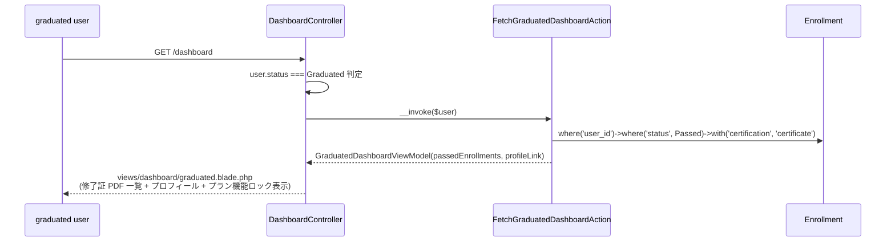

# dashboard 設計

> **v3 改修反映**(2026-05-16):
> - 受講生: **プラン情報パネル**(残面談回数 + プラン残日数 + 追加面談購入 CTA)追加、**修了済資格セクション** 追加、**「修了証を受け取る」ボタン**(`ReceiveCertificateAction` 起動、自己発火)
> - 受講生: `Enrollment.status IN (learning, passed)` で表示(v3 で `passed` も「復習モード」として継続表示)
> - **graduated 専用ダッシュボード** 新設(修了証 PDF 一覧 + プロフィール閲覧のみ)
> - admin: **修了申請待ち一覧 / プラン期限切れ間近一覧 / 滞留検知** 削除(運用モニタリング MVP 最小限)
> - coach: **滞留検知リスト** 削除、担当範囲を `assigned_coach_id` → **`certification.coaches` 経由**
> - **`StagnationDetectionService` は利用しない**(v3 で撤回)

## 概要

ログイン直後の `/dashboard` を **読み取り専用の集約画面** として提供する。独自モデル / Migration / Service / Policy を作らず、各 Feature が公開している Service と Eloquent モデルを DI で消費する。ロール別 Blade を 4 ファイルに分離(`admin.blade.php` / `coach.blade.php` / `student.blade.php` / `graduated.blade.php`)、`DashboardController::index` で `auth()->user()->role` および `status === Graduated` を判定して該当 Action(`FetchAdminDashboardAction` / `FetchCoachDashboardAction` / `FetchStudentDashboardAction` / `FetchGraduatedDashboardAction`)を呼び、readonly DTO ViewModel に詰めて Blade に渡す。サイドバーバッジ(`SidebarBadgeComposer`)と dashboard 本体の集計値は同一 Service を再利用し、数字の二重計算 / 乖離を構造的に防ぐ。

## アーキテクチャ概要



### 1. ロール判定 → ViewModel 構築



### 2. graduated 専用ダッシュボード分岐



## コンポーネント

### Controller

```php
namespace App\Http\Controllers;

class DashboardController
{
    public function index(
        FetchAdminDashboardAction $fetchAdmin,
        FetchCoachDashboardAction $fetchCoach,
        FetchStudentDashboardAction $fetchStudent,
        FetchGraduatedDashboardAction $fetchGraduated,
    ): View {
        $user = auth()->user();

        // v3: graduated 専用ダッシュボード
        if ($user->status === UserStatus::Graduated) {
            $viewModel = ($fetchGraduated)($user);
            return view('dashboard.graduated', compact('viewModel'));
        }

        $viewModel = match ($user->role) {
            UserRole::Admin => ($fetchAdmin)($user),
            UserRole::Coach => ($fetchCoach)($user),
            UserRole::Student => ($fetchStudent)($user),
        };

        return view('dashboard.' . $user->role->value, compact('viewModel'));
    }
}
```

### Action(`App\UseCases\Dashboard\`)

#### `FetchStudentDashboardAction`(v3 でプラン情報パネル + 修了済資格セクション追加)

```php
class FetchStudentDashboardAction
{
    public function __construct(
        private ProgressService $progress,
        private StreakService $streak,
        private LearningHourTargetService $hourTarget,
        private WeaknessAnalysisService $weakness,
        private CompletionEligibilityService $completion,
        private MeetingQuotaService $meetingQuota,
        private PlanExpirationService $planExpiration,
    ) {}

    public function __invoke(User $student): StudentDashboardViewModel
    {
        // プラン情報パネル(v3 新規)
        $planInfo = new PlanInfoPanel(
            planName: $student->plan?->name,
            courseDaysRemaining: $this->planExpiration->daysRemaining($student),
            meetingsRemaining: $this->meetingQuota->remaining($student),
            meetingQuotaPlans: MeetingQuotaPlan::where('status', 'published')->ordered()->get(),
        );

        // 受講中資格(learning + passed v3)
        $activeEnrollments = Enrollment::where('user_id', $student->id)
            ->whereIn('status', [EnrollmentStatus::Learning, EnrollmentStatus::Passed])
            ->with('certification')
            ->get();

        $cards = $activeEnrollments->map(fn ($e) => $this->buildCard($e));

        // 修了済資格セクション(v3 新規)
        $passedEnrollments = Enrollment::where('user_id', $student->id)
            ->where('status', EnrollmentStatus::Passed)
            ->whereNotNull('passed_at')
            ->with(['certification', 'certificate'])
            ->orderByDesc('passed_at')
            ->get();

        return new StudentDashboardViewModel(
            planInfo: $planInfo,
            enrollmentCards: $cards,
            passedEnrollments: $passedEnrollments,
            streak: $this->streak->calculate($student),
            goalTimeline: $this->buildGoalTimeline($student),
            upcomingMeetings: $this->buildUpcomingMeetings($student),
            recentNotifications: $student->notifications()->latest()->limit(5)->get(),
            unreadNotificationCount: $student->unreadNotifications()->count(),
            hasNoEnrollment: $cards->isEmpty(),
        );
    }

    private function buildCard(Enrollment $e): StudentEnrollmentCard
    {
        return new StudentEnrollmentCard(
            enrollmentId: $e->id,
            certificationName: $e->certification->name,
            status: $e->status,
            isPassed: $e->status === EnrollmentStatus::Passed,
            examDate: $e->exam_date,
            daysUntilExam: $e->exam_date?->diffInDays(now(), false),
            progressRatio: $this->progress->summarize($e)->overallCompletionRatio,
            currentTerm: $e->current_term,
            learningHourTarget: $this->hourTarget->compute($e),
            passProbabilityBand: $this->weakness->getPassProbabilityBand($e),
            weakCategories: $this->weakness->getWeakCategories($e)->take(3),
            // v3: 「修了証を受け取る」ボタン活性判定
            canReceiveCertificate: $this->completion->isEligible($e) && $e->status === EnrollmentStatus::Learning,
            certificateDownloadUrl: $e->certificate?->downloadUrl(),
        );
    }
}
```

#### `FetchCoachDashboardAction`(v3 で certification.coaches 経由 + 滞留検知削除)

```php
class FetchCoachDashboardAction
{
    public function __invoke(User $coach): CoachDashboardViewModel
    {
        // v3: assigned_coach_id 撤回 → certification.coaches 経由
        $assignedEnrollments = Enrollment::query()
            ->whereHas('certification.coaches', fn ($q) => $q->where('users.id', $coach->id))
            ->whereIn('status', [EnrollmentStatus::Learning, EnrollmentStatus::Passed])
            ->with(['user', 'certification', 'lastLearningSession'])
            ->get()
            ->sortByDesc(fn ($e) => $e->lastLearningSession?->started_at);

        // 今日 / 明日の面談(coach_id 指定で取得)
        $todayMeetings = Meeting::where('coach_id', $coach->id)
            ->where('status', MeetingStatus::Reserved)
            ->whereBetween('scheduled_at', [now()->startOfDay(), now()->endOfDay()->addDay()])
            ->with(['student', 'enrollment.certification'])
            ->orderBy('scheduled_at')->get();

        return new CoachDashboardViewModel(
            assignedEnrollments: $assignedEnrollments,
            todayAndTomorrowMeetings: $todayMeetings,
            unreadChatCount: $this->chatUnread->roomCountForUser($coach),
            recentUnreadChatRooms: $this->fetchRecentChatRooms($coach, 5),
            unansweredQaCount: $this->fetchUnansweredQaCount($coach),
            recentQaThreads: $this->fetchRecentQa($coach, 5),
            // v3: certification.coaches 経由で集約
            aggregatedWeakCategories: $this->aggregateWeakCategories($assignedEnrollments),
            // v3 で stagnationList 削除
            recentEnrollmentNotes: EnrollmentNote::whereHas('enrollment.certification.coaches',
                fn ($q) => $q->where('users.id', $coach->id))
                ->latest('updated_at')->limit(5)->get(),
            recentNotifications: $coach->notifications()->latest()->limit(5)->get(),
            unreadNotificationCount: $coach->unreadNotifications()->count(),
        );
    }
}
```

#### `FetchAdminDashboardAction`(v3 で pending / プラン期限切れ / 滞留検知 削除)

```php
class FetchAdminDashboardAction
{
    public function __construct(private EnrollmentStatsService $stats) {}

    public function __invoke(User $admin): AdminDashboardViewModel
    {
        $kpi = $this->stats->adminKpi();  // v3: pending_count なし

        return new AdminDashboardViewModel(
            kpi: $kpi,  // { learning_count, passed_count, failed_count, by_certification }
            byCertificationTop10: collect($kpi['by_certification'])->take(10),
            completionRateByCertification: $this->stats->completionRateByCertification(),
            recentNotifications: $admin->notifications()->latest()->limit(5)->get(),
            unreadNotificationCount: $admin->unreadNotifications()->count(),
            isEmptyState: collect($kpi)->only(['learning_count', 'passed_count'])->sum() === 0,
        );
    }
}
```

#### `FetchGraduatedDashboardAction`(v3 新規)

```php
class FetchGraduatedDashboardAction
{
    public function __invoke(User $graduated): GraduatedDashboardViewModel
    {
        $passedEnrollments = Enrollment::where('user_id', $graduated->id)
            ->where('status', EnrollmentStatus::Passed)
            ->whereNotNull('passed_at')
            ->with(['certification', 'certificate'])
            ->orderByDesc('passed_at')->get();

        return new GraduatedDashboardViewModel(
            graduatedAt: $graduated->plan_expires_at,  // 卒業日 = プラン満了日
            passedEnrollments: $passedEnrollments,
            certificateCount: $passedEnrollments->count(),
        );
    }
}
```

### ViewModel(readonly DTO)

```php
// v3 新規 / 更新
readonly class StudentDashboardViewModel
{
    public function __construct(
        public PlanInfoPanel $planInfo,                          // v3 新規
        public Collection $enrollmentCards,
        public Collection $passedEnrollments,                    // v3 新規(修了済資格セクション)
        public StreakSummary $streak,
        public Collection $goalTimeline,
        public Collection $upcomingMeetings,
        public Collection $recentNotifications,
        public int $unreadNotificationCount,
        public bool $hasNoEnrollment,
    ) {}
}

readonly class PlanInfoPanel
{
    public function __construct(
        public ?string $planName,
        public ?int $courseDaysRemaining,
        public int $meetingsRemaining,
        public Collection $meetingQuotaPlans,  // 追加面談購入 CTA 用
    ) {}
}

readonly class StudentEnrollmentCard
{
    public function __construct(
        public string $enrollmentId,
        public string $certificationName,
        public EnrollmentStatus $status,
        public bool $isPassed,                                   // v3 追加
        public ?Carbon $examDate,
        public ?int $daysUntilExam,
        public ?float $progressRatio,
        public TermType $currentTerm,
        public LearningHourTarget $learningHourTarget,
        public PassProbabilityBand $passProbabilityBand,
        public Collection $weakCategories,
        public bool $canReceiveCertificate,                      // v3 で名前変更(canRequestCompletion → canReceiveCertificate)
        public ?string $certificateDownloadUrl,
    ) {}
}

readonly class AdminDashboardViewModel
{
    public function __construct(
        public array $kpi,  // v3: pending_count なし
        public Collection $byCertificationTop10,
        public Collection $completionRateByCertification,  // v3 新規
        public Collection $recentNotifications,
        public int $unreadNotificationCount,
        public bool $isEmptyState,
    ) {}
}

readonly class GraduatedDashboardViewModel  // v3 新規
{
    public function __construct(
        public ?Carbon $graduatedAt,
        public Collection $passedEnrollments,
        public int $certificateCount,
    ) {}
}
```

## Blade ビュー

`resources/views/dashboard/`:

| ファイル | 役割 |
|---|---|
| `student.blade.php` | プラン情報パネル(最上部) → 受講中資格カード → 修了済資格セクション → ストリーク → 目標タイムライン → 通知 → 面談予定 |
| `coach.blade.php` | 担当受講生(certification.coaches 経由) → 今日/明日の面談 → 未読 chat → 未回答 QA → 担当受講生の頻出弱点 → 受講生メモ → 通知 |
| `admin.blade.php` | 全体 KPI(learning + passed + failed) → 資格別受講中人数 → 資格別修了率 → 通知 |
| **`graduated.blade.php`(v3 新規)** | 修了済資格セクション中核 + プロフィール閲覧 + プラン機能ロック表示 |
| `_partials/student/plan-info-panel.blade.php` | **v3 新規**: Plan 名 + プラン残日数 + 残面談回数 + 追加面談購入 CTA(MeetingQuotaPlan モーダル) |
| `_partials/student/enrollment-card.blade.php` | 試験日カウントダウン + 進捗ゲージ + 学習時間目標 + 合格可能性 + 弱点チップ + **「修了証を受け取る」ボタン** |
| `_partials/student/passed-enrollments.blade.php` | **v3 新規**: 修了済資格 + 修了日 + PDF DL + 復習モード遷移 |
| `_partials/student/streak-panel.blade.php` |
| `_partials/student/goal-timeline.blade.php` |
| `_partials/coach/assigned-students-list.blade.php` | v3: certification.coaches 経由 |
| `_partials/coach/chat-room-summary.blade.php` |
| `_partials/coach/qa-thread-summary.blade.php` |
| `_partials/coach/weak-categories-aggregate.blade.php` |
| `_partials/coach/enrollment-notes-recent.blade.php` |
| `_partials/admin/kpi-overview.blade.php` | v3: pending_count タイルなし、learning + passed + failed の 3 タイル + 資格別 |
| `_partials/admin/completion-rate-list.blade.php` | v3 新規: 資格別修了率 |
| `_partials/admin/by-certification-breakdown.blade.php` |
| `_partials/notification-list.blade.php`(共通) |
| `_partials/meeting-upcoming-list.blade.php`(共通) |
| `_partials/empty-state.blade.php`(共通) |
| `_partials/kpi-tile.blade.php`(共通) |

### 明示的に持たない Blade(v3 撤回)

- 旧 `_partials/admin/pending-completion-list.blade.php`(修了申請待ち)
- 旧 `_partials/admin/stagnation-list-admin.blade.php`
- 旧 `_partials/admin/coach-activity-list.blade.php`
- 旧 `_partials/coach/stagnation-list.blade.php`

## 関連要件マッピング

| 要件 ID | 実装ポイント |
|---|---|
| REQ-dashboard-001〜007 | `App\Http\Controllers\DashboardController` |
| REQ-dashboard-004 | `FetchGraduatedDashboardAction` + `graduated.blade.php`(v3 新規) |
| REQ-dashboard-005 | `App\View\Composers\SidebarBadgeComposer` と同一 Service を共有 |
| REQ-dashboard-100〜101 | `_partials/student/plan-info-panel.blade.php`(v3 新規) + `MeetingQuotaService::remaining` + `PlanExpirationService::daysRemaining` |
| REQ-dashboard-110〜151 | `_partials/student/enrollment-card.blade.php` + 各 Service 呼出 |
| REQ-dashboard-160〜164 | `StudentEnrollmentCard::canReceiveCertificate` + `CompletionEligibilityService::isEligible` + `EnrollmentStatus === Learning` 論理積 |
| REQ-dashboard-170〜173 | `_partials/student/passed-enrollments.blade.php`(v3 新規) + `FetchStudentDashboardAction::passedEnrollments` |
| REQ-dashboard-200〜240 | `StreakService` / `EnrollmentGoal` / `Notification` / `Meeting` を Action 内で集約 |
| REQ-dashboard-300〜380 | `FetchCoachDashboardAction`(v3 で `certification.coaches` 経由)、滞留検知削除 |
| REQ-dashboard-500〜540 | `FetchAdminDashboardAction`(v3 で pending_count なし、滞留検知なし、coach 稼働なし) |
| REQ-dashboard-530 | **削除**(v3 撤回) |
| NFR-dashboard-001 | 各 Action でクエリ計画(student 20 / coach + admin 25) |
| NFR-dashboard-002 | `with([...])` Eager Loading |
| NFR-dashboard-003 | 独自 Service を新設しない、他 Feature の Service のみ消費 |
| NFR-dashboard-006 | `dashboard/{admin,coach,student,graduated}.blade.php` 4 ファイル(v3 で graduated 追加) |
| NFR-dashboard-007 | 各 Action 内 try/catch で個別 Service 例外を吸収 |

## テスト戦略

`tests/Feature/Http/Dashboard/` および `tests/Feature/UseCases/Dashboard/`:

### Controller

- `DashboardControllerTest`: guest redirect / 各ロール blade 表示 / **graduated は graduated.blade を表示**(v3)

### Action

- `FetchStudentDashboardActionTest`:
  - learning + passed Enrollment 両方を card に表示(v3)
  - プラン情報パネルの残面談回数表示(v3)
  - 修了済資格セクションが `passed_at DESC` 順(v3)
  - 「修了証を受け取る」ボタン活性条件(v3)
  - 個別 Service 例外境界
- `FetchCoachDashboardActionTest`:
  - certification.coaches 経由で担当 Enrollment 取得(v3)
  - **stagnation 関連テスト削除**(v3)
- `FetchAdminDashboardActionTest`:
  - **pending_count テスト削除**(v3)
  - 修了率テスト(v3)
- **`FetchGraduatedDashboardActionTest`(v3 新規)**:
  - graduated user で passedEnrollments を返す
  - 修了証 DL リンク含む

### Sidebar 整合性

- `DashboardSidebarConsistencyTest`(REQ-dashboard-005): admin / coach / student のサイドバーバッジと dashboard 本体の数値一致

### クエリ数

- `DashboardQueryCountTest`(NFR-dashboard-001): admin 25 / coach 25 / student 20 / graduated 10 以内
