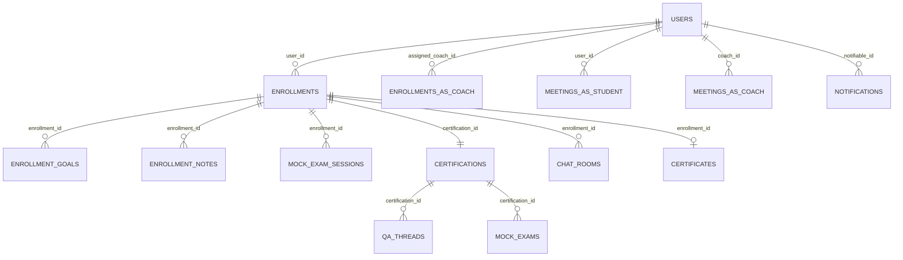

# dashboard 設計

## 概要

ログイン直後の `/dashboard` を **読み取り専用の集約画面** として提供する Feature。独自モデル / Migration / Service / Policy を作らず、`product.md` 集計責務マトリクスに従って他 Feature が公開している Service と Eloquent モデルを DI で消費する。ロール別 Blade を 3 ファイルに分離し（`dashboard/admin.blade.php` / `coach.blade.php` / `student.blade.php`）、`DashboardController::index` で `auth()->user()->role` を判定して該当 Action（`FetchAdminDashboardAction` / `FetchCoachDashboardAction` / `FetchStudentDashboardAction`）を呼び、readonly DTO ViewModel に詰めて Blade に渡す。サイドバーバッジ（`SidebarBadgeComposer`）と dashboard 本体の集計値は同一 Service を再利用し、数字の二重計算 / 乖離を構造的に防ぐ。

## アーキテクチャ概要

### コンポーネント境界マップ

```mermaid
flowchart TB
    subgraph dashboard["dashboard Feature 内"]
        DC[DashboardController index]
        FAD[FetchAdminDashboardAction]
        FCD[FetchCoachDashboardAction]
        FSD[FetchStudentDashboardAction]
        AVM[AdminDashboardViewModel]
        CVM[CoachDashboardViewModel]
        SVM[StudentDashboardViewModel]
        BAdmin[dashboard/admin.blade.php]
        BCoach[dashboard/coach.blade.php]
        BStudent[dashboard/student.blade.php]
    end

    DC -->|role=admin| FAD
    DC -->|role=coach| FCD
    DC -->|role=student| FSD
    FAD --> AVM
    FCD --> CVM
    FSD --> SVM
    AVM --> BAdmin
    CVM --> BCoach
    SVM --> BStudent

    subgraph external["他 Feature が公開する Service / Model"]
        L["learning - ProgressService StreakService LearningHourTargetService StagnationDetectionService"]
        M["mock-exam - WeaknessAnalysisService"]
        E["enrollment - EnrollmentStatsService CompletionEligibilityService Enrollment EnrollmentGoal EnrollmentNote"]
        Mn["mentoring - CoachActivityService Meeting"]
        Ch["chat - ChatUnreadCountService ChatRoom"]
        Qa["qa-board - QaThread"]
        Nt["notification - User notifications/unreadNotifications"]
        Cert["certification-management - Certification Certificate"]
    end

    FAD --> E
    FAD --> L
    FAD --> Mn
    FAD --> Nt

    FCD --> E
    FCD --> L
    FCD --> M
    FCD --> Mn
    FCD --> Ch
    FCD --> Qa
    FCD --> Nt

    FSD --> E
    FSD --> L
    FSD --> M
    FSD --> Mn
    FSD --> Nt
    FSD --> Cert

    subgraph shared["既存基盤（Wave 0b 整備済）"]
        SBC["App View Composers SidebarBadgeComposer"]
    end

    SBC -.|同一 Service を参照<br/>集計重複なし| L
    SBC -.|同一 Service を参照| E
    SBC -.|同一 Service を参照| Ch
    SBC -.|同一 Service を参照| Mn
```

### リクエスト処理シーケンス（受講生ケース、admin / coach も同形）

```mermaid
sequenceDiagram
    autonumber
    actor U as student
    participant Br as Browser
    participant Rt as routes/web.php
    participant Mw as auth Middleware
    participant DC as DashboardController
    participant FA as FetchStudentDashboardAction
    participant Svc as 他 Feature の Service 群
    participant DB as MySQL
    participant V as student.blade.php

    U->>Br: GET /dashboard
    Br->>Rt: HTTP request
    Rt->>Mw: dashboard.index ルート発火
    Mw-->>Br: 未ログインなら /login へ redirect（REQ-001）
    Mw->>DC: ログイン済なら index 呼出
    DC->>DC: $user = $request->user(); match ($user->role)
    DC->>FA: $action($user)
    FA->>DB: Enrollment::with('certification','goals')->ofStudent($user)->learningOrPaused()->get()
    DB-->>FA: enrollments collection
    loop 各 Enrollment
        FA->>Svc: ProgressService::summarize($enrollment)
        FA->>Svc: LearningHourTargetService::compute($enrollment)
        FA->>Svc: WeaknessAnalysisService::getPassProbabilityBand($enrollment)
        FA->>Svc: WeaknessAnalysisService::getWeakCategories($enrollment)
        FA->>Svc: CompletionEligibilityService::isEligible($enrollment)
    end
    FA->>Svc: StreakService::calculate($user)
    FA->>DB: $user->notifications()->limit(5)->get()
    FA->>DB: Meeting::ofUser($user)->upcoming()->limit(5)->get()
    FA-->>DC: StudentDashboardViewModel
    DC->>V: view('dashboard.student', compact('viewModel'))
    V-->>Br: HTML 描画
```

> 例外境界: 個別 Service 呼び出しが例外を投げた場合、Action は **当該フィールドを null / 空 collection に置換した ViewModel** を返し、Blade 側 `@isset` / `@if` で「データを取得できませんでした」を描画する（REQ-dashboard-007）。Action が全部刷新で 500 にしない。

### コンポーネント概要表

| Component | Domain/Layer | Intent | Req Coverage | Key Dependencies |
|---|---|---|---|---|
| `DashboardController` | HTTP | ロール判定 + Action dispatch + view 返却 | REQ-001..010 | `auth` middleware, 3 Action |
| `FetchAdminDashboardAction` | UseCase | admin 用集計を ViewModel に詰める | REQ-500..550 | EnrollmentStatsService, StagnationDetectionService, CoachActivityService, Notification |
| `FetchCoachDashboardAction` | UseCase | coach 用集計を ViewModel に詰める | REQ-300..380 | Progress/Stagnation/WeaknessAnalysis/ChatUnreadCount Service, Enrollment, Meeting, QaThread, EnrollmentNote, Notification |
| `FetchStudentDashboardAction` | UseCase | student 用集計を ViewModel に詰める | REQ-100..240 | Progress/Streak/LearningHourTarget/WeaknessAnalysis/CompletionEligibility Service, Enrollment, EnrollmentGoal, Meeting, Notification |
| `AdminDashboardViewModel` | DTO | admin Blade に渡す readonly DTO | REQ-500..550 | — |
| `CoachDashboardViewModel` | DTO | coach Blade に渡す readonly DTO | REQ-300..380 | — |
| `StudentDashboardViewModel` | DTO | student Blade に渡す readonly DTO | REQ-100..240 | — |
| `dashboard/admin.blade.php` | View | admin 専用ダッシュボード描画 | REQ-002..009, REQ-500..550 | AdminDashboardViewModel |
| `dashboard/coach.blade.php` | View | coach 専用ダッシュボード描画 | REQ-002..009, REQ-300..380 | CoachDashboardViewModel |
| `dashboard/student.blade.php` | View | student 専用ダッシュボード描画 | REQ-002..009, REQ-100..240 | StudentDashboardViewModel |

## データモデル

本 Feature は **新規テーブル / Eloquent モデルを作らない**。他 Feature が公開する以下を読み取り消費する。

| Feature | モデル | 利用箇所 |
|---|---|---|
| [[auth]] | `User`（`role` Enum, `notifications()` / `unreadNotifications()` trait） | 全ロール / 通知パネル |
| [[enrollment]] | `Enrollment`, `EnrollmentGoal`, `EnrollmentNote` | student 資格カード / 目標タイムライン / coach メモ |
| [[mock-exam]] | `MockExam`, `MockExamSession` | student 弱点判定 / 合格可能性スコアの中で Service が利用 |
| [[mentoring]] | `Meeting` | student / coach 面談予定 |
| [[chat]] | `ChatRoom`, `ChatMessage`（最新 1 件） | coach 未対応 chat リスト |
| [[qa-board]] | `QaThread` | coach 未回答 QA リスト |
| [[certification-management]] | `Certification`, `Certificate` | student 修了済バッジ + PDF ダウンロードリンク |
| [[notification]] | `Illuminate\Notifications\DatabaseNotification`（User trait 経由） | 全ロール直近通知 |

### 参照関係 ER 図（dashboard が読む範囲のみ抜粋）



> Mermaid の制約で `USERS → ENROLLMENTS` の 2 つの FK（`user_id` / `assigned_coach_id`）は 2 行に分けて記述。実体は同テーブル。

## 状態遷移

本 Feature は状態を持たない（読み取り専用）。他 Feature の状態遷移をそのまま閲覧表示するのみ。

## コンポーネント詳細

### Controller

#### `App\Http\Controllers\DashboardController`

`app/Http/Controllers/DashboardController.php` に配置。ロール別 namespace は使わない（`structure.md` / `backend-http.md` 規約）。

```php
namespace App\Http\Controllers;

use App\Enums\UserRole;
use App\UseCases\Dashboard\FetchAdminDashboardAction;
use App\UseCases\Dashboard\FetchCoachDashboardAction;
use App\UseCases\Dashboard\FetchStudentDashboardAction;
use Illuminate\Http\Request;
use Illuminate\View\View;

class DashboardController extends Controller
{
    public function index(
        Request $request,
        FetchAdminDashboardAction $admin,
        FetchCoachDashboardAction $coach,
        FetchStudentDashboardAction $student,
    ): View {
        $user = $request->user();

        $viewModel = match ($user->role) {
            UserRole::Admin => $admin($user),
            UserRole::Coach => $coach($user),
            UserRole::Student => $student($user),
        };

        return view('dashboard.' . $user->role->value, compact('viewModel'));
    }
}
```

- 3 つの Action を method 引数で DI。`match` で呼ぶのは 1 つだけだが、Laravel Container の解決コストは軽微。
- Controller method 名は `index` 1 つ。`backend-http.md` の「1 Controller method = 1 Action」規約は **Action 単位で守られていれば良い**（admin / coach / student の 3 Action はそれぞれ 1 ロール用の単一処理）。method 内で `match` でロール分岐するパターンは [[chat]] の `IndexAction` / `IndexAsCoachAction` 並列パターンと同様に許容される（method を分けるか分岐するかの差で、ここでは URL が 1 つのため method 1 つに統合）。
- Policy は使わない（REQ-dashboard-004 + NFR-dashboard-008、Blade が分かれていてロール跨ぎが構造的に不可）。

### Action（UseCase）

#### `App\UseCases\Dashboard\FetchAdminDashboardAction`

```php
namespace App\UseCases\Dashboard;

use App\Models\User;
use App\Services\CoachActivityService;
use App\Services\EnrollmentStatsService;
use App\Services\StagnationDetectionService;

class FetchAdminDashboardAction
{
    public function __construct(
        private EnrollmentStatsService $stats,
        private StagnationDetectionService $stagnation,
        private CoachActivityService $coachActivity,
    ) {}

    public function __invoke(User $admin): AdminDashboardViewModel;
}
```

責務: (1) `EnrollmentStatsService::adminKpi()` の戻り値 array を `AdminDashboardKpi` readonly DTO に詰める、(2) `Enrollment::pending()->with(['user','certification'])->latest('completion_requested_at')->limit(10)->get()` で修了申請待ち上位 10 件を取得、(3) `StagnationDetectionService::detectStagnant()->take(10)` で滞留検知上位 10 件、(4) `CoachActivityService::summarize()->take(10)` でコーチ稼働状況上位 10 件、(5) `$admin->notifications()->limit(5)->get()` + `$admin->unreadNotifications()->count()`、(6) `AdminDashboardViewModel` に詰めて返す。トランザクション不要（読み取り専用）。例外: 個別 Service が throw した場合は Action 内で `try/catch` し、該当フィールドを null / 空 collection に置換（REQ-dashboard-007）。

#### `App\UseCases\Dashboard\FetchCoachDashboardAction`

```php
namespace App\UseCases\Dashboard;

use App\Models\User;
use App\Services\ChatUnreadCountService;
use App\Services\ProgressService;
use App\Services\StagnationDetectionService;
use App\Services\WeaknessAnalysisService;

class FetchCoachDashboardAction
{
    public function __construct(
        private ProgressService $progress,
        private StagnationDetectionService $stagnation,
        private WeaknessAnalysisService $weakness,
        private ChatUnreadCountService $chatUnread,
    ) {}

    public function __invoke(User $coach): CoachDashboardViewModel;
}
```

責務: (1) `Enrollment::where('assigned_coach_id', $coach->id)->whereIn('status', [Learning, Paused])->with(['user','certification'])->get()` で担当受講生 Enrollment を取得、(2) 各 Enrollment に対し `ProgressService::summarize` / `StagnationDetectionService::lastActivityAt` を **N+1 回避のため Service に渡す前にコレクション側で必要データを Eager Load**、(3) `Meeting::where('coach_id', $coach->id)->whereIn('status', [Approved, InProgress])->whereBetween('scheduled_at', [today, tomorrow_end])->with(['student','enrollment.certification'])->orderBy('scheduled_at')->get()`、(4) `ChatUnreadCountService::roomCountForUser($coach)` + 直近 5 件の ChatRoom リスト、(5) 担当資格 ids を `certification_coach_assignments.coach_user_id = $coach->id` で取得 → `QaThread::whereIn('certification_id', $certIds)->where('status', QaThreadStatus::Open)->count()` + 直近 5 件、(6) 担当 Enrollment に対し `WeaknessAnalysisService::getWeakCategories` を集約し QuestionCategory 出現回数で上位 5 件、(7) `StagnationDetectionService::detectStagnant()->where('assigned_coach_id', $coach->id)->take(10)`、(8) `EnrollmentNote::whereHas('enrollment', fn ($q) => $q->where('assigned_coach_id', $coach->id))->with(['enrollment.user','enrollment.certification'])->latest('updated_at')->limit(5)->get()`、(9) `$coach->notifications()->limit(5)->get()` + 未読件数、(10) `CoachDashboardViewModel` に詰めて返す。例外境界は admin 同等。

#### `App\UseCases\Dashboard\FetchStudentDashboardAction`

```php
namespace App\UseCases\Dashboard;

use App\Models\User;
use App\Services\CompletionEligibilityService;
use App\Services\LearningHourTargetService;
use App\Services\ProgressService;
use App\Services\StreakService;
use App\Services\WeaknessAnalysisService;

class FetchStudentDashboardAction
{
    public function __construct(
        private ProgressService $progress,
        private StreakService $streak,
        private LearningHourTargetService $hourTarget,
        private WeaknessAnalysisService $weakness,
        private CompletionEligibilityService $eligibility,
    ) {}

    public function __invoke(User $student): StudentDashboardViewModel;
}
```

責務: (1) `Enrollment::ofStudent($student)->whereIn('status', [Learning, Paused])->with(['certification.category','goals' => fn ($q) => $q->orderByRaw('CASE WHEN achieved_at IS NULL THEN 0 ELSE 1 END, target_date IS NULL, target_date ASC, achieved_at DESC')])->orderBy('current_term')->orderBy('exam_date')->get()` で受講中資格を取得、(2) 各 Enrollment に対し `ProgressService::summarize` / `LearningHourTargetService::compute` / `WeaknessAnalysisService::getPassProbabilityBand` / `getWeakCategories`（上位 3 件）/ `CompletionEligibilityService::isEligible` を呼んで `StudentEnrollmentCard` DTO に詰める、(3) `StreakService::calculate($student)`、(4) `EnrollmentGoal::whereHas('enrollment', fn ($q) => $q->where('user_id', $student->id))->with('enrollment.certification')->orderByRaw('CASE WHEN achieved_at IS NULL THEN 0 ELSE 1 END')->orderByRaw('CASE WHEN target_date IS NULL THEN 1 ELSE 0 END')->orderBy('target_date')->orderByDesc('achieved_at')->limit(20)->get()`、(5) `$student->notifications()->limit(5)->get()` + 未読件数、(6) `Meeting::ofUser($student)->whereIn('status', [Approved, InProgress])->where('scheduled_at', '>=', today)->orderBy('scheduled_at')->limit(5)->get()`、(7) `StudentDashboardViewModel` に詰めて返す。

### ViewModel DTO

`app/UseCases/Dashboard/` 配下に readonly class として配置（[[mock-exam]] の `CategoryHeatmapCell` / [[learning]] の `ProgressSummary` と同流儀）。

#### `AdminDashboardViewModel`

```php
namespace App\UseCases\Dashboard;

use Illuminate\Support\Collection;

final readonly class AdminDashboardViewModel
{
    public function __construct(
        public AdminDashboardKpi $kpi,                  // EnrollmentStatsService::adminKpi() を型付き DTO に詰めたもの
        public Collection $pendingCompletionRequests,   // Collection<Enrollment with user, certification>, limit 10
        public Collection $stagnantEnrollments,         // Collection<Enrollment>, limit 10
        public Collection $coachActivities,             // Collection<CoachActivitySummaryRow>, limit 10
        public Collection $recentNotifications,         // Collection<DatabaseNotification>, limit 5
        public int $unreadNotificationCount,
    ) {}
}

final readonly class AdminDashboardKpi
{
    public function __construct(
        public int $learningCount,
        public int $pausedCount,
        public int $passedCount,
        public int $failedCount,
        public int $pendingCount,
        public Collection $byCertification,  // Collection<['certification_id' => string, 'count' => int]>, top 10
    ) {}
}
```

#### `CoachDashboardViewModel`

```php
final readonly class CoachDashboardViewModel
{
    public function __construct(
        public Collection $assignedEnrollments,    // Collection<CoachEnrollmentRow>
        public Collection $upcomingMeetings,       // Collection<Meeting>, 今日/明日
        public int $unreadChatRoomCount,
        public Collection $recentChatRooms,        // Collection<ChatRoom>, limit 5
        public int $unansweredQaCount,
        public Collection $recentQaThreads,        // Collection<QaThread>, limit 5
        public Collection $topWeakCategories,      // Collection<['category' => QuestionCategory, 'occurrences' => int]>, top 5
        public Collection $stagnantEnrollments,    // Collection<Enrollment>, assigned_coach_id 自分のみ, limit 10
        public Collection $recentEnrollmentNotes,  // Collection<EnrollmentNote>, limit 5
        public Collection $recentNotifications,
        public int $unreadNotificationCount,
    ) {}
}

final readonly class CoachEnrollmentRow
{
    public function __construct(
        public Enrollment $enrollment,        // with user, certification eager loaded
        public float $progressRatio,
        public ?Carbon $lastActivityAt,
    ) {}
}
```

#### `StudentDashboardViewModel`

```php
final readonly class StudentDashboardViewModel
{
    public function __construct(
        public Collection $enrollmentCards,        // Collection<StudentEnrollmentCard>
        public StreakSummary $streak,              // App\Services\StreakSummary
        public Collection $goalTimeline,           // Collection<EnrollmentGoal>, limit 20
        public Collection $upcomingMeetings,       // Collection<Meeting>, limit 5
        public Collection $recentNotifications,    // Collection<DatabaseNotification>, limit 5
        public int $unreadNotificationCount,
        public bool $hasNoEnrollment,              // 受講中ゼロ判定
    ) {}
}

final readonly class StudentEnrollmentCard
{
    public function __construct(
        public Enrollment $enrollment,                  // with certification.category eager loaded
        public int $daysUntilExam,                      // exam_date - today、負数なら試験日超過
        public ProgressSummary $progress,
        public LearningHourTargetSummary $hourTarget,
        public PassProbabilityBand $passProbability,
        public Collection $weakCategories,              // Collection<QuestionCategory>, top 3
        public bool $canRequestCompletion,              // isEligible && status=Learning && completion_requested_at=null
        public bool $hasPendingCompletionRequest,       // completion_requested_at !== null
        public ?string $completionGuardReason,          // 修了申請ボタン不活性の理由ヒント
        public ?Certificate $certificate,               // status=Passed のとき紐づく Certificate
    ) {}
}
```

### Service / Policy / FormRequest / Resource / Migration / Model

**いずれも本 Feature では新設しない**:

- **Service**: `product.md` 集計責務マトリクスに dashboard 所有 Service が記載されていない（NFR-dashboard-003）。他 Feature の Service を Action から DI で呼ぶ。
- **Policy**: `/dashboard` は `auth` middleware のみで保護。ロール別 Blade を Controller が描画分岐するため、cross-role アクセスは構造上不可（NFR-dashboard-008、REQ-dashboard-004）。
- **FormRequest**: dashboard は読み取り専用、form input なし。修了申請ボタンの submit 先は [[enrollment]] のルートで、FormRequest も [[enrollment]] 所有。
- **Resource**: API は提供しない（dashboard は Blade レンダリングのみ）。
- **Migration / Eloquent Model**: 新設なし。他 Feature のモデルを読み取り消費。

## ルート定義

`routes/web.php` に以下 1 行を追加（既存 `auth` middleware group 内）:

```php
Route::middleware(['auth'])->group(function () {
    Route::get('/dashboard', [\App\Http\Controllers\DashboardController::class, 'index'])
        ->name('dashboard.index');
});
```

- `dashboard.index` 1 ルートのみ。
- 認証は `auth` middleware（Fortify セッション、[[auth]] で構築済）。
- 本 Feature では修了申請 / 取消 のルートは **定義しない**（[[enrollment]] が `enrollments.completion-request.store` / `enrollments.completion-request.destroy` を所有）。

## Blade ビュー

### ファイル構成

```
resources/views/dashboard/
├── admin.blade.php            # admin 用ダッシュボード
├── coach.blade.php            # coach 用ダッシュボード
├── student.blade.php          # student 用ダッシュボード
└── _partials/
    ├── notification-list.blade.php       # 3 ロール共通: 直近通知パネル
    ├── meeting-upcoming-list.blade.php   # student / coach 共通: 面談予定リスト
    ├── empty-state.blade.php             # 共通 empty state（icon + 文言 + CTA リンク）
    ├── kpi-tile.blade.php                # admin / coach 共通: KPI 数値タイル
    ├── student/
    │   ├── enrollment-card.blade.php     # 受講中資格カード（進捗 / カウントダウン / 弱点 / 修了申請）
    │   ├── streak-panel.blade.php        # 学習ストリークパネル
    │   └── goal-timeline.blade.php       # 個人目標タイムライン（Wantedly 風）
    ├── coach/
    │   ├── assigned-students-list.blade.php
    │   ├── chat-room-summary.blade.php
    │   ├── qa-thread-summary.blade.php
    │   ├── weak-categories-aggregate.blade.php
    │   ├── stagnation-list.blade.php
    │   └── enrollment-notes-recent.blade.php
    └── admin/
        ├── kpi-overview.blade.php
        ├── pending-completion-list.blade.php
        ├── stagnation-list-admin.blade.php
        ├── coach-activity-list.blade.php
        └── by-certification-breakdown.blade.php
```

各 `.blade.php` は `layouts/app.blade.php` を継承（TopBar + Sidebar + Main、UI Foundation の規約準拠）。

### 主要コンポーネント参照

- `<x-card>` / `<x-badge>` / `<x-button>` / `<x-link-button>` / `<x-empty-state>` / `<x-icon>` を `resources/views/components/`（Wave 0b 整備済）から利用
- 進捗ゲージは `<x-card>` 内に Tailwind `bg-primary-600` バーで描画（独自コンポーネント化はしない、Basic 段階）
- 修了申請ボタン: 活性時は `<x-button variant="primary" type="submit" form="completion-request-{enrollment.id}">`、不活性時は `<x-button variant="secondary" disabled>` + `<x-hint>{$reason}</x-hint>`

### Blade 内ロジック禁止規約（NFR-dashboard-007）

- Blade 内では `@if`（empty state 判定）/ `@foreach`（Collection 走査）/ `{{ }}`（ViewModel プロパティ参照）のみを使用
- DB クエリ / Service 呼び出しを Blade 内で行わない（すべて ViewModel に詰めて渡す）
- 例外: `route()` / `__()` / `auth()->user()` は Blade 標準ヘルパとして使用可

## エラーハンドリング

### 個別 Service 例外の境界

`Fetch{Role}DashboardAction` 内で各 Service 呼び出しを **`try/catch (\Throwable $e)`** で囲み、例外発生時は該当フィールドを null / 空 collection に置換 + `Log::warning` に出力する（REQ-dashboard-007）。これにより 1 つの Service の障害が画面全体を 500 にすることを防ぐ。

```php
// 例: FetchStudentDashboardAction 内
try {
    $streak = $this->streak->calculate($student);
} catch (\Throwable $e) {
    Log::warning('dashboard streak service failed', ['user_id' => $student->id, 'exception' => $e]);
    $streak = new StreakSummary(0, 0, null);  // 安全なデフォルト
}
```

### 401 / 403 / 500

- 401: `auth` middleware が自動で `/login` リダイレクト（REQ-dashboard-001）
- 403: dashboard 自体は Policy を持たないため発生しない。各 Feature への遷移リンク先で他者リソースアクセスを試みた場合のみ該当 Feature が 403 返却（[[enrollment]] / [[chat]] 等の Policy）
- 500: 認証情報破壊 / DB 接続障害 等の致命的例外は Laravel 標準の `app/Exceptions/Handler.php` でハンドル → `errors/500.blade.php` 描画

### 想定例外（本 Feature 固有なし）

dashboard 固有のドメイン例外は **作らない**。読み取り専用 + 個別 Service 例外境界で吸収する設計のため、`app/Exceptions/Dashboard/` ディレクトリは作成しない。

## 関連要件マッピング

| 要件ID | 実装ポイント |
|---|---|
| REQ-dashboard-001 | `routes/web.php` の `Route::get('/dashboard', ...)->middleware('auth')->name('dashboard.index')` |
| REQ-dashboard-002 | `DashboardController::index` 内の `match ($user->role)` + `view('dashboard.' . $user->role->value, ...)` |
| REQ-dashboard-003 | `resources/views/dashboard/{admin,coach,student}.blade.php` の 3 ファイル分離 |
| REQ-dashboard-004 | `DashboardController::index` の view 返却が role 単一で他ロールの Blade を読まない構造 |
| REQ-dashboard-005 | 各 Action が `App\View\Composers\SidebarBadgeComposer` と同じ Service（`ChatUnreadCountService` / `Enrollment::pending()` 等）を呼ぶ規約 + `tests/Feature/Http/Dashboard/DashboardSidebarConsistencyTest.php` で同等性確認 |
| REQ-dashboard-006 | `dashboard/_partials/empty-state.blade.php` + 各 partial の `@if` 分岐 |
| REQ-dashboard-007 | 各 `Fetch{Role}DashboardAction` 内の `try/catch` ブロック + ViewModel のデフォルト値 |
| REQ-dashboard-008 | `DashboardController` が role に応じ 1 つの Action のみ呼ぶ、Action 間呼出なし |
| REQ-dashboard-009 | Blade 内に form は修了申請 / 取消 のみ、他は遷移リンク（`<x-link-button>`） |
| REQ-dashboard-010 | `DashboardController::index` が role ごとに **view を返す**（リダイレクトしない） |
| REQ-dashboard-100 | `FetchStudentDashboardAction` 内の `Enrollment::ofStudent($student)->whereIn('status', [Learning, Paused])->get()` |
| REQ-dashboard-110 | `StudentEnrollmentCard.daysUntilExam` の計算（Action 内、`today()->diffInDays($enrollment->exam_date, false)`）+ `_partials/student/enrollment-card.blade.php` の表示分岐 |
| REQ-dashboard-120 | `ProgressService::summarize` 呼出 + `StudentEnrollmentCard.progress` |
| REQ-dashboard-121 | `_partials/student/enrollment-card.blade.php` 内の `$card->enrollment->current_term->label()` 表示 |
| REQ-dashboard-130 | `LearningHourTargetService::compute` 呼出 + `StudentEnrollmentCard.hourTarget` |
| REQ-dashboard-131 | `_partials/student/enrollment-card.blade.php` 内の `@if ($card->hourTarget->targetTotalHours === 0)` 分岐 |
| REQ-dashboard-140 | `WeaknessAnalysisService::getPassProbabilityBand` 呼出 + `StudentEnrollmentCard.passProbability` + `<x-badge variant="...">` 色分け |
| REQ-dashboard-150 | `WeaknessAnalysisService::getWeakCategories` 呼出 → `take(3)` |
| REQ-dashboard-151 | `_partials/student/enrollment-card.blade.php` 内の弱点チップに `route('quiz-drill.index', ['enrollment' => ..., 'category' => ...])` を付ける |
| REQ-dashboard-160 | `CompletionEligibilityService::isEligible` 呼出 + `StudentEnrollmentCard.canRequestCompletion` の論理積 |
| REQ-dashboard-161 | `_partials/student/enrollment-card.blade.php` 内の `<form method="POST" action="{{ route('enrollments.completion-request.store', $card->enrollment) }}">` |
| REQ-dashboard-162 | `StudentEnrollmentCard.completionGuardReason` の文字列 + `<x-hint>` 表示 |
| REQ-dashboard-163 | `<form method="POST" action="{{ route('enrollments.completion-request.destroy', $card->enrollment) }}">@method('DELETE')` |
| REQ-dashboard-164 | `StudentEnrollmentCard.certificate` + `route('certificates.download', $card->certificate)` |
| REQ-dashboard-200 | `StreakService::calculate` 呼出 + `StudentDashboardViewModel.streak` |
| REQ-dashboard-201 | `_partials/student/streak-panel.blade.php` 内の `@if ($viewModel->streak->currentStreak === 0 && $viewModel->streak->lastActiveDate === null)` 分岐 + `<x-empty-state>` |
| REQ-dashboard-210 | `FetchStudentDashboardAction` 内の `EnrollmentGoal` クエリ + `orderByRaw('CASE WHEN achieved_at IS NULL THEN 0 ELSE 1 END')` 等のソート式 |
| REQ-dashboard-211 | `_partials/student/goal-timeline.blade.php` の表示 + `route('enrollments.goals.edit', [...])` |
| REQ-dashboard-212 | `_partials/student/goal-timeline.blade.php` 内の `@if ($viewModel->goalTimeline->isEmpty())` 分岐 + CTA リンク |
| REQ-dashboard-220 | `$student->notifications()->limit(5)->get()` 呼出 + `_partials/notification-list.blade.php` |
| REQ-dashboard-221 | `$student->unreadNotifications()->count()` + `_partials/notification-list.blade.php` ヘッダ |
| REQ-dashboard-230 | `Meeting::ofUser($student)->whereIn('status', [Approved, InProgress])->where('scheduled_at', '>=', today)->orderBy('scheduled_at')->limit(5)` + `_partials/meeting-upcoming-list.blade.php` |
| REQ-dashboard-231 | `_partials/meeting-upcoming-list.blade.php` 内の `@if ($meetings->isEmpty())` 分岐 + `route('meetings.create')` CTA |
| REQ-dashboard-240 | `StudentDashboardViewModel.hasNoEnrollment` フラグ + `student.blade.php` の最上位 `@if` 分岐 |
| REQ-dashboard-300 | `FetchCoachDashboardAction` 内の `Enrollment::where('assigned_coach_id', $coach->id)->whereIn('status', [Learning, Paused])->with(...)->get()` |
| REQ-dashboard-301 | `CoachEnrollmentRow` DTO + `ProgressService::summarize` + `StagnationDetectionService::lastActivityAt` |
| REQ-dashboard-302 | Action 内のソート `->sortByDesc('lastActivityAt', SORT_REGULAR)` (Collection 側) |
| REQ-dashboard-310 | `Meeting::where('coach_id', $coach->id)->whereIn('status', [Approved, InProgress])->whereBetween('scheduled_at', [today, tomorrow_end])->orderBy('scheduled_at')->get()` |
| REQ-dashboard-320 | `ChatUnreadCountService::roomCountForUser($coach)` 呼出 + `CoachDashboardViewModel.unreadChatRoomCount` |
| REQ-dashboard-321 | `ChatRoom` リスト取得（`whereHas('enrollment', fn ($q) => $q->where('assigned_coach_id', $coach->id))->whereIn('status', [Unattended, InProgress])->orderByLastMessage()->limit(5)`） |
| REQ-dashboard-330 | `QaThread::whereIn('certification_id', $coachCertIds)->where('status', QaThreadStatus::Open)` の count + 上位 5 件取得 |
| REQ-dashboard-340 | 担当 Enrollment 集合に対する `WeaknessAnalysisService::getWeakCategories` の Collection 集計（QuestionCategory.id ごとの出現回数で降順上位 5 件） |
| REQ-dashboard-350 | `StagnationDetectionService::detectStagnant()->filter(fn ($e) => $e->assigned_coach_id === $coach->id)->take(10)` |
| REQ-dashboard-360 | `EnrollmentNote::whereHas('enrollment', fn ($q) => $q->where('assigned_coach_id', $coach->id))->with(...)->latest('updated_at')->limit(5)->get()` |
| REQ-dashboard-370 | `$coach->notifications()->limit(5)->get()` + 未読件数 |
| REQ-dashboard-380 | `CoachDashboardViewModel.assignedEnrollments->isEmpty()` 判定 + `<x-empty-state>` |
| REQ-dashboard-500 | `EnrollmentStatsService::adminKpi()` 呼出 + `AdminDashboardKpi` DTO 変換 |
| REQ-dashboard-501 | `AdminDashboardKpi.byCertification` を上位 10 件に限定 + `_partials/admin/by-certification-breakdown.blade.php` |
| REQ-dashboard-510 | `Enrollment::pending()->with(['user','certification'])->latest('completion_requested_at')->limit(10)->get()` |
| REQ-dashboard-511 | `_partials/admin/pending-completion-list.blade.php` の表示 + `route('admin.enrollments.edit', ...)` |
| REQ-dashboard-512 | `Enrollment::pending()` スコープを `SidebarBadgeComposer` と本 Feature で共用、テストで件数一致を確認（`DashboardSidebarConsistencyTest::test_admin_pending_count_matches_sidebar_badge`） |
| REQ-dashboard-520 | `StagnationDetectionService::detectStagnant()->take(10)` |
| REQ-dashboard-530 | `CoachActivityService::summarize()->sortByDesc('completed_count')->take(10)` |
| REQ-dashboard-540 | `$admin->notifications()->limit(5)->get()` + 未読件数 |
| REQ-dashboard-550 | `AdminDashboardKpi` の全フィールド 0 判定 + `<x-empty-state>` |
| NFR-dashboard-001 | クエリ計測テスト（`tests/Feature/Http/Dashboard/DashboardQueryCountTest.php` で `DB::enableQueryLog()` で各ロール 25 クエリ以下を assert） |
| NFR-dashboard-002 | 各 Action 内の `Enrollment::with([...])->get()` の Eager Loading + Service 呼出順の規約 |
| NFR-dashboard-003 | `app/Services/` 配下に dashboard プレフィックスの Service ファイルがゼロであることをテスト（`DashboardArchitectureTest::test_no_dashboard_owned_service_exists`） |
| NFR-dashboard-004 | 各 Blade の `aria-label` / `aria-live="polite"` / `focus-visible:ring-*` 属性 |
| NFR-dashboard-005 | dashboard Action / Blade に `Cache::` ファサード呼出がないことをテスト（`DashboardArchitectureTest::test_no_cache_usage`） |
| NFR-dashboard-006 | `resources/views/dashboard/` 配下のファイル構成 |
| NFR-dashboard-007 | ViewModel readonly class + Blade テスト（`@php` ブロック内 DB クエリ禁止、`DashboardBladeLintTest::test_no_db_queries_in_blade`） |
| NFR-dashboard-008 | `app/Policies/DashboardPolicy.php` / `app/Http/Middleware/Dashboard*` が存在しないことをテスト |
