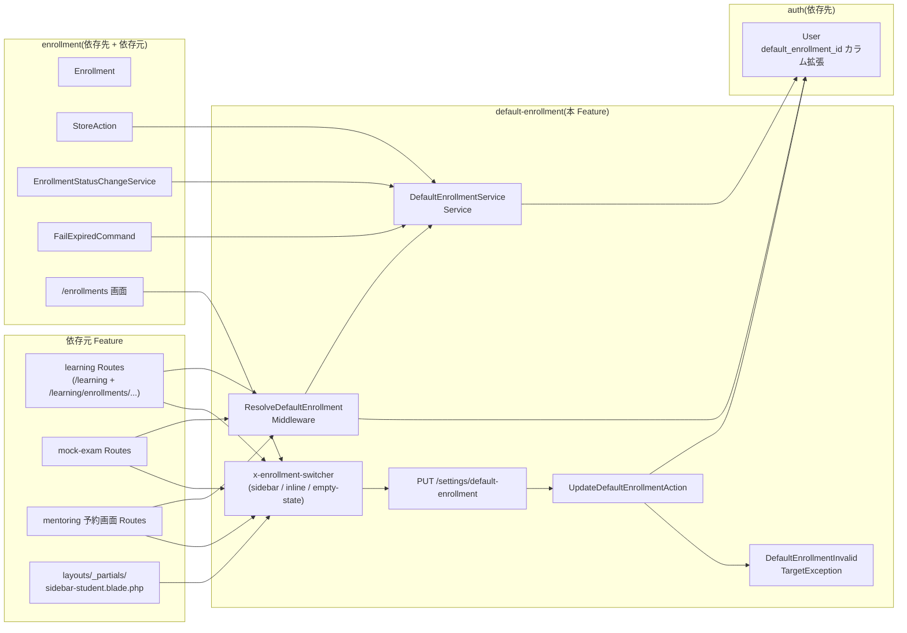
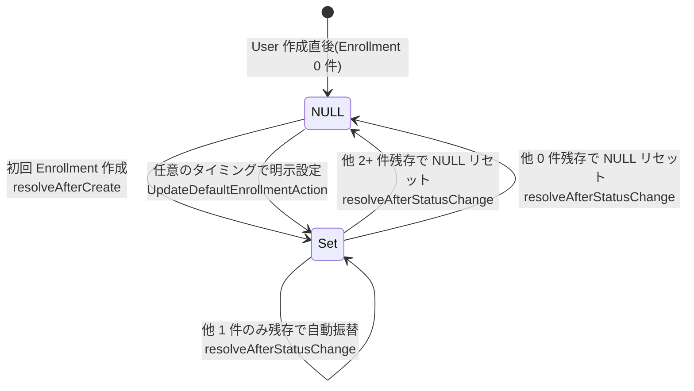
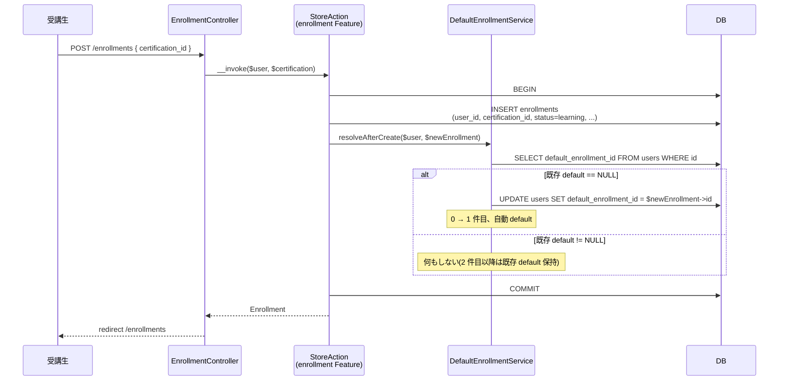
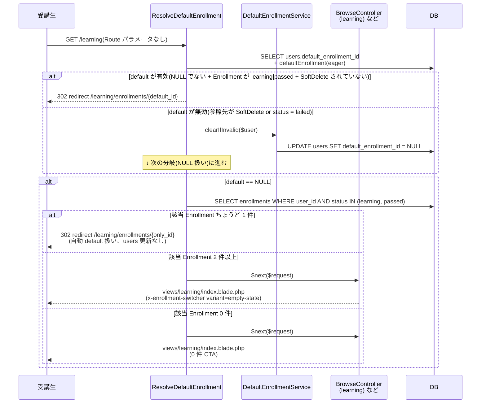
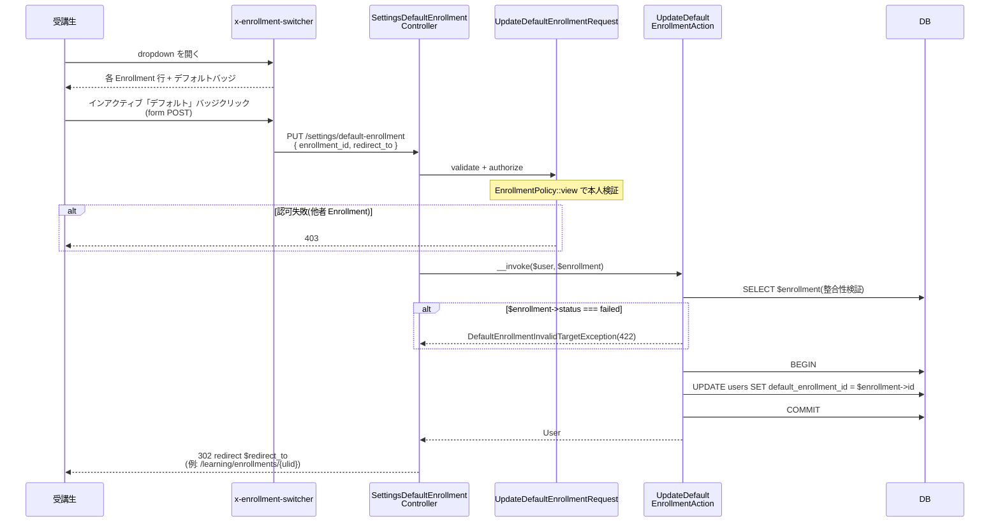
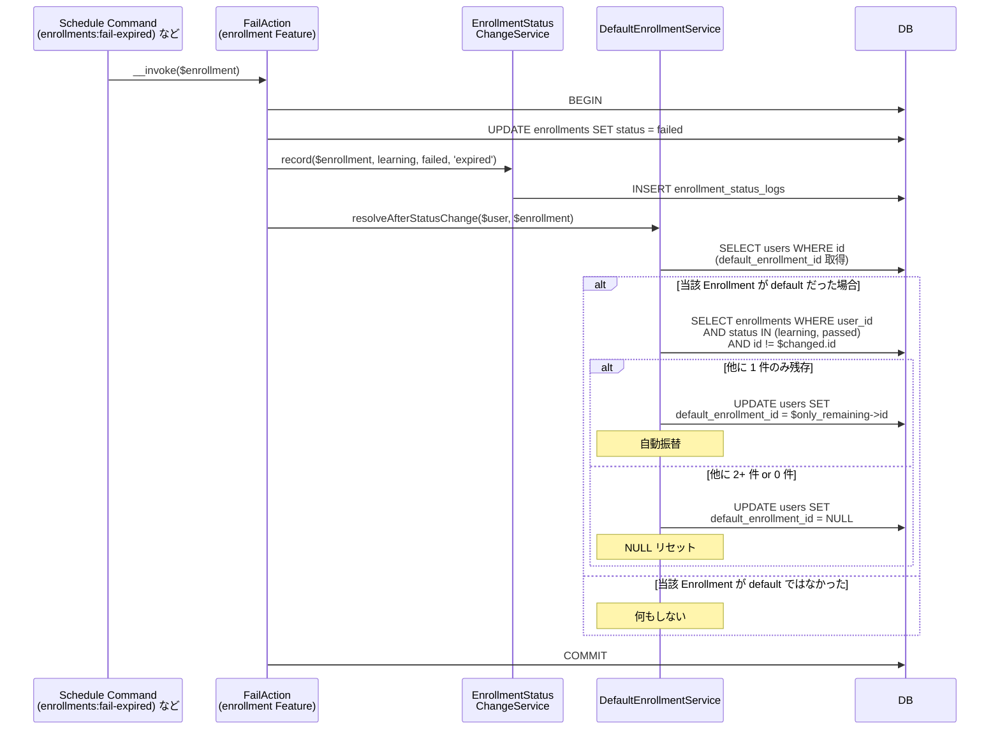

# default-enrollment 設計

## アーキテクチャ概要

cross-cutting infrastructure として、`users.default_enrollment_id` カラム拡張 + 1 Middleware + 1 Service + 1 Action + 1 Component + 1 Endpoint で完結する。**独自モデルは持たず**、[[auth]] の `User` Model + [[enrollment]] の `Enrollment` Model を参照のみ。Clean Architecture（軽量版）に従い、Controller は薄く、状態変更は Action 内 `DB::transaction()` で囲む。3 つの統合点（[[learning]] / [[mock-exam]] / [[mentoring]] 予約画面）に対し共通の Middleware + Component を提供することで、各 Feature が独自の「資格一覧 → 詳細」1 階層目を持たないようにする。



### 統合の三層

| 層 | 責務 | 主な API |
|---|---|---|
| **データ層** | `users.default_enrollment_id` の永続化 | Migration + `User` リレーション + `Enrollment` 逆リレーション |
| **解決層** | 自動設定 / 自動振替 / NULL リセット / URL redirect 判定 | `DefaultEnrollmentService` Service + `ResolveDefaultEnrollment` Middleware |
| **操作層** | 受講生が明示的に default を変更する Endpoint + UI | `UpdateDefaultEnrollmentAction` + `<x-enrollment-switcher>` Component |

## データモデル

### Eloquent モデルへの追加

本 Feature は独自モデルを持たず、既存 Model に以下を追加する:

- **`User`** ([[auth]] 所有) — `default_enrollment_id`（ULID, nullable）を `$fillable` 追加 / `belongsTo(Enrollment::class, 'default_enrollment_id', 'id')` リレーション `defaultEnrollment()` を公開
- **`Enrollment`** ([[enrollment]] 所有) — `hasOne(User::class, 'default_enrollment_id', 'id')` 逆リレーション `defaultedByUser()` を公開（任意、admin 画面等で利用）

### ER 図（User × Enrollment の default 関係を追加）

```mermaid
erDiagram
    USERS ||--o{ ENROLLMENTS : "user_id (受講登録)"
    USERS ||--o| ENROLLMENTS : "default_enrollment_id (デフォルト、nullable)"

    USERS {
        ulid id PK
        string email UNIQUE
        string role "admin/coach/student"
        string status "invited/in_progress/graduated/withdrawn"
        ulid default_enrollment_id FK "v3 nullable this migration"
        timestamps
        timestamp deleted_at "nullable"
    }
    ENROLLMENTS {
        ulid id PK
        ulid user_id FK
        ulid certification_id FK
        date exam_date "nullable"
        string status "learning/passed/failed"
        timestamps
        timestamp deleted_at "nullable"
    }
```

### Migration

`database/migrations/{date}_add_default_enrollment_id_to_users_table.php`:

```php
Schema::table('users', function (Blueprint $table) {
    $table->foreignUlid('default_enrollment_id')
        ->nullable()
        ->after('meeting_url')
        ->constrained('enrollments')
        ->nullOnDelete();
});
```

`ON DELETE SET NULL` で Enrollment の物理削除時に自動的に NULL に戻る（NFR-default-enrollment-004）。SoftDelete 時は別途 `DefaultEnrollmentService::clearIfInvalid` で対処する。

### インデックス・制約

- `users.default_enrollment_id`: FK 制約のみ（追加 INDEX 不要、`User` 起点の参照のみで、`Enrollment` 起点で逆引きする画面はないため）

## 状態遷移

本 Feature 自体は状態遷移を持たない（`users.default_enrollment_id` は単純な FK、Enum 不要）。ただし、外側からの状態遷移トリガに反応するロジックを持つため、参考として記載:



## シーケンス図

### 1. 初回 Enrollment 作成時の auto-set



### 2. ResolveDefaultEnrollment Middleware の判定フロー



### 3. Switcher dropdown でデフォルト変更



### 4. default Enrollment が失効した時の自動振替



## コンポーネント

### Controller

`app/Http/Controllers/Settings/`:

- **`SettingsDefaultEnrollmentController`** — `update(UpdateDefaultEnrollmentRequest, Enrollment, UpdateDefaultEnrollmentAction): RedirectResponse` の 1 メソッド。Route Model Binding で `Enrollment` を受ける。

```php
namespace App\Http\Controllers\Settings;

use App\Http\Requests\UserPreference\UpdateDefaultEnrollmentRequest;
use App\Models\Enrollment;
use App\UseCases\UserPreference\UpdateDefaultEnrollmentAction;
use Illuminate\Http\RedirectResponse;

class SettingsDefaultEnrollmentController extends Controller
{
    public function update(
        UpdateDefaultEnrollmentRequest $request,
        Enrollment $enrollment,
        UpdateDefaultEnrollmentAction $action,
    ): RedirectResponse {
        ($action)($request->user(), $enrollment);

        return redirect($request->validated('redirect_to')
            ?? route('learning.enrollments.show', $enrollment));
    }
}
```

### Action

`app/UseCases/UserPreference/UpdateDefaultEnrollmentAction.php`:

```php
namespace App\UseCases\UserPreference;

use App\Enums\EnrollmentStatus;
use App\Exceptions\UserPreference\DefaultEnrollmentInvalidTargetException;
use App\Models\Enrollment;
use App\Models\User;
use Illuminate\Support\Facades\DB;

final class UpdateDefaultEnrollmentAction
{
    /**
     * 受講生本人によるデフォルト資格変更。
     * 認可(本人の Enrollment) は Controller の UpdateDefaultEnrollmentRequest::authorize() で完結済の前提。
     *
     * @throws DefaultEnrollmentInvalidTargetException $enrollment->status === Failed の場合
     */
    public function __invoke(User $user, Enrollment $enrollment): User
    {
        if ($enrollment->status === EnrollmentStatus::Failed) {
            throw new DefaultEnrollmentInvalidTargetException();
        }

        return DB::transaction(function () use ($user, $enrollment) {
            $user->update(['default_enrollment_id' => $enrollment->id]);

            return $user->fresh();
        });
    }
}
```

**責務**: `users.default_enrollment_id` の UPDATE のみ。
**例外**: `DefaultEnrollmentInvalidTargetException`（422、`failed` Enrollment への変更を拒否）

### Service

`app/Services/DefaultEnrollmentService.php`:

```php
namespace App\Services;

use App\Enums\EnrollmentStatus;
use App\Models\Enrollment;
use App\Models\User;

final class DefaultEnrollmentService
{
    /**
     * 新規 Enrollment 作成直後に呼ばれる。default が NULL ならその Enrollment を default にセット。
     * 既に default がセット済の場合は何もしない。
     * トランザクションは呼出側で開始済の前提。
     */
    public function resolveAfterCreate(User $user, Enrollment $newEnrollment): void
    {
        if ($user->default_enrollment_id === null) {
            $user->update(['default_enrollment_id' => $newEnrollment->id]);
        }
    }

    /**
     * Enrollment の status 変化(failed 遷移) or SoftDelete 時に呼ばれる。
     * 当該 Enrollment が現在 default なら、他の learning|passed Enrollment の残存件数で自動振替/NULL リセット。
     */
    public function resolveAfterStatusChange(User $user, Enrollment $changedEnrollment): void
    {
        if ($user->default_enrollment_id !== $changedEnrollment->id) {
            return;
        }

        $remaining = Enrollment::query()
            ->where('user_id', $user->id)
            ->whereIn('status', [EnrollmentStatus::Learning, EnrollmentStatus::Passed])
            ->where('id', '!=', $changedEnrollment->id)
            ->get();

        $newDefaultId = $remaining->count() === 1 ? $remaining->first()->id : null;

        $user->update(['default_enrollment_id' => $newDefaultId]);
    }

    /**
     * Middleware が default の有効性検証時に呼ぶ。
     * default が参照先を失っている(SoftDelete or failed)場合に NULL リセット。
     */
    public function clearIfInvalid(User $user): void
    {
        if ($user->default_enrollment_id === null) {
            return;
        }

        $default = Enrollment::query()
            ->withTrashed()
            ->find($user->default_enrollment_id);

        $invalid = $default === null
            || $default->trashed()
            || $default->status === EnrollmentStatus::Failed;

        if ($invalid) {
            $user->update(['default_enrollment_id' => null]);
        }
    }
}
```

**責務**: `users.default_enrollment_id` の自動設定 / 自動振替 / NULL リセット。3 メソッドすべて副作用なし純関数ではなく、`$user->update()` で永続化する。
**呼出元**: [[enrollment]] の `StoreAction` / `EnrollmentStatusChangeService` / `FailExpiredCommand` / 本 Feature の `ResolveDefaultEnrollment` Middleware

### Middleware

`app/Http/Middleware/ResolveDefaultEnrollment.php`:

```php
namespace App\Http\Middleware;

use App\Enums\EnrollmentStatus;
use App\Services\DefaultEnrollmentService;
use Closure;
use Illuminate\Http\Request;
use Symfony\Component\HttpFoundation\Response;

class ResolveDefaultEnrollment
{
    public function __construct(private DefaultEnrollmentService $resolver) {}

    public function handle(Request $request, Closure $next, string $routeName): Response
    {
        if ($request->route('enrollment') !== null) {
            return $next($request);  // URL に enrollment 指定あり → スキップ
        }

        $user = $request->user()->load('defaultEnrollment.certification');

        // default の有効性検証 + 無効なら NULL リセット
        if ($user->default_enrollment_id !== null) {
            $this->resolver->clearIfInvalid($user);
            $user->refresh()->load('defaultEnrollment.certification');
        }

        if ($user->default_enrollment_id !== null) {
            return redirect()->route($routeName, ['enrollment' => $user->default_enrollment_id]);
        }

        // default NULL: Enrollment 1 件のみなら自動 default 扱いで redirect
        $activeEnrollments = $user->enrollments()
            ->whereIn('status', [EnrollmentStatus::Learning, EnrollmentStatus::Passed])
            ->get();

        if ($activeEnrollments->count() === 1) {
            return redirect()->route($routeName, ['enrollment' => $activeEnrollments->first()->id]);
        }

        // 2+ 件 or 0 件 → Controller に委譲(empty-state UI 表示)
        return $next($request);
    }
}
```

`Kernel::$middlewareAliases` に `'resolve-default-enrollment'` で登録。各 Feature の Route 定義で `->middleware('resolve-default-enrollment:learning.enrollments.show')` のように redirect 先 route name を引数で渡す。

### Policy

本 Feature 独自の Policy は持たない。`UpdateDefaultEnrollmentRequest::authorize()` 内で既存の `EnrollmentPolicy::view($user, $enrollment)` を呼び、本人の Enrollment であることを検証する（コーチ / admin は閲覧可だが、本 Endpoint は `role:student` Middleware で先に弾かれる）。

### FormRequest

`app/Http/Requests/UserPreference/UpdateDefaultEnrollmentRequest.php`:

```php
namespace App\Http\Requests\UserPreference;

use App\Models\Enrollment;
use Illuminate\Foundation\Http\FormRequest;

class UpdateDefaultEnrollmentRequest extends FormRequest
{
    public function authorize(): bool
    {
        $enrollment = $this->route('enrollment');
        return $enrollment instanceof Enrollment
            && $this->user()->can('view', $enrollment);
    }

    public function rules(): array
    {
        return [
            'redirect_to' => 'nullable|string|max:500',
        ];
    }
}
```

`enrollment_id` は Route パラメータ `{enrollment}` で受け、`UpdateDefaultEnrollmentRequest::authorize()` で本人検証する。`redirect_to` は遷移先 URL（任意、未指定なら Controller がデフォルト URL を選択）。

### Blade Component

`resources/views/components/enrollment-switcher.blade.php`:

```blade
@props([
    'variant' => 'inline',  // sidebar | inline | empty-state
    'current' => null,      // 現在閲覧中の Enrollment | null
])

@php
    $user = auth()->user();
    $enrollments = $user->enrollments()
        ->whereIn('status', [\App\Enums\EnrollmentStatus::Learning, \App\Enums\EnrollmentStatus::Passed])
        ->with('certification')
        ->orderBy('created_at')
        ->get();
    $defaultId = $user->default_enrollment_id;
@endphp

@if ($variant === 'empty-state')
    {{-- main 領域に大きく展開、dropdown ではなくカードグリッド --}}
    <div class="empty-state">
        @if ($enrollments->isEmpty())
            <p>受講中資格がありません。</p>
            <a href="{{ route('certifications.index') }}">資格カタログから申し込む</a>
        @else
            <h2>学習する資格を選択してください</h2>
            <div class="card-grid">
                @foreach ($enrollments as $enrollment)
                    <x-enrollment-switcher.card
                        :enrollment="$enrollment"
                        :is-default="$enrollment->id === $defaultId" />
                @endforeach
            </div>
        @endif
    </div>
@else
    {{-- sidebar / inline はどちらも dropdown 形式、配置が違うだけ --}}
    <div class="enrollment-switcher" data-variant="{{ $variant }}">
        <button class="trigger" aria-haspopup="listbox">
            {{ $current?->certification?->name ?? '資格を選択' }} ▼
        </button>
        <ul class="dropdown" role="listbox" hidden>
            @forelse ($enrollments as $enrollment)
                <li>
                    <a href="{{ route('learning.enrollments.show', $enrollment) }}" class="row">
                        @if ($enrollment->id === $current?->id) ✓ @endif
                        {{ $enrollment->certification->name }}
                    </a>
                    <form method="POST" action="{{ route('settings.default-enrollment.update', $enrollment) }}">
                        @method('PUT')
                        @csrf
                        <button
                            type="submit"
                            class="badge {{ $enrollment->id === $defaultId ? 'badge-active' : 'badge-inactive' }}"
                            @disabled($enrollment->id === $defaultId)
                        >デフォルト</button>
                    </form>
                </li>
            @empty
                <li class="empty">
                    受講中資格がありません<br/>
                    <a href="{{ route('certifications.index') }}">資格カタログへ</a>
                </li>
            @endforelse
        </ul>
    </div>
@endif
```

### Switcher Component の 3 variant 早見表

| variant | 配置 | UI 形式 | 用途 |
|---|---|---|---|
| `sidebar` | `layouts/_partials/sidebar-student.blade.php` 下部に常設 | dropdown（縦長コンパクト） | 全画面共通の資格切替動線 |
| `inline` | learning / mock-exam / mentoring 予約画面の上部 | dropdown（横長、トリガーボタン + 開閉） | 画面文脈に近い切替 |
| `empty-state` | learning / mock-exam / mentoring 予約画面の main 領域（default NULL + 複数 Enrollment 時のフォールバック） | カードグリッド | 「学習する資格を選択してください」UI |

### Switcher の JS（素の JavaScript）

`resources/js/components/enrollment-switcher.js`:

- dropdown 開閉トグル（クリック / ESC / 外側クリックで閉じる）
- フォーカストラップ / キーボード操作（矢印キーで行移動、Enter で行選択 = 単発切替リンクをクリック）
- バッジクリックの form POST 発火は **HTML form 標準動作**（JS 必須ではない、progressive enhancement）

NFR-default-enrollment-003 に従い Alpine.js / Livewire は使わない。

## Routes

`routes/web.php`:

```php
Route::middleware(['auth', 'role:student', EnsureActiveLearning::class])
    ->prefix('settings')
    ->name('settings.')
    ->group(function () {
        Route::put('default-enrollment/{enrollment}', [SettingsDefaultEnrollmentController::class, 'update'])
            ->name('default-enrollment.update');
    });
```

各 Feature 側の Route 適用例（[[learning]] / [[mock-exam]] / [[mentoring]]）:

```php
// learning Feature 側で
Route::middleware(['auth', 'role:student', EnsureActiveLearning::class])
    ->prefix('learning')
    ->name('learning.')
    ->group(function () {
        Route::get('/', [BrowseController::class, 'index'])
            ->middleware('resolve-default-enrollment:learning.enrollments.show')
            ->name('index');
        Route::get('enrollments/{enrollment}', [BrowseController::class, 'showEnrollment'])
            ->name('enrollments.show');
        // ...
    });
```

Middleware 引数 `learning.enrollments.show` は redirect 先 route name。これにより [[learning]] / [[mock-exam]] / [[mentoring]] それぞれが「default 解決後の遷移先 route name」を自身で指定できる。

## エラーハンドリング

`app/Exceptions/UserPreference/`:

- **`DefaultEnrollmentInvalidTargetException`**（HTTP 422、`backend-exceptions.md` の `DomainException` 親クラス対応表に沿う）— `failed` 状態の Enrollment を default に設定しようとした際に throw。メッセージ: 「不合格状態の資格はデフォルトに設定できません」

## 関連要件マッピング

| 要件 ID | 実装ポイント |
|---|---|
| REQ-default-enrollment-001 | `database/migrations/{date}_add_default_enrollment_id_to_users_table.php` |
| REQ-default-enrollment-002 | `App\Models\User::defaultEnrollment()` リレーション（[[auth]] design.md にも追記） |
| REQ-default-enrollment-003 | `App\Models\User::$fillable` に追加（[[auth]] design.md にも追記） |
| REQ-default-enrollment-004 | `App\Services\DefaultEnrollmentService` + `UpdateDefaultEnrollmentRequest::authorize()` |
| REQ-default-enrollment-010 | `App\Services\DefaultEnrollmentService` クラス |
| REQ-default-enrollment-011〜012 | `DefaultEnrollmentService::resolveAfterCreate` |
| REQ-default-enrollment-013〜016 | `DefaultEnrollmentService::resolveAfterStatusChange` |
| REQ-default-enrollment-017 | `[[enrollment]]` の各 Action 内 `DB::transaction()` |
| REQ-default-enrollment-018 | `[[enrollment]] StoreAction` 内 `$resolver->resolveAfterCreate()` 呼出（enrollment design.md に追記） |
| REQ-default-enrollment-019 | `[[enrollment]] EnrollmentStatusChangeService` / `FailExpiredCommand` 内呼出 |
| REQ-default-enrollment-030〜037 | `App\Http\Middleware\ResolveDefaultEnrollment` + `Kernel::$middlewareAliases` |
| REQ-default-enrollment-050〜059 | `resources/views/components/enrollment-switcher.blade.php` + `resources/views/components/enrollment-switcher/card.blade.php` + `resources/js/components/enrollment-switcher.js` |
| REQ-default-enrollment-070 | `routes/web.php` の `settings.default-enrollment.update` |
| REQ-default-enrollment-071 | `App\Http\Requests\UserPreference\UpdateDefaultEnrollmentRequest` |
| REQ-default-enrollment-072 | `App\UseCases\UserPreference\UpdateDefaultEnrollmentAction` |
| REQ-default-enrollment-073 | `UpdateDefaultEnrollmentRequest::authorize()` 内 `EnrollmentPolicy::view` |
| REQ-default-enrollment-074 | `UpdateDefaultEnrollmentAction` 内 `DefaultEnrollmentInvalidTargetException` throw |
| REQ-default-enrollment-075 | Route Model Binding（Laravel 標準） |
| REQ-default-enrollment-076 | `SettingsDefaultEnrollmentController::update` 内 redirect ロジック |
| REQ-default-enrollment-080〜082 | 各 Feature の Controller index method で `<x-enrollment-switcher variant="empty-state">` を含む Blade を返す |
| REQ-default-enrollment-083 | `<x-enrollment-switcher variant="empty-state">` 内の 0 件分岐 |
| REQ-default-enrollment-084〜085 | `<x-enrollment-switcher variant="empty-state">` 内のカード行アクション |
| REQ-default-enrollment-090 | `routes/web.php` の Middleware Stack（`auth + role:student + EnsureActiveLearning`） |
| REQ-default-enrollment-091〜092 | `UpdateDefaultEnrollmentRequest::authorize()` |
| REQ-default-enrollment-093 | `role:student` Middleware（[[auth]] 所有） |
| REQ-default-enrollment-094 | `ResolveDefaultEnrollment` Middleware の適用範囲（受講生ルートのみ） |
| NFR-default-enrollment-001 | コード規約として担保（他 Feature から直接 UPDATE しない） |
| NFR-default-enrollment-002 | `ResolveDefaultEnrollment` 内 `load('defaultEnrollment.certification')` |
| NFR-default-enrollment-003 | `resources/js/components/enrollment-switcher.js`（素の JS） |
| NFR-default-enrollment-004 | Migration の `nullOnDelete()` |
| NFR-default-enrollment-005 | `app/Exceptions/UserPreference/DefaultEnrollmentInvalidTargetException` |
| NFR-default-enrollment-006 | `App\Models\Enrollment::defaultedByUser()` リレーション（[[enrollment]] design.md にも追記） |
| NFR-default-enrollment-007 | 全クラスの constructor injection（コード規約） |

## テスト戦略

### Feature（HTTP）

- `tests/Feature/Http/Settings/UpdateDefaultEnrollmentTest.php`
  - 正常系（受講生本人の `learning` Enrollment を default に設定 → 200 + DB UPDATE）
  - 認可漏れ（他者 Enrollment 指定で 403）
  - status = failed で 422
  - SoftDelete 済 Enrollment で 404
  - coach / admin で 403（role middleware）
  - 未ログインで 401
- `tests/Feature/Middleware/ResolveDefaultEnrollmentTest.php`
  - default 有効時 → 302 redirect /learning/enrollments/{default_id}
  - default NULL + Enrollment 1 件 → 302 redirect（auto）
  - default NULL + Enrollment 2+ 件 → 200（empty-state UI 表示の確認は Controller テスト）
  - default NULL + Enrollment 0 件 → 200
  - default が失効（参照先 failed） → NULL リセット + 後段判定（2+ 件 / 0 件 / 1 件 のいずれか）

### Feature（UseCases）

- `tests/Feature/UseCases/UserPreference/UpdateDefaultEnrollmentActionTest.php`
  - 正常系（UPDATE 成功）
  - status = failed で例外
  - トランザクション分岐（複数 Action 連携時の整合）

### Unit（Services）

- `tests/Unit/Services/DefaultEnrollmentServiceTest.php`
  - `resolveAfterCreate`: 既存 default NULL → セット / 既存あり → 何もしない
  - `resolveAfterStatusChange`: 当該 default + 他 1 件残存 → 振替 / 当該 default + 他 2+ 件 → NULL / 当該 default + 他 0 件 → NULL / 非 default → 何もしない
  - `clearIfInvalid`: SoftDelete 済参照先 → NULL リセット / failed 参照先 → NULL リセット / 有効参照先 → 何もしない

### 統合テスト（依存元 Feature 側）

[[enrollment]] / [[learning]] / [[mock-exam]] / [[mentoring]] の各 spec 改訂時に、本 Feature との統合テストを追加する:

- enrollment の `StoreActionTest` で「初回作成 → default にセット」検証
- learning の `Browse/IndexTest` で「default 設定済 → 自動 redirect」「default NULL + 2+ 件 → empty-state UI」検証
