# enrollment 設計

## アーキテクチャ概要

Certify LMS の中核ハブ Feature として、受講登録 / 受講状態管理 / ターム管理 / 個人目標 / コーチ用受講生メモ / 修了申請承認フローを一体で提供する。Clean Architecture（軽量版）に従い、Controller / FormRequest / Policy / UseCase（Action）/ Service / Eloquent Model を分離する。受講生用と admin 用は Controller を分離し（`EnrollmentController` / `Admin\EnrollmentController`）、Action namespace も `App\UseCases\Enrollment\` と `App\UseCases\Admin\Enrollment\` に分離する。

### 全体構造

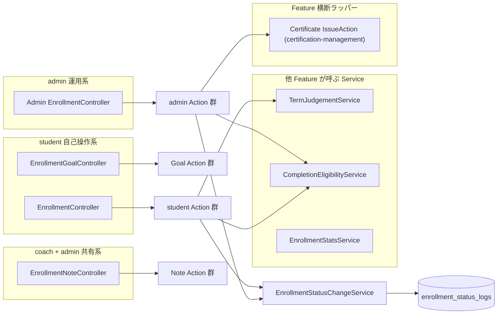

### 受講登録（student 自己登録）

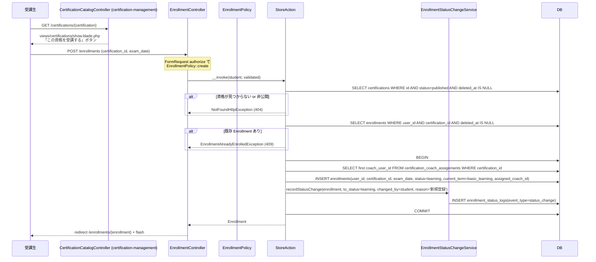

### admin 手動割当

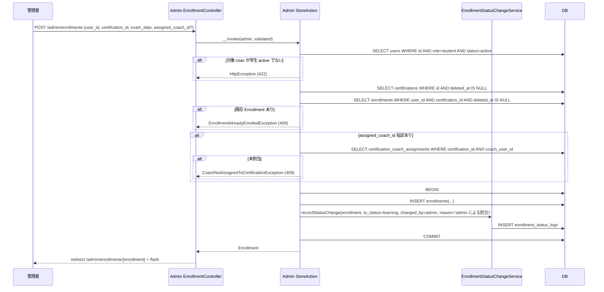

### 受講状態遷移（student の休止 / 再開）

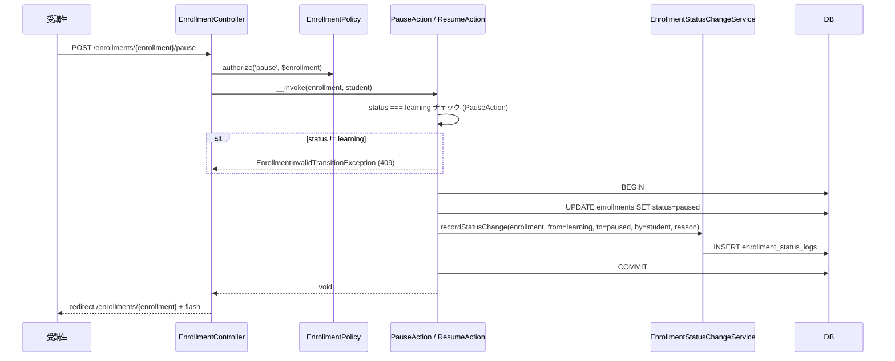

### ターム再計算（mock-exam Feature からの呼出）

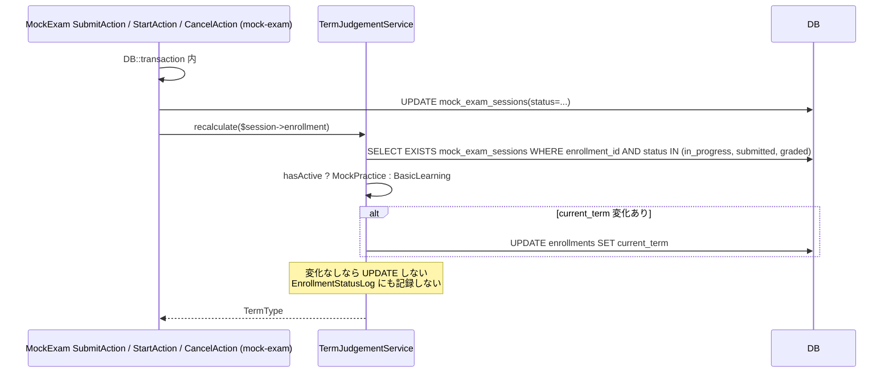

### 修了申請承認フロー（受講生申請 → admin 承認 → Certificate 発行）

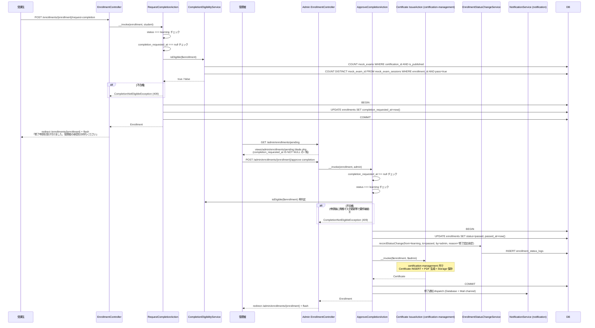

### 試験日超過の自動失敗（Schedule Command）

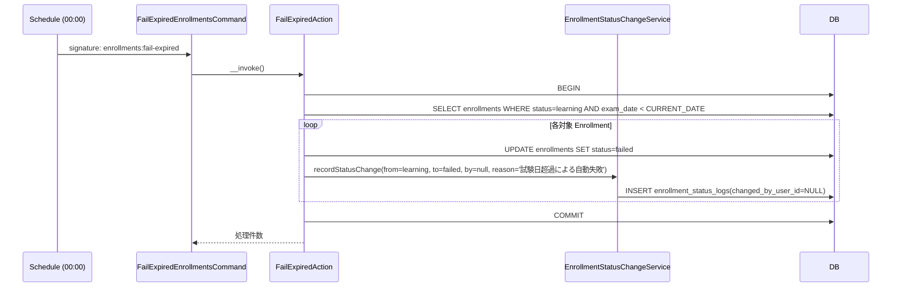

> `paused` 状態の Enrollment は対象外（受講生意思の優先、REQ-enrollment-101）。

### 個人目標 CRUD + 達成マーク

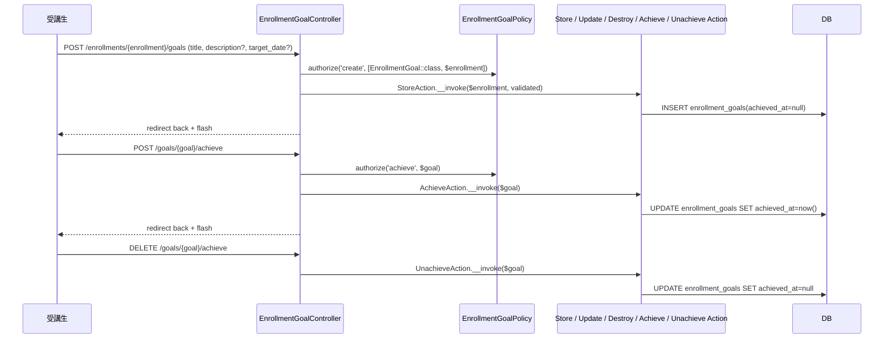

### コーチ用受講生メモ CRUD

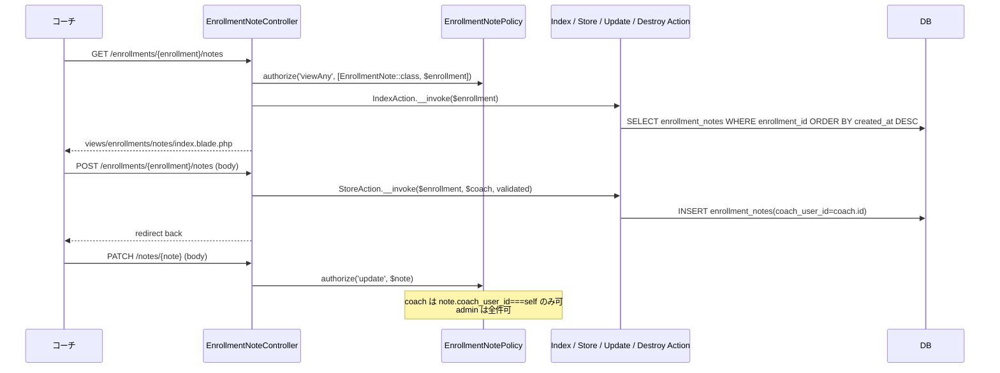

## データモデル

### Eloquent モデル一覧

- **`Enrollment`** — 受講生 × 資格 中間テーブル。`HasUlids` + `HasFactory` + `SoftDeletes`。`belongsTo(User::class, 'user_id', 'student')` / `belongsTo(Certification::class)` / `belongsTo(User::class, 'assigned_coach_id', 'assignedCoach')` / `hasMany(EnrollmentGoal::class)` / `hasMany(EnrollmentNote::class)` / `hasMany(EnrollmentStatusLog::class)` / `hasMany(MockExamSession::class)`（[[mock-exam]] 側で逆も定義）/ `hasOne(Certificate::class)`（[[certification-management]] 側で逆も定義）。スコープ: `scopeLearning()` / `scopePending()`（`completion_requested_at IS NOT NULL`）/ `scopeOfStudent(User $student)` / `scopeOfCoach(User $coach)`。
- **`EnrollmentGoal`** — 個人目標。`HasUlids` + `HasFactory` + `SoftDeletes`。`belongsTo(Enrollment::class)`。スコープ: `scopeAchieved()` / `scopeActive()`。
- **`EnrollmentNote`** — コーチ用受講生メモ。`HasUlids` + `HasFactory` + `SoftDeletes`。`belongsTo(Enrollment::class)` / `belongsTo(User::class, 'coach_user_id', 'coach')`。
- **`EnrollmentStatusLog`** — 状態遷移 / コーチ変更履歴。`HasUlids` + `HasFactory`。SoftDeletes 非採用（履歴は不可逆、INSERT only / UPDATE 禁止）。`belongsTo(Enrollment::class)` / `belongsTo(User::class, 'changed_by_user_id', 'changedBy')->withTrashed()` / `belongsTo(User::class, 'from_coach_id', 'fromCoach')->withTrashed()` / `belongsTo(User::class, 'to_coach_id', 'toCoach')->withTrashed()`。

### ER 図

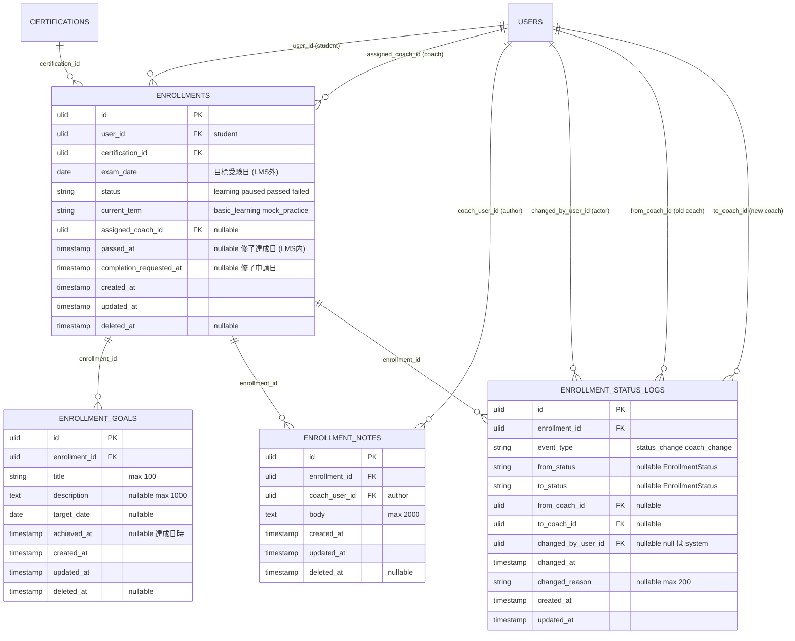

> `USERS` への複数 FK は Mermaid の制約で複数行に分けて記述。実体はそれぞれ独立した FK カラム（`assigned_coach_id` / `coach_user_id` / `changed_by_user_id` / `from_coach_id` / `to_coach_id`）。

### 主要カラム + Enum

すべての Enum は backed string（case 名は PascalCase、backed value は snake_case の対応関係）で定義する。

| Model | Enum | case 名 ⇔ backed value | 日本語ラベル |
|---|---|---|---|
| `Enrollment.status` | `EnrollmentStatus` | `Learning` = `'learning'` / `Paused` = `'paused'` / `Passed` = `'passed'` / `Failed` = `'failed'` | `学習中` / `休止中` / `修了` / `不合格` |
| `Enrollment.current_term` | `TermType` | `BasicLearning` = `'basic_learning'` / `MockPractice` = `'mock_practice'` | `基礎ターム` / `実践ターム` |
| `EnrollmentStatusLog.event_type` | `EnrollmentLogEventType` | `StatusChange` = `'status_change'` / `CoachChange` = `'coach_change'` | `状態変更` / `コーチ変更` |
| `EnrollmentStatusLog.from_status` / `to_status` | `EnrollmentStatus`（共用） | 同上 | 同上 |

### インデックス・制約

`enrollments`:
- `(user_id, certification_id)`: UNIQUE INDEX（同一受講生 × 同一資格の重複登録防止、ただし SoftDelete 復活時のため `deleted_at IS NULL` 部分 UNIQUE を Action 側事前検査で担保）
- `(user_id, status)`: 複合 INDEX（受講生の受講中資格一覧の高速化）
- `(assigned_coach_id, status)`: 複合 INDEX（コーチダッシュボードの担当受講生一覧の高速化）
- `(status, exam_date)`: 複合 INDEX（`enrollments:fail-expired` Schedule Command で `WHERE status=learning AND exam_date < CURRENT_DATE` を高速化）
- `deleted_at`: 単体 INDEX（SoftDelete 除外を高速化）
- `user_id`: 外部キー（`->constrained('users')->restrictOnDelete()` — Certify は SoftDelete 標準で物理削除しないため restrict）
- `certification_id`: 外部キー（`->constrained('certifications')->restrictOnDelete()`）
- `assigned_coach_id`: 外部キー（`->nullable()->constrained('users')->nullOnDelete()` — coach が将来物理削除される場合は null へ。実運用では SoftDelete のため発火しない）

`enrollment_goals`:
- `enrollment_id`: 外部キー（`->constrained('enrollments')->cascadeOnDelete()` — Enrollment 物理削除時に cascade、ただし通常は SoftDelete なので発火しない）
- `(enrollment_id, achieved_at)`: 複合 INDEX（達成 / 未達成の絞り込みを高速化）
- `deleted_at`: 単体 INDEX

`enrollment_notes`:
- `enrollment_id`: 外部キー（`->constrained('enrollments')->cascadeOnDelete()`）
- `coach_user_id`: 外部キー（`->constrained('users')->restrictOnDelete()`）
- `(enrollment_id, created_at)`: 複合 INDEX（時系列降順の高速化）
- `deleted_at`: 単体 INDEX

`enrollment_status_logs`:
- `enrollment_id`: 外部キー（`->constrained('enrollments')->cascadeOnDelete()`）
- `changed_by_user_id`: 外部キー（`->nullable()->constrained('users')->restrictOnDelete()` — null はシステム自動）
- `from_coach_id` / `to_coach_id`: 外部キー（`->nullable()->constrained('users')->restrictOnDelete()`）
- `(enrollment_id, changed_at)`: 複合 INDEX（履歴時系列クエリ）
- soft delete カラムなし（履歴は不可逆、`User`-`UserStatusLog` の流儀と整合、[[user-management]] 準拠）

## 状態遷移

`product.md`「## ステータス遷移」B / C に厳格準拠。

### Enrollment.status

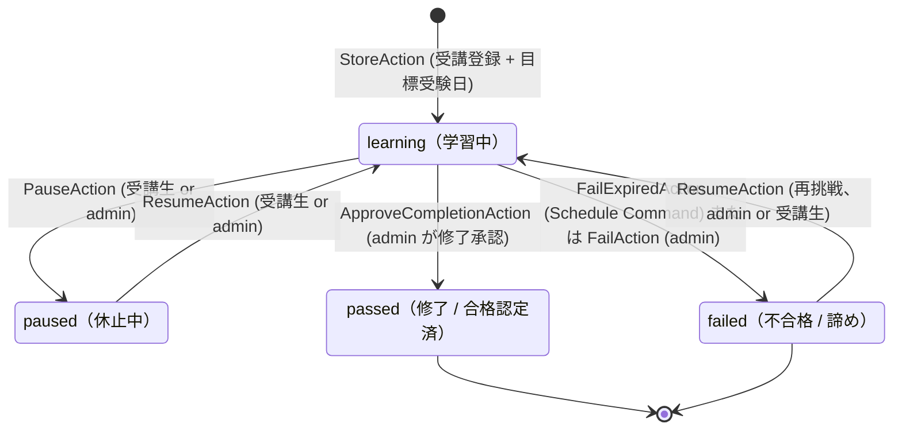

> `paused` から `failed` への直接遷移、`failed` から `paused` への直接遷移は提供しない（`learning` を経由）。`passed` からの遷移は一切なし（修了取消はスコープ外、`product.md` の `[*]` 終端と整合）。

### Enrollment.current_term

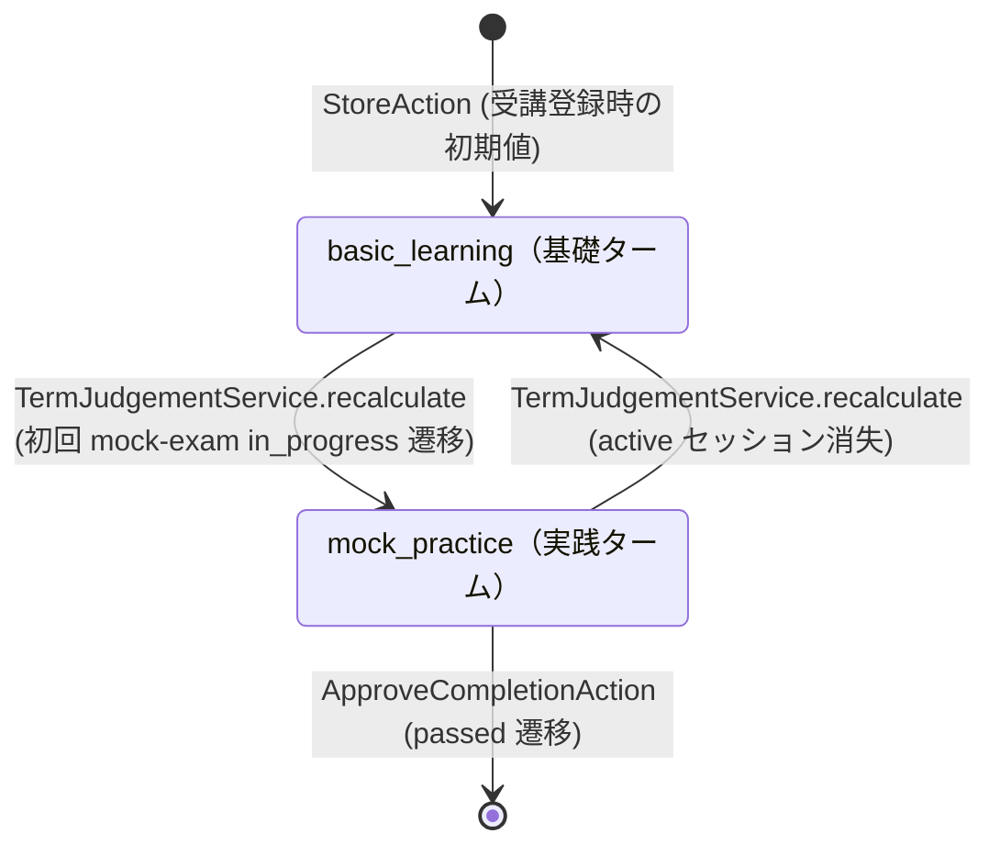

> 切替トリガはすべて [[mock-exam]] の MockExamSession 状態変化（StartAction / SubmitAction / CancelAction）。本 Feature は `TermJudgementService` のロジックを所有するだけで、起動側は [[mock-exam]]。

### completion_requested_at（修了申請中の補助状態）

`status` カラムを増やさず、`completion_requested_at` の null/非null で「申請中」を表現する。

| status | completion_requested_at | 意味 |
|---|---|---|
| `learning` | `null` | 通常学習中 |
| `learning` | `非null` | 修了申請中（admin 承認待ち） |
| `passed` | `非null` | 承認済（過去値として保持）|
| `paused` | `null` | 休止中（申請不可、申請後の休止は仕様上発生させない） |
| `failed` | `null` | 不合格 |

## コンポーネント

### Controller

ロール別 namespace（structure.md の規約は「使わない」とあるが、admin プレフィックス URL の集約のため admin 専用 Controller は `Admin\` namespace に配置する。これは [[certification-management]] / [[user-management]] でも `Admin\` namespace ではなく `/admin/` URL prefix で運用しており、本 Feature でも URL prefix のみで分離する。Controller の **クラス自体は単一 namespace**）。

- **`EnrollmentController`** — student 用受講登録 / 状態切替 / 修了申請（受講生からアクセス）
  - `index(IndexAction)` — 受講中資格一覧
  - `show(Enrollment $enrollment, ShowAction)` — 詳細
  - `store(StoreRequest, StoreAction)` — 自己登録
  - `pause(Enrollment $enrollment, PauseAction)` — 休止
  - `resume(Enrollment $enrollment, ResumeAction)` — 再開
  - `requestCompletion(Enrollment $enrollment, RequestCompletionAction)` — 修了申請
  - `cancelCompletionRequest(Enrollment $enrollment, CancelCompletionRequestAction)` — 修了申請取消

- **`Admin\EnrollmentController`** — admin 用全件 CRUD + 状態強制更新 + 修了承認
  - `index(IndexRequest, AdminIndexAction)` — 全件一覧（フィルタ含む）
  - `pending(PendingAction)` — 修了申請待ち一覧（`completion_requested_at IS NOT NULL` のフィルタ専用画面）
  - `show(Enrollment $enrollment, AdminShowAction)` — 詳細
  - `store(AdminStoreRequest, AdminStoreAction)` — 強制割当
  - `update(Enrollment $enrollment, AdminUpdateRequest, AdminUpdateAction)` — `exam_date` 等の更新
  - `destroy(Enrollment $enrollment, AdminDestroyAction)` — SoftDelete
  - `pause(Enrollment $enrollment, AdminPauseAction)` — 強制休止
  - `resume(Enrollment $enrollment, AdminResumeAction)` — 強制再開
  - `fail(Enrollment $enrollment, AdminFailRequest, AdminFailAction)` — 強制失敗マーク
  - `assignCoach(Enrollment $enrollment, AssignCoachRequest, AssignCoachAction)` — コーチ変更
  - `approveCompletion(Enrollment $enrollment, ApproveCompletionAction)` — 修了承認

- **`EnrollmentGoalController`** — 受講生による自身の Enrollment 配下の目標 CRUD + 達成マーク
  - `store(Enrollment $enrollment, StoreRequest, StoreAction)` — 追加
  - `update(EnrollmentGoal $goal, UpdateRequest, UpdateAction)` — 編集
  - `destroy(EnrollmentGoal $goal, DestroyAction)` — 削除
  - `achieve(EnrollmentGoal $goal, AchieveAction)` — 達成マーク付与
  - `unachieve(EnrollmentGoal $goal, UnachieveAction)` — 達成マーク取消

- **`EnrollmentNoteController`** — coach / admin による Enrollment 配下のノート CRUD
  - `index(Enrollment $enrollment, IndexAction)` — 一覧
  - `store(Enrollment $enrollment, StoreRequest, StoreAction)` — 追加
  - `update(EnrollmentNote $note, UpdateRequest, UpdateAction)` — 編集
  - `destroy(EnrollmentNote $note, DestroyAction)` — 削除

### Action（UseCase）

Entity 単位ディレクトリで配置。各 Action は単一トランザクション境界、`__invoke()` を主とする。Controller method 名と Action クラス名は完全一致（`backend-usecases.md` 規約）。admin 用 Action は `App\UseCases\Admin\Enrollment\` に配置し、admin context 専用ガード（自己操作可 / 強制遷移許容など）を持たせる。

#### `App\UseCases\Enrollment\IndexAction`

```php
namespace App\UseCases\Enrollment;

class IndexAction
{
    public function __invoke(User $student): Collection;
}
```

責務: ログイン受講生の Enrollment 一覧を `with(['certification.category', 'assignedCoach', 'goals' => fn ($q) => $q->whereNull('achieved_at')])->ofStudent($student)->orderBy('current_term')->orderBy('exam_date')->get()` で取得。試験日カウントダウン日数 / 進捗率は Blade 側 / `EnrollmentStatsService` で算出。

#### `App\UseCases\Enrollment\ShowAction`

```php
class ShowAction
{
    public function __invoke(Enrollment $enrollment): Enrollment;
}
```

責務: `with(['certification.category', 'assignedCoach', 'goals' => fn ($q) => $q->orderByDesc('created_at'), 'statusLogs.changedBy' => fn ($q) => $q->withTrashed()])->loadCount(['goals as achieved_goals_count' => fn ($q) => $q->whereNotNull('achieved_at')])` で eager load。

#### `App\UseCases\Enrollment\StoreAction`

```php
class StoreAction
{
    public function __construct(private EnrollmentStatusChangeService $statusChanger) {}

    /**
     * @throws EnrollmentAlreadyEnrolledException 既存 Enrollment あり
     */
    public function __invoke(User $student, array $validated): Enrollment;
}
```

責務: (1) 対象資格の `published` チェック、(2) `(user_id, certification_id, deleted_at IS NULL)` 重複検査、(3) 当該資格の `certification_coach_assignments` から先頭 1 名を `assigned_coach_id` に自動セット（割当ゼロなら null）、(4) Enrollment INSERT、(5) `EnrollmentStatusChangeService::recordStatusChange(enrollment, to_status: Learning, changedBy: student, reason: '新規登録')`。すべて `DB::transaction()` でラップ。

#### `App\UseCases\Enrollment\PauseAction`

```php
class PauseAction
{
    public function __construct(private EnrollmentStatusChangeService $statusChanger) {}

    /**
     * @throws EnrollmentInvalidTransitionException status != learning
     * @throws EnrollmentAlreadyPassedException status === passed
     */
    public function __invoke(Enrollment $enrollment, User $actor, ?string $reason = null): Enrollment;
}
```

責務: (1) status === learning ガード（passed / failed / paused からは不可）、(2) `status = paused` UPDATE、(3) `recordStatusChange(from: Learning, to: Paused, changedBy: actor, reason)`。`$actor` は通常 student（自己操作）または admin（強制操作）。

#### `App\UseCases\Enrollment\ResumeAction`

```php
class ResumeAction
{
    public function __construct(private EnrollmentStatusChangeService $statusChanger) {}

    /**
     * @throws EnrollmentInvalidTransitionException status != paused かつ status != failed
     * @throws EnrollmentAlreadyPassedException status === passed
     */
    public function __invoke(Enrollment $enrollment, User $actor, ?string $reason = null): Enrollment;
}
```

責務: (1) `status IN (paused, failed)` ガード、(2) `status = learning` UPDATE、(3) `recordStatusChange(from: 旧status, to: Learning, changedBy: actor, reason)`。failed からの再挑戦も同 Action で扱う（再挑戦理由は `reason` に書く）。

#### `App\UseCases\Enrollment\RequestCompletionAction`

```php
class RequestCompletionAction
{
    public function __construct(private CompletionEligibilityService $eligibility) {}

    /**
     * @throws EnrollmentNotLearningException status != learning
     * @throws CompletionAlreadyRequestedException completion_requested_at !== null
     * @throws CompletionNotEligibleException 公開模試すべて合格 未達成
     */
    public function __invoke(Enrollment $enrollment, User $student): Enrollment;
}
```

責務: (1) status === learning ガード、(2) completion_requested_at === null ガード、(3) `CompletionEligibilityService::isEligible($enrollment)` 検証、(4) `completion_requested_at = now()` UPDATE。`EnrollmentStatusLog` への記録はしない（`status` 変化なし、完了承認時にまとめて記録）。

#### `App\UseCases\Enrollment\CancelCompletionRequestAction`

```php
class CancelCompletionRequestAction
{
    /**
     * @throws CompletionNotRequestedException completion_requested_at === null
     * @throws EnrollmentAlreadyPassedException status === passed
     */
    public function __invoke(Enrollment $enrollment, User $student): Enrollment;
}
```

責務: (1) completion_requested_at !== null && status === learning ガード、(2) `completion_requested_at = null` UPDATE。EnrollmentStatusLog 記録なし。

#### `App\UseCases\Admin\Enrollment\IndexAction`

```php
namespace App\UseCases\Admin\Enrollment;

class IndexAction
{
    public function __invoke(array $filter, int $perPage = 20): LengthAwarePaginator;
}
```

責務: `Enrollment::query()->with(['student', 'certification.category', 'assignedCoach'])` を起点に、`status` / `certification_id` / `assigned_coach_id` / `keyword`（受講生名 / email 部分一致）でフィルタ、`?withTrashed=true` 時のみ `withTrashed()`、並び順 `ORDER BY FIELD(status, 'learning', 'paused', 'failed', 'passed'), created_at DESC`、`paginate(20)`。

#### `App\UseCases\Admin\Enrollment\PendingAction`

```php
class PendingAction
{
    public function __invoke(int $perPage = 20): LengthAwarePaginator;
}
```

責務: `Enrollment::query()->with(['student', 'certification', 'assignedCoach'])->pending()->orderBy('completion_requested_at')->paginate(20)` を返す。`pending()` スコープは `whereNotNull('completion_requested_at')` + `where('status', Learning)`。

#### `App\UseCases\Admin\Enrollment\StoreAction`

```php
class StoreAction
{
    public function __construct(private EnrollmentStatusChangeService $statusChanger) {}

    /**
     * @throws EnrollmentAlreadyEnrolledException 既存 Enrollment あり
     * @throws CoachNotAssignedToCertificationException assigned_coach_id が当該資格未担当
     */
    public function __invoke(User $admin, array $validated): Enrollment;
}
```

責務: (1) 受講生・資格・コーチの状態検証、(2) 重複検査、(3) コーチ担当検査、(4) Enrollment INSERT、(5) `recordStatusChange(to: Learning, changedBy: admin, reason: 'admin による割当' or 入力理由)`。

#### `App\UseCases\Admin\Enrollment\UpdateAction`

```php
class UpdateAction
{
    /**
     * @throws EnrollmentAlreadyPassedException status === passed
     */
    public function __invoke(Enrollment $enrollment, array $validated): Enrollment;
}
```

責務: (1) status !== passed ガード、(2) `exam_date` UPDATE。`status` / `current_term` / `assigned_coach_id` / `completion_requested_at` / `passed_at` は本 Action で更新不可（各専用 Action へ）。

#### `App\UseCases\Admin\Enrollment\DestroyAction`

```php
class DestroyAction
{
    public function __invoke(Enrollment $enrollment): void;
}
```

責務: SoftDelete（`$enrollment->delete()`）。`EnrollmentStatusLog` への記録は行わない（削除は履歴上の最終状態として `deleted_at` カラムで判別可能）。

#### `App\UseCases\Admin\Enrollment\AssignCoachAction`

```php
class AssignCoachAction
{
    public function __construct(private EnrollmentStatusChangeService $statusChanger) {}

    /**
     * @throws CoachNotAssignedToCertificationException 新コーチが当該資格未担当
     */
    public function __invoke(Enrollment $enrollment, ?string $newCoachUserId, User $admin, ?string $reason = null): Enrollment;
}
```

責務: (1) `$newCoachUserId !== null` の場合、`certification_coach_assignments` で担当検査、(2) `assigned_coach_id` UPDATE、(3) `recordCoachChange(from_coach_id: 旧, to_coach_id: 新, changedBy: admin, reason)`。`null` 指定はコーチ解除を意味し、`to_coach_id = null` でログ記録。

#### `App\UseCases\Admin\Enrollment\FailAction`

```php
class FailAction
{
    public function __construct(private EnrollmentStatusChangeService $statusChanger) {}

    /**
     * @throws EnrollmentInvalidTransitionException status != learning
     * @throws EnrollmentAlreadyPassedException status === passed
     */
    public function __invoke(Enrollment $enrollment, User $admin, ?string $reason = null): Enrollment;
}
```

責務: (1) `status === learning` ガード（`product.md` state diagram B 準拠、`paused` からの直接 `failed` 遷移は提供しない、必要なら `learning` を経由）、(2) `status = failed` UPDATE、(3) `recordStatusChange(from: Learning, to: Failed, changedBy: admin, reason)`。

#### `App\UseCases\Admin\Enrollment\ApproveCompletionAction`

```php
class ApproveCompletionAction
{
    public function __construct(
        private CompletionEligibilityService $eligibility,
        private EnrollmentStatusChangeService $statusChanger,
        private \App\UseCases\Certificate\IssueAction $issueCertificate,
        private \App\UseCases\Notification\NotifyCompletionApprovedAction $notifyCompletion,
    ) {}

    /**
     * @throws CompletionNotRequestedException completion_requested_at === null
     * @throws EnrollmentNotLearningException status != learning
     * @throws CompletionNotEligibleException 公開模試すべて合格 未達成
     */
    public function __invoke(Enrollment $enrollment, User $admin): Enrollment;
}
```

責務: (1) `completion_requested_at !== null && status === learning` ガード、(2) `CompletionEligibilityService::isEligible($enrollment)` 再判定（申請後に資格マスタ更新等で要件破綻していないか確認）、(3) `DB::transaction()` 内で `status = passed` / `passed_at = now()` UPDATE、(4) `EnrollmentStatusChangeService::recordStatusChange(from: Learning, to: Passed, changedBy: admin, reason: '修了認定承認')`、(5) [[certification-management]] の `Certificate\IssueAction` を DI して呼ぶ（Feature 横断ラッパー方式、`backend-usecases.md`「Feature 間連携のラッパー Action」参照）、(6) `DB::afterCommit(fn () => ($this->notifyCompletion)($enrollment, $certificate))` でトランザクション commit 後に [[notification]] へ通知 dispatch（admin 宛通知は発火しない、受講生のみ）。

#### `App\UseCases\Admin\Enrollment\PauseAction` / `ResumeAction`

```php
namespace App\UseCases\Admin\Enrollment;

class PauseAction
{
    public function __construct(
        private \App\UseCases\Enrollment\PauseAction $base,
    ) {}

    public function __invoke(Enrollment $enrollment, User $admin, ?string $reason = null): Enrollment
    {
        return ($this->base)($enrollment, $admin, $reason);
    }
}
```

責務: student と admin の挙動差分を持たないため、内部で `App\UseCases\Enrollment\PauseAction` を DI してそのまま呼ぶラッパー。`reason` は admin 入力値、actor は admin で記録される。`ResumeAction` も同パターン。

> Why ラッパー: 「Controller method 名 = Action クラス名」規約と「Controller 単位の DI 整理」を両立するため、`Admin\EnrollmentController::pause` は `Admin\Enrollment\PauseAction` を DI する（`Enrollment\PauseAction` を直接 DI しない、`backend-usecases.md`「Feature 間連携のラッパー Action」と同流儀の Controller 整合性）。

#### `App\UseCases\Admin\Enrollment\FailExpiredAction`

```php
class FailExpiredAction
{
    public function __construct(private EnrollmentStatusChangeService $statusChanger) {}

    public function __invoke(): int;
}
```

責務: (1) `Enrollment::where('status', Learning)->whereDate('exam_date', '<', today())->lockForUpdate()->get()` を取得、(2) 各 Enrollment を `status = failed` UPDATE、(3) `recordStatusChange(from: Learning, to: Failed, changedBy: null, reason: '試験日超過による自動失敗')`。すべて `DB::transaction()` でラップ、処理件数を return。

#### `App\UseCases\EnrollmentGoal\*`

```php
namespace App\UseCases\EnrollmentGoal;

class StoreAction
{
    public function __invoke(Enrollment $enrollment, array $validated): EnrollmentGoal;
}

class UpdateAction
{
    public function __invoke(EnrollmentGoal $goal, array $validated): EnrollmentGoal;
}

class DestroyAction
{
    public function __invoke(EnrollmentGoal $goal): void;  // SoftDelete
}

class AchieveAction
{
    public function __invoke(EnrollmentGoal $goal): EnrollmentGoal;  // achieved_at=now()
}

class UnachieveAction
{
    public function __invoke(EnrollmentGoal $goal): EnrollmentGoal;  // achieved_at=null
}
```

責務: 各々 1 文 UPDATE / INSERT / DELETE のため Action は薄く、`DB::transaction()` も状態変更を伴う Update / Achieve のみで囲む（Service 経由なし）。Policy が認可、Action は整合性チェックなし。

#### `App\UseCases\EnrollmentNote\*`

```php
namespace App\UseCases\EnrollmentNote;

class IndexAction
{
    public function __invoke(Enrollment $enrollment): Collection;  // with('coach')->orderByDesc('created_at')->get()
}

class StoreAction
{
    public function __invoke(Enrollment $enrollment, User $author, array $validated): EnrollmentNote;
    // coach_user_id = author.id を記録
}

class UpdateAction
{
    public function __invoke(EnrollmentNote $note, array $validated): EnrollmentNote;
}

class DestroyAction
{
    public function __invoke(EnrollmentNote $note): void;  // SoftDelete
}
```

責務: 各々薄い。`StoreAction` は `coach_user_id` に呼出元 actor の id をセット（coach 操作なら coach.id、admin 操作なら admin.id、admin が代理書き込みも許容）。

### Service

`app/Services/`（フラット配置、structure.md 準拠）:

#### `EnrollmentStatusChangeService`

```php
namespace App\Services;

class EnrollmentStatusChangeService
{
    public function recordStatusChange(
        Enrollment $enrollment,
        EnrollmentStatus $newStatus,
        ?User $changedBy,
        ?string $reason = null,
    ): EnrollmentStatusLog {
        return $enrollment->statusLogs()->create([
            'event_type' => EnrollmentLogEventType::StatusChange,
            'from_status' => $enrollment->getOriginal('status'),
            'to_status' => $newStatus,
            'changed_by_user_id' => $changedBy?->id,
            'changed_at' => now(),
            'changed_reason' => $reason,
        ]);
    }

    public function recordCoachChange(
        Enrollment $enrollment,
        ?string $fromCoachId,
        ?string $toCoachId,
        User $admin,
        ?string $reason = null,
    ): EnrollmentStatusLog {
        return $enrollment->statusLogs()->create([
            'event_type' => EnrollmentLogEventType::CoachChange,
            'from_coach_id' => $fromCoachId,
            'to_coach_id' => $toCoachId,
            'changed_by_user_id' => $admin->id,
            'changed_at' => now(),
            'changed_reason' => $reason,
        ]);
    }
}
```

責務: INSERT のみのステートレス Service（[[user-management]] の `UserStatusChangeService` 流儀）。`DB::transaction()` は呼び出し側 Action のスコープに乗る。Notification の送信はしない。`recordStatusChange` の `from_status` は **呼び出し側が UPDATE する前に呼ぶ前提**（呼出順: Service → UPDATE か、UPDATE → Service なら明示的に `$enrollment->getOriginal('status')` を引く）。本契約では「Action 内で UPDATE 前に呼ぶ」運用に統一（NFR-enrollment-005）。

#### `TermJudgementService`

```php
namespace App\Services;

class TermJudgementService
{
    public function recalculate(Enrollment $enrollment): TermType
    {
        $hasActiveMock = $enrollment->mockExamSessions()
            ->whereIn('status', [
                MockExamSessionStatus::InProgress,
                MockExamSessionStatus::Submitted,
                MockExamSessionStatus::Graded,
            ])
            ->exists();

        $newTerm = $hasActiveMock ? TermType::MockPractice : TermType::BasicLearning;

        if ($enrollment->current_term !== $newTerm) {
            $enrollment->update(['current_term' => $newTerm]);
        }

        return $newTerm;
    }

    /**
     * invocable ラッパー。`($termJudgement)($enrollment)` で `recalculate` を呼ぶための糖衣。
     * [[mock-exam]] の Start / Submit / Cancel Action で `($this->termJudgement)($session->enrollment)` 形式を許容する。
     */
    public function __invoke(Enrollment $enrollment): TermType
    {
        return $this->recalculate($enrollment);
    }
}
```

責務: [[mock-exam]] の StartAction / SubmitAction / CancelAction の各 transaction 内で呼ばれる。`EnrollmentStatusLog` には記録しない（高頻度操作、REQ-enrollment-064）。`__invoke` は `recalculate` の薄いラッパーで、呼出側の構文選択（メソッド呼出 vs invocable）を柔軟にする。

#### `CompletionEligibilityService`

```php
namespace App\Services;

class CompletionEligibilityService
{
    public function isEligible(Enrollment $enrollment): bool
    {
        $publishedCount = MockExam::query()
            ->where('certification_id', $enrollment->certification_id)
            ->where('is_published', true)
            ->count();

        if ($publishedCount === 0) {
            return false;  // 公開模試が 1 件もない資格は修了申請不可
        }

        $passedCount = MockExamSession::query()
            ->where('enrollment_id', $enrollment->id)
            ->where('pass', true)
            ->distinct('mock_exam_id')
            ->count('mock_exam_id');

        return $publishedCount === $passedCount;
    }
}
```

責務: [[dashboard]] の修了申請ボタン活性判定と本 Feature の `RequestCompletionAction` / `ApproveCompletionAction` から呼ばれる。`MockExam` / `MockExamSession` は [[mock-exam]] が定義する Model、本 Service は読み取りのみ。

#### `EnrollmentStatsService`

```php
namespace App\Services;

class EnrollmentStatsService
{
    public function adminKpi(): array
    {
        return [
            'learning_count' => Enrollment::learning()->count(),
            'paused_count' => Enrollment::where('status', EnrollmentStatus::Paused)->count(),
            'passed_count' => Enrollment::where('status', EnrollmentStatus::Passed)->count(),
            'failed_count' => Enrollment::where('status', EnrollmentStatus::Failed)->count(),
            'pending_count' => Enrollment::pending()->count(),
            'by_certification' => Enrollment::query()
                ->select('certification_id', DB::raw('COUNT(*) as count'))
                ->where('status', EnrollmentStatus::Learning)
                ->groupBy('certification_id')
                ->get(),
        ];
    }

    // studentDashboard メソッドは削除（dashboard 側で各 Service を直接消費する設計に統一）
}
```

責務: admin 用 KPI のみ公開する。本 Feature の Controller からは直接利用しない（[[dashboard]] が消費）。受講生 dashboard 用集計は [[dashboard]] の `FetchStudentDashboardAction` が各 Service（ProgressService / StreakService / LearningHourTargetService / WeaknessAnalysisService / CompletionEligibilityService）を直接 DI して構築する。

### Policy

`app/Policies/`:

#### `EnrollmentPolicy`

```php
class EnrollmentPolicy
{
    public function viewAny(User $auth): bool
    {
        return in_array($auth->role, [UserRole::Admin, UserRole::Coach, UserRole::Student]);
    }

    public function view(User $auth, Enrollment $enrollment): bool
    {
        return match ($auth->role) {
            UserRole::Admin => true,
            UserRole::Coach => $enrollment->assigned_coach_id === $auth->id,
            UserRole::Student => $enrollment->user_id === $auth->id,
        };
    }

    public function create(User $auth): bool
    {
        return in_array($auth->role, [UserRole::Admin, UserRole::Student]);
    }

    public function update(User $auth, Enrollment $enrollment): bool
    {
        return $auth->role === UserRole::Admin;
    }

    public function delete(User $auth, Enrollment $enrollment): bool
    {
        return $auth->role === UserRole::Admin;
    }

    public function pause(User $auth, Enrollment $enrollment): bool
    {
        return $this->canChangeStatus($auth, $enrollment);
    }

    public function resume(User $auth, Enrollment $enrollment): bool
    {
        return $this->canChangeStatus($auth, $enrollment);
    }

    public function requestCompletion(User $auth, Enrollment $enrollment): bool
    {
        return $auth->role === UserRole::Student && $enrollment->user_id === $auth->id;
    }

    public function cancelCompletionRequest(User $auth, Enrollment $enrollment): bool
    {
        return $auth->role === UserRole::Student && $enrollment->user_id === $auth->id;
    }

    public function approveCompletion(User $auth, Enrollment $enrollment): bool
    {
        return $auth->role === UserRole::Admin;
    }

    public function fail(User $auth, Enrollment $enrollment): bool
    {
        return $auth->role === UserRole::Admin;
    }

    public function assignCoach(User $auth, Enrollment $enrollment): bool
    {
        return $auth->role === UserRole::Admin;
    }

    private function canChangeStatus(User $auth, Enrollment $enrollment): bool
    {
        return match ($auth->role) {
            UserRole::Admin => true,
            UserRole::Student => $enrollment->user_id === $auth->id,
            default => false,
        };
    }
}
```

#### `EnrollmentGoalPolicy`

```php
class EnrollmentGoalPolicy
{
    public function viewAny(User $auth, Enrollment $enrollment): bool
    {
        return match ($auth->role) {
            UserRole::Admin => true,
            UserRole::Coach => $enrollment->assigned_coach_id === $auth->id,
            UserRole::Student => $enrollment->user_id === $auth->id,
        };
    }

    public function view(User $auth, EnrollmentGoal $goal): bool
    {
        return $this->viewAny($auth, $goal->enrollment);
    }

    public function create(User $auth, Enrollment $enrollment): bool
    {
        return $auth->role === UserRole::Student && $enrollment->user_id === $auth->id;
    }

    public function update(User $auth, EnrollmentGoal $goal): bool
    {
        return $auth->role === UserRole::Student && $goal->enrollment->user_id === $auth->id;
    }

    public function delete(User $auth, EnrollmentGoal $goal): bool
    {
        return $this->update($auth, $goal);
    }

    public function achieve(User $auth, EnrollmentGoal $goal): bool
    {
        return $this->update($auth, $goal);
    }
}
```

#### `EnrollmentNotePolicy`

```php
class EnrollmentNotePolicy
{
    public function viewAny(User $auth, Enrollment $enrollment): bool
    {
        return match ($auth->role) {
            UserRole::Admin => true,
            UserRole::Coach => $enrollment->assigned_coach_id === $auth->id,
            UserRole::Student => false,  // 受講生は閲覧不可
        };
    }

    public function create(User $auth, Enrollment $enrollment): bool
    {
        return match ($auth->role) {
            UserRole::Admin => true,
            UserRole::Coach => $enrollment->assigned_coach_id === $auth->id,
            UserRole::Student => false,
        };
    }

    public function update(User $auth, EnrollmentNote $note): bool
    {
        return match ($auth->role) {
            UserRole::Admin => true,
            UserRole::Coach => $note->coach_user_id === $auth->id,
            UserRole::Student => false,
        };
    }

    public function delete(User $auth, EnrollmentNote $note): bool
    {
        return $this->update($auth, $note);
    }
}
```

> Policy は「ロール + 当事者 / 担当」観点のみで判定。状態整合性チェック（`status == learning` ガード等）は **Action 内ドメイン例外** で表現する（[[user-management]] / [[certification-management]] と同流儀、`backend-policies.md` の役割分担に整合）。

### FormRequest

`app/Http/Requests/Enrollment/`:

| FormRequest | rules | authorize |
|---|---|---|
| `StoreRequest` | `certification_id: required ulid exists:certifications,id` / `exam_date: required date after:today` | `can('create', Enrollment::class)` |
| `PauseRequest` / `ResumeRequest` | `reason: nullable string max:200` | `can('pause' or 'resume', $this->route('enrollment'))` |
| `RequestCompletionRequest` | （なし） | `can('requestCompletion', $this->route('enrollment'))` |

`app/Http/Requests/Admin/Enrollment/`:

| FormRequest | rules | authorize |
|---|---|---|
| `IndexRequest` | `status: nullable in:learning,paused,passed,failed` / `certification_id: nullable ulid` / `assigned_coach_id: nullable ulid` / `keyword: nullable string max:100` / `with_trashed: nullable boolean` / `page: nullable integer min:1` | `can('viewAny', Enrollment::class)` |
| `StoreRequest` | `user_id: required ulid exists:users,id` / `certification_id: required ulid exists:certifications,id` / `exam_date: required date after:today` / `assigned_coach_id: nullable ulid exists:users,id` / `reason: nullable string max:200` | `can('create', Enrollment::class)` |
| `UpdateRequest` | `exam_date: required date` | `can('update', $this->route('enrollment'))` |
| `PauseRequest` / `ResumeRequest` | `reason: nullable string max:200` | `can('pause' or 'resume', $this->route('enrollment'))` |
| `FailRequest` | `reason: nullable string max:200` | `can('fail', $this->route('enrollment'))` |
| `AssignCoachRequest` | `coach_user_id: nullable ulid exists:users,id` / `reason: nullable string max:200` | `can('assignCoach', $this->route('enrollment'))` |

`app/Http/Requests/EnrollmentGoal/`:

| FormRequest | rules | authorize |
|---|---|---|
| `StoreRequest` | `title: required string max:100` / `description: nullable string max:1000` / `target_date: nullable date` | `can('create', [EnrollmentGoal::class, $this->route('enrollment')])` |
| `UpdateRequest` | StoreRequest 同等 | `can('update', $this->route('goal'))` |

`app/Http/Requests/EnrollmentNote/`:

| FormRequest | rules | authorize |
|---|---|---|
| `StoreRequest` | `body: required string max:2000` | `can('create', [EnrollmentNote::class, $this->route('enrollment')])` |
| `UpdateRequest` | StoreRequest 同等 | `can('update', $this->route('note'))` |

### Route

`routes/web.php`:

```php
// student / coach / admin が利用する Enrollment 受講生視点（all auth）
Route::middleware('auth')->group(function () {
    // 受講生用 自身の Enrollment 操作
    Route::middleware('role:student')->group(function () {
        Route::get('enrollments', [EnrollmentController::class, 'index'])->name('enrollments.index');
        Route::get('enrollments/{enrollment}', [EnrollmentController::class, 'show'])->name('enrollments.show');
        Route::post('enrollments', [EnrollmentController::class, 'store'])->name('enrollments.store');
        Route::post('enrollments/{enrollment}/pause', [EnrollmentController::class, 'pause'])->name('enrollments.pause');
        Route::post('enrollments/{enrollment}/resume', [EnrollmentController::class, 'resume'])->name('enrollments.resume');
        Route::post('enrollments/{enrollment}/completion-request', [EnrollmentController::class, 'requestCompletion'])->name('enrollments.completion-request.store');
        Route::delete('enrollments/{enrollment}/completion-request', [EnrollmentController::class, 'cancelCompletionRequest'])->name('enrollments.completion-request.destroy');

        // 個人目標（dashboard 等の他 Feature と整合させるため `enrollments.goals.*` 名前空間で統一）
        Route::get('enrollments/{enrollment}/goals/create', [EnrollmentGoalController::class, 'create'])->name('enrollments.goals.create');
        Route::post('enrollments/{enrollment}/goals', [EnrollmentGoalController::class, 'store'])->name('enrollments.goals.store');
        Route::get('enrollments/{enrollment}/goals/{goal}/edit', [EnrollmentGoalController::class, 'edit'])->name('enrollments.goals.edit');
        Route::patch('enrollments/{enrollment}/goals/{goal}', [EnrollmentGoalController::class, 'update'])->name('enrollments.goals.update');
        Route::delete('enrollments/{enrollment}/goals/{goal}', [EnrollmentGoalController::class, 'destroy'])->name('enrollments.goals.destroy');
        Route::post('enrollments/{enrollment}/goals/{goal}/achieve', [EnrollmentGoalController::class, 'achieve'])->name('enrollments.goals.achieve');
        Route::delete('enrollments/{enrollment}/goals/{goal}/achieve', [EnrollmentGoalController::class, 'unachieve'])->name('enrollments.goals.unachieve');
    });

    // コーチ / admin 用 EnrollmentNote
    Route::middleware('role:coach,admin')->group(function () {
        Route::get('enrollments/{enrollment}/notes', [EnrollmentNoteController::class, 'index'])->name('notes.index');
        Route::post('enrollments/{enrollment}/notes', [EnrollmentNoteController::class, 'store'])->name('notes.store');
        Route::patch('notes/{note}', [EnrollmentNoteController::class, 'update'])->name('notes.update');
        Route::delete('notes/{note}', [EnrollmentNoteController::class, 'destroy'])->name('notes.destroy');
    });
});

// admin only
Route::middleware(['auth', 'role:admin'])->prefix('admin')->group(function () {
    Route::get('enrollments/pending', [Admin\EnrollmentController::class, 'pending'])->name('admin.enrollments.pending');
    Route::resource('enrollments', Admin\EnrollmentController::class)
        ->parameters(['enrollments' => 'enrollment'])
        ->names('admin.enrollments');
    Route::post('enrollments/{enrollment}/pause', [Admin\EnrollmentController::class, 'pause'])->name('admin.enrollments.pause');
    Route::post('enrollments/{enrollment}/resume', [Admin\EnrollmentController::class, 'resume'])->name('admin.enrollments.resume');
    Route::post('enrollments/{enrollment}/fail', [Admin\EnrollmentController::class, 'fail'])->name('admin.enrollments.fail');
    Route::post('enrollments/{enrollment}/assign-coach', [Admin\EnrollmentController::class, 'assignCoach'])->name('admin.enrollments.assignCoach');
    Route::post('enrollments/{enrollment}/approve-completion', [Admin\EnrollmentController::class, 'approveCompletion'])->name('admin.enrollments.approveCompletion');
});
```

> `Route::resource('enrollments', Admin\EnrollmentController::class)` の前に `pending` を定義するのは、`enrollments/{enrollment}` ルートと URL 衝突を避けるため（ResourceRoutes はあとから定義する）。

### Schedule Command

`app/Console/Commands/Enrollment/FailExpiredEnrollmentsCommand.php`:

- signature: `enrollments:fail-expired`
- handle: `App\UseCases\Admin\Enrollment\FailExpiredAction` を DI して呼ぶだけの薄いラッパー、処理件数を `$this->info()` でログ出力
- `app/Console/Kernel.php::schedule()` で `->command('enrollments:fail-expired')->dailyAt('00:00')`

## Blade ビュー

`resources/views/`:

### 受講生用

| ファイル | 役割 |
|---|---|
| `enrollments/index.blade.php` | 受講中資格一覧（カードグリッド、各カードに資格名 / 現在ターム / 進捗 / 試験日カウントダウン / 担当コーチ）|
| `enrollments/show.blade.php` | 詳細（資格情報 / 状態 / ターム / 試験日 / 担当コーチ / 状態切替ボタン / 修了申請ボタン / 個人目標タイムライン / 状態履歴）|
| `enrollments/_partials/status-card.blade.php` | 状態カード（status バッジ + ターム + exam_date カウントダウン + 操作ボタン）|
| `enrollments/_partials/goal-timeline.blade.php` | 個人目標タイムライン（Wantedly 風時系列、達成マークボタン）|
| `enrollments/_partials/status-log-timeline.blade.php` | 状態遷移ログ時系列（actor 名解決含む）|
| `enrollments/_modals/pause-confirm.blade.php` | 休止確認モーダル |
| `enrollments/_modals/resume-confirm.blade.php` | 再開確認モーダル |
| `enrollments/_modals/request-completion-confirm.blade.php` | 修了申請確認モーダル |
| `enrollments/_modals/cancel-completion-confirm.blade.php` | 修了申請取消確認モーダル |
| `enrollments/_modals/add-goal-form.blade.php` | 目標追加モーダル |
| `enrollments/_modals/edit-goal-form.blade.php` | 目標編集モーダル |

### admin 用

| ファイル | 役割 |
|---|---|
| `admin/enrollments/index.blade.php` | 全 Enrollment 一覧 + フィルタ + ページネーション + 「+割当」ボタン |
| `admin/enrollments/pending.blade.php` | 修了申請待ち一覧（completion_requested_at IS NOT NULL）|
| `admin/enrollments/show.blade.php` | 詳細（受講生情報 / 資格情報 / 状態カード / 状態遷移ボタン群 / 担当コーチ変更ボタン / Note セクション / 状態履歴）|
| `admin/enrollments/_partials/assign-coach-section.blade.php` | コーチ割当パネル（候補コーチ select）|
| `admin/enrollments/_partials/status-actions.blade.php` | 状態操作ボタン群（休止 / 再開 / 失敗 / 承認）|
| `admin/enrollments/_modals/assign-form.blade.php` | 受講生 × 資格 強制割当モーダル |
| `admin/enrollments/_modals/edit-form.blade.php` | exam_date 編集モーダル |
| `admin/enrollments/_modals/delete-confirm.blade.php` | SoftDelete 確認モーダル |
| `admin/enrollments/_modals/fail-confirm.blade.php` | 失敗マーク確認モーダル（理由入力）|
| `admin/enrollments/_modals/approve-completion-confirm.blade.php` | 修了承認確認モーダル（Certificate 発行が伴う旨を明示）|
| `admin/enrollments/_modals/change-coach-form.blade.php` | コーチ変更モーダル |

### coach / admin 共用（Note）

| ファイル | 役割 |
|---|---|
| `enrollments/notes/index.blade.php` | Note 一覧（時系列降順 + 追加フォーム）|
| `enrollments/notes/_partials/note-card.blade.php` | Note 表示カード（編集 / 削除ボタンを当事者にのみ表示）|

### 主要コンポーネント（Wave 0b 整備済を前提）

`<x-button>` / `<x-form.input>` / `<x-form.select>` / `<x-form.textarea>` / `<x-form.error>` / `<x-modal>` / `<x-alert>` / `<x-card>` / `<x-badge>` / `<x-paginator>` / `<x-table>` / `<x-empty-state>` / `<x-icon>` を利用。Wantedly 風タイムラインは `<x-card>` を縦に積む構成。

## エラーハンドリング

### 想定例外（`app/Exceptions/Enrollment/`）

- **`EnrollmentNotFoundException`** — `NotFoundHttpException` 継承（HTTP 404）
  - メッセージ: 「受講登録が見つかりません。」
  - 発生: Route Model Binding 不一致（Laravel 標準で発火、本 Feature では明示 throw しない）

- **`EnrollmentAlreadyEnrolledException`** — `ConflictHttpException` 継承（HTTP 409）
  - メッセージ: 「この資格には既に受講登録があります。」
  - 発生: `StoreAction` / `Admin\StoreAction` の重複検査

- **`EnrollmentInvalidTransitionException`** — `ConflictHttpException` 継承（HTTP 409）
  - メッセージ: 「現在の状態（{from}）からはこの操作（{to}）を行えません。」
  - 発生: `PauseAction` / `ResumeAction` / `FailAction` の遷移チェック失敗

- **`EnrollmentNotLearningException`** — `ConflictHttpException` 継承（HTTP 409）
  - メッセージ: 「学習中の受講登録に対してのみ実行できます。」
  - 発生: `RequestCompletionAction` / `ApproveCompletionAction` で `status != learning` 時

- **`EnrollmentAlreadyPassedException`** — `ConflictHttpException` 継承（HTTP 409）
  - メッセージ: 「修了済みの受講登録は変更できません。」
  - 発生: 各種 Action で `status === passed` 時

- **`CompletionAlreadyRequestedException`** — `ConflictHttpException` 継承（HTTP 409）
  - メッセージ: 「既に修了申請中です。」
  - 発生: `RequestCompletionAction` で `completion_requested_at !== null` 時

- **`CompletionNotRequestedException`** — `ConflictHttpException` 継承（HTTP 409）
  - メッセージ: 「修了申請が行われていません。」
  - 発生: `CancelCompletionRequestAction` / `ApproveCompletionAction` で `completion_requested_at === null` 時

- **`CompletionNotEligibleException`** — `ConflictHttpException` 継承（HTTP 409）
  - メッセージ: 「公開模試すべての合格点超えが未達成のため、修了申請できません。」
  - 発生: `CompletionEligibilityService::isEligible` が false を返した時に `RequestCompletionAction` / `ApproveCompletionAction` から throw

- **`CoachNotAssignedToCertificationException`** — `ConflictHttpException` 継承（HTTP 409）
  - メッセージ: 「指定されたコーチはこの資格を担当していません。」
  - 発生: `Admin\StoreAction` / `AssignCoachAction` で `certification_coach_assignments` 未割当時

### 共通エラー表示

- ドメイン例外 → `app/Exceptions/Handler.php` で `HttpException` 系を catch し、`session()->flash('error', $e->getMessage())` + `back()` でリダイレクト + `<x-alert type="error">` 表示（[[user-management]] / [[certification-management]] と同パターン）
- FormRequest バリデーション失敗 → Laravel 標準の `back()->withErrors()`、Blade 内で `<x-form.error>` 表示
- 認可違反 → `AccessDeniedHttpException` で `errors/403.blade.php` 表示（[[frontend-ui-foundation]] 所有）

### 列挙・推測攻撃の配慮

- Enrollment ULID 推測攻撃: `EnrollmentPolicy::view` で受講生 / コーチに当事者チェック、他者 Enrollment は HTTP 403（404 でない理由: 認可違反は 403、存在しなければ 404 で意味を統一）
- 修了承認直叩き: `Admin\EnrollmentController::approveCompletion` は `auth + role:admin` middleware + Policy 二重防御

## 関連要件マッピング

| 要件ID | 実装ポイント |
|---|---|
| REQ-enrollment-001 | `database/migrations/{date}_create_enrollments_table.php`（ULID PK + SoftDeletes + `(user_id, certification_id)` UNIQUE）|
| REQ-enrollment-002 | `create_enrollments_table` migration のカラム定義 + `App\Models\Enrollment` の `$fillable` / `$casts` |
| REQ-enrollment-003 | `App\Enums\EnrollmentStatus`（`label()` 含む）+ `Enrollment::$casts['status']` |
| REQ-enrollment-004 | `App\Enums\TermType`（`label()` 含む）+ `Enrollment::$casts['current_term']` |
| REQ-enrollment-005 | `App\UseCases\Enrollment\StoreAction` の初期値設定 + `App\UseCases\Admin\Enrollment\StoreAction` の初期値設定 |
| REQ-enrollment-010 | `EnrollmentController::store` / `Http\Requests\Enrollment\StoreRequest` / `App\UseCases\Enrollment\StoreAction` |
| REQ-enrollment-011 | `StoreAction` 内の `published` チェック（NotFoundHttpException 発火）|
| REQ-enrollment-012 | `StoreAction` 内の `(user_id, certification_id, deleted_at IS NULL)` 重複検査 → `EnrollmentAlreadyEnrolledException` |
| REQ-enrollment-013 | `Http\Requests\Enrollment\StoreRequest::rules` の `exam_date: after:today` |
| REQ-enrollment-014 | `StoreAction` 内の `certification_coach_assignments` 先頭 1 名自動セット |
| REQ-enrollment-015 | `StoreAction` 内の `EnrollmentStatusChangeService::recordStatusChange` 呼出 |
| REQ-enrollment-020 | `Admin\EnrollmentController::store` / `Http\Requests\Admin\Enrollment\StoreRequest` / `App\UseCases\Admin\Enrollment\StoreAction` |
| REQ-enrollment-021 | `Admin\Enrollment\StoreAction` 内の `User.status === active && role === student` 検証 |
| REQ-enrollment-022 | `Admin\Enrollment\StoreAction` 内の `certification_coach_assignments` 担当検査 → `CoachNotAssignedToCertificationException` |
| REQ-enrollment-023 | `Admin\Enrollment\StoreAction` 内の `EnrollmentStatusChangeService::recordStatusChange` 呼出（actor = admin）|
| REQ-enrollment-024 | `Admin\EnrollmentController::update` / `Http\Requests\Admin\Enrollment\UpdateRequest`（`exam_date` のみ）/ `App\UseCases\Admin\Enrollment\UpdateAction`（passed ガード + `exam_date` のみ UPDATE） |
| REQ-enrollment-030 | `EnrollmentController::index` / `App\UseCases\Enrollment\IndexAction` / `Enrollment::scopeOfStudent` / `views/enrollments/index.blade.php` |
| REQ-enrollment-031 | `EnrollmentController::show` / `EnrollmentPolicy::view` の student 当事者チェック |
| REQ-enrollment-032 | `Admin\EnrollmentController::index` / `Http\Requests\Admin\Enrollment\IndexRequest` / `App\UseCases\Admin\Enrollment\IndexAction` |
| REQ-enrollment-033 | `EnrollmentPolicy::view` の coach `assigned_coach_id === auth.id` チェック / dashboard / coach 動線からの参照 |
| REQ-enrollment-034 | `routes/web.php` の `Admin\EnrollmentController::show` ルートに `->withTrashed()` 適用 + `Admin\Enrollment\ShowAction` の `withTrashed()->findOrFail()` 経由 |
| REQ-enrollment-040 | `EnrollmentController::pause` / `App\UseCases\Enrollment\PauseAction` |
| REQ-enrollment-041 | `EnrollmentController::resume` / `App\UseCases\Enrollment\ResumeAction` |
| REQ-enrollment-042 | `PauseAction` / `ResumeAction` の status ガード → `EnrollmentInvalidTransitionException` |
| REQ-enrollment-043 | `Admin\EnrollmentController::pause` / `resume` / `fail` + `Admin\Enrollment\Pause/Resume/FailAction`（actor = admin）|
| REQ-enrollment-044 | 各 status 変更 Action 冒頭の `status === passed` ガード → `EnrollmentAlreadyPassedException` |
| REQ-enrollment-045 | 各 status 変更 Action 内の遷移マトリクスチェック |
| REQ-enrollment-050 | `Admin\EnrollmentController::assignCoach` / `Http\Requests\Admin\Enrollment\AssignCoachRequest` / `App\UseCases\Admin\Enrollment\AssignCoachAction` 内 `certification_coach_assignments` 検証 |
| REQ-enrollment-051 | `AssignCoachAction` 内の `EnrollmentStatusChangeService::recordCoachChange` 呼出 |
| REQ-enrollment-052 | `AssignCoachAction` で `$newCoachUserId = null` 受容 + ログ記録時 `to_coach_id = null` |
| REQ-enrollment-053 | `AssignCoachRequest::rules` の `coach_user_id: exists:users,id` + `AssignCoachAction` 内の role / status 検証 |
| REQ-enrollment-060 | `App\Services\TermJudgementService::recalculate` / [[mock-exam]] 側 Action 内呼出 |
| REQ-enrollment-061 | 同上（CancelAction 経由でも `TermJudgementService::recalculate` 呼出）|
| REQ-enrollment-062 | `TermJudgementService::recalculate` 本体ロジック（`mockExamSessions().whereIn('status', [...])` クエリ）|
| REQ-enrollment-063 | `TermJudgementService::recalculate` の `if ($current !== $new)` ガード |
| REQ-enrollment-064 | `TermJudgementService::recalculate` 内で `EnrollmentStatusChangeService` を呼ばない（明示）|
| REQ-enrollment-070 | `database/migrations/{date}_create_enrollment_goals_table.php` + `App\Models\EnrollmentGoal` + `database/factories/EnrollmentGoalFactory.php` |
| REQ-enrollment-071 | `EnrollmentGoalController::store` / `Http\Requests\EnrollmentGoal\StoreRequest` / `App\UseCases\EnrollmentGoal\StoreAction` |
| REQ-enrollment-072 | `EnrollmentGoalController::update` / `App\UseCases\EnrollmentGoal\UpdateAction` |
| REQ-enrollment-073 | `EnrollmentGoalController::destroy` / `App\UseCases\EnrollmentGoal\DestroyAction`（SoftDelete）|
| REQ-enrollment-074 | `EnrollmentGoalController::achieve` / `App\UseCases\EnrollmentGoal\AchieveAction` |
| REQ-enrollment-075 | `EnrollmentGoalController::unachieve` / `App\UseCases\EnrollmentGoal\UnachieveAction` |
| REQ-enrollment-076 | `EnrollmentGoal::query()` のデフォルト SoftDelete 除外 + `Enrollment` SoftDelete 時の連動非表示は View 側で `Enrollment` の `deleted_at` をチェック |
| REQ-enrollment-077 | `EnrollmentGoalPolicy::create` / `update` / `delete` / `achieve` が student のみ true（coach / admin は false）|
| REQ-enrollment-080 | `database/migrations/{date}_create_enrollment_notes_table.php` + `App\Models\EnrollmentNote` + `database/factories/EnrollmentNoteFactory.php` |
| REQ-enrollment-081 | `EnrollmentNoteController::store` / `App\UseCases\EnrollmentNote\StoreAction`（`coach_user_id = $author->id`）|
| REQ-enrollment-082 | 同上（admin が呼ぶ場合は `$author = admin`）|
| REQ-enrollment-083 | `EnrollmentNotePolicy::update` / `delete` の coach 自己作成チェック |
| REQ-enrollment-084 | `EnrollmentNotePolicy::update` / `delete` の admin 越境許可 |
| REQ-enrollment-085 | `EnrollmentNotePolicy::update` / `delete` で coach かつ `note.coach_user_id !== auth.id` の場合 false → HTTP 403 |
| REQ-enrollment-086 | `EnrollmentNotePolicy::viewAny` / `create` / `update` / `delete` で student の場合 false → HTTP 403 |
| REQ-enrollment-087 | `EnrollmentNote\IndexAction` の `orderByDesc('created_at')` |
| REQ-enrollment-090 | `EnrollmentController::requestCompletion` / `App\UseCases\Enrollment\RequestCompletionAction` 内 `CompletionEligibilityService::isEligible` 検証 |
| REQ-enrollment-091 | `App\Services\CompletionEligibilityService::isEligible` 本体（COUNT(`mock_exams.is_published=true`) と DISTINCT COUNT(`mock_exam_sessions.pass=true`) 比較）|
| REQ-enrollment-092 | `RequestCompletionAction` 内の `completion_requested_at = now()` UPDATE（status は据置）|
| REQ-enrollment-093 | `RequestCompletionAction` 内の `status === learning` ガード → `EnrollmentNotLearningException` |
| REQ-enrollment-094 | `RequestCompletionAction` 内の `completion_requested_at === null` ガード → `CompletionAlreadyRequestedException` |
| REQ-enrollment-095 | `EnrollmentController::cancelCompletionRequest` / `App\UseCases\Enrollment\CancelCompletionRequestAction` |
| REQ-enrollment-096 | `CancelCompletionRequestAction` 内のガード → `CompletionNotRequestedException` |
| REQ-enrollment-097 | `Admin\EnrollmentController::approveCompletion` / `App\UseCases\Admin\Enrollment\ApproveCompletionAction` 内: `passed`遷移 + `Certificate\IssueAction` DI + `EnrollmentStatusChangeService::recordStatusChange` |
| REQ-enrollment-098 | `ApproveCompletionAction` の `DB::afterCommit` 内で [[notification]] dispatch |
| REQ-enrollment-099 | `ApproveCompletionAction` 内のガード → `CompletionNotRequestedException` |
| REQ-enrollment-100 | `App\UseCases\Admin\Enrollment\FailExpiredAction` / `App\Console\Commands\Enrollment\FailExpiredEnrollmentsCommand` / `App\Console\Kernel::schedule()` |
| REQ-enrollment-101 | `FailExpiredAction` クエリの `where('status', Learning)` で `paused` を除外 |
| REQ-enrollment-110 | `database/migrations/{date}_create_enrollment_status_logs_table.php` + `App\Models\EnrollmentStatusLog` + `App\Enums\EnrollmentLogEventType` |
| REQ-enrollment-111 | `EnrollmentStatusChangeService::recordStatusChange` の引数構造（from_coach_id / to_coach_id を null 固定）|
| REQ-enrollment-112 | `EnrollmentStatusChangeService::recordCoachChange` の引数構造（from_status / to_status を null 固定）|
| REQ-enrollment-113 | `App\Services\EnrollmentStatusChangeService::recordStatusChange` / `recordCoachChange` 公開 + 各 Action からの DI 利用 |
| REQ-enrollment-120 | `App\Services\CompletionEligibilityService::isEligible` 公開 / [[dashboard]] / 本 Feature 内 Action から DI |
| REQ-enrollment-121 | `App\Services\TermJudgementService::recalculate` 公開 / [[mock-exam]] 側 Action から DI |
| REQ-enrollment-122 | `App\Services\EnrollmentStatsService` 公開 / [[dashboard]] から DI |
| NFR-enrollment-001 | 各 Action 内 `DB::transaction()` |
| NFR-enrollment-002 | 各 Action 内の `with()` Eager Loading（`certification.category` / `assignedCoach` / `goals` / `latestStatusLog`）|
| NFR-enrollment-003 | `create_enrollments_table` migration の INDEX 群（`(user_id, certification_id)` UNIQUE、`(user_id, status)`、`(assigned_coach_id, status)`、`(status, exam_date)`、`deleted_at`）|
| NFR-enrollment-004 | `app/Exceptions/Enrollment/*.php`（8 ファイル）|
| NFR-enrollment-005 | `App\Services\EnrollmentStatusChangeService` 本体（INSERT only、トランザクションを持たない）|
| NFR-enrollment-006 | `App\Policies\EnrollmentNotePolicy::update` / `delete` の `coach_user_id === auth.id || auth.role === Admin` 判定 |
| NFR-enrollment-007 | `EnrollmentPolicy` / `EnrollmentGoalPolicy` / `EnrollmentNotePolicy` のロール + 当事者二重判定 |
