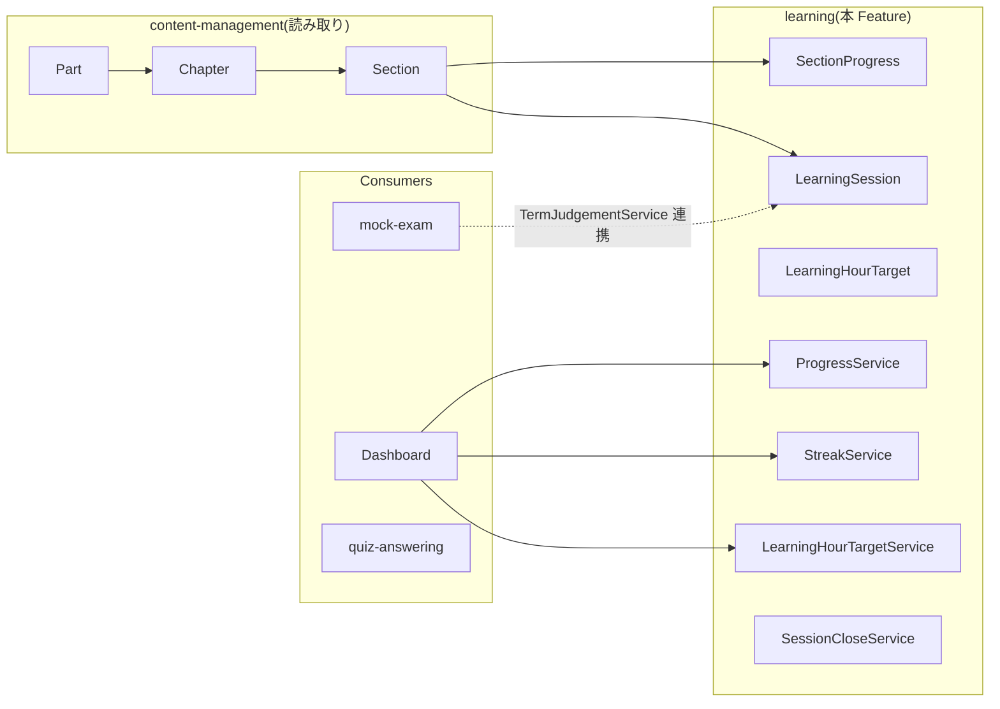
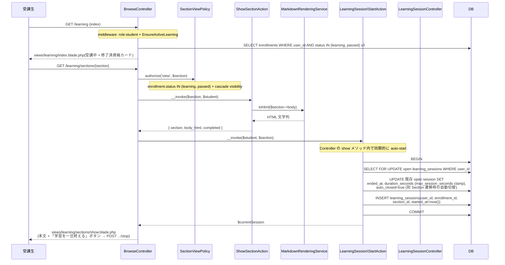
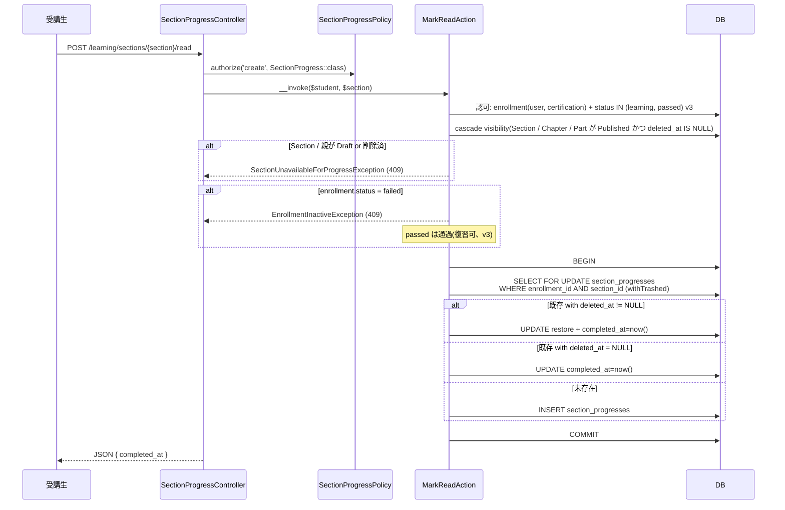
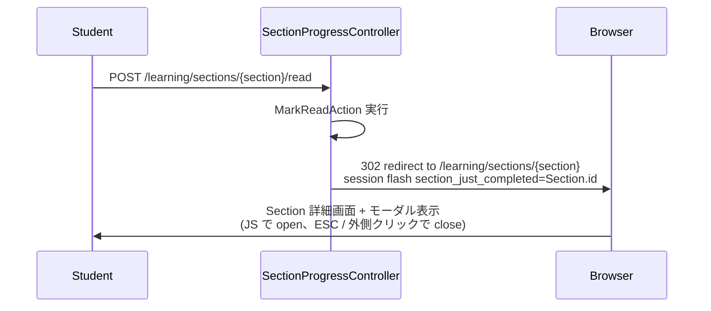

# learning 設計

> **v3 改修反映**(2026-05-16):
> - **`StagnationDetectionService` 削除**(滞留検知 MVP 外、v3 撤回)
> - **`Enrollment.status = passed` でも閲覧・演習可**(プラン期間内のみで判定、`learning + passed` を `active` 相当として扱う)
> - **`EnsureActiveLearning` Middleware** で `graduated` ユーザーのプラン機能ロック(教材ブラウジング / 読了マーク / 学習セッション / 学習時間目標すべて 403)
> - `PartViewPolicy` / `ChapterViewPolicy` / `SectionViewPolicy` の Enrollment 状態判定は `status IN (learning, passed)` に変更

## アーキテクチャ概要

受講生視点の教材ブラウジング画面、Section 読了マーク、学習セッション時間トラッキング、学習時間目標 CRUD、**3 集計 Service**(`ProgressService` / `StreakService` / `LearningHourTargetService`、v3 で `StagnationDetectionService` 撤回)と補助 Service(`SessionCloseService`)、Schedule Command(`learning:close-stale-sessions`)を一体で提供する。Clean Architecture(軽量版)に従い、Controller / FormRequest / Policy / UseCase(Action) / Service / Eloquent Model を分離する。本 Feature は [[content-management]] の Part / Chapter / Section モデルを **読み取り再利用** し、CRUD を持たない。集計 Service は [[dashboard]] / [[mock-exam]] / [[quiz-answering]] から消費される契約のみを公開する。

### 全体構造



> **v3 で削除**: `StagnationDetectionService`(`isStagnant` / `detectStagnant` / `lastActivityAt`)。dashboard / notification 双方から呼ばれていたが、v3 で滞留検知 MVP 外として撤回。

### 1. 教材ブラウジング(/learning → /learning/sections/{section})

> **FE 方針確定**(2026-05-16 / v3.5 改修): JavaScript / `session-tracker.js` / `navigator.sendBeacon` は採用しない。**Section ページ表示時に Controller がサーバ側で `LearningSession` を auto-start**、既存 open session があれば同タイミングで `auto_closed=true` で閉じる(別 Section 遷移時の自動切替)。stop は「別 Section の auto-start 連鎖」または「Schedule Command auto-close」の **2 経路** で完結。**「学習を一旦終える」明示ボタンは v3.5 で撤回**(UX 観点で不要、別 Section に移るかブラウザを閉じれば自動的に閉じるため)。



### 2. Section 読了マーク



## LearningSession ライフサイクル

> **2026-05-16 確定**: **JavaScript / `navigator.sendBeacon` / `pagehide` イベント / heartbeat / タブ可視性検知は採用しない**。純 Laravel(Blade + Form POST + サーバ側 auto-start + Schedule Command)で完結するシンプル仕様。集計の正確性は **`duration_seconds` の上限 clamp + Schedule Command 自動クローズ** の 2 重保険で担保する。

### ライフサイクル状態

`LearningSession` は以下 3 状態を取る:

| 状態 | 条件 | 意味 |
|---|---|---|
| **open** | `ended_at IS NULL` | 学習中(まだ終了していない) |
| **closed**(明示) | `ended_at IS NOT NULL` かつ `auto_closed = false` | 受講生の明示「学習を一旦終える」ボタン or `LearningSessionController::stop` 経由の停止 |
| **closed**(自動) | `ended_at IS NOT NULL` かつ `auto_closed = true` | 別 Section 表示時の `LearningSession\StartAction` 内で既存 open を切替 closeした場合、または Schedule Command による強制クローズ |

集計クエリは原則 `closed` のみ対象とし、`auto_closed` の真偽は **「実利用時間」と「自動クローズによる推定時間」を区別したい場面**(将来の分析用)に備える。学習時間目標 / ストリーク / dashboard の集計は両方を合算してよい。

### Start タイミング(サーバ側 auto-start、JS 不要)

- **発火点**: Section 詳細ページ(`GET /learning/sections/{section}`) を表示する Controller の `show` メソッド内で、`ShowSectionAction` 直後に `LearningSession\StartAction::__invoke($student, $section)` を同期的に呼ぶ。受講生が「学習開始」ボタンを押す必要はない(暗黙開始、UX 優先、JS 不要)。
- **`enrollment_id`** は Action 内で `auth.user.enrollments` から `section.chapter.part.certification_id` 経由で 1 件特定する(受講生 × 資格は UNIQUE)。
- **同時 open は禁止**: start 時に同一 user の `open` session が他 Section で存在する場合、`SELECT FOR UPDATE` で取得して `ended_at=now(), duration_seconds=clamp, auto_closed=true` で先に閉じる。これにより別 Section へ遷移すると旧 session が自動 close される(切替動作)。
- **冪等性**: 同一 Section で連続 GET アクセスを受けた場合(リロード等)、既存 open session を `auto_closed=true` で閉じてから新規 INSERT する(別レコード扱い、マージしない)。
- **失敗時のフェイルセーフ**: `StartAction` 内で例外が発生しても、Controller は `LearningSession` 関連の失敗をログに記録しつつ Section ページ自体は描画する(`try-catch` で吸収、学習行為の妨げを避ける)。Schedule Command で残骸 open は後追い回収される。

### Stop タイミング(2 経路、JS 不要、v3.5 で明示停止撤回)

1. **別 Section 遷移時の自動 close**: 上述「同時 open は禁止」のロジックで、新 Section の `StartAction` 内で旧 open session を `auto_closed=true` として閉じる。受講生が別 Section をクリックするだけで旧 session が自動的に終了する(別途 stop ボタン操作不要)。
2. **Schedule Command による保険 close**: `learning:close-stale-sessions`(後述)で `started_at < now() - max_session_seconds` の残存 open を強制 close。ブラウザ閉じ / PC スリープ / その他「ユーザー操作が届かなかったケース」の救済。

> **v3.5 で「明示停止」撤回**: 「学習を一旦終える」ボタンの UX 必要性が低い(別 Section へ移動するか、ブラウザを閉じるかすれば自動的に閉じる)ため、`LearningSessionController` / `LearningSession\StopAction` / `POST /learning/sessions/{session}/stop` Route はすべて削除。auto-start は `BrowseController::showSection` 内、auto-close は `SessionCloseService` + Schedule Command で完結する純サーバ側設計。

### `duration_seconds` の計算と上限 clamp

```php
$durationSeconds = min(
    $endedAt->diffInSeconds($startedAt),
    config('learning.max_session_seconds', 3600), // 1 セッション 60 分上限
);
```

- 上限は `config('learning.max_session_seconds')` で外出し(デフォルト 3600 秒 = 60 分)。
- 上限超過は「タブを開いたまま放置」「PC スリープでスリープ中の時間も計上される」を防ぐための保険。受講生が 60 分以上集中学習する場合は、別 Section へ遷移するか「学習を一旦終える」→ 再開で複数セッションに分かれる(これは仕様、UX 上問題なし)。
- `config('learning.max_session_seconds')` は Schedule Command の閾値(後述)と同期させる。

#### `duration_seconds` 冗長カラムの正当化

`ended_at - started_at` で計算可能なため一見冗長に見えるが、以下の理由で **キャッシュ済カラムとして保持する**:

| 理由 | 詳細 |
|---|---|
| **集計クエリの高速化** | `SUM(duration_seconds) GROUP BY user_id` / `GROUP BY enrollment_id` を [[learning]] 学習時間目標ゲージや [[dashboard]] 集計で頻繁に実行する。`SUM(TIMESTAMPDIFF(SECOND, started_at, ended_at))` でも可能だが、index 利用と JOIN 計画が複雑化 |
| **上限 clamp の物理表現** | `min($diffInSeconds, max_session_seconds)` の clamp 結果を `duration_seconds` に焼き込む。`ended_at - started_at` で都度計算するとアプリ層・クエリ層の両方で clamp を再現する必要があり、不整合リスクあり |
| **`open` セッション識別** | `duration_seconds IS NULL` で `open`(未終了)を即時判別可能。`ended_at IS NULL` でも同等だが、`SUM(duration_seconds)` 集計時に `WHERE duration_seconds IS NOT NULL` で `open` を除外できる(2 段階チェック不要) |

ストレージコストは `unsignedInteger`(4 bytes)で軽微、集計頻度に対する利得が大きい。Pro 生レベルとして「正規化 vs 計算済キャッシュのトレードオフ」を学べる例(`backend-models.md` の denormalize 採用判断の実例)。

#### `LearningSession.user_id` denormalize の正当化

`learning_sessions.user_id` は `enrollment.user_id` 経由で取得可能なため正規化観点では冗長だが、以下のクエリパターンで **denormalize として直接保持する**:

| クエリパターン | 利用先 | denormalize の効果 |
|---|---|---|
| `SELECT DISTINCT DATE(started_at) FROM learning_sessions WHERE user_id = ?` | `StreakService::calculate(User)`(連続学習日数) | `enrollment` JOIN 不要、`(user_id, started_at)` 複合 INDEX が直接効く |
| `SELECT SUM(duration_seconds) FROM learning_sessions WHERE user_id = ? AND started_at >= ?` | dashboard の「全資格横断の総学習時間」表示 | 複数 Enrollment を跨ぐ集計、JOIN ありだとプランが複雑化 |
| `SELECT COUNT(*) FROM learning_sessions WHERE user_id = ? AND ended_at IS NULL` | `auto_closed` Schedule Command 対象抽出 | enrollment JOIN なしで User 単位の残骸 session を発見 |

INDEX 設計: `(user_id, started_at)` / `(user_id, ended_at)` を貼ることで、上記 3 パターンすべてが index range scan で完結。`enrollment_id` 経由クエリは別途 `(enrollment_id, started_at)` INDEX でカバー。

denormalize による不整合リスク: `learning_sessions.user_id` は INSERT 時に `enrollment.user_id` から複製する固定値(以後変更しない)。受講生退会時は `enrollment` ごと SoftDelete されるが、`learning_sessions` 側の `user_id` は `restrictOnDelete` で保護(履歴保持)。

### Schedule Command 自動クローズ

- **`learning:close-stale-sessions`** — 日次起動 (`config('learning.close_stale_schedule', '01:00')`、他バッチと時刻ずらし)。`learning_sessions WHERE ended_at IS NULL AND started_at < now() - max_session_seconds` を一括取得 → 各 session を `ended_at = started_at + max_session_seconds, duration_seconds = max_session_seconds, auto_closed = true` でクローズ。
- 目的:
  - ブラウザ閉じ / PC スリープ / ネット断 等で「stop ボタンも別 Section auto-start も発火しなかった」ケースの残存 open session 救済。
  - 集計クエリで `open` session が含まれて NULL 集約されるバグの予防。
- 実装は `app/Console/Commands/Learning/CloseStaleSessionsCommand` → `LearningSession\CloseStaleSessionsAction::__invoke()` を呼ぶ薄いコマンド。`withoutOverlapping(5)` で多重起動防止。

### マージ方針(採用しない)

同一 `(user_id, section_id)` で連続する 2 セッションでも **別レコードで保存**(マージしない)。理由:

- マージ判定ロジック(連続性閾値・auto_closed 跨ぎの扱い)が複雑化し、教材スコープに不向き。
- 集計クエリで `SUM(duration_seconds) GROUP BY user_id, section_id` すれば合算結果が得られる。
- 履歴の粒度を「学習行為単位」で残すほうが、将来の分析(集中度 / 中断率)に活用できる。

### JS / 高度仕様は採用しない

- `navigator.sendBeacon` / `pagehide` / `visibilitychange=hidden` 等のブラウザ離脱検知は **採用しない**(2026-05-16 確定)。
- heartbeat / タブ可視性監視 / WebSocket 生存確認 等の高度仕様も採用しない。
- 上記の代わりに **サーバ側 auto-start(別 Section 遷移時の auto_close 連鎖)+ Schedule Command の上限 clamp auto-close** の 2 重保険で「過大計上を避ける」設計。
- 学習時間の精度は ±数分単位の誤差を許容する(教材スコープとして十分)。

### 失敗時の整合性ルール

| 失敗箇所 | 挙動 |
|---|---|
| Section 表示中の `StartAction` が失敗(例外) | Controller が `try-catch` で吸収、Section ページ表示は継続。残存 open は Schedule Command で auto_close |
| 「学習を一旦終える」POST が失敗(CSRF 切れ / network) | 受講生が再度ボタンを押せば redirect で受理。連打で停止しても idempotent(既に `closed` なら no-op + redirect) |
| ブラウザ閉じ / PC スリープ等で stop ボタンも別 Section auto-start も発火しなかった | Schedule Command で `started_at < now()-max_session_seconds` を auto_close。最大 1 日遅延で確実に閉じる |
| Section が SoftDelete / 親が Draft 化された後の stop | `LearningSessionController::stop` は session の存在のみ検証(Section の現在状態は問わない)。`ended_at` UPDATE は必ず成功させる(履歴の整合性優先) |
| 受講生が `graduated` 遷移した瞬間の open session | Schedule Command で auto_close。`EnsureActiveLearning` Middleware は新規 Section 表示を 403 でブロックするが、既存 open の stop ボタンは受理(履歴を閉じる責務) |

### 関連設定

```php
// config/learning.php
return [
    'max_session_seconds' => env('LEARNING_MAX_SESSION_SECONDS', 3600), // 1 セッション上限 60 分
    'close_stale_schedule' => env('LEARNING_CLOSE_STALE_SCHEDULE', '01:00'), // Schedule Command 起動時刻(他バッチと時刻ずらし)
];
```

## データモデル

(変更なし、テーブル定義は v3 前と同じ)

### Eloquent モデル一覧

- `SectionProgress` — `HasUlids` + `HasFactory` + `SoftDeletes`、`completed_at` datetime cast、`belongsTo(Enrollment)` / `belongsTo(Section)`、`scopeCompleted`
- `LearningSession` — `HasUlids` + `HasFactory` + `SoftDeletes`、`started_at` / `ended_at` datetime cast、`duration_seconds` integer、`auto_closed` boolean、`belongsTo(User)` / `belongsTo(Enrollment)` / `belongsTo(Section)`、`scopeOpen` / `scopeClosed` / `scopeForUser` / `scopeForEnrollment` / `scopeOnDate`
- `LearningHourTarget` — `HasUlids` + `HasFactory` + `SoftDeletes`、`belongsTo(Enrollment)`、`scopeActive`

### ER 図

```mermaid
erDiagram
    ENROLLMENTS ||--o{ SECTION_PROGRESSES : "enrollment_id"
    SECTIONS ||--o{ SECTION_PROGRESSES : "section_id"
    USERS ||--o{ LEARNING_SESSIONS : "user_id"
    ENROLLMENTS ||--o{ LEARNING_SESSIONS : "enrollment_id"
    SECTIONS ||--o{ LEARNING_SESSIONS : "section_id"
    ENROLLMENTS ||--o| LEARNING_HOUR_TARGETS : "enrollment_id (1to1)"

    SECTION_PROGRESSES {
        ulid id PK
        ulid enrollment_id FK
        ulid section_id FK
        timestamp completed_at
        timestamps
        timestamp deleted_at "nullable"
    }
    LEARNING_SESSIONS {
        ulid id PK
        ulid user_id FK "denormalized"
        ulid enrollment_id FK
        ulid section_id FK
        timestamp started_at
        timestamp ended_at "nullable"
        unsignedInteger duration_seconds "nullable"
        boolean auto_closed
        timestamps
        timestamp deleted_at "nullable"
    }
    LEARNING_HOUR_TARGETS {
        ulid id PK
        ulid enrollment_id FK "UNIQUE"
        unsignedSmallInteger target_total_hours
        timestamps
        timestamp deleted_at "nullable"
    }
```

### インデックス・制約

`section_progresses`:
- `(enrollment_id, section_id)`: UNIQUE INDEX

`learning_sessions`:
- `(user_id, started_at)` / `(enrollment_id, started_at)` / `(user_id, ended_at)` / `(enrollment_id, section_id)`: 複合 INDEX

`learning_hour_targets`:
- `enrollment_id`: UNIQUE INDEX

## コンポーネント

### Controller

`app/Http/Controllers/`(`auth + role:student + EnsureActiveLearning` middleware):

- `BrowseController` — `index` / `showEnrollment` / `showPart` / `showChapter` / `showSection`(`showSection` 内で `LearningSession\StartAction` をサーバ側 auto-start として呼ぶ)
- `SectionProgressController` — `markRead` / `unmarkRead`
- ~~`LearningSessionController`~~ — **v3.5 で削除**(stop メソッドも撤回、`start` は元から無い、auto-start は `BrowseController::showSection` 内、auto-close は `SessionCloseService` + Schedule Command で完結)
- `LearningHourTargetController` — `show` / `upsert` / `destroy`

### Action

`app/UseCases/Learning/`(Browse 系) / `app/UseCases/SectionProgress/` / `app/UseCases/LearningSession/` / `app/UseCases/LearningHourTarget/`:

- `Learning\IndexAction` — **受講中 + 修了済 Enrollment 一覧**(`status IN (learning, passed)`、v3 で `paused` 撤回、`passed` 含む)
- `Learning\ShowEnrollmentAction` — Part 一覧 + `ProgressService::summarize`
- `Learning\ShowPartAction` / `ShowChapterAction` / `ShowSectionAction`
- `SectionProgress\MarkReadAction` — cascade visibility 検証 + Enrollment 状態検証(`learning + passed` 許容) + UPSERT
- `SectionProgress\UnmarkReadAction` — SoftDelete
- `LearningSession\StartAction` — `BrowseController::showSection` から呼ばれる(JS / API エンドポイント経由ではない)。`SessionCloseService::closeOpenSessions` で既存 open を `auto_closed=true` で閉じる + 新規 INSERT。`enrollment.status` 検証は呼出元の `SectionViewPolicy` 側(`learning` / `passed` 許容、`failed` で 403)で完了している前提のため Action 内では再検査しない
- ~~`LearningSession\StopAction`~~ — **v3.5 で削除**(明示停止ボタン撤回に伴う)
- `LearningSession\CloseStaleSessionsAction` — Schedule Command `learning:close-stale-sessions` のエントリポイント
- `LearningHourTarget\ShowAction` / `UpsertAction` / `DestroyAction`

### Service

`app/Services/`:

- `SessionCloseService` — `closeOpenSessions(User, asAutoClosed: bool)` / `closeOne(LearningSession)` / `closeStaleSessions(): int`
- `ProgressService` — `summarize(Enrollment): ProgressSummary` / `sectionRatio(Enrollment, ?Part|?Chapter): float` / `batchCalculate(Collection<Enrollment>): array<string, float>`([[dashboard]] 用)
- `StreakService` — `calculate(User): StreakSummary`(`DISTINCT DATE` ベース連続日数)
- `LearningHourTargetService` — `compute(Enrollment): LearningHourTargetSummary`

### 明示的に持たない Service(v3 撤回)

- **`StagnationDetectionService`** — `isStagnant` / `detectStagnant` / `lastActivityAt` / `batchLastActivityFor` を含む全機能を削除
- 滞留検知に基づく Schedule Command / Notification / Dashboard ウィジェット連動も全削除

### Policy

`app/Policies/`:

- `SectionProgressPolicy`(`viewAny` / `view` / `create` / `delete`、自分の Enrollment 配下のみ)
- `LearningSessionPolicy`(`viewAny` / `view` / `update`、`session.user_id = auth.id`)
- `LearningHourTargetPolicy`(自分の Enrollment 配下のみ CRUD、coach / admin は view のみ)
- **`PartViewPolicy` / `ChapterViewPolicy` / `SectionViewPolicy`(v3 更新)** — `user.enrollments()->where('certification_id', $resource->certification_id)->whereIn('status', [Learning, Passed])->exists()` 判定(旧 `paused` 撤回)

### FormRequest

`app/Http/Requests/`:

- `LearningHourTarget\UpsertRequest`(`target_total_hours: required integer min:1 max:9999`)

> **明示的に持たない FormRequest**: 旧 `LearningSession\StartRequest`(JS から `POST /learning/sessions/start { section_id }` を受ける用)は撤回。auto-start は `BrowseController::showSection` 内のサーバ呼出に集約され、`{section}` は Route Model Binding で解決されるため FormRequest 不要。`LearningSessionController::stop` も `{session}` Route Model Binding + `LearningSessionPolicy::update` 認可で十分で、固有 FormRequest は持たない。

### Route

```php
Route::middleware(['auth', 'role:student', EnsureActiveLearning::class])
    ->prefix('learning')->name('learning.')->group(function () {
        Route::get('/', [BrowseController::class, 'index'])
            ->middleware('resolve-default-enrollment:learning.enrollments.show')
            ->name('index');
        Route::get('enrollments/{enrollment}', [BrowseController::class, 'showEnrollment'])->name('enrollments.show');
        Route::get('parts/{part}', [BrowseController::class, 'showPart'])->name('parts.show');
        Route::get('chapters/{chapter}', [BrowseController::class, 'showChapter'])->name('chapters.show');
        Route::get('sections/{section}', [BrowseController::class, 'showSection'])->name('sections.show');

        Route::post('sections/{section}/read', [SectionProgressController::class, 'markRead'])->name('sections.markRead');
        Route::delete('sections/{section}/read', [SectionProgressController::class, 'unmarkRead'])->name('sections.unmarkRead');

        // LearningSession の start / stop は API として持たない(v3.5、auto-start は BrowseController::showSection 内のサーバ実行、auto-close は Schedule Command + 別 Section auto-start で完結)

        Route::get('enrollments/{enrollment}/hour-target', [LearningHourTargetController::class, 'show'])->name('hourTarget.show');
        Route::put('enrollments/{enrollment}/hour-target', [LearningHourTargetController::class, 'upsert'])->name('hourTarget.upsert');
        Route::delete('enrollments/{enrollment}/hour-target', [LearningHourTargetController::class, 'destroy'])->name('hourTarget.destroy');
    });
```

## Schedule Command

- **`learning:close-stale-sessions`** — `app/Console/Commands/Learning/CloseStaleSessionsCommand`、日次起動 (`config('learning.close_stale_schedule', '01:00')`)、`learning_sessions WHERE ended_at IS NULL AND started_at < now()-max_session_seconds` を一括クローズ
- **明示的に持たない**: `learning:detect-stagnations`(v3 撤回)

## エラーハンドリング

`app/Exceptions/Learning/`:

- `SectionUnavailableForProgressException`(409、cascade visibility 違反)
- `EnrollmentInactiveException`(409、`SectionProgress\MarkReadAction` で `status === failed` の Enrollment に対する読了マークを拒否。`LearningSession\StartAction` 側は `SectionViewPolicy` の 403 が先に作用するため本例外は throw しない)
- `LearningHourTargetInvalidException`(422、FormRequest 二重ガード用)

## 関連要件マッピング

| 要件 ID | 実装ポイント |
|---|---|
| REQ-learning-001〜007 | 各 Migration / Model |
| REQ-learning-010〜019 | `BrowseController` + `Learning\*Action` + `*ViewPolicy`(`learning + passed` 許容) |
| REQ-learning-019 | `routes/web.php` の `EnsureActiveLearning::class` middleware |
| REQ-learning-020〜025 | `SectionProgress\MarkReadAction` / `UnmarkReadAction`、v3 で `passed` 許容 |
| REQ-learning-040〜049 | `LearningSession\StartAction` / `StopAction` / `SessionCloseService` |
| REQ-learning-060〜067 | `App\Services\ProgressService` |
| REQ-learning-080〜086 | `App\Services\StreakService` |
| REQ-learning-090〜099 | `LearningHourTarget\*Action` + `App\Services\LearningHourTargetService` |
| REQ-learning-140〜146 | 各 Policy + routes/web.php の middleware |
| REQ-learning-144 | `PartViewPolicy` / `ChapterViewPolicy` / `SectionViewPolicy` の `status IN (learning, passed)` 判定(v3) |
| NFR-learning-001 | 各 Action の `DB::transaction()` |
| NFR-learning-003 | 各 migration の複合 INDEX |
| NFR-learning-004 | `app/Exceptions/Learning/*Exception.php` |

### 明示的に持たない要件(v3 撤回)

- 旧 REQ-learning-120〜126(`StagnationDetectionService` 関連)

## テスト戦略

### Feature(HTTP)

- `Browse/{Index,ShowEnrollment,ShowPart,ShowChapter,ShowSection}Test.php`
  - **`learning` と `passed` 両方の Enrollment が表示される**(v3)
  - `graduated` ユーザーで 403(`EnsureActiveLearning`)
- `SectionProgress/{MarkRead,UnmarkRead}Test.php`
  - **`passed` で markRead 成功**(v3、復習として読了マーク可)
  - `failed` で 409
- `LearningSession/{Start,Stop}Test.php`
  - **`passed` で start 成功**(v3)
  - `failed` で 409
- `LearningHourTarget/{Show,Upsert,Destroy}Test.php`

### Feature(UseCases)

- `Learning/ShowEnrollmentActionTest.php`
- `SectionProgress/MarkReadActionTest.php`(restore + UPDATE 分岐、Draft 連鎖時の例外)
- `LearningSession/{Start,Stop,CloseStaleSessions}ActionTest.php`
- `LearningHourTarget/UpsertActionTest.php`(SoftDeleted 復元、UNIQUE 制約下の upsert)

### Unit(Services / Policies)

- `Services/{SessionClose,Progress,Streak,LearningHourTarget}ServiceTest.php`
  - **`StagnationDetectionServiceTest` は削除**(v3)
- `Policies/{SectionProgress,LearningSession,LearningHourTarget}PolicyTest.php`
- **`Policies/{Part,Chapter,Section}ViewPolicyTest.php`(v3)** — `status IN (learning, passed)` 判定、`paused` テストは削除

## v3.5 改修 — 教材/演習問題タブ + 読了モーダル + 前後 Section 遷移 + Switcher 埋込

### 1. 教材/演習問題タブ ([[quiz-answering]] 連携、iField LMS `ContentsTabs` 相当)

`/learning/enrollments/{enrollment}` (2 階層目、教材 Part 一覧) 画面に「教材」「演習問題」の 2 タブを設置。タブ切替は URL クエリ `?tab=contents|quizzes`(デフォルト `contents`)。

| タブ | 表示内容 | 依存 |
|---|---|---|
| `contents` (デフォルト) | Part → Chapter → Section の階層 expandable list + 読了バッジ | learning Feature 単独 |
| `quizzes` | 同階層 + 各 Section の SectionQuestion 集合への遷移リンク + 挑戦回数 / 最高 / 最新スコア | [[quiz-answering]] の `SectionQuestionScoreService::summarize(User, Section)` を呼出 |

Blade 構造:
- `views/learning/enrollments/show.blade.php` — タブ Component (`<x-tabs>`) を上部に配置
- `views/learning/enrollments/_partials/contents-tab.blade.php` — 「教材」タブ panel
- `views/learning/enrollments/_partials/quizzes-tab.blade.php` — 「演習問題」タブ panel (iField LMS `QuizListTab` 相当、スコア表示は `<x-learning.section-score-row :section="$s" :summary="$summary" />` で展開)

`Learning\ShowEnrollmentAction` は `?tab` パラメータを受けて、quizzes タブの場合は `SectionQuestionScoreService` を Eager に呼んでサマリを Blade に渡す。

### 2. 読了モーダル (iField LMS `CongratulationsModal` 相当)

読了マーク POST 成功時にセッションフラッシュ `section_just_completed = $section->id` を付与し、Section 詳細画面に redirect。Blade で flash 判定してモーダル自動表示。



モーダル内ボタン:

| ボタン | 表示条件 | 遷移先 |
|---|---|---|
| 「次の Section へ」 | 同 Chapter 内に next sibling Section あり | `/learning/sections/{nextSection}` |
| 「次の Chapter へ」 | 最終 Section かつ親 Part 内に next sibling Chapter あり | `/learning/chapters/{nextChapter}` |
| 「Part 一覧へ戻る」 | 最終 Section かつ最終 Chapter | `/learning/enrollments/{enrollment}` |
| 「Section 紐づき問題演習へ」 | 当該 Section に SectionQuestion が存在 | [[quiz-answering]] の Section 演習 URL |
| 「閉じる」 | 常時(モーダル右上 X) | — |

実装:
- Blade Component: `<x-learning.section-completed-modal :current="$section" :next-section="$nextSection" :next-chapter="$nextChapter" :has-quiz="$hasSectionQuestions" />`
- JS: `resources/js/learning/section-completed-modal.js` — `DOMContentLoaded` で `data-show-modal` 属性を判定して `<x-modal>` を open(共通 modal.js を利用)
- Controller (`SectionProgressController::markRead`): リダイレクト時に `session()->flash('section_just_completed', $section->id)` を付与

### 3. 前後 Section 遷移ボタン (iField LMS `SectionNavigation` 相当)

Section 詳細画面の下部に「← 前の Section」「次の Section →」ボタンを配置。同 Chapter 内の sibling Section を `order ASC` で並べて前後判定。

実装:
- Blade: `views/learning/sections/_partials/section-navigation.blade.php`
- Action (`Learning\ShowSectionAction`): `$section->chapter->sections()->wherePublished()->orderBy('order')->get()` を取得し、現 Section index から `$prevSection` / `$nextSection` (nullable) を算出して Blade に渡す
- 状態: 最初 Section の場合は「前へ」を `disabled`、最終 Section の場合は「次へ」を `disabled`(または「次の Chapter へ」に切替) で表示

### 4. [[default-enrollment]] Switcher 埋込

`/learning/enrollments/{enrollment}` 配下のすべての 2 階層目画面 (Part / Chapter / Section 詳細) の上部に `<x-enrollment-switcher variant="inline" :current="$enrollment" />` を埋込。サイドバー下部の `variant="sidebar"` Switcher と合わせて、画面文脈に近い切替動線 + グローバル動線の二層構成。

### 5. Routes 変更まとめ (v3.5)

- `Route::get('/', [BrowseController::class, 'index'])->middleware('resolve-default-enrollment:learning.enrollments.show')->name('index');` (新規 Middleware)
- `BrowseController::index` は default NULL + Enrollment 2+ 件 / 0 件 のフォールバック専用に簡素化、`<x-enrollment-switcher variant="empty-state">` を含む Blade を返す
- ~~`Route::post('sessions/{session}/stop', ...)`~~ **削除**(v3.5)
- ~~`LearningSessionController`~~ / ~~`LearningSession\StopAction`~~ / ~~`stop-session-button.blade.php`~~ すべて **削除**(v3.5)

### 6. 新規 Action / Service

- `Learning\ShowEnrollmentAction` 拡張: `?tab=quizzes` 受領時に `SectionQuestionScoreService::batchSummarize($user, $enrollment)` を呼んでスコアサマリを Blade に渡す
- `BrowseController::showSection` 拡張: 同 Chapter 内 sibling Section を Eager Load して `$prevSection` / `$nextSection` を Blade に渡す

### 7. 関連要件マッピング追加

| 要件 ID | 実装ポイント |
|---|---|
| REQ-learning-010 (v3.5) | `routes/web.php` の `'resolve-default-enrollment:learning.enrollments.show'` Middleware + `BrowseController::index` の empty-state UI 分岐 |
| REQ-learning-025, 026, 027 | `views/learning/components/section-completed-modal.blade.php` + `SectionProgressController::markRead` の flash 付与 + `resources/js/learning/section-completed-modal.js` |
| REQ-learning-028, 029 | `views/learning/sections/_partials/section-navigation.blade.php` + `Learning\ShowSectionAction` の sibling 算出 |
| REQ-learning-050〜054 | `views/learning/enrollments/show.blade.php` のタブ Component + `Learning\ShowEnrollmentAction` の tab パラメータ処理 + `<x-enrollment-switcher variant="inline">` 埋込 + [[quiz-answering]] `SectionQuestionScoreService` 呼出 |
| REQ-learning-049 (v3.5 修正) | LearningSessionController / StopAction / route 削除 |
