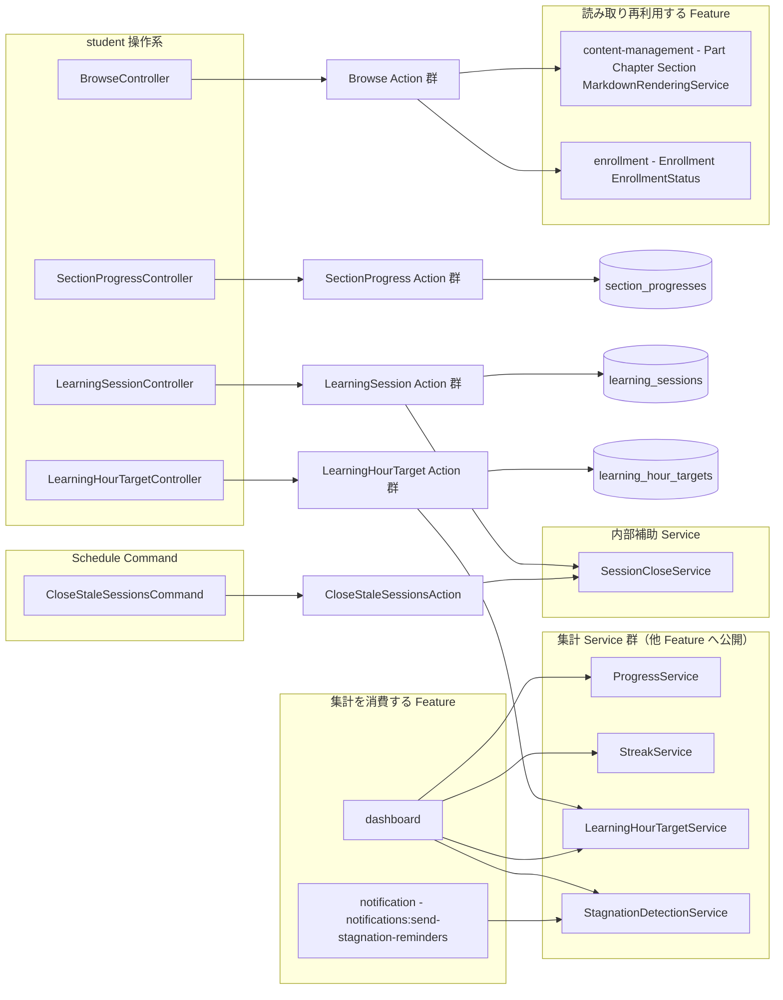
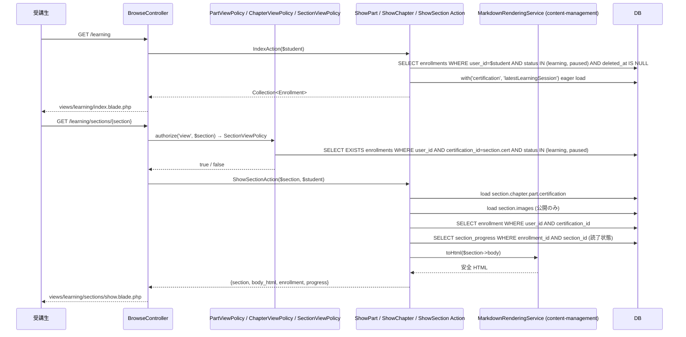
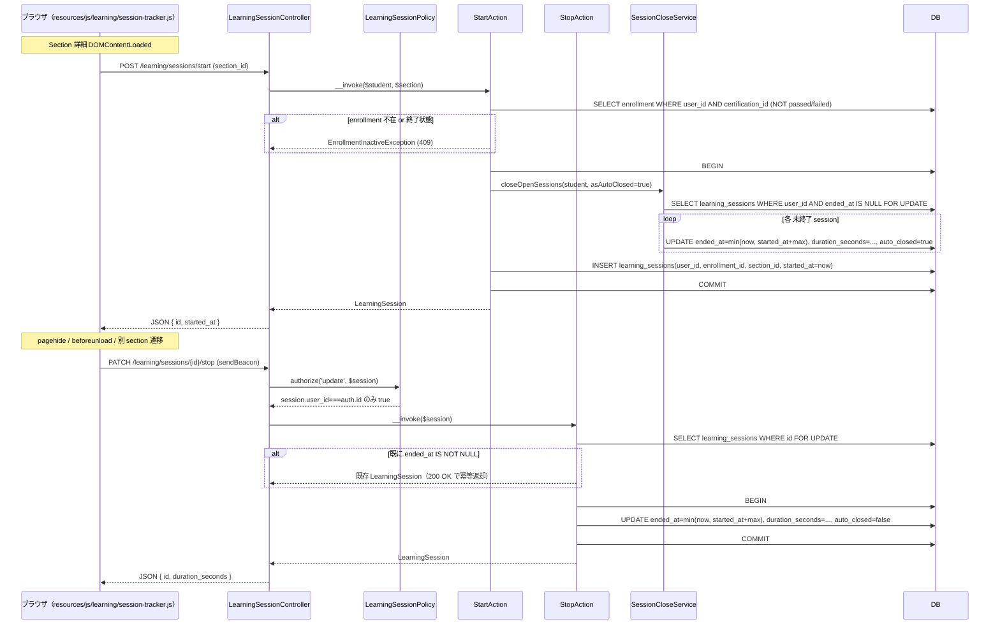
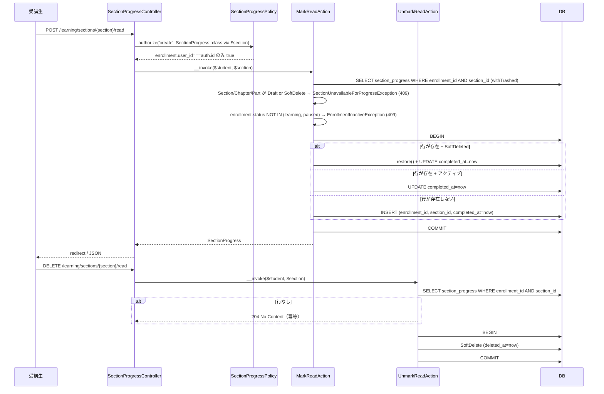
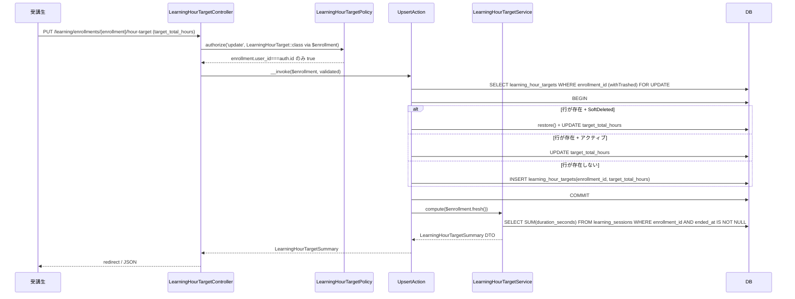
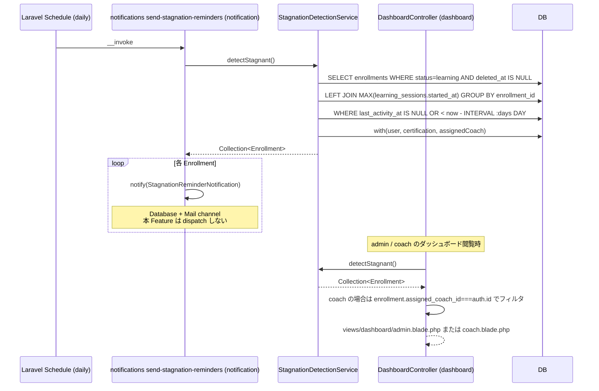
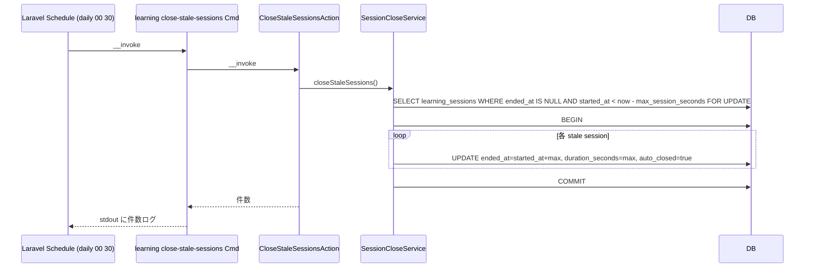
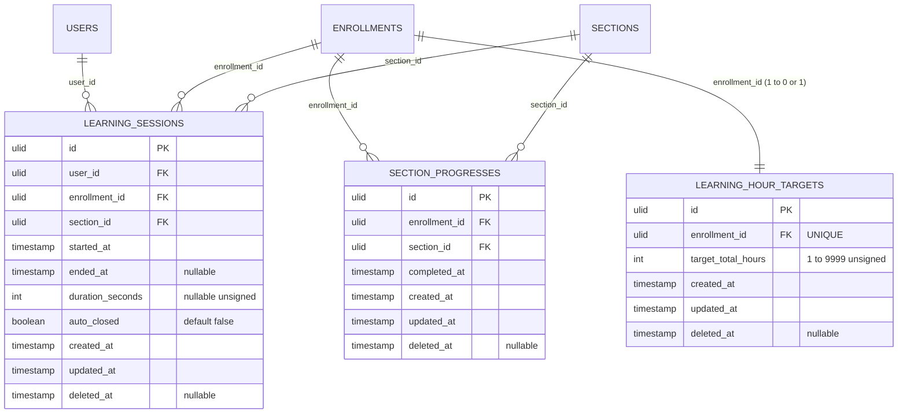

# learning 設計

## アーキテクチャ概要

受講生視点の教材ブラウジング画面、Section 読了マーク、学習セッション時間トラッキング、学習時間目標 CRUD、4 集計 Service（`ProgressService` / `StreakService` / `LearningHourTargetService` / `StagnationDetectionService`）と補助 Service（`SessionCloseService`）、Schedule Command（`learning:close-stale-sessions`）を一体で提供する。Clean Architecture（軽量版）に従い、Controller / FormRequest / Policy / UseCase（Action）/ Service / Eloquent Model を分離する。本 Feature は [[content-management]] の Part / Chapter / Section モデルを **読み取り再利用** し、CRUD を持たない。集計 Service は [[dashboard]] / [[notification]] から消費される契約のみを公開し、本 Feature の Controller / View が直接結果を画面表示するわけではない（dashboard 側のレンダリングに値を渡す責務）。

### 全体構造



### 教材ブラウジング



### 学習セッション開始 / 終了



### Section 読了マーク



### 学習時間目標 upsert



### 滞留検知 + dashboard / notification 連携



### Schedule Command: stale session クリーンアップ



## データモデル

### Eloquent モデル一覧

- **`SectionProgress`** — Section 読了マーク。`HasUlids` + `HasFactory` + `SoftDeletes`。`belongsTo(Enrollment::class)` / `belongsTo(Section::class)`。スコープ: `scopeCompleted()`（`completed_at IS NOT NULL`、SoftDeleted は標準で除外）。リレーション逆引きは [[enrollment]] 側で `hasMany(SectionProgress::class)` を宣言する。
- **`LearningSession`** — Section 滞在時間トラッキング。`HasUlids` + `HasFactory` + `SoftDeletes`。`belongsTo(User::class)` / `belongsTo(Enrollment::class)` / `belongsTo(Section::class)`。スコープ: `scopeOpen()`（`ended_at IS NULL`）/ `scopeClosed()`（`ended_at IS NOT NULL`）/ `scopeForUser(User $user)` / `scopeForEnrollment(Enrollment $enrollment)` / `scopeOnDate(Carbon $date)`（`DATE(started_at) = date`）。Cast: `started_at` / `ended_at` を `datetime`、`duration_seconds` を `integer`、`auto_closed` を `boolean`。
- **`LearningHourTarget`** — 学習時間目標。`HasUlids` + `HasFactory` + `SoftDeletes`。`belongsTo(Enrollment::class)`。スコープ: `scopeActive()`（標準で SoftDeleted は除外）。

### ER 図



### インデックス・制約

`section_progresses`:
- `(enrollment_id, section_id)`: UNIQUE INDEX（1 Enrollment × 1 Section の最大 1 行）
- `enrollment_id`: 外部キー（`->constrained('enrollments')->restrictOnDelete()`）
- `section_id`: 外部キー（`->constrained('sections')->restrictOnDelete()`）
- `deleted_at`: 単体 INDEX（SoftDelete 除外の高速化）
- `(section_id, deleted_at)`: 複合 INDEX（ProgressService が `JOIN sections` でフィルタする際の最適化）

`learning_sessions`:
- `(user_id, started_at)`: 複合 INDEX（`StreakService` の DISTINCT DATE クエリ最適化）
- `(enrollment_id, started_at)`: 複合 INDEX（`StagnationDetectionService` の MAX(started_at) と `LearningHourTargetService` の SUM 最適化）
- `(user_id, ended_at)`: 複合 INDEX（`SessionCloseService` で `WHERE user_id AND ended_at IS NULL` 高速化）
- `(enrollment_id, section_id)`: 複合 INDEX（Section 別時間集計）
- `user_id`: 外部キー（`->constrained('users')->restrictOnDelete()`）
- `enrollment_id`: 外部キー（`->constrained('enrollments')->restrictOnDelete()`）
- `section_id`: 外部キー（`->constrained('sections')->restrictOnDelete()`）
- `deleted_at`: 単体 INDEX

`learning_hour_targets`:
- `enrollment_id`: UNIQUE INDEX（1 Enrollment = 0 or 1 行）
- `enrollment_id`: 外部キー（`->constrained('enrollments')->restrictOnDelete()`）
- `deleted_at`: 単体 INDEX

## 状態遷移

本 Feature 所有のエンティティに **state diagram は無い**（`product.md` 「## ステータス遷移」セクションの A〜F に learning Feature 所有エンティティは登場しない）。状態に近い概念として LearningSession の `ended_at IS NULL`（受講中）→ `ended_at IS NOT NULL`（終了）と `auto_closed` フラグがあるが、これは 2 値のフラグ的状態であり Enum 化しない。Enum を導入する Migrator コストの方が大きい。

`SectionProgress` の SoftDelete は「読了取消」を表現するための論理状態だが、これも `deleted_at IS NULL` / `NOT NULL` の 2 値であり Enum 化しない。

## コンポーネント

### Controller

すべて `app/Http/Controllers/` 配下、ロール別 namespace は使わず（`structure.md` 規約）、`/learning/...` プレフィックスで `auth + role:student` Middleware を適用する。

- **`BrowseController`** — 教材ブラウジング画面
  - `index(IndexAction)` — 受講中 Enrollment 一覧（`/learning`）
  - `showEnrollment(Enrollment $enrollment, ShowEnrollmentAction)` — 資格別 Part 一覧（`/learning/enrollments/{enrollment}`）
  - `showPart(Part $part, ShowPartAction)` — Part 詳細 + Chapter 一覧（`/learning/parts/{part}`）
  - `showChapter(Chapter $chapter, ShowChapterAction)` — Chapter 詳細 + Section 一覧（`/learning/chapters/{chapter}`）
  - `showSection(Section $section, ShowSectionAction)` — Section 詳細（`/learning/sections/{section}`、Markdown レンダリング + 読了ボタン + Quiz 遷移リンク）

- **`SectionProgressController`** — Section 読了マーク
  - `markRead(Section $section, MarkReadAction)` — `POST /learning/sections/{section}/read`、Controller method 名は `markRead` / Action は `MarkReadAction`（`backend-usecases.md` 規約）
  - `unmarkRead(Section $section, UnmarkReadAction)` — `DELETE /learning/sections/{section}/read`

- **`LearningSessionController`** — 学習セッション開始 / 終了
  - `start(StartRequest, StartAction)` — `POST /learning/sessions/start`、ペイロード `{section_id}`
  - `stop(LearningSession $session, StopAction)` — `PATCH /learning/sessions/{session}/stop`

- **`LearningHourTargetController`** — 学習時間目標 CRUD
  - `show(Enrollment $enrollment, ShowAction)` — `GET /learning/enrollments/{enrollment}/hour-target`
  - `upsert(Enrollment $enrollment, UpsertRequest, UpsertAction)` — `PUT /learning/enrollments/{enrollment}/hour-target`、Controller method 名は `upsert` / Action は `UpsertAction`
  - `destroy(Enrollment $enrollment, DestroyAction)` — `DELETE /learning/enrollments/{enrollment}/hour-target`

> 本 Feature は受講生向け Controller のみを持つ。coach / admin は本 Feature の Controller を経由せず、`ProgressService` / `StreakService` / `LearningHourTargetService` / `StagnationDetectionService` を [[dashboard]] が直接 DI 注入で消費する。これは [[certification-management]] の `Certificate\IssueAction` が [[enrollment]] の `ApproveCompletionAction` から DI で呼ばれる構造と同じ流儀。

### Action（UseCase）

Entity / 関心事単位ディレクトリで配置。各 Action は単一トランザクション境界、`__invoke()` を主とする。Controller method 名と Action クラス名は完全一致。

#### `App\UseCases\Learning\IndexAction`

```php
namespace App\UseCases\Learning;

use App\Enums\EnrollmentStatus;
use App\Models\Enrollment;
use App\Models\User;
use Illuminate\Database\Eloquent\Collection;

class IndexAction
{
    public function __invoke(User $student): Collection
    {
        return Enrollment::query()
            ->where('user_id', $student->id)
            ->whereIn('status', [EnrollmentStatus::Learning, EnrollmentStatus::Paused])
            ->with(['certification.category'])
            ->withMax('learningSessions as last_activity_at', 'started_at')
            ->orderByRaw("FIELD(status, 'learning', 'paused'), exam_date ASC")
            ->get();
    }
}
```

責務: 受講生本人の `learning` / `paused` の Enrollment を「ターム / 試験日」順で返し、各 Enrollment に最終学習活動日時を `withMax` で eager load する。`status = passed / failed` は除外（履歴閲覧は [[enrollment]] 詳細画面が担う）。

#### `App\UseCases\Learning\ShowEnrollmentAction`

```php
class ShowEnrollmentAction
{
    public function __construct(private ProgressService $progress) {}

    public function __invoke(Enrollment $enrollment): array
    {
        $enrollment->load(['certification.parts' => fn ($q) => $q
            ->published()
            ->ordered()
            ->with(['chapters' => fn ($q) => $q->published()->ordered()->withCount(['sections as published_sections_count' => fn ($q) => $q->published()])])
        ]);

        return [
            'enrollment' => $enrollment,
            'progress' => $this->progress->summarize($enrollment),
        ];
    }
}
```

責務: Enrollment 配下の公開済 Part / Chapter ツリーを Eager Loading し、進捗集計値を同梱して返す。

#### `App\UseCases\Learning\ShowPartAction` / `ShowChapterAction`

```php
class ShowPartAction
{
    public function __invoke(Part $part, User $student): array
    {
        // PartViewPolicy::view を Controller 側で済んでいる前提
        $part->load(['certification', 'chapters' => fn ($q) => $q
            ->published()
            ->ordered()
            ->withCount(['sections as published_sections_count' => fn ($q) => $q->published()])]);

        $enrollment = $student->enrollments()
            ->where('certification_id', $part->certification_id)
            ->whereIn('status', [EnrollmentStatus::Learning, EnrollmentStatus::Paused])
            ->firstOrFail();

        return [
            'part' => $part,
            'enrollment' => $enrollment,
        ];
    }
}
```

`ShowChapterAction` も同パターン（親が Chapter で Section 一覧 + 読了状態を Eager Loading）。

#### `App\UseCases\Learning\ShowSectionAction`

```php
class ShowSectionAction
{
    public function __construct(private MarkdownRenderingService $markdown) {}

    public function __invoke(Section $section, User $student): array
    {
        $section->load(['chapter.part.certification', 'images' => fn ($q) => $q->whereNull('deleted_at')]);

        $enrollment = $student->enrollments()
            ->where('certification_id', $section->chapter->part->certification_id)
            ->whereIn('status', [EnrollmentStatus::Learning, EnrollmentStatus::Paused])
            ->firstOrFail();

        $progress = SectionProgress::query()
            ->where('enrollment_id', $enrollment->id)
            ->where('section_id', $section->id)
            ->first(); // SoftDeleted は除外

        return [
            'section' => $section,
            'enrollment' => $enrollment,
            'body_html' => $this->markdown->toHtml($section->body),
            'progress' => $progress,
        ];
    }
}
```

責務: Section 本文を `MarkdownRenderingService::toHtml` 経由で安全 HTML 化し、読了状態を同梱して返す。

#### `App\UseCases\SectionProgress\MarkReadAction`

```php
namespace App\UseCases\SectionProgress;

use App\Enums\ContentStatus;
use App\Enums\EnrollmentStatus;
use App\Exceptions\Learning\EnrollmentInactiveException;
use App\Exceptions\Learning\SectionUnavailableForProgressException;
use App\Models\Enrollment;
use App\Models\Section;
use App\Models\SectionProgress;
use App\Models\User;
use Illuminate\Support\Facades\DB;

class MarkReadAction
{
    public function __invoke(User $student, Section $section): SectionProgress
    {
        $section->loadMissing('chapter.part');

        if ($section->status !== ContentStatus::Published
            || $section->chapter->status !== ContentStatus::Published
            || $section->chapter->part->status !== ContentStatus::Published
            || $section->deleted_at !== null
            || $section->chapter->deleted_at !== null
            || $section->chapter->part->deleted_at !== null
        ) {
            throw new SectionUnavailableForProgressException();
        }

        $enrollment = Enrollment::query()
            ->where('user_id', $student->id)
            ->where('certification_id', $section->chapter->part->certification_id)
            ->firstOrFail();

        if (! in_array($enrollment->status, [EnrollmentStatus::Learning, EnrollmentStatus::Paused], true)) {
            throw new EnrollmentInactiveException();
        }

        return DB::transaction(function () use ($enrollment, $section) {
            $progress = SectionProgress::withTrashed()
                ->where('enrollment_id', $enrollment->id)
                ->where('section_id', $section->id)
                ->lockForUpdate()
                ->first();

            if ($progress === null) {
                return SectionProgress::create([
                    'enrollment_id' => $enrollment->id,
                    'section_id' => $section->id,
                    'completed_at' => now(),
                ]);
            }

            if ($progress->trashed()) {
                $progress->restore();
            }
            $progress->update(['completed_at' => now()]);

            return $progress->fresh();
        });
    }
}
```

責務: (1) cascade visibility 検証、(2) Enrollment 状態検証、(3) `withTrashed + lockForUpdate` で既存 / SoftDeleted を1ショット解決、(4) restore + UPDATE / 新規 INSERT を分岐。

#### `App\UseCases\SectionProgress\UnmarkReadAction`

```php
class UnmarkReadAction
{
    public function __invoke(User $student, Section $section): void
    {
        $enrollment = $student->enrollments()
            ->where('certification_id', $section->chapter->part->certification_id)
            ->firstOrFail();

        $progress = SectionProgress::query()
            ->where('enrollment_id', $enrollment->id)
            ->where('section_id', $section->id)
            ->first();

        if ($progress === null) {
            return; // 冪等性: もとから読了でなければ no-op
        }

        DB::transaction(fn () => $progress->delete()); // SoftDelete
    }
}
```

責務: 冪等な SoftDelete。

#### `App\UseCases\LearningSession\StartAction`

```php
namespace App\UseCases\LearningSession;

use App\Enums\EnrollmentStatus;
use App\Exceptions\Learning\EnrollmentInactiveException;
use App\Models\LearningSession;
use App\Models\Section;
use App\Models\User;
use App\Services\SessionCloseService;
use Illuminate\Support\Facades\DB;

class StartAction
{
    public function __construct(private SessionCloseService $closer) {}

    public function __invoke(User $student, Section $section): LearningSession
    {
        $section->loadMissing('chapter.part');

        $enrollment = $student->enrollments()
            ->where('certification_id', $section->chapter->part->certification_id)
            ->firstOrFail();

        if (in_array($enrollment->status, [EnrollmentStatus::Passed, EnrollmentStatus::Failed], true)) {
            throw new EnrollmentInactiveException();
        }

        return DB::transaction(function () use ($student, $section, $enrollment) {
            $this->closer->closeOpenSessions($student, asAutoClosed: true);

            return LearningSession::create([
                'user_id' => $student->id,
                'enrollment_id' => $enrollment->id,
                'section_id' => $section->id,
                'started_at' => now(),
                'ended_at' => null,
                'duration_seconds' => null,
                'auto_closed' => false,
            ]);
        });
    }
}
```

責務: 既存未終了セッションのクローズ → 新規セッション INSERT を 1 トランザクションで実行。`passed` Enrollment のみブロック（`learning` / `paused` / `failed` は学習活動を許容、REQ-learning-048）。

#### `App\UseCases\LearningSession\StopAction`

```php
class StopAction
{
    public function __construct(private SessionCloseService $closer) {}

    public function __invoke(LearningSession $session): LearningSession
    {
        if ($session->ended_at !== null) {
            return $session; // 冪等性
        }

        return DB::transaction(function () use ($session) {
            return $this->closer->closeOne($session, asAutoClosed: false);
        });
    }
}
```

責務: 既終了なら冪等返却、未終了なら `SessionCloseService::closeOne` で `ended_at` / `duration_seconds` をセットする。

#### `App\UseCases\LearningSession\CloseStaleSessionsAction`

```php
class CloseStaleSessionsAction
{
    public function __construct(private SessionCloseService $closer) {}

    public function __invoke(): int
    {
        return DB::transaction(fn () => $this->closer->closeStaleSessions());
    }
}
```

責務: Schedule Command から呼ばれるエントリポイント。クローズ件数を返す（ログ出力用）。

#### `App\UseCases\LearningHourTarget\ShowAction`

```php
namespace App\UseCases\LearningHourTarget;

use App\Models\Enrollment;
use App\Models\LearningHourTarget;
use App\Services\LearningHourTargetService;

class ShowAction
{
    public function __construct(private LearningHourTargetService $service) {}

    public function __invoke(Enrollment $enrollment): array
    {
        $target = LearningHourTarget::query()
            ->where('enrollment_id', $enrollment->id)
            ->first();

        return [
            'target' => $target,
            'summary' => $this->service->compute($enrollment),
        ];
    }
}
```

#### `App\UseCases\LearningHourTarget\UpsertAction`

```php
class UpsertAction
{
    public function __construct(private LearningHourTargetService $service) {}

    public function __invoke(Enrollment $enrollment, array $validated): array
    {
        $target = DB::transaction(function () use ($enrollment, $validated) {
            $existing = LearningHourTarget::withTrashed()
                ->where('enrollment_id', $enrollment->id)
                ->lockForUpdate()
                ->first();

            if ($existing === null) {
                return LearningHourTarget::create([
                    'enrollment_id' => $enrollment->id,
                    'target_total_hours' => $validated['target_total_hours'],
                ]);
            }

            if ($existing->trashed()) {
                $existing->restore();
            }
            $existing->update(['target_total_hours' => $validated['target_total_hours']]);

            return $existing->fresh();
        });

        return [
            'target' => $target,
            'summary' => $this->service->compute($enrollment->fresh()),
        ];
    }
}
```

責務: `withTrashed + lockForUpdate` で既存 / SoftDeleted を 1 ショット解決、restore + UPDATE / 新規 INSERT を分岐。

#### `App\UseCases\LearningHourTarget\DestroyAction`

```php
class DestroyAction
{
    public function __invoke(Enrollment $enrollment): void
    {
        $target = LearningHourTarget::query()
            ->where('enrollment_id', $enrollment->id)
            ->first();

        if ($target === null) {
            return; // 冪等性
        }

        DB::transaction(fn () => $target->delete());
    }
}
```

### Service

`app/Services/`（フラット配置、`structure.md` 準拠）。状態を持たないステートレス Service として実装し、トランザクションは呼出側 Action に持たせる（NFR-learning-002, NFR-learning-005）。

#### `App\Services\SessionCloseService`

```php
namespace App\Services;

use App\Models\LearningSession;
use App\Models\User;
use Carbon\Carbon;

class SessionCloseService
{
    public function closeOpenSessions(User $user, bool $asAutoClosed): int
    {
        $opens = LearningSession::query()
            ->where('user_id', $user->id)
            ->whereNull('ended_at')
            ->lockForUpdate()
            ->get();

        foreach ($opens as $session) {
            $this->closeOne($session, asAutoClosed: $asAutoClosed);
        }

        return $opens->count();
    }

    public function closeOne(LearningSession $session, bool $asAutoClosed): LearningSession
    {
        $max = (int) config('app.learning_max_session_seconds', 14400);
        $cap = $session->started_at->copy()->addSeconds($max);
        $endedAt = now()->min($cap);
        $duration = max(1, $endedAt->diffInSeconds($session->started_at));

        $session->update([
            'ended_at' => $endedAt,
            'duration_seconds' => $duration,
            'auto_closed' => $asAutoClosed,
        ]);

        return $session->fresh();
    }

    public function closeStaleSessions(): int
    {
        $max = (int) config('app.learning_max_session_seconds', 14400);
        $threshold = now()->subSeconds($max);

        $stale = LearningSession::query()
            ->whereNull('ended_at')
            ->where('started_at', '<', $threshold)
            ->lockForUpdate()
            ->get();

        foreach ($stale as $session) {
            $endedAt = $session->started_at->copy()->addSeconds($max);
            $session->update([
                'ended_at' => $endedAt,
                'duration_seconds' => $max,
                'auto_closed' => true,
            ]);
        }

        return $stale->count();
    }
}
```

責務: LearningSession のクローズロジックを 1 箇所に集約。`DB::transaction()` を持たない（呼出側責務）。

#### `App\Services\ProgressService`

```php
namespace App\Services;

use App\Enums\ContentStatus;
use App\Models\Enrollment;

readonly class ProgressSummary
{
    public function __construct(
        public int $sectionsTotal,
        public int $sectionsCompleted,
        public float $sectionCompletionRatio,
        public int $chaptersTotal,
        public int $chaptersCompleted,
        public float $chapterCompletionRatio,
        public int $partsTotal,
        public int $partsCompleted,
        public float $partCompletionRatio,
        public float $overallCompletionRatio,
    ) {}
}

class ProgressService
{
    public function summarize(Enrollment $enrollment): ProgressSummary
    {
        $certId = $enrollment->certification_id;

        $rows = DB::table('sections')
            ->join('chapters', 'sections.chapter_id', '=', 'chapters.id')
            ->join('parts', 'chapters.part_id', '=', 'parts.id')
            ->leftJoin('section_progresses', function ($join) use ($enrollment) {
                $join->on('section_progresses.section_id', '=', 'sections.id')
                    ->where('section_progresses.enrollment_id', $enrollment->id)
                    ->whereNull('section_progresses.deleted_at');
            })
            ->where('parts.certification_id', $certId)
            ->where('parts.status', ContentStatus::Published->value)
            ->where('chapters.status', ContentStatus::Published->value)
            ->where('sections.status', ContentStatus::Published->value)
            ->whereNull('parts.deleted_at')
            ->whereNull('chapters.deleted_at')
            ->whereNull('sections.deleted_at')
            ->select([
                'parts.id as part_id',
                'chapters.id as chapter_id',
                'sections.id as section_id',
                DB::raw('section_progresses.id IS NOT NULL AND section_progresses.completed_at IS NOT NULL AS completed'),
            ])
            ->get();

        // 集計
        $sectionsTotal = $rows->count();
        $sectionsCompleted = $rows->where('completed', true)->count();

        $byChapter = $rows->groupBy('chapter_id');
        $chaptersTotal = $byChapter->count();
        $chaptersCompleted = $byChapter->filter(fn ($g) => $g->every(fn ($r) => (bool) $r->completed))->count();

        $byPart = $rows->groupBy('part_id');
        $partsTotal = $byPart->count();
        $partsCompleted = $byPart->filter(fn ($g) => $g->every(fn ($r) => (bool) $r->completed))->count();

        return new ProgressSummary(
            sectionsTotal: $sectionsTotal,
            sectionsCompleted: $sectionsCompleted,
            sectionCompletionRatio: $this->ratio($sectionsCompleted, $sectionsTotal),
            chaptersTotal: $chaptersTotal,
            chaptersCompleted: $chaptersCompleted,
            chapterCompletionRatio: $this->ratio($chaptersCompleted, $chaptersTotal),
            partsTotal: $partsTotal,
            partsCompleted: $partsCompleted,
            partCompletionRatio: $this->ratio($partsCompleted, $partsTotal),
            overallCompletionRatio: $this->ratio($sectionsCompleted, $sectionsTotal),
        );
    }

    private function ratio(int $num, int $denom): float
    {
        return $denom === 0 ? 0.0 : round($num / $denom, 4);
    }

    /**
     * 複数 Enrollment の進捗集計を 1 リクエストで束ねる（[[analytics-export]] が利用）。
     * 戻り値: Collection<string, ProgressSummary>（key=enrollment_id）
     */
    public function batchSummarize(Collection $enrollments): Collection
    {
        return $enrollments->keyBy('id')->map(fn ($e) => $this->summarize($e));
    }
}
```

責務: 単一の `JOIN` クエリで Section / Chapter / Part 階層を一気に取得し、Eloquent Collection で集計。1 Enrollment あたり 1 クエリ。`batchSummarize` は naïve N 回呼出のラッパーで、analytics-export 等のバッチ処理が「Service の単発呼出を for ループで叩く」のではなく Service の責務として束ねるための表示用インターフェース（最適化が必要になれば実装側でクエリ統合）。

#### `App\Services\StreakService`

```php
namespace App\Services;

use App\Models\LearningSession;
use App\Models\User;
use Carbon\Carbon;

readonly class StreakSummary
{
    public function __construct(
        public int $currentStreak,
        public int $longestStreak,
        public ?Carbon $lastActiveDate,
    ) {}
}

class StreakService
{
    public function calculate(User $user): StreakSummary
    {
        $tz = config('app.timezone');

        $dates = LearningSession::query()
            ->where('user_id', $user->id)
            ->whereNull('deleted_at')
            ->selectRaw('DATE(CONVERT_TZ(started_at, "+00:00", ?)) as d', [$tz])
            ->distinct()
            ->orderByDesc('d')
            ->pluck('d');

        if ($dates->isEmpty()) {
            return new StreakSummary(0, 0, null);
        }

        $today = now($tz)->startOfDay();
        $yesterday = $today->copy()->subDay();
        $latest = Carbon::parse($dates->first(), $tz)->startOfDay();

        $current = 0;
        if ($latest->equalTo($today) || $latest->equalTo($yesterday)) {
            $expected = $latest;
            foreach ($dates as $d) {
                $day = Carbon::parse($d, $tz)->startOfDay();
                if ($day->equalTo($expected)) {
                    $current++;
                    $expected = $expected->copy()->subDay();
                } else {
                    break;
                }
            }
        }

        $longest = 0;
        $run = 1;
        for ($i = 1; $i < $dates->count(); $i++) {
            $prev = Carbon::parse($dates[$i - 1], $tz)->startOfDay();
            $curr = Carbon::parse($dates[$i], $tz)->startOfDay();
            if ($prev->copy()->subDay()->equalTo($curr)) {
                $run++;
            } else {
                $longest = max($longest, $run);
                $run = 1;
            }
        }
        $longest = max($longest, $run);

        return new StreakSummary(
            currentStreak: $current,
            longestStreak: $longest,
            lastActiveDate: $latest,
        );
    }
}
```

責務: ユーザ単位の連続学習日数を 1 クエリ + メモリ計算で算出。タイムゾーン考慮。

#### `App\Services\LearningHourTargetService`

```php
namespace App\Services;

use App\Models\Enrollment;
use App\Models\LearningHourTarget;
use App\Models\LearningSession;

readonly class LearningHourTargetSummary
{
    public function __construct(
        public int $targetTotalHours,        // 0 if not set
        public int $studiedTotalSeconds,
        public float $studiedTotalHours,
        public ?float $remainingHours,       // null if target not set
        public int $remainingDays,
        public ?float $dailyRecommendedHours, // null if target not set or remaining <= 0
        public ?float $progressRatio,         // null if target not set
    ) {}
}

class LearningHourTargetService
{
    public function compute(Enrollment $enrollment): LearningHourTargetSummary
    {
        $target = LearningHourTarget::query()
            ->where('enrollment_id', $enrollment->id)
            ->value('target_total_hours');

        $targetHours = (int) ($target ?? 0);

        $studiedSeconds = (int) LearningSession::query()
            ->where('enrollment_id', $enrollment->id)
            ->whereNotNull('ended_at')
            ->whereNull('deleted_at')
            ->sum('duration_seconds');

        $studiedHours = round($studiedSeconds / 3600, 2);

        $remainingDays = max(0, (int) now()->diffInDays($enrollment->exam_date, false));

        if ($targetHours === 0) {
            return new LearningHourTargetSummary(
                targetTotalHours: 0,
                studiedTotalSeconds: $studiedSeconds,
                studiedTotalHours: $studiedHours,
                remainingHours: null,
                remainingDays: $remainingDays,
                dailyRecommendedHours: null,
                progressRatio: null,
            );
        }

        $remainingHours = $targetHours - $studiedHours;
        $progressRatio = round(min(1.0, $studiedHours / $targetHours), 4);

        if ($remainingHours <= 0) {
            $dailyRecommended = null;
        } else {
            $dailyRecommended = round($remainingHours / max(1, $remainingDays), 2);
        }

        return new LearningHourTargetSummary(
            targetTotalHours: $targetHours,
            studiedTotalSeconds: $studiedSeconds,
            studiedTotalHours: $studiedHours,
            remainingHours: $remainingHours,
            remainingDays: $remainingDays,
            dailyRecommendedHours: $dailyRecommended,
            progressRatio: $progressRatio,
        );
    }
}
```

責務: 学習時間目標と累計時間から残り時間 / 残り日数 / 日次推奨ペース / 進捗率を算出。`exam_date` 超過時は `remainingDays = 0`、target 未設定時は `null` フィールドで「未設定」を表現。

#### `App\Services\StagnationDetectionService`

```php
namespace App\Services;

use App\Enums\EnrollmentStatus;
use App\Models\Enrollment;
use App\Models\LearningSession;
use Carbon\Carbon;
use Illuminate\Support\Collection;

class StagnationDetectionService
{
    public function lastActivityAt(Enrollment $enrollment): ?Carbon
    {
        $value = LearningSession::query()
            ->where('enrollment_id', $enrollment->id)
            ->whereNull('deleted_at')
            ->max('started_at');

        return $value ? Carbon::parse($value) : null;
    }

    public function isStagnant(Enrollment $enrollment): bool
    {
        if ($enrollment->status !== EnrollmentStatus::Learning) {
            return false;
        }

        $threshold = $this->threshold();
        $last = $this->lastActivityAt($enrollment);

        return $last === null || $last->lt($threshold);
    }

    public function detectStagnant(): Collection
    {
        $threshold = $this->threshold();

        return Enrollment::query()
            ->where('status', EnrollmentStatus::Learning)
            ->whereNull('deleted_at')
            ->whereDoesntHave('learningSessions', fn ($q) => $q
                ->where('started_at', '>=', $threshold)
                ->whereNull('deleted_at'))
            ->with(['user', 'certification', 'assignedCoach'])
            ->get();
    }

    /**
     * 複数 Enrollment の最終活動日時を 1 クエリで取得（[[analytics-export]] が利用）。
     * 戻り値: Collection<string, ?Carbon>（key=enrollment_id、未活動は null）
     */
    public function batchLastActivityAt(Collection $enrollments): Collection
    {
        $enrollmentIds = $enrollments->pluck('id');
        if ($enrollmentIds->isEmpty()) {
            return collect();
        }

        $rows = LearningSession::query()
            ->whereIn('enrollment_id', $enrollmentIds)
            ->whereNull('deleted_at')
            ->selectRaw('enrollment_id, MAX(started_at) AS last_started_at')
            ->groupBy('enrollment_id')
            ->get();

        $map = $rows->keyBy('enrollment_id')->map(fn ($r) => Carbon::parse($r->last_started_at));

        return $enrollments->keyBy('id')->map(fn ($e) => $map->get($e->id));
    }

    private function threshold(): Carbon
    {
        $days = (int) config('app.stagnation_days', 7);
        return now()->subDays($days);
    }
}
```

責務: `enrollment.status = learning AND last_activity_at < threshold` の Enrollment を Collection で返す。`whereDoesntHave` で 1 クエリにまとめる。Eager Loading は呼出側 / dashboard / notification の利便性のため固定で適用（NFR-learning-006 例外）。

### Policy

`app/Policies/`:

#### `SectionProgressPolicy`

```php
class SectionProgressPolicy
{
    public function viewAny(User $auth): bool
    {
        return $auth->role === UserRole::Student;
    }

    public function view(User $auth, SectionProgress $progress): bool
    {
        return $progress->enrollment->user_id === $auth->id
            || $auth->role === UserRole::Admin
            || ($auth->role === UserRole::Coach && $progress->enrollment->assigned_coach_id === $auth->id);
    }

    public function create(User $auth): bool
    {
        return $auth->role === UserRole::Student;
    }

    public function delete(User $auth, SectionProgress $progress): bool
    {
        return $progress->enrollment->user_id === $auth->id;
    }
}
```

> `create` は student ロール存在確認のみ。Section / Enrollment の整合性は Action 内のドメイン例外でガード（`backend-policies.md` 役割分担に整合）。

#### `LearningSessionPolicy`

```php
class LearningSessionPolicy
{
    public function viewAny(User $auth): bool
    {
        return in_array($auth->role, [UserRole::Admin, UserRole::Coach, UserRole::Student], true);
    }

    public function view(User $auth, LearningSession $session): bool
    {
        return match ($auth->role) {
            UserRole::Admin => true,
            UserRole::Coach => $session->enrollment->assigned_coach_id === $auth->id,
            UserRole::Student => $session->user_id === $auth->id,
        };
    }

    public function update(User $auth, LearningSession $session): bool
    {
        return $session->user_id === $auth->id; // stop は本人のみ
    }
}
```

#### `LearningHourTargetPolicy`

```php
class LearningHourTargetPolicy
{
    public function view(User $auth, Enrollment $enrollment): bool
    {
        return match ($auth->role) {
            UserRole::Admin => true,
            UserRole::Coach => $enrollment->assigned_coach_id === $auth->id,
            UserRole::Student => $enrollment->user_id === $auth->id,
        };
    }

    public function create(User $auth, Enrollment $enrollment): bool
    {
        return $auth->role === UserRole::Student && $enrollment->user_id === $auth->id;
    }

    public function update(User $auth, Enrollment $enrollment): bool { return $this->create($auth, $enrollment); }
    public function delete(User $auth, Enrollment $enrollment): bool { return $this->create($auth, $enrollment); }
}
```

> `LearningHourTarget` は 1 Enrollment = 0 or 1 行のため、Policy は Target インスタンスではなく **親 Enrollment を引数に取る**。実装上は `Gate::policy(Enrollment::class, LearningHourTargetPolicy::class)` または `Gate::define('learning-hour-target.update', fn ($u, $e) => ...)` の Gate ベースで登録する。

#### `PartViewPolicy` / `ChapterViewPolicy` / `SectionViewPolicy`

```php
class SectionViewPolicy
{
    public function view(User $auth, Section $section): bool
    {
        if ($auth->role !== UserRole::Student) {
            return false; // 本 Feature の Controller は student 専用
        }

        return $auth->enrollments()
            ->where('certification_id', $section->chapter->part->certification_id)
            ->whereIn('status', [EnrollmentStatus::Learning, EnrollmentStatus::Paused])
            ->exists();
    }
}
```

`PartViewPolicy` / `ChapterViewPolicy` も同パターン（親エンティティから `certification_id` を引いて受講登録判定）。

### FormRequest

| FormRequest | rules | authorize |
|---|---|---|
| `LearningSession\StartRequest` | `section_id: required ulid exists:sections,id` | `$this->user()->role === UserRole::Student` |
| `LearningHourTarget\UpsertRequest` | `target_total_hours: required integer min:1 max:9999` | `$this->user()->can('update', $this->route('enrollment'))` |
| BrowseController 系 | （URL パラメータのみ、FormRequest 不要）| — |
| SectionProgressController 系 | （ペイロード無し、FormRequest 不要、Policy のみ）| — |

### Route

`routes/web.php`:

```php
Route::middleware(['auth', 'role:student'])->prefix('learning')->name('learning.')->group(function () {
    // Browse
    Route::get('/', [BrowseController::class, 'index'])->name('index');
    Route::get('/enrollments/{enrollment}', [BrowseController::class, 'showEnrollment'])->name('enrollments.show');
    Route::get('/parts/{part}', [BrowseController::class, 'showPart'])->name('parts.show');
    Route::get('/chapters/{chapter}', [BrowseController::class, 'showChapter'])->name('chapters.show');
    Route::get('/sections/{section}', [BrowseController::class, 'showSection'])->name('sections.show');

    // SectionProgress
    Route::post('/sections/{section}/read', [SectionProgressController::class, 'markRead'])->name('sections.read.store');
    Route::delete('/sections/{section}/read', [SectionProgressController::class, 'unmarkRead'])->name('sections.read.destroy');

    // LearningSession
    Route::post('/sessions/start', [LearningSessionController::class, 'start'])->name('sessions.start');
    Route::patch('/sessions/{session}/stop', [LearningSessionController::class, 'stop'])->name('sessions.stop');

    // LearningHourTarget
    Route::get('/enrollments/{enrollment}/hour-target', [LearningHourTargetController::class, 'show'])->name('hour-target.show');
    Route::put('/enrollments/{enrollment}/hour-target', [LearningHourTargetController::class, 'upsert'])->name('hour-target.upsert');
    Route::delete('/enrollments/{enrollment}/hour-target', [LearningHourTargetController::class, 'destroy'])->name('hour-target.destroy');
});
```

## Blade ビュー

`resources/views/`:

### 受講生用

| ファイル | 役割 |
|---|---|
| `learning/index.blade.php` | 受講中 Enrollment カードグリッド（現在ターム / 進捗 / カウントダウン / 最終学習日）|
| `learning/enrollments/show.blade.php` | 資格別 Part 一覧 + 進捗ゲージ + ストリーク表示 + 学習時間目標サマリ |
| `learning/parts/show.blade.php` | Part 詳細 + Chapter 一覧（公開済 + Chapter 別進捗バー）|
| `learning/chapters/show.blade.php` | Chapter 詳細 + Section 一覧（読了バッジ + 「Section 紐づき問題演習へ」リンク）|
| `learning/sections/show.blade.php` | Section 詳細（パンくず + 本文 HTML + 読了マークトグル + Quiz 遷移リンク）|
| `learning/sections/_partials/markdown-body.blade.php` | Markdown 変換後 HTML を `{!! $body_html !!}` で出力するラッパー（XSS 配慮済、`MarkdownRenderingService` が責任）|
| `learning/sections/_partials/read-toggle.blade.php` | 読了マーク / 取消ボタン（`@can` で表示制御）|
| `learning/sections/_partials/session-tracker.blade.php` | `<div data-section-id="..." data-start-url="..." data-stop-url-template="...">` で JS にパラメータ注入 |
| `learning/hour-targets/_partials/form.blade.php` | 学習時間目標 upsert フォーム（target_total_hours 数値入力 + 保存ボタン）|
| `learning/hour-targets/_partials/summary-card.blade.php` | 学習時間目標サマリカード（残り時間 / 残り日数 / 日次推奨ペース、target 未設定時の CTA）|

### 主要コンポーネント（Wave 0b 整備済を前提）

`<x-button>` / `<x-form.input>` / `<x-form.label>` / `<x-form.error>` / `<x-card>` / `<x-badge>` / `<x-alert>` / `<x-progress-bar>` を利用する。`<x-card>` は Enrollment / Part / Chapter / Section 一覧で再利用。

## JavaScript

`resources/js/learning/`:

| ファイル | 役割 |
|---|---|
| `session-tracker.js` | Section 詳細ページの `DOMContentLoaded` で `POST /learning/sessions/start` を呼び、`pagehide` / `beforeunload` / `visibilitychange = hidden` のいずれかで `navigator.sendBeacon` 経由 `PATCH /learning/sessions/{id}/stop` を呼ぶ |
| `mark-read-toggle.js` | 読了マークボタンをクリックで `POST /learning/sections/{id}/read` / `DELETE /learning/sections/{id}/read` を発火、UI を即時更新 |

両ファイルは Wave 0b の `resources/js/utils/fetch-json.js`（CSRF token 付き fetch ヘルパ）を import。`Alpine.js` / `Livewire` は使わない（`tech.md` フロントエンド方針）。

`sendBeacon` のペイロードは `Blob([JSON.stringify({})], { type: 'application/json' })` で送るが、ブラウザ実装により `Content-Type` が `text/plain` にフォールバックする場合があるため、`LearningSessionController::stop` 側で両方を受ける（NFR-learning-009）。

## Schedule Command

`app/Console/Commands/Learning/CloseStaleSessionsCommand`:

```php
namespace App\Console\Commands\Learning;

use App\UseCases\LearningSession\CloseStaleSessionsAction;
use Illuminate\Console\Command;

class CloseStaleSessionsCommand extends Command
{
    protected $signature = 'learning:close-stale-sessions';
    protected $description = '4 時間以上未終了の learning_sessions を一括クローズする';

    public function handle(CloseStaleSessionsAction $action): int
    {
        $count = ($action)();
        $this->info("Closed {$count} stale learning sessions.");
        return self::SUCCESS;
    }
}
```

`app/Console/Kernel::schedule()`:

```php
$schedule->command('learning:close-stale-sessions')->dailyAt('00:30');
```

> 滞留検知の dispatch（学習途絶リマインド通知）は [[notification]] が `notifications:send-stagnation-reminders` で行う。本 Feature は `StagnationDetectionService` の Service 契約のみ提供し、Schedule Command も `learning:close-stale-sessions` のみ持つ。

## エラーハンドリング

### 想定例外（`app/Exceptions/Learning/`）

- **`SectionUnavailableForProgressException`** — `ConflictHttpException` 継承（HTTP 409）
  - メッセージ: 「この Section は現在閲覧 / 読了マーク対象外です。」
  - 発生: `MarkReadAction` で Section / 親 Chapter / 親 Part が `Draft` または SoftDelete 済

- **`EnrollmentInactiveException`** — `ConflictHttpException` 継承（HTTP 409）
  - メッセージ: 「受講登録が学習中ではないため、本操作は実行できません。」
  - 発生: `MarkReadAction` / `StartAction` で対象 Enrollment が `passed` / `failed`

- **`LearningHourTargetInvalidException`** — `UnprocessableEntityHttpException` 継承（HTTP 422）
  - メッセージ: 「学習時間目標は 1 時間以上 9999 時間以下の整数で入力してください。」
  - 発生: `UpsertRequest` バリデーション失敗の Action 側補強（FormRequest が主、Action は二重ガード）

> `LearningSessionAlreadyClosedException` は **要件レベルで触れたが実装は不要**。`StopAction` は既終了セッションを HTTP 200 で冪等返却するため例外は throw しない（REQ-learning-044）。本 Feature の例外クラスは上記 3 種類で十分。

### 共通エラー表示

- ドメイン例外 → `app/Exceptions/Handler.php` で `HttpException` 系を catch し、`session()->flash('error', $e->getMessage())` + `back()` でリダイレクト + alert 表示（[[user-management]] / [[enrollment]] と同パターン）
- FormRequest バリデーション失敗 → Laravel 標準の `back()->withErrors()`、Blade 内で `@error` 表示
- Policy 違反 → HTTP 403（カスタムメッセージ無し、共通エラーページ）
- `sendBeacon` で返ったエラーは JS 側で無視（ベストエフォート、ユーザ操作は完了している）

### 列挙・推測攻撃の配慮

- `LearningSession` ULID 推測攻撃: `StopAction` 前に Policy で `session.user_id === auth.id` を判定、403。
- `/learning/sections/{section}` への直接アクセス: 未登録資格は Policy で 403、Draft / SoftDelete 済 Section は cascade visibility により 404。

## 関連要件マッピング

| 要件ID | 実装ポイント |
|---|---|
| REQ-learning-001 | `database/migrations/{date}_create_section_progresses_table.php` / `App\Models\SectionProgress` |
| REQ-learning-002 | `database/migrations/{date}_create_learning_sessions_table.php` / `App\Models\LearningSession` |
| REQ-learning-003 | `database/migrations/{date}_create_learning_hour_targets_table.php` / `App\Models\LearningHourTarget` |
| REQ-learning-004 | migration の `->constrained('enrollments')->restrictOnDelete()` |
| REQ-learning-005 | migration の `->constrained('sections')->restrictOnDelete()` |
| REQ-learning-006 | migration の `learning_sessions.user_id` `->constrained('users')->restrictOnDelete()` |
| REQ-learning-007 | `LearningSession::$casts` / `SectionProgress::$casts` |
| REQ-learning-010 | `BrowseController::index` / `App\UseCases\Learning\IndexAction` / `views/learning/index.blade.php` |
| REQ-learning-011 | `BrowseController::showEnrollment` / `App\UseCases\Learning\ShowEnrollmentAction` / `views/learning/enrollments/show.blade.php` / Route Model Binding + `EnrollmentPolicy::view` |
| REQ-learning-012 | `BrowseController::showPart` / `App\UseCases\Learning\ShowPartAction` / `App\Policies\PartViewPolicy::view` |
| REQ-learning-013 | `BrowseController::showChapter` / `App\UseCases\Learning\ShowChapterAction` / `App\Policies\ChapterViewPolicy::view` |
| REQ-learning-014 | `BrowseController::showSection` / `App\UseCases\Learning\ShowSectionAction`（`MarkdownRenderingService::toHtml` 経由）|
| REQ-learning-015 | `views/learning/sections/_partials/session-tracker.blade.php` + `resources/js/learning/session-tracker.js` の DOMContentLoaded 処理 |
| REQ-learning-016 | `session-tracker.js` の `pagehide` / `beforeunload` / `visibilitychange` ハンドラ |
| REQ-learning-017 | `PartViewPolicy::view` / `ChapterViewPolicy::view` / `SectionViewPolicy::view`（受講登録判定）|
| REQ-learning-018 | `Section::scopePublished()` 連鎖 + Route Model Binding の `withoutTrashed` |
| REQ-learning-020 | `SectionProgressController::markRead` / `SectionProgressPolicy::create` |
| REQ-learning-021 | `App\UseCases\SectionProgress\MarkReadAction`（`withTrashed + lockForUpdate` + restore + UPDATE 分岐）|
| REQ-learning-022 | `SectionProgressController::unmarkRead` / `App\UseCases\SectionProgress\UnmarkReadAction` |
| REQ-learning-023 | `MarkReadAction` 内の cascade visibility 判定 → `SectionUnavailableForProgressException` |
| REQ-learning-024 | `MarkReadAction` 内の Enrollment 状態判定 → `EnrollmentInactiveException` |
| REQ-learning-025 | `ProgressService` の「クエリ時集計」設計（キャッシュ無し、NFR-learning-002）|
| REQ-learning-040 | `LearningSessionController::start` / `App\UseCases\LearningSession\StartAction` |
| REQ-learning-041 | `StartAction` 内の `SessionCloseService::closeOpenSessions(asAutoClosed=true)` 呼出 |
| REQ-learning-042 | `config/app.php` の `learning_max_session_seconds` + `SessionCloseService::closeOne` 内 `min(now, started_at+max)` |
| REQ-learning-043 | `LearningSessionController::stop` / `App\UseCases\LearningSession\StopAction` / `LearningSessionPolicy::update` |
| REQ-learning-044 | `StopAction` の `ended_at != null` 冪等返却 |
| REQ-learning-045 | `resources/js/learning/session-tracker.js` の `DOMContentLoaded` + `pagehide` + `beforeunload` + `visibilitychange = hidden` ハンドラ |
| REQ-learning-046 | `StartAction` の `closeOpenSessions` 呼出（新 Section 開始時に旧 Session 自動クローズ）|
| REQ-learning-047 | `App\Console\Commands\Learning\CloseStaleSessionsCommand` + `App\UseCases\LearningSession\CloseStaleSessionsAction` + `SessionCloseService::closeStaleSessions` + `app/Console/Kernel::schedule()` |
| REQ-learning-048 | `StartAction` 内の `Enrollment.status` 判定 → `EnrollmentInactiveException` |
| REQ-learning-049 | `SessionCloseService::closeOne` 内 `max(1, diffInSeconds)` clamp |
| REQ-learning-060 | `App\Services\ProgressService` + `App\Services\ProgressSummary` DTO |
| REQ-learning-061 | `ProgressService::summarize` 戻り値の `ProgressSummary` 全フィールド |
| REQ-learning-062 | `ProgressService::summarize` 内の `where status = published` 連鎖 + `whereNull(deleted_at)` |
| REQ-learning-063 | `restrictOnDelete` で `Section` 物理削除を防ぐ + `ProgressService` の `whereNull('sections.deleted_at')` 除外 |
| REQ-learning-064 | `ProgressService` の `sections.status = published` 必須により `Draft` 戻し時自動除外 |
| REQ-learning-065 | `ProgressService::summarize` の単一 JOIN クエリ |
| REQ-learning-066 | `ProgressService::ratio` のゼロ除算ガード |
| REQ-learning-067 | `ProgressService` のキャッシュ無し設計（NFR-learning-002）|
| REQ-learning-080 | `App\Services\StreakService` + `App\Services\StreakSummary` DTO |
| REQ-learning-081 | `StreakService::calculate` の `DISTINCT DATE` クエリ |
| REQ-learning-082 | `StreakService::calculate` の current_streak 計算ロジック |
| REQ-learning-083 | `StreakService::calculate` の longest_streak 計算ロジック |
| REQ-learning-084 | `StreakService::calculate` の `last_active_date` セット |
| REQ-learning-085 | `StreakService::calculate` の `CONVERT_TZ` 適用 |
| REQ-learning-086 | `StreakService::calculate` 自体は認可判定を持たず、呼出側 [[dashboard]] が Policy で判定 |
| REQ-learning-090 | `LearningHourTargetController::show` / `App\UseCases\LearningHourTarget\ShowAction` |
| REQ-learning-091 | `LearningHourTargetController::upsert` / `App\UseCases\LearningHourTarget\UpsertAction` |
| REQ-learning-092 | `LearningHourTargetController::destroy` / `App\UseCases\LearningHourTarget\DestroyAction` |
| REQ-learning-093 | `App\Http\Requests\LearningHourTarget\UpsertRequest` の `target_total_hours: integer min:1 max:9999` |
| REQ-learning-094 | `App\Services\LearningHourTargetService::compute` + `LearningHourTargetSummary` DTO 全フィールド |
| REQ-learning-095 | `LearningHourTargetService::compute` の target 未設定分岐 |
| REQ-learning-096 | `LearningHourTargetService::compute` の `remainingDays` クランプ + `dailyRecommended` 計算 |
| REQ-learning-097 | `App\Policies\LearningHourTargetPolicy`（Gate ベース）|
| REQ-learning-098 | `UpsertAction` 内 `withTrashed + lockForUpdate + restore` 分岐 |
| REQ-learning-099 | `LearningHourTargetService::compute` 内の `whereNull(deleted_at)` 適用 |
| REQ-learning-120 | `App\Services\StagnationDetectionService` の 3 公開メソッド |
| REQ-learning-121 | `StagnationDetectionService::isStagnant` + `threshold()` ロジック |
| REQ-learning-122 | `StagnationDetectionService::lastActivityAt` の `MAX(started_at)` クエリ |
| REQ-learning-123 | `StagnationDetectionService::detectStagnant` の `where('status', Learning)` フィルタ |
| REQ-learning-124 | [[notification]] が本 Service を消費（本 Feature は契約提供のみ）|
| REQ-learning-125 | [[dashboard]] が本 Service を消費（本 Feature は契約提供のみ）|
| REQ-learning-126 | `StagnationDetectionService::detectStagnant` の `with(user, certification, assignedCoach)` 固定 Eager Loading |
| REQ-learning-140 | `routes/web.php` の `auth + role:student` Middleware group |
| REQ-learning-141 | `App\Policies\SectionProgressPolicy` |
| REQ-learning-142 | `App\Policies\LearningSessionPolicy` |
| REQ-learning-143 | `App\Policies\LearningHourTargetPolicy` |
| REQ-learning-144 | `App\Policies\PartViewPolicy` / `ChapterViewPolicy` / `SectionViewPolicy` |
| REQ-learning-145 | `routes/web.php` の `role:student` 強制 |
| REQ-learning-146 | `StartAction` 内 `EnrollmentInactiveException`（REQ-learning-048 と同実装）|
| NFR-learning-001 | 各 Action 内 `DB::transaction()` |
| NFR-learning-002 | Service 群のステートレス設計（プロパティはコンストラクタ DI 依存のみ）|
| NFR-learning-003 | migration `create_section_progresses_table` / `create_learning_sessions_table` / `create_learning_hour_targets_table` の INDEX 群 |
| NFR-learning-004 | `app/Exceptions/Learning/` 配下の例外クラス群 |
| NFR-learning-005 | `SessionCloseService` の `DB::transaction()` 非保有設計 |
| NFR-learning-006 | 各 Service の戻り値 Collection / Eager Loading 注入箇所 |
| NFR-learning-007 | `resources/js/learning/session-tracker.js` の素 JS 実装（Alpine / Livewire 非依存）|
| NFR-learning-008 | `StagnationDetectionService::detectStagnant` の `whereDoesntHave` 単一クエリ構成 |
| NFR-learning-009 | `session-tracker.js` の `navigator.sendBeacon` 利用 + `LearningSessionController::stop` の `text/plain` JSON パース許容 |
