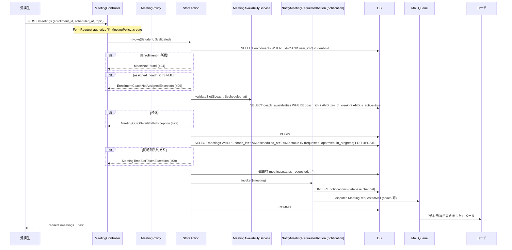
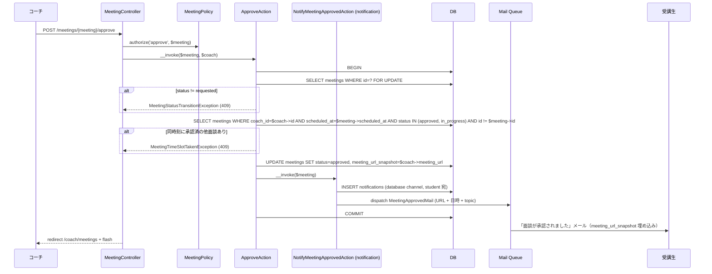
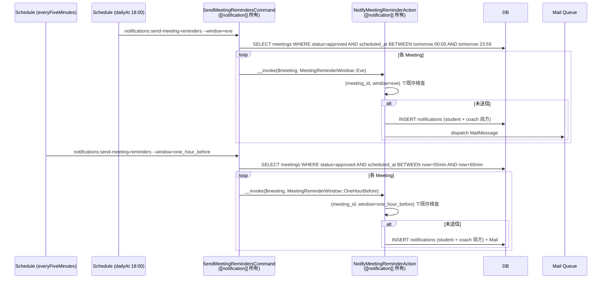
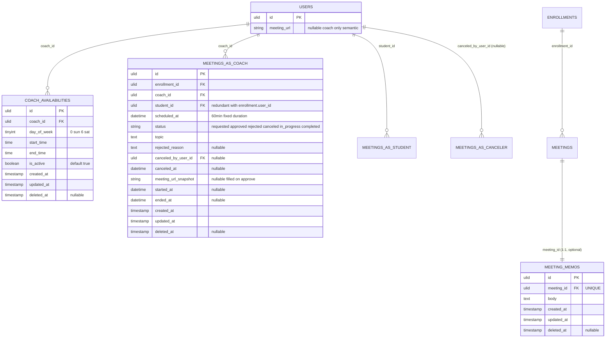
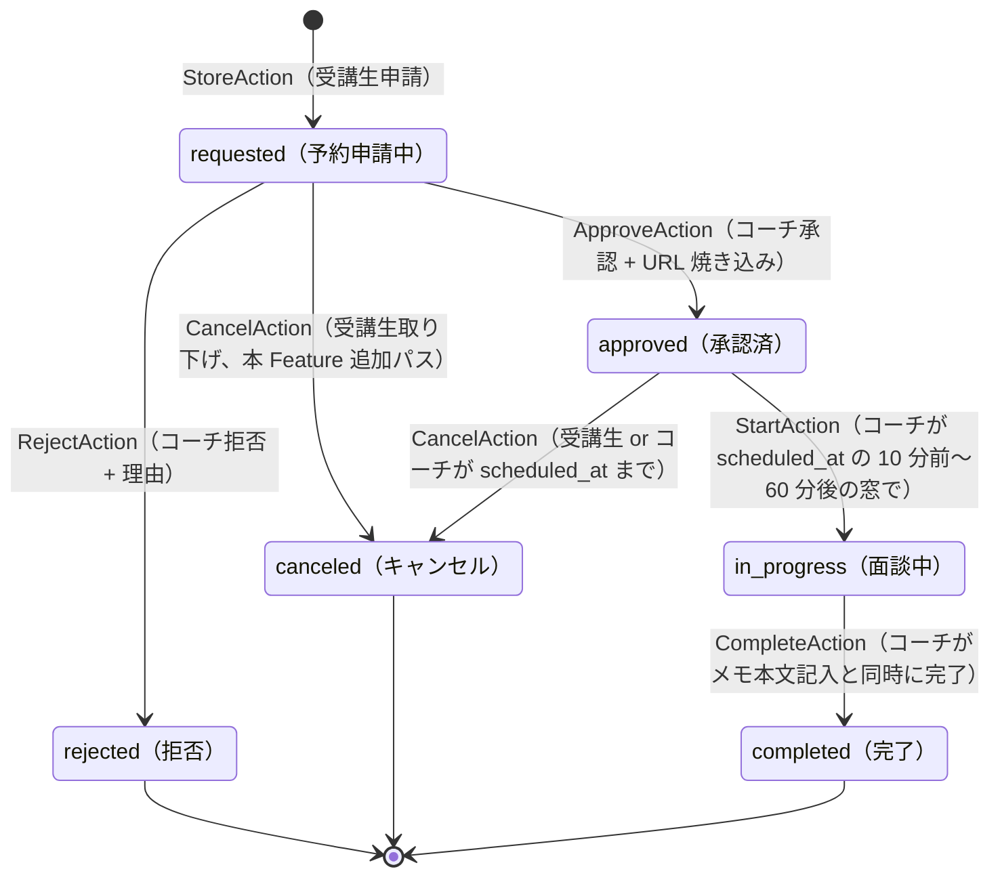

# mentoring 設計

## アーキテクチャ概要

受講生は担当コーチに 60 分単位の面談を申請、コーチは承認 / 拒否 / 実施 / メモ記録、双方は所定タイミングでキャンセル可能。`Meeting` の状態遷移は `product.md` state diagram + `requested → canceled`（受講生取り下げ）を加えた **6 状態 × 7 遷移** で表現される。Controller は薄く、Action（UseCase）が `DB::transaction()` 内で整合性チェック + 状態 UPDATE + [[notification]] 発火を行う。`MeetingAvailabilityService` が「空き枠算出」を Eloquent range クエリで提供し、受講生申請時のバリデーション・GET /meetings/availability JSON エンドポイント・コーチ承認時の race 防止検査で再利用する。

`CoachAvailability` モデルと `CoachAvailabilityPolicy` は本 Feature が所有するが、編集 UI（`/settings/availability`）の Controller / FormRequest / Blade は [[settings-profile]] が所有する。`users.meeting_url` カラムは本 Feature が migration で追加する（`coach.meeting_url` を承認時に `Meeting.meeting_url_snapshot` へ焼き込む）。

### 1. 受講生予約申請 → コーチ通知



### 2. コーチ承認 → URL 焼き込み + 通知



### 3. リマインド Schedule（前日 18 時 + 1h 前、Command は [[notification]] 所有）



> 本 Feature では Reminder 系の独自 Command を所有しない。`SendMeetingRemindersCommand` / `NotifyMeetingReminderAction` / `MeetingReminderWindow` Enum は [[notification]] が所有し、本 Feature は呼出仕様（Meeting テーブルへの SELECT 条件 + window 引数）を共有する責務のみ。

## データモデル

### Eloquent モデル一覧

- **`Meeting`** — 面談予約。`HasUlids` + `SoftDeletes`、`MeetingStatus` enum cast。`belongsTo(Enrollment)` / `belongsTo(User, 'coach_id', 'coach')` / `belongsTo(User, 'student_id', 'student')` / `belongsTo(User, 'canceled_by_user_id', 'canceledBy')`（NULL 許容、`withTrashed()`）/ `hasOne(MeetingMemo)`。スコープ: `scopeUpcoming()`（`status IN (requested, approved, in_progress) AND scheduled_at >= now()`）/ `scopePast()`（残り）/ `scopeForCoach($coachId)` / `scopeForStudent($studentId)`。
- **`MeetingMemo`** — 面談メモ（1 Meeting : 1 Memo）。`HasUlids` + `SoftDeletes`。`belongsTo(Meeting)`。author は `meeting.coach` で一意なので独立カラム不要。
- **`CoachAvailability`** — コーチの面談可能時間枠。`HasUlids` + `SoftDeletes`、`belongsTo(User, 'coach_id', 'coach')`。スコープ: `scopeActive()`（`is_active=true`）/ `scopeForDay($dow)`（曜日フィルタ）。
- **`User`**（[[auth]] 所有、本 Feature が migration で `meeting_url` カラム追加）— `meeting_url` は coach のみ意味を持つ（DB レベルでは全ロール nullable 許容）。本 Feature は `coach.meeting_url` を読むのみ、編集 UI は [[settings-profile]] が所有。

### ER 図



> Mermaid の制約で `users` への 4 つの FK を 1 ER box にまとめにくいため、`MEETINGS_AS_COACH` / `MEETINGS_AS_STUDENT` / `MEETINGS_AS_CANCELER` の名前で分解表記。実テーブルは `meetings` 1 つで `coach_id` / `student_id` / `canceled_by_user_id` の 3 カラム + `enrollment_id` を持つ。

### 主要カラム + Enum

| Model | Enum | 値 | 日本語ラベル |
|---|---|---|---|
| `Meeting.status` | `MeetingStatus` | `Requested` / `Approved` / `Rejected` / `Canceled` / `InProgress` / `Completed` | `予約申請中` / `承認済` / `拒否` / `キャンセル` / `面談中` / `完了` |

> `CoachAvailability.day_of_week` は Enum 化せず tinyint（0-6）で保持。Carbon の `dayOfWeek` と一致（0=日曜）。UI 表示の曜日ラベルは Blade ヘルパ or `lang/ja/mentoring.php` に集約。

### インデックス・制約

- `meetings.(coach_id, scheduled_at)` 複合 INDEX（衝突検知 + コーチ一覧クエリの主軸）
- `meetings.(student_id, scheduled_at)` 複合 INDEX（受講生一覧）
- `meetings.(enrollment_id)` INDEX（resource view からの逆引き）
- `meetings.(status, scheduled_at)` 複合 INDEX（リマインド Schedule Command）
- `meetings.enrollment_id`: 外部キー `->constrained()->restrictOnDelete()`（Enrollment は SoftDeletes なので物理削除されない前提）
- `meetings.coach_id` / `student_id`: 外部キー `->constrained('users')->restrictOnDelete()`
- `meetings.canceled_by_user_id`: 外部キー `->constrained('users')->nullOnDelete()`
- `meeting_memos.meeting_id`: 外部キー UNIQUE `->constrained()->cascadeOnDelete()`（1:1、cascade だが Meeting 自体は SoftDeletes のため通常は発火しない）
- `coach_availabilities.(coach_id, day_of_week)` 複合 INDEX（曜日別検索）
- `coach_availabilities.(coach_id, is_active)` 複合 INDEX（有効枠取得）
- `coach_availabilities.coach_id`: 外部キー `->constrained('users')->cascadeOnDelete()`
- `users.meeting_url`: nullable string（既存 `users` テーブルへ ALTER ADD COLUMN）

## 状態遷移

`product.md` の Meeting state diagram + 本 Feature が追加する `requested → canceled`（受講生取り下げ）パスを併せた完全版を以下に定義する。各遷移は **Action 単位** で一意にトリガされる。



> `product.md` への反映: 本 Feature の実装と同時に `product.md` の Meeting state diagram に `requested --> canceled: 受講生が取り下げ` を追記する（Phase 0 で合意済）。

## コンポーネント

### Controller

`app/Http/Controllers/MeetingController.php`（単一 Controller、ロール別 namespace は使わない / `structure.md` 準拠）。受講生用と coach 用の一覧 method を分離するため `index` と `indexAsCoach` を持つ。それ以外は当事者共通で 1 メソッド = 1 状態遷移。

```php
class MeetingController extends Controller
{
    // student 向け一覧（自分の面談）
    public function index(IndexRequest $request, IndexAction $action) { /* paginate(20) */ }

    // coach 向け一覧（自分宛の面談）
    public function indexAsCoach(IndexAsCoachRequest $request, IndexAsCoachAction $action) { /* paginate(20) */ }

    // 詳細（当事者共通、Policy で view 判定）
    public function show(Meeting $meeting, ShowAction $action) { $this->authorize('view', $meeting); }

    // 予約申請（student のみ）
    public function store(StoreRequest $request, StoreAction $action) { /* MeetingPolicy::create */ }

    // 取り下げ・キャンセル（当事者共通、status で分岐）
    public function cancel(Meeting $meeting, CancelAction $action) { $this->authorize('cancel', $meeting); }

    // 承認（coach のみ）
    public function approve(Meeting $meeting, ApproveAction $action) { $this->authorize('approve', $meeting); }

    // 拒否（coach のみ）
    public function reject(Meeting $meeting, RejectRequest $request, RejectAction $action) { $this->authorize('reject', $meeting); }

    // 入室開始（coach のみ）
    public function start(Meeting $meeting, StartAction $action) { $this->authorize('start', $meeting); }

    // 完了 + メモ作成（coach のみ）
    public function complete(Meeting $meeting, CompleteRequest $request, CompleteAction $action) { $this->authorize('complete', $meeting); }

    // メモ後追い編集（coach のみ）
    public function updateMemo(Meeting $meeting, UpdateMemoRequest $request, UpdateMemoAction $action) { $this->authorize('updateMemo', $meeting); }

    // 申請フォーム表示（student のみ、薄い view 返却）
    public function create() { return view('meetings.create'); }

    // 空き枠取得 JSON（student のみ）
    public function fetchAvailability(AvailabilityRequest $request, FetchAvailabilityAction $action) { /* */ }
}
```

> `cancel` は受講生取り下げ（requested→canceled）と承認後キャンセル（approved→canceled）の 2 パスを `CancelAction` 内で分岐。Controller は薄く、Policy は当事者判定までを担う。

### Action（UseCase）

すべて `app/UseCases/Meeting/` 配下。各 Action は単一トランザクション境界。

#### `StoreAction`

```php
class StoreAction
{
    public function __construct(
        private MeetingAvailabilityService $availability,
        private NotifyMeetingRequestedAction $notifyRequested,
    ) {}

    public function __invoke(User $student, array $validated): Meeting;
}
```

責務: (1) `Enrollment` を `where('user_id', $student->id)->findOrFail($validated['enrollment_id'])` で取得、(2) `Enrollment.assigned_coach_id` 検証（NULL なら `EnrollmentCoachNotAssignedException`）、(3) `MeetingAvailabilityService::validateSlot()` で枠内検証、(4) 同コーチ × 同 `scheduled_at` の `requested/approved/in_progress` 不在検査（`whereExists` + `FOR UPDATE`、衝突時 `MeetingTimeSlotTakenException`）、(5) `Meeting` INSERT、(6) `NotifyMeetingRequestedAction` を呼ぶ。`DB::transaction()` で包む（REQ-mentoring-021〜025, 027）。

#### `ApproveAction`

```php
class ApproveAction
{
    public function __construct(private NotifyMeetingApprovedAction $notifyApproved) {}

    public function __invoke(Meeting $meeting, User $coach): Meeting;
}
```

責務: (1) `Meeting.status === Requested` 検証（NG なら `MeetingStatusTransitionException`）、(2) 同コーチ × 同 `scheduled_at` で `approved/in_progress` の他 Meeting 不在の再検査（race 防止、NG なら `MeetingTimeSlotTakenException`）、(3) `meetings` を `status=Approved` / `meeting_url_snapshot=$coach->meeting_url` に UPDATE、(4) `NotifyMeetingApprovedAction` を呼ぶ。`DB::transaction()` で包む（REQ-mentoring-030, 033）。

> `$coach` は Controller から `auth()->user()` を明示注入。`$meeting->coach_id === $coach->id` の所有検証は `MeetingPolicy::approve` で完結（Action 内では再検査しない、`backend-usecases.md`「認可は Action 内で呼ばない」原則）。

#### `RejectAction`

```php
class RejectAction
{
    public function __construct(private NotifyMeetingRejectedAction $notifyRejected) {}

    public function __invoke(Meeting $meeting, string $rejectedReason): Meeting;
}
```

責務: `status === Requested` 検証 → `status=Rejected` / `rejected_reason=$rejectedReason` UPDATE → 通知。`DB::transaction()`（REQ-mentoring-031）。

#### `CancelAction`

```php
class CancelAction
{
    public function __construct(private NotifyMeetingCanceledAction $notifyCanceled) {}

    public function __invoke(Meeting $meeting, User $actor): Meeting;
}
```

責務: (1) `Meeting.status === Requested || Approved` 検証（他は `MeetingStatusTransitionException`）、(2) `Approved` の場合 `scheduled_at > now()` 検証（NG なら `MeetingAlreadyStartedException`）、(3) `status=Canceled` / `canceled_by_user_id=$actor->id` / `canceled_at=now()` UPDATE、(4) `NotifyMeetingCanceledAction` を呼ぶ（相手方へ通知、`actor` のロールに応じて文面分岐は通知側で処理）。`DB::transaction()`（REQ-mentoring-040, 041, 042, 043）。

> Policy で当事者判定済のため、`actor` は確実に当事者の `coach` か `student`。

#### `StartAction`

```php
class StartAction
{
    public function __invoke(Meeting $meeting): Meeting;
}
```

責務: `status === Approved` 検証 → `scheduled_at - 10min <= now() < scheduled_at + 60min` 検証（NG なら `MeetingNotInStartWindowException`）→ `status=InProgress` / `started_at=now()` UPDATE。`DB::transaction()` 不要（単一 UPDATE）だが規約に倣って囲む（REQ-mentoring-050, 051、NFR-mentoring-001）。

#### `CompleteAction`

```php
class CompleteAction
{
    public function __invoke(Meeting $meeting, string $memoBody): Meeting;
}
```

責務: `status === InProgress` 検証 → `status=Completed` / `ended_at=now()` UPDATE → `MeetingMemo` INSERT（`meeting_id=$meeting->id`, `body=$memoBody`）。`DB::transaction()`（REQ-mentoring-052）。

#### `UpdateMemoAction`

```php
class UpdateMemoAction
{
    public function __invoke(Meeting $meeting, string $memoBody): MeetingMemo;
}
```

責務: `status === Completed` 検証 → 既存 `MeetingMemo.body` を UPDATE。新規作成は許容しない（CompleteAction でのみ作成、`MeetingMemoNotFoundException`）。`DB::transaction()`（REQ-mentoring-053）。

#### `IndexAction`

```php
class IndexAction
{
    public function __invoke(User $student, ?string $filter, int $perPage = 20): LengthAwarePaginator;
}
```

責務: `Meeting::forStudent($student->id)` 起点で `filter ∈ {upcoming, past, all}` でスコープ適用 → `with(['coach', 'enrollment.certification'])` eager load → `orderBy('scheduled_at', 'desc')` → paginate（REQ-mentoring-060）。

#### `IndexAsCoachAction`

```php
class IndexAsCoachAction
{
    public function __invoke(User $coach, ?string $filter, ?string $studentId, ?string $enrollmentId, int $perPage = 20): LengthAwarePaginator;
}
```

責務: `Meeting::forCoach($coach->id)` 起点で同様の filter + 受講生別 / Enrollment 別の追加フィルタ + eager load + paginate（REQ-mentoring-061）。

#### `ShowAction`

```php
class ShowAction
{
    public function __invoke(Meeting $meeting): Meeting;
}
```

責務: `Meeting` に `with(['coach', 'student', 'enrollment.certification', 'meetingMemo'])` eager load。状態に応じた操作可否判定は Blade 側で `MeetingPolicy::cancel/approve/...` を `@can` で参照（REQ-mentoring-062, 063）。

#### `FetchAvailabilityAction`

```php
class FetchAvailabilityAction
{
    public function __construct(private MeetingAvailabilityService $availability) {}

    public function __invoke(Enrollment $enrollment, Carbon $date): Collection;
}
```

責務: (1) `Enrollment.assigned_coach_id` 取得（NULL なら `EnrollmentCoachNotAssignedException`）、(2) `MeetingAvailabilityService::slotsForDate($coach, $date)` を呼んで `Collection<array{slot_start, slot_end}>` を返す（REQ-mentoring-026）。

### Service

`app/Services/` 配下にフラット配置（`structure.md` 準拠）。

#### `MeetingAvailabilityService`

```php
class MeetingAvailabilityService
{
    /**
     * 指定 coach の指定日における 60 分単位の空き開始時刻リストを返す。
     * 各 slot は {slot_start: Carbon, slot_end: Carbon}。
     */
    public function slotsForDate(User $coach, Carbon $date): Collection;

    /**
     * 指定 coach の指定 $scheduled_at（60 分枠の開始時刻）が有効枠内かつ未予約か検証する。
     * 枠外 → MeetingOutOfAvailabilityException、先約あり → MeetingTimeSlotTakenException
     */
    public function validateSlot(User $coach, Carbon $scheduled_at): void;
}
```

責務:
- `slotsForDate`: `CoachAvailability::where('coach_id', $coach->id)->where('day_of_week', $date->dayOfWeek)->where('is_active', true)->get()` で当該曜日の枠を取得 → 各枠を 60 分刻みに展開（例: 09:00-12:00 枠 → 09:00 / 10:00 / 11:00 開始の 3 スロット）→ 同 coach の `where('coach_id', $coach->id)->where('scheduled_at', '>=', $date->startOfDay())->where('scheduled_at', '<', $date->endOfDay())->whereIn('status', ['requested', 'approved', 'in_progress'])->pluck('scheduled_at')` で除外対象を取得 → 差集合を返す
- `validateSlot`: `slotsForDate()` を内部で呼んで `scheduled_at` の含有チェック + 同 coach × 同 `scheduled_at` × `status ∈ {requested, approved, in_progress}` の不在再検査（race を想定し、Action 側の `FOR UPDATE` クエリで最終ガード）

DB トランザクションは持たない（呼び出し側 Action で囲む、`backend-services.md` 準拠）。

#### `CoachActivityService`

```php
class CoachActivityService
{
    /**
     * admin ダッシュボード向けに、各 coach の直近期間の面談実施統計を返す。
     * 戻り値の要素型は `CoachActivitySummaryRow` DTO で固定（[[dashboard]] が型安全に消費）。
     */
    public function summarize(?Carbon $from = null, ?Carbon $to = null): Collection;
}
```

戻り値 DTO（値オブジェクト、readonly class、`app/Services/CoachActivitySummaryRow.php`）:

```php
namespace App\Services;

use App\Models\User;

final readonly class CoachActivitySummaryRow
{
    public function __construct(
        public User $coach,            // 担当コーチ User（with relations: なし、name + email + meeting_url のみ参照）
        public int $completedCount,    // 期間内 completed Meeting 数
        public int $canceledCount,     // 期間内 canceled Meeting 数
        public int $rejectedCount,     // 期間内 rejected Meeting 数
        public ?int $averageMemoLength, // 期間内 completed Meeting の MeetingMemo 平均長（バイト数、null = サンプル無し）
    ) {}
}
```

責務: `from` / `to` のデフォルトは「30 日前 〜 now」。`User::where('role', 'coach')->withCount([...])` で `completed_count` / `canceled_count` / `rejected_count` を集計し、平均メモ長は別クエリ（`MeetingMemo::join('meetings').whereBetween('scheduled_at', ...).selectRaw('coach_id, AVG(CHAR_LENGTH(body))')`）で取得、結果を `CoachActivitySummaryRow` DTO に詰めて返す（REQ-mentoring-090, 091）。

> `User::meetingsAsCoach` リレーション（`hasMany(Meeting, 'coach_id')`）は [[auth]] の `User` モデルに本 Feature で追加する（migration ではなく Model の拡張）。

### Policy

#### `app/Policies/MeetingPolicy.php`

```php
class MeetingPolicy
{
    public function viewAny(User $user): bool
    {
        return in_array($user->role, [UserRole::Admin, UserRole::Coach, UserRole::Student]);
    }

    public function view(User $user, Meeting $meeting): bool
    {
        return match ($user->role) {
            UserRole::Admin => true,
            UserRole::Coach => $meeting->coach_id === $user->id,
            UserRole::Student => $meeting->student_id === $user->id,
        };
    }

    public function create(User $user): bool
    {
        return $user->role === UserRole::Student;
    }

    public function cancel(User $user, Meeting $meeting): bool
    {
        // requested → canceled: student のみ可
        if ($meeting->status === MeetingStatus::Requested) {
            return $user->role === UserRole::Student && $meeting->student_id === $user->id;
        }
        // approved → canceled: 当事者（student or coach）双方
        if ($meeting->status === MeetingStatus::Approved) {
            return $meeting->student_id === $user->id || $meeting->coach_id === $user->id;
        }
        return false;
    }

    public function approve(User $user, Meeting $meeting): bool
    {
        return $user->role === UserRole::Coach && $meeting->coach_id === $user->id;
    }

    public function reject(User $user, Meeting $meeting): bool
    {
        return $this->approve($user, $meeting); // 同条件
    }

    public function start(User $user, Meeting $meeting): bool
    {
        return $this->approve($user, $meeting);
    }

    public function complete(User $user, Meeting $meeting): bool
    {
        return $this->approve($user, $meeting);
    }

    public function updateMemo(User $user, Meeting $meeting): bool
    {
        return $this->approve($user, $meeting) && $meeting->status === MeetingStatus::Completed;
    }
}
```

> 自己コーチング（coach が自分宛の面談を申請する）は `create` で禁止。admin は閲覧のみ、操作系はすべて false。

#### `app/Policies/CoachAvailabilityPolicy.php`

```php
class CoachAvailabilityPolicy
{
    public function viewAny(User $user): bool
    {
        return in_array($user->role, [UserRole::Admin, UserRole::Coach, UserRole::Student]);
    }

    public function view(User $user, CoachAvailability $availability): bool
    {
        return true; // 全ユーザー閲覧可（受講生は予約画面で利用、coach は自分の枠表示）
    }

    public function create(User $user): bool
    {
        return $user->role === UserRole::Coach;
    }

    public function update(User $user, CoachAvailability $availability): bool
    {
        return $user->role === UserRole::Coach && $availability->coach_id === $user->id;
    }

    public function delete(User $user, CoachAvailability $availability): bool
    {
        return $this->update($user, $availability);
    }
}
```

> Policy は本 Feature 所有、利用先（[[settings-profile]] の編集 Controller）から `$this->authorize()` で呼ばれる。

### FormRequest

`app/Http/Requests/Meeting/`:

| FormRequest | rules | authorize |
|---|---|---|
| `Meeting\IndexRequest` | `filter: nullable in:upcoming,past,all` | `auth()->user()->can('viewAny', Meeting::class)` |
| `Meeting\IndexAsCoachRequest` | `filter` 同上 / `student: nullable ulid` / `enrollment: nullable ulid` | 同上 + `role:coach` middleware で限定 |
| `Meeting\StoreRequest` | `enrollment_id: required ulid exists:enrollments,id` / `scheduled_at: required date after:now,regex:/:00:00\|:30:00$/` / `topic: required string max:1000` | `auth()->user()->can('create', Meeting::class)` |
| `Meeting\RejectRequest` | `rejected_reason: required string max:500` | `auth()->user()->can('reject', $this->route('meeting'))` |
| `Meeting\CompleteRequest` | `body: required string max:5000` | `auth()->user()->can('complete', $this->route('meeting'))` |
| `Meeting\UpdateMemoRequest` | `body: required string max:5000` | `auth()->user()->can('updateMemo', $this->route('meeting'))` |
| `Meeting\AvailabilityRequest` | `enrollment: required ulid exists:enrollments,id` / `date: required date_format:Y-m-d after_or_equal:today` | `auth()->user()->can('create', Meeting::class)` |

> `scheduled_at` の分単位制約は `regex:/^\d{4}-\d{2}-\d{2}T\d{2}:(00\|30):00.*$/` で 30 分刻みのみ許容（REQ-mentoring-023）。

### Route

`routes/web.php` に追加。`auth` + ロール別 middleware で保護。

```php
// student 専用
Route::middleware(['auth', 'role:student'])->group(function () {
    Route::get('/meetings', [MeetingController::class, 'index'])->name('meetings.index');
    Route::get('/meetings/create', [MeetingController::class, 'create'])->name('meetings.create'); // 申請フォーム表示
    Route::post('/meetings', [MeetingController::class, 'store'])->name('meetings.store');
    Route::get('/meetings/availability', [MeetingController::class, 'fetchAvailability'])->name('meetings.availability');
});

// coach 専用
Route::middleware(['auth', 'role:coach'])->prefix('coach')->group(function () {
    Route::get('/meetings', [MeetingController::class, 'indexAsCoach'])->name('coach.meetings.index');
    Route::post('/meetings/{meeting}/approve', [MeetingController::class, 'approve'])->name('coach.meetings.approve');
    Route::post('/meetings/{meeting}/reject', [MeetingController::class, 'reject'])->name('coach.meetings.reject');
    Route::post('/meetings/{meeting}/start', [MeetingController::class, 'start'])->name('coach.meetings.start');
    Route::post('/meetings/{meeting}/complete', [MeetingController::class, 'complete'])->name('coach.meetings.complete');
    Route::put('/meetings/{meeting}/memo', [MeetingController::class, 'updateMemo'])->name('coach.meetings.updateMemo');
});

// 当事者共通（show / cancel）
Route::middleware(['auth'])->group(function () {
    Route::get('/meetings/{meeting}', [MeetingController::class, 'show'])->name('meetings.show');
    Route::post('/meetings/{meeting}/cancel', [MeetingController::class, 'cancel'])->name('meetings.cancel');
});
```

> `meetings.create` は申請フォーム表示用。`@vite('resources/js/mentoring/availability-picker.js')` で空き枠取得 JS を読み込む。

### Schedule Command

**本 Feature では独自の Reminder Command を所有しない**。`SendMeetingRemindersCommand`（signature: `notifications:send-meeting-reminders {--window=eve|one_hour_before}`）と `NotifyMeetingReminderAction(Meeting $meeting, MeetingReminderWindow $window)` および `MeetingReminderWindow` Enum はすべて [[notification]] が所有する。

本 Feature が共有するのは以下の仕様契約のみ:

- 抽出条件: `Meeting::where('status', MeetingStatus::Approved)->whereBetween('scheduled_at', [...])` の `whereBetween` 範囲を window 別に分岐
  - `MeetingReminderWindow::Eve`: `[now()->addDay()->startOfDay(), now()->addDay()->endOfDay()]`
  - `MeetingReminderWindow::OneHourBefore`: `[now()->addMinutes(55), now()->addMinutes(65)]`
- 重複排除: `(meeting_id, window)` ペアで `notifications.data` JSON カラムを `whereJsonContains` で検査（[[notification]] 側責務）
- スケジュール頻度: `dailyAt('18:00')`（eve）+ `everyFiveMinutes()`（one_hour_before）

> 詳細は [[notification]] design.md の「Schedule Command」セクション参照。

## Blade ビュー

`resources/views/meetings/`（student / 共通）と `resources/views/coach/meetings/`（coach 一覧）に配置。

| ファイル | 役割 |
|---|---|
| `meetings/index.blade.php` | 受講生の面談一覧（filter タブ: upcoming/past/all、ステータスバッジ、行クリックで詳細） |
| `meetings/create.blade.php` | 予約申請フォーム（Enrollment 選択 → 日付選択 → 空き枠選択 → topic 入力）。空き枠は `resources/js/mentoring/availability-picker.js` で `/meetings/availability` を fetch して描画 |
| `meetings/show.blade.php` | 当事者共通詳細。状態に応じた操作ボタン（取り下げ / キャンセル / 承認 / 拒否 / 入室 / 完了 / メモ編集）を `@can` で出し分け。`MeetingMemo` は `completed` 時のみ表示 |
| `meetings/_partials/status-badge.blade.php` | ステータスバッジ（`<x-badge variant="...">` を `MeetingStatus.label()` で動的描画） |
| `meetings/_modals/reject-form.blade.php` | 拒否理由入力モーダル（`<x-modal id="reject-modal">`、`<x-form.textarea name="rejected_reason">`） |
| `meetings/_modals/complete-form.blade.php` | 完了 + メモ記入モーダル（`<x-modal id="complete-modal">`、`<x-form.textarea name="body" maxlength="5000">`） |
| `meetings/_modals/cancel-confirm.blade.php` | キャンセル確認モーダル |
| `coach/meetings/index.blade.php` | コーチの面談一覧（filter タブ + 受講生別 / 資格別フィルタ） |
| `emails/meeting-requested.blade.php` | コーチ宛: 「申請が届きました」Markdown Mailable |
| `emails/meeting-approved.blade.php` | 受講生宛: 「承認されました」+ `meeting_url_snapshot` + 日時 + topic |
| `emails/meeting-rejected.blade.php` | 受講生宛: 「拒否されました」+ `rejected_reason` |
| `emails/meeting-canceled.blade.php` | 相手方宛: 「キャンセルされました」+ canceler ロール |
| `emails/meeting-reminder.blade.php` | 双方宛: リマインド（前日 18:00 / 1 時間前） |

> Email Blade は本 Feature 配下に置くが、Mailable クラス自体は [[notification]] が所有（`Notification` channel + `MailMessage` から本 Blade を `markdown(...)` で参照）。

### 主要 Blade コンポーネント参照

[frontend-blade.md](../../.claude/rules/frontend-blade.md) の「共通コンポーネント API」を利用。

- `<x-button variant="primary|outline|danger|ghost">` — 操作ボタン
- `<x-badge variant="...">` — ステータス表示
- `<x-card>` — 面談詳細カード
- `<x-modal id="...">` — 拒否 / 完了 / キャンセル確認モーダル
- `<x-form.textarea>` / `<x-form.input>` / `<x-form.select>` / `<x-form.error>` — フォーム
- `<x-tabs>` — filter タブ（upcoming / past / all）
- `<x-table>` — 一覧テーブル
- `<x-paginator>` — ページネーション
- `<x-empty-state icon="calendar-days" title="...">` — 0 件時

## エラーハンドリング

### 想定例外（`app/Exceptions/Mentoring/`）

- **`MeetingOutOfAvailabilityException`** — `HttpException(422)` 継承
  - メッセージ: 「指定の日時はコーチの面談可能時間外です。」
  - 発生: `StoreAction` の `MeetingAvailabilityService::validateSlot()` で枠外検出時
- **`MeetingTimeSlotTakenException`** — `ConflictHttpException(409)` 継承
  - メッセージ: 「指定の日時は既に予約が入っています。別の時間を選んでください。」
  - 発生: `StoreAction` / `ApproveAction` で同コーチ × 同 `scheduled_at` の他 Meeting 検出時
- **`MeetingStatusTransitionException`** — `ConflictHttpException(409)` 継承
  - メッセージ: 「現在の面談状態ではこの操作を実行できません。」
  - 発生: `ApproveAction` / `RejectAction` / `CancelAction` / `StartAction` / `CompleteAction` / `UpdateMemoAction` で前提状態違反時
- **`MeetingNotInStartWindowException`** — `ConflictHttpException(409)` 継承
  - メッセージ: 「入室可能な時間帯ではありません（開始 10 分前から終了予定までの間に入室してください）。」
  - 発生: `StartAction` で `scheduled_at - 10min <= now() < scheduled_at + 60min` 範囲外時
- **`MeetingAlreadyStartedException`** — `ConflictHttpException(409)` 継承
  - メッセージ: 「面談開始時刻を過ぎているためキャンセルできません。」
  - 発生: `CancelAction` で `approved` 状態かつ `scheduled_at <= now()` 時
- **`EnrollmentCoachNotAssignedException`** — `ConflictHttpException(409)` 継承
  - メッセージ: 「この資格にはまだ担当コーチが割り当てられていません。管理者へお問い合わせください。」
  - 発生: `StoreAction` / `FetchAvailabilityAction` で `Enrollment.assigned_coach_id IS NULL` 時
- **`MeetingMemoNotFoundException`** — `NotFoundHttpException(404)` 継承
  - メッセージ: 「面談メモが見つかりません。」
  - 発生: `UpdateMemoAction` で MeetingMemo 不在時（理論上は CompleteAction で必ず作成されるため、整合性違反時の防衛例外）

### Controller / Action の境界

- **Policy 違反** は Controller の `$this->authorize()` または FormRequest の `authorize()` で `AuthorizationException`（403）として処理。Action では再検査しない（`backend-usecases.md` 準拠）
- **状態整合性違反**（status 不一致 / 時刻範囲外 / FK 未存在）は Action 内で具象ドメイン例外を throw
- **race condition** は `DB::transaction()` + `FOR UPDATE` ロック + 例外時の自動 ROLLBACK で防御

### 共通エラー表示

- ドメイン例外 → `app/Exceptions/Handler.php` で `HttpException` 系を catch し `session()->flash('error', $e->getMessage())` + `back()` で受講生 / コーチに表示
- FormRequest バリデーション失敗 → Laravel 標準の `back()->withErrors()` → Blade で `@error` 表示

## 関連要件マッピング

| 要件ID | 実装ポイント |
|---|---|
| REQ-mentoring-001 | `database/migrations/{date}_create_meetings_table.php` / `app/Models/Meeting.php` / `app/Enums/MeetingStatus.php` |
| REQ-mentoring-002 | `app/Enums/MeetingStatus.php`（label() 含む）|
| REQ-mentoring-003 | `app/Models/Meeting.php`（5 リレーション）|
| REQ-mentoring-004 | `database/migrations/{date}_create_meetings_table.php`（INDEX 定義）|
| REQ-mentoring-010 | `database/migrations/{date}_create_coach_availabilities_table.php` / `app/Models/CoachAvailability.php` |
| REQ-mentoring-011 | `database/migrations/{date}_create_coach_availabilities_table.php`（INDEX 定義）|
| REQ-mentoring-012 | 同上（複合 UNIQUE を採用しない）|
| REQ-mentoring-013 | `app/Http/Requests/Settings/Availability/StoreRequest.php`（[[settings-profile]] 所有、`end_time > start_time` ルール）|
| REQ-mentoring-014 | `database/migrations/{date}_add_meeting_url_to_users_table.php` |
| REQ-mentoring-015 | `database/migrations/{date}_create_meeting_memos_table.php` / `app/Models/MeetingMemo.php`（`meeting_id` UNIQUE）|
| REQ-mentoring-016 | `app/Models/MeetingMemo.php`（belongsTo Meeting）|
| REQ-mentoring-020 | `app/Http/Requests/Meeting/StoreRequest.php`（rules）|
| REQ-mentoring-021 | `app/UseCases/Meeting/StoreAction.php` / `app/Services/MeetingAvailabilityService.php::validateSlot` |
| REQ-mentoring-022 | `app/Exceptions/Mentoring/MeetingOutOfAvailabilityException.php` |
| REQ-mentoring-023 | `app/Http/Requests/Meeting/StoreRequest.php`（regex で `:00\|:30` 検証）|
| REQ-mentoring-024 | 同上（`after:now`）|
| REQ-mentoring-025 | `app/Exceptions/Mentoring/EnrollmentCoachNotAssignedException.php` |
| REQ-mentoring-026 | `app/UseCases/Meeting/FetchAvailabilityAction.php` / `app/Services/MeetingAvailabilityService.php::slotsForDate` / `routes/web.php`（`meetings.availability`）|
| REQ-mentoring-027 | `app/UseCases/Meeting/StoreAction.php`（`FOR UPDATE` 検査）/ `app/Exceptions/Mentoring/MeetingTimeSlotTakenException.php` |
| REQ-mentoring-030 | `app/UseCases/Meeting/ApproveAction.php` / `app/UseCases/Notification/NotifyMeetingApprovedAction.php`（[[notification]] 所有）|
| REQ-mentoring-031 | `app/UseCases/Meeting/RejectAction.php` / `app/Http/Requests/Meeting/RejectRequest.php` |
| REQ-mentoring-032 | `app/Exceptions/Mentoring/MeetingStatusTransitionException.php`（各 Action から throw）|
| REQ-mentoring-033 | `app/UseCases/Meeting/ApproveAction.php`（race 防止再検査）|
| REQ-mentoring-040 | `app/UseCases/Meeting/CancelAction.php`（requested 分岐）|
| REQ-mentoring-041 | `app/Exceptions/Mentoring/MeetingStatusTransitionException.php` |
| REQ-mentoring-042 | `app/UseCases/Meeting/CancelAction.php`（approved 分岐）|
| REQ-mentoring-043 | `app/Exceptions/Mentoring/MeetingAlreadyStartedException.php` |
| REQ-mentoring-050 | `app/UseCases/Meeting/StartAction.php` |
| REQ-mentoring-051 | `app/Exceptions/Mentoring/MeetingNotInStartWindowException.php` |
| REQ-mentoring-052 | `app/UseCases/Meeting/CompleteAction.php` / `app/Http/Requests/Meeting/CompleteRequest.php` |
| REQ-mentoring-053 | `app/UseCases/Meeting/UpdateMemoAction.php` / `app/Http/Requests/Meeting/UpdateMemoRequest.php` / `app/Exceptions/Mentoring/MeetingMemoNotFoundException.php` |
| REQ-mentoring-054 | `app/Policies/MeetingPolicy.php`（updateMemo は coach のみ）+ Blade（受講生には編集ボタン非表示）|
| REQ-mentoring-060 | `app/UseCases/Meeting/IndexAction.php` / `resources/views/meetings/index.blade.php` |
| REQ-mentoring-061 | `app/UseCases/Meeting/IndexAsCoachAction.php` / `resources/views/coach/meetings/index.blade.php` |
| REQ-mentoring-062 | `app/UseCases/Meeting/ShowAction.php` / `resources/views/meetings/show.blade.php` |
| REQ-mentoring-063 | `resources/views/meetings/show.blade.php`（`@if($meeting->status === Completed && $meeting->meetingMemo)` で表示）|
| REQ-mentoring-064 | `app/Models/Meeting.php`（`scopeUpcoming()`、[[dashboard]] が利用）|
| REQ-mentoring-070 | 各 Action の通知呼出 + [[notification]] 側の `NotifyMeeting*Action`（5 種類）|
| REQ-mentoring-071 | `app/Console/Commands/Mentoring/RemindUpcomingMeetingsCommand.php` / `app/Console/Kernel.php::schedule()`（`cron('*/15 * * * *')`）|
| REQ-mentoring-072 | `app/Console/Commands/Mentoring/RemindEveMeetingsCommand.php` / `app/Console/Kernel.php::schedule()`（`dailyAt('18:00')`）|
| REQ-mentoring-073 | `resources/views/emails/meeting-approved.blade.php` |
| REQ-mentoring-080 | `app/Policies/MeetingPolicy.php`（9 メソッド） / `AuthServiceProvider::$policies` |
| REQ-mentoring-081 | `app/Policies/CoachAvailabilityPolicy.php`（5 メソッド） / `AuthServiceProvider::$policies` |
| REQ-mentoring-090 | `app/Services/CoachActivityService.php::summarize` |
| REQ-mentoring-091 | [[dashboard]] が `CoachActivityService` を DI で利用（mentoring 側で provider 登録は不要、Laravel 標準 service container）|
| NFR-mentoring-001 | 各 Action 内 `DB::transaction()` |
| NFR-mentoring-002 | 各 Action 冒頭の `Meeting.status` 検証 + `MeetingStatusTransitionException` |
| NFR-mentoring-003 | `StoreAction` + `ApproveAction` の `FOR UPDATE` 検査 + `MeetingTimeSlotTakenException` |
| NFR-mentoring-004 | `app/Exceptions/Mentoring/*.php`（7 種類）|
| NFR-mentoring-005 | `app/Models/Meeting.php`（`scheduled_at` のみ保持、duration は固定 60 分でコード内 const）|
| NFR-mentoring-006 | `lang/ja/mentoring.php` / 各例外コンストラクタ |
| NFR-mentoring-007 | `MeetingAvailabilityService::slotsForDate`（2 クエリ完結、eager load 前提）|
