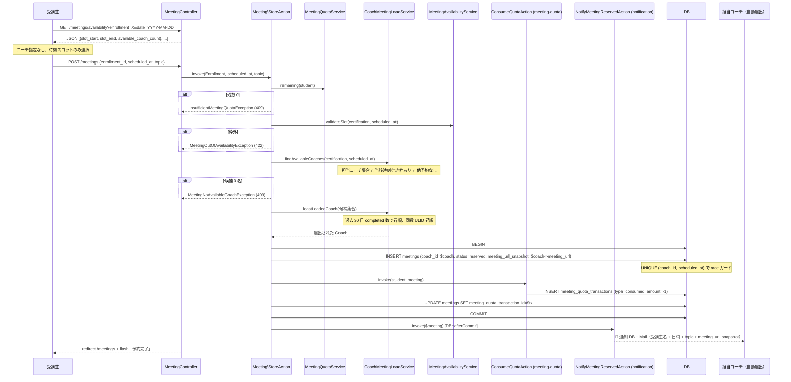
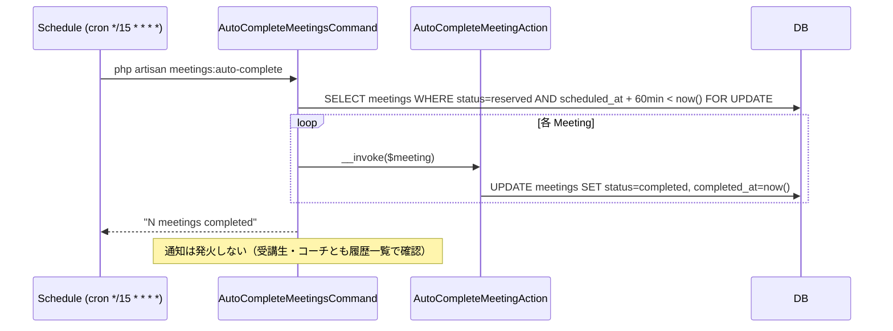
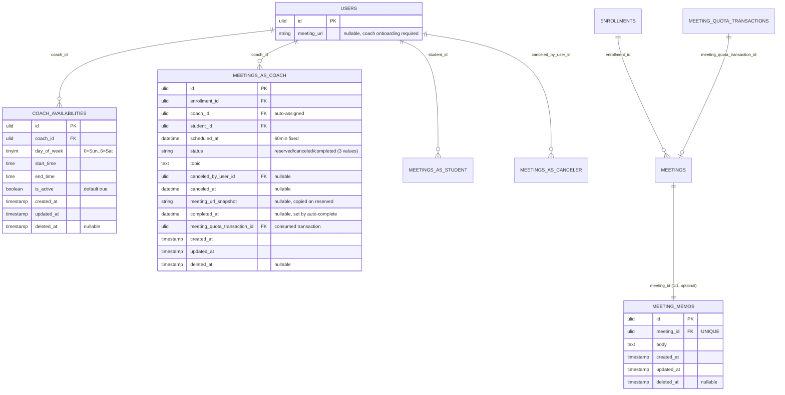
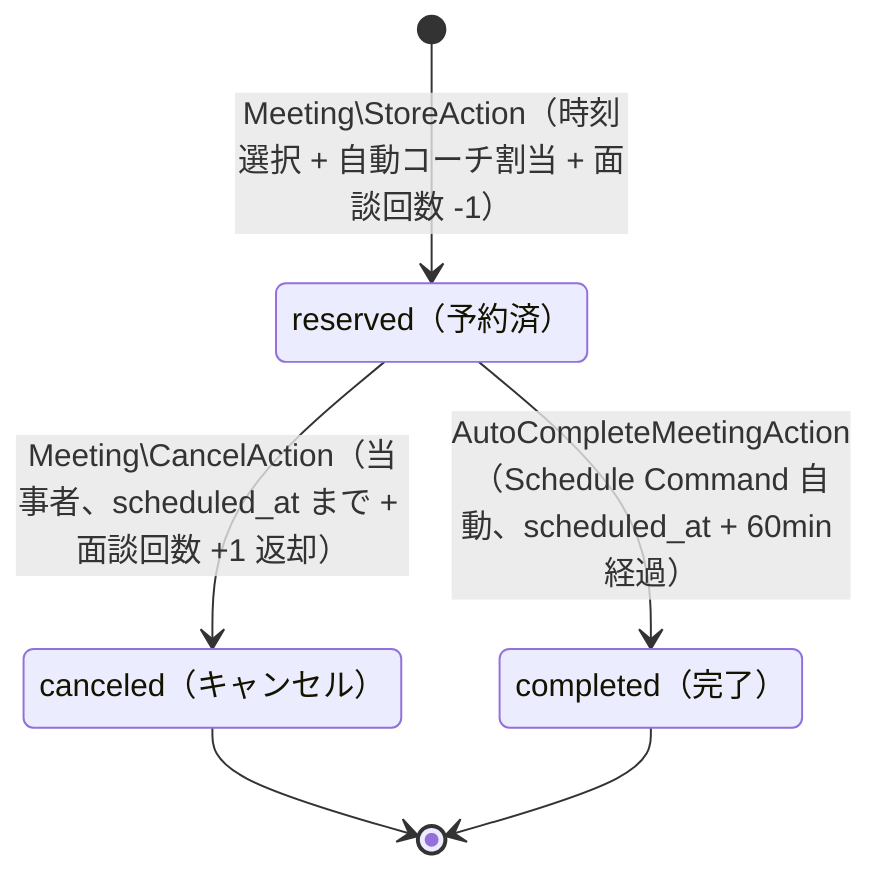

# mentoring 設計

> **v3 改修反映**（2026-05-16）: 申請・承認・拒否フロー撤回 → **自動コーチ割当**（過去 30 日実施数最少）、`Meeting.status` 6 値 → 3 値（`reserved` / `canceled` / `completed`）、`meetings:auto-complete` Schedule Command で時刻ベース自動完了、面談回数消費は [[meeting-quota]] と連携（`reserved` で `consumed`、`canceled` で `refunded`）、受講生宛通知撤回（コーチ宛のみ）、臨時シフト不採用、`EnsureActiveLearning` Middleware で `graduated` ロック。

## アーキテクチャ概要

受講生は時刻スロットだけを選択 → `CoachMeetingLoadService` が担当資格コーチ集合のうち過去 30 日実施数最少のコーチを自動割当 → `reserved` で即時確定 + 面談回数 -1 消費 + 担当コーチ宛通知。承認・拒否フローは存在せず、運用負荷を削減（COACHTECH LMS 流のドライ運用）。時刻が終了予定（`scheduled_at + 60min`）を過ぎると `meetings:auto-complete` Schedule Command が `completed` 自動遷移。コーチが任意のタイミングで `MeetingMemo` を記録。当事者は終了予定前まで `canceled` 化可能（同時に面談回数 +1 返却）。

`CoachAvailability` モデルと `CoachAvailabilityPolicy` は本 Feature が所有するが、**編集 UI**（`/settings/availability`）の Controller / FormRequest / Blade は [[settings-profile]] が所有する。**`users.meeting_url` カラムの Migration は [[auth]] が所有**（D4 確定）、本 Feature は読み取り側として `Meeting\StoreAction` で `meeting_url_snapshot` に焼き込む。コーチオンボーディング時の必須入力は [[auth]] の `OnboardAction` で担保。

### 1. 受講生の予約フロー（自動コーチ割当）



### 2. キャンセル（当事者、時刻前まで、D1 で通知撤回）

```mermaid
sequenceDiagram
    participant Actor as 受講生 or コーチ
    participant MC as MeetingController
    participant CA as Meeting\CancelAction
    participant RQA as RefundQuotaAction
    participant DB

    Actor->>MC: POST /meetings/{meeting}/cancel
    MC->>CA: __invoke meeting actor
    CA->>DB: BEGIN
    CA->>DB: SELECT meetings FOR UPDATE
    alt status != reserved
        CA-->>MC: MeetingStatusTransitionException 409
    end
    alt scheduled_at <= now
        CA-->>MC: MeetingAlreadyStartedException 409
    end
    CA->>DB: UPDATE meetings SET status=canceled canceled_by_user_id canceled_at
    CA->>RQA: __invoke meeting
    RQA->>DB: INSERT meeting_quota_transactions type=refunded amount=+1
    CA->>DB: COMMIT
    Note over CA: D1 で MeetingCanceledNotification 撤回<br/>当事者の dashboard 面談一覧で確認するモデル
    MC-->>Actor: redirect + flash
```

### 3. 自動完了（Schedule Command、15 分間隔）



### 4. リマインド（Schedule Command、[[notification]] が所有）

`meetings:remind`（cron `*/15 * * * *`、1 時間前）と `meetings:remind-eve`（`dailyAt('18:00')`、前日）は [[notification]] が所有。本 Feature は抽出条件 `Meeting::where('status', Reserved)->whereBetween('scheduled_at', [...])` の仕様を提供する。重複排除は `(meeting_id, window)` ペアで [[notification]] 側 `data` JSON に対する検査。当事者双方（受講生 + コーチ）に通知。

## データモデル

### Eloquent モデル一覧

- **`Meeting`** — 面談予約。`HasUlids` + `SoftDeletes`、`MeetingStatus` enum cast。リレーション 6 つ: `belongsTo(Enrollment)` / `belongsTo(User, 'coach_id', 'coach')` / `belongsTo(User, 'student_id', 'student')` / `belongsTo(User, 'canceled_by_user_id', 'canceledBy')`（NULL 許容、`withTrashed()`）/ `hasOne(MeetingMemo)` / `belongsTo(MeetingQuotaTransaction, 'meeting_quota_transaction_id')`。スコープ: `scopeUpcoming()`（`status = reserved AND scheduled_at >= now()`）/ `scopePast()`（残り）/ `scopeForCoach($coachId)` / `scopeForStudent($studentId)`。
- **`MeetingMemo`** — 面談メモ（1 Meeting : 1 Memo）。`HasUlids` + `SoftDeletes`、`belongsTo(Meeting)`。author は `meeting.coach` で一意。
- **`CoachAvailability`** — コーチの面談可能時間枠。`HasUlids` + `SoftDeletes`、`belongsTo(User, 'coach_id', 'coach')`。スコープ: `scopeActive()` / `scopeForDay($dow)`。
- **`User`**（[[auth]] 所有、`meeting_url` カラムは [[auth]] の Migration で追加、本 Feature は読み取り側）— `meeting_url` は role=coach のみ意味、オンボーディング時必須入力。

### ER 図



> v3 で削除されたカラム: `rejected_reason` / `started_at` / `ended_at`（申請承認 + 入室手動操作撤回のため）。v3 で追加: `completed_at` / `meeting_quota_transaction_id`。

### Enum

| Model | Enum | 値 | 日本語ラベル |
|---|---|---|---|
| `Meeting.status` | `MeetingStatus` | `Reserved` / `Canceled` / `Completed` | `予約済` / `キャンセル` / `完了` |

### インデックス・制約

- **`meetings.(coach_id, scheduled_at)` UNIQUE**（DB 制約で二重予約防止、race condition は INSERT 失敗で検知）
- `meetings.(student_id, scheduled_at)` 複合 INDEX
- `meetings.(enrollment_id)` INDEX
- `meetings.(status, scheduled_at)` 複合 INDEX（`meetings:auto-complete` / `meetings:remind` 高速化）
- `meetings.enrollment_id`: FK `->constrained()->restrictOnDelete()`
- `meetings.coach_id` / `student_id`: FK `->constrained('users')->restrictOnDelete()`
- `meetings.canceled_by_user_id`: FK `->constrained('users')->nullOnDelete()`
- `meetings.meeting_quota_transaction_id`: FK `->constrained('meeting_quota_transactions')->nullOnDelete()`
- `meeting_memos.meeting_id`: FK UNIQUE `->constrained()->cascadeOnDelete()`
- `coach_availabilities.(coach_id, day_of_week)` / `(coach_id, is_active)` 複合 INDEX
- `coach_availabilities.coach_id`: FK `->constrained('users')->cascadeOnDelete()`
- `users.meeting_url`: **[[auth]] の Migration で追加**（D4 確定、本 Feature では作成しない）

## 状態遷移



> v3 で撤回された遷移: `requested` / `approved` / `rejected` / `in_progress` の 4 状態と関連遷移すべて。LMS 内に「面談中」状態は持たず、外部ツール（Google Meet 等）での実施に委ねる。

## コンポーネント

### Controller

`app/Http/Controllers/MeetingController.php`（受講生用と coach 用の一覧 method を分離するため `index` と `indexAsCoach` を持つ）。

```php
class MeetingController extends Controller
{
    // student 向け一覧（自分の面談）
    public function index(IndexRequest $request, IndexAction $action);

    // coach 向け一覧（自分宛の面談）
    public function indexAsCoach(IndexAsCoachRequest $request, IndexAsCoachAction $action);

    // 詳細（当事者共通、Policy で view 判定）
    public function show(Meeting $meeting, ShowAction $action);

    // 予約申請（student のみ）
    public function store(StoreRequest $request, Meeting\StoreAction $action);

    // キャンセル（当事者共通）
    public function cancel(Meeting $meeting, Meeting\CancelAction $action);

    // メモ記録 / 編集（coach のみ、reserved/completed どちらでも可）
    public function upsertMemo(Meeting $meeting, UpsertMemoRequest $request, UpsertMemoAction $action);

    // 申請フォーム表示（student のみ）
    public function create();

    // 空き枠取得 JSON（student のみ）
    public function fetchAvailability(AvailabilityRequest $request, FetchAvailabilityAction $action);
}
```

> v3 で削除: `approve` / `reject` / `start` / `complete`（申請承認フロー撤回 + 入室手動操作撤回）。`upsertMemo` で完了概念を吸収（コーチがいつでも記録可）。

### Action（UseCase）

`app/UseCases/Meeting/` 配下。すべて `DB::transaction()` 境界。

#### `Meeting\StoreAction`（v3 新規、自動コーチ割当、`MeetingController::store` と一致)

```php
namespace App\UseCases\Meeting;

class StoreAction
{
    public function __construct(
        private MeetingAvailabilityService $availability,
        private CoachMeetingLoadService $coachLoad,
        private MeetingQuotaService $quotaService,
        private ConsumeQuotaAction $consumeAction,
    ) {}

    public function __invoke(Enrollment $enrollment, Carbon $scheduledAt, string $topic): Meeting
    {
        return DB::transaction(function () use ($enrollment, $scheduledAt, $topic) {
            $student = $enrollment->user;

            // 1. 受講生本人性
            if ($enrollment->user_id !== auth()->id()) throw new AuthorizationException();

            // 2. 残面談回数
            if ($this->quotaService->remaining($student) < 1) {
                throw new InsufficientMeetingQuotaException();
            }

            // 3. 枠内検証（資格コーチ集合の Union）
            $this->availability->validateSlot($enrollment->certification, $scheduledAt);

            // 4. 空きコーチ集合 → 最少実施数コーチ選出
            $candidates = $this->findAvailableCoaches($enrollment->certification, $scheduledAt);
            if ($candidates->isEmpty()) throw new MeetingNoAvailableCoachException();
            $coach = $this->coachLoad->leastLoadedCoach($candidates);

            // 5. Meeting INSERT (UNIQUE 制約で race 防止)
            try {
                $meeting = Meeting::create([
                    'enrollment_id' => $enrollment->id,
                    'coach_id' => $coach->id,
                    'student_id' => $student->id,
                    'scheduled_at' => $scheduledAt,
                    'status' => MeetingStatus::Reserved,
                    'topic' => $topic,
                    'meeting_url_snapshot' => $coach->meeting_url,
                ]);
            } catch (\Illuminate\Database\UniqueConstraintViolationException) {
                throw new MeetingNoAvailableCoachException(); // race condition
            }

            // 6. 面談回数消費
            $transaction = ($this->consumeAction)($student, $meeting);
            $meeting->update(['meeting_quota_transaction_id' => $transaction->id]);

            // 7. コーチ宛通知（DB::afterCommit で送信）
            DB::afterCommit(fn () => app(NotifyMeetingReservedAction::class)($meeting));

            return $meeting;
        });
    }

    private function findAvailableCoaches(Certification $certification, Carbon $scheduledAt): Collection
    {
        return $certification->coaches() // certification_coach_assignments 経由
            ->whereHas('coachAvailabilities', function ($q) use ($scheduledAt) {
                $q->where('day_of_week', $scheduledAt->dayOfWeek)
                  ->where('is_active', true)
                  ->whereTime('start_time', '<=', $scheduledAt->format('H:i:s'))
                  ->whereTime('end_time', '>', $scheduledAt->format('H:i:s'));
            })
            ->whereDoesntHave('meetingsAsCoach', function ($q) use ($scheduledAt) {
                $q->where('scheduled_at', $scheduledAt)
                  ->whereIn('status', [MeetingStatus::Reserved, MeetingStatus::Completed]);
            })
            ->get();
    }
}
```

#### `Meeting\CancelAction`（`MeetingController::cancel` と一致)

```php
namespace App\UseCases\Meeting;

class CancelAction
{
    public function __construct(
        private RefundQuotaAction $refundAction,
        private NotifyMeetingCanceledAction $notifyCanceled,
    ) {}

    public function __invoke(Meeting $meeting, User $actor): Meeting
    {
        return DB::transaction(function () use ($meeting, $actor) {
            $meeting->lockForUpdate();
            if ($meeting->status !== MeetingStatus::Reserved) {
                throw new MeetingStatusTransitionException();
            }
            if ($meeting->scheduled_at <= now()) {
                throw new MeetingAlreadyStartedException();
            }

            $meeting->update([
                'status' => MeetingStatus::Canceled,
                'canceled_by_user_id' => $actor->id,
                'canceled_at' => now(),
            ]);

            ($this->refundAction)($meeting);

            DB::afterCommit(fn () => ($this->notifyCanceled)($meeting, $actor));

            return $meeting->fresh();
        });
    }
}
```

#### `AutoCompleteMeetingAction`（Schedule Command から呼ばれる）

```php
class AutoCompleteMeetingAction
{
    public function __invoke(Meeting $meeting): Meeting
    {
        return DB::transaction(function () use ($meeting) {
            $meeting->lockForUpdate();
            if ($meeting->status !== MeetingStatus::Reserved) return $meeting;

            $meeting->update([
                'status' => MeetingStatus::Completed,
                'completed_at' => now(),
            ]);
            return $meeting;
        });
    }
}
```

#### `UpsertMemoAction`（coach のみ、reserved/completed どちらでも可）

```php
class UpsertMemoAction
{
    public function __invoke(Meeting $meeting, string $body): MeetingMemo
    {
        return DB::transaction(function () use ($meeting, $body) {
            if (!in_array($meeting->status, [MeetingStatus::Reserved, MeetingStatus::Completed])) {
                throw new MeetingStatusTransitionException();
            }
            return MeetingMemo::updateOrCreate(
                ['meeting_id' => $meeting->id],
                ['body' => $body]
            );
        });
    }
}
```

#### `IndexAction` / `IndexAsCoachAction` / `ShowAction` / `FetchAvailabilityAction`

責務は v2 設計を踏襲。ただし以下を変更:
- `IndexAction` の filter: `upcoming = reserved`、`past = canceled | completed`
- `FetchAvailabilityAction` は `Enrollment.certification` の **担当コーチ集合** に対する Union で空き枠を計算（個別コーチではない、JSON は `{slot_start, slot_end, available_coach_count}` 配列を返す）

### Service

#### `MeetingAvailabilityService`（v3 で資格コーチ集合対応）

```php
class MeetingAvailabilityService
{
    /**
     * 指定 certification の担当コーチ集合の指定日における 60 分単位の空きスロットを返す（Union）。
     * 戻り値: Collection<['slot_start' => Carbon, 'slot_end' => Carbon, 'available_coach_count' => int]>
     */
    public function slotsForCertification(Certification $certification, Carbon $date): Collection;

    /**
     * 指定 scheduled_at が certification 担当コーチの誰かの有効枠内か検証。
     * 枠外 → MeetingOutOfAvailabilityException
     */
    public function validateSlot(Certification $certification, Carbon $scheduledAt): void;
}
```

責務:
- `slotsForCertification`: 担当コーチ全員の `CoachAvailability` を取得 → 各コーチで 60 分刻みのスロット集合に展開 → 同コーチの予約済時刻を除外 → コーチ全員の Union を取り、各スロットで `available_coach_count` を集計
- `validateSlot`: `slotsForCertification` を呼んで `scheduled_at` の含有チェック

#### `CoachMeetingLoadService`（v3 新規）

```php
class CoachMeetingLoadService
{
    /**
     * 候補集合の中から、過去 30 日の completed Meeting 数が最少のコーチを 1 名返す。
     * 同数の場合は ULID 昇順で先頭を選出。
     */
    public function leastLoadedCoach(Collection $candidates): User
    {
        $coachIds = $candidates->pluck('id');
        $counts = Meeting::query()
            ->whereIn('coach_id', $coachIds)
            ->where('status', MeetingStatus::Completed)
            ->where('scheduled_at', '>', now()->subDays(30))
            ->select('coach_id', DB::raw('COUNT(*) as cnt'))
            ->groupBy('coach_id')
            ->pluck('cnt', 'coach_id');

        return $candidates->sortBy([
            fn (User $c) => $counts->get($c->id, 0),
            fn (User $c) => $c->id,
        ])->first();
    }
}
```

#### `CoachActivityService`（v2 から維持、`rejected_count` 削除）

```php
final readonly class CoachActivitySummaryRow
{
    public function __construct(
        public User $coach,
        public int $completedCount,
        public int $canceledCount,
        public ?int $averageMemoLength,
    ) {}
}
```

`rejected_count` は撤回（拒否フロー消失のため）。

### Policy

#### `MeetingPolicy`

```php
class MeetingPolicy
{
    public function viewAny(User $user): bool
    {
        return in_array($user->role, [UserRole::Admin, UserRole::Coach, UserRole::Student]);
    }

    public function view(User $user, Meeting $meeting): bool
    {
        return match ($user->role) {
            UserRole::Admin => true,
            UserRole::Coach => $meeting->coach_id === $user->id,
            UserRole::Student => $meeting->student_id === $user->id,
        };
    }

    public function create(User $user): bool
    {
        return $user->role === UserRole::Student;
    }

    public function cancel(User $user, Meeting $meeting): bool
    {
        if ($meeting->status !== MeetingStatus::Reserved) return false;
        return $meeting->student_id === $user->id || $meeting->coach_id === $user->id;
    }

    public function upsertMemo(User $user, Meeting $meeting): bool
    {
        return $user->role === UserRole::Coach
            && $meeting->coach_id === $user->id
            && in_array($meeting->status, [MeetingStatus::Reserved, MeetingStatus::Completed]);
    }
}
```

> v3 で削除: `approve` / `reject` / `start` / `complete` メソッド。`upsertMemo` で coach のメモ操作を集約。

#### `CoachAvailabilityPolicy`（v2 から変更なし）

`viewAny` 全ユーザー true / `view` 全ユーザー true / `create` / `update` / `delete` は `coach_id === $user->id` のみ。

### FormRequest

| FormRequest | rules |
|---|---|
| `Meeting\IndexRequest` | `filter: nullable in:upcoming,past,all` |
| `Meeting\IndexAsCoachRequest` | `filter` / `student` / `enrollment` nullable |
| `Meeting\StoreRequest` | `enrollment_id: required ulid exists` / `scheduled_at: required date after:now,regex /^\d{4}-\d{2}-\d{2}T\d{2}:00:00.*$/`（毎時 00 分のみ）/ `topic: required string max:1000` |
| `Meeting\UpsertMemoRequest` | `body: required string max:5000` |
| `Meeting\AvailabilityRequest` | `enrollment: required ulid exists` / `date: required date_format:Y-m-d after_or_equal:today` |

> v3 で削除: `RejectRequest` / `CompleteRequest`。`StoreRequest` の分単位制約は v2 の 30 分刻みから **毎時 00 分のみ** に変更（より厳格）。

### Route

```php
// student 専用
Route::middleware(['auth', 'role:student', 'active.learning'])->group(function () {
    Route::get('/meetings', [MeetingController::class, 'index'])->name('meetings.index');
    Route::get('/meetings/create', [MeetingController::class, 'create'])->name('meetings.create');
    Route::post('/meetings', [MeetingController::class, 'store'])->name('meetings.store');
    Route::get('/meetings/availability', [MeetingController::class, 'fetchAvailability'])->name('meetings.availability');
});

// coach 専用
Route::middleware(['auth', 'role:coach'])->prefix('coach')->group(function () {
    Route::get('/meetings', [MeetingController::class, 'indexAsCoach'])->name('coach.meetings.index');
    Route::put('/meetings/{meeting}/memo', [MeetingController::class, 'upsertMemo'])->name('coach.meetings.memo');
});

// 当事者共通
Route::middleware(['auth'])->group(function () {
    Route::get('/meetings/{meeting}', [MeetingController::class, 'show'])->name('meetings.show');
    Route::post('/meetings/{meeting}/cancel', [MeetingController::class, 'cancel'])->name('meetings.cancel');
});
```

> v3 で削除: `approve` / `reject` / `start` / `complete` ルート。`active.learning` Middleware（[[auth]] 所有）で `graduated` 受講生の予約をブロック。

### Schedule Command

#### 本 Feature 所有: `meetings:auto-complete`

```php
// app/Console/Commands/Mentoring/AutoCompleteMeetingsCommand.php
class AutoCompleteMeetingsCommand extends Command
{
    protected $signature = 'meetings:auto-complete';

    public function handle(AutoCompleteMeetingAction $action): int
    {
        Meeting::query()
            ->where('status', MeetingStatus::Reserved)
            ->where('scheduled_at', '<', now()->subMinutes(60))
            ->chunkById(100, function ($meetings) use ($action) {
                foreach ($meetings as $meeting) {
                    $action($meeting);
                }
            });
        return Command::SUCCESS;
    }
}

// app/Console/Kernel.php
$schedule->command('meetings:auto-complete')->cron('*/15 * * * *');
```

#### [[notification]] 所有: `meetings:remind` / `meetings:remind-eve`

抽出条件のみ本 Feature が仕様提供:
- `MeetingReminderWindow::OneHourBefore`: `[now()->addMinutes(55), now()->addMinutes(65)]`
- `MeetingReminderWindow::Eve`: `[tomorrow start, tomorrow end]`

両方とも `status = Reserved` の Meeting が対象。

## Blade

`resources/views/meetings/`:

| ファイル | 役割 |
|---|---|
| `meetings/index.blade.php` | 受講生の面談一覧（filter タブ: upcoming/past、ステータスバッジ 3 値） |
| `meetings/create.blade.php` | 予約フォーム（Enrollment 選択 → 日付選択 → 空きスロット表示 → topic 入力）。**コーチ指定なし、自動割当案内のヒント表示** |
| `meetings/show.blade.php` | 当事者共通詳細。`reserved` 時はキャンセルボタン + コーチに meeting_url 案内、`completed` 時は MeetingMemo 表示 |
| `meetings/_partials/status-badge.blade.php` | 3 値バッジ |
| `meetings/_modals/cancel-confirm.blade.php` | キャンセル確認モーダル（+ 「面談回数が返却されます」案内） |
| `coach/meetings/index.blade.php` | コーチの面談一覧 |
| `coach/meetings/_memo_form.blade.php` | メモ入力フォーム（`reserved` / `completed` どちらでも表示）|
| `emails/meeting-reserved.blade.php` | コーチ宛: 「予約が入りました」 |
| `emails/meeting-canceled.blade.php` | 相手方宛: 「キャンセルされました」 |
| `emails/meeting-reminder.blade.php` | 双方宛: リマインド |

> v3 で削除した Blade: `meeting-requested.blade.php` / `meeting-approved.blade.php` / `meeting-rejected.blade.php` / reject-form / complete-form モーダル。

### JS

`resources/js/mentoring/slot-picker.js`: `/meetings/availability` を fetch して空きスロットを描画、コーチ名は表示せず `available_coach_count` のみヒント表示。

## エラーハンドリング

`app/Exceptions/Mentoring/`:

- `MeetingOutOfAvailabilityException`（422）: 枠外
- `MeetingNoAvailableCoachException`（409）: 候補コーチ 0 名 / race condition による UNIQUE 違反
- `MeetingStatusTransitionException`（409）: 状態違反
- `MeetingAlreadyStartedException`（409）: 開始時刻超過後のキャンセル試行
- `InsufficientMeetingQuotaException`（409）: 残面談回数 0

> v3 で削除: `MeetingTimeSlotTakenException` / `MeetingNotInStartWindowException` / `EnrollmentCoachNotAssignedException` / `MeetingMemoNotFoundException`（旧フロー由来）

## 関連要件マッピング

| 要件 ID | 実装ポイント |
|---|---|
| REQ-mentoring-001 | `migrations/{date}_create_meetings_table.php`（3 値 + UNIQUE）/ `Models/Meeting.php` / `Enums/MeetingStatus.php` |
| REQ-mentoring-002 | `Enums/MeetingStatus.php` |
| REQ-mentoring-003 | `Models/Meeting.php`（6 リレーション） |
| REQ-mentoring-004 | migration（INDEX 4 種 + UNIQUE） |
| REQ-mentoring-010-013 | `migrations/{date}_create_coach_availabilities_table.php` / `Models/CoachAvailability.php` |
| REQ-mentoring-014 | **[[auth]] の `migrations/{date}_add_meeting_url_to_users_table.php` を参照**（D4 確定、本 Feature では作成しない） |
| REQ-mentoring-015 | 臨時シフト不採用、design に明記 |
| REQ-mentoring-016-018 | `Models/MeetingMemo.php` / `UpsertMemoAction`（reserved/completed 両方可）|
| REQ-mentoring-020 | `FetchAvailabilityAction`（資格コーチ集合 Union）|
| REQ-mentoring-021 | `Meeting\StoreAction` |
| REQ-mentoring-022 | `Requests/Meeting/StoreRequest.php`（regex `:00`）|
| REQ-mentoring-023-026 | `Meeting\StoreAction` 内ガード（status / 残数 / 枠 / 候補 0 名 / EnsureActiveLearning） |
| REQ-mentoring-030-032 | `Meeting\CancelAction` + `RefundQuotaAction` 連携 + 通知 |
| REQ-mentoring-040-042 | `AutoCompleteMeetingsCommand` / `AutoCompleteMeetingAction` / `Console\Kernel`（cron `*/15 * * * *`）|
| REQ-mentoring-050-052 | `UpsertMemoAction` / `UpsertMemoRequest` |
| REQ-mentoring-060-064 | `IndexAction` / `IndexAsCoachAction` / `ShowAction` |
| REQ-mentoring-070-075 | [[notification]] 連携、本 Feature は呼出元として `NotifyMeeting*Action` を起動 |
| REQ-mentoring-080-081 | `MeetingPolicy` / `CoachAvailabilityPolicy` |
| REQ-mentoring-090-093 | `CoachActivityService` / `CoachMeetingLoadService` |
| NFR-mentoring-001-008 | 各 Action `DB::transaction()` + UNIQUE 制約 + `lockForUpdate()` |

## テスト戦略

`tests/Feature/UseCases/Meeting/`:
- `Meeting\StoreActionTest.php`:
  - 正常系: コーチ自動割当 + Meeting INSERT + MeetingQuotaTransaction 連携 + 通知発火
  - 残数 0 → InsufficientMeetingQuotaException (409)
  - 枠外 → MeetingOutOfAvailabilityException (422)
  - 候補 0 名 → MeetingNoAvailableCoachException (409)
  - 自動割当ロジック: 過去 30 日 completed 数最少コーチ選出（同数 ULID 昇順）
  - UNIQUE 制約 race → MeetingNoAvailableCoachException
  - graduated ユーザー → 403（EnsureActiveLearning Middleware）
- `Meeting\CancelActionTest.php`:
  - 当事者キャンセル + RefundQuotaAction 連携 + 通知
  - `scheduled_at <= now()` → MeetingAlreadyStartedException
  - `status != reserved` → MeetingStatusTransitionException
- `AutoCompleteMeetingActionTest.php`:
  - `scheduled_at + 60min` 超過で completed 遷移
  - 既に canceled/completed の Meeting はスキップ
- `UpsertMemoActionTest.php`:
  - reserved/completed どちらでも作成 + 更新可
  - canceled では MeetingStatusTransitionException

`tests/Unit/Services/`:
- `CoachMeetingLoadServiceTest.php`: 同数 ULID 昇順 + ゼロ件コーチ考慮
- `MeetingAvailabilityServiceTest.php`: 資格コーチ集合の Union + 重複 scheduled_at 除外

`tests/Feature/Commands/`:
- `AutoCompleteMeetingsCommandTest.php`: バッチ全件遷移

`tests/Feature/Http/MeetingControllerTest.php`:
- 各エンドポイントの認可 / バリデーション / 状態遷移
