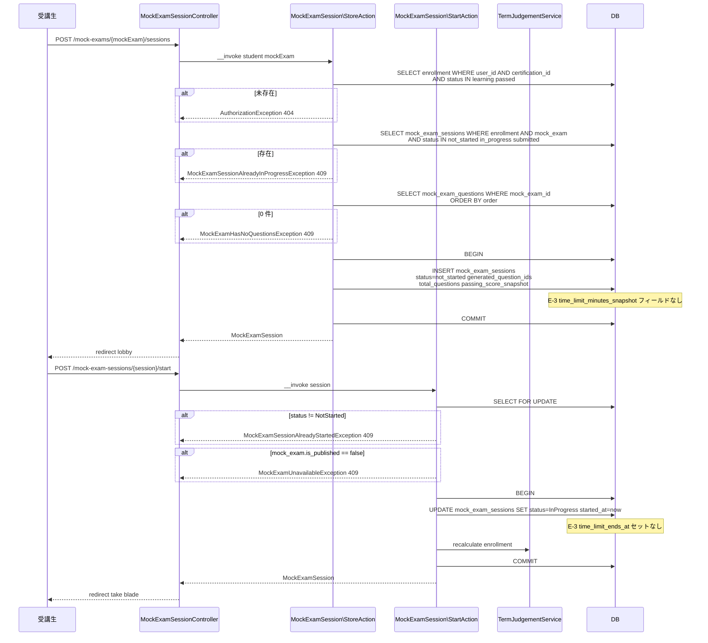
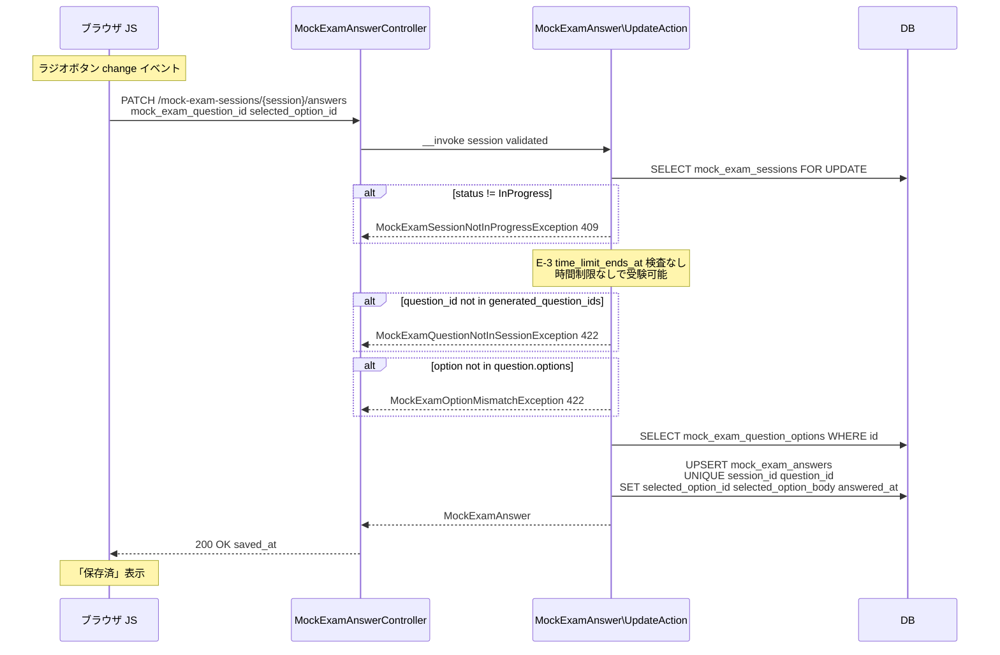
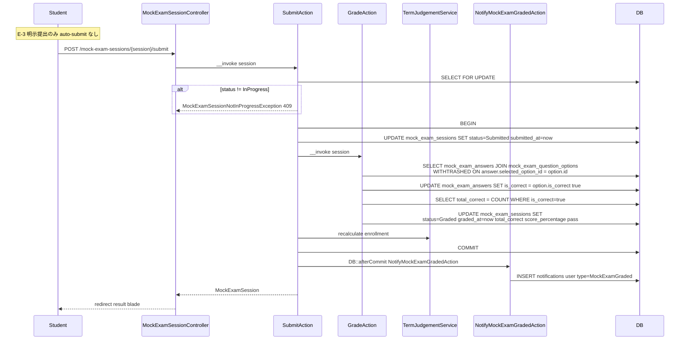
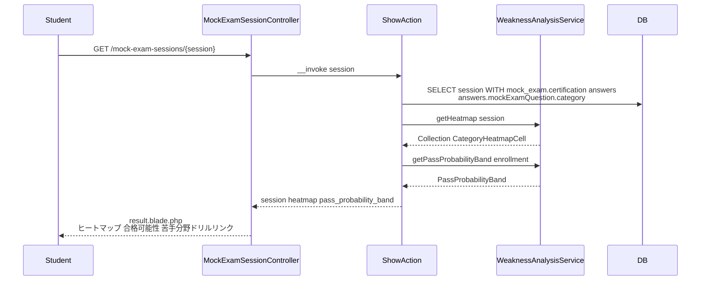
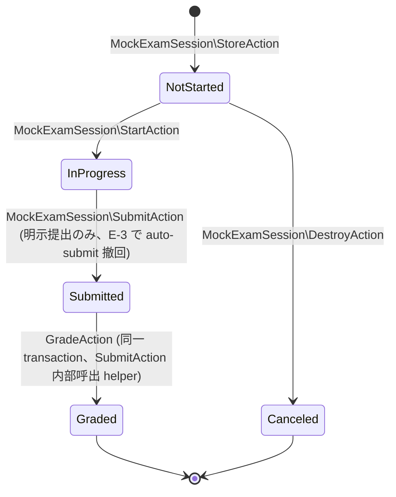

# mock-exam 設計

> **v3 改修反映**(2026-05-16) + **E-3 time_limit_minutes 削除**:
> - `MockExamQuestion` 独自リソース化、`MockExamQuestionOption` 新設、`MockExamAnswer.question_id` → `mock_exam_question_id` rename
> - `difficulty` カラム削除、`assigned_coach_id` ベース絞込撤回 → `certification.coaches` 経由
> - 修了申請承認フロー撤回([[enrollment]] の `ReceiveCertificateAction` 集約)、`passed` でも受験可、`EnsureActiveLearning` 連動
> - **E-3: 時間制限機能完全撤回**(`time_limit_minutes` / `time_limit_minutes_snapshot` / `time_limit_ends_at` カラム削除、タイマー JS / auto-submit / Schedule Command 削除、`MockExamSessionTimeExceededException` 削除)

## アーキテクチャ概要

Certify LMS の中核機能。コーチ / admin が **MockExam マスタ** を作成し、**模試マスタの子リソースとして `MockExamQuestion` を直接 CRUD**(body / explanation / category_id / `MockExamQuestionOption[]`)→ 受講生が公開模試をいつでも・何度でも受験 → 各問の逐次保存(自動 PATCH) → 明示提出で一括採点 → 分野別ヒートマップ + 合格可能性スコア(3 バンド) + 苦手分野ドリル導線を提供する。

**E-3 で時間制限機能完全撤回**(資格マスタ側 `exam_duration_minutes` 削除の経緯と整合)。模試は時間制限なし、受講生は自分のペースで解答 + 明示提出。逐次保存 + 「進行中セッションあり」バナーで中断・再開可能。

Clean Architecture(軽量版)に則り、Controller は薄く、Action(UseCase)が状態遷移 + 採点 + `TermJudgementService::recalculate` + [[notification]] 発火を `DB::transaction()` で 1 トランザクションに束ねる(通知 dispatch は `DB::afterCommit()`)。`lockForUpdate()` で二重提出を防ぐ。

### 1. MockExam マスタ作成 + 公開

```mermaid
sequenceDiagram
    participant Actor as admin or coach
    participant MEC as MockExamController
    participant SA as StoreAction
    participant PA as PublishAction
    participant DB

    Actor->>MEC: POST /admin/mock-exams StoreRequest
    Note over MEC: authorize Pol::create
    MEC->>SA: __invoke validated user
    SA->>DB: BEGIN
    SA->>DB: INSERT mock_exams<br/>certification_id title description order<br/>passing_score is_published=false<br/>created_by_user_id updated_by_user_id
    SA->>DB: COMMIT
    SA-->>MEC: MockExam
    MEC-->>Actor: redirect /admin/mock-exams/{id}/edit

    Note over Actor,DB: 問題セット組成後

    Actor->>MEC: POST /admin/mock-exams/{mockExam}/publish
    MEC->>PA: __invoke mockExam
    PA->>DB: SELECT mockExamQuestions WHERE mock_exam_id
    alt 件数 0
        PA-->>MEC: MockExamPublishNotAllowedException 409
    end
    PA->>DB: UPDATE mock_exams SET is_published=true published_at=now
    PA-->>MEC: MockExam
    MEC-->>Actor: redirect + flash
```

### 2. MockExamQuestion 直接 CRUD(模試マスタの子リソース、v3 で独立化)

```mermaid
sequenceDiagram
    participant Actor as admin or coach
    participant MEQC as MockExamQuestionController
    participant SA as StoreAction
    participant DB

    Actor->>MEQC: POST /admin/mock-exams/{mockExam}/questions<br/>body explanation category_id options
    Note over MEQC: authorize Pol::manage
    MEQC->>SA: __invoke mockExam validated
    SA->>DB: SELECT category WHERE id<br/>AND certification_id = mockExam.certification_id
    alt 不一致
        SA-->>MEQC: QuestionCategoryMismatchException 422
    end
    alt options is_correct true がちょうど 1 件でない
        SA-->>MEQC: QuestionInvalidOptionsException 422
    end
    SA->>DB: BEGIN
    SA->>DB: SELECT MAX order FOR UPDATE WHERE mock_exam_id
    SA->>DB: INSERT mock_exam_questions<br/>mock_exam_id category_id body explanation order
    loop 各 option
        SA->>DB: INSERT mock_exam_question_options<br/>mock_exam_question_id body is_correct order
    end
    SA->>DB: COMMIT
    SA-->>MEQC: MockExamQuestion
    MEQC-->>Actor: redirect + flash
```

> 編集は `UpdateAction` で `body` / `explanation` / `category_id` を UPDATE + `mock_exam_question_options` を delete-and-insert で同期。削除は `DestroyAction` で SoftDelete。

### 3. 受験セッション作成 → 開始 → ターム自動切替(E-3 で時間制限なし)



### 4. 受験中の逐次解答保存(PATCH、E-3 で時間制限なし)



### 5. 提出 → 採点 → ターム再判定 → 通知



### 6. 結果閲覧 + 苦手分野ドリル導線



## データモデル

### Eloquent モデル一覧

- **`MockExam`** — 模試マスタ。`HasUlids` + `HasFactory` + `SoftDeletes`、`is_published` boolean / `published_at` datetime cast、`belongsTo(Certification)` / `belongsTo(User, createdBy)` / `belongsTo(User, updatedBy)` / `hasMany(MockExamQuestion::class)` / `hasMany(MockExamSession)`。**`time_limit_minutes` プロパティなし**(E-3)。
- **`MockExamQuestion`**(独立リソース化) — `HasUlids` + `HasFactory` + `SoftDeletes`、`belongsTo(MockExam)` / `belongsTo(QuestionCategory)` / `hasMany(MockExamQuestionOption)`。**`difficulty` 持たない**。
- **`MockExamQuestionOption`**(新設) — `HasUlids` + `HasFactory` + `SoftDeletes`、`is_correct` boolean cast、`belongsTo(MockExamQuestion)`。
- **`MockExamSession`** — `HasUlids` + `HasFactory` + `SoftDeletes`、`status` cast / `generated_question_ids` array cast / `started_at` / `submitted_at` / `graded_at` / `canceled_at` datetime cast / `pass` boolean cast、`belongsTo(MockExam)` / `belongsTo(Enrollment)` / `belongsTo(User)` / `hasMany(MockExamAnswer)`。**`time_limit_minutes_snapshot` / `time_limit_ends_at` プロパティなし**(E-3)。
- **`MockExamAnswer`** — `HasUlids` + `HasFactory`(SoftDelete 非採用)、`belongsTo(MockExamSession)` / `belongsTo(MockExamQuestion)` / `belongsTo(MockExamQuestionOption, selected_option_id)`。

### ER 図(E-3 で time_limit 関連 3 カラム削除)

```mermaid
erDiagram
    CERTIFICATIONS ||--o{ MOCK_EXAMS : "certification_id"
    MOCK_EXAMS ||--o{ MOCK_EXAM_QUESTIONS : "mock_exam_id"
    QUESTION_CATEGORIES ||--o{ MOCK_EXAM_QUESTIONS : "category_id"
    MOCK_EXAM_QUESTIONS ||--o{ MOCK_EXAM_QUESTION_OPTIONS : "mock_exam_question_id"
    MOCK_EXAMS ||--o{ MOCK_EXAM_SESSIONS : "mock_exam_id"
    ENROLLMENTS ||--o{ MOCK_EXAM_SESSIONS : "enrollment_id"
    USERS ||--o{ MOCK_EXAM_SESSIONS : "user_id"
    MOCK_EXAM_SESSIONS ||--o{ MOCK_EXAM_ANSWERS : "mock_exam_session_id"
    MOCK_EXAM_QUESTIONS ||--o{ MOCK_EXAM_ANSWERS : "mock_exam_question_id"
    MOCK_EXAM_QUESTION_OPTIONS ||--o{ MOCK_EXAM_ANSWERS : "selected_option_id"

    MOCK_EXAMS {
        ulid id PK
        ulid certification_id FK
        string title "max 100"
        text description "nullable"
        unsignedSmallInteger order
        unsignedTinyInteger passing_score "1..100"
        boolean is_published
        timestamp published_at "nullable"
        ulid created_by_user_id FK
        ulid updated_by_user_id FK
        timestamps
        timestamp deleted_at "nullable"
    }
    MOCK_EXAM_QUESTIONS {
        ulid id PK
        ulid mock_exam_id FK
        ulid category_id FK
        text body
        text explanation "nullable"
        unsignedSmallInteger order
        timestamps
        timestamp deleted_at "nullable"
    }
    MOCK_EXAM_QUESTION_OPTIONS {
        ulid id PK
        ulid mock_exam_question_id FK
        text body
        boolean is_correct
        unsignedSmallInteger order
        timestamps
        timestamp deleted_at "nullable"
    }
    MOCK_EXAM_SESSIONS {
        ulid id PK
        ulid mock_exam_id FK
        ulid enrollment_id FK
        ulid user_id FK
        string status "5 値 enum"
        json generated_question_ids
        unsignedSmallInteger total_questions
        unsignedTinyInteger passing_score_snapshot
        timestamp started_at "nullable"
        timestamp submitted_at "nullable"
        timestamp graded_at "nullable"
        timestamp canceled_at "nullable"
        unsignedSmallInteger total_correct "nullable"
        decimal score_percentage "5,2 nullable"
        boolean pass "nullable"
        timestamps
        timestamp deleted_at "nullable"
    }
    MOCK_EXAM_ANSWERS {
        ulid id PK
        ulid mock_exam_session_id FK
        ulid mock_exam_question_id FK
        ulid selected_option_id FK "nullable"
        string selected_option_body "max 2000"
        boolean is_correct
        timestamp answered_at
        timestamps
    }
```

> **E-3 で削除されたカラム**: `mock_exams.time_limit_minutes` / `mock_exam_sessions.time_limit_minutes_snapshot` / `mock_exam_sessions.time_limit_ends_at`。

### Enum

| Model | Enum | 値 | 日本語ラベル |
|---|---|---|---|
| `MockExamSession.status` | `MockExamSessionStatus` | `NotStarted` / `InProgress` / `Submitted` / `Graded` / `Canceled` | `未開始` / `受験中` / `提出済` / `採点完了` / `キャンセル` |
| (Service) | `PassProbabilityBand` | `Safe` / `Warning` / `Danger` / `Unknown` | `合格圏` / `注意` / `要対策` / `判定不可` |

### インデックス・制約

`mock_exams`: `certification_id` FK + `(certification_id, is_published, order)` 複合 INDEX。
`mock_exam_questions`: `mock_exam_id` FK cascade + `category_id` FK restrict + `(mock_exam_id, order)` 複合 INDEX。
`mock_exam_question_options`: `mock_exam_question_id` FK cascade + `(mock_exam_question_id, order)` 複合 INDEX。
`mock_exam_sessions`: 各 FK + `(enrollment_id, status)` / `(mock_exam_id, pass)` / `(user_id, graded_at)` / `(user_id, status)` 複合 INDEX。
`mock_exam_answers`: `mock_exam_session_id` FK cascade + `mock_exam_question_id` FK restrict + `selected_option_id` FK nullOnDelete + `(mock_exam_session_id, mock_exam_question_id)` UNIQUE。

## 状態遷移



> E-3 で `time_limit_ends_at` 経過による auto-submit / Schedule Command による自動採点を撤回。受講生は時間制限なしで自分のペースで解答し、明示提出する。

## コンポーネント

### Controller

**admin / coach 用**(`role:admin,coach` middleware):
- `MockExamController` — `index` / `create` / `store` / `show` / `edit` / `update` / `destroy` / `publish` / `unpublish` / `reorder`
- `MockExamQuestionController` — `index($mockExam)` / `create($mockExam)` / `store($mockExam, StoreRequest)` / `show($question)` / `edit($question)` / `update($question, UpdateRequest)` / `destroy($question)` / `reorder($mockExam, ReorderRequest)`
- `Admin\MockExamSessionController` — `index` / `show`

**student 用**(`role:student` + `EnsureActiveLearning` middleware):
- `MockExamCatalogController` — `index` / `show`
- `MockExamSessionController` — `index` / `store($mockExam)` / `show($session)` / `start($session)` / `submit($session)` / `destroy($session)`
- `MockExamAnswerController` — `update($session)`

### Action(UseCase)

#### MockExam 系(変更なし)

```php
class StoreAction
{
    public function __invoke(array $validated, User $user): MockExam
    {
        // E-3: time_limit_minutes は受け取らない
    }
}

class PublishAction
{
    public function __invoke(MockExam $mockExam): MockExam
    {
        return DB::transaction(function () use ($mockExam) {
            $count = MockExamQuestion::where('mock_exam_id', $mockExam->id)->whereNull('deleted_at')->count();
            if ($count === 0) throw new MockExamPublishNotAllowedException();
            $mockExam->update([
                'is_published' => true,
                'published_at' => now(),
                'updated_by_user_id' => auth()->id(),
            ]);
            return $mockExam->fresh();
        });
    }
}
```

#### MockExamQuestion 系(独立 CRUD、変更なし、E-3 影響なし)

```php
class StoreAction
{
    public function __invoke(MockExam $mockExam, array $validated): MockExamQuestion;
    // category_id 一致検証 + is_correct ちょうど 1 件検証 + lockForUpdate で MAX(order) + INSERT
}
```

#### Session 系(E-3 で time_limit 関連削除)

```php
// MockExamSessionController::store と一致(rules: backend-usecases.md)
class StoreAction
{
    public function __invoke(User $student, MockExam $mockExam): MockExamSession
    {
        // ... ガード ...

        return DB::transaction(fn () => MockExamSession::create([
            'mock_exam_id' => $mockExam->id,
            'enrollment_id' => $enrollment->id,
            'user_id' => $student->id,
            'status' => Status::NotStarted,
            'generated_question_ids' => $questionIds,
            'total_questions' => count($questionIds),
            'passing_score_snapshot' => $mockExam->passing_score,
            // E-3: time_limit_minutes_snapshot フィールドなし
        ]));
    }
}

// MockExamSessionController::start と一致
class StartAction
{
    public function __construct(private TermJudgementService $termJudgement) {}

    public function __invoke(MockExamSession $session): MockExamSession
    {
        return DB::transaction(function () use ($session) {
            $session = MockExamSession::lockForUpdate()->findOrFail($session->id);
            if ($session->status !== Status::NotStarted) throw new MockExamSessionAlreadyStartedException();
            if (!$session->mockExam->is_published) throw new MockExamUnavailableException();

            $session->update([
                'status' => Status::InProgress,
                'started_at' => now(),
                // E-3: time_limit_ends_at セットなし
            ]);
            $this->termJudgement->recalculate($session->enrollment);
            return $session;
        });
    }
}

class SubmitAction
{
    public function __construct(
        private GradeAction $grade,
        private TermJudgementService $termJudgement,
        private NotifyMockExamGradedAction $notify,
    ) {}

    public function __invoke(MockExamSession $session): MockExamSession
    {
        $result = DB::transaction(function () use ($session) {
            $session = MockExamSession::lockForUpdate()->findOrFail($session->id);
            if ($session->status !== Status::InProgress) throw new MockExamSessionNotInProgressException();

            $session->update(['status' => Status::Submitted, 'submitted_at' => now()]);
            ($this->grade)($session);
            $session->refresh();
            $this->termJudgement->recalculate($session->enrollment);
            return $session;
        });
        DB::afterCommit(fn () => ($this->notify)($result));
        return $result;
    }
}

class GradeAction { /* 変更なし、is_correct 確定 + total_correct / score_percentage / pass UPDATE */ }
class DestroyAction { /* キャンセル、NotStarted のみ */ }
```

#### MockExamAnswer 系(E-3 で time_limit 検査削除)

```php
class UpdateAction
{
    public function __invoke(MockExamSession $session, array $validated): MockExamAnswer
    {
        return DB::transaction(function () use ($session, $validated) {
            $session = MockExamSession::lockForUpdate()->findOrFail($session->id);
            if ($session->status !== Status::InProgress) throw new MockExamSessionNotInProgressException();
            // E-3: time_limit_ends_at 超過検査削除
            if (!in_array($validated['mock_exam_question_id'], $session->generated_question_ids, true)) {
                throw new MockExamQuestionNotInSessionException();
            }
            $option = MockExamQuestionOption::where('id', $validated['selected_option_id'])
                ->where('mock_exam_question_id', $validated['mock_exam_question_id'])
                ->firstOrFail();

            return MockExamAnswer::updateOrCreate(
                ['mock_exam_session_id' => $session->id, 'mock_exam_question_id' => $validated['mock_exam_question_id']],
                ['selected_option_id' => $option->id, 'selected_option_body' => $option->body, 'answered_at' => now()],
            );
        });
    }
}
```

### Service

- `WeaknessAnalysisService`(変更なし、`getWeakCategories` / `getHeatmap` / `getPassProbabilityBand` / `batchHeatmap`)
- `CategoryHeatmapCell` DTO

### Policy

`MockExamPolicy` / `MockExamSessionPolicy` / `MockExamQuestionPolicy`(変更なし、admin / coach 担当 / student 受講中(learning + passed) 判定)。

### FormRequest

- **`MockExam\StoreRequest`(E-3 簡素化)** — `certification_id` / `title` / `description` / `order` / `passing_score:1..100`、**`time_limit_minutes` rule 削除**
- `MockExam\UpdateRequest`(同 rules、`certification_id` 不可変)
- **`MockExamSession\IndexRequest`** / **`MockExamAnswer\UpdateRequest`**(`mock_exam_question_id` / `selected_option_id`、E-3 で時間検査削除)
- `MockExamQuestion\StoreRequest` / `UpdateRequest`(変更なし)

### Route(E-3 で Schedule Command 関連ルートなし)

`routes/web.php` の構造は変更なし。

## Blade ビュー

### student 用(E-3 で take.blade.php からタイマー UI 削除)

| ファイル | 役割 |
|---|---|
| `mock-exams/index.blade.php` | 受講中資格別グルーピング + 各模試のバッジ |
| `mock-exams/show.blade.php` | 詳細 + 進行中セッション再開 or 新規セッション作成 |
| `mock-exam-sessions/index.blade.php` | 履歴一覧 + フィルタ |
| `mock-exam-sessions/lobby.blade.php` | NotStarted、開始ボタン + キャンセル(**「制限時間」表示なし**、E-3) |
| **`mock-exam-sessions/take.blade.php`(E-3 簡素化)** | InProgress、問題一覧 + ラジオ選択肢 + sticky 提出ボタン(**タイマー UI / 残り時間表示なし**、`data-time-limit-ends-at` 埋込なし) |
| `mock-exam-sessions/result.blade.php` | Graded、得点 + 合否バッジ + ヒートマップ + 合格可能性 + 苦手分野ドリルリンク |
| `mock-exam-sessions/canceled.blade.php` | Canceled、戻り導線のみ |

## JavaScript(E-3 でタイマー / auto-submit 削除)

`resources/js/mock-exam/`:

- **`answer-autosave.js`** — `[data-quiz-autosave]` 要素の `change` イベントで `PATCH /mock-exam-sessions/{id}/answers` → `[data-save-status]` 反映(変更なし)
- **`admin/mock-exam-questions-reorder.js`** — 問題並び順 drag-and-drop
- **`admin/mock-exams-reorder.js`** — 模試並び順 drag-and-drop

### 明示的に持たない JS(E-3 撤回)

- **`timer.js`** — タイマーカウントダウン機能撤回
- **`auto-submit.js`** — 自動提出機能撤回

> 受講生は **明示提出ボタン** のみで提出。時間制限なしで何度でも復習可能。

## エラーハンドリング

### 想定例外(`app/Exceptions/MockExam/`)

- `MockExamInUseException`(409)
- `MockExamPublishNotAllowedException`(409)
- `MockExamHasNoQuestionsException`(409)
- `MockExamUnavailableException`(409)
- `MockExamSessionAlreadyInProgressException`(409)
- `MockExamSessionAlreadyStartedException`(409)
- `MockExamSessionNotInProgressException`(409)
- `MockExamSessionNotCancelableException`(409)
- `MockExamQuestionNotInSessionException`(422)
- `MockExamOptionMismatchException`(422)
- `QuestionCategoryMismatchException`(422)
- `QuestionInvalidOptionsException`(422)

> **E-3 で `MockExamSessionTimeExceededException` 完全撤回**(時間制限機能なし)。

## Schedule Command

> **E-3 で `mock-exam:auto-submit-expired` Schedule Command 完全撤回**。時間制限がないため、`time_limit_ends_at` 経過セッションの自動採点は不要。`in_progress` のまま放置されても受講生がいつでも再開可能。

## 関連要件マッピング

| 要件 ID | 実装ポイント |
|---|---|
| REQ-mock-exam-001 | `database/migrations/{date}_create_mock_exams_table.php`(**`time_limit_minutes` なし**、E-3) |
| REQ-mock-exam-002 | `database/migrations/{date}_create_mock_exam_questions_table.php` |
| REQ-mock-exam-003 | `database/migrations/{date}_create_mock_exam_question_options_table.php` |
| REQ-mock-exam-004 | `database/migrations/{date}_create_mock_exam_sessions_table.php`(**`time_limit_minutes_snapshot` / `time_limit_ends_at` なし**、E-3) |
| REQ-mock-exam-005 | `database/migrations/{date}_create_mock_exam_answers_table.php`(`mock_exam_question_id` rename) |
| REQ-mock-exam-040〜049 | `App\Http\Controllers\MockExamController` + `App\UseCases\MockExam\*Action`(E-3 で `time_limit_minutes` 関連なし) |
| REQ-mock-exam-060〜066 | `App\Http\Controllers\MockExamQuestionController` + `App\UseCases\MockExamQuestion\*Action` |
| REQ-mock-exam-100〜105 | `App\Http\Controllers\MockExamCatalogController` + `App\Http\Controllers\MockExamSessionController::store/destroy` |
| **REQ-mock-exam-150**(E-3 簡素化) | `App\UseCases\MockExamSession\StartAction`(**`time_limit_ends_at` セットなし**) |
| REQ-mock-exam-154(E-3 簡素化) | `App\UseCases\MockExamAnswer\UpdateAction`(**時間検査なし**) |
| **REQ-mock-exam-201**(E-3 で撤回) | 時間外 SubmitAction 概念なし、明示提出時に未解答は `is_correct=false` 扱い(同等動作) |
| REQ-mock-exam-200〜205 | `App\UseCases\MockExamSession\SubmitAction`(`lockForUpdate` + `DB::afterCommit`) |
| REQ-mock-exam-220〜223 | `App\UseCases\MockExamSession\GradeAction` |
| REQ-mock-exam-250〜252 | `App\UseCases\MockExamSession\ShowAction` + `WeaknessAnalysisService` |
| REQ-mock-exam-300〜302 | `App\Http\Controllers\Admin\MockExamSessionController`(certification.coaches 経由) |
| REQ-mock-exam-350〜355 | `App\Services\WeaknessAnalysisService` + `MockExamServiceProvider` |
| REQ-mock-exam-380〜381 | [[enrollment]] の `CompletionEligibilityService` が真実源クエリ |
| REQ-mock-exam-400〜403 | middleware + Policy |
| NFR-mock-exam-001 | 各 Action の `DB::transaction()` |
| NFR-mock-exam-004 | `app/Exceptions/MockExam/*Exception.php`(**`MockExamSessionTimeExceededException` なし**、E-3) |
| **NFR-mock-exam-006**(E-3 簡素化) | `resources/js/mock-exam/answer-autosave.js` のみ(**`timer.js` / `auto-submit.js` なし**) |
| NFR-mock-exam-008 | Blade / Resource に正答情報を出力しない |
| NFR-mock-exam-009 | `lockForUpdate()` を各状態遷移 Action で適用 |

## テスト戦略

### Feature(HTTP)

- `MockExam/{Index,Store,Update,Destroy,Publish,Unpublish,Reorder}Test.php`(**`time_limit_minutes` フィールド送信時 silently drop**、E-3)
- `MockExamQuestion/{Index,Store,Update,Destroy,Reorder}Test.php`
- `MockExamCatalog/{Index,Show}Test.php`
- `MockExamSession/{Index,Store,Show,Start,Submit,Destroy}Test.php`(**Start 時 `time_limit_ends_at` セットなし確認**、E-3)
- **`MockExamAnswer/UpdateTest.php`(E-3 簡素化)** — 3 段ガード(status / question_id / option) 網羅、**「時間超過 409」テスト削除**(E-3)
- `Admin/MockExamSession/{Index,Show}Test.php`
- `EnsureActiveLearningTest.php`(graduated 403)

### Feature(UseCases)

- `MockExamQuestion/StoreActionTest.php`
- `MockExamSession/{Store,Start,Submit,Destroy}ActionTest.php`(**`time_limit_ends_at` 関連 assert なし**、E-3)
- `MockExamSession/GradeActionTest.php`
- `MockExamAnswer/UpdateActionTest.php`(時間超過テスト削除、E-3)

### Unit(Services / Policy / Provider)

- `WeaknessAnalysisServiceTest.php`
- `MockExamPolicyTest.php`
- `MockExamSessionPolicyTest.php`
- `MockExamServiceProviderTest.php`

### 明示的に持たないテスト(E-3 撤回)

- **`AutoSubmitExpiredMockExamSessionsCommandTest.php`** — Schedule Command なし
- **`MockExamSessionTimeExceededExceptionTest.php`** — 例外なし
- **`MockExamSessionTimerJSTest.php`** — タイマー UI なし
