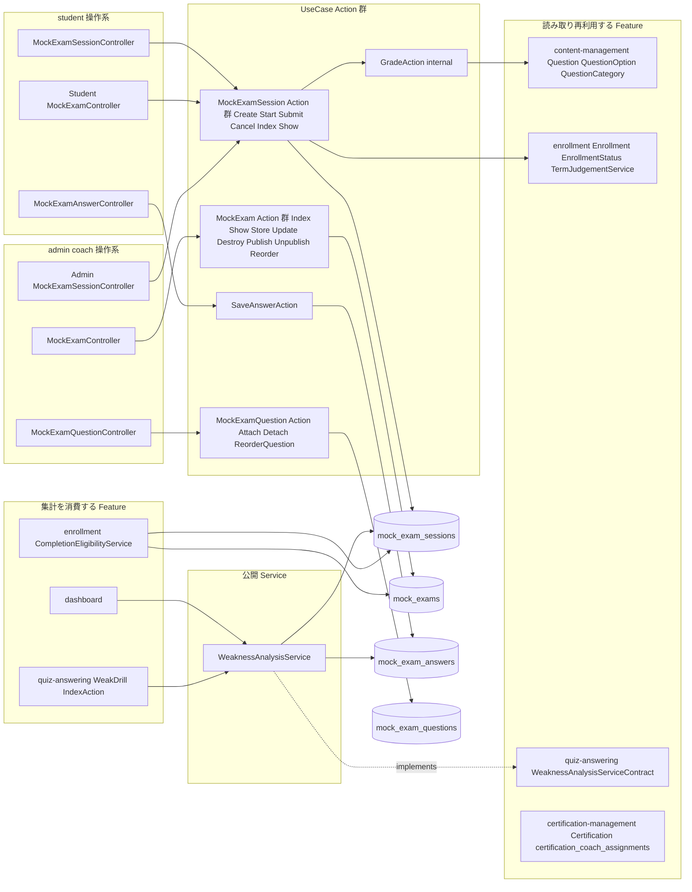
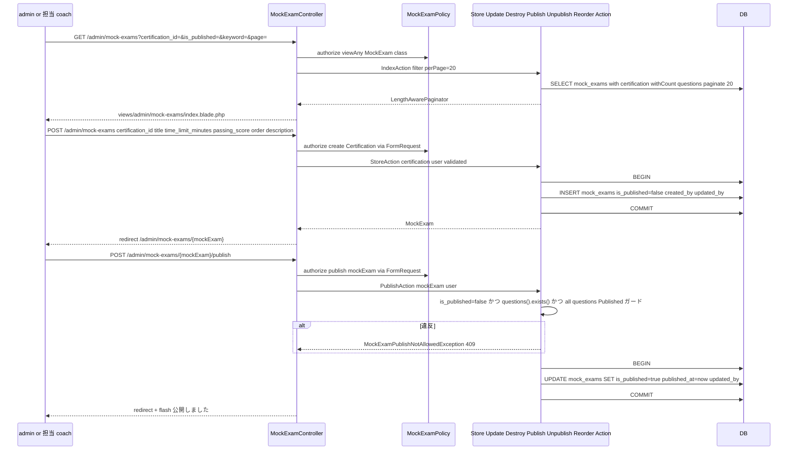
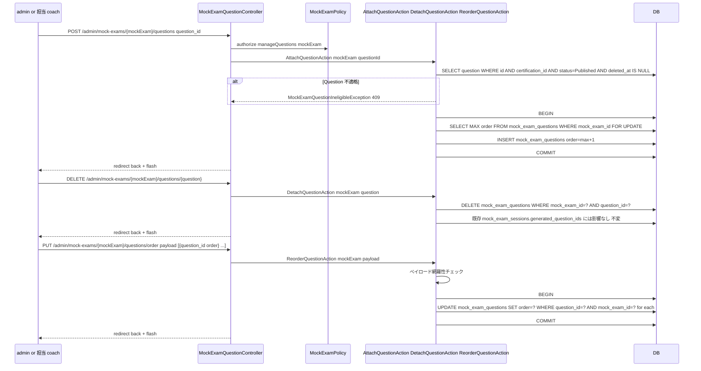
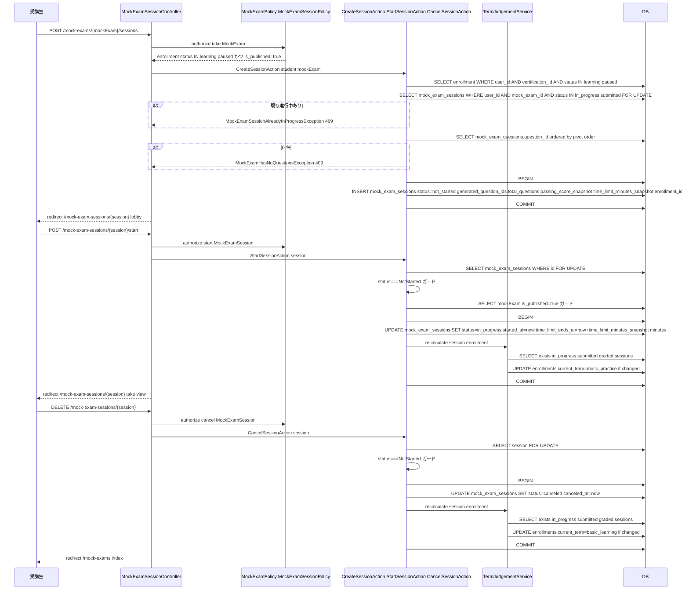
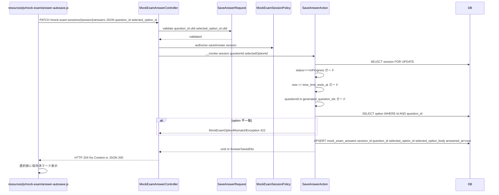
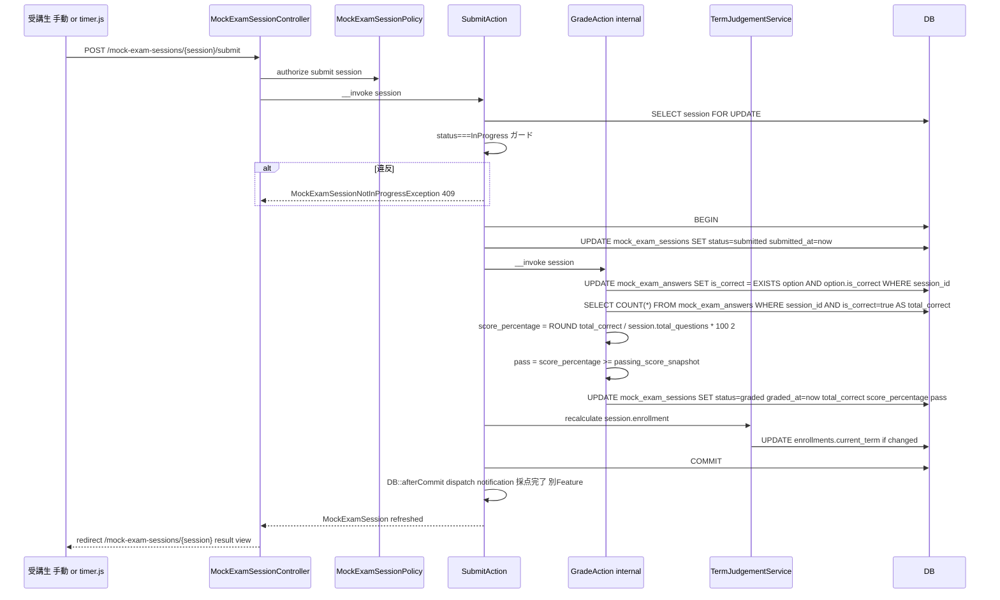
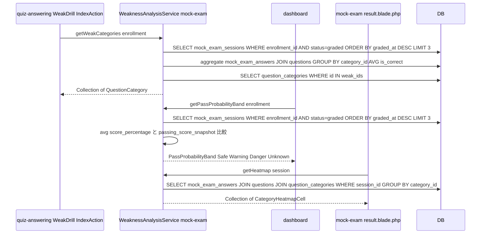
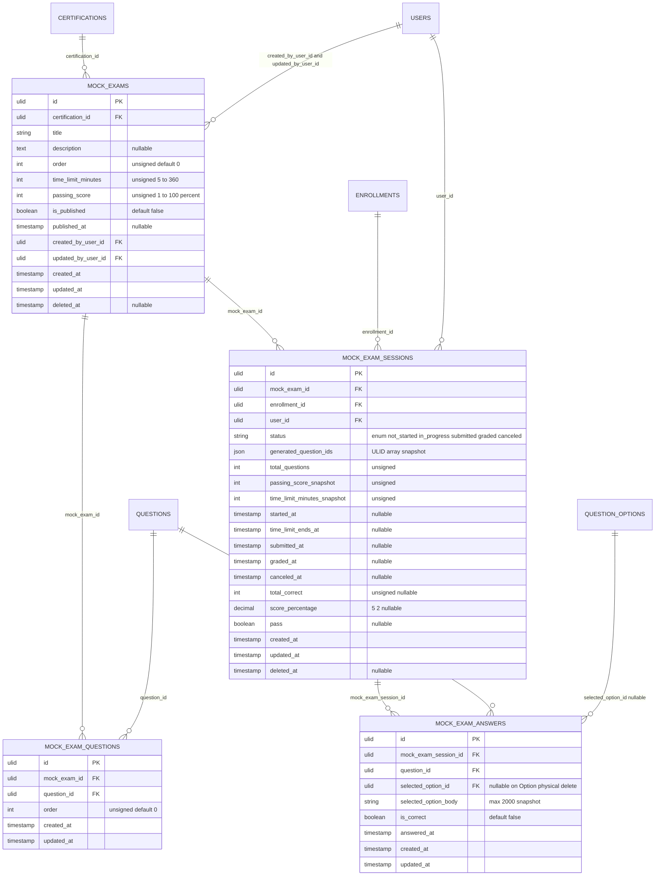
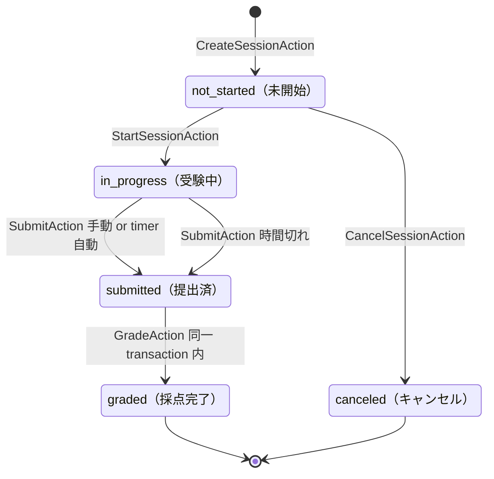
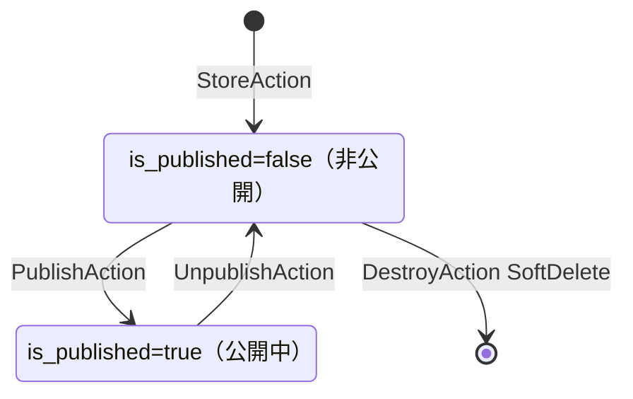

# mock-exam 設計

## アーキテクチャ概要

MockExam マスタ CRUD（admin / coach）と問題セット組成（`MockExamQuestion`）、受講生の模試一覧 / セッション作成・開始・キャンセル、受験中の逐次解答保存と時間管理、提出時の自動採点、結果画面（ヒートマップ + 合格可能性スコア）、コーチ / admin の結果閲覧、`WeaknessAnalysisService`（[[quiz-answering]] が定義した `WeaknessAnalysisServiceContract` の正規実装）を一体で提供する。Clean Architecture（軽量版）に従い Controller / FormRequest / Policy / UseCase（Action）/ Service / Eloquent Model を分離する。問題マスタ（`Question` / `QuestionOption` / `QuestionCategory`）は [[content-management]] が所有する Model を **読み取り再利用** し、本 Feature では CRUD を持たない。ターム判定は [[enrollment]] の `TermJudgementService` を Start / Submit / Cancel の各 Action 内（同一 transaction）で呼ぶ、修了判定（`CompletionEligibilityService`）は [[enrollment]] が所有し、本 Feature の `MockExam` / `MockExamSession` を SELECT する側になる。

### 全体構造



### MockExam マスタ CRUD + 公開状態遷移



### MockExamQuestion 組成



### 受講生 セッション作成・開始・キャンセル



### 逐次解答保存（PATCH）



### 提出 + 自動採点



### WeaknessAnalysisService 契約供給と消費



## データモデル

### Eloquent モデル一覧

- **`MockExam`** — 模試マスタ。`HasUlids` + `HasFactory` + `SoftDeletes`。`belongsTo(Certification::class)` / `belongsTo(User::class, 'created_by_user_id', 'createdBy')` / `belongsTo(User::class, 'updated_by_user_id', 'updatedBy')` / `belongsToMany(Question::class, 'mock_exam_questions')->withPivot('order')->withTimestamps()->orderByPivot('order')`（リレーション名 `questions()`）/ `hasMany(MockExamSession::class)`。スコープ: `scopePublished()` / `scopeOfCertification(string $certificationId)` / `scopeKeyword(?string $keyword)` / `scopeOrdered()`（`order ASC, created_at DESC`）。

- **`MockExamSession`** — 受験セッション。`HasUlids` + `HasFactory` + `SoftDeletes`。`belongsTo(MockExam::class)` / `belongsTo(Enrollment::class)` / `belongsTo(User::class, 'user_id')` / `hasMany(MockExamAnswer::class)`。スコープ: `scopeOfUser(User $user)` / `scopeOfEnrollment(Enrollment $enrollment)` / `scopeStatus(MockExamSessionStatus $status)` / `scopeActive()`（`whereIn('status', [InProgress, Submitted, Graded])`、[[enrollment]] の `TermJudgementService` が利用）/ `scopePassed()`（`status=Graded AND pass=true`、[[enrollment]] の `CompletionEligibilityService` が利用）/ `scopeGraded()`。Cast: REQ-007 通り。

- **`MockExamAnswer`** — 解答ログ（セッション × Question 単位 UPSERT、SoftDelete 非採用）。`HasUlids` + `HasFactory`。`belongsTo(MockExamSession::class)` / `belongsTo(Question::class)` / `belongsTo(QuestionOption::class, 'selected_option_id')`（nullable、Option 物理削除で NULL）。スコープ: `scopeOfSession(MockExamSession $session)` / `scopeCorrect()` / `scopeIncorrect()` / `scopeForQuestion(string $questionId)`。Cast: REQ-007 通り。

`mock_exam_questions` は Pivot Model を作らず（`Pivot` クラスを継承して `withPivot('order')` で十分）、Eloquent BelongsToMany の機能で管理する。

### 既存 Model への逆向きリレーション宣言

[[content-management]] の `Question` Model は既に `hasMany(MockExamAnswer::class)`（mock-exam 定義）を予告（design.md L214）。本 Feature 実装時に Question Model へ `belongsToMany(MockExam::class, 'mock_exam_questions')->withPivot('order')` と `hasMany(MockExamAnswer::class)` を追加する。[[certification-management]] の `Certification` Model に既に予告された `hasMany(MockExam::class)` を本 Feature 実装時に有効化する。[[auth]] の `User` Model に `hasMany(MockExamSession::class, 'user_id')` を追加する。[[enrollment]] の `Enrollment` Model は既に `hasMany(MockExamSession::class)` を持ち、本 Feature の Model 命名と整合済。

### ER 図



### 主要カラム + Enum

| Model | Enum | 値 | 日本語ラベル |
|---|---|---|---|
| `MockExamSession.status` | `MockExamSessionStatus` | `NotStarted` / `InProgress` / `Submitted` / `Graded` / `Canceled` | `未開始` / `受験中` / `提出済` / `採点完了` / `キャンセル` |
| （Service 戻り値） | `PassProbabilityBand` | `Safe` / `Warning` / `Danger` / `Unknown` | `合格圏` / `注意` / `危険` / `判定不可` |

`MockExam.is_published` は boolean のため Enum 化しない（公開 / 非公開の 2 値、`scopePublished()` でクエリ表現）。

### インデックス・制約

`mock_exams`:
- `(certification_id, is_published, order)`: 複合 INDEX（受講生一覧 / コーチ一覧の絞込 + 並び替えを 1 INDEX で完結）
- `(certification_id, deleted_at)`: 複合 INDEX
- `deleted_at`: 単体 INDEX
- `certification_id`: 外部キー（`->constrained('certifications')->restrictOnDelete()`）
- `created_by_user_id` / `updated_by_user_id`: 外部キー（`->constrained('users')->restrictOnDelete()`）

`mock_exam_questions`:
- `(mock_exam_id, question_id)`: UNIQUE INDEX（同一 MockExam に同 Question を重複登録できない）
- `(mock_exam_id, order)`: 複合 INDEX（順序取得の高速化、UPSERT 補助）
- `mock_exam_id`: 外部キー（`->constrained('mock_exams')->cascadeOnDelete()` — MockExam SoftDelete 時に Pivot をクリーンアップ。MockExam の物理削除は採用しないが将来拡張保険）
- `question_id`: 外部キー（`->constrained('questions')->restrictOnDelete()` — Question 物理削除を阻止、SoftDelete は許容しても Pivot は残せる）

`mock_exam_sessions`:
- `(enrollment_id, status)`: 複合 INDEX（[[enrollment]] `TermJudgementService` の `whereIn('status', [InProgress, Submitted, Graded])->exists()` 高速化）
- `(mock_exam_id, pass)`: 複合 INDEX（[[enrollment]] `CompletionEligibilityService` の `distinct mock_exam_id WHERE pass=true` 高速化）
- `(user_id, graded_at)`: 複合 INDEX（履歴一覧 `ORDER BY graded_at DESC`）
- `(user_id, status)`: 複合 INDEX（受講生ダッシュボードの `in_progress` 検出）
- `deleted_at`: 単体 INDEX
- `mock_exam_id`: 外部キー（`->constrained('mock_exams')->restrictOnDelete()` — 採点済セッションは履歴保護で MockExam 物理削除を阻止）
- `enrollment_id`: 外部キー（`->constrained('enrollments')->restrictOnDelete()`）
- `user_id`: 外部キー（`->constrained('users')->restrictOnDelete()`）

`mock_exam_answers`:
- `(mock_exam_session_id, question_id)`: UNIQUE INDEX（1 セッション × 1 Question 最大 1 行、UPSERT の競合解決）
- `(mock_exam_session_id, is_correct)`: 複合 INDEX（採点時 `COUNT WHERE is_correct=true` の高速化）
- `(question_id, is_correct)`: 複合 INDEX（`WeaknessAnalysisService::getHeatmap` 集計補助）
- `mock_exam_session_id`: 外部キー（`->constrained('mock_exam_sessions')->cascadeOnDelete()` — セッション物理削除時に Answer もクリーンアップ。通常フローでは物理削除しないが将来拡張保険）
- `question_id`: 外部キー（`->constrained('questions')->restrictOnDelete()`）
- `selected_option_id`: 外部キー（`->nullable()->constrained('question_options')->nullOnDelete()` — QuestionOption delete-and-insert で物理削除されるため）

## 状態遷移

### MockExamSession.status

`product.md`「## ステータス遷移 D. Mock-exam Session」と完全一致。



> Note: `not_started → canceled` のみキャンセル可能（`product.md` 補足: 「すでに in_progress 以降のセッションはキャンセル不可」）。`in_progress` 以降は提出 or 時間切れまで進む。`submitted` は transient state で、`GradeAction` が成功した時点で `graded` に進む（採点失敗時のリトライ余地として残すが、Basic 同期採点では原則 transient）。

### MockExam.is_published



`PublishAction` の事前条件: 問題セット 1 件以上 + 全 Question が `Published` AND SoftDelete 済でない（REQ-047）。

## コンポーネント

### Controller

すべて `app/Http/Controllers/` 配下、ロール別 namespace は使わず（`structure.md` 規約）、ルートは admin / coach 操作系を `/admin/mock-exams/...` `/admin/mock-exam-sessions/...` プレフィックスで `auth + role:admin|coach` Middleware、受講生は `/mock-exams/...` `/mock-exam-sessions/...` で `auth + role:student` Middleware を適用する。

- **`MockExamController`**（admin / coach 用、`/admin/mock-exams/...`）
  - `index(IndexRequest, IndexAction)` — 一覧 + フィルタ + ページネーション
  - `create(Certification $certification)` — 新規作成フォーム表示（薄い、`?certification_id=` で資格指定）
  - `store(StoreRequest, StoreAction)` — 新規作成
  - `show(MockExam $mockExam, ShowAction)` — 詳細（問題セット組成 UI 同居）
  - `edit(MockExam $mockExam)` — 編集フォーム表示
  - `update(MockExam $mockExam, UpdateRequest, UpdateAction)` — 更新
  - `destroy(MockExam $mockExam, DestroyAction)` — SoftDelete（非公開かつ全セッション canceled のみ可）
  - `publish(MockExam $mockExam, PublishAction)` — 公開化
  - `unpublish(MockExam $mockExam, UnpublishAction)` — 非公開化
  - `reorder(ReorderRequest, ReorderAction)` — 一括並び順更新

- **`MockExamQuestionController`**（admin / coach 用、`/admin/mock-exams/{mockExam}/questions`）
  - `store(MockExam $mockExam, AttachQuestionRequest, AttachQuestionAction)` — Question 紐付け
  - `destroy(MockExam $mockExam, Question $question, DetachQuestionAction)` — Question 解除
  - `reorderQuestion(MockExam $mockExam, ReorderQuestionRequest, ReorderQuestionAction)` — 一括並び順更新

- **`Admin\MockExamSessionController`**（admin / coach 用、`/admin/mock-exam-sessions/...`）
  - `index(IndexRequest, IndexAction)` — 担当受講生 / 全受講生のセッション一覧 + フィルタ
  - `show(MockExamSession $session, ShowAction)` — セッション詳細閲覧（受講生視点の result / take を閲覧専用化）

- **`Student\MockExamController`**（student 用、`/mock-exams/...`）
  - `index(IndexAction)` — 公開模試一覧
  - `show(MockExam $mockExam, ShowAction)` — 公開模試詳細（受講中資格 + 公開のみ）

- **`MockExamSessionController`**（student 用、`/mock-exam-sessions/...`）
  - `index(IndexRequest, IndexAction)` — 履歴一覧
  - `store(MockExam $mockExam, CreateSessionAction)` — セッション作成 → リダイレクト先 show（POST /mock-exams/{mockExam}/sessions と等価、URL は student namespace 配下の `MockExamSessionController::store`）
  - `show(MockExamSession $session, ShowAction)` — 状態に応じて lobby / take / result / canceled Blade を分岐
  - `start(MockExamSession $session, StartSessionAction)` — 受験開始
  - `submit(MockExamSession $session, SubmitAction)` — 提出
  - `destroy(MockExamSession $session, CancelSessionAction)` — キャンセル

- **`MockExamAnswerController`**（student 用、`/mock-exam-sessions/{session}/answers`、[[quiz-answering]] の `AnswerController` と名前衝突しないよう `MockExam` プレフィックス付）
  - `update(MockExamSession $session, UpdateRequest, UpdateAction)` — PATCH 経由の逐次保存（Web JSON）

> 受講生視点の Controller を `app/Http/Controllers/Student/` 配下に namespace 分離せず、`structure.md` 規約に従い **ロール別 namespace を採用しない**。命名は `MockExamCatalogController`（student 用、admin と重ならない名前）とする。Admin / coach 視点は `MockExamController`。`MockExamAnswerController` は student 用の PATCH 専用、[[quiz-answering]] が所有する `AnswerController` とはクラス名で衝突回避する。

確定版命名:
- admin / coach 用: `MockExamController` / `MockExamQuestionController` / `AdminMockExamSessionController`
- student 用: `MockExamCatalogController`（`/mock-exams/...`）/ `MockExamSessionController`（`/mock-exam-sessions/...`、受験操作）/ `MockExamAnswerController`（`PATCH /mock-exam-sessions/{session}/answers`）

### Action（UseCase）

Entity 単位ディレクトリで配置（`app/UseCases/MockExam/`, `app/UseCases/MockExamQuestion/`, `app/UseCases/MockExamSession/`, `app/UseCases/Answer/`）。各 Action は単一トランザクション境界（状態変更を伴うものは `DB::transaction()`、参照系は持たない）。`__invoke()` を主とし、Controller method 名と Action クラス名は完全一致（`backend-usecases.md` 規約）。Controller method `reorder` / `reorderQuestion` の Action 名は `ReorderAction` / `ReorderQuestionAction` となる。

> **重要**: [[quiz-answering]] が `App\UseCases\Answer\` 配下に `StoreAction`（Section 演習 / 苦手分野ドリル用）を持つ。本 Feature は同名衝突を避けるため Action ディレクトリも `app/UseCases/MockExamAnswer/` に切り、Controller `MockExamAnswerController::update` から `App\UseCases\MockExamAnswer\UpdateAction` を呼ぶ構成にする（クラス名・名前空間とも完全分離）。

確定版命名（Controller method 名 = Action クラス名規約準拠）:
- `app/UseCases/MockExam/IndexAction.php` / `ShowAction.php` / `StoreAction.php` / `UpdateAction.php` / `DestroyAction.php` / `PublishAction.php` / `UnpublishAction.php` / `ReorderAction.php`
- `app/UseCases/MockExamCatalog/IndexAction.php`（Controller `MockExamCatalogController::index`）/ `ShowAction.php`（Controller `MockExamCatalogController::show`、受講生用模試一覧・詳細）
- `app/UseCases/MockExamQuestion/StoreAction.php`（Controller `MockExamQuestionController::store` → 紐付け）/ `DestroyAction.php` / `ReorderQuestionAction.php`（Controller method `reorderQuestion` → `ReorderQuestionAction`）
- `app/UseCases/MockExamSession/IndexAction.php` / `ShowAction.php` / `StoreAction.php`（Controller `store` → セッション作成、規約準拠で `StoreAction`）/ `StartAction.php` / `SubmitAction.php` / `DestroyAction.php`（Controller `destroy` → セッションキャンセル）
- `app/UseCases/AdminMockExamSession/IndexAction.php` / `ShowAction.php`（コーチ / admin 用、Controller `AdminMockExamSessionController::index` / `show` と一致）
- `app/UseCases/MockExamAnswer/UpdateAction.php`（Controller `MockExamAnswerController::update` → PATCH 逐次保存）
- `app/UseCases/MockExamSession/GradeAction.php`（internal、`SubmitAction` から呼ばれる専用、Controller method には対応しない）

#### `App\UseCases\MockExam\StoreAction`

```php
namespace App\UseCases\MockExam;

use App\Models\Certification;
use App\Models\MockExam;
use App\Models\User;
use Illuminate\Support\Facades\DB;

class StoreAction
{
    public function __invoke(Certification $certification, User $user, array $validated): MockExam
    {
        return DB::transaction(fn () => MockExam::create([
            'certification_id' => $certification->id,
            ...$validated,
            'is_published' => false,
            'created_by_user_id' => $user->id,
            'updated_by_user_id' => $user->id,
        ]));
    }
}
```

責務: 新規 MockExam 作成。`is_published=false` 固定、`created_by_user_id` / `updated_by_user_id` を呼出者で固定。

#### `App\UseCases\MockExam\PublishAction`

```php
class PublishAction
{
    public function __invoke(MockExam $mockExam, User $user): MockExam
    {
        if ($mockExam->is_published) {
            throw new MockExamPublishNotAllowedException('既に公開済です。');
        }
        if (! $mockExam->questions()->exists()) {
            throw new MockExamPublishNotAllowedException('問題が 1 件も組成されていません。');
        }
        $unpublishedQuestion = $mockExam->questions()
            ->where(fn ($q) => $q->where('status', '!=', ContentStatus::Published)
                ->orWhereNotNull('deleted_at'))
            ->exists();
        if ($unpublishedQuestion) {
            throw new MockExamPublishNotAllowedException('未公開または削除済の問題が含まれています。');
        }

        return DB::transaction(function () use ($mockExam, $user) {
            $mockExam->update([
                'is_published' => true,
                'published_at' => now(),
                'updated_by_user_id' => $user->id,
            ]);
            return $mockExam->fresh();
        });
    }
}
```

責務: 3 段ガード（is_published=false / questions 存在 / 全 Question 公開済）で公開可否を判定し、合格時のみ UPDATE。

#### `App\UseCases\MockExamQuestion\StoreAction`

```php
namespace App\UseCases\MockExamQuestion;

class StoreAction
{
    public function __invoke(MockExam $mockExam, string $questionId): void
    {
        $question = Question::query()
            ->where('id', $questionId)
            ->where('certification_id', $mockExam->certification_id)
            ->where('status', ContentStatus::Published)
            ->whereNull('deleted_at')
            ->first();
        if ($question === null) {
            throw new MockExamQuestionIneligibleException();
        }

        DB::transaction(function () use ($mockExam, $question) {
            $exists = $mockExam->questions()->where('questions.id', $question->id)->exists();
            if ($exists) {
                throw new MockExamQuestionIneligibleException('既に紐付け済の問題です。');
            }
            $maxOrder = DB::table('mock_exam_questions')
                ->where('mock_exam_id', $mockExam->id)
                ->lockForUpdate()
                ->max('order') ?? -1;
            $mockExam->questions()->attach($question->id, ['order' => $maxOrder + 1]);
        });
    }
}
```

責務: 資格一致 / 公開済 / 重複なしの 3 段検証後、`mock_exam_questions` Pivot に `order = max + 1` で末尾追加。`lockForUpdate` で並列追加時の重複 order を防ぐ。

#### `App\UseCases\MockExamSession\StoreAction`

```php
namespace App\UseCases\MockExamSession;

class StoreAction
{
    public function __invoke(User $student, MockExam $mockExam): MockExamSession
    {
        $enrollment = Enrollment::query()
            ->where('user_id', $student->id)
            ->where('certification_id', $mockExam->certification_id)
            ->whereIn('status', [EnrollmentStatus::Learning, EnrollmentStatus::Paused])
            ->whereNull('deleted_at')
            ->firstOrFail();

        return DB::transaction(function () use ($student, $mockExam, $enrollment) {
            $existing = MockExamSession::query()
                ->where('user_id', $student->id)
                ->where('mock_exam_id', $mockExam->id)
                ->whereIn('status', [
                    MockExamSessionStatus::InProgress,
                    MockExamSessionStatus::Submitted,
                ])
                ->lockForUpdate()
                ->exists();
            if ($existing) {
                throw new MockExamSessionAlreadyInProgressException();
            }

            $questionIds = $mockExam->questions()
                ->orderByPivot('order')
                ->pluck('questions.id')
                ->all();
            if (empty($questionIds)) {
                throw new MockExamHasNoQuestionsException();
            }

            return MockExamSession::create([
                'mock_exam_id' => $mockExam->id,
                'enrollment_id' => $enrollment->id,
                'user_id' => $student->id,
                'status' => MockExamSessionStatus::NotStarted,
                'generated_question_ids' => $questionIds,
                'total_questions' => count($questionIds),
                'passing_score_snapshot' => $mockExam->passing_score,
                'time_limit_minutes_snapshot' => $mockExam->time_limit_minutes,
            ]);
        });
    }
}
```

責務: (1) Enrollment 取得、(2) 重複進行中セッションガード、(3) 問題 ID snapshot、(4) スナップショット値（passing_score / time_limit_minutes / total_questions）固定で INSERT。

#### `App\UseCases\MockExamSession\StartAction`

```php
class StartAction
{
    public function __construct(private TermJudgementService $termJudgement) {}

    public function __invoke(MockExamSession $session): MockExamSession
    {
        return DB::transaction(function () use ($session) {
            $session->refresh()->lockForUpdate();
            if ($session->status !== MockExamSessionStatus::NotStarted) {
                throw new MockExamSessionAlreadyStartedException();
            }
            if (! $session->mockExam->is_published) {
                throw new MockExamUnavailableException();
            }
            $now = now();
            $session->update([
                'status' => MockExamSessionStatus::InProgress,
                'started_at' => $now,
                'time_limit_ends_at' => $now->copy()->addMinutes($session->time_limit_minutes_snapshot),
            ]);
            ($this->termJudgement)($session->enrollment);
            return $session->fresh();
        });
    }
}
```

責務: (1) NotStarted ガード、(2) MockExam 公開ガード、(3) `status=in_progress` / `started_at=now` / `time_limit_ends_at=now+time_limit_minutes_snapshot` で UPDATE、(4) `TermJudgementService::recalculate` を同一 transaction で呼ぶ。`TermJudgementService` の `__invoke` 表記は実装上 `recalculate($enrollment)` を呼ぶラッパー扱いで OK（既に [[enrollment]] 設計で `recalculate` メソッド名）。

#### `App\UseCases\MockExamAnswer\UpdateAction`

```php
namespace App\UseCases\MockExamAnswer;

class UpdateAction
{
    public function __invoke(
        MockExamSession $session,
        string $questionId,
        string $selectedOptionId,
    ): void {
        DB::transaction(function () use ($session, $questionId, $selectedOptionId) {
            $session->refresh()->lockForUpdate();
            if ($session->status !== MockExamSessionStatus::InProgress) {
                throw new MockExamSessionNotInProgressException();
            }
            if (now()->greaterThan($session->time_limit_ends_at)) {
                throw new MockExamSessionTimeExceededException();
            }
            if (! in_array($questionId, $session->generated_question_ids, true)) {
                throw new MockExamQuestionNotInSessionException();
            }
            $option = QuestionOption::query()
                ->where('id', $selectedOptionId)
                ->where('question_id', $questionId)
                ->first();
            if ($option === null) {
                throw new MockExamOptionMismatchException();
            }

            MockExamAnswer::updateOrCreate(
                ['mock_exam_session_id' => $session->id, 'question_id' => $questionId],
                [
                    'selected_option_id' => $option->id,
                    'selected_option_body' => $option->body,
                    'answered_at' => now(),
                    'is_correct' => false,  // 採点時に上書き
                ],
            );
        });
    }
}
```

責務: 4 段ガード（status / 時間 / question_id 所属 / option 一致）後に UPSERT。`is_correct` は採点時まで暫定 false。

#### `App\UseCases\MockExamSession\SubmitAction`

```php
namespace App\UseCases\MockExamSession;

class SubmitAction
{
    public function __construct(
        private GradeAction $grade,
        private TermJudgementService $termJudgement,
        private \App\UseCases\Notification\NotifyMockExamGradedAction $notifyGraded,
    ) {}

    public function __invoke(MockExamSession $session): MockExamSession
    {
        $result = DB::transaction(function () use ($session) {
            $session->refresh()->lockForUpdate();
            if ($session->status !== MockExamSessionStatus::InProgress) {
                throw new MockExamSessionNotInProgressException();
            }
            $session->update([
                'status' => MockExamSessionStatus::Submitted,
                'submitted_at' => now(),
            ]);
            ($this->grade)($session);
            ($this->termJudgement)($session->enrollment);
            return $session->fresh();
        });

        DB::afterCommit(fn () => ($this->notifyGraded)($result));

        return $result;
    }
}
```

責務: (1) lockForUpdate + InProgress ガード、(2) `status=Submitted` 中間更新、(3) `GradeAction` 同一 transaction 内呼出、(4) `TermJudgementService::recalculate`、(5) `DB::afterCommit` で `NotifyMockExamGradedAction` を直接呼出（Event / Listener 経由ではなく Action 直呼出、Feature 横断ラッパー Action 方式、`backend-usecases.md` 準拠）。

#### `App\UseCases\MockExamSession\GradeAction` （internal）

```php
namespace App\UseCases\MockExamSession;

class GradeAction
{
    public function __invoke(MockExamSession $session): void
    {
        DB::table('mock_exam_answers AS a')
            ->where('a.mock_exam_session_id', $session->id)
            ->update([
                'a.is_correct' => DB::raw('EXISTS (
                    SELECT 1 FROM question_options AS qo
                    WHERE qo.id = a.selected_option_id
                    AND qo.is_correct = 1
                )'),
            ]);

        $totalCorrect = MockExamAnswer::query()
            ->where('mock_exam_session_id', $session->id)
            ->where('is_correct', true)
            ->count();

        $scorePercentage = $session->total_questions > 0
            ? round($totalCorrect / $session->total_questions * 100, 2)
            : 0.00;
        $pass = $scorePercentage >= $session->passing_score_snapshot;

        $session->update([
            'status' => MockExamSessionStatus::Graded,
            'graded_at' => now(),
            'total_correct' => $totalCorrect,
            'score_percentage' => $scorePercentage,
            'pass' => $pass,
        ]);
    }
}
```

責務: (1) 全 MockExamAnswer の `is_correct` を SQL で確定（QuestionOption.is_correct を JOIN）、(2) `total_correct` / `score_percentage` / `pass` を計算し session に永続化、(3) `status=Graded` 確定。internal Action（Controller から直接呼ばれない）。

> 「`Question` が SoftDelete 済」かつ「`QuestionOption` が物理削除済」の場合、上記 SQL の `EXISTS` は false を返すため `is_correct=false` として確定（REQ-224 と整合、不利益解釈）。

#### `App\UseCases\MockExamSession\DestroyAction`（キャンセル）

```php
namespace App\UseCases\MockExamSession;

class DestroyAction
{
    public function __construct(private TermJudgementService $termJudgement) {}

    public function __invoke(MockExamSession $session): MockExamSession
    {
        return DB::transaction(function () use ($session) {
            $session->refresh()->lockForUpdate();
            if ($session->status !== MockExamSessionStatus::NotStarted) {
                throw new MockExamSessionNotCancelableException();
            }
            $session->update([
                'status' => MockExamSessionStatus::Canceled,
                'canceled_at' => now(),
            ]);
            ($this->termJudgement)($session->enrollment);
            return $session->fresh();
        });
    }
}
```

責務: NotStarted ガード → Canceled + canceled_at → TermJudgementService recalculate。`DestroyAction` 命名は Laravel リソース規約準拠（Controller method `destroy`）、SoftDelete はせず status 更新のみ（履歴を残す）。

#### Admin / Coach 結果閲覧 Action

`app/UseCases/AdminMockExamSession/IndexAction.php` / `ShowAction.php` に配置。Controller `AdminMockExamSessionController::index` / `show` と一致。Action は読み取り専用。

### Service

#### `App\Services\WeaknessAnalysisService`

`app/Services/` にフラット配置。`WeaknessAnalysisServiceContract`（[[quiz-answering]] が定義）を `implements` する。状態なし、`DB::transaction()` を内部で持たない（NFR-005）。

```php
namespace App\Services;

use App\Enums\MockExamSessionStatus;
use App\Enums\PassProbabilityBand;
use App\Models\Enrollment;
use App\Models\MockExamSession;
use App\Models\QuestionCategory;
use App\Services\Contracts\WeaknessAnalysisServiceContract;
use Illuminate\Support\Collection;
use Illuminate\Support\Facades\DB;

class WeaknessAnalysisService implements WeaknessAnalysisServiceContract
{
    private const WEAK_THRESHOLD_RATIO = 0.70;     // passing_score の 70% 未満を弱点
    private const SAFE_THRESHOLD_RATIO = 0.90;     // passing_score の 90% 以上を合格圏
    private const RECENT_SESSION_LIMIT = 3;

    public function getWeakCategories(Enrollment $enrollment): Collection
    {
        $recentSessionIds = MockExamSession::query()
            ->where('enrollment_id', $enrollment->id)
            ->where('status', MockExamSessionStatus::Graded)
            ->orderByDesc('graded_at')
            ->limit(self::RECENT_SESSION_LIMIT)
            ->pluck('id');

        if ($recentSessionIds->isEmpty()) {
            return collect();
        }

        $passingScore = MockExamSession::query()
            ->whereIn('id', $recentSessionIds)
            ->latest('graded_at')
            ->value('passing_score_snapshot');

        $threshold = $passingScore * self::WEAK_THRESHOLD_RATIO;  // 例: 60% × 0.70 = 42%

        $weakCategoryIds = DB::table('mock_exam_answers AS a')
            ->join('questions AS q', 'a.question_id', '=', 'q.id')
            ->whereIn('a.mock_exam_session_id', $recentSessionIds)
            ->groupBy('q.category_id')
            ->havingRaw('AVG(CASE WHEN a.is_correct THEN 1 ELSE 0 END) * 100 < ?', [$threshold])
            ->pluck('q.category_id');

        return QuestionCategory::query()
            ->whereIn('id', $weakCategoryIds)
            ->whereNull('deleted_at')
            ->orderBy('sort_order')
            ->get();
    }

    public function getHeatmap(MockExamSession $session): Collection
    {
        $rows = DB::table('mock_exam_answers AS a')
            ->join('questions AS q', 'a.question_id', '=', 'q.id')
            ->leftJoin('question_categories AS qc', 'q.category_id', '=', 'qc.id')
            ->where('a.mock_exam_session_id', $session->id)
            ->groupBy('q.category_id', 'qc.name')
            ->selectRaw('q.category_id AS category_id, qc.name AS category_name, COUNT(*) AS total, SUM(a.is_correct) AS correct')
            ->get();

        $threshold = $session->passing_score_snapshot * self::WEAK_THRESHOLD_RATIO;

        return $rows->map(fn ($r) => new CategoryHeatmapCell(
            categoryId: $r->category_id,
            categoryName: $r->category_name,
            totalQuestions: (int) $r->total,
            correctCount: (int) $r->correct,
            accuracyRate: $r->total > 0 ? (float) $r->correct / $r->total : 0.0,
            isWeak: ($r->total > 0 ? ($r->correct / $r->total * 100) : 0) < $threshold,
        ));
    }

    public function getPassProbabilityBand(Enrollment $enrollment): PassProbabilityBand
    {
        $recent = MockExamSession::query()
            ->where('enrollment_id', $enrollment->id)
            ->where('status', MockExamSessionStatus::Graded)
            ->orderByDesc('graded_at')
            ->limit(self::RECENT_SESSION_LIMIT)
            ->get(['score_percentage', 'passing_score_snapshot']);

        if ($recent->isEmpty()) {
            return PassProbabilityBand::Unknown;
        }

        $avgScore = $recent->avg('score_percentage');
        $latestPassingScore = $recent->first()->passing_score_snapshot;

        return match (true) {
            $avgScore >= $latestPassingScore * self::SAFE_THRESHOLD_RATIO => PassProbabilityBand::Safe,
            $avgScore >= $latestPassingScore * self::WEAK_THRESHOLD_RATIO => PassProbabilityBand::Warning,
            default => PassProbabilityBand::Danger,
        };
    }

    /**
     * 複数 MockExamSession のヒートマップを一括取得（[[analytics-export]] が利用）。
     * 戻り値: Collection<string, Collection<CategoryHeatmapCell>>（key=mock_exam_session_id）
     */
    public function batchHeatmap(Collection $sessions): Collection
    {
        $sessionIds = $sessions->pluck('id');
        if ($sessionIds->isEmpty()) {
            return collect();
        }

        $rows = DB::table('mock_exam_answers AS a')
            ->join('questions AS q', 'a.question_id', '=', 'q.id')
            ->leftJoin('question_categories AS qc', 'q.category_id', '=', 'qc.id')
            ->whereIn('a.mock_exam_session_id', $sessionIds)
            ->groupBy('a.mock_exam_session_id', 'q.category_id', 'qc.name')
            ->selectRaw('a.mock_exam_session_id AS session_id, q.category_id AS category_id, qc.name AS category_name, COUNT(*) AS total, SUM(a.is_correct) AS correct')
            ->get();

        return $sessions->keyBy('id')->map(function ($session) use ($rows) {
            $threshold = $session->passing_score_snapshot * self::WEAK_THRESHOLD_RATIO;
            return $rows->where('session_id', $session->id)->map(fn ($r) => new CategoryHeatmapCell(
                categoryId: $r->category_id,
                categoryName: $r->category_name,
                totalQuestions: (int) $r->total,
                correctCount: (int) $r->correct,
                accuracyRate: $r->total > 0 ? (float) $r->correct / $r->total : 0.0,
                isWeak: ($r->total > 0 ? ($r->correct / $r->total * 100) : 0) < $threshold,
            ))->values();
        });
    }
}
```

返却 DTO（値オブジェクト、readonly class）:

```php
namespace App\Services;

final readonly class CategoryHeatmapCell
{
    public function __construct(
        public string $categoryId,
        public ?string $categoryName,
        public int $totalQuestions,
        public int $correctCount,
        public float $accuracyRate,  // 0..1
        public bool $isWeak,
    ) {}
}
```

### Policy

`app/Policies/`:

#### `MockExamPolicy`

```php
class MockExamPolicy
{
    public function viewAny(User $user): bool
    {
        return in_array($user->role, [UserRole::Admin, UserRole::Coach]);
    }

    public function view(User $user, MockExam $mockExam): bool
    {
        return match ($user->role) {
            UserRole::Admin => true,
            UserRole::Coach => $mockExam->certification->coaches->contains($user->id),
            default => false,
        };
    }

    public function create(User $user, Certification $certification): bool
    {
        return match ($user->role) {
            UserRole::Admin => true,
            UserRole::Coach => $certification->coaches->contains($user->id),
            default => false,
        };
    }

    public function update(User $user, MockExam $mockExam): bool { return $this->view($user, $mockExam); }
    public function delete(User $user, MockExam $mockExam): bool { return $this->view($user, $mockExam); }
    public function publish(User $user, MockExam $mockExam): bool { return $this->view($user, $mockExam); }
    public function manageQuestions(User $user, MockExam $mockExam): bool { return $this->view($user, $mockExam); }

    public function take(User $user, MockExam $mockExam): bool
    {
        if ($user->role !== UserRole::Student) return false;
        return $user->enrollments()
            ->where('certification_id', $mockExam->certification_id)
            ->whereIn('status', [EnrollmentStatus::Learning, EnrollmentStatus::Paused])
            ->exists();
    }
}
```

#### `MockExamSessionPolicy`

```php
class MockExamSessionPolicy
{
    public function viewAny(User $user): bool
    {
        return in_array($user->role, [UserRole::Admin, UserRole::Coach]);
    }

    public function view(User $user, MockExamSession $session): bool
    {
        return match ($user->role) {
            UserRole::Admin => true,
            UserRole::Coach => $session->enrollment->assigned_coach_id === $user->id,
            UserRole::Student => $session->user_id === $user->id,
        };
    }

    public function start(User $user, MockExamSession $session): bool { return $this->actAsStudent($user, $session); }
    public function saveAnswer(User $user, MockExamSession $session): bool { return $this->actAsStudent($user, $session); }
    public function submit(User $user, MockExamSession $session): bool { return $this->actAsStudent($user, $session); }
    public function cancel(User $user, MockExamSession $session): bool { return $this->actAsStudent($user, $session); }

    private function actAsStudent(User $user, MockExamSession $session): bool
    {
        return $user->role === UserRole::Student && $session->user_id === $user->id;
    }
}
```

`AuthServiceProvider` に `MockExam::class => MockExamPolicy::class` / `MockExamSession::class => MockExamSessionPolicy::class` を登録（または自動検出に任せる）。

### FormRequest

- **`App\Http\Requests\MockExam\StoreRequest`**
  - `authorize()`: `$this->user()->can('create', $this->route('certification'))`
  - `rules()`:
    ```php
    return [
        'certification_id' => ['required', 'ulid', Rule::exists('certifications', 'id')->whereNull('deleted_at')],
        'title' => ['required', 'string', 'max:100'],
        'description' => ['nullable', 'string', 'max:2000'],
        'order' => ['required', 'integer', 'min:0', 'max:9999'],
        'time_limit_minutes' => ['required', 'integer', 'min:5', 'max:360'],
        'passing_score' => ['required', 'integer', 'min:1', 'max:100'],
    ];
    ```

- **`App\Http\Requests\MockExam\UpdateRequest`** — Store と同セット、`certification_id` は除外（不可変）

- **`App\Http\Requests\MockExam\ReorderRequest`**
  - `rules()`:
    ```php
    return [
        'items' => ['required', 'array', 'min:1'],
        'items.*.id' => ['required', 'ulid'],
        'items.*.order' => ['required', 'integer', 'min:0'],
    ];
    ```

- **`App\Http\Requests\MockExamQuestion\StoreRequest`**
  - `authorize()`: `$this->user()->can('manageQuestions', $this->route('mockExam'))`
  - `rules()`:
    ```php
    return [
        'question_id' => ['required', 'ulid', Rule::exists('questions', 'id')->whereNull('deleted_at')],
    ];
    ```

- **`App\Http\Requests\MockExamQuestion\ReorderQuestionRequest`**
  - `rules()`: `items.*.question_id` / `items.*.order` 配列、Action 内で網羅性チェック

- **`App\Http\Requests\MockExamSession\StoreRequest`** — payload なし（MockExam が route binding）

- **`App\Http\Requests\MockExamAnswer\UpdateRequest`**
  - `authorize()`: `$this->user()->can('saveAnswer', $this->route('session'))`
  - `rules()`:
    ```php
    $session = $this->route('session');
    return [
        'question_id' => ['required', 'ulid', Rule::in($session->generated_question_ids)],
        'selected_option_id' => ['required', 'ulid', Rule::exists('question_options', 'id')->where('question_id', $this->input('question_id'))],
    ];
    ```

- **`App\Http\Requests\MockExam\IndexRequest`**（admin / coach 一覧）
  - `rules()`: `certification_id` / `is_published` / `keyword` 任意フィルタ

- **`App\Http\Requests\MockExamSession\IndexRequest`**（受講生履歴）
  - `rules()`: `certification_id` / `mock_exam_id` / `pass` 任意フィルタ

- **`App\Http\Requests\AdminMockExamSession\IndexRequest`**（コーチ / admin 結果一覧）
  - `rules()`: `certification_id` / `user_id` / `status` / `pass` 任意フィルタ + coach は `user_id` を担当受講生に絞り込む（FormRequest の `withValidator` で動的検証）

### Resource（API、Advance 拡張用に予め定義しておく）

- **`MockExamResource`**: `id` / `certification_id` / `title` / `description` / `order` / `time_limit_minutes` / `passing_score` / `is_published` / `published_at` / `questions_count`（optional）
- **`MockExamSessionResource`**: `id` / `mock_exam_id` / `status` / `total_questions` / `total_correct` / `score_percentage` / `pass` / `started_at` / `submitted_at` / `graded_at` / optional `mock_exam` / `heatmap`
- **`MockExamSessionResultResource`**: 結果画面用、`session` + `heatmap` + `pass_probability_band` をまとめて返す
- **`MockExamAnswerResource`**: `question_id` / `selected_option_id` / `selected_option_body` / `is_correct` / `answered_at`
- **`QuestionForMockExamResource`**: `id` / `body` / `category` / `difficulty` / `options`（`is_correct` 除外）— [[quiz-answering]] の `QuestionResource`（正答非表示版）と同流儀

### Route

`routes/web.php`（structure.md 規約「単一 web.php」準拠、`auth` middleware 共通）:

```php
Route::middleware('auth')->group(function () {
    // 受講生 公開模試 一覧 / 詳細
    Route::middleware('role:student')->group(function () {
        Route::get('mock-exams', [MockExamController::class, 'index'])->name('mock-exams.index');
        Route::get('mock-exams/{mockExam}', [MockExamController::class, 'show'])->name('mock-exams.show');

        // セッション作成 / 受験操作
        Route::post('mock-exams/{mockExam}/sessions', [MockExamSessionController::class, 'store'])->name('mock-exam-sessions.store');
        Route::get('mock-exam-sessions/history', [MockExamSessionController::class, 'index'])->name('mock-exam-sessions.index');
        Route::get('mock-exam-sessions/{session}', [MockExamSessionController::class, 'show'])->name('mock-exam-sessions.show');
        Route::post('mock-exam-sessions/{session}/start', [MockExamSessionController::class, 'start'])->name('mock-exam-sessions.start');
        Route::post('mock-exam-sessions/{session}/submit', [MockExamSessionController::class, 'submit'])->name('mock-exam-sessions.submit');
        Route::delete('mock-exam-sessions/{session}', [MockExamSessionController::class, 'destroy'])->name('mock-exam-sessions.destroy');

        // 受験中の逐次解答保存（PATCH）
        Route::patch('mock-exam-sessions/{session}/answers/{question}', [MockExamAnswerController::class, 'update'])->name('mock-exam-sessions.answers.update');
    });

    // admin / coach 模試マスタ管理 + セッション閲覧
    Route::middleware('role:admin,coach')->prefix('admin')->name('admin.')->group(function () {
        Route::resource('mock-exams', Admin\MockExamController::class)
            ->parameters(['mock-exams' => 'mockExam'])
            ->names('mock-exams');
        Route::post('mock-exams/{mockExam}/publish', [Admin\MockExamController::class, 'publish'])->name('mock-exams.publish');
        Route::post('mock-exams/{mockExam}/unpublish', [Admin\MockExamController::class, 'unpublish'])->name('mock-exams.unpublish');

        Route::post('mock-exams/{mockExam}/questions', [Admin\MockExamQuestionController::class, 'store'])->name('mock-exams.questions.store');
        Route::delete('mock-exams/{mockExam}/questions/{question}', [Admin\MockExamQuestionController::class, 'destroy'])->name('mock-exams.questions.destroy');

        Route::get('mock-exam-sessions', [Admin\MockExamSessionController::class, 'index'])->name('mock-exam-sessions.index');
        Route::get('mock-exam-sessions/{session}', [Admin\MockExamSessionController::class, 'show'])->name('mock-exam-sessions.show');
    });
});
```

- 受講生向けルートは `mock-exams.*` / `mock-exam-sessions.*` の 2 グループ、admin / coach 向けは `admin.mock-exams.*` / `admin.mock-exam-sessions.*` でプレフィックス分離
- `mock-exam-sessions.submit` は POST（Action が `__invoke(session)` で `DB::transaction` + 採点完了 + notification dispatch）
- `mock-exam-sessions.answers.update` は PATCH で受験中の逐次保存（`fetch` + `X-CSRF-TOKEN`、frontend-javascript.md 規約）
- 自動採点（時間切れ）の Schedule Command（`mock-exams:auto-submit-expired`）は `app/Console/Kernel.php` で別途登録（Route ではない）

## Blade ビュー

```
resources/views/
├── admin/
│   └── mock-exams/
│       ├── index.blade.php                    # admin/coach 模試マスタ一覧
│       ├── create.blade.php                   # 新規作成フォーム
│       ├── edit.blade.php                     # 編集フォーム
│       └── show.blade.php                     # 詳細 + 問題セット組成 UI
│   └── mock-exam-sessions/
│       ├── index.blade.php                    # admin/coach 受験結果一覧
│       └── show.blade.php                     # 受験結果詳細閲覧（受講生視点を読み取り専用化）
├── mock-exams/
│   ├── index.blade.php                        # 受講生 公開模試一覧
│   └── show.blade.php                         # 受講生 模試詳細
└── mock-exam-sessions/
    ├── index.blade.php                        # 受講生 履歴一覧
    ├── lobby.blade.php                        # NotStarted 状態の開始/キャンセル画面
    ├── take.blade.php                         # InProgress 受験画面（タイマー + 逐次保存）
    ├── result.blade.php                       # Graded 結果画面（ヒートマップ + 合格可能性）
    └── canceled.blade.php                     # Canceled 状態の戻り導線のみ画面
```

主要利用コンポーネント:
- `<x-breadcrumb>`: 模試一覧 → 詳細 → セッション のパンくず
- `<x-card>`: MockExam カード / 問題セット組成 UI
- `<x-badge variant="success|warning|danger|gray">`: 受験状況・合格可能性バッジ
- `<x-form.radio>`: 受験中の選択肢
- `<x-form.input>` / `<x-form.select>`: 模試マスタ編集フォーム
- `<x-button variant="primary">`: 受験開始 / 提出ボタン
- `<x-empty-state>`: 模試 0 件 / 履歴 0 件時
- `<x-alert variant="info|danger|warning">`: 中断時の再開バナー / 時間切れ通知
- `<x-paginator>`: 一覧のページネーション
- `<x-table>`: admin 一覧 / 結果一覧
- `<x-modal>`: 提出確認ダイアログ / キャンセル確認

### `views/mock-exam-sessions/take.blade.php` の API 契約

```blade
@extends('layouts.app')

@section('content')
    <x-breadcrumb :items="[
        ['label' => 'ホーム', 'href' => route('dashboard.index')],
        ['label' => '模試', 'href' => route('mock-exams.index')],
        ['label' => $session->mockExam->title],
    ]" />

    <div class="flex justify-between items-baseline mt-4">
        <h1 class="text-2xl font-bold">{{ $session->mockExam->title }}</h1>
        <div
            id="mock-exam-timer"
            data-time-limit-ends-at="{{ $session->time_limit_ends_at->toIso8601String() }}"
            data-server-now="{{ now()->toIso8601String() }}"
            class="text-xl font-mono"
        >
            残り --:--
        </div>
    </div>

    <form
        id="mock-exam-submit-form"
        method="POST"
        action="{{ route('mock-exam-sessions.submit', $session) }}"
    >
        @csrf
    </form>

    <div class="mt-6 space-y-8">
        @foreach ($questions as $index => $question)
            <x-card padding="lg" data-question-card data-question-id="{{ $question->id }}">
                <header class="flex justify-between items-baseline mb-4">
                    <span class="text-sm text-gray-500">問題 {{ $index + 1 }} / {{ $session->total_questions }}</span>
                    <x-badge variant="info">{{ $question->category->name }}</x-badge>
                </header>
                <p class="text-base">{{ $question->body }}</p>
                <fieldset class="mt-4 space-y-2">
                    @foreach ($question->options as $option)
                        <x-form.radio
                            name="answer[{{ $question->id }}]"
                            :value="$option->id"
                            :label="$option->body"
                            :checked="($answersByQid[$question->id]->selected_option_id ?? null) === $option->id"
                            data-quiz-autosave
                            :data-question-id="$question->id"
                        />
                    @endforeach
                </fieldset>
                <p class="text-xs text-gray-500 mt-2" data-save-status></p>
            </x-card>
        @endforeach
    </div>

    <div class="sticky bottom-0 bg-white border-t border-gray-200 p-4 mt-8">
        <x-button form="mock-exam-submit-form" type="submit" variant="primary" size="lg" data-submit-button>
            提出する
        </x-button>
    </div>
@endsection

@push('scripts')
    @vite('resources/js/mock-exam/timer.js')
    @vite('resources/js/mock-exam/answer-autosave.js')
    @vite('resources/js/mock-exam/auto-submit.js')
@endpush
```

### JavaScript（`resources/js/mock-exam/`）

#### `timer.js`

```javascript
import { onReady } from '../utils/dom-ready.js';

onReady(() => {
    const el = document.querySelector('#mock-exam-timer');
    if (!el) return;
    const endsAt = new Date(el.dataset.timeLimitEndsAt).getTime();
    const serverNow = new Date(el.dataset.serverNow).getTime();
    const clientNow = Date.now();
    const offset = serverNow - clientNow;  // サーバ時刻基準への補正

    const tick = () => {
        const remaining = endsAt - (Date.now() + offset);
        if (remaining <= 0) {
            el.textContent = '残り 00:00';
            document.dispatchEvent(new CustomEvent('mock-exam:time-up'));
            return;
        }
        const min = Math.floor(remaining / 60000);
        const sec = Math.floor((remaining % 60000) / 1000);
        el.textContent = `残り ${String(min).padStart(2, '0')}:${String(sec).padStart(2, '0')}`;
    };
    tick();
    setInterval(tick, 1000);
});
```

#### `answer-autosave.js`

```javascript
import { patchJson } from '../utils/fetch-json.js';

const SAVE_URL_TEMPLATE = document.querySelector('meta[name="mock-exam-answer-url"]')?.content;

document.querySelectorAll('[data-quiz-autosave]').forEach((radio) => {
    radio.addEventListener('change', async (e) => {
        const questionId = radio.dataset.questionId;
        const selectedOptionId = radio.value;
        const card = radio.closest('[data-question-card]');
        const status = card.querySelector('[data-save-status]');

        status.textContent = '保存中…';
        try {
            await patchJson(SAVE_URL_TEMPLATE, { question_id: questionId, selected_option_id: selectedOptionId });
            status.textContent = '✓ 保存済';
            status.classList.add('text-success-700');
        } catch (err) {
            status.textContent = '保存失敗、もう一度試してください';
            status.classList.add('text-danger-700');
        }
    });
});
```

#### `auto-submit.js`

```javascript
document.addEventListener('mock-exam:time-up', () => {
    document.querySelector('#mock-exam-submit-form')?.submit();
});
```

CSRF + JSON 共通ラッパー（`resources/js/utils/fetch-json.js`）に `patchJson` を追加（Wave 0b で `postJson` のみ実装済の想定なら追加実装）。

## エラーハンドリング

### 想定例外

`app/Exceptions/MockExam/` 配下に独立クラスを配置（`backend-exceptions.md` 規約）:

| 例外クラス | 親クラス | HTTP | 用途 |
|---|---|---|---|
| `MockExamInUseException` | `ConflictHttpException` | 409 | 模試マスタ削除時、紐づくセッションが残存 |
| `MockExamPublishNotAllowedException` | `ConflictHttpException` | 409 | 公開不可（問題ゼロ / 公開済 / 問題に未公開 or SoftDelete 済が混在） |
| `MockExamHasNoQuestionsException` | `ConflictHttpException` | 409 | セッション作成時に問題が組成されていない |
| `MockExamUnavailableException` | `ConflictHttpException` | 409 | 受験開始時に MockExam が非公開化された |
| `MockExamSessionAlreadyInProgressException` | `ConflictHttpException` | 409 | 同一 MockExam の進行中 / 提出済セッションが既に存在 |
| `MockExamSessionAlreadyStartedException` | `ConflictHttpException` | 409 | NotStarted ではないセッションの開始試行 |
| `MockExamSessionNotInProgressException` | `ConflictHttpException` | 409 | InProgress ではないセッションへの操作（save / submit） |
| `MockExamSessionNotCancelableException` | `ConflictHttpException` | 409 | NotStarted 以外のキャンセル試行 |
| `MockExamSessionTimeExceededException` | `ConflictHttpException` | 409 | 時間切れ後の解答保存試行 |
| `MockExamQuestionIneligibleException` | `ConflictHttpException` | 409 | 紐付け不可（資格不一致 / 未公開 / SoftDelete 済 / 重複） |
| `MockExamQuestionNotInSessionException` | `UnprocessableEntityHttpException` | 422 | セッションに含まれない question_id の保存試行 |
| `MockExamOptionMismatchException` | `UnprocessableEntityHttpException` | 422 | option_id が question に属さない |

### Handler

`app/Exceptions/Handler.php` でドメイン例外を JSON 形式（`{ message, error_code, status }`）と HTML（`<x-alert variant="danger">` 付きエラーページ）に分岐させる（既存 [[learning]] / [[enrollment]] / [[quiz-answering]] の handler 規約と整合、本 Feature の例外マッピングを追加するだけ）。

### セキュリティ配慮

- **クライアントタイマー改ざん不可**: 残り時間判定はサーバ `time_limit_ends_at` 基準。クライアント JS の遅延・改ざんは表示にのみ影響し、`SaveAnswerAction` / `SubmitAction` のサーバ検証で確実に時間外として扱う（NFR-007）
- **正答の漏洩防止**: 受験中の Blade / API Resource (`QuestionForMockExamResource`) に `QuestionOption.is_correct` を **一切含めない**（NFR-008）。クライアントから正答推定不可、採点はサーバ単一の真実
- **情報漏洩防止**: 受講生が未登録資格の MockExam / Section URL でアクセスした際は 404 を返す（存在を隠す、REQ-403 / 254）。コーチ間では 403（存在は admin 共有なので隠さない、REQ-404）
- **二重提出 / 連投**: NFR-009 の `lockForUpdate()` + DB UNIQUE 制約（`mock_exam_answers.(session_id, question_id)`）により、`MockExamAnswer` の整合性は保たれる

## 関連要件マッピング

| 要件ID | 実装ポイント |
|---|---|
| REQ-mock-exam-001 | `database/migrations/{ts}_create_mock_exams_table.php` / `app/Models/MockExam.php` |
| REQ-mock-exam-002 | `database/migrations/{ts}_create_mock_exam_questions_table.php`（Pivot Model 不要） |
| REQ-mock-exam-003 | `database/migrations/{ts}_create_mock_exam_sessions_table.php` / `app/Models/MockExamSession.php` |
| REQ-mock-exam-004 | `database/migrations/{ts}_create_mock_exam_answers_table.php` / `app/Models/MockExamAnswer.php` |
| REQ-mock-exam-005 | `app/Enums/MockExamSessionStatus.php` |
| REQ-mock-exam-006 | `app/Enums/PassProbabilityBand.php` |
| REQ-mock-exam-007 | `MockExam::$casts` / `MockExamSession::$casts` / `MockExamAnswer::$casts` |
| REQ-mock-exam-008 | `MockExamSession.user_id` 非正規化カラム + Action 内 enrollment.user_id 同期 |
| REQ-mock-exam-009 | `app/Models/Question.php` に `belongsToMany(MockExam, mock_exam_questions)` + `hasMany(MockExamAnswer)` 追加 / `app/Models/User.php` に `hasMany(MockExamSession, user_id)` 追加 |
| REQ-mock-exam-010 | `app/Models/Certification.php` に `hasMany(MockExam)` 有効化 |
| REQ-mock-exam-040 | `MockExamController::index` + `App\UseCases\MockExam\IndexAction` |
| REQ-mock-exam-041 | `App\UseCases\MockExam\IndexAction` の `when` チェーンフィルタ |
| REQ-mock-exam-042 | `MockExamController::create` + Policy `create(User, Certification)` |
| REQ-mock-exam-043 | `MockExamController::store` + `StoreRequest` + `App\UseCases\MockExam\StoreAction` |
| REQ-mock-exam-044 | `MockExamController::show` + `App\UseCases\MockExam\ShowAction` |
| REQ-mock-exam-045 | `MockExamController::update` + `UpdateRequest` + `App\UseCases\MockExam\UpdateAction` |
| REQ-mock-exam-046 | `MockExamController::destroy` + `App\UseCases\MockExam\DestroyAction`（2 段ガード + `MockExamInUseException`） |
| REQ-mock-exam-047 | `MockExamController::publish` + `App\UseCases\MockExam\PublishAction`（3 段ガード + `MockExamPublishNotAllowedException`） |
| REQ-mock-exam-048 | `MockExamController::unpublish` + `App\UseCases\MockExam\UnpublishAction` |
| REQ-mock-exam-049 | `MockExamController::reorder` + `App\UseCases\MockExam\ReorderAction` |
| REQ-mock-exam-070 | `MockExamQuestionController::store` + `App\UseCases\MockExamQuestion\StoreAction` |
| REQ-mock-exam-071 | `MockExamQuestionController::destroy` + `App\UseCases\MockExamQuestion\DestroyAction` |
| REQ-mock-exam-072 | `MockExamQuestionController::reorderQuestion` + `App\UseCases\MockExamQuestion\ReorderQuestionAction` |
| REQ-mock-exam-073 | `MockExamPolicy::manageQuestions` |
| REQ-mock-exam-100 | `MockExamCatalogController::index` + `App\UseCases\MockExamCatalog\IndexAction` |
| REQ-mock-exam-101 | `views/mock-exams/index.blade.php` のバッジ分岐 |
| REQ-mock-exam-102 | `MockExamCatalogController::show` + `App\UseCases\MockExamCatalog\ShowAction` + `MockExamPolicy::take` |
| REQ-mock-exam-103 | `MockExamSessionController::store` + `App\UseCases\MockExamSession\StoreAction`（重複 / 公開チェック） |
| REQ-mock-exam-104 | `App\UseCases\MockExamSession\StoreAction` の `MockExamHasNoQuestionsException` throw |
| REQ-mock-exam-105 | `MockExamSessionController::destroy` + `App\UseCases\MockExamSession\DestroyAction`（キャンセル） |
| REQ-mock-exam-150 | `MockExamSessionController::start` + `App\UseCases\MockExamSession\StartAction` |
| REQ-mock-exam-151 | `MockExamSessionController::show` の status 分岐レンダリング + 各 Blade |
| REQ-mock-exam-152 | `views/mock-exam-sessions/take.blade.php` + N+1 回避 Eager Loading |
| REQ-mock-exam-153 | `views/dashboards/student.blade.php` / `views/mock-exams/index.blade.php` の進行中バナー（[[dashboard]] が参照する `MockExamSession::active()->ofUser($student)` クエリ） |
| REQ-mock-exam-154 | `MockExamAnswerController::update` + `App\UseCases\MockExamAnswer\UpdateAction` |
| REQ-mock-exam-155 | `App\UseCases\MockExamAnswer\UpdateAction` 内 `now() > time_limit_ends_at` 検証 + `views/mock-exam-sessions/take.blade.php` の `data-time-limit-ends-at` でサーバ時刻渡し |
| REQ-mock-exam-156 | `resources/js/mock-exam/auto-submit.js`（time-up イベントで submit form） |
| REQ-mock-exam-200 | `MockExamSessionController::submit` + `App\UseCases\MockExamSession\SubmitAction` |
| REQ-mock-exam-201 | `App\UseCases\MockExamSession\GradeAction` 内、未解答 Question は MockExamAnswer 行なし → 集計に含めず is_correct=false 扱い |
| REQ-mock-exam-202 | `GradeAction` 内 `total_questions > 0 ? ratio : 0` ゼロ除算回避 |
| REQ-mock-exam-203 | `SubmitAction` 内で `MockExam.is_published` 再検査をしない設計判断 |
| REQ-mock-exam-204 | `MockExamSessionController::submit` の `redirect()->route('mock-exam-sessions.show', $session)` |
| REQ-mock-exam-205 | `SubmitAction` 内 `lockForUpdate()` |
| REQ-mock-exam-220 | `App\UseCases\MockExamSession\GradeAction`（internal、SubmitAction 内呼出） |
| REQ-mock-exam-221 | `GradeAction` 内 raw UPDATE SQL（`question_options.is_correct` を EXISTS で参照） |
| REQ-mock-exam-222 | `GradeAction` 内 `total_correct` 集計 + `score_percentage` ROUND + `pass` 比較 |
| REQ-mock-exam-223 | `GradeAction` 内、Section / Chapter / Part の cascade visibility は不問とする設計 |
| REQ-mock-exam-224 | `GradeAction` 内 `withTrashed()` で SoftDelete Question / Option を扱う |
| REQ-mock-exam-250 | `views/mock-exam-sessions/result.blade.php` + `WeaknessAnalysisService::getHeatmap` / `getPassProbabilityBand` |
| REQ-mock-exam-251 | `MockExamSessionController::index` + `App\UseCases\MockExamSession\IndexAction` |
| REQ-mock-exam-252 | `App\UseCases\MockExamSession\IndexAction` の `when` チェーンフィルタ |
| REQ-mock-exam-253 | `MockExamSessionPolicy::view` |
| REQ-mock-exam-254 | `MockExamPolicy::take` → 404 |
| REQ-mock-exam-300 | `AdminMockExamSessionController::index` + `App\UseCases\AdminMockExamSession\IndexAction` |
| REQ-mock-exam-301 | `AdminMockExamSession\IndexAction` の coach 担当受講生絞込 + 4 フィルタ |
| REQ-mock-exam-302 | `AdminMockExamSessionController::show` + `App\UseCases\AdminMockExamSession\ShowAction` + 閲覧専用 Blade |
| REQ-mock-exam-303 | `AdminMockExamSessionController::show` 内で `WeaknessAnalysisService` 呼出 + Blade に渡す |
| REQ-mock-exam-350 | `App\Services\WeaknessAnalysisService` + `WeaknessAnalysisServiceContract` implements |
| REQ-mock-exam-351 | `WeaknessAnalysisService::getWeakCategories` |
| REQ-mock-exam-352 | `WeaknessAnalysisService::getHeatmap` + `App\Services\CategoryHeatmapCell` DTO |
| REQ-mock-exam-353 | `WeaknessAnalysisService::getPassProbabilityBand` + `PassProbabilityBand` Enum |
| REQ-mock-exam-354 | `WeaknessAnalysisService` がトランザクションを持たない |
| REQ-mock-exam-355 | `App\Providers\MockExamServiceProvider::register` で `bind`（`bindIf` ではなく明示 `bind`） |
| REQ-mock-exam-356 | `getWeakCategories` / `getPassProbabilityBand` 内 `isEmpty` チェック分岐 |
| REQ-mock-exam-400 | `routes/web.php` Middleware group |
| REQ-mock-exam-401 | `app/Policies/MockExamPolicy.php` |
| REQ-mock-exam-402 | `app/Policies/MockExamSessionPolicy.php` |
| REQ-mock-exam-403 | `MockExamPolicy::take` の false → controller で 404 |
| REQ-mock-exam-404 | `MockExamPolicy::view` の false → controller で 403 |
| REQ-mock-exam-405 | `MockExamSessionPolicy::view` の false → controller で 403 |
| NFR-mock-exam-001 | 各 Action 内 `DB::transaction()` |
| NFR-mock-exam-002 | 各 Action / Service の `with(...)` Eager Loading |
| NFR-mock-exam-003 | 各 migration の `$table->index(...)` / `unique(...)` |
| NFR-mock-exam-004 | `app/Exceptions/MockExam/*.php` |
| NFR-mock-exam-005 | `WeaknessAnalysisService` がトランザクションを持たない |
| NFR-mock-exam-006 | `resources/js/mock-exam/{timer,answer-autosave,auto-submit}.js` |
| NFR-mock-exam-007 | サーバ `time_limit_ends_at` のみで時間判定（クライアント値は信用しない） |
| NFR-mock-exam-008 | Blade / Resource から `QuestionOption.is_correct` を除外 |
| NFR-mock-exam-009 | 各 Action 内 `lockForUpdate()` |
| NFR-mock-exam-010 | Blade で共通コンポーネント `<x-*>` 利用 |
| NFR-mock-exam-011 | `views/mock-exam-sessions/take.blade.php` のレスポンシブ実装 |
| NFR-mock-exam-012 | `MockExamAnswer.selected_option_body` snapshot + `is_correct` 永続化 |
