# notification 設計

## アーキテクチャ概要

本 Feature は Laravel の **Notification + Database / Mail channel + Broadcasting** を中核とし、各 Feature が起こしたイベントを「ラッパー Action（`Notify*Action`）→ Notification クラス → `Notifiable::notify()` → channel 解決 → 配信」の単線パイプラインで処理する。Notification クラス・ラッパー Action はすべて本 Feature が一括所有し、各 Feature の Action は `app(NotifyXxxAction::class)($entity)` を呼ぶだけ。

**通知種別はすべて受講生宛 7 種類**（admin / coach 宛通知ゼロ）、**全種別 Database + Mail 両方を固定送信**（ユーザー設定 UI なし）、**`UserNotificationSetting` / `RespectsUserPreference` trait は採用しない** 簡素設計。修了承認時の Certificate ダウンロード URL は [[certification-management]] の `route('certificates.download', ...)` を Mail 本文内で参照する。学習途絶リマインドは未採用（[[learning]] の `StagnationDetectionService` は dashboard 側でのみ利用）。

### 1. 全体パイプライン

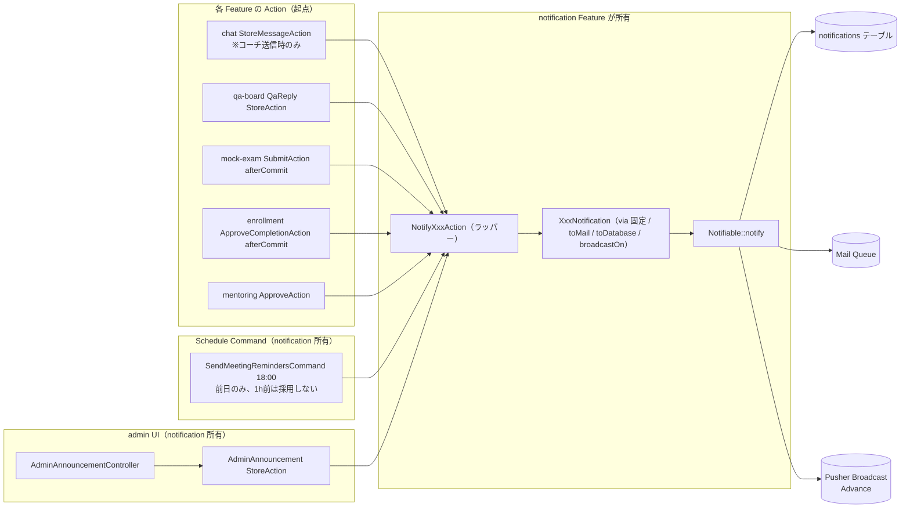

### 2. chat 新着通知フロー（コーチ → 受講生のみ）

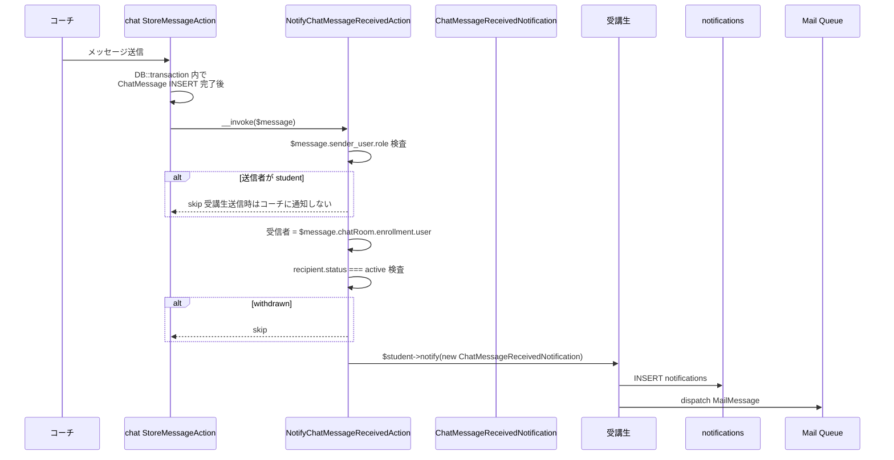

### 3. Q&A 回答通知フロー

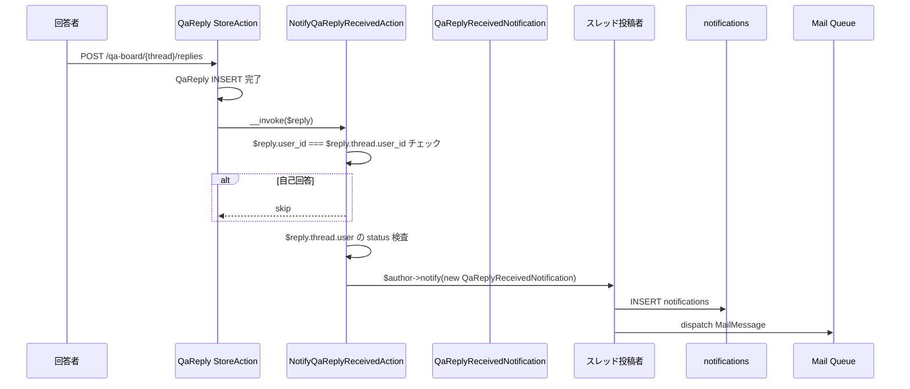

### 4. mock-exam 採点完了通知フロー

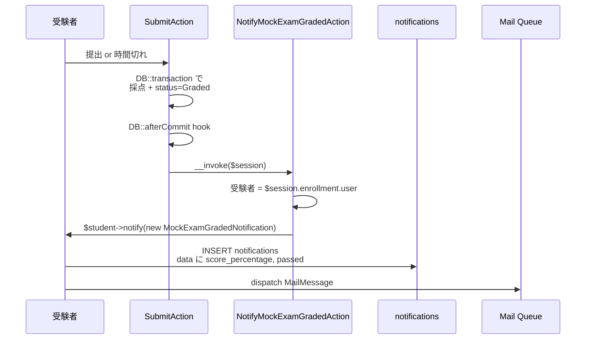

### 5. 修了承認 + 修了証発行通知フロー（受講生宛のみ、admin 宛は採用しない）

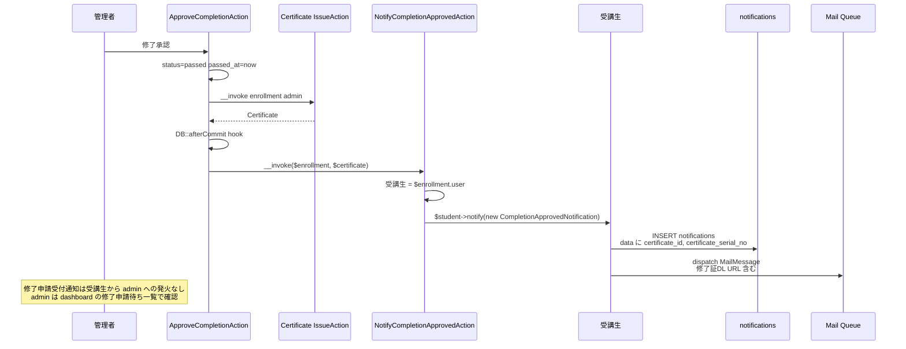

### 6. 面談承認通知フロー（受講生宛のみ）

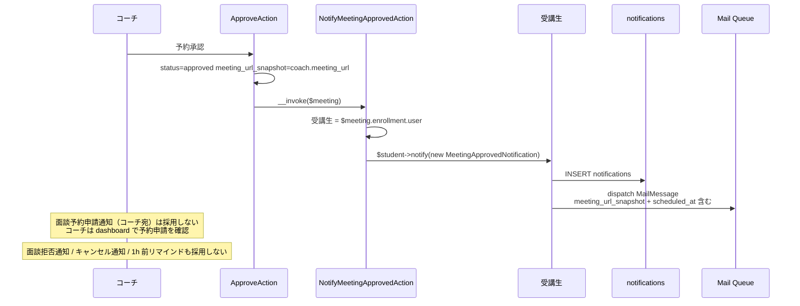

### 7. 面談リマインド通知フロー（前日 18 時 Schedule、重複排除付き）

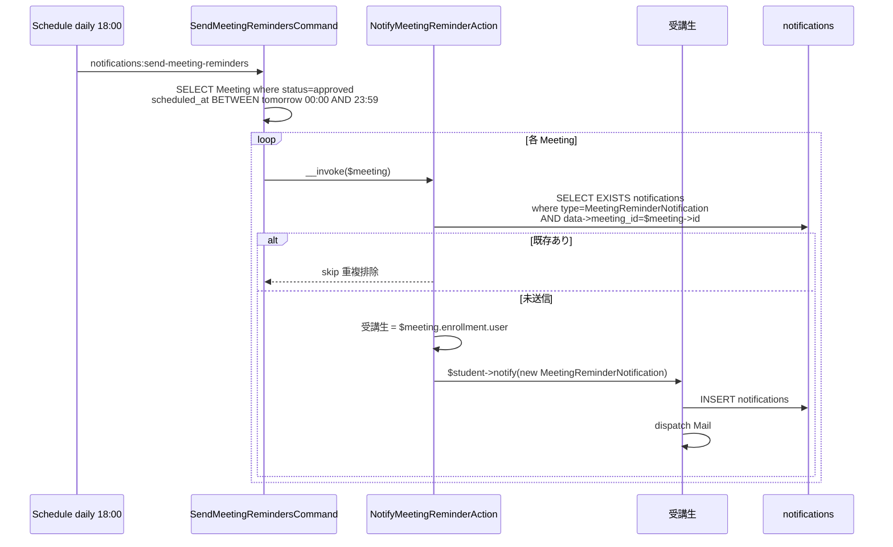

### 8. 管理者お知らせ配信フロー

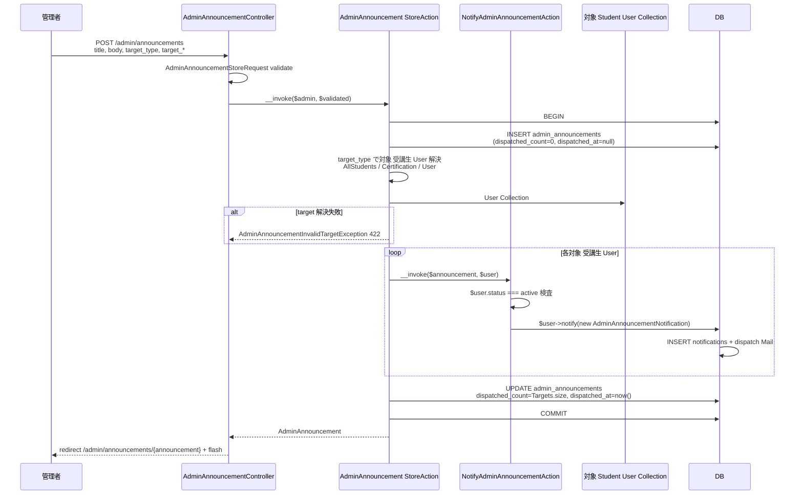

### 9. 通知一覧表示 + 既読化フロー

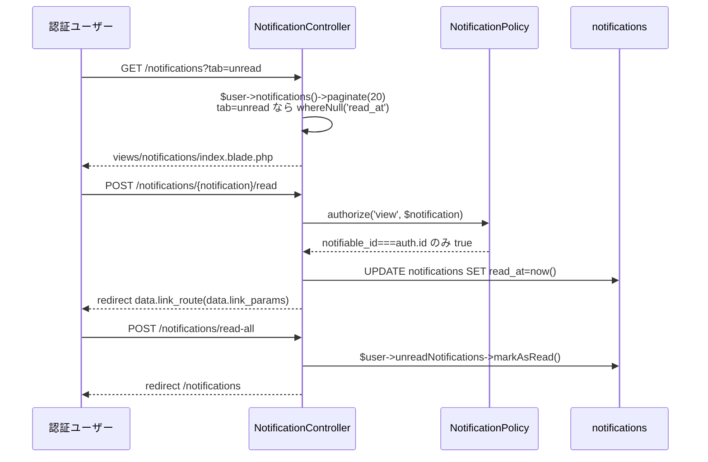

### 10. Advance Broadcasting（Pusher）フロー

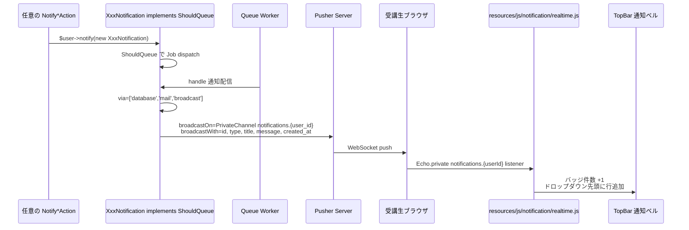

## データモデル

### Eloquent モデル一覧

- **`Illuminate\Notifications\DatabaseNotification`** — Laravel 標準。本 Feature では新設 Model を作らず、Laravel が自動提供する `App\Models\User::notifications()` リレーション（`MorphMany`）を経由してアクセスする。
- **`AdminAnnouncement`** — 管理者お知らせの配信元レコード。`HasUlids` + `HasFactory` + `SoftDeletes`、`AdminAnnouncementTargetType` enum cast、`dispatched_at` を `datetime` cast。`belongsTo(User::class, 'created_by_user_id', 'createdBy')` / `belongsTo(Certification::class, 'target_certification_id', 'targetCertification')` / `belongsTo(User::class, 'target_user_id', 'targetUser')`（後 2 者は nullable）。スコープ: `scopeOrderByDispatchedAt()`（`orderByDesc('dispatched_at')`）。
- **`User`**（[[auth]] 既存）— 本 Feature では `Notifiable` trait の標準動作（`notifications()` / `unreadNotifications` / `readNotifications`）を利用するのみ。新規カラム追加なし。

### ER 図

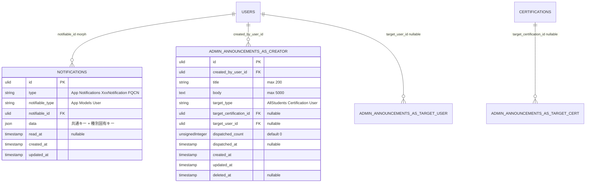

> Mermaid の制約で `users` への 3 つの FK を 1 つの ER box では描き分けにくいため `ADMIN_ANNOUNCEMENTS_AS_*` で分解表記。実テーブルは `admin_announcements` 1 つで `created_by_user_id` / `target_user_id` の 2 カラム + `target_certification_id` を持つ。

### 主要カラム + Enum

| Model | Enum | 値 | 日本語ラベル |
|---|---|---|---|
| `AdminAnnouncement.target_type` | `AdminAnnouncementTargetType`（本 Feature 新設） | `AllStudents` / `Certification` / `User` | `全 active 受講生` / `資格指定` / `ユーザー指定` |

> **`NotificationType` Enum / `NotificationChannel` Enum は本 Feature では採用しない**（[[settings-profile]] 側からも削除）。通知種別は各 `XxxNotification` クラスのクラス名（`type` カラムに FQCN として格納）と `data.notification_type` 文字列で識別する。

### インデックス・制約

`notifications`（Laravel 標準 migration、Wave 0b で公開済を前提）:
- `id`: ULID 主キー（Laravel 標準 migration の `uuid` 型を ULID に置換、本 Feature の補正 migration `change_notifications_id_to_ulid` で対応）
- `(notifiable_type, notifiable_id)`: 複合 INDEX（`$user->notifications()` の MorphMany クエリ最適化、Laravel 標準 migration が付与）
- `(notifiable_type, notifiable_id, read_at)`: 補正 INDEX（未読フィルタ + 件数集計の高速化、本 Feature の追加 migration で付与）
- `created_at`: 単体 INDEX（時系列ソート + リマインド重複検査の高速化）

`admin_announcements`:
- `created_by_user_id`: 外部キー `->constrained('users')->restrictOnDelete()`
- `target_certification_id`: 外部キー `->constrained('certifications')->restrictOnDelete()` nullable
- `target_user_id`: 外部キー `->constrained('users')->restrictOnDelete()` nullable
- `(target_type, dispatched_at)`: 複合 INDEX（admin 一覧 + 集計）
- `dispatched_at`: 単体 INDEX
- `deleted_at`: 単体 INDEX

## 状態遷移

`notification` の状態は `read_at` の有無による **2 状態**（未読 / 既読）のみで、product.md の state diagram には本 Feature 所有エンティティの定義はない。spec で独自定義する。

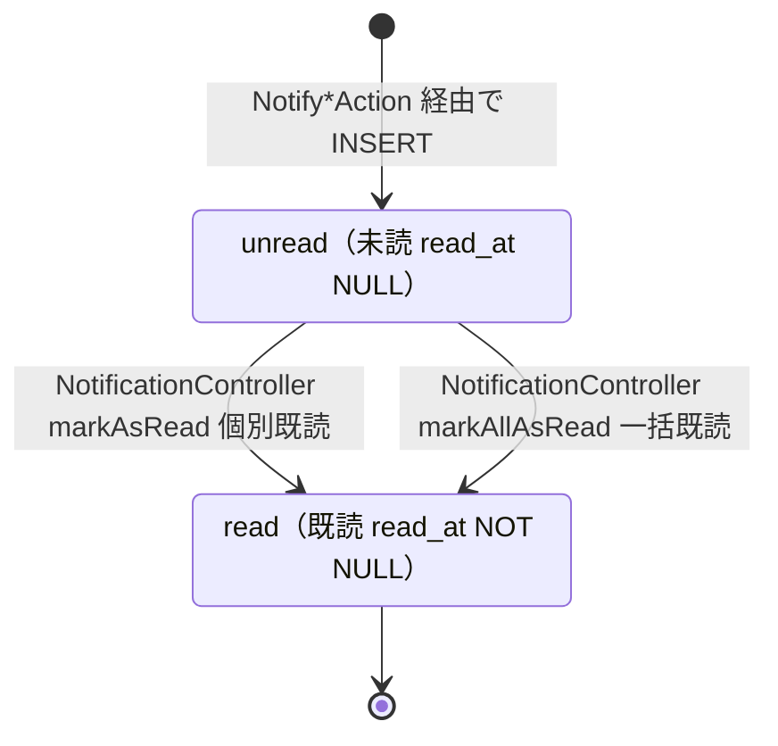

> 既読 → 未読への戻し動線は提供しない（誤クリック復旧は本 Feature スコープ外、UI 上「未読タブ」で未読のみ確認できれば十分）。物理削除も提供しない（履歴保持）。

`AdminAnnouncement` は配信時にステータスを持たず、`dispatched_at` が NULL = 未配信、NOT NULL = 配信済の 2 値を `dispatched_at` の有無で表現する。`StoreAction` は INSERT 直後に同一トランザクション内で配信実行 + `dispatched_at` UPDATE するため、外部から「未配信状態」が観測されることは原則ない。

## コンポーネント

### Controller

`app/Http/Controllers/`（ロール別 namespace は使わず、ルート + middleware で分岐 / `structure.md` 準拠）。

- **`NotificationController`** — 全ロール共通の通知一覧 + 既読化（実運用は受講生中心、admin / coach は通常空）
  - `index(IndexRequest $request, IndexAction $action)` — `GET /notifications`、tab フィルタ + paginate(20)
  - `markAsRead(DatabaseNotification $notification, MarkAsReadAction $action)` — `POST /notifications/{notification}/read`、Policy で当事者検査
  - `markAllAsRead(MarkAllAsReadAction $action)` — `POST /notifications/read-all`、認証ユーザー全未読を既読化
  - `dropdown(DropdownAction $action)` — `GET /notifications/dropdown`、TopBar ドロップダウン用 5 件 JSON / Blade 部分ビュー
- **`Admin\AdminAnnouncementController`** — admin 用配信
  - `index(IndexAction $action)` — `GET /admin/announcements`、配信履歴 paginate(20)
  - `create()` — `GET /admin/announcements/create`、空フォーム表示のみ。**Action 省略**（`backend-usecases.md`「単純な CRUD で Controller → Model だけで済む場合は作らなくて良い」例外、責務が空殻 Action を避ける）
  - `store(StoreRequest $request, StoreAction $action)` — `POST /admin/announcements`、配信実行
  - `show(AdminAnnouncement $announcement, ShowAction $action)` — `GET /admin/announcements/{announcement}`、詳細
  - `edit` / `update` / `destroy` は提供しない（REQ-notification-089）

### Action（UseCase）

各 Action は単一トランザクション境界、`__invoke()` を主とする。Controller method 名と Action クラス名は完全一致（`backend-usecases.md` 規約）。

#### 通知発火ラッパー Action 群（`app/UseCases/Notification/`）

各 `Notify*Action` は受信者解決 → status 検査 → `Notification` クラスを `notify()` で dispatch する薄いラッパー。トランザクション境界は **呼出元 Action 側**。

##### `NotifyChatMessageReceivedAction`

```php
namespace App\UseCases\Notification;

class NotifyChatMessageReceivedAction
{
    /**
     * chat 新着通知を受講生に発火（送信者がコーチの場合のみ）。
     * 受講生送信時はコーチに通知しない（admin/coach 宛通知ゼロ方針）。
     */
    public function __invoke(ChatMessage $message): void;
}
```

責務: (1) `$message->sender_user->role === UserRole::Coach` を検査、`Student` ならスキップ、(2) 受信者 = `$message->chatRoom->enrollment->user`、(3) `recipient.status === active` 検査、(4) `$recipient->notify(new ChatMessageReceivedNotification($message))`。

##### `NotifyQaReplyReceivedAction`

```php
class NotifyQaReplyReceivedAction
{
    public function __invoke(QaReply $reply): void;
}
```

責務: (1) `$reply->user_id === $reply->thread->user_id` なら自己回答スキップ、(2) `$reply->thread->user` を受信者とし status 検査、(3) `$author->notify(new QaReplyReceivedNotification($reply))`。

##### `NotifyMockExamGradedAction`

```php
class NotifyMockExamGradedAction
{
    public function __invoke(MockExamSession $session): void;
}
```

責務: `$session->enrollment->user` を受信者とし status 検査 + `notify(new MockExamGradedNotification($session))`。

##### `NotifyCompletionApprovedAction`

```php
class NotifyCompletionApprovedAction
{
    public function __invoke(Enrollment $enrollment, Certificate $certificate): void;
}
```

責務: `$enrollment->user` を受信者とし status 検査 + `notify(new CompletionApprovedNotification($enrollment, $certificate))`。

##### `NotifyMeetingApprovedAction`

```php
class NotifyMeetingApprovedAction
{
    public function __invoke(Meeting $meeting): void;
}
```

責務: 受講生 = `$meeting->enrollment->user`、status 検査 + `notify(new MeetingApprovedNotification($meeting))`。

##### `NotifyMeetingReminderAction`

```php
class NotifyMeetingReminderAction
{
    /**
     * 重複排除付きリマインド通知。同一 meeting_id で 2 回目以降は skip。
     */
    public function __invoke(Meeting $meeting): void;
}
```

責務: (1) `DB::table('notifications')->where('type', MeetingReminderNotification::class)->whereJsonContains('data->meeting_id', $meeting->id)->exists()` で既存検査、(2) 既存ならスキップ、(3) 受講生 = `$meeting->enrollment->user`、(4) status 検査 + `notify(new MeetingReminderNotification($meeting))`。

##### `NotifyAdminAnnouncementAction`

```php
class NotifyAdminAnnouncementAction
{
    public function __invoke(AdminAnnouncement $announcement, User $recipient): void;
}
```

責務: `$recipient->status === active` 検査 + `$recipient->notify(new AdminAnnouncementNotification($announcement))`。

#### 通知一覧操作 Action 群（`app/UseCases/Notification/`）

##### `IndexAction`

```php
class IndexAction
{
    public function __invoke(User $user, ?string $tab, int $perPage = 20): LengthAwarePaginator;
}
```

責務: `$user->notifications()` 起点 + `$tab === 'unread'` なら `whereNull('read_at')` フィルタ + `orderByDesc('created_at')` + paginate。`data` JSON 内に表示要素を全て含める設計のため eager load 不要（NFR-002）。

##### `MarkAsReadAction`

```php
class MarkAsReadAction
{
    public function __invoke(DatabaseNotification $notification): DatabaseNotification;
}
```

責務: `$notification->markAsRead()`（Laravel 標準）+ `$notification->fresh()` 返却。

##### `MarkAllAsReadAction`

```php
class MarkAllAsReadAction
{
    public function __invoke(User $user): int;
}
```

責務: `$user->unreadNotifications->markAsRead()` を実行し、影響件数を返す。

##### `DropdownAction`

```php
class DropdownAction
{
    public function __invoke(User $user): array
    {
        return [
            'recent' => $user->notifications()->orderByDesc('created_at')->limit(5)->get(),
            'unread_count' => $user->unreadNotifications()->count(),
        ];
    }
}
```

責務: TopBar ドロップダウンと Advance Broadcasting の初期描画用に最近 5 件 + 未読件数を返す。

#### 管理者お知らせ Action（`app/UseCases/Admin/AdminAnnouncement/`）

##### `IndexAction`

```php
namespace App\UseCases\Admin\AdminAnnouncement;

class IndexAction
{
    public function __invoke(int $perPage = 20): LengthAwarePaginator;
}
```

責務: `AdminAnnouncement::with(['createdBy', 'targetCertification', 'targetUser'])->orderByDispatchedAt()->paginate($perPage)`。

##### `StoreAction`

```php
class StoreAction
{
    public function __construct(private NotifyAdminAnnouncementAction $notify) {}

    /**
     * 管理者お知らせを作成し、対象 受講生 User 全員へ通知配信する。
     * 全工程を 1 トランザクションで実行し、いずれか失敗時は Announcement INSERT も含めてロールバック。
     *
     * @throws AdminAnnouncementInvalidTargetException target_type と target_* の不整合
     * @throws AdminAnnouncementTargetNotFoundException target_certification_id / target_user_id の参照先未存在
     */
    public function __invoke(User $admin, array $validated): AdminAnnouncement;
}
```

責務:
1. `target_type` と `target_certification_id` / `target_user_id` の組合せ整合性検査（`AllStudents` なら両 NULL、`Certification` なら `target_certification_id` NOT NULL、`User` なら `target_user_id` NOT NULL）→ 違反時 `AdminAnnouncementInvalidTargetException`
2. `DB::transaction()` 内で:
   - `AdminAnnouncement::create([...])`（`dispatched_count=0`, `dispatched_at=null`）
   - 対象 受講生 User 解決:
     - `AllStudents`: `User::where('role', Student)->where('status', Active)->get()`
     - `Certification`: 上記 + `whereHas('enrollments', fn ($q) => $q->where('certification_id', ...)->whereIn('status', [Learning, Paused]))`
     - `User`: `User::where('id', $announcement->target_user_id)->where('role', Student)->where('status', Active)->get()`（受講生のみ、空 Collection 時は配信件数 0）
   - 各対象 User へ `app(NotifyAdminAnnouncementAction::class)($announcement, $user)` を呼ぶ
   - `$announcement->update(['dispatched_count' => $targets->count(), 'dispatched_at' => now()])`

##### `ShowAction`

```php
class ShowAction
{
    public function __invoke(AdminAnnouncement $announcement): AdminAnnouncement;
}
```

責務: `$announcement->load(['createdBy', 'targetCertification', 'targetUser'])` で eager load して返す。

### Notification クラス（`app/Notifications/`）

すべて `App\Notifications\BaseNotification` を継承し、以下の構造で統一する:

```php
namespace App\Notifications;

use Illuminate\Bus\Queueable;
use Illuminate\Notifications\Notification;
use Illuminate\Notifications\Messages\MailMessage;
use Illuminate\Contracts\Queue\ShouldQueue;
use Illuminate\Broadcasting\PrivateChannel;
use Illuminate\Support\Str;

abstract class BaseNotification extends Notification implements ShouldQueue
{
    public function __construct()
    {
        // Laravel が DatabaseChannel 内で参照する $id を ULID で事前確定。
        // 子クラスは parent::__construct() を必ず呼ぶ。
        $this->id = (string) Str::ulid();
    }

    public function via($notifiable): array
    {
        // 全種別固定: Database + Mail + (Advance: Broadcast)
        // ユーザー設定 UI を持たない方針のため、各クラスでの override は不要
        $channels = ['database', 'mail'];
        if (config('broadcasting.default') !== 'null') {
            $channels[] = 'broadcast';
        }
        return $channels;
    }
}

class XxxNotification extends BaseNotification
{
    use Queueable;

    public function __construct(public readonly /* Entity */ $entity)
    {
        parent::__construct();
    }

    public function toDatabase($notifiable): array
    {
        return [
            'notification_type' => 'xxx',
            'title' => '...',
            'message' => '...',
            'link_route' => '...',
            'link_params' => [...],
            // 種別固有キー
        ];
    }

    public function toMail($notifiable): MailMessage
    {
        return (new MailMessage)
            ->subject('【Certify LMS】...')
            ->greeting("{$notifiable->name} さん")
            ->line('...')
            ->action('...', route('...', [...]));
    }

    public function broadcastOn(): PrivateChannel
    {
        return new PrivateChannel("notifications.{$this->notifiable->id}");
    }

    public function broadcastWith(): array
    {
        return [
            'id' => /* ... */,
            'notification_type' => 'xxx',
            'title' => /* ... */,
            'message' => /* ... */,
            'created_at' => now()->toIso8601String(),
        ];
    }
}
```

#### Notification クラス一覧（7 種類）

| クラス | 受信者 | via 既定 | 用途 |
|---|---|---|---|
| `ChatMessageReceivedNotification` | 受講生（コーチからの送信時のみ）| Database + Mail | 新着 chat |
| `QaReplyReceivedNotification` | スレッド投稿者 | Database + Mail | Q&A 回答受信 |
| `MockExamGradedNotification` | 受験者本人 | Database + Mail | 模試採点完了 |
| `CompletionApprovedNotification` | 受講生本人 | Database + Mail | 修了承認 + 修了証発行 |
| `MeetingApprovedNotification` | 受講生 | Database + Mail | 面談予約承認 |
| `MeetingReminderNotification` | 受講生 | Database + Mail | 面談前日 18 時リマインド |
| `AdminAnnouncementNotification` | 配信対象（受講生）| Database + Mail | 管理者お知らせ |

合計 **7 クラス**。`via()` は `BaseNotification` の既定実装を継承し、各クラスでの override は行わない（ユーザー設定マトリクスを持たない方針と整合）。

### Service

本 Feature では **計算 Service を新規作成しない**。集計は `App\View\Composers\NotificationBadgeComposer` で完結し、純粋ロジックは各 `Notify*Action` 内の status 検査と `NotifyMeetingReminderAction` 内の重複排除検査に閉じる。

### View Composer

#### `NotificationBadgeComposer`

```php
namespace App\View\Composers;

use Illuminate\View\View;

class NotificationBadgeComposer
{
    public function compose(View $view): void
    {
        if (! auth()->check()) {
            $view->with('notificationBadge', ['count' => 0, 'display' => null]);
            return;
        }
        $count = auth()->user()->unreadNotifications()->count();
        $view->with('notificationBadge', [
            'count' => $count,
            'display' => $count === 0 ? null : ($count > 99 ? '99+' : (string) $count),
        ]);
    }
}
```

`AppServiceProvider::boot()` で `View::composer(['layouts._partials.topbar', 'layouts._partials.sidebar-admin', 'layouts._partials.sidebar-coach', 'layouts._partials.sidebar-student'], NotificationBadgeComposer::class)` を登録。1 リクエスト 1 回の `count()` クエリで完結（NFR-notification-005）。

### Schedule Command

`app/Console/Commands/Notification/`:

#### `SendMeetingRemindersCommand`

- signature: `notifications:send-meeting-reminders`
- handle: `Meeting::where('status', MeetingStatus::Approved)->whereBetween('scheduled_at', [now()->addDay()->startOfDay(), now()->addDay()->endOfDay()])->each(fn ($m) => app(NotifyMeetingReminderAction::class)($m))`
- スケジュール: `app/Console/Kernel.php::schedule()` で `->command('notifications:send-meeting-reminders')->dailyAt('18:00')`

> 1 時間前リマインドは採用しない（前日 18 時のみ）。学習途絶リマインド Schedule Command も採用しない。

### Policy

#### `NotificationPolicy`

```php
namespace App\Policies;

use Illuminate\Notifications\DatabaseNotification;

class NotificationPolicy
{
    public function view(User $auth, DatabaseNotification $notification): bool
    {
        return $notification->notifiable_type === User::class
            && (string) $notification->notifiable_id === (string) $auth->id;
    }

    public function update(User $auth, DatabaseNotification $notification): bool
    {
        return $this->view($auth, $notification);
    }
}
```

`AuthServiceProvider::$policies` に `DatabaseNotification::class => NotificationPolicy::class` を登録。

#### `AdminAnnouncementPolicy`

```php
class AdminAnnouncementPolicy
{
    public function viewAny(User $auth): bool { return $auth->role === UserRole::Admin; }
    public function view(User $auth, AdminAnnouncement $announcement): bool { return $auth->role === UserRole::Admin; }
    public function create(User $auth): bool { return $auth->role === UserRole::Admin; }
    // update / delete は提供しない（REQ-notification-089）
}
```

### FormRequest

`app/Http/Requests/`:

| FormRequest | rules | authorize |
|---|---|---|
| `Notification\IndexRequest` | `tab: nullable in:all,unread` / `page: nullable integer min:1` | `$this->user() !== null`（auth middleware で保証）|
| `Admin\AdminAnnouncement\StoreRequest` | `title: required string max:200` / `body: required string max:5000` / `target_type: required in:all_students,certification,user` / `target_certification_id: required_if:target_type,certification ulid exists:certifications,id` / `target_user_id: required_if:target_type,user ulid exists:users,id` | `$this->user()->can('create', AdminAnnouncement::class)` |

### Route

`routes/web.php`（structure.md 規約「単一 web.php」準拠）:

```php
// 全認証ユーザー共通
Route::middleware('auth')->group(function () {
    Route::get('/notifications', [NotificationController::class, 'index'])->name('notifications.index');
    Route::get('/notifications/dropdown', [NotificationController::class, 'dropdown'])->name('notifications.dropdown');
    Route::post('/notifications/{notification}/read', [NotificationController::class, 'markAsRead'])->name('notifications.markAsRead');
    Route::post('/notifications/read-all', [NotificationController::class, 'markAllAsRead'])->name('notifications.markAllAsRead');
});

// admin 専用
Route::middleware(['auth', 'role:admin'])->prefix('admin')->name('admin.')->group(function () {
    Route::resource('announcements', Admin\AdminAnnouncementController::class)
        ->only(['index', 'create', 'store', 'show'])
        ->parameters(['announcements' => 'announcement'])
        ->names('announcements');
});
```

### Broadcasting

`routes/channels.php`:

```php
use App\Models\User;
use Illuminate\Support\Facades\Broadcast;

Broadcast::channel('notifications.{userId}', function (User $user, string $userId) {
    return (string) $user->id === $userId;
});
```

`config/broadcasting.php` の `default` を `pusher`（Advance）または `null`（Basic 動作確認用）で切替可能とする。Basic スコープでは `BROADCAST_DRIVER=null` で動作し、Notification クラスの `via()` が `'broadcast'` を返さない（`BaseNotification::via` 内の `config('broadcasting.default') !== 'null'` 判定）。

`resources/js/notification/realtime.js`（Advance 実装）:

```javascript
import Echo from 'laravel-echo';
import Pusher from 'pusher-js';

window.Pusher = Pusher;
window.Echo = new Echo({
    broadcaster: 'pusher',
    key: import.meta.env.VITE_PUSHER_APP_KEY,
    cluster: import.meta.env.VITE_PUSHER_APP_CLUSTER,
    forceTLS: true,
});

const userId = document.querySelector('meta[name="auth-user-id"]')?.content;
if (userId) {
    window.Echo.private(`notifications.${userId}`)
        .notification((payload) => {
            // TopBar バッジ +1 / ドロップダウン先頭に行追加
            updateBellBadge();
            prependDropdownItem(payload);
        });
}
```

## Blade ビュー

`resources/views/notifications/`（受講生 / 共通）と `resources/views/admin/announcements/`（admin 専用）に配置。

| ファイル | 役割 |
|---|---|
| `notifications/index.blade.php` | 通知一覧（`<x-tabs>` で全件 / 未読切替、`<x-card>` 縦並びで時系列表示、各行クリックで `notifications.markAsRead` POST → `data.link_route` 遷移、ヘッダーに「全件既読」`<x-button variant="outline">`）|
| `notifications/_partials/notification-row.blade.php` | 1 通知の表示部分（`<x-icon>` で種別アイコン + タイトル + プレビュー本文 + 経過時間 + 未読バッジ）|
| `notifications/_partials/dropdown.blade.php` | TopBar ドロップダウン用部分ビュー（最近 5 件 + 「すべての通知を見る」リンク）|
| `admin/announcements/index.blade.php` | 配信履歴一覧（タイトル / 配信日時 / 対象種別 / 配信件数 / 詳細リンク）+ 「+新規配信」ボタン + ページネーション |
| `admin/announcements/create.blade.php` | お知らせ作成フォーム（タイトル / 本文 / 対象種別ラジオ / 対象種別に応じて `<x-form.select>` 表示切替）|
| `admin/announcements/show.blade.php` | お知らせ詳細（タイトル全文 / 本文全文 / 対象種別解決結果 / 配信件数 / 配信日時 / 「配信履歴に戻る」）|
| `admin/announcements/_partials/target-fields.blade.php` | 対象種別ごとの入力フィールド部分ビュー（target_certification_id / target_user_id を素の JS で表示切替）|
| `layouts/_partials/topbar.blade.php`（[[frontend-ui-foundation]] 既存）への追記 | 通知ベル `<button>` + バッジ + ドロップダウン部分ビュー include |
| `layouts/_partials/sidebar-{role}.blade.php`（[[frontend-ui-foundation]] 既存）への追記 | 「通知」`<x-nav.item>` の `:badge="$notificationBadge['count']"` 引数 |

> Mail テンプレ Blade は `MailMessage` を使うため独立 `resources/views/emails/` ファイルは作成しない（NFR-notification-006 で合意した方式）。Mail の見た目は Laravel デフォルト `notifications::email` テンプレに従う。

### 主要 Blade コンポーネント参照（[[frontend-blade.md]] の共通コンポーネント API のみ使用）

- `<x-button>` / `<x-link-button>` — 「全件既読」「+新規配信」「詳細」
- `<x-tabs>` — 通知一覧の全件 / 未読切替
- `<x-table>` / `<x-paginator>` — 配信履歴
- `<x-card>` — 通知行の縦並びレイアウト
- `<x-badge variant="danger">未読</x-badge>` — 未読表示
- `<x-empty-state icon="bell">` — 通知 0 件時
- `<x-icon name="bell">` 等 — 種別アイコン
- `<x-form.input>` / `<x-form.textarea maxlength="5000">` / `<x-form.select>` / `<x-form.radio>` — 管理者お知らせフォーム
- `<x-alert>` / `<x-flash>` — 配信成功フィードバック
- `<x-breadcrumb>` — admin 配下のパンくず

## エラーハンドリング

### 想定例外（`app/Exceptions/Notification/`）

- **`AdminAnnouncementInvalidTargetException`** — `UnprocessableEntityHttpException` 継承（HTTP 422）
  - メッセージ: 「お知らせの対象種別と対象指定の組合せが不正です。」
  - 発生: `Admin\AdminAnnouncement\StoreAction` で `target_type` と `target_certification_id` / `target_user_id` の組合せが不整合
- **`AdminAnnouncementTargetNotFoundException`** — `NotFoundHttpException` 継承（HTTP 404）
  - メッセージ: 「指定された対象（資格またはユーザー）が見つかりません。」
  - 発生: `target_type=Certification` で `target_certification_id` の Certification が SoftDelete されていた / `target_type=User` で `target_user_id` の User が `withdrawn` になっていた等

### Controller / Action の境界

- **FormRequest が一次防御**: バリデーション + Policy 認可で 422 / 403 を返す
- **Action が二次防御**: ドメイン状態整合性は Action 内で具象例外
- **Route Model Binding**: `DatabaseNotification $notification` / `AdminAnnouncement $announcement` は標準 Implicit Binding、未存在は 404

### 配信失敗時のロールバック

- `Admin\AdminAnnouncement\StoreAction` の `DB::transaction()` 内で 1 通でも `notify()` 呼出が例外を投げた場合、`AdminAnnouncement` INSERT も含めて全体 ROLLBACK（NFR-notification-001）
- 個別の Mail 送信失敗は Queue Worker 側で `--tries=3 --backoff=10` でリトライ。最終失敗は `failed_jobs` テーブルに記録

### 列挙攻撃 / 情報漏洩の防止

- 他人の通知 ID を直接指定して `markAsRead` 実行しても、`NotificationPolicy::update` で `notifiable_id !== auth.id` を 403
- `/admin/announcements` 系は `role:admin` middleware + `AdminAnnouncementPolicy` の二段で防御
- Pusher private channel は `routes/channels.php` の認可で「自分の `userId` に一致する channel のみ subscribe 可」を保証

## 関連要件マッピング

| 要件 ID | 実装ポイント |
|---|---|
| REQ-notification-001 | Laravel 標準 migration `database/migrations/{date}_create_notifications_table.php`（Wave 0b 公開済前提）|
| REQ-notification-002 | `database/migrations/{date}_change_notifications_id_to_ulid.php`（補正 migration）+ `App\Notifications\BaseNotification::__construct` で `$this->id = (string) Str::ulid()` を設定 |
| REQ-notification-003 | 各 `XxxNotification::toDatabase` の共通キー実装 |
| REQ-notification-004 | 各 `XxxNotification::toDatabase` 内の種別固有キー追加 |
| REQ-notification-010 | `database/migrations/{date}_create_admin_announcements_table.php` / `App\Models\AdminAnnouncement` / `database/factories/AdminAnnouncementFactory.php` |
| REQ-notification-011 | `App\Enums\AdminAnnouncementTargetType.php`（label() 含む）|
| REQ-notification-012 | `App\UseCases\Admin\AdminAnnouncement\StoreAction` 内の整合性検査 + `App\Exceptions\Notification\AdminAnnouncementInvalidTargetException` |
| REQ-notification-013 | 同上 |
| REQ-notification-020 | `app/Notifications/BaseNotification.php`（abstract、ULID id 設定） |
| REQ-notification-021 | `BaseNotification::via()` の固定実装（`['database', 'mail']` + Advance 時 `'broadcast'` 追加、各クラスでの override なし） |
| REQ-notification-022 | `app/UseCases/Notification/Notify*Action.php`（7 ファイル）|
| REQ-notification-023 | 各 `Notify*Action::__invoke` 内の status 検査 + `notify()` 呼出 |
| REQ-notification-024 | 各 `Notify*Action` の `if ($recipient->status !== UserStatus::Active) return;` ガード |
| REQ-notification-025 | 各 `XxxNotification::toMail` が `MailMessage` を返却（独立 `Mailable` クラス無し）|
| REQ-notification-026 | `NotifyChatMessageReceivedAction` の sender role 検査（受講生送信時スキップ）+ その他 6 種類は受講生のみを受信者として解決する Action 実装 |
| REQ-notification-030 | `App\UseCases\Notification\NotifyChatMessageReceivedAction` / `App\Notifications\ChatMessageReceivedNotification` |
| REQ-notification-031 | `NotifyChatMessageReceivedAction` の `if ($message->sender_user->role !== UserRole::Coach) return;` ガード後、受信者通知 |
| REQ-notification-032 | 同上の sender role ガード（受講生送信時の早期 return）|
| REQ-notification-033 | `ChatMessageReceivedNotification::toDatabase` の data 構造 |
| REQ-notification-040 | `App\UseCases\Notification\NotifyQaReplyReceivedAction` / `App\Notifications\QaReplyReceivedNotification` |
| REQ-notification-041 | `NotifyQaReplyReceivedAction` 冒頭の自己回答ガード |
| REQ-notification-042 | `BaseNotification::via` の固定動作（QaReplyReceivedNotification も継承） |
| REQ-notification-043 | `QaReplyReceivedNotification::toDatabase` の data 構造 |
| REQ-notification-050 | `App\UseCases\Notification\NotifyMockExamGradedAction` / `App\Notifications\MockExamGradedNotification` |
| REQ-notification-051 | `BaseNotification::via` の固定動作 |
| REQ-notification-052 | `MockExamGradedNotification::toDatabase` の data 構造 |
| REQ-notification-053 | 同上 + `link_route='mock-exams.sessions.show'` |
| REQ-notification-060 | `App\UseCases\Notification\NotifyCompletionApprovedAction` / `App\Notifications\CompletionApprovedNotification` |
| REQ-notification-061 | `CompletionApprovedNotification::toMail` 内の `->action('修了証をダウンロード', route('certificates.download', $this->certificate))` |
| REQ-notification-062 | `CompletionApprovedNotification::toDatabase` の data 構造 |
| REQ-notification-063 | （明示的な実装なし、`enrollment` の `RequestCompletionAction` から `Notify*Action` を呼ばないことで担保。tasks.md Step 10 で `RequestCompletionAction` 内通知 dispatch コードの追加を明示的に **除外** ）|
| REQ-notification-070 | `App\UseCases\Notification\NotifyMeetingApprovedAction` / `App\Notifications\MeetingApprovedNotification` の `toMail` 内 `meeting_url_snapshot` + `scheduled_at` 表示 |
| REQ-notification-071 | `App\UseCases\Notification\NotifyMeetingReminderAction` / `App\Notifications\MeetingReminderNotification` / `app/Console/Commands/Notification/SendMeetingRemindersCommand`（前日 18 時のみ）|
| REQ-notification-072 | `NotifyMeetingReminderAction` 冒頭の `whereJsonContains('data->meeting_id', ...)` 既存検査 |
| REQ-notification-073 | `BaseNotification::via` の固定動作 |
| REQ-notification-074 | mentoring 系 2 Notification の `toDatabase` data 構造 |
| REQ-notification-075 | （明示的な実装なし、`mentoring` の `StoreAction` / `RejectAction` / `CancelAction` から `Notify*Action` を呼ばないこと + `SendMeetingRemindersCommand` から 1 時間前リマインドを呼ばないことで担保。tasks.md Step 10 で除外を明示）|
| REQ-notification-080 | `app/Http/Controllers/Admin/AdminAnnouncementController.php`（4 メソッド）|
| REQ-notification-081 | `app/UseCases/Admin/AdminAnnouncement/StoreAction.php` |
| REQ-notification-082 | `StoreAction` 内の AllStudents 解決ロジック |
| REQ-notification-083 | `StoreAction` 内の Certification 解決ロジック |
| REQ-notification-084 | `StoreAction` 内の User 解決ロジック（受講生限定）|
| REQ-notification-085 | `BaseNotification::via` の固定動作（AdminAnnouncementNotification も継承） |
| REQ-notification-086 | `AdminAnnouncementNotification::toDatabase` の data 構造 |
| REQ-notification-087 | `AdminAnnouncementController::index` / `app/UseCases/Admin/AdminAnnouncement/IndexAction.php` / `views/admin/announcements/index.blade.php` |
| REQ-notification-088 | `AdminAnnouncementController::show` / `app/UseCases/Admin/AdminAnnouncement/ShowAction.php` / `views/admin/announcements/show.blade.php` |
| REQ-notification-089 | `routes/web.php` の `Route::resource(...)->only(['index', 'create', 'store', 'show'])` |
| REQ-notification-090 | `app/Http/Controllers/NotificationController.php`（4 メソッド）|
| REQ-notification-091 | `app/UseCases/Notification/IndexAction.php` |
| REQ-notification-092 | `app/Http/Requests/Notification/IndexRequest.php`（`tab: nullable in:all,unread`）+ `IndexAction` 内 `whereNull('read_at')` |
| REQ-notification-093 | `NotificationController::markAsRead` / `app/UseCases/Notification/MarkAsReadAction.php` + Controller 側で `redirect(route($n->data['link_route'], $n->data['link_params']))` |
| REQ-notification-094 | `NotificationController::markAllAsRead` / `app/UseCases/Notification/MarkAllAsReadAction.php` |
| REQ-notification-095 | `views/notifications/index.blade.php`（`@if(!$notification->read_at) <x-badge variant="danger">未読</x-badge> @endif`）|
| REQ-notification-100 | `app/View/Composers/NotificationBadgeComposer.php` + `AppServiceProvider::boot` の `View::composer(...)` 登録 |
| REQ-notification-101 | `views/layouts/_partials/topbar.blade.php` への通知ベル追記 + `<x-badge variant="danger">` |
| REQ-notification-102 | `NotificationBadgeComposer::compose` 内の `$count > 99 ? '99+' : ...` |
| REQ-notification-103 | `NotificationController::dropdown` / `app/UseCases/Notification/DropdownAction.php` / `views/notifications/_partials/dropdown.blade.php` |
| REQ-notification-104 | `views/layouts/_partials/sidebar-{role}.blade.php`（admin / coach / student の 3 ファイル）への `<x-nav.item route="notifications.index" :badge="...">` 追記 |
| REQ-notification-110 | `routes/web.php` の `Route::middleware('auth')->group(...)` |
| REQ-notification-111 | `app/Policies/NotificationPolicy.php::view` |
| REQ-notification-112 | `NotificationController` 内のすべての操作で `auth()->user()->notifications()` 経由 + Policy 二段防御 |
| REQ-notification-113 | `routes/web.php` の `Route::middleware(['auth', 'role:admin'])->prefix('admin')->group(...)` |
| REQ-notification-114 | `app/Policies/AdminAnnouncementPolicy.php` + `AuthServiceProvider::$policies` 登録 |
| REQ-notification-120 | 各 `XxxNotification::broadcastOn` 実装 |
| REQ-notification-121 | 各 `XxxNotification::broadcastWith` 実装 |
| REQ-notification-122 | `resources/js/notification/realtime.js` の Echo subscribe + バッジ更新ロジック |
| REQ-notification-123 | `routes/channels.php` の `Broadcast::channel('notifications.{userId}', ...)` 認可 |
| REQ-notification-124 | `BaseNotification implements ShouldQueue` + `use Queueable` を継承する各 Notification |
| REQ-notification-125 | `config/queue.php` の `database` driver 設定（Wave 0b 整備済前提）+ tasks.md の動作確認に `sail artisan queue:work` 起動を含める |
| NFR-notification-001 | `Admin\AdminAnnouncement\StoreAction` の `DB::transaction()` 内に `Announcement INSERT` + `notify()` 群 + `dispatched_count UPDATE` を全て含める |
| NFR-notification-002 | `IndexAction` で `$user->notifications()->paginate()`（追加 with は不要、`data` JSON 内に表示要素を全て含める設計）|
| NFR-notification-003 | `app/Exceptions/Notification/AdminAnnouncementInvalidTargetException.php` / `AdminAnnouncementTargetNotFoundException.php` |
| NFR-notification-004 | `views/notifications/**` および `views/admin/announcements/**` の Blade がすべて `frontend-blade.md` 共通コンポーネントのみで構成 |
| NFR-notification-005 | `NotificationBadgeComposer::compose` の単一 `count()` クエリ |
| NFR-notification-006 | 各 `XxxNotification::toMail` で `->subject('【Certify LMS】...')` |
| NFR-notification-007 | `NotifyMeetingReminderAction` 内の重複排除検査 |
| NFR-notification-008 | `.env.example` への `PUSHER_APP_KEY` / `PUSHER_APP_SECRET` / `PUSHER_APP_ID` / `PUSHER_APP_CLUSTER` 追加 + `config/broadcasting.php` の参照 |
| NFR-notification-009 | `tests/Feature/Notifications/*Test.php` で `Notification::fake()` + `Notification::assertSentTo(...)` 利用 |
| NFR-notification-010 | `views/layouts/_partials/topbar.blade.php` の通知ベル `<button aria-label="通知 {未読件数} 件">` + `views/notifications/index.blade.php` の `role="alert"` |
