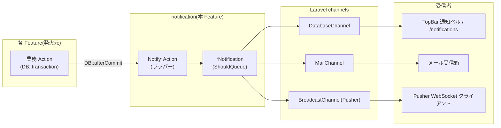
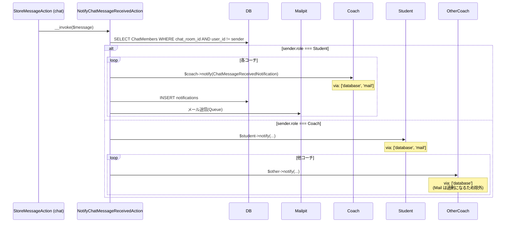
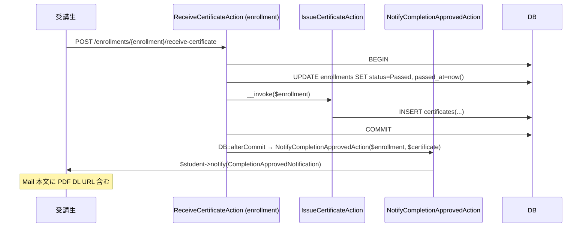
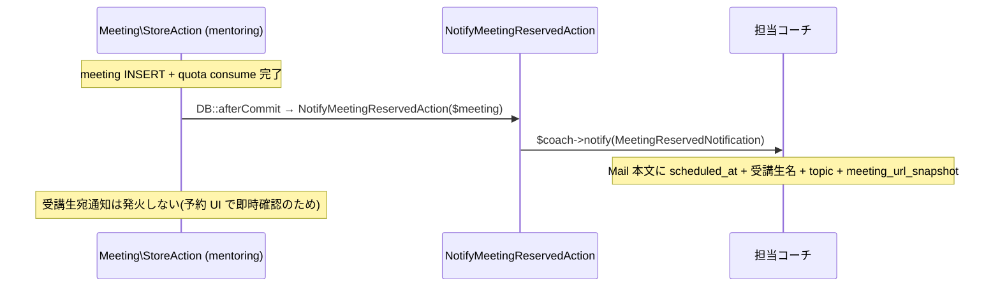

# notification 設計

> **v3 改修反映**(2026-05-16):
> - `CompletionApprovedNotification` 発火元を [[enrollment]] `ReceiveCertificateAction`(受講生自己発火)に変更
> - **撤回された通知**: `MeetingRequestedNotification` / `MeetingApprovedNotification` / `MeetingRejectedNotification`(mentoring 申請承認フロー撤回) / `PlanExpireSoonNotification`(MVP 外) / `StagnationReminderNotification`(滞留検知 v3 撤回)
> - **新規**: `MeetingReservedNotification`(自動予約完了通知、コーチ宛のみ)
> - chat 通知の **双方向化**(受講生→全コーチ、コーチ→受講生 + 他コーチ Database のみ)
> - admin 宛通知は引き続き不採用(運用情報は [[dashboard]] 集約)

## アーキテクチャ概要

Laravel の **Notification + Database / Mail channel + Broadcasting** を中核とし、各 Feature が起こしたイベントを「ラッパー Action(`Notify*Action`) → Notification クラス → `Notifiable::notify()` → channel 解決 → 配信」の単線パイプラインで処理する。Notification クラス・ラッパー Action はすべて本 Feature が一括所有し、各 Feature の Action は **constructor injection** で `Notify*Action` を DI して呼ぶ(`app()` ヘルパ Service Locator は不採用、`backend-usecases.md` 規約準拠)。

### 発火方式: ラッパー Action 直接呼出 vs Event/Listener (設計判断)

本 Feature は **「発火元 Action が `Notify*Action` を constructor injection で受けて直接呼ぶ」シンプル方式** を採用する。Laravel 標準の Domain Event + Listener パターン(Pub-Sub)は採用しない。

| 観点 | ラッパー Action 直接呼出(本採用) | Event + Listener(不採用) |
|---|---|---|
| **依存方向** | 発火元 Feature → notification Feature の Action(明示的、code navigation 可能) | 発火元 → Event dispatch → Listener が解決(Listener 登録の追跡が必要) |
| **発火点の追跡** | `use App\UseCases\Notification\NotifyXxxAction;` を grep すれば全 caller がわかる | `Event::dispatch(XxxEvent::class)` → `EventServiceProvider` の listen 配列 → Listener クラスと 3 ホップ追跡 |
| **テスト** | constructor injection で mock 注入 or `Mail::fake` / `Notification::fake` | `Event::fake([XxxEvent::class])` + assertDispatched |
| **教材スコープ** | Pro 生 Junior レベル(Action パターンの延長で理解可能) | Event/Listener 学習負荷増(教材スコープ外) |
| **業界比較** | Shopify / Stripe / Linear 等は Event/Listener 採用 | 大規模 OSS の慣習だが、本 LMS 規模では過剰 |

**採用理由**:
- 発火元の Action コード(例: `chat/StoreMessageAction`)を読めば「どの通知が飛ぶか」が即座にわかる(Listener 登録を辿らずに済む)
- 受講生に Event Listener 学習負荷を強いない(教材スコープを「Action + Service + Repository」に集中)
- Feature 間の依存方向は許容(`chat` の `StoreMessageAction` が `notification` の `NotifyChatMessageReceivedAction` を `use` するのは正当、`backend-usecases.md` の「Feature 間連携のラッパー Action」原則と整合)

**業界標準との差分明示**: 上記表で Event/Listener との比較を spec に明記することで、受講生が「本 LMS の選択がどう違うか」「業界標準でどう書くか」を学べるようにする(Pro 生レベルの教材価値)。

**通知種別は受講生宛 + コーチ宛の 8 種類**(v3 で撤回 3 種類を除いた値):

| # | 通知 | 受信者 | 起点 |
|---|---|---|---|
| 1 | `ChatMessageReceivedNotification` | 受講生→コーチ全員(DB+Mail) / コーチ→受講生(DB+Mail) + 他コーチ(DB のみ) | [[chat]] `StoreMessageAction` |
| 2 | `QaReplyReceivedNotification` | スレッド投稿者(受講生) | [[qa-board]] `QaReply\StoreAction` |
| 3 | `MockExamGradedNotification` | 受験者本人(受講生) | [[mock-exam]] `SubmitAction` 採点完了後 |
| 4 | `CompletionApprovedNotification` | 受講生本人 | **[[enrollment]] `ReceiveCertificateAction`**(v3、受講生自己発火) |
| 5 | **`MeetingReservedNotification`**(v3 新規) | **担当コーチ宛のみ**(受講生宛は予約 UI で即時確認) | [[mentoring]] `Meeting\StoreAction` |
| 6 | `MeetingCanceledNotification` | 相手方(student キャンセル→coach / coach キャンセル→student) | [[mentoring]] `Meeting\CancelAction` |
| 7 | `MeetingReminderNotification` | 受講生 + コーチ両方 | 本 Feature の `SendMeetingRemindersCommand`(前日 18:00 + 1h 前) |
| 8 | `AdminAnnouncementNotification` | 対象 student 集合 | 本 Feature の `Admin\AdminAnnouncement\StoreAction` |

### 1. 全体パイプライン



### 2. chat 双方向通知(v3 新規)



### 3. CompletionApproved 発火元変更(v3)



### 4. MeetingReserved 通知(v3 新規、コーチ宛のみ)



## コンポーネント

### 共通基盤

`App\Notifications\BaseNotification`(abstract、`Illuminate\Notifications\Notification` 継承、`ShouldQueue` 実装):
- コンストラクタで `$this->id = (string) Str::ulid()`
- `via($notifiable): array` で `['database', 'mail', 'broadcast']` を固定返却(3 channel 同時配信)
- `viaQueues(): array` で `['mail' => 'notifications']`

### Notification クラス(v3 で 10 → 8 種類)

`app/Notifications/`:

```php
namespace App\Notifications;

// 受講生→コーチ + コーチ→受講生 + コーチ間 DB only
class ChatMessageReceivedNotification extends BaseNotification {
    public function __construct(public ChatMessage $message, public bool $mailEnabled = true) {}
    public function via($notifiable): array {
        $channels = ['database'];
        if ($this->mailEnabled) $channels[] = 'mail';
        if (config('broadcasting.default') !== 'null') $channels[] = 'broadcast';
        return $channels;
    }
    public function toDatabase($notifiable): array { /* sender_name / body_preview / chat_room_id 等 */ }
    public function toMail($notifiable): MailMessage { /* 件名: 【Certify LMS】... */ }
}

class CompletionApprovedNotification extends BaseNotification {
    public function __construct(public Enrollment $enrollment, public Certificate $certificate) {}
    // Mail 本文に route('certificates.download', $certificate) を含める
}

// v3 新規(自動予約完了通知、コーチ宛のみ)
class MeetingReservedNotification extends BaseNotification {
    public function __construct(public Meeting $meeting) {}
    public function toMail($notifiable): MailMessage {
        return (new MailMessage)
            ->subject('【Certify LMS】新しい面談予約があります')
            ->line("受講生: {$this->meeting->student->name}")
            ->line("日時: {$this->meeting->scheduled_at->format('Y/m/d H:i')}")
            ->line("テーマ: {$this->meeting->topic}")
            ->line("ミーティング URL: {$this->meeting->meeting_url_snapshot}");
    }
}

class MeetingCanceledNotification extends BaseNotification {
    public function __construct(public Meeting $meeting, public User $actor) {}
}

class MeetingReminderNotification extends BaseNotification {
    public function __construct(public Meeting $meeting, public MeetingReminderWindow $window) {}
}

class QaReplyReceivedNotification extends BaseNotification { /* ... */ }
class MockExamGradedNotification extends BaseNotification { /* ... */ }
class AdminAnnouncementNotification extends BaseNotification { /* ... */ }
```

### 明示的に持たない Notification クラス(v3 撤回)

- `MeetingRequestedNotification` / `MeetingApprovedNotification` / `MeetingRejectedNotification`(mentoring 申請承認フロー撤回)
- `PlanExpireSoonNotification`(MVP 外)
- `StagnationReminderNotification`(滞留検知 v3 撤回)

### ラッパー Action(`app/UseCases/Notification/`)

```php
// v3 で双方向化
class NotifyChatMessageReceivedAction
{
    public function __invoke(ChatMessage $message): void
    {
        $sender = $message->sender;
        $members = $message->chatRoom->members()->where('user_id', '!=', $sender->id)->with('user')->get();

        foreach ($members as $member) {
            $recipient = $member->user;
            if ($recipient->status !== UserStatus::InProgress) continue;

            if ($sender->role === UserRole::Student) {
                // 受講生→全コーチ: DB + Mail
                $recipient->notify(new ChatMessageReceivedNotification($message, mailEnabled: true));
            } elseif ($sender->role === UserRole::Coach) {
                // コーチ→受講生: DB + Mail / コーチ→他コーチ: DB のみ
                $mailEnabled = $recipient->role === UserRole::Student;
                $recipient->notify(new ChatMessageReceivedNotification($message, mailEnabled: $mailEnabled));
            }
        }
    }
}

// v3 で発火元変更
class NotifyCompletionApprovedAction
{
    public function __invoke(Enrollment $enrollment, Certificate $certificate): void
    {
        $student = $enrollment->user;
        if ($student->status !== UserStatus::InProgress) return;
        $student->notify(new CompletionApprovedNotification($enrollment, $certificate));
    }
}

// v3 新規
class NotifyMeetingReservedAction
{
    public function __invoke(Meeting $meeting): void
    {
        $coach = $meeting->coach;
        if ($coach->status !== UserStatus::InProgress) return;
        $coach->notify(new MeetingReservedNotification($meeting));
    }
}

class NotifyMeetingCanceledAction
{
    public function __invoke(Meeting $meeting, User $actor): void
    {
        $recipient = $actor->role === UserRole::Student ? $meeting->coach : $meeting->student;
        if ($recipient->status !== UserStatus::InProgress) return;
        $recipient->notify(new MeetingCanceledNotification($meeting, $actor));
    }
}

class NotifyMeetingReminderAction
{
    public function __invoke(Meeting $meeting, MeetingReminderWindow $window): void
    {
        // 重複排除: 既存通知の (meeting_id, window) ペアを JSON path で検査
        if ($this->alreadyDispatched($meeting, $window)) return;

        foreach ([$meeting->student, $meeting->coach] as $user) {
            if ($user->status !== UserStatus::InProgress) continue;
            $user->notify(new MeetingReminderNotification($meeting, $window));
        }
    }
}
```

### 明示的に持たないラッパー Action(v3 撤回)

- `NotifyMeetingRequestedAction` / `NotifyMeetingApprovedAction` / `NotifyMeetingRejectedAction`
- `NotifyStagnationReminderAction` / `NotifyPlanExpireSoonAction`

### 管理者お知らせ Controller / Action

(変更なし、既存通り `AdminAnnouncementController` + `AdminAnnouncement\StoreAction`)

## 関連要件マッピング

| 要件 ID | 実装ポイント |
|---|---|
| REQ-notification-001 | Laravel 標準 `notifications` テーブル |
| REQ-notification-002 | `BaseNotification::__construct` で `$this->id = (string) Str::ulid()` |
| REQ-notification-020〜026 | `App\Notifications\BaseNotification` + 各 Notification クラス |
| REQ-notification-030〜033 | `NotifyChatMessageReceivedAction`(v3 双方向化) |
| REQ-notification-040〜043 | `NotifyQaReplyReceivedAction` |
| REQ-notification-050〜053 | `NotifyMockExamGradedAction` |
| REQ-notification-060〜062 | `NotifyCompletionApprovedAction`(v3 で発火元変更) |
| REQ-notification-070 | `NotifyMeetingReservedAction`(v3 新規) |
| REQ-notification-071 | `NotifyMeetingCanceledAction` |
| REQ-notification-072〜074 | `NotifyMeetingReminderAction` + `SendMeetingRemindersCommand` |
| REQ-notification-075 | 各 `MeetingRequested/Approved/Rejected` 関連を **持たない**(v3 撤回) |
| REQ-notification-080〜089 | `Admin\AdminAnnouncementController` + `StoreAction` |
| REQ-notification-090〜094 | `NotificationController::index/markAsRead/markAllAsRead` |
| REQ-notification-100〜103 | `NotificationBadgeComposer` + `topbar.blade.php` ベル |
| REQ-notification-120〜124 | 各 Notification の `broadcastOn` / `broadcastWith` + `routes/channels.php` + `realtime.js` |
| NFR-notification-001 | 各 Action の `DB::transaction()` |
| NFR-notification-007 | `NotifyMeetingReminderAction` の重複検査 |

## テスト戦略

### Unit(Notification クラス)

- `BaseNotificationTest`(via 構築、ULID id)
- 各 8 Notification の toDatabase / toMail / broadcastOn / broadcastWith

### Feature(ラッパー Action)

- **`NotifyChatMessageReceivedActionTest`(v3)** — 受講生→全コーチ DB+Mail / コーチ→受講生 DB+Mail / コーチ→他コーチ DB only / 担当コーチ未割当 skip / withdrawn skip / graduated skip
- `NotifyCompletionApprovedActionTest`(v3、`ReceiveCertificateAction` 経由で発火確認 / Mail 内 DL URL 含有)
- **`NotifyMeetingReservedActionTest`(v3 新規)** — コーチ宛 dispatch のみ、受講生宛は発火しない / scheduled_at + 受講生名 + meeting_url_snapshot 含有
- `NotifyMeetingCanceledActionTest`(student 発火 → coach 通知 / coach 発火 → student 通知)
- `NotifyMeetingReminderActionTest`(eve / one_hour_before / 重複排除)
- `NotifyQaReplyReceivedActionTest` / `NotifyMockExamGradedActionTest` / `NotifyAdminAnnouncementActionTest`

### 明示的に持たないテスト(v3 撤回)

- `NotifyMeetingRequestedActionTest`
- `NotifyMeetingApprovedActionTest`
- `NotifyMeetingRejectedActionTest`
- `NotifyStagnationReminderActionTest`

### Feature(HTTP)

- `Notification/{Index,MarkAsRead,MarkAllAsRead,Dropdown}Test.php`
- `Admin/AdminAnnouncement/{Index,Store,Show}Test.php`

### Schedule Command

- `SendMeetingRemindersCommandTest`(eve / one_hour_before / 重複起動 skip)
