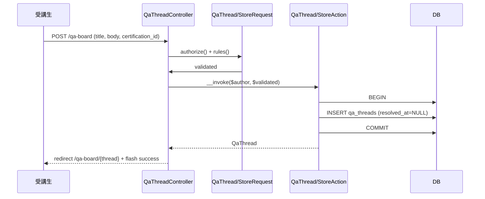
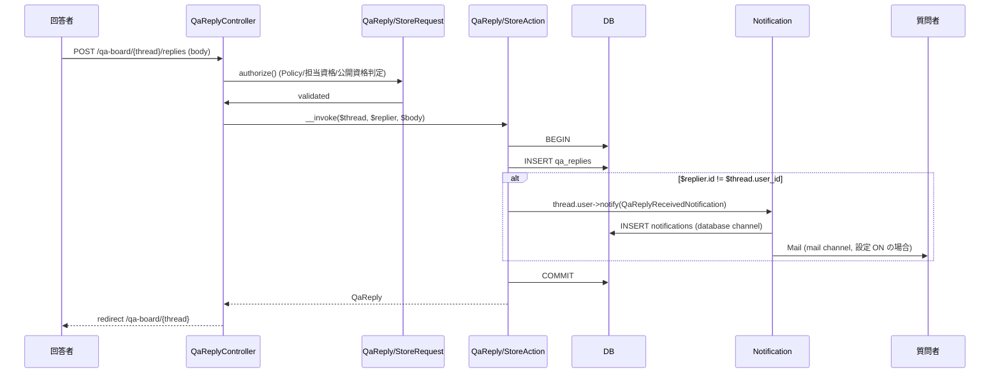
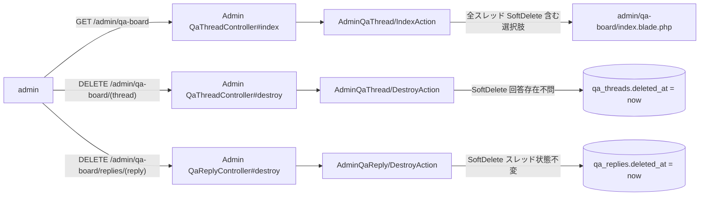
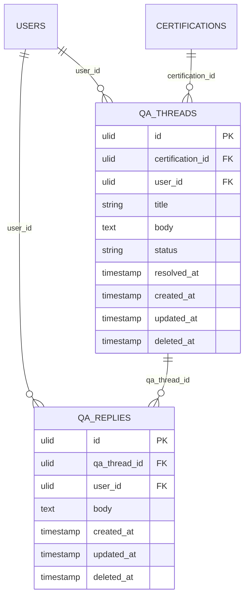
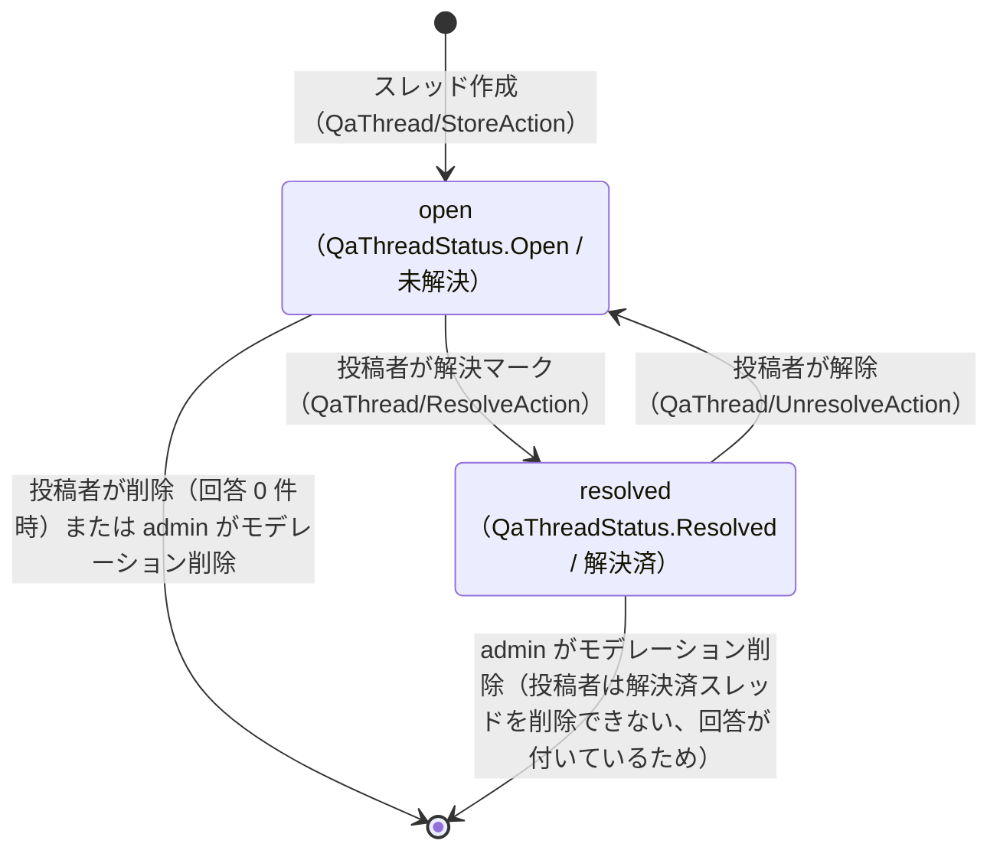

# qa-board 設計

## アーキテクチャ概要

Clean Architecture（軽量版）に則り、Controller → FormRequest → Action（UseCase）→ Eloquent Model + Notification の薄い層分離で実装する。**student / coach 用の公開エンドポイント** と **admin 用モデレーションエンドポイント** で Controller / Action を分離し、認可ルールの違いを設計レベルで明示する。

### スレッド投稿 → 詳細表示フロー



### 回答投稿 → 通知配信フロー



### admin モデレーション削除フロー



## データモデル

### Eloquent モデル一覧

- **`QaThread`** — 質問スレッド。`HasUlids` + `SoftDeletes`。`belongsTo(Certification)` / `belongsTo(User, 'user_id')`（投稿者）/ `hasMany(QaReply)`。`scopeResolved()`（`status = resolved`）/ `scopeUnresolved()`（`status = open`）/ `scopeForCertification($id)`。`isResolved(): bool` ヘルパ（`status === QaThreadStatus::Resolved`）。`$casts` に `'status' => QaThreadStatus::class` / `'resolved_at' => 'datetime'`。
- **`QaReply`** — 回答。`HasUlids` + `SoftDeletes`。`belongsTo(QaThread)` / `belongsTo(User, 'user_id')`（回答者）。

### ER 図



### 主要カラム + Enum

| Model | カラム / Enum | 値 / 型 | 日本語ラベル / 役割 |
|---|---|---|---|
| `QaThread.status` | `App\Enums\QaThreadStatus`（string Enum） | `Open` = `open` / `Resolved` = `resolved` | `未解決` / `解決済`（`label()` メソッド） |
| `QaThread.resolved_at` | nullable datetime | `status = resolved` 時のみ `now()`、`status = open` 時は NULL | 解決日時の記録（一覧 / 詳細での表示に利用、状態判定そのものは `status` で行う）|
| `QaThread.title` | VARCHAR(200) NOT NULL | スレッドタイトル | 全文検索の対象（部分一致 LIKE）|
| `QaThread.body` | TEXT NOT NULL | 質問本文（最大 5000 文字）| 全文検索の対象 |
| `QaReply.body` | TEXT NOT NULL | 回答本文（最大 5000 文字）| 全文検索の対象 |

> Why `status` Enum と `resolved_at` の二本立て: Certify LMS は `Enrollment.status` + `passed_at`、`MockExamSession.status` + `submitted_at` 等、**状態 Enum + 対応する日時カラム** を一貫採用しているため整合させる（`tech.md` 「状態は PHP Enum」規約に準拠）。両者の整合は Action 側の同時更新で担保（`status = resolved` ⇔ `resolved_at != null`）。

### インデックス・制約

- `qa_threads.(certification_id, status)` 複合 INDEX: 「資格別 × 未解決フィルタ」のクエリ高速化（一覧画面のメイン経路）
- `qa_threads.user_id` INDEX: 投稿者別検索（admin モデレーション用）
- `qa_threads.deleted_at` INDEX: SoftDelete フィルタ
- `qa_replies.(qa_thread_id, created_at)` 複合 INDEX: スレッド詳細での回答時系列ソート高速化
- `qa_replies.user_id` INDEX: 回答者別検索（admin モデレーション用）
- `qa_replies.deleted_at` INDEX: SoftDelete フィルタ
- 外部キー: `qa_threads.certification_id → certifications.id` (`onDelete('restrict')`、`Certification` の物理削除は本 Feature でブロック)、`qa_threads.user_id → users.id` (`onDelete('restrict')`)、`qa_replies.qa_thread_id → qa_threads.id` (`onDelete('restrict')`)、`qa_replies.user_id → users.id` (`onDelete('restrict')`)
- UNIQUE 制約は持たない（同一ユーザーが同一資格に複数スレッド投稿可、同一スレッドに複数回答可）

## 状態遷移

`product.md` の state diagram に **本 Feature 所有エンティティの定義がない** ため、spec で独自定義する。`QaThread` のみ状態を持ち、`QaReply` は持たない（投稿 → 編集 → 削除のみ、状態遷移なし）。



> 解決マーク・解除は投稿者本人のみ（admin であっても代行不可、REQ-qa-board-092）。スレッド削除は「open かつ回答 0 件」のみ投稿者が許可、それ以外は admin のみ。

## コンポーネント

### Controller

すべて `auth` ガード前提。`role:admin` Middleware は admin 系のみ適用。

- **`QaThreadController`**（student / coach 用、`/qa-board`）
  - `index(IndexRequest $request, IndexAction $action)` — 一覧（ロール別フィルタは Action 内）
  - `show(QaThread $thread, ShowAction $action)` — 詳細
  - `create()` — スレッド投稿フォーム表示（student のみ Policy で許可）
  - `store(StoreRequest $request, StoreAction $action)` — スレッド投稿
  - `edit(QaThread $thread)` — スレッド編集フォーム表示
  - `update(QaThread $thread, UpdateRequest $request, UpdateAction $action)`
  - `destroy(QaThread $thread, DestroyAction $action)` — 投稿者本人 × 回答 0 件時のみ Policy で許可
  - `resolve(QaThread $thread, ResolveAction $action)`
  - `unresolve(QaThread $thread, UnresolveAction $action)`

- **`QaReplyController`**（student / coach 用、`/qa-board/{thread}/replies`）
  - `store(QaThread $thread, StoreRequest $request, StoreAction $action)`
  - `update(QaThread $thread, QaReply $reply, UpdateRequest $request, UpdateAction $action)`
  - `destroy(QaThread $thread, QaReply $reply, DestroyAction $action)`

- **`Admin\QaThreadController`**（admin 用、`/admin/qa-board`、`role:admin` Middleware 適用）
  - `index(IndexRequest $request, IndexAction $action)` — 全スレッド一覧（SoftDelete 含む切替トグル）
  - `show(QaThread $thread, ShowAction $action)` — 詳細（SoftDelete 済の回答含む）
  - `destroy(QaThread $thread, DestroyAction $action)` — モデレーション削除（回答有無不問）

- **`Admin\QaReplyController`**（admin 用、`/admin/qa-board/replies`）
  - `destroy(QaReply $reply, DestroyAction $action)`

> Controller method 名と Action クラス名は完全一致させる（`backend-usecases.md` 規約）。Admin 配下の Action は `App\UseCases\AdminQaThread\` / `App\UseCases\AdminQaReply\` 配下に独立配置し、公開エンドポイント用 Action と命名衝突しない。

### Action（UseCase）

`app/UseCases/` 配下。各 Action は `__invoke()` 主、`DB::transaction()` で囲む。

#### `QaThread\IndexAction`

```php
namespace App\UseCases\QaThread;

class IndexAction
{
    public function __invoke(User $viewer, array $filters): LengthAwarePaginator;
}
```

責務: `$viewer->role` で分岐し、(a) student は `Certification.status = published` のスレッド全体、(b) coach は `coachingCertificationIds()` のスレッドのみを対象に、`certification_id` / `status` / `keyword` フィルタ + `with(['certification', 'user'])` + `withCount('replies')` を適用、`created_at DESC` で 20 件ページネーション。例外なし、`DB::transaction` 不要（SELECT のみ）。

#### `QaThread\ShowAction`

```php
namespace App\UseCases\QaThread;

class ShowAction
{
    public function __invoke(QaThread $thread): QaThread;
}
```

責務: 引数 `$thread` に `with(['certification', 'user', 'replies.user'])` を eager load して返す。Policy 認可は Controller 側 (`$this->authorize('view', $thread)`) で実施済の前提。

#### `QaThread\StoreAction`

```php
namespace App\UseCases\QaThread;

class StoreAction
{
    public function __invoke(User $author, array $validated): QaThread;
}
```

責務: `qa_threads` に `certification_id` / `user_id = $author->id` / `title` / `body` / `status = QaThreadStatus::Open` / `resolved_at = null` を INSERT。`DB::transaction` でラップ。例外: なし（バリデーションで前提担保）。

#### `QaThread\UpdateAction`

```php
namespace App\UseCases\QaThread;

class UpdateAction
{
    public function __invoke(QaThread $thread, array $validated): QaThread;
}
```

責務: `$thread` の `title` / `body` のみを UPDATE。`certification_id` / `user_id` / `resolved_at` は変更しない。`DB::transaction` でラップ。

#### `QaThread\DestroyAction`

```php
namespace App\UseCases\QaThread;

class DestroyAction
{
    public function __invoke(QaThread $thread): void;
}
```

責務: 整合性チェック「`$thread->replies()->withTrashed()->count() === 0`」を行い、true なら SoftDelete。1 件以上の回答（SoftDelete 含む）があれば `QaThreadHasRepliesException`（HTTP 409）を throw。`DB::transaction` でラップ。

> 注: Controller の Policy（`delete`）は「投稿者本人 OR admin」を判定するが、admin の場合は本 Action ではなく `AdminQaThread\DestroyAction` を経由するため、本 Action に到達するのは「投稿者本人」のみ。回答件数チェックは Action 側の整合性ガードとして二重で実施（Policy で先取りしてもよい）。

#### `QaThread\ResolveAction` / `QaThread\UnresolveAction`

```php
namespace App\UseCases\QaThread;

class ResolveAction
{
    public function __invoke(QaThread $thread): QaThread;
}

class UnresolveAction
{
    public function __invoke(QaThread $thread): QaThread;
}
```

責務:
- `ResolveAction`: `$thread->status === QaThreadStatus::Resolved` なら `QaThreadAlreadyResolvedException`（HTTP 409）。OK なら `status = QaThreadStatus::Resolved` + `resolved_at = now()` を同時 UPDATE。
- `UnresolveAction`: `$thread->status === QaThreadStatus::Open` なら `QaThreadNotResolvedException`（HTTP 409）。OK なら `status = QaThreadStatus::Open` + `resolved_at = null` を同時 UPDATE。
- どちらも `DB::transaction` でラップし、`$thread->fresh()` を返す。`status` と `resolved_at` の整合性を 1 トランザクション内の同時更新で担保（REQ-qa-board-006）。

#### `QaReply\StoreAction`

```php
namespace App\UseCases\QaReply;

class StoreAction
{
    public function __invoke(QaThread $thread, User $replier, string $body): QaReply;
}
```

責務:
1. `qa_replies` に INSERT
2. `app(NotifyQaReplyReceivedAction::class)($reply)` を発火（自己回答ガード + 受信者解決 + Notification dispatch は [[notification]] 所有のラッパー側で処理）
3. `DB::transaction` でラップ

> 通知の Notification クラス本体（`QaReplyReceivedNotification`）と `via()` ロジック（`['database', 'mail']` 固定送信、ユーザー設定 UI 不採用方針、Phase 0 確定）は [[notification]] が所有。本 Action は dispatch 起点のみ提供し、条件分岐 / channel 選択を持たない。

#### `QaReply\UpdateAction`

```php
namespace App\UseCases\QaReply;

class UpdateAction
{
    public function __invoke(QaReply $reply, string $body): QaReply;
}
```

責務: `$reply->body` のみ UPDATE。`DB::transaction` でラップ。

#### `QaReply\DestroyAction`

```php
namespace App\UseCases\QaReply;

class DestroyAction
{
    public function __invoke(QaReply $reply): void;
}
```

責務: SoftDelete のみ。スレッドの `status` / `resolved_at` は変更しない（REQ-qa-board-083）。`DB::transaction` でラップ。

#### `AdminQaThread\IndexAction` / `AdminQaThread\ShowAction` / `AdminQaThread\DestroyAction`

```php
namespace App\UseCases\AdminQaThread;

class IndexAction
{
    public function __invoke(array $filters, bool $withTrashed = false): LengthAwarePaginator;
}

class ShowAction
{
    public function __invoke(QaThread $thread, bool $withTrashedReplies = false): QaThread;
}

class DestroyAction
{
    public function __invoke(QaThread $thread): void;
}
```

責務:
- `IndexAction`: 全資格・全ロールのスレッドを返す（`Certification.status = published` フィルタなし）。`$withTrashed = true` なら SoftDelete 済も含む。`certification_id` / `status` / `keyword` フィルタ。20 件ページネーション。
- `ShowAction`: `$withTrashedReplies = true` なら SoftDelete 済の回答も eager load。
- `DestroyAction`: 回答有無不問で SoftDelete。`DB::transaction` でラップ。

#### `AdminQaReply\DestroyAction`

```php
namespace App\UseCases\AdminQaReply;

class DestroyAction
{
    public function __invoke(QaReply $reply): void;
}
```

責務: SoftDelete のみ。スレッドの `status` / `resolved_at` 変更なし。`DB::transaction` でラップ。

### Service

本 Feature では **計算 Service を新規作成しない**（`product.md` 集計責務マトリクスに本 Feature の Service 記載なし、CRUD + 部分一致検索のみのため）。

サイドバー未回答件数バッジは [[dashboard]] の `App\View\Composers\SidebarBadgeComposer` に **集計 1 クエリを追加する形** で実装する（本 Feature spec の責務だが Composer 自体は Wave 0b で生成済の前提、本 spec で対応カラムロジックを追記）。

集計クエリ:

```php
// SidebarBadgeComposer 内の coach 分岐に追加
if ($user->role === UserRole::Coach) {
    $unansweredQaCount = QaThread::query()
        ->whereIn('certification_id', $user->coachingCertificationIds())
        ->where('status', QaThreadStatus::Open)
        ->whereDoesntHave('replies')
        ->count();
    $badges['unanswered_qa'] = $unansweredQaCount;
}
```

### Policy

`app/Policies/QaThreadPolicy.php` / `app/Policies/QaReplyPolicy.php`。すべて `UserRole` Enum を `match` で判定。

#### `QaThreadPolicy`

```php
class QaThreadPolicy
{
    public function viewAny(User $user): bool
    {
        return in_array($user->role, [UserRole::Admin, UserRole::Coach, UserRole::Student]);
    }

    public function view(User $user, QaThread $thread): bool
    {
        return match ($user->role) {
            UserRole::Admin => true,
            UserRole::Coach => in_array($thread->certification_id, $user->coachingCertificationIds(), true),
            UserRole::Student => $thread->certification?->status === \App\Enums\CertificationStatus::Published,
        };
    }

    public function create(User $user): bool
    {
        return $user->role === UserRole::Student;
    }

    public function update(User $user, QaThread $thread): bool
    {
        return $thread->user_id === $user->id;
    }

    public function delete(User $user, QaThread $thread): bool
    {
        if ($user->role === UserRole::Admin) {
            return true;
        }
        return $thread->user_id === $user->id
            && $thread->replies()->withTrashed()->doesntExist();
    }

    public function resolve(User $user, QaThread $thread): bool
    {
        return $thread->user_id === $user->id;
    }

    public function unresolve(User $user, QaThread $thread): bool
    {
        return $thread->user_id === $user->id;
    }
}
```

#### `QaReplyPolicy`

```php
class QaReplyPolicy
{
    public function create(User $user, QaThread $thread): bool
    {
        return match ($user->role) {
            UserRole::Admin => false,
            UserRole::Coach => in_array($thread->certification_id, $user->coachingCertificationIds(), true),
            UserRole::Student => $thread->certification?->status === \App\Enums\CertificationStatus::Published,
        };
    }

    public function update(User $user, QaReply $reply): bool
    {
        return $reply->user_id === $user->id;
    }

    public function delete(User $user, QaReply $reply): bool
    {
        return $reply->user_id === $user->id
            || $user->role === UserRole::Admin;
    }
}
```

> `User->coachingCertificationIds()` は [[user-management]] / [[certification-management]] 側で `User` モデルに公開済のヘルパを想定（`certification_coach_assignments` から `coach_user_id = $user->id` の `certification_id` 配列を返す。authoritative なカラム名は [[certification-management]] tasks.md の migration 定義で `coach_user_id`）。本 spec では契約として参照のみ。

### FormRequest

`app/Http/Requests/QaThread/` / `app/Http/Requests/QaReply/`。

#### `QaThread\IndexRequest`

```php
public function authorize(): bool { return $this->user()->can('viewAny', QaThread::class); }
public function rules(): array {
    return [
        'certification_id' => ['nullable', 'ulid'],
        'status' => ['nullable', Rule::in(['resolved', 'unresolved'])],
        'keyword' => ['nullable', 'string', 'max:100'],
        'page' => ['nullable', 'integer', 'min:1'],
    ];
}
```

#### `QaThread\StoreRequest`

```php
public function authorize(): bool { return $this->user()->can('create', QaThread::class); }
public function rules(): array {
    return [
        'certification_id' => [
            'required', 'ulid',
            Rule::exists('certifications', 'id')
                ->where('status', \App\Enums\CertificationStatus::Published->value)
                ->whereNull('deleted_at'),
        ],
        'title' => ['required', 'string', 'max:200', 'not_regex:/\A[\s\x{3000}]*\z/u'],
        'body' => ['required', 'string', 'max:5000', 'not_regex:/\A[\s\x{3000}]*\z/u'],
    ];
}
```

> `not_regex` で全角空白（U+3000）と通常空白のみの入力を拒否（REQ-qa-board-023, 024）。

#### `QaThread\UpdateRequest`

```php
public function authorize(): bool { return $this->user()->can('update', $this->route('thread')); }
public function rules(): array {
    return [
        'title' => ['required', 'string', 'max:200', 'not_regex:/\A[\s\x{3000}]*\z/u'],
        'body' => ['required', 'string', 'max:5000', 'not_regex:/\A[\s\x{3000}]*\z/u'],
    ];
}
```

#### `QaReply\StoreRequest`

```php
public function authorize(): bool {
    return $this->user()->can('create', [QaReply::class, $this->route('thread')]);
}
public function rules(): array {
    return [
        'body' => ['required', 'string', 'max:5000', 'not_regex:/\A[\s\x{3000}]*\z/u'],
    ];
}
```

#### `QaReply\UpdateRequest`

```php
public function authorize(): bool { return $this->user()->can('update', $this->route('reply')); }
public function rules(): array {
    return [
        'body' => ['required', 'string', 'max:5000', 'not_regex:/\A[\s\x{3000}]*\z/u'],
    ];
}
```

#### Admin 側

`Admin\QaThread\IndexRequest` は `with_trashed` を bool として受ける以外は `QaThread\IndexRequest` と同様、`authorize()` で `$user->role === UserRole::Admin` を判定。

### Notification

`App\Notifications\QaReplyReceivedNotification` クラス本体は **[[notification]] が所有**（`extends BaseNotification` で `via()` は `['database', 'mail']` 固定送信、ユーザー設定 UI は不採用方針、Phase 0 確定）。本 Feature は `App\UseCases\QaReply\StoreAction` から `app(NotifyQaReplyReceivedAction::class)($reply)` を呼ぶ起点のみ提供する。Notification クラスのシグネチャ・toDatabase / toMail / broadcastOn / broadcastWith の実装は [[notification]] design.md 参照。

## Blade ビュー

`resources/views/qa-board/` 配下:

| ファイル | 役割 |
|---|---|
| `qa-board/index.blade.php` | スレッド一覧（資格別 / 解決状態 / キーワード のフィルタフォーム + ページネーション + 新規投稿ボタン）|
| `qa-board/create.blade.php` | スレッド投稿フォーム（資格選択 / タイトル / 本文）|
| `qa-board/edit.blade.php` | スレッド編集フォーム（タイトル / 本文のみ、資格は固定表示）|
| `qa-board/show.blade.php` | スレッド詳細（質問本文 + 解決マークボタン + 回答一覧 + 回答投稿フォーム）|
| `qa-board/_thread-card.blade.php` | 一覧 1 行 partial（タイトル / 資格バッジ / 解決バッジ / 回答件数 / 投稿者・日時）|
| `qa-board/_reply.blade.php` | 回答 1 件 partial（本文 / 投稿者 / 日時 / 編集・削除メニュー）|
| `qa-board/_reply-form.blade.php` | 回答投稿フォーム partial（textarea + 送信ボタン）|
| `qa-board/_filter.blade.php` | フィルタフォーム partial（資格 select + 解決状態 radio + keyword input）|

`resources/views/admin/qa-board/` 配下:

| ファイル | 役割 |
|---|---|
| `admin/qa-board/index.blade.php` | admin 用全スレッド一覧（フィルタ + SoftDelete 含むトグル + モデレーション削除導線）|
| `admin/qa-board/show.blade.php` | admin 用スレッド詳細（SoftDelete 済回答含む、各回答に削除ボタン）|

### 共通コンポーネント利用

[`frontend-blade.md`](../../../.claude/rules/frontend-blade.md) の共通コンポーネント API のみを利用:

- フォーム: `<x-form.input>` / `<x-form.textarea maxlength=5000>` / `<x-form.select>` / `<x-form.radio>`
- 表示: `<x-card>` / `<x-badge variant="success">解決済</x-badge>` / `<x-badge variant="warning">未解決</x-badge>` / `<x-empty-state>` / `<x-avatar>`
- ナビ: `<x-paginator :paginator="$threads">` / `<x-breadcrumb>` / `<x-tabs>`（解決状態切替）
- ボタン: `<x-button>` / `<x-link-button>`
- フィードバック: `<x-alert>` / `<x-flash>`

XSS 防御: 本文 / 回答の表示は `{!! nl2br(e($thread->body)) !!}` パターン（`e()` で先にエスケープ → `nl2br()` で改行のみ `<br>` 化、Markdown レンダリングは行わない、NFR-qa-board-005）。

## ルート定義

`routes/web.php`:

```php
Route::middleware('auth')->group(function () {
    // student / coach 公開エンドポイント（v3 で EnsureActiveLearning 追加、graduated 受講生をブロック、coach は status 常に in_progress なので影響なし）
    Route::middleware(EnsureActiveLearning::class)->group(function () {
        Route::get('/qa-board', [QaThreadController::class, 'index'])->name('qa-board.index');
        Route::get('/qa-board/create', [QaThreadController::class, 'create'])->name('qa-board.create');
        Route::post('/qa-board', [QaThreadController::class, 'store'])->name('qa-board.store');
        Route::get('/qa-board/{thread}', [QaThreadController::class, 'show'])->name('qa-board.show');
        Route::get('/qa-board/{thread}/edit', [QaThreadController::class, 'edit'])->name('qa-board.edit');
        Route::patch('/qa-board/{thread}', [QaThreadController::class, 'update'])->name('qa-board.update');
        Route::delete('/qa-board/{thread}', [QaThreadController::class, 'destroy'])->name('qa-board.destroy');
        Route::post('/qa-board/{thread}/resolve', [QaThreadController::class, 'resolve'])->name('qa-board.resolve');
        Route::post('/qa-board/{thread}/unresolve', [QaThreadController::class, 'unresolve'])->name('qa-board.unresolve');

        Route::post('/qa-board/{thread}/replies', [QaReplyController::class, 'store'])->name('qa-board.replies.store');
        Route::patch('/qa-board/{thread}/replies/{reply}', [QaReplyController::class, 'update'])->name('qa-board.replies.update');
        Route::delete('/qa-board/{thread}/replies/{reply}', [QaReplyController::class, 'destroy'])->name('qa-board.replies.destroy');
    });

    // admin モデレーション（EnsureActiveLearning 不要、admin は status 制約なし）
    Route::prefix('admin')->name('admin.')->middleware('role:admin')->group(function () {
        Route::get('/qa-board', [Admin\QaThreadController::class, 'index'])->name('qa-board.index');
        Route::get('/qa-board/{thread}', [Admin\QaThreadController::class, 'show'])->name('qa-board.show')->withTrashed();
        Route::delete('/qa-board/{thread}', [Admin\QaThreadController::class, 'destroy'])->name('qa-board.destroy');
        Route::delete('/qa-board/replies/{reply}', [Admin\QaReplyController::class, 'destroy'])->name('qa-board.replies.destroy');
    });
});
```

> `withTrashed()` ルートバインディングで admin が SoftDelete 済スレッドも詳細表示できる（REQ-qa-board-131）。

## エラーハンドリング

### 想定例外（`app/Exceptions/QaBoard/`）

- **`QaThreadHasRepliesException`** — `ConflictHttpException` 継承（HTTP 409）
  - メッセージ: 「回答が付いているスレッドは削除できません。」
  - 発生: `QaThread\DestroyAction` で `$thread->replies()->withTrashed()->exists()` のとき
- **`QaThreadAlreadyResolvedException`** — `ConflictHttpException` 継承（HTTP 409）
  - メッセージ: 「このスレッドは既に解決済です。」
  - 発生: `QaThread\ResolveAction` で `resolved_at != null` のとき
- **`QaThreadNotResolvedException`** — `ConflictHttpException` 継承（HTTP 409）
  - メッセージ: 「このスレッドは未解決です。」
  - 発生: `QaThread\UnresolveAction` で `resolved_at = null` のとき

### Policy 拒否 / Route Model Binding

- Policy 拒否は Laravel 標準の `AccessDeniedHttpException`（HTTP 403、`resources/views/errors/403.blade.php`）
- 存在しない / SoftDelete 済スレッドへのアクセスは Route Model Binding が `NotFoundHttpException`（HTTP 404、`resources/views/errors/404.blade.php`）を投げる

### 列挙攻撃 / 担当外資格指定の防御

- コーチが担当外資格 `certification_id` をクエリパラメータで指定した場合、`QaThreadPolicy::view` が false を返すため HTTP 403（NFR-qa-board-006）
- 404 ではなく 403 を返すことで「資格自体の存在は隠蔽せずに、担当外であることを明示」する（`product.md` のロール定義通り、コーチ間で「担当外 = 完全に存在しない」とは扱わない）

## 関連要件マッピング

| 要件ID | 実装ポイント |
|---|---|
| REQ-qa-board-001 〜 006 | `database/migrations/{date}_create_qa_threads_table.php`（`status` カラム含む）/ `app/Models/QaThread.php`（リレーション + scope + `isResolved()` + `$casts['status']`）/ `app/Enums/QaThreadStatus.php`（`Open` / `Resolved` + `label()`）|
| REQ-qa-board-010 〜 014 | `database/migrations/{date}_create_qa_replies_table.php` / `app/Models/QaReply.php` |
| REQ-qa-board-020 〜 026 | `app/Http/Controllers/QaThreadController::store` / `app/Http/Requests/QaThread/StoreRequest` / `app/UseCases/QaThread/StoreAction` / `app/Policies/QaThreadPolicy::create` / `resources/views/qa-board/create.blade.php` |
| REQ-qa-board-030 〜 037 | `app/Http/Controllers/QaThreadController::index` / `app/Http/Controllers/QaThreadController::show` / `app/Http/Controllers/Admin/QaThreadController::index` / `app/UseCases/QaThread/IndexAction` / `app/UseCases/QaThread/ShowAction` / `app/UseCases/AdminQaThread/IndexAction` / `app/Policies/QaThreadPolicy::viewAny` / `app/Policies/QaThreadPolicy::view` / `resources/views/qa-board/index.blade.php` / `resources/views/qa-board/show.blade.php` |
| REQ-qa-board-040 〜 044 | `app/Http/Controllers/QaThreadController::edit` / `app/Http/Controllers/QaThreadController::update` / `app/Http/Requests/QaThread/UpdateRequest` / `app/UseCases/QaThread/UpdateAction` / `app/Policies/QaThreadPolicy::update` / `resources/views/qa-board/edit.blade.php` |
| REQ-qa-board-050 〜 054 | `app/Http/Controllers/QaThreadController::destroy` / `app/Http/Controllers/Admin/QaThreadController::destroy` / `app/UseCases/QaThread/DestroyAction` / `app/UseCases/AdminQaThread/DestroyAction` / `app/Policies/QaThreadPolicy::delete` / `app/Exceptions/QaBoard/QaThreadHasRepliesException` |
| REQ-qa-board-060 〜 065 | `app/Http/Controllers/QaReplyController::store` / `app/Http/Requests/QaReply/StoreRequest` / `app/UseCases/QaReply/StoreAction` / `app/Policies/QaReplyPolicy::create` / **`app/Notifications/QaReplyReceivedNotification`**（v3 rename） |
| REQ-qa-board-070 〜 073 | `app/Http/Controllers/QaReplyController::update` / `app/Http/Requests/QaReply/UpdateRequest` / `app/UseCases/QaReply/UpdateAction` / `app/Policies/QaReplyPolicy::update` |
| REQ-qa-board-080 〜 084 | `app/Http/Controllers/QaReplyController::destroy` / `app/Http/Controllers/Admin/QaReplyController::destroy` / `app/UseCases/QaReply/DestroyAction` / `app/UseCases/AdminQaReply/DestroyAction` / `app/Policies/QaReplyPolicy::delete` |
| REQ-qa-board-090 〜 094 | `app/Http/Controllers/QaThreadController::resolve` / `app/Http/Controllers/QaThreadController::unresolve` / `app/UseCases/QaThread/ResolveAction` / `app/UseCases/QaThread/UnresolveAction` / `app/Policies/QaThreadPolicy::resolve` / `app/Policies/QaThreadPolicy::unresolve` / `app/Exceptions/QaBoard/QaThreadAlreadyResolvedException` / `app/Exceptions/QaBoard/QaThreadNotResolvedException` |
| REQ-qa-board-100 〜 105 | `app/Http/Requests/QaThread/IndexRequest` / `app/UseCases/QaThread/IndexAction`（フィルタ + LIKE 検索）/ `resources/views/qa-board/_filter.blade.php` |
| REQ-qa-board-110 〜 113 | **`app/Notifications/QaReplyReceivedNotification`**（v3 rename、`via` / `toMail` / `toDatabase`）/ `app/UseCases/QaReply/StoreAction`（dispatch 条件）|
| REQ-qa-board-120 〜 122 | `app/View/Composers/SidebarBadgeComposer`（coach 分岐に未回答件数集計を追加）/ `resources/views/layouts/_partials/sidebar-coach.blade.php` |
| REQ-qa-board-130 〜 133 | `app/Http/Controllers/Admin/QaThreadController` / `app/Http/Controllers/Admin/QaReplyController` / `app/UseCases/AdminQaThread/IndexAction` / `ShowAction` / `DestroyAction` / `app/UseCases/AdminQaReply/DestroyAction` / `resources/views/admin/qa-board/index.blade.php` / `resources/views/admin/qa-board/show.blade.php` |
| NFR-qa-board-001 | 各 Action 内の `DB::transaction(function () { ... })` |
| NFR-qa-board-002 | `IndexAction` / `ShowAction` 内の `with([...])` + `withCount('replies')` |
| NFR-qa-board-003 | `app/Exceptions/QaBoard/QaThreadHasRepliesException` / `QaThreadAlreadyResolvedException` / `QaThreadNotResolvedException` |
| NFR-qa-board-004 | `app/Policies/QaThreadPolicy` / `app/Policies/QaReplyPolicy` の三重判定 + Controller の `$this->authorize(...)` |
| NFR-qa-board-005 | Blade テンプレート内の `{!! nl2br(e($thread->body)) !!}` パターン徹底 |
| NFR-qa-board-006 | `QaThreadPolicy::view` の coach 分岐（担当外資格 ID 指定で false → HTTP 403） |
| NFR-qa-board-007 | 楽観ロック未導入の方針（design.md 内記述のみ、コード上の対応なし） |
