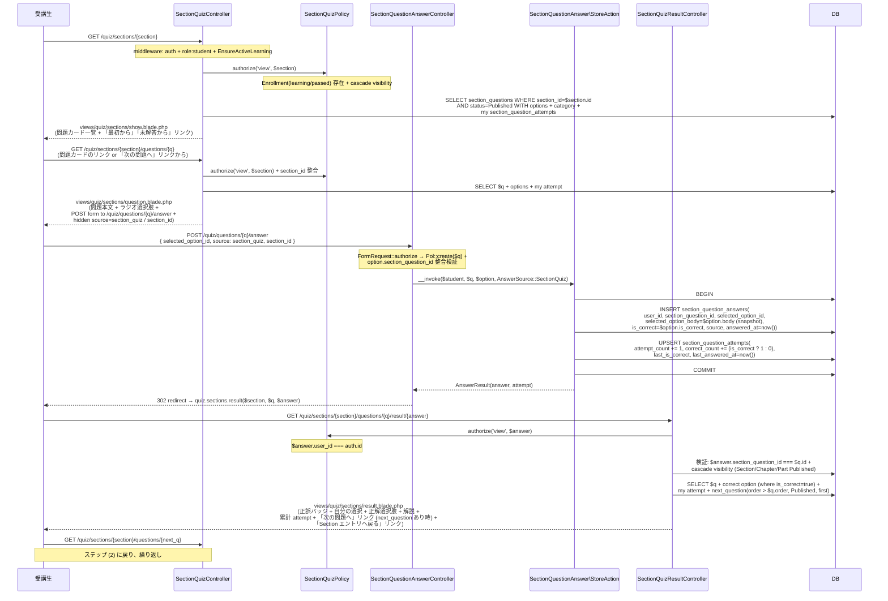
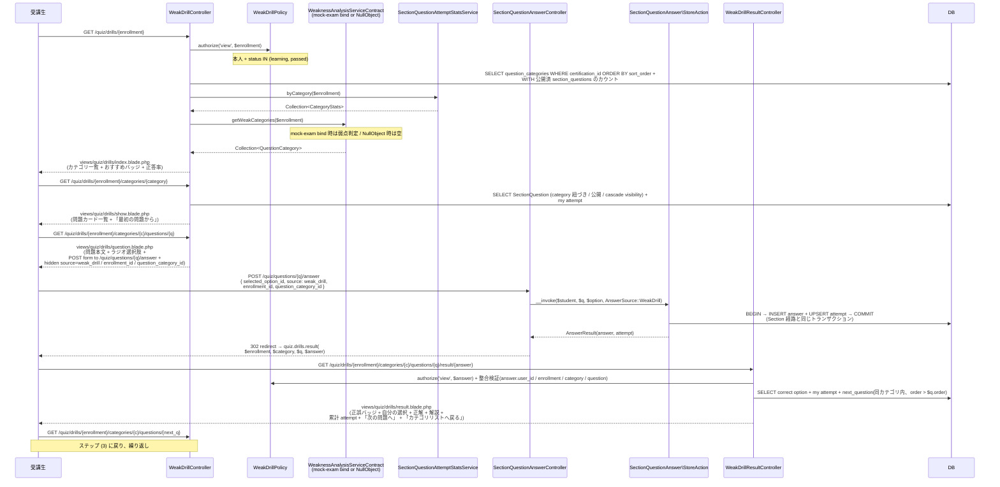
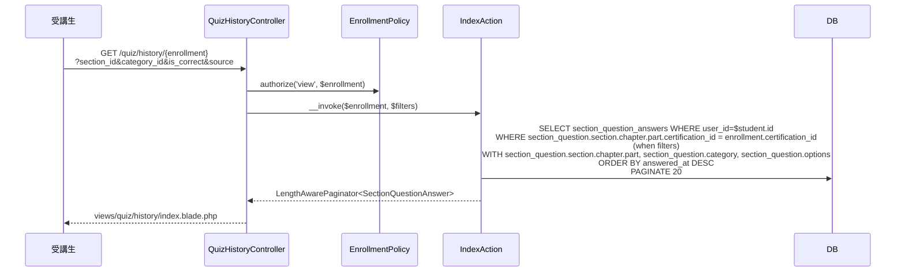

# quiz-answering 設計

> **v3 改修反映**(2026-05-16):
> - `Question` → **`SectionQuestion`** 参照に統一
> - `Answer` → **`SectionQuestionAnswer`**、`QuestionAttempt` → **`SectionQuestionAttempt`** リネーム
> - `QuestionOption` → **`SectionQuestionOption`** 参照
> - `difficulty` 関連削除
> - **`passed` でも演習可**(Enrollment status 検証は `learning + passed` 両許容)
> - **`EnsureActiveLearning` Middleware 連動**(`graduated` は演習不可)
> - 弱点ドリル出題対象は **`SectionQuestion` のみ**(MockExamQuestion は出題しない)
> - `Service` クラス名も `SectionQuestion` プレフィックスに統一
> - **FE は Blade + Form POST + Redirect の純 Laravel 標準パターン**(JS / Sanctum SPA / 公開 API / API Resource はすべて不採用、2026-05-16 確定)

## アーキテクチャ概要

SectionQuestion 演習エントリ / 苦手分野ドリル / 解答送信・自動採点 / 結果画面表示 / 解答履歴・SectionQuestion 単位サマリ閲覧 / 集計 Service(`SectionQuestionAttemptStatsService`)を一体で提供する。Clean Architecture(軽量版)に則り、Controller は薄く、Action(UseCase)が解答送信を `DB::transaction()` 内で `SectionQuestionAnswer` INSERT + `SectionQuestionAttempt` UPSERT として原子的に同期する。

問題マスタ(`SectionQuestion` / `SectionQuestionOption` / `QuestionCategory`)と教材階層(`Section` / `Chapter` / `Part`)は [[content-management]] が所有する Model を **読み取り再利用** し、本 Feature では CRUD を持たない。集計 Service は [[dashboard]] / [[enrollment]] から消費される **契約のみ** を公開する。

**FE は Blade + Form POST + Redirect の純 Laravel 標準パターン**(2026-05-16 確定)。解答送信フローは:

1. **出題画面**(`GET .../questions/{q}`) — HTML フォームで選択肢ラジオ + 「解答する」ボタンを描画
2. **解答送信**(`POST /quiz/questions/{q}/answer`) — `SectionQuestionAnswerController::store` が `StoreAction` を呼び `DB::transaction` 内で永続化、`AnswerResult` を受け取って `source` 値に応じた結果画面ルートへ 302 redirect
3. **結果画面**(`GET .../result/{answer}`) — 独立 Blade ルート。正誤バッジ / 自分の選択 / 正解 / 解説 / attempt 統計 / 「次の問題へ」「エントリへ戻る」リンクを表示
4. **次の問題へ**(`GET .../questions/{next_q}`) — Blade 内 `<a>` タグで遷移、繰り返し演習

JavaScript / Ajax fetch / sendBeacon / DOM 操作 / Sanctum SPA / 公開 JSON API / API Resource クラスはいずれも採用しない。PRG パターン(POST/Redirect/GET)を守ることでリロード安全 + ブラウザバック安全を担保する。

`WeaknessAnalysisServiceContract` Interface は本 Feature が定義し、[[mock-exam]] が正規実装(`WeaknessAnalysisService`)を `MockExamServiceProvider::register()` で bind する(本 Feature の `QuizAnsweringServiceProvider` は `NullWeaknessAnalysisService` を `bindIf` でフォールバック登録)。これにより、mock-exam 未実装環境でも UI が破綻しない。

### 全体構造

```mermaid
flowchart LR
    subgraph "quiz-answering(本 Feature)"
        SectionQuestionAnswer
        SectionQuestionAttempt
        StoreAction
        StatsSvc[SectionQuestionAttemptStatsService]
        NullWAS[NullWeaknessAnalysisService<br/>(フォールバック)]
    end
    subgraph "content-management(読み取り)"
        SectionQuestion
        SectionQuestionOption
        QuestionCategory
    end
    subgraph "mock-exam(bind 正規実装)"
        WeaknessAnalysisService
    end
    subgraph "consumers"
        Dashboard[dashboard]
        Enrollment[enrollment]
    end

    StoreAction --> SectionQuestionAnswer
    StoreAction --> SectionQuestionAttempt
    SectionQuestionAnswer -.->|FK| SectionQuestion
    SectionQuestionAttempt -.->|FK| SectionQuestion
    StatsSvc --> SectionQuestionAttempt
    Dashboard --> StatsSvc
    Enrollment --> StatsSvc
    WeaknessAnalysisService -.->|bind| ContractIF[WeaknessAnalysisServiceContract]
    NullWAS -.->|bindIf fallback| ContractIF
```

### 1. Section 演習(エントリ → 出題 → 解答送信 → 結果 → 次の問題)



### 2. 苦手分野ドリル(WeakDrill)

Section 経路と同じ Form POST → Redirect → 結果画面 → 次の問題リンク パターン。



### 3. 履歴 / サマリ閲覧



## データモデル

### Eloquent モデル一覧

- **`SectionQuestionAnswer`**(v3 で `Answer` から rename) — 個別解答ログ。`HasUlids` + `HasFactory` + `SoftDeletes`、`is_correct` boolean / `source` `AnswerSource` enum / `answered_at` datetime cast、`belongsTo(User)` / **`belongsTo(SectionQuestion, section_question_id)`** / `belongsTo(SectionQuestionOption, selected_option_id)`。スコープ: `scopeForUser` / `scopeForEnrollment` / `scopeForSection` / `scopeForCategory` / `scopeBySource` / `scopeCorrect` / `scopeIncorrect`。
- **`SectionQuestionAttempt`**(v3 で `QuestionAttempt` から rename) — SectionQuestion 単位サマリ。`HasUlids` + `HasFactory` + `SoftDeletes`、`attempt_count` / `correct_count` integer cast、`last_is_correct` boolean、`last_answered_at` datetime cast、`belongsTo(User)` / **`belongsTo(SectionQuestion, section_question_id)`**。`(user_id, section_question_id)` UNIQUE。`accuracy()` accessor で `correct_count / attempt_count` を返す。

### ER 図

```mermaid
erDiagram
    USERS ||--o{ SECTION_QUESTION_ANSWERS : "user_id"
    SECTION_QUESTIONS ||--o{ SECTION_QUESTION_ANSWERS : "section_question_id"
    SECTION_QUESTION_OPTIONS ||--o{ SECTION_QUESTION_ANSWERS : "selected_option_id (nullable)"
    USERS ||--o{ SECTION_QUESTION_ATTEMPTS : "user_id"
    SECTION_QUESTIONS ||--o{ SECTION_QUESTION_ATTEMPTS : "section_question_id"

    SECTION_QUESTION_ANSWERS {
        ulid id PK
        ulid user_id FK
        ulid section_question_id FK "v3 rename"
        ulid selected_option_id FK "nullable, to section_question_options"
        string selected_option_body "max 2000 snapshot"
        boolean is_correct
        string source "section_quiz / weak_drill"
        timestamp answered_at
        timestamps
        timestamp deleted_at "nullable"
    }
    SECTION_QUESTION_ATTEMPTS {
        ulid id PK
        ulid user_id FK
        ulid section_question_id FK "v3 rename"
        unsignedInteger attempt_count
        unsignedInteger correct_count
        boolean last_is_correct
        timestamp last_answered_at
        timestamps
        timestamp deleted_at "nullable"
    }
```

### Enum

| 項目 | Enum | 値 | 日本語ラベル |
|---|---|---|---|
| `SectionQuestionAnswer.source` | `AnswerSource` | `SectionQuiz` / `WeakDrill` | `Section演習` / `苦手分野ドリル` |

### インデックス・制約

`section_question_answers`(v3 で命名・参照変更):
- `(user_id, answered_at)`: 複合 INDEX(履歴一覧の `ORDER BY answered_at DESC` 高速化)
- `(user_id, section_question_id)`: 複合 INDEX
- `(section_question_id, is_correct)`: 複合 INDEX
- `source`: 単体 INDEX
- `deleted_at`: 単体 INDEX

`section_question_attempts`(v3 で命名・参照変更):
- `(user_id, section_question_id)`: UNIQUE INDEX(UPSERT 用)
- `(user_id, last_answered_at)`: 複合 INDEX
- `deleted_at`: 単体 INDEX

## コンポーネント

### Controller

**Web 用のみ**(`auth + role:student + EnsureActiveLearning` middleware、本 Feature は API Controller / JS / Resource を持たない):
- `SectionQuizController` — `show(Section)` / `showQuestion(Section, SectionQuestion)`(View 返却)
- `WeakDrillController` — `index(Enrollment)` / `showCategory(Enrollment, QuestionCategory)` / `showQuestion(Enrollment, QuestionCategory, SectionQuestion)`(View 返却)
- **`SectionQuestionAnswerController`**(v3 で `AnswerController` から rename) — `store(SectionQuestion, SectionQuestionAnswer\StoreRequest): RedirectResponse`。`StoreAction` 呼出後、`$request->source` 値に応じて `quiz.sections.result` / `quiz.drills.result` へ 302 redirect
- **`SectionQuizResultController`**(新規) — `show(Section, SectionQuestion, SectionQuestionAnswer): View`。Section 経路の結果画面を描画(authorize で answer 本人検証 + 整合検証)
- **`WeakDrillResultController`**(新規) — `show(Enrollment, QuestionCategory, SectionQuestion, SectionQuestionAnswer): View`。ドリル経路の結果画面を描画
- `QuizHistoryController` — `index(Enrollment, IndexRequest)`(View 返却)
- `QuizStatsController` — `index(Enrollment, IndexRequest)`(View 返却)

### Action(UseCase)

`app/UseCases/`:

#### SectionQuiz 系

```php
namespace App\UseCases\SectionQuiz;

class ShowAction
{
    public function __invoke(Section $section, User $student): Section
    {
        return $section->load([
            'chapter.part.certification',
            'sectionQuestions' => fn ($q) => $q
                ->where('status', ContentStatus::Published)
                ->orderBy('order')->orderBy('id'),
            'sectionQuestions.options',
            'sectionQuestions.category',
            'sectionQuestions.sectionQuestionAttempts' => fn ($q) => $q->where('user_id', $student->id),
        ]);
    }
}

class ShowQuestionAction
{
    public function __invoke(Section $section, SectionQuestion $question, User $student): array
    {
        if ($question->section_id !== $section->id) throw new SectionQuestionUnavailableForAnswerException();
        $next = SectionQuestion::where('section_id', $section->id)
            ->where('status', ContentStatus::Published)
            ->where('order', '>', $question->order)
            ->orderBy('order')->orderBy('id')->first();
        $attempt = SectionQuestionAttempt::where('user_id', $student->id)
            ->where('section_question_id', $question->id)->first();
        return ['question' => $question, 'next_id' => $next?->id, 'attempt' => $attempt];
    }
}
```

#### WeakDrill 系

```php
namespace App\UseCases\WeakDrill;

class IndexAction
{
    public function __construct(
        private SectionQuestionAttemptStatsService $stats,
        private WeaknessAnalysisServiceContract $weakness,
    ) {}

    public function __invoke(Enrollment $enrollment): array
    {
        $categories = QuestionCategory::where('certification_id', $enrollment->certification_id)
            ->ordered()
            ->withCount(['sectionQuestions' => fn ($q) => $q
                ->where('status', ContentStatus::Published)
                ->whereHas('section.chapter.part', fn ($pq) => $pq->where('status', ContentStatus::Published))])
            ->get();
        $stats = $this->stats->byCategory($enrollment);
        $weak = $this->weakness->getWeakCategories($enrollment);
        return compact('categories', 'stats', 'weak');
    }
}

class ShowCategoryAction
{
    public function __invoke(Enrollment $enrollment, QuestionCategory $category, User $student): Collection
    {
        if ($category->certification_id !== $enrollment->certification_id) {
            throw new WeakDrillCategoryMismatchException();
        }
        return SectionQuestion::where('category_id', $category->id)
            ->where('status', ContentStatus::Published)
            ->whereHas('section.chapter.part', fn ($q) => $q->where('status', ContentStatus::Published))
            ->orderBy('order')->orderBy('id')
            ->with(['section', 'category', 'sectionQuestionAttempts' => fn ($q) => $q->where('user_id', $student->id)])
            ->get();
    }
}
```

#### SectionQuestionAnswer 系

```php
namespace App\UseCases\SectionQuestionAnswer;

class StoreAction
{
    public function __invoke(
        User $user,
        SectionQuestion $question,
        SectionQuestionOption $option,
        AnswerSource $source,
    ): AnswerResult {
        $this->assertQuestionAvailable($question);
        $this->assertEnrollmentActive($user, $question);
        if ($option->section_question_id !== $question->id) {
            throw new SectionQuestionOptionMismatchException();
        }

        return DB::transaction(function () use ($user, $question, $option, $source) {
            $isCorrect = $option->is_correct;

            $answer = SectionQuestionAnswer::create([
                'user_id' => $user->id,
                'section_question_id' => $question->id,
                'selected_option_id' => $option->id,
                'selected_option_body' => $option->body,
                'is_correct' => $isCorrect,
                'source' => $source,
                'answered_at' => now(),
            ]);

            $attempt = SectionQuestionAttempt::updateOrCreate(
                ['user_id' => $user->id, 'section_question_id' => $question->id],
                [],
            );
            $attempt->increment('attempt_count');
            if ($isCorrect) $attempt->increment('correct_count');
            $attempt->update(['last_is_correct' => $isCorrect, 'last_answered_at' => now()]);

            $correctOption = $question->options()->where('is_correct', true)->first();

            return new AnswerResult(
                answer: $answer,
                attempt: $attempt->fresh(),
                correctOptionId: $correctOption?->id,
                correctOptionBody: $correctOption?->body,
                explanation: $question->explanation,
            );
        });
    }

    private function assertQuestionAvailable(SectionQuestion $q): void;
    private function assertEnrollmentActive(User $u, SectionQuestion $q): void; // status IN (learning, passed) v3
}

readonly class AnswerResult
{
    public function __construct(
        public SectionQuestionAnswer $answer,
        public SectionQuestionAttempt $attempt,
        public ?string $correctOptionId,
        public ?string $correctOptionBody,
        public ?string $explanation,
    ) {}
}
```

#### QuizHistory / QuizStats 系

```php
namespace App\UseCases\QuizHistory;

class IndexAction
{
    public function __invoke(Enrollment $enrollment, array $filters): LengthAwarePaginator
    {
        return SectionQuestionAnswer::query()
            ->where('user_id', $enrollment->user_id)
            ->whereHas('sectionQuestion.section.chapter.part',
                fn ($q) => $q->where('certification_id', $enrollment->certification_id))
            ->when($filters['section_id'] ?? null, fn ($q, $v) => $q->whereHas('sectionQuestion', fn ($sq) => $sq->where('section_id', $v)))
            ->when($filters['category_id'] ?? null, fn ($q, $v) => $q->whereHas('sectionQuestion', fn ($sq) => $sq->where('category_id', $v)))
            ->when(isset($filters['is_correct']), fn ($q) => $q->where('is_correct', $filters['is_correct']))
            ->when($filters['source'] ?? null, fn ($q, $v) => $q->where('source', $v))
            ->with(['sectionQuestion.section.chapter.part', 'sectionQuestion.category', 'sectionQuestion.options'])
            ->orderByDesc('answered_at')
            ->paginate(20);
    }
}

namespace App\UseCases\QuizStats;

class IndexAction
{
    public function __invoke(Enrollment $enrollment, array $filters): LengthAwarePaginator
    {
        return SectionQuestionAttempt::query()
            ->where('user_id', $enrollment->user_id)
            ->whereHas('sectionQuestion.section.chapter.part',
                fn ($q) => $q->where('certification_id', $enrollment->certification_id))
            ->with(['sectionQuestion.section.chapter.part', 'sectionQuestion.category'])
            ->orderByDesc('last_answered_at')
            ->paginate(20);
    }
}
```

### Service

`app/Services/`:

#### `SectionQuestionAttemptStatsService`(v3 で `QuestionAttemptStatsService` から rename)

```php
namespace App\Services;

class SectionQuestionAttemptStatsService
{
    public function summarize(Enrollment $enrollment): StatsSummary;
    public function byCategory(Enrollment $enrollment): \Illuminate\Support\Collection;
    public function recentAnswers(Enrollment $enrollment, int $limit = 5): \Illuminate\Support\Collection;
}

readonly class StatsSummary
{
    public function __construct(
        public int $totalQuestionsAttempted,
        public int $totalAttempts,
        public int $totalCorrect,
        public ?float $overallAccuracy,
        public ?Carbon $lastAnsweredAt,
    ) {}
}

readonly class CategoryStats
{
    public function __construct(
        public string $categoryId,
        public int $questionsAttempted,
        public int $totalAttempts,
        public int $totalCorrect,
        public ?float $accuracy,
    ) {}
}
```

> 全クエリで `section_question.section.chapter.part.certification_id = $enrollment.certification_id` で絞り込み(他資格の解答が混入しないことを保証、REQ-quiz-answering-154)。

#### `NullWeaknessAnalysisService` / `WeaknessAnalysisServiceContract`

```php
namespace App\Services\Contracts;

interface WeaknessAnalysisServiceContract
{
    public function getWeakCategories(Enrollment $enrollment): \Illuminate\Support\Collection;
}

namespace App\Services;

class NullWeaknessAnalysisService implements WeaknessAnalysisServiceContract
{
    public function getWeakCategories(Enrollment $enrollment): \Illuminate\Support\Collection
    {
        return collect(); // 常に空 Collection、おすすめバッジは全 false
    }
}
```

### Policy

`app/Policies/`:

- **`SectionQuestionAnswerPolicy`**(v3 rename) — `view(User, SectionQuestionAnswer)`(本人のみ) / `create(User, SectionQuestion)`(本人 + Student + InProgress + Enrollment(learning/passed) + cascade visibility)
- **`SectionQuestionAttemptPolicy`**(v3 rename) — `view(User, SectionQuestionAttempt)`(本人のみ)
- `SectionQuizPolicy` — `view(User, Section)`(Enrollment(learning/passed) 存在 + cascade visibility)
- `WeakDrillPolicy` — `view(User, Enrollment)`(本人 + `status IN (learning, passed)`、v3 で `paused` 削除)

### FormRequest

`app/Http/Requests/`:

- **`SectionQuestionAnswer\StoreRequest`**(v3 rename、Controller method `store` と一致) — `selected_option_id: required ulid exists where section_question_id` / `source: required new Enum(AnswerSource::class)`、`authorize` で `Policy::create($question)` 委譲
- `QuizHistory\IndexRequest` — `section_id` / `category_id` / `is_correct` / `source` 任意フィルタ、`authorize` で `EnrollmentPolicy::view`
- `QuizStats\IndexRequest` — 同上 + `sort` パラメータ

### Route

```php
// Web 用のみ(本 Feature は routes/api.php に登録しない)
Route::middleware(['auth', 'role:student', EnsureActiveLearning::class])->prefix('quiz')->name('quiz.')->group(function () {
    // Section 経路
    Route::get('sections/{section}', [SectionQuizController::class, 'show'])->name('sections.show');
    Route::get('sections/{section}/questions/{question}', [SectionQuizController::class, 'showQuestion'])
        ->name('sections.question');
    Route::get('sections/{section}/questions/{question}/result/{answer}',
        [SectionQuizResultController::class, 'show'])->name('sections.result');

    // ドリル経路
    Route::get('drills/{enrollment}', [WeakDrillController::class, 'index'])->name('drills.index');
    Route::get('drills/{enrollment}/categories/{questionCategory}', [WeakDrillController::class, 'showCategory'])
        ->name('drills.category');
    Route::get('drills/{enrollment}/categories/{questionCategory}/questions/{question}',
        [WeakDrillController::class, 'showQuestion'])->name('drills.question');
    Route::get('drills/{enrollment}/categories/{questionCategory}/questions/{question}/result/{answer}',
        [WeakDrillResultController::class, 'show'])->name('drills.result');

    // 解答送信(両経路共通エンドポイント、Controller 内で source 値を見て redirect 先を分岐)
    Route::post('questions/{question}/answer', [SectionQuestionAnswerController::class, 'store'])
        ->name('answers.store');

    // 履歴・サマリ
    Route::get('history/{enrollment}', [QuizHistoryController::class, 'index'])->name('history.index');
    Route::get('stats/{enrollment}', [QuizStatsController::class, 'index'])->name('stats.index');
});
```

`SectionQuestionAnswerController::store` の redirect 分岐:

```php
public function store(SectionQuestion $question, StoreRequest $request): RedirectResponse
{
    $option = $question->options()->findOrFail($request->validated('selected_option_id'));
    $source = AnswerSource::from($request->validated('source'));

    $result = ($this->storeAction)($request->user(), $question, $option, $source);

    return match ($source) {
        AnswerSource::SectionQuiz => redirect()->route('quiz.sections.result', [
            'section' => $request->validated('section_id'),
            'question' => $question,
            'answer' => $result->answer,
        ]),
        AnswerSource::WeakDrill => redirect()->route('quiz.drills.result', [
            'enrollment' => $request->validated('enrollment_id'),
            'questionCategory' => $request->validated('question_category_id'),
            'question' => $question,
            'answer' => $result->answer,
        ]),
    };
}
```

## Blade ビュー

`resources/views/quiz/`:

| ファイル | 役割 |
|---|---|
| `sections/show.blade.php` | Section エントリ画面、SectionQuestion カード一覧 + 「最初から」「未解答から」リンク |
| `sections/question.blade.php` | 1 問出題画面、ラジオ選択肢 + 解答フォーム(POST `.../answer`、hidden source=section_quiz / section_id) |
| `sections/result.blade.php` | **(新規)** Section 経路の結果画面、正誤バッジ + 自分の選択 + 正解 + 解説 + attempt 統計 + 「次の問題へ」「Section エントリへ戻る」リンク |
| `drills/index.blade.php` | カテゴリ一覧、おすすめバッジ + カテゴリ別正答率 + 件数 |
| `drills/show.blade.php` | カテゴリ別 SectionQuestion リスト、カテゴリ全体正答率 + おすすめバッジ |
| `drills/question.blade.php` | drills 経路の 1 問出題画面(source=weak_drill / enrollment_id / question_category_id を hidden) |
| `drills/result.blade.php` | **(新規)** ドリル経路の結果画面、Section 経路と同構成 + 「次の問題へ」「カテゴリリストへ戻る」リンク |
| `history/index.blade.php` | 解答履歴一覧、フィルタ + ページネーション |
| `stats/index.blade.php` | SectionQuestion サマリ一覧、フィルタ + ソート |
| `partials/question-card.blade.php` | 問題カード共通部品、SectionQuestion 本文プレビュー + 試行数 + 最新正誤バッジ(v3 で `difficulty` 表示なし) |
| `partials/answer-form.blade.php` | 解答フォーム共通部品(Section/ドリル両経路で利用、`<form method="POST" action="/quiz/questions/{q}/answer">` + ラジオ + hidden inputs + 「解答する」ボタン) |
| `partials/result-pane.blade.php` | 結果画面共通部品、Section/ドリル両経路の `result.blade.php` から `@include` する。正誤バッジ + 選択肢比較 + 解説 + attempt 統計 |

> **JavaScript セクション削除**(2026-05-16): 旧 `resources/js/quiz-answering/answer-form.js`(Ajax fetch + DOM 操作)は撤回。本 Feature は JS を持たない。

## エラーハンドリング

`app/Exceptions/QuizAnswering/`:

- **`EnrollmentInactiveForAnswerException`**(409) — Enrollment が `learning + passed` 以外
- **`SectionQuestionUnavailableForAnswerException`**(409、v3 rename) — SectionQuestion が SoftDelete or Draft、cascade visibility 違反
- **`SectionQuestionOptionMismatchException`**(422、v3 rename) — option の `section_question_id` が question.id と不一致
- **`WeakDrillCategoryMismatchException`**(404) — category の certification_id が enrollment.certification_id と不一致

## 関連要件マッピング

| 要件 ID | 実装ポイント |
|---|---|
| REQ-quiz-answering-001 | `database/migrations/{date}_create_section_question_answers_table.php`(v3 rename) / `App\Models\SectionQuestionAnswer` |
| REQ-quiz-answering-002 | `database/migrations/{date}_create_section_question_attempts_table.php`(v3 rename) / `App\Models\SectionQuestionAttempt` |
| REQ-quiz-answering-003 | `App\Enums\AnswerSource` |
| REQ-quiz-answering-007 | migration の `selected_option_id` `nullOnDelete` to `section_question_options` |
| REQ-quiz-answering-008 | `selected_option_body` snapshot 列 |
| REQ-quiz-answering-020〜023 | `App\Policies\SectionQuizPolicy::view` + `App\UseCases\SectionQuiz\ShowAction` / `ShowQuestionAction` |
| REQ-quiz-answering-026 | `routes/web.php` の `EnsureActiveLearning` middleware |
| REQ-quiz-answering-050〜057 | `App\UseCases\WeakDrill\*Action` + `App\Policies\WeakDrillPolicy` + `WeaknessAnalysisServiceContract`(NullObject フォールバック) |
| REQ-quiz-answering-080〜088 | `App\Http\Controllers\SectionQuestionAnswerController::store` + `App\UseCases\SectionQuestionAnswer\StoreAction` + `App\Policies\SectionQuestionAnswerPolicy::create` |
| REQ-quiz-answering-089 | `App\Http\Controllers\SectionQuizResultController::show` + `WeakDrillResultController::show` + `resources/views/quiz/sections/result.blade.php` + `resources/views/quiz/drills/result.blade.php` |
| REQ-quiz-answering-120〜126 | `App\Http\Controllers\QuizHistoryController` + `App\UseCases\QuizHistory\IndexAction` + `QuizStatsController` + `App\UseCases\QuizStats\IndexAction` |
| REQ-quiz-answering-150〜155 | `App\Services\SectionQuestionAttemptStatsService` |
| REQ-quiz-answering-190〜194 | 各 Policy + `routes/web.php` の middleware |
| NFR-quiz-answering-001 | `StoreAction` の `DB::transaction()` |
| NFR-quiz-answering-002 | 各 Action / Service の `with(...)` Eager Loading |
| NFR-quiz-answering-003 | 各 migration の複合 INDEX |
| NFR-quiz-answering-004 | `app/Exceptions/QuizAnswering/*Exception.php` |
| NFR-quiz-answering-010 | `App\Providers\QuizAnsweringServiceProvider` で `WeaknessAnalysisServiceContract::class` を `NullWeaknessAnalysisService` に `bindIf` フォールバック登録 |

## テスト戦略

`tests/Feature/Http/` / `tests/Feature/UseCases/` / `tests/Unit/Services/` / `tests/Unit/Policies/` 配下。

### Feature(HTTP)

- `SectionQuiz/{Show,ShowQuestion}Test.php`(受講中(learning + passed)で 200 / 未受講 404 / cascade visibility / `graduated` 403)
- **`SectionQuiz/ResultTest.php`(新規)** — 本人の answer で 200 + 正誤/選択肢/解説/attempt 表示 / 他者の answer 403 / answer.section_question_id 不一致 404 / 「次の問題へ」リンクの存在/非存在(最終問題)
- `WeakDrill/{Index,ShowCategory,ShowQuestion}Test.php`(おすすめバッジ / `WeaknessAnalysisService` 未バインドでも 200 / 資格不一致 404 / **`SectionQuestion` のみ出題**(MockExamQuestion 混入しない))
- **`WeakDrill/ResultTest.php`(新規)** — 本人の answer で 200 / カテゴリ × 資格 × answer の整合検証 404 / 「次の問題へ」リンクの存在/非存在
- **`SectionQuestionAnswer/StoreTest.php`(v3 rename)** — 正答/誤答送信で `redirect()->route('quiz.sections.result')` or `quiz.drills.result` 302 / source 値で redirect 先分岐 / 連投で attempt_count += 1 / Enrollment passed でも 302(v3) / `graduated` 403 / SectionQuestion Draft 409 / 選択肢不一致 422 / 他資格 403
- `QuizHistory/IndexTest.php` / `QuizStats/IndexTest.php`(本人のみ / 他者 403 / フィルタ / 他資格混入しない)
- `EnsureActiveLearningTest.php`(`graduated` で 403)

### Feature(UseCases)

- `SectionQuestionAnswer/StoreActionTest.php`(AnswerResult / 新規 attempt / 既存 attempt UPDATE / SoftDeleted restore / トランザクション原子性)
- `WeakDrill/IndexActionTest.php`(`is_weak` フラグ / NullObject fallback)

### Unit(Services / Policy)

- `SectionQuestionAttemptStatsServiceTest.php`(`summarize` 0 件で null accuracy / `byCategory` GROUP BY / `recentAnswers` limit / 他資格混入防止)
- `NullWeaknessAnalysisServiceTest.php`(常に空 Collection)
- `SectionQuestionAnswerPolicyTest.php`(`view` 本人のみ / `create` ロール × Enrollment(learning + passed) × cascade visibility 網羅)
- `WeakDrillPolicyTest.php`(本人 + `status IN (learning, passed)` 網羅、v3 で `paused` 削除済)
