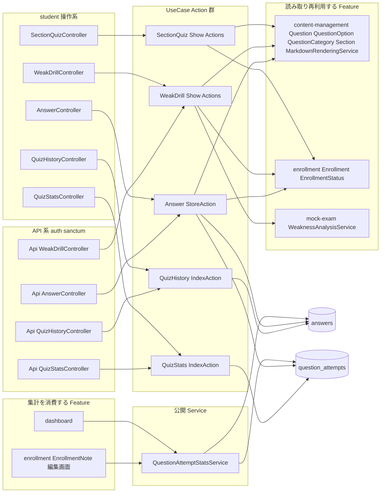
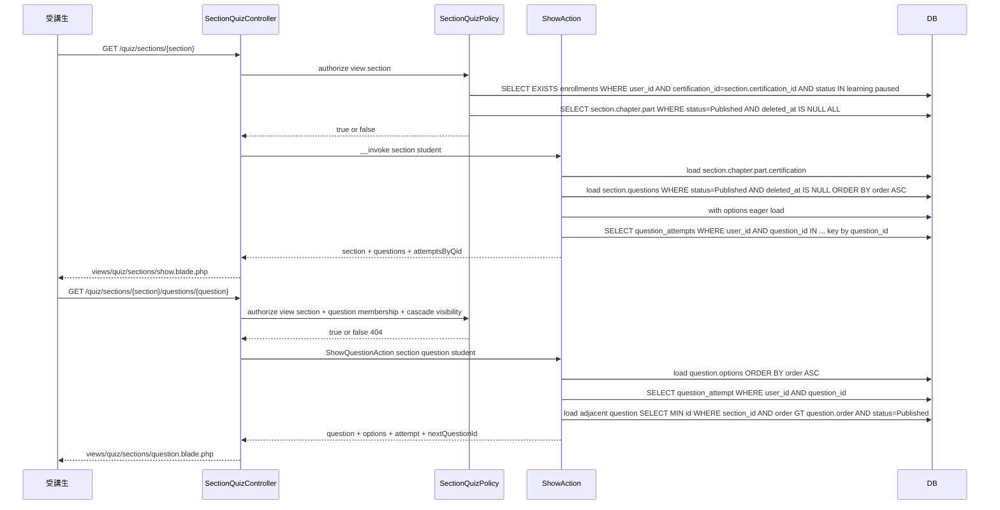
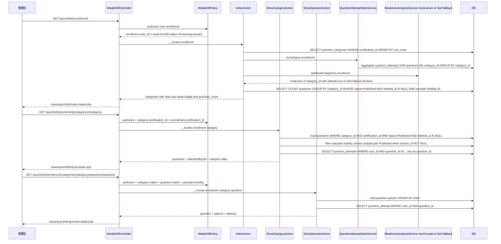
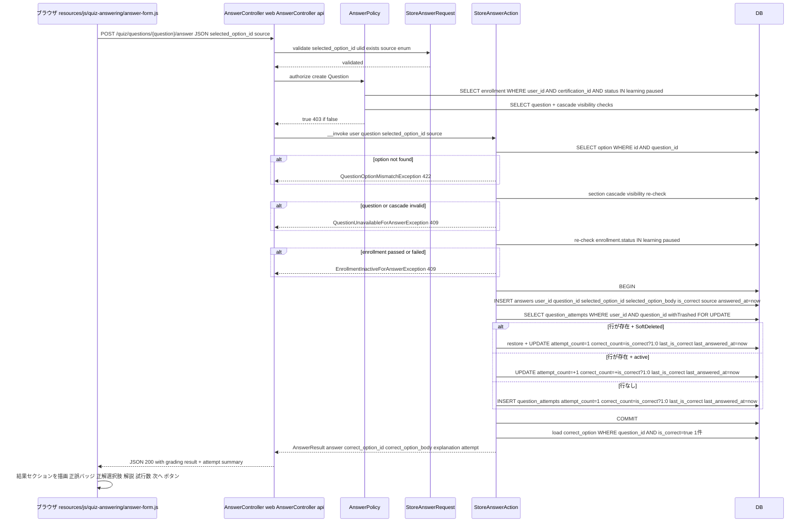
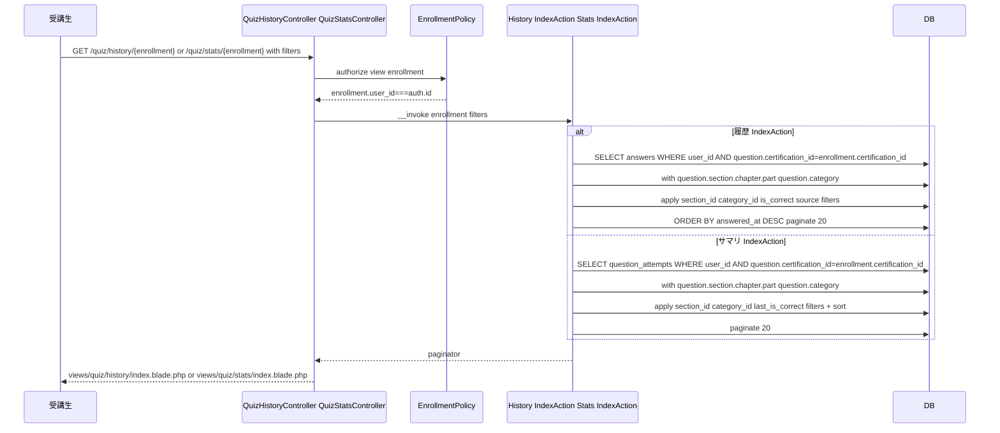
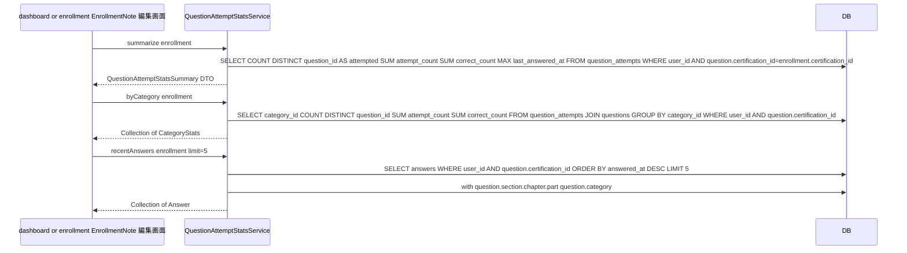
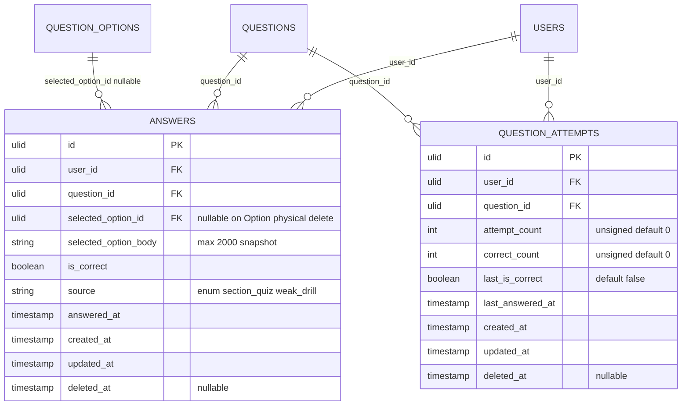

# quiz-answering 設計

## アーキテクチャ概要

Section 紐づき問題演習エントリ / 苦手分野ドリル / 解答送信・自動採点 / 解答履歴・Question 単位サマリ閲覧 / **Sanctum SPA 認証 API（Advance スコープ、Cookie ベース）** / 集計 Service（`QuestionAttemptStatsService`）を一体で提供する。Clean Architecture（軽量版）に従い Controller / FormRequest / Policy / UseCase（Action）/ Service / Eloquent Model を分離する。問題マスタ（`Question` / `QuestionOption` / `QuestionCategory`）と教材階層（`Section` / `Chapter` / `Part`）は [[content-management]] が所有する Model を **読み取り再利用** し、本 Feature では CRUD を持たない。集計 Service は [[dashboard]] / [[enrollment]] から消費される **契約のみ** を公開し、本 Feature の Controller / View は他 Feature ダッシュボードを直接描画しない（呼出側のレンダリングに値を渡す責務）。Sanctum SPA 認証は Fortify ログイン後の Web セッション Cookie を再利用する Laravel 標準パターンで、Personal Access Token / 個人トークン管理 UI は LMS 全体で **不採用**（[[analytics-export]] の API キー方式とも別物）。

### 全体構造



### Section 紐づき問題演習エントリ



### 苦手分野ドリル



### 解答送信・自動採点



### 解答履歴・Question 単位サマリ閲覧



### dashboard / enrollment への集計提供



## データモデル

### Eloquent モデル一覧

- **`Answer`** — 個別解答ログ。`HasUlids` + `HasFactory` + `SoftDeletes`。`belongsTo(User::class)` / `belongsTo(Question::class)` / `belongsTo(QuestionOption::class, 'selected_option_id')`（nullable、Option が delete-and-insert で物理削除されると NULL になる、`selected_option_body` で本文は保持）。スコープ: `scopeForUser(User $user)` / `scopeForEnrollment(Enrollment $enrollment)`（`whereHas('question', fn ($q) => $q->where('certification_id', $enrollment->certification_id))`）/ `scopeForSection(?string $sectionId)` / `scopeForCategory(?string $categoryId)` / `scopeBySource(?AnswerSource $source)` / `scopeCorrect()` / `scopeIncorrect()`。Cast: `is_correct` → `boolean`、`answered_at` → `datetime`、`source` → `AnswerSource::class`。

- **`QuestionAttempt`** — 受講生 × Question 単位サマリ。`HasUlids` + `HasFactory` + `SoftDeletes`。`belongsTo(User::class)` / `belongsTo(Question::class)`。スコープ: `scopeForUser(User $user)` / `scopeForEnrollment(Enrollment $enrollment)`（同上）/ `scopeForSection(?string $sectionId)` / `scopeForCategory(?string $categoryId)` / `scopeLastIs(bool $correct)`。Cast: `attempt_count` / `correct_count` → `integer`、`last_is_correct` → `boolean`、`last_answered_at` → `datetime`。

### 既存 Model への逆向きリレーション宣言

[[content-management]] の `Question` Model は既に `hasMany(Answer::class)`（quiz-answering 定義）/ `hasMany(MockExamAnswer::class)`（mock-exam 定義）を予告（content-management/design.md L214）。本 Feature 実装時に Question Model へ `hasMany(QuestionAttempt::class)` を追加し、`User` Model に `hasMany(Answer::class)` / `hasMany(QuestionAttempt::class)` を追加する。これらは Model 行を本 Feature が編集することを許容する（structure.md「specs 作成ルール」の規約: Feature 横断の Model リレーション宣言は Model 所有 Feature の design.md で予告 + 利用 Feature 側で実装、と整合）。

### ER 図



### 主要カラム + Enum

| Model | Enum | 値 | 日本語ラベル |
|---|---|---|---|
| `Answer.source` | `AnswerSource` | `SectionQuiz` / `WeakDrill` | `Section演習` / `苦手分野ドリル` |

`Answer` の `source` は出題経路の追跡（履歴一覧フィルタ用 / 将来分析用）。`QuestionAttempt` には source 別カラムを持たせず、`Answer` の集計でいつでも辿れるようにする（Q-Att の正答率は経路非依存の累計）。

### インデックス・制約

`answers`:
- `(user_id, answered_at)`: 複合 INDEX（履歴一覧 `ORDER BY answered_at DESC` の高速化）
- `(user_id, question_id)`: 複合 INDEX（Question 単位履歴 + UPSERT 補助）
- `(question_id, is_correct)`: 複合 INDEX（[[mock-exam]] や [[dashboard]] からの問題別正答率集計補助）
- `source`: 単体 INDEX（フィルタ用）
- `user_id`: 外部キー（`->constrained('users')->restrictOnDelete()`）
- `question_id`: 外部キー（`->constrained('questions')->restrictOnDelete()`）
- `selected_option_id`: 外部キー（`->nullable()->constrained('question_options')->nullOnDelete()` — QuestionOption は delete-and-insert で物理削除されるため、外部キー違反を避けるため `nullOnDelete`。本文は `selected_option_body` でスナップショット保持）
- `deleted_at`: 単体 INDEX（SoftDelete 除外の高速化）

`question_attempts`:
- `(user_id, question_id)`: UNIQUE INDEX（1 受講生 × 1 Question の最大 1 行、UPSERT の競合解決にも利用）
- `(user_id, last_answered_at)`: 複合 INDEX（サマリ画面ソート用）
- `user_id`: 外部キー（`->constrained('users')->restrictOnDelete()`）
- `question_id`: 外部キー（`->constrained('questions')->restrictOnDelete()`）
- `deleted_at`: 単体 INDEX

## 状態遷移

本 Feature 所有の `Answer` / `QuestionAttempt` には **state diagram は存在しない**（`product.md` 「## ステータス遷移」セクション A〜F に本 Feature 所有エンティティは登場しない）。両エンティティは append-only / UPSERT の世界で、明示的なステートマシンを持たない。SoftDelete の `deleted_at IS NULL` / `NOT NULL` は通常フローでは発生しない（NFR-009、手動オペレーションのみ）ため、これも状態遷移として扱わない。

## コンポーネント

### Controller

すべて `app/Http/Controllers/` 配下、ロール別 namespace は使わず（`structure.md` 規約）、Web 系は `/quiz/...` プレフィックスで `auth + role:student` Middleware を適用、API 系は `app/Http/Controllers/Api/` 配下に配置し `/api/v1/quiz/...` プレフィックスで `auth:sanctum + role:student` を適用する。**API 系（`Api\` 配下 Controller / `/api/v1/quiz/...` ルート / Resource クラス群）は Advance スコープ専用**で、Basic ブランチには含まれない（Web Blade と Web Controller のみ Basic ブランチに含まれる）。

- **`SectionQuizController`**（Web 専用、`/quiz/sections/{section}` 系）
  - `show(Section $section, ShowAction $action)` — Section 演習エントリ画面
  - `showQuestion(Section $section, Question $question, ShowQuestionAction $action)` — Section 内 1 問の出題画面

- **`WeakDrillController`**（Web、`/quiz/drills/{enrollment}` 系）
  - `index(Enrollment $enrollment, IndexAction $action)` — カテゴリ一覧（おすすめバッジ付き）
  - `showCategory(Enrollment $enrollment, QuestionCategory $questionCategory, ShowCategoryAction $action)` — カテゴリ別 Question リスト
  - `showQuestion(Enrollment $enrollment, QuestionCategory $questionCategory, Question $question, ShowQuestionAction $action)` — 1 問の出題画面

- **`AnswerController`**（Web の POST のみ、`POST /quiz/questions/{question}/answer`）
  - `store(Question $question, StoreAnswerRequest $request, StoreAnswerAction $action)` — 解答送信（JSON 返却）

- **`QuizHistoryController`**（Web、`/quiz/history/{enrollment}`）
  - `index(Enrollment $enrollment, IndexRequest $request, IndexAction $action)` — 履歴一覧（フィルタ）

- **`QuizStatsController`**（Web、`/quiz/stats/{enrollment}`）
  - `index(Enrollment $enrollment, IndexRequest $request, IndexAction $action)` — Question 単位サマリ一覧（フィルタ + ソート）

- **`Api\AnswerController`** / **`Api\WeakDrillController`** / **`Api\QuizHistoryController`** / **`Api\QuizStatsController`** — API ミラー。Web Controller と同一 Action を共有し、Resource で JSON 整形する（HTTP 200 + JSON 固定）。

### Action（UseCase）

Entity 単位ディレクトリで配置（`app/UseCases/SectionQuiz/` / `WeakDrill/` / `Answer/` / `QuizHistory/` / `QuizStats/`）。各 Action は単一トランザクション境界（状態変更を伴うものは `DB::transaction()`、参照系は持たない）。`__invoke()` を主とし、Controller method 名と Action クラス名は完全一致（`backend-usecases.md` 規約）。Web と API で Controller method 名が同じ（`show` / `index` / `store`）場合は **同一 Action を共有** する（Resource で整形の責務だけ分離）。

#### `App\UseCases\SectionQuiz\ShowAction`

```php
namespace App\UseCases\SectionQuiz;

use App\Models\Section;
use App\Models\User;
use Illuminate\Support\Collection;

class ShowAction
{
    public function __invoke(Section $section, User $student): array
    {
        $section->load([
            'chapter.part.certification',
            'questions' => fn ($q) => $q
                ->where('status', ContentStatus::Published)
                ->whereNull('deleted_at')
                ->orderBy('order')
                ->orderBy('id')
                ->with(['options' => fn ($q) => $q->orderBy('order')]),
        ]);

        $questionIds = $section->questions->pluck('id');
        $attempts = QuestionAttempt::query()
            ->where('user_id', $student->id)
            ->whereIn('question_id', $questionIds)
            ->get()
            ->keyBy('question_id');

        return [
            'section' => $section,
            'questions' => $section->questions,
            'attemptsByQid' => $attempts,
        ];
    }
}
```

責務: Section 配下の公開済 Question を `order ASC, id ASC` で取得し、受講生の `QuestionAttempt` を Question_id でキー化して併せ返す。N+1 を避けるため `with('options')` + `whereIn('question_id', $ids)` の 2 クエリで完結。

#### `App\UseCases\SectionQuiz\ShowQuestionAction`

```php
class ShowQuestionAction
{
    public function __invoke(Section $section, Question $question, User $student): array
    {
        if ($question->section_id !== $section->id) {
            throw new QuestionUnavailableForAnswerException();  // 経路の不整合は 409
        }

        $question->load([
            'options' => fn ($q) => $q->orderBy('order'),
            'category',
        ]);

        $attempt = QuestionAttempt::query()
            ->where('user_id', $student->id)
            ->where('question_id', $question->id)
            ->first();

        $nextQuestionId = $section
            ->questions()
            ->published()
            ->where('order', '>=', $question->order)
            ->where('id', '!=', $question->id)
            ->orderBy('order')
            ->orderBy('id')
            ->value('id');

        return compact('section', 'question', 'attempt', 'nextQuestionId');
    }
}
```

責務: 1 問の出題に必要なオブジェクトを返す。`nextQuestionId` は Section 内で同 `order` 以降の次の Question を 1 件のみ取得（結果画面の「次の問題」ボタン用）。

#### `App\UseCases\WeakDrill\IndexAction`

```php
class IndexAction
{
    public function __construct(
        private QuestionAttemptStatsService $stats,
        private WeaknessAnalysisServiceContract $weakness,  // mock-exam or Null fallback
    ) {}

    public function __invoke(Enrollment $enrollment): array
    {
        $categories = QuestionCategory::query()
            ->where('certification_id', $enrollment->certification_id)
            ->whereNull('deleted_at')
            ->orderBy('sort_order')
            ->orderBy('created_at', 'desc')
            ->withCount(['questions' => fn ($q) => $q->visibleForStudent()])  // scope alias
            ->get();

        $statsByCategory = $this->stats->byCategory($enrollment)->keyBy('category_id');
        $weakCategoryIds = $this->weakness
            ->getWeakCategories($enrollment)
            ->pluck('id')
            ->all();

        $rows = $categories->map(fn ($cat) => [
            'category' => $cat,
            'question_count' => $cat->questions_count,
            'stats' => $statsByCategory->get($cat->id),
            'is_weak' => in_array($cat->id, $weakCategoryIds, true),
        ]);

        return ['enrollment' => $enrollment, 'rows' => $rows];
    }
}
```

責務: カテゴリ別の (a) 公開済 Question 件数、(b) 受講生の正答率統計、(c) 苦手判定フラグ を 1 度の集計で組み立てる。`WeaknessAnalysisServiceContract` は本 Feature の Service Provider で `bind` し、[[mock-exam]] 未実装環境では `NullWeaknessAnalysisService`（全カテゴリ `is_weak=false`）を返す（NFR-010 / フォールバック）。

#### `App\UseCases\WeakDrill\ShowCategoryAction`

```php
class ShowCategoryAction
{
    public function __invoke(
        Enrollment $enrollment,
        QuestionCategory $category,
        User $student,
    ): array {
        if ($category->certification_id !== $enrollment->certification_id) {
            throw new WeakDrillCategoryMismatchException();
        }

        $questions = Question::query()
            ->where('certification_id', $enrollment->certification_id)
            ->where('category_id', $category->id)
            ->whereNull('deleted_at')
            ->where('status', ContentStatus::Published)
            ->visibleForStudent()  // cascade visibility scope
            ->with(['options' => fn ($q) => $q->orderBy('order'), 'section.chapter.part'])
            ->orderBy('order')
            ->orderBy('id')
            ->get();

        $questionIds = $questions->pluck('id');
        $attempts = QuestionAttempt::query()
            ->where('user_id', $student->id)
            ->whereIn('question_id', $questionIds)
            ->get()
            ->keyBy('question_id');

        return compact('enrollment', 'category', 'questions', 'attempts');
    }
}
```

責務: カテゴリ配下の出題対象 Question（Section 紐づき + mock-exam 専用 両方、cascade visibility 適用）と受講生の attempts を返す。Question の `visibleForStudent` スコープは「`section_id IS NULL` OR （Section / Chapter / Part がすべて `Published` AND `deleted_at IS NULL`）」を表現する。

#### `App\UseCases\WeakDrill\ShowQuestionAction`

```php
class ShowQuestionAction
{
    public function __invoke(
        Enrollment $enrollment,
        QuestionCategory $category,
        Question $question,
        User $student,
    ): array {
        if ($category->certification_id !== $enrollment->certification_id) {
            throw new WeakDrillCategoryMismatchException();
        }
        if ($question->category_id !== $category->id || $question->certification_id !== $enrollment->certification_id) {
            throw new QuestionUnavailableForAnswerException();
        }

        $question->load(['options' => fn ($q) => $q->orderBy('order'), 'category', 'section.chapter.part']);

        $attempt = QuestionAttempt::query()
            ->where('user_id', $student->id)
            ->where('question_id', $question->id)
            ->first();

        return compact('enrollment', 'category', 'question', 'attempt');
    }
}
```

責務: 苦手ドリル経由の 1 問出題。Section 経由とは異なり「次の問題」遷移はカテゴリ内シャッフルではなく URL のリスト画面に戻る方式（複雑度を抑える）。

#### `App\UseCases\Answer\StoreAction`

```php
namespace App\UseCases\Answer;

use App\Enums\AnswerSource;
use App\Enums\ContentStatus;
use App\Enums\EnrollmentStatus;
use App\Exceptions\QuizAnswering\EnrollmentInactiveForAnswerException;
use App\Exceptions\QuizAnswering\QuestionOptionMismatchException;
use App\Exceptions\QuizAnswering\QuestionUnavailableForAnswerException;
use App\Models\Answer;
use App\Models\Question;
use App\Models\QuestionAttempt;
use App\Models\User;
use Illuminate\Support\Facades\DB;

class StoreAction
{
    public function __invoke(
        User $student,
        Question $question,
        string $selectedOptionId,
        AnswerSource $source,
    ): AnswerResult {
        $option = $question->options()->find($selectedOptionId);
        if ($option === null) {
            throw new QuestionOptionMismatchException();
        }

        $this->assertQuestionAvailable($question);
        $this->assertEnrollmentActive($student, $question);

        $isCorrect = (bool) $option->is_correct;

        return DB::transaction(function () use ($student, $question, $option, $isCorrect, $source) {
            $answer = Answer::create([
                'user_id' => $student->id,
                'question_id' => $question->id,
                'selected_option_id' => $option->id,
                'selected_option_body' => $option->body,
                'is_correct' => $isCorrect,
                'source' => $source,
                'answered_at' => now(),
            ]);

            $attempt = QuestionAttempt::withTrashed()
                ->where('user_id', $student->id)
                ->where('question_id', $question->id)
                ->lockForUpdate()
                ->first();

            if ($attempt === null) {
                $attempt = QuestionAttempt::create([
                    'user_id' => $student->id,
                    'question_id' => $question->id,
                    'attempt_count' => 1,
                    'correct_count' => $isCorrect ? 1 : 0,
                    'last_is_correct' => $isCorrect,
                    'last_answered_at' => now(),
                ]);
            } elseif ($attempt->trashed()) {
                $attempt->restore();
                $attempt->update([
                    'attempt_count' => 1,
                    'correct_count' => $isCorrect ? 1 : 0,
                    'last_is_correct' => $isCorrect,
                    'last_answered_at' => now(),
                ]);
            } else {
                $attempt->increment('attempt_count');
                if ($isCorrect) {
                    $attempt->increment('correct_count');
                }
                $attempt->update([
                    'last_is_correct' => $isCorrect,
                    'last_answered_at' => now(),
                ]);
            }

            $correctOption = $question->options()->where('is_correct', true)->first();

            return new AnswerResult(
                answer: $answer->refresh(),
                attempt: $attempt->refresh(),
                correctOptionId: $correctOption?->id,
                correctOptionBody: $correctOption?->body,
                explanation: $question->explanation,
            );
        });
    }

    private function assertQuestionAvailable(Question $question): void
    {
        if ($question->deleted_at !== null || $question->status !== ContentStatus::Published) {
            throw new QuestionUnavailableForAnswerException();
        }
        if ($question->section_id !== null) {
            $section = $question->section()->withTrashed()->first();
            if ($section === null || $section->deleted_at !== null || $section->status !== ContentStatus::Published) {
                throw new QuestionUnavailableForAnswerException();
            }
            $chapter = $section->chapter()->withTrashed()->first();
            if ($chapter === null || $chapter->deleted_at !== null || $chapter->status !== ContentStatus::Published) {
                throw new QuestionUnavailableForAnswerException();
            }
            $part = $chapter->part()->withTrashed()->first();
            if ($part === null || $part->deleted_at !== null || $part->status !== ContentStatus::Published) {
                throw new QuestionUnavailableForAnswerException();
            }
        }
    }

    private function assertEnrollmentActive(User $student, Question $question): void
    {
        $exists = $student->enrollments()
            ->where('certification_id', $question->certification_id)
            ->whereNull('deleted_at')
            ->whereIn('status', [EnrollmentStatus::Learning, EnrollmentStatus::Paused])
            ->exists();
        if (! $exists) {
            throw new EnrollmentInactiveForAnswerException();
        }
    }
}
```

責務: (1) 選択肢妥当性、(2) Question / cascade visibility、(3) Enrollment status の **3 段ガード** をトランザクション外で先行検査し、合格時のみ INSERT + UPSERT を 1 トランザクションで実行。`AnswerResult` は値オブジェクト（後述）。

#### `App\UseCases\QuizHistory\IndexAction`

```php
class IndexAction
{
    public function __invoke(Enrollment $enrollment, array $filters): LengthAwarePaginator
    {
        return Answer::query()
            ->where('user_id', $enrollment->user_id)
            ->whereHas('question', fn ($q) => $q->where('certification_id', $enrollment->certification_id))
            ->with([
                'question.section.chapter.part',
                'question.category',
            ])
            ->when($filters['section_id'] ?? null, fn ($q, $v) => $q->whereHas('question', fn ($qq) => $qq->where('section_id', $v)))
            ->when($filters['category_id'] ?? null, fn ($q, $v) => $q->whereHas('question', fn ($qq) => $qq->where('category_id', $v)))
            ->when(isset($filters['is_correct']), fn ($q) => $q->where('is_correct', (bool) $filters['is_correct']))
            ->when($filters['source'] ?? null, fn ($q, $v) => $q->where('source', $v))
            ->orderByDesc('answered_at')
            ->paginate(20)
            ->withQueryString();
    }
}
```

責務: 履歴一覧のフィルタ + ページング。`whereHas` は Eloquent 標準パターンで N+1 を発生させない（クエリは 2 段、結果は変わらない）。

#### `App\UseCases\QuizStats\IndexAction`

```php
class IndexAction
{
    public function __invoke(Enrollment $enrollment, array $filters): LengthAwarePaginator
    {
        return QuestionAttempt::query()
            ->where('user_id', $enrollment->user_id)
            ->whereHas('question', fn ($q) => $q->where('certification_id', $enrollment->certification_id))
            ->with([
                'question.section.chapter.part',
                'question.category',
            ])
            ->when($filters['section_id'] ?? null, fn ($q, $v) => $q->whereHas('question', fn ($qq) => $qq->where('section_id', $v)))
            ->when($filters['category_id'] ?? null, fn ($q, $v) => $q->whereHas('question', fn ($qq) => $qq->where('category_id', $v)))
            ->when(isset($filters['last_is_correct']), fn ($q) => $q->where('last_is_correct', (bool) $filters['last_is_correct']))
            ->orderBy(...$this->resolveSort($filters['sort'] ?? null))
            ->paginate(20)
            ->withQueryString();
    }

    private function resolveSort(?string $sort): array
    {
        return match ($sort) {
            'attempt_count_desc' => ['attempt_count', 'desc'],
            'accuracy_asc' => [DB::raw('correct_count / NULLIF(attempt_count, 0)'), 'asc'],
            default => ['last_answered_at', 'desc'],
        };
    }
}
```

責務: Question サマリのフィルタ + ソート。`accuracy_asc` は `correct_count / attempt_count` を `NULLIF` でゼロ割回避しつつ昇順ソート（苦手な問題を上位に）。

### Service

#### `App\Services\QuestionAttemptStatsService`

`app/Services/` にフラット配置。状態なし、`DB::transaction()` を内部に持たない（NFR-005、`backend-services.md` 規約）。

```php
namespace App\Services;

class QuestionAttemptStatsService
{
    public function summarize(Enrollment $enrollment): QuestionAttemptStatsSummary
    {
        $row = QuestionAttempt::query()
            ->where('user_id', $enrollment->user_id)
            ->whereHas('question', fn ($q) => $q->where('certification_id', $enrollment->certification_id))
            ->selectRaw('COUNT(*) AS attempted, SUM(attempt_count) AS total_attempts, SUM(correct_count) AS total_correct, MAX(last_answered_at) AS last_answered_at')
            ->first();

        $totalAttempts = (int) ($row->total_attempts ?? 0);
        $totalCorrect = (int) ($row->total_correct ?? 0);

        return new QuestionAttemptStatsSummary(
            totalQuestionsAttempted: (int) ($row->attempted ?? 0),
            totalAttempts: $totalAttempts,
            totalCorrect: $totalCorrect,
            overallAccuracy: $totalAttempts > 0 ? $totalCorrect / $totalAttempts : null,
            lastAnsweredAt: $row->last_answered_at ? Carbon::parse($row->last_answered_at) : null,
        );
    }

    public function byCategory(Enrollment $enrollment): Collection
    {
        return DB::table('question_attempts AS qa')
            ->join('questions AS q', 'qa.question_id', '=', 'q.id')
            ->leftJoin('question_categories AS qc', 'q.category_id', '=', 'qc.id')
            ->where('qa.user_id', $enrollment->user_id)
            ->where('q.certification_id', $enrollment->certification_id)
            ->whereNull('qa.deleted_at')
            ->whereNull('q.deleted_at')
            ->groupBy('q.category_id', 'qc.name')
            ->selectRaw('q.category_id AS category_id, qc.name AS category_name, COUNT(*) AS questions_attempted, SUM(qa.attempt_count) AS total_attempts, SUM(qa.correct_count) AS total_correct')
            ->get()
            ->map(fn ($row) => new CategoryStats(
                categoryId: $row->category_id,
                categoryName: $row->category_name,
                questionsAttempted: (int) $row->questions_attempted,
                totalAttempts: (int) $row->total_attempts,
                totalCorrect: (int) $row->total_correct,
                accuracy: $row->total_attempts > 0 ? $row->total_correct / $row->total_attempts : null,
            ));
    }

    public function recentAnswers(Enrollment $enrollment, int $limit = 5): Collection
    {
        return Answer::query()
            ->where('user_id', $enrollment->user_id)
            ->whereHas('question', fn ($q) => $q->where('certification_id', $enrollment->certification_id))
            ->with(['question.section.chapter.part', 'question.category'])
            ->orderByDesc('answered_at')
            ->limit($limit)
            ->get();
    }
}
```

返却 DTO（値オブジェクト、readonly class）:

```php
namespace App\Services;

final readonly class QuestionAttemptStatsSummary
{
    public function __construct(
        public int $totalQuestionsAttempted,
        public int $totalAttempts,
        public int $totalCorrect,
        public ?float $overallAccuracy,
        public ?Carbon $lastAnsweredAt,
    ) {}
}

final readonly class CategoryStats
{
    public function __construct(
        public string $categoryId,
        public ?string $categoryName,
        public int $questionsAttempted,
        public int $totalAttempts,
        public int $totalCorrect,
        public ?float $accuracy,
    ) {}
}
```

### Service Contract / Null Object（WeaknessAnalysisService フォールバック）

```php
// app/Services/Contracts/WeaknessAnalysisServiceContract.php
namespace App\Services\Contracts;

interface WeaknessAnalysisServiceContract
{
    public function getWeakCategories(Enrollment $enrollment): Collection;  // Collection<QuestionCategory>
}

// app/Services/NullWeaknessAnalysisService.php
namespace App\Services;

class NullWeaknessAnalysisService implements WeaknessAnalysisServiceContract
{
    public function getWeakCategories(Enrollment $enrollment): Collection
    {
        return collect();
    }
}
```

`app/Providers/QuizAnsweringServiceProvider.php` で bind:

```php
public function register(): void
{
    $this->app->bindIf(WeaknessAnalysisServiceContract::class, function () {
        $impl = config('quiz-answering.weakness_analysis_service');
        return $impl ? $this->app->make($impl) : new NullWeaknessAnalysisService();
    });
}
```

[[mock-exam]] 実装時に `config/quiz-answering.php` の `weakness_analysis_service` に `WeaknessAnalysisService::class` を設定する（mock-exam Feature 側の Service Provider で `Config::set` するか、構築側で手動設定）。

### Action 戻り値（DTO）

```php
// app/UseCases/Answer/AnswerResult.php
namespace App\UseCases\Answer;

final readonly class AnswerResult
{
    public function __construct(
        public Answer $answer,
        public QuestionAttempt $attempt,
        public ?string $correctOptionId,
        public ?string $correctOptionBody,
        public ?string $explanation,
    ) {}
}
```

### Policy

- **`SectionQuizPolicy`**
  - `view(User $user, Section $section): bool` — REQ-quiz-answering-020 を実装。`role === Student` + Enrollment 存在 + cascade visibility（Section / Chapter / Part すべて Published かつ SoftDelete 済でない）
- **`WeakDrillPolicy`**
  - `view(User $user, Enrollment $enrollment): bool` — REQ-quiz-answering-050。本人 Enrollment + `status IN (learning, paused)`
- **`AnswerPolicy`**
  - `view(User $user, Answer $answer): bool` — `auth.id === $answer.user_id` のみ true
  - `create(User $user, Question $question): bool` — REQ-quiz-answering-081 を実装（Enrollment 存在 + cascade visibility）
- **`QuestionAttemptPolicy`**
  - `view(User $user, QuestionAttempt $attempt): bool` — `auth.id === $attempt.user_id` のみ true

すべての Policy で coach / admin は false（本 Feature の Controller を経由する閲覧は受講生本人のみ。集計閲覧は `QuestionAttemptStatsService` 経由とする）。

### FormRequest

- **`StoreAnswerRequest`**（`app/Http/Requests/Answer/StoreAnswerRequest.php`）
  - `authorize()`: `$this->user()->can('create', $this->route('question'))`
  - `rules()`:

  ```php
  return [
      'selected_option_id' => ['required', 'ulid', Rule::exists('question_options', 'id')->where('question_id', $this->route('question')->id)],
      'source' => ['required', new Enum(AnswerSource::class)],
  ];
  ```

  - `messages()` / `attributes()`: 日本語化

- **`QuizHistory\IndexRequest`** / **`QuizStats\IndexRequest`**
  - `authorize()`: `$this->user()->can('view', $this->route('enrollment'))`
  - `rules()`: フィルタ各パラメータの validation（`section_id` `ulid|exists`、`category_id` `ulid|exists`、`is_correct` `boolean`、`source` `Enum(AnswerSource)`、`sort` `in:last_answered_at_desc,attempt_count_desc,accuracy_asc`）

### Resource（API）

- **`AnswerResource`**: `id` / `question_id` / `selected_option_id` / `selected_option_body` / `is_correct` / `source` / `answered_at`（ISO 8601）/ optional `question`（`QuestionResource`）
- **`QuestionAttemptResource`**: `id` / `question_id` / `attempt_count` / `correct_count` / `accuracy`（計算済）/ `last_is_correct` / `last_answered_at` / optional `question`
- **`QuestionResource`**（正答非表示版）: `id` / `body` / `explanation`（null 可）/ `difficulty` / `category` / `section`（section_id IS NOT NULL のみ）/ `options` （`is_correct` 抜き）— 出題時に正答が漏れないように `is_correct` を除外
- **`QuestionOptionResource`**: `id` / `body` / `order`（`is_correct` 除外）
- **`AnswerGradingResource`**（解答 POST レスポンス用）: `answer` / `attempt` / `correct_option_id` / `correct_option_body` / `explanation`
- **`CategoryDrillResource`**: `id` / `name` / `slug` / `question_count` / `is_weak` / `stats`（`CategoryStats` の整形版）

### Route

`routes/web.php`（structure.md 規約「単一 web.php」準拠、`auth` middleware 共通）+ `routes/api.php`（Advance SPA 用、Sanctum SPA 認証）:

```php
// routes/web.php（受講生 quiz / drill 画面）
Route::middleware(['auth', 'role:student'])->prefix('quiz')->name('quiz.')->group(function () {
    // Section 紐づき問題演習エントリ
    Route::get('sections/{section}', [QuizSectionController::class, 'show'])->name('sections.show');
    Route::get('sections/{section}/questions/{question}', [QuizQuestionController::class, 'show'])->name('questions.show');

    // 解答送信（Blade 版 POST、Advance では fetch + AnswerApiController に置換）
    Route::post('questions/{question}/answer', [QuizAnswerController::class, 'store'])->name('questions.answer.store');

    // Section 単位サマリ
    Route::get('sections/{section}/summary', [QuizSectionController::class, 'summary'])->name('sections.summary');

    // 解答履歴
    Route::get('history', [QuizAnswerController::class, 'history'])->name('answers.history');

    // 苦手分野ドリル（mock-exam の WeaknessAnalysisService::getWeakCategories から抽出した問題）
    Route::get('drills/{enrollment}', [QuizDrillController::class, 'index'])->name('drills.index');
    Route::get('drills/{enrollment}/categories/{questionCategory}', [QuizDrillController::class, 'show'])->name('drills.show');
});

// routes/api.php（Advance SPA 用、Sanctum SPA 認証）
Route::middleware(['auth:sanctum', 'throttle:60,1'])->prefix('v1/quiz')->name('api.v1.quiz.')->group(function () {
    Route::get('sections/{section}/questions/{question}', [Api\V1\QuizQuestionController::class, 'show'])->name('questions.show');
    Route::post('questions/{question}/answer', [Api\V1\QuizAnswerController::class, 'store'])->name('questions.answer.store');
    Route::get('sections/{section}/summary', [Api\V1\QuizSectionController::class, 'summary'])->name('sections.summary');
});
```

- 受講生限定（`role:student`、admin / coach は本 Feature の演習画面を持たない）
- 苦手ドリルのルート名は `quiz.drills.show` で、dashboard 等から `route('quiz.drills.show', ['enrollment' => ..., 'questionCategory' => ...])` で参照
- API v1 は Advance SPA 化時に有効化、Basic では web.php のルートのみ動作する設計（Sanctum SPA 認証は [[auth]] の Wave 0b 整備済を前提）
- `throttle:60,1` は API のレート制限（NFR-quiz-answering-007 / REQ-quiz-answering-173）

## Blade ビュー

```
resources/views/quiz/
├── sections/
│   ├── show.blade.php           # Section 演習エントリ画面
│   └── question.blade.php       # 1 問の出題画面
├── drills/
│   ├── index.blade.php          # 苦手分野ドリル カテゴリ一覧
│   ├── show.blade.php           # カテゴリ別 Question リスト
│   └── question.blade.php       # 1 問の出題画面（drills 経路）
├── history/
│   └── index.blade.php          # 解答履歴一覧
├── stats/
│   └── index.blade.php          # Question 単位サマリ一覧
└── partials/
    ├── question-card.blade.php  # Question カード（一覧 / 履歴で共通）
    ├── answer-form.blade.php    # 解答フォーム（Section / drills 共通）
    └── grading-result.blade.php # 解答結果ペイン（JS で fill する空ペイン）
```

主要利用コンポーネント:
- `<x-breadcrumb>`: Section / カテゴリ パンくず
- `<x-card>`: Question 1 件カード
- `<x-badge variant="success|danger|gray">`: 正誤・出典・難易度バッジ
- `<x-form.radio>`: 選択肢ラジオ
- `<x-button variant="primary" type="submit">`: 「解答を送信」
- `<x-empty-state>`: Question 0 件時
- `<x-alert variant="info|success|danger">`: 結果表示
- `<x-paginator>`: 履歴・サマリのページネーション
- `<x-table>`: サマリ一覧（試行数 / 正答率 / 最終解答日 のテーブル形式）

### `views/quiz/partials/answer-form.blade.php` の API 契約

```blade
@props(['question', 'source'])

<form
    method="POST"
    action="{{ route('quiz.questions.answer.store', $question) }}"
    data-quiz-answer-form
    data-question-id="{{ $question->id }}"
    data-source="{{ $source }}"
>
    @csrf
    <input type="hidden" name="source" value="{{ $source }}" />

    <fieldset class="space-y-2">
        @foreach ($question->options as $option)
            <x-form.radio
                name="selected_option_id"
                :value="$option->id"
                :label="$option->body"
                :required="true"
                :checked="false"
            />
        @endforeach
    </fieldset>

    <x-button type="submit" variant="primary" class="mt-4" data-submit>解答を送信</x-button>
</form>

<div id="grading-result-{{ $question->id }}" class="mt-6 hidden" data-grading-result>
    {{-- resources/js/quiz-answering/answer-form.js が結果を fill する --}}
</div>
```

JS（`resources/js/quiz-answering/answer-form.js`）:

```javascript
import { postJson } from '../utils/fetch-json.js';

document.querySelectorAll('[data-quiz-answer-form]').forEach((form) => {
    form.addEventListener('submit', async (e) => {
        e.preventDefault();
        const submitBtn = form.querySelector('[data-submit]');
        submitBtn.disabled = true;

        const formData = new FormData(form);
        const payload = {
            selected_option_id: formData.get('selected_option_id'),
            source: formData.get('source'),
        };

        try {
            const result = await postJson(form.action, payload);
            renderGradingResult(form, result);
        } catch (err) {
            renderError(form, err);
            submitBtn.disabled = false;
        }
    });
});
```

レンダリング先は `[data-grading-result]` div。テンプレートを JS で組み立て、選択肢のラジオを `disabled` + 正解選択肢に `bg-success-50` を当てる。

## エラーハンドリング

### 想定例外

`app/Exceptions/QuizAnswering/` 配下に独立クラスを配置（`backend-exceptions.md` 規約）:

| 例外クラス | 親クラス | HTTP | 用途 |
|---|---|---|---|
| `EnrollmentInactiveForAnswerException` | `ConflictHttpException` | 409 | Enrollment が `passed` / `failed` で解答送信を試みた |
| `QuestionUnavailableForAnswerException` | `ConflictHttpException` | 409 | Question / Section / Chapter / Part が Draft または SoftDelete 済で解答送信を試みた / 出題画面の経路不整合 |
| `QuestionOptionMismatchException` | `UnprocessableEntityHttpException` | 422 | `selected_option_id` が Question の Options に該当しない |
| `WeakDrillCategoryMismatchException` | `NotFoundHttpException` | 404 | カテゴリと Enrollment の certification が不一致 |

### Handler

`app/Exceptions/Handler.php` でドメイン例外を JSON 形式（`{ message, error_code, status }`）と HTML（`<x-alert variant="danger">` 付きエラーページ）に分岐させる（既存 [[learning]] / [[enrollment]] の handler 規約と整合）。

### セキュリティ配慮

- **情報漏洩防止**: 受講生が未登録資格の Section / Question / Enrollment に URL でアクセスした際は **404 を返す**（存在を隠す）。401 / 403 で「存在するが認可なし」を示唆しない。例外として `WeakDrillCategoryMismatchException` は **資格内の category 不一致**を 404 で返すので、資格存在は受講中である前提で隠す必要がない。
- **正答の漏洩防止**: API Resource (`QuestionOptionResource`) で `is_correct` を **除外** する。出題時のレスポンスから正答を引き出せない設計。`AnswerGradingResource` のみが解答後の正答を返す（採点済セッション内）。
- **多重送信 / 連投**: NFR-001 のトランザクション境界 + DB UNIQUE 制約により、`QuestionAttempt` の整合性は保たれる。Burst 防止は API throttle (`60 req/min`、REQ-173) に委ねる。

## 関連要件マッピング

| 要件ID | 実装ポイント |
|---|---|
| REQ-quiz-answering-001 | `database/migrations/{ts}_create_answers_table.php` / `app/Models/Answer.php` |
| REQ-quiz-answering-002 | `database/migrations/{ts}_create_question_attempts_table.php` / `app/Models/QuestionAttempt.php` |
| REQ-quiz-answering-003 | `app/Enums/AnswerSource.php` |
| REQ-quiz-answering-004 | `Answer::$casts` / `QuestionAttempt::$casts` |
| REQ-quiz-answering-005 | `create_answers_table.php` `->constrained('users')->restrictOnDelete()` |
| REQ-quiz-answering-006 | `create_answers_table.php` `->constrained('questions')->restrictOnDelete()` |
| REQ-quiz-answering-007 | `create_answers_table.php` `->nullOnDelete()` + `selected_option_body` カラム |
| REQ-quiz-answering-008 | `Answer.selected_option_body` / `Answer` の非正規化カラム群 |
| REQ-quiz-answering-020 | `App\Http\Controllers\SectionQuizController::show` + `App\Policies\SectionQuizPolicy::view` |
| REQ-quiz-answering-021 | `App\UseCases\SectionQuiz\ShowAction` + `views/quiz/sections/show.blade.php` |
| REQ-quiz-answering-022 | `views/quiz/sections/show.blade.php`（「最初から」「未解答から」「全部やり直す」ボタン） |
| REQ-quiz-answering-023 | `App\Http\Controllers\SectionQuizController::showQuestion` + `App\Policies\SectionQuizPolicy::view` |
| REQ-quiz-answering-024 | `App\UseCases\SectionQuiz\ShowQuestionAction` + `views/quiz/sections/question.blade.php` |
| REQ-quiz-answering-025 | `ShowQuestionAction::nextQuestionId` ロジック + Blade `next` ボタン |
| REQ-quiz-answering-026 | `views/quiz/sections/show.blade.php` の `<x-empty-state>` 分岐 |
| REQ-quiz-answering-050 | `App\Http\Controllers\WeakDrillController::index` + `App\Policies\WeakDrillPolicy::view` |
| REQ-quiz-answering-051 | `App\UseCases\WeakDrill\IndexAction` + `QuestionAttemptStatsService::byCategory` + `WeaknessAnalysisServiceContract` |
| REQ-quiz-answering-052 | `App\Http\Controllers\WeakDrillController::showCategory` + `WeakDrillCategoryMismatchException` |
| REQ-quiz-answering-053 | `App\UseCases\WeakDrill\ShowCategoryAction` + `Question::visibleForStudent` スコープ |
| REQ-quiz-answering-054 | `views/quiz/drills/show.blade.php`（カテゴリヘッダ） |
| REQ-quiz-answering-055 | `App\Http\Controllers\WeakDrillController::showQuestion` + `App\UseCases\WeakDrill\ShowQuestionAction` |
| REQ-quiz-answering-056 | `views/quiz/drills/show.blade.php` の `<x-empty-state>` 分岐 |
| REQ-quiz-answering-057 | `App\Services\NullWeaknessAnalysisService` + `QuizAnsweringServiceProvider` フォールバック bind |
| REQ-quiz-answering-080 | `App\Http\Controllers\AnswerController::store` + `App\Http\Controllers\Api\AnswerController::store` + `App\UseCases\Answer\StoreAction` |
| REQ-quiz-answering-081 | `App\Policies\AnswerPolicy::create` + `StoreAction::assertQuestionAvailable` + `assertEnrollmentActive` |
| REQ-quiz-answering-082 | `StoreAnswerRequest::rules selected_option_id exists where question_id` + `StoreAction::QuestionOptionMismatchException` |
| REQ-quiz-answering-083 | `StoreAnswerRequest::rules source Enum AnswerSource` |
| REQ-quiz-answering-084 | `StoreAction::assertEnrollmentActive` + `EnrollmentInactiveForAnswerException` |
| REQ-quiz-answering-085 | `StoreAction::assertQuestionAvailable` + `QuestionUnavailableForAnswerException` |
| REQ-quiz-answering-086 | `StoreAction::__invoke` の `DB::transaction` ブロック |
| REQ-quiz-answering-087 | `StoreAction::__invoke` 内 `(bool) $option->is_correct` |
| REQ-quiz-answering-088 | `StoreAction::__invoke` の `$correctOption = options where is_correct=true first` |
| REQ-quiz-answering-089 | `StoreAction::__invoke` が冪等化を持たない設計（attempt_count = +1 毎回） |
| REQ-quiz-answering-120 | `App\Http\Controllers\QuizHistoryController::index` + `App\UseCases\QuizHistory\IndexAction` |
| REQ-quiz-answering-121 | `views/quiz/history/index.blade.php` |
| REQ-quiz-answering-122 | `QuizHistory\IndexAction` の filter `when` チェーン |
| REQ-quiz-answering-123 | `App\Http\Controllers\QuizStatsController::index` + `App\UseCases\QuizStats\IndexAction` |
| REQ-quiz-answering-124 | `QuizStats\IndexAction::resolveSort` |
| REQ-quiz-answering-125 | `EnrollmentPolicy::view` から HTTP 403 |
| REQ-quiz-answering-126 | `routes/web.php` Middleware `role:student` |
| REQ-quiz-answering-150 | `app/Services/QuestionAttemptStatsService.php` の 3 公開メソッド |
| REQ-quiz-answering-151 | `QuestionAttemptStatsService::summarize` + `QuestionAttemptStatsSummary` DTO |
| REQ-quiz-answering-152 | `QuestionAttemptStatsService::byCategory` + `CategoryStats` DTO |
| REQ-quiz-answering-153 | `QuestionAttemptStatsService::recentAnswers` |
| REQ-quiz-answering-154 | 各 Service メソッドの `where certification_id = enrollment.certification_id` |
| REQ-quiz-answering-155 | Service にプロパティ状態を持たず DB のみ返す設計 |
| REQ-quiz-answering-156 | `summarize` の `total_attempts > 0 ? ratio : null` |
| REQ-quiz-answering-170 | `routes/api.php` `api/v1/quiz/...` + `Api\` 配下 Controller |
| REQ-quiz-answering-171 | `app/Http/Resources/AnswerResource.php` ほか各 Resource |
| REQ-quiz-answering-172 | `config/sanctum.php` の `stateful` ドメイン設定（Wave 0b 共通基盤）+ Fortify ログイン後の Web セッション Cookie を `auth:sanctum` Middleware で再利用（Personal Access Token / トークン管理 UI は不採用）|
| REQ-quiz-answering-173 | `routes/api.php` `Route::middleware('throttle:60,1')` |
| REQ-quiz-answering-174 | `app/Exceptions/Handler.php`（既存ハンドラに本 Feature の例外マッピングを追加） |
| REQ-quiz-answering-190 | `routes/web.php` Middleware `auth + role:student` |
| REQ-quiz-answering-191 | `app/Policies/AnswerPolicy.php` |
| REQ-quiz-answering-192 | `app/Policies/QuestionAttemptPolicy.php` |
| REQ-quiz-answering-193 | `app/Policies/SectionQuizPolicy.php` |
| REQ-quiz-answering-194 | `app/Policies/WeakDrillPolicy.php` |
| REQ-quiz-answering-195 | `routes/web.php` の `role:student` Middleware |
| REQ-quiz-answering-196 | `EnrollmentPolicy::view`（[[enrollment]] 既存）の利用 |
| REQ-quiz-answering-197 | `SectionQuizPolicy::view` の cascade visibility 検証 |
| NFR-quiz-answering-001 | `StoreAction::__invoke` の `DB::transaction` |
| NFR-quiz-answering-002 | 各 Action / Service の `with(...)` Eager Loading |
| NFR-quiz-answering-003 | `create_answers_table.php` / `create_question_attempts_table.php` の `$table->index(...)` 群 |
| NFR-quiz-answering-004 | `app/Exceptions/QuizAnswering/*.php` |
| NFR-quiz-answering-005 | `QuestionAttemptStatsService` がトランザクションを持たない |
| NFR-quiz-answering-006 | `AnswerGradingResource` の構成 |
| NFR-quiz-answering-007 | `resources/js/quiz-answering/answer-form.js` |
| NFR-quiz-answering-008 | 各 Blade で共通コンポーネント `<x-*>` を利用 |
| NFR-quiz-answering-009 | 通常フローで SoftDelete を発生させない設計（admin 手動オペレーション以外） |
| NFR-quiz-answering-010 | `NullWeaknessAnalysisService` + `QuizAnsweringServiceProvider` の bindIf |
