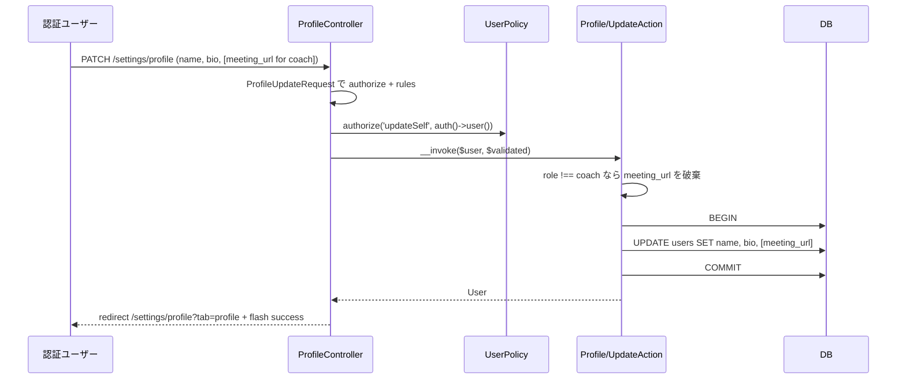
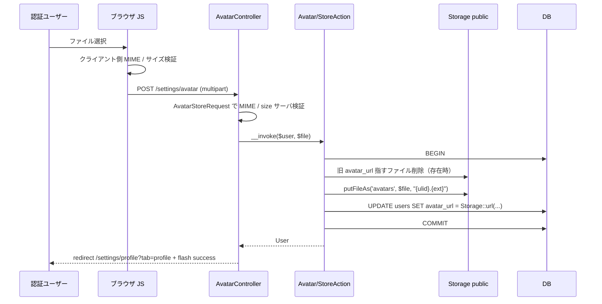
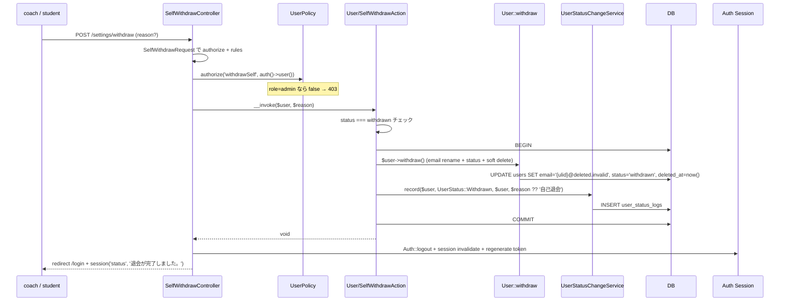
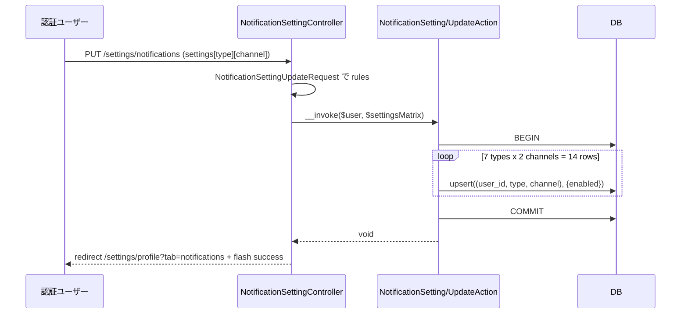
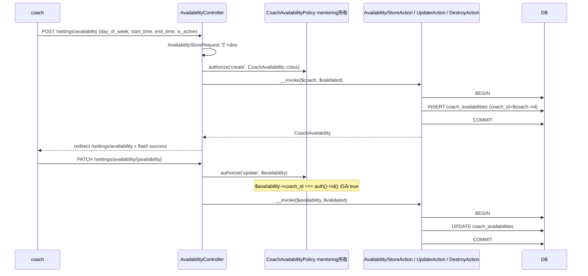
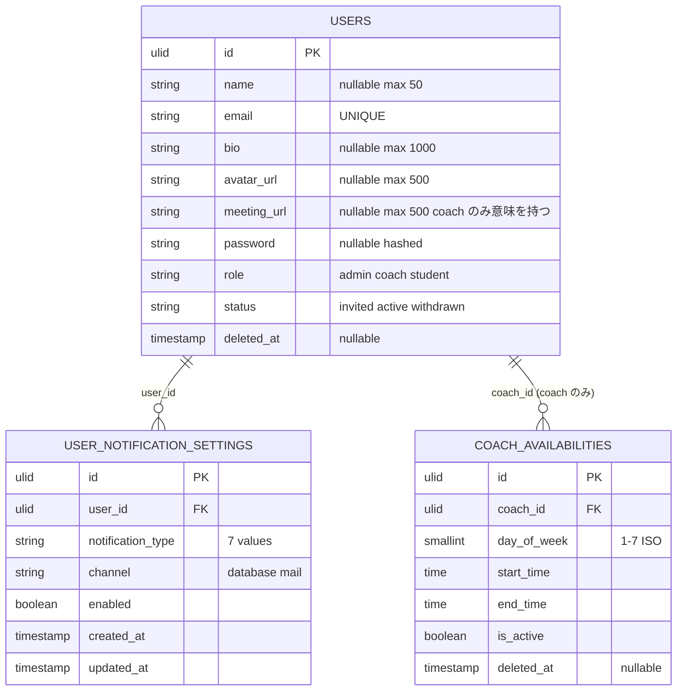
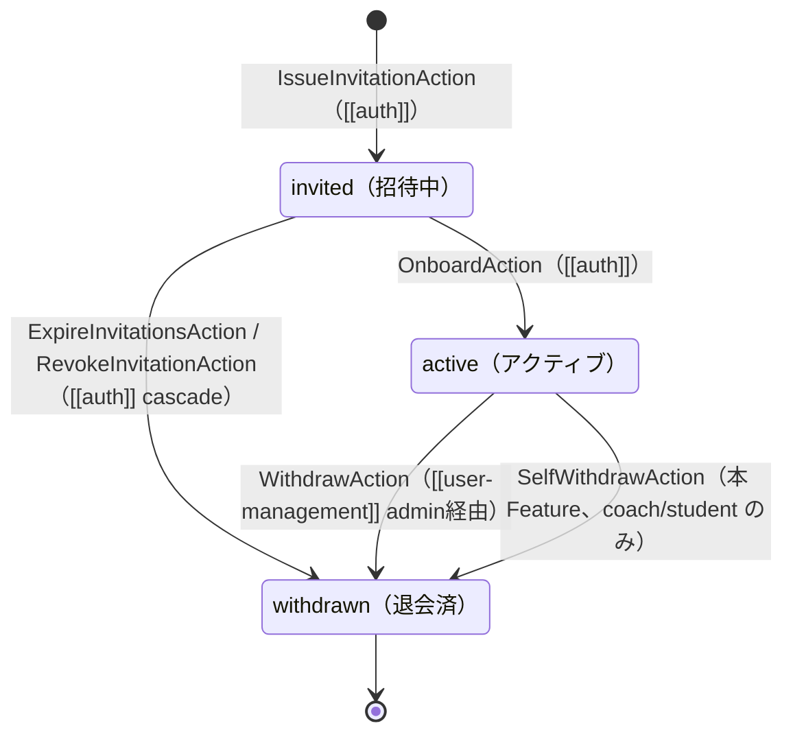

# settings-profile 設計

## アーキテクチャ概要

本 Feature は全ロールの **自己設定画面** を提供する。Clean Architecture（軽量版）に従い、Controller / FormRequest / Policy / UseCase（Action）/ Service / Eloquent Model を分離する。本 Feature が新規所有するのは `UserNotificationSetting` モデル + `NotificationType` / `NotificationChannel` Enum + 各種 Action / Controller / Blade。`User` / `CoachAvailability` は他 Feature 所有のものを参照しつつ UPDATE / CRUD する。

### 主要操作フロー

#### プロフィール編集フロー



#### アバター画像アップロードフロー



#### 自己退会フロー



#### 通知設定更新フロー



#### 面談可能時間枠 CRUD フロー（coach のみ）



## データモデル

### Eloquent モデル一覧

本 Feature が **新規追加** するのは `UserNotificationSetting` のみ。`User` / `CoachAvailability` は他 Feature 所有のものを Read / Write 参照する。

- **`User`** — [[auth]] 既存。本 Feature では `name` / `bio` / `avatar_url` / `meeting_url`（coach のみ）/ `password` を UPDATE、`withdraw()` ヘルパで `email` リネーム + `status` + `deleted_at` も UPDATE。`notificationSettings()` リレーション（`hasMany(UserNotificationSetting::class)`）を本 Feature で追加する。
- **`UserNotificationSetting`** — **新規**。`HasUlids`、SoftDeletes は採用しない（現在値のみ保持）。`belongsTo(User::class)`。クラス内に静的ヘルパ `isEnabled(User $user, NotificationType $type, NotificationChannel $channel): bool` を持ち、対応行が存在しない場合は **デフォルト true** を返す（後方互換 + 未登録ユーザーは全 ON）。
- **`CoachAvailability`** — [[mentoring]] 既存所有。本 Feature では `coach_id` / `day_of_week` / `start_time` / `end_time` / `is_active` を CRUD（INSERT / UPDATE / SoftDelete）。

### ER 図



### 主要カラム + Enum

| Model | Enum | 値 | 日本語ラベル |
|---|---|---|---|
| `UserNotificationSetting.notification_type` | `NotificationType`（本 Feature 新設） | `StagnationReminder` / `MockExamGraded` / `CompletionApproved` / `MeetingApproved` / `ChatMessageReceived` / `QaReplyReceived` / `AdminAnnouncement` | 学習途絶リマインド / 模試採点完了 / 修了認定承認 / 面談予約確定 / chat 新着 / Q&A 回答 / 管理者お知らせ |
| `UserNotificationSetting.channel` | `NotificationChannel`（本 Feature 新設） | `Database` / `Mail` | アプリ内通知 / メール |

### インデックス・制約（user_notification_settings）

- `user_id`: 外部キー（`->constrained('users')`）。SoftDelete 標準で物理削除しないため cascade 不要。
- `(user_id, notification_type, channel)`: **複合 UNIQUE 制約**（同じ組合せの重複保存を DB レベルで防止、upsert の競合キーとしても利用）。
- `(user_id, notification_type)`: 検索インデックス（[[notification]] が `via()` 解決時に `isEnabled` で 1 種別 × 2 channel をまとめて取得するクエリ用、ただし `(user_id, notification_type, channel)` UNIQUE で代替可能なため省略可）。Migration では UNIQUE のみ付与する。
- soft delete カラムは持たない（現在値のみ保持、`upsert` で運用）。

### users テーブルの追加 / 既存カラム整理

本 Feature では `users` テーブルへの **新規カラム追加は行わない**。既存カラム（`name` / `bio` / `avatar_url` / `meeting_url` / `password`）の UPDATE のみ。`meeting_url` カラムは [[mentoring]] feature が migration で追加する（`add_meeting_url_to_users_table`、[[mentoring]] tasks.md 参照）。

## 状態遷移

本 Feature が単独所有する state diagram はない。`User.status` の `active → withdrawn` を `SelfWithdrawAction` 経由で発生させるが、状態モデル自体は [[auth]] / [[user-management]] と共有する。再掲（`product.md`「ステータス遷移」A. User 参照）:



> 本 Feature の `SelfWithdrawAction` は呼出元 actor が **本人**（`$changedBy = $user`）として `UserStatusChangeService::record` を呼ぶ点が [[user-management]] の `WithdrawAction`（actor = admin）との違い。

## コンポーネント

### Controller

ロール別 namespace は使わない（`structure.md` 規約）。`/settings` プレフィックスで `auth` middleware を適用し、`/settings/availability` のみ `role:coach` を追加する。

- **`ProfileController`** — 自己プロフィール表示・編集（タブハブ）
  - `edit(EditAction)` — `GET /settings/profile`、`?tab=` を見てタブ切替の Blade を描画
  - `update(UpdateRequest, UpdateAction)` — `PATCH /settings/profile`、name / bio / meeting_url 更新
- **`AvatarController`** — アイコン画像管理
  - `store(StoreRequest, StoreAction)` — `POST /settings/avatar`、アップロード（旧画像差し替え）
  - `destroy(DestroyAction)` — `DELETE /settings/avatar`、削除
- **`PasswordController`** — パスワード変更
  - `update(UpdateRequest, UpdateAction)` — `PUT /settings/password`、Fortify 統合
- **`NotificationSettingController`** — 通知設定
  - `update(UpdateRequest, UpdateAction)` — `PUT /settings/notifications`、14 マスを upsert
- **`SelfWithdrawController`** — 自己退会（single-action）
  - `__invoke(SelfWithdrawRequest, SelfWithdrawAction)` — `POST /settings/withdraw`
- **`AvailabilityController`** — 面談可能時間枠 CRUD（coach のみ）
  - `index(IndexAction)` — `GET /settings/availability`、自分の枠を一覧
  - `store(StoreRequest, StoreAction)` — `POST /settings/availability`
  - `update(CoachAvailability $availability, UpdateRequest, UpdateAction)` — `PATCH /settings/availability/{availability}`
  - `destroy(CoachAvailability $availability, DestroyAction)` — `DELETE /settings/availability/{availability}`

> `backend-usecases.md` 規約「Controller メソッド名 = Action クラス名（PascalCase化）」に厳格準拠。`SelfWithdrawController` は単一動作のため `__invoke` 採用で例外的に「Controller 名 = Action 名」とする（Laravel 標準パターン）。

### Action（UseCase）

各 Action は単一トランザクション境界。すべて `__invoke()` を主とする。

#### `Profile/UpdateAction`

```php
// app/UseCases/Profile/UpdateAction.php
class UpdateAction
{
    public function __invoke(User $user, array $validated): User
    {
        // role !== coach なら meeting_url を入力から破棄
        if ($user->role !== UserRole::Coach) {
            unset($validated['meeting_url']);
        }

        return DB::transaction(function () use ($user, $validated) {
            $user->update($validated);
            return $user->fresh();
        });
    }
}
```

責務: name / bio / (coach のみ meeting_url) を UPDATE / UserStatusLog 記録なし
例外: なし（バリデーションは FormRequest で完結）

#### `Avatar/StoreAction`

新ファイル保存 → DB UPDATE → (best-effort で) 旧ファイル削除 の順で処理する。途中失敗時のデータロストを防ぐため、旧削除を最後に回す。

```php
// app/UseCases/Avatar/StoreAction.php
class StoreAction
{
    public function __invoke(User $user, UploadedFile $file): User
    {
        $ulid = (string) Str::ulid();
        $ext = match ($file->getMimeType()) {
            'image/png' => 'png',
            'image/jpeg' => 'jpg',
            'image/webp' => 'webp',
        };
        $relativePath = "avatars/{$ulid}.{$ext}";
        $oldUrl = $user->avatar_url;

        // (1) 新ファイル保存（衝突なしの新規 ULID パス）
        try {
            Storage::disk('public')->putFileAs('avatars', $file, basename($relativePath));
        } catch (\Throwable $e) {
            throw new AvatarStorageFailedException(previous: $e);
        }

        // (2) DB UPDATE（失敗時は新ファイルを削除してロールバック）
        try {
            $fresh = DB::transaction(function () use ($user, $relativePath) {
                $user->update(['avatar_url' => Storage::disk('public')->url($relativePath)]);
                return $user->fresh();
            });
        } catch (\Throwable $e) {
            Storage::disk('public')->delete($relativePath);
            throw $e;
        }

        // (3) 旧ファイル削除（best-effort、失敗してもユーザーフローは継続）
        $this->deleteOldAvatarIfExists($oldUrl);

        return $fresh;
    }

    private function deleteOldAvatarIfExists(?string $oldUrl): void
    {
        if (! $oldUrl) return;
        $oldRelative = ltrim(parse_url($oldUrl, PHP_URL_PATH), '/');
        $oldRelative = preg_replace('#^storage/#', '', $oldRelative);
        if (Storage::disk('public')->exists($oldRelative)) {
            Storage::disk('public')->delete($oldRelative);
        }
    }
}
```

責務: 新ファイル保存 → `avatar_url` UPDATE → 旧ファイル削除（best-effort）
例外: `AvatarStorageFailedException`（500、新ファイル保存失敗時）/ DB UPDATE 失敗時は新ファイルを削除して例外伝播

#### `Avatar/DestroyAction`

```php
// app/UseCases/Avatar/DestroyAction.php
class DestroyAction
{
    public function __invoke(User $user): User
    {
        return DB::transaction(function () use ($user) {
            if ($user->avatar_url) {
                $relative = preg_replace('#^/storage/#', '', parse_url($user->avatar_url, PHP_URL_PATH));
                if (Storage::disk('public')->exists($relative)) {
                    Storage::disk('public')->delete($relative);
                }
            }
            $user->update(['avatar_url' => null]);
            return $user->fresh();
        });
    }
}
```

責務: アバター削除 + `avatar_url = NULL` UPDATE
例外: なし（ファイル不在は冪等扱い）

#### `Password/UpdateAction`

```php
// app/UseCases/Password/UpdateAction.php
class UpdateAction
{
    public function __invoke(User $user, string $newPassword): User
    {
        return DB::transaction(function () use ($user, $newPassword) {
            $user->update(['password' => Hash::make($newPassword)]);
            return $user->fresh();
        });
    }
}
```

責務: `Hash::make` でパスワード UPDATE（`current_password` 検証 / `confirmed` ルールは FormRequest 側）
例外: なし

#### `NotificationSetting/UpdateAction`

```php
// app/UseCases/NotificationSetting/UpdateAction.php
class UpdateAction
{
    public function __invoke(User $user, array $matrix): void
    {
        // $matrix = ['stagnation_reminder' => ['database' => true, 'mail' => false], ...]
        DB::transaction(function () use ($user, $matrix) {
            $rows = [];
            foreach (NotificationType::cases() as $type) {
                foreach (NotificationChannel::cases() as $channel) {
                    $enabled = (bool) ($matrix[$type->value][$channel->value] ?? false);
                    $rows[] = [
                        'id' => (string) Str::ulid(),
                        'user_id' => $user->id,
                        'notification_type' => $type->value,
                        'channel' => $channel->value,
                        'enabled' => $enabled,
                        'created_at' => now(),
                        'updated_at' => now(),
                    ];
                }
            }

            UserNotificationSetting::upsert(
                $rows,
                uniqueBy: ['user_id', 'notification_type', 'channel'],
                update: ['enabled', 'updated_at'],
            );
        });
    }
}
```

責務: 7 種別 × 2 channel = 14 行を upsert
例外: なし

#### `User/SelfWithdrawAction`

```php
// app/UseCases/User/SelfWithdrawAction.php
class SelfWithdrawAction
{
    public function __construct(
        private UserStatusChangeService $statusLog,
    ) {}

    public function __invoke(User $user, ?string $reason = null): void
    {
        if ($user->status === UserStatus::Withdrawn) {
            throw new UserAlreadyWithdrawnException();  // [[user-management]] 所有
        }
        if ($user->role === UserRole::Admin) {
            throw new AdminSelfWithdrawForbiddenException();
        }

        DB::transaction(function () use ($user, $reason) {
            $user->withdraw();  // [[auth]] が提供するヘルパ
            ($this->statusLog)($user, UserStatus::Withdrawn, $user, $reason ?? '自己退会');
        });
    }
}
```

責務: 自己退会 / `User::withdraw()` 経由 / `UserStatusChangeService::record(actor=本人)`
例外: `UserAlreadyWithdrawnException`（409）/ `AdminSelfWithdrawForbiddenException`（403）

> Policy 二重防衛: 規約上 `Policy::withdrawSelf` で admin を拒否済みだが、Action 内でも `AdminSelfWithdrawForbiddenException` を throw して防衛（`backend-usecases.md`「データ整合性チェック」）。

#### `Availability/IndexAction`

```php
// app/UseCases/Availability/IndexAction.php
class IndexAction
{
    public function __invoke(User $coach): Collection
    {
        return CoachAvailability::where('coach_id', $coach->id)
            ->orderBy('day_of_week')
            ->orderBy('start_time')
            ->get();
    }
}
```

責務: 認証 coach 本人の `CoachAvailability` 一覧取得
例外: なし

#### `Availability/StoreAction`

```php
// app/UseCases/Availability/StoreAction.php
class StoreAction
{
    public function __invoke(User $coach, array $validated): CoachAvailability
    {
        return DB::transaction(function () use ($coach, $validated) {
            return CoachAvailability::create([
                'coach_id' => $coach->id,
                'day_of_week' => $validated['day_of_week'],
                'start_time' => $validated['start_time'],
                'end_time' => $validated['end_time'],
                'is_active' => $validated['is_active'] ?? true,
            ]);
        });
    }
}
```

責務: `coach_availabilities` への INSERT
例外: なし（バリデーションは FormRequest で完結）

#### `Availability/UpdateAction`

```php
// app/UseCases/Availability/UpdateAction.php
class UpdateAction
{
    public function __invoke(CoachAvailability $availability, array $validated): CoachAvailability
    {
        return DB::transaction(function () use ($availability, $validated) {
            $availability->update($validated);
            return $availability->fresh();
        });
    }
}
```

責務: `coach_availabilities` の UPDATE
例外: なし（authorize は Policy / Controller 側）

#### `Availability/DestroyAction`

```php
// app/UseCases/Availability/DestroyAction.php
class DestroyAction
{
    public function __invoke(CoachAvailability $availability): void
    {
        DB::transaction(fn () => $availability->delete());  // SoftDelete
    }
}
```

責務: `coach_availabilities` の SoftDelete
例外: なし

#### `Profile/EditAction`

```php
// app/UseCases/Profile/EditAction.php
class EditAction
{
    public function __invoke(User $user): array
    {
        return [
            'user' => $user,
            'notificationSettings' => $this->buildNotificationMatrix($user),
            'availabilities' => $user->role === UserRole::Coach
                ? CoachAvailability::where('coach_id', $user->id)->orderBy('day_of_week')->get()
                : collect(),
        ];
    }

    private function buildNotificationMatrix(User $user): array
    {
        $rows = UserNotificationSetting::where('user_id', $user->id)->get()
            ->groupBy(fn ($r) => $r->notification_type->value);

        $matrix = [];
        foreach (NotificationType::cases() as $type) {
            foreach (NotificationChannel::cases() as $channel) {
                $existing = $rows->get($type->value)?->firstWhere('channel', $channel);
                $matrix[$type->value][$channel->value] = $existing?->enabled ?? true;
            }
        }
        return $matrix;
    }
}
```

責務: 設定画面表示用の ViewModel（user / notificationSettings 14 マス / availabilities）を 1 リクエスト内で構築
例外: なし

### Service

本 Feature では **計算 Service を新設しない**。`UserNotificationSetting::isEnabled` 静的ヘルパはモデル内に置く（純粋なルックアップで Service にするほどの複雑度ではない）。

```php
// app/Models/UserNotificationSetting.php（抜粋）
public static function isEnabled(User $user, NotificationType $type, NotificationChannel $channel): bool
{
    return self::where('user_id', $user->id)
        ->where('notification_type', $type->value)
        ->where('channel', $channel->value)
        ->value('enabled') ?? true;  // 未登録ならデフォルト ON
}
```

[[notification]] の `Notification::via()` 内で本ヘルパを呼ぶ設計（実装責務は [[notification]] 側）。

### Policy

`UserPolicy` は [[user-management]] が所有する既存クラス。本 Feature で **`updateSelf` / `withdrawSelf` の 2 メソッドを追加** する。

```php
// app/Policies/UserPolicy.php（本 Feature が追加する 2 メソッド）
public function updateSelf(User $auth, User $target): bool
{
    return $auth->id === $target->id;  // admin も自分のプロフィールは更新可
}

public function withdrawSelf(User $auth, User $target): bool
{
    return $auth->id === $target->id && $auth->role !== UserRole::Admin;
}
```

- `updateSelf`: 本人のみ true。admin / coach / student すべて自己プロフィール更新可
- `withdrawSelf`: 本人 **かつ** admin でない場合のみ true。admin の自己退会は false → 403

`CoachAvailabilityPolicy` は [[mentoring]] が所有（`viewAny` / `view` / `create` / `update` / `delete`）。本 Feature ではそのまま `$this->authorize(...)` で利用する。

通知設定 / アバター / パスワードは「自分のリソースのみ」をシンプル `Auth::id()` 比較で扱えるため、専用 Policy は新設しない（Controller / FormRequest 内で `$this->user()` を直接使う）。

### FormRequest

すべて `app/Http/Requests/{Entity}/{Action}Request.php` に配置（`structure.md` 規約）。

- **`Profile/UpdateRequest`**
  - `authorize()`: `$this->user()->can('updateSelf', $this->user())`
  - `rules()`:
    - `name`: `required|string|min:1|max:50`
    - `bio`: `nullable|string|max:1000`
    - `meeting_url`: `nullable|string|max:500|url`（coach 以外は Action 側で破棄）
- **`Avatar/StoreRequest`**
  - `authorize()`: `$this->user()->can('updateSelf', $this->user())`
  - `rules()`:
    - `avatar`: `required|file|mimes:png,jpg,jpeg,webp|max:2048`（KB 単位、= 2 MB）
- **`Password/UpdateRequest`**
  - `authorize()`: `$this->user()->can('updateSelf', $this->user())`
  - `rules()`:
    - `current_password`: `required|current_password`（Laravel 10 標準ルール、bcrypt 照合）
    - `password`: `required|string|min:8|confirmed`
    - `password_confirmation`: 暗黙 `confirmed` ルールで使用
- **`NotificationSetting/UpdateRequest`**
  - `authorize()`: `$this->user()->can('updateSelf', $this->user())`
  - `rules()`:
    - `settings`: `required|array`
    - `settings.*.*`: `boolean`
    - keys のホワイトリストは `NotificationType::values()` × `NotificationChannel::values()` の 14 通り（`rules()` 内で動的構築）
- **`SelfWithdrawRequest`**（`app/Http/Requests/User/SelfWithdrawRequest.php`）
  - `authorize()`: `$this->user()->can('withdrawSelf', $this->user())`（admin は false → 403）
  - `rules()`:
    - `reason`: `nullable|string|max:200`
- **`Availability/StoreRequest`**
  - `authorize()`: `$this->user()->can('create', CoachAvailability::class)`（[[mentoring]] Policy）
  - `rules()`:
    - `day_of_week`: `required|integer|between:1,7`
    - `start_time`: `required|date_format:H:i`
    - `end_time`: `required|date_format:H:i|after:start_time`
    - `is_active`: `boolean`
- **`Availability/UpdateRequest`** — `Availability/StoreRequest` と同じルール、`authorize()` のみ `update` Policy 呼出に変更（`$this->route('availability')` を引数）

### Resource

API レスポンスを返さない（全 Blade 描画）ため新設しない。

## Blade ビュー

`resources/views/settings/` 配下に配置。`frontend-blade.md`「共通コンポーネント API」のみ参照（新規コンポーネントは作らない）。

| ファイル | 用途 |
|---|---|
| `settings/profile.blade.php` | プロフィール表示・編集（タブハブ、`<x-tabs>` で profile / password / notifications / (coach/student) withdraw を切替）|
| `settings/_partials/tab-profile.blade.php` | プロフィールフォーム（`<x-form.input name="name">` / `<x-form.textarea name="bio">` / `<x-avatar>` + アップロードボタン + delete ボタン / coach のみ `<x-form.input name="meeting_url">`）|
| `settings/_partials/tab-password.blade.php` | パスワード変更フォーム（`<x-form.input name="current_password" type="password">` / `name="password"` / `name="password_confirmation"`）|
| `settings/_partials/tab-notifications.blade.php` | 通知設定マトリクス（7 行 × 2 列のチェックボックステーブル、`<x-form.checkbox>`、`<x-table>` で枠組み）|
| `settings/_partials/tab-withdraw.blade.php` | 自己退会フォーム（`<x-modal>` で確認、`<x-form.textarea name="reason">` 任意、coach/student のみ表示）|
| `settings/availability/index.blade.php` | 面談可能時間枠 CRUD ページ（曜日 × 時間範囲のテーブル + 新規追加フォーム + 既存行のインライン編集 / 削除）|

### タブ表示制御

`settings/profile.blade.php` 冒頭で `auth()->user()->role` を見てタブ配列を組み立てる。

```blade
@php
    $tabs = ['profile' => 'プロフィール', 'password' => 'パスワード', 'notifications' => '通知設定'];
    if (auth()->user()->role !== \App\Enums\UserRole::Admin) {
        $tabs['withdraw'] = '退会';
    }
@endphp
<x-tabs :tabs="$tabs" :active="$tab ?? 'profile'" />
```

### コーチ専用要素の表示制御

- `meeting_url` フィールド: `@if(auth()->user()->role === \App\Enums\UserRole::Coach)` でラップ
- `/settings/availability` への link: 同上、サイドバーには出さずプロフィール画面下部に「面談可能時間枠を編集 →」link を表示

### 共通レイアウト

すべて `@extends('layouts.app')` を継承（認証後の主レイアウト）。`<x-flash>` は `layouts/app.blade.php` 既定で表示口を持つため、各 Blade では `session()->put` で flash するだけで Alert が自動表示される。

## ルート定義

`routes/web.php` に以下を追加（`frontend-ui-foundation.md`「ロール共通画面の責務分担」表のルート命名に厳格準拠）:

```php
Route::middleware(['auth'])->prefix('settings')->name('settings.')->group(function () {
    Route::get('profile', [ProfileController::class, 'edit'])->name('profile.edit');
    Route::patch('profile', [ProfileController::class, 'update'])->name('profile.update');

    Route::post('avatar', [AvatarController::class, 'store'])->name('avatar.store');
    Route::delete('avatar', [AvatarController::class, 'destroy'])->name('avatar.destroy');

    Route::put('password', [PasswordController::class, 'update'])->name('password.update');

    Route::put('notifications', [NotificationSettingController::class, 'update'])->name('notifications.update');

    Route::post('withdraw', SelfWithdrawController::class)->name('withdraw');

    // coach のみ
    Route::middleware(['role:coach'])->group(function () {
        Route::resource('availability', AvailabilityController::class)
            ->only(['index', 'store', 'update', 'destroy']);
    });
});
```

> サイドバー「設定」アイテムは `settings.profile.edit` ルート名で `<x-nav.item>` 経由（`frontend-ui-foundation.md` 各ロール sidebar 構造参照）。

## エラーハンドリング

### 想定例外（本 Feature 所有、`app/Exceptions/SettingsProfile/` 配下）

| Exception | 親クラス | HTTP | 用途 |
|---|---|---|---|
| `AdminSelfWithdrawForbiddenException` | `AccessDeniedHttpException` | 403 | admin が `POST /settings/withdraw` を呼んだ場合 |
| `AvatarStorageFailedException` | `HttpException(500)` | 500 | Storage 書込失敗（ディスク満杯 / 権限不足等）|

メッセージ:
- `AdminSelfWithdrawForbiddenException`: 「管理者は自己退会できません。」
- `AvatarStorageFailedException`: 「画像のアップロードに失敗しました。時間をおいて再度お試しください。」

### [[user-management]] 所有例外の伝播

| Exception | HTTP | 用途 |
|---|---|---|
| `UserAlreadyWithdrawnException` | 409 | 既に withdrawn の User が再度自己退会を試みた場合（理論上発生しないが防衛） |

### バリデーションエラー

FormRequest 側で日本語メッセージ（`lang/ja/validation.php`）を返却、`<x-flash>` ではなく `<x-form.error>` で各フィールド下に表示。

### Storage 失敗時のロールバック

`Avatar/StoreAction` 内で `DB::transaction` を抜けても Storage 操作はトランザクション外なので、明示的に try/catch + `AvatarStorageFailedException` で 500 を返し、DB 側は未更新で保つ（旧ファイル削除に成功して新ファイル保存失敗の場合のみ avatar 表示が不整合になるが、ユーザー再アップロードで自己回復可能）。

## 関連要件マッピング

| 要件ID | 実装ポイント |
|---|---|
| REQ-settings-profile-001 | `routes/web.php`（settings プレフィックス group）+ `settings/profile.blade.php`（`<x-tabs>`）|
| REQ-settings-profile-002 | `routes/web.php`（`auth` middleware）|
| REQ-settings-profile-003 | `settings/profile.blade.php`（タブ配列のロール分岐）|
| REQ-settings-profile-004 | `settings/_partials/tab-profile.blade.php`（`meeting_url` フィールドの `@if` 表示制御）|
| REQ-settings-profile-005 | `app/Policies/UserPolicy::withdrawSelf` + `AdminSelfWithdrawForbiddenException` + `role:coach` middleware on `/settings/availability` |
| REQ-settings-profile-006 | `routes/web.php`（`role:coach` middleware group on availability）|
| REQ-settings-profile-010 | `app/Http/Controllers/ProfileController::edit` + `app/UseCases/Profile/EditAction` + `settings/profile.blade.php` |
| REQ-settings-profile-011 | `app/Http/Controllers/ProfileController::update` + `app/Http/Requests/Profile/UpdateRequest` + `app/UseCases/Profile/UpdateAction`（meeting_url 受け取らない場合も含む）|
| REQ-settings-profile-012 | `app/Http/Requests/Profile/UpdateRequest`（`meeting_url` rule）+ `app/UseCases/Profile/UpdateAction`（coach 限定処理）|
| REQ-settings-profile-013 | `app/UseCases/Profile/UpdateAction`（`unset($validated['meeting_url'])`）|
| REQ-settings-profile-014 | `app/Http/Controllers/ProfileController::update`（redirect + flash success）|
| REQ-settings-profile-020 | `app/Http/Requests/Avatar/StoreRequest`（mimes + max:2048）|
| REQ-settings-profile-021 | `app/UseCases/Avatar/StoreAction`（DB::transaction + Storage::disk('public')）|
| REQ-settings-profile-022 | `app/UseCases/Avatar/StoreAction`（try/catch + `AvatarStorageFailedException`）+ `app/Exceptions/Handler.php` |
| REQ-settings-profile-023 | `app/Http/Controllers/AvatarController::destroy` + `app/UseCases/Avatar/DestroyAction` |
| REQ-settings-profile-030 | `routes/web.php`（`PUT /settings/password`）+ `app/Providers/FortifyServiceProvider`（`Fortify::routes(false)` で標準ルート無効化、本 Feature で代替）|
| REQ-settings-profile-031 | `app/Http/Requests/Password/UpdateRequest`（current_password + min:8 + confirmed）+ `app/UseCases/Password/UpdateAction`（Hash::make）|
| REQ-settings-profile-032 | `app/Http/Requests/Password/UpdateRequest`（current_password rule）|
| REQ-settings-profile-033 | `app/Http/Requests/Password/UpdateRequest`（min:8 rule）|
| REQ-settings-profile-034 | `app/Http/Controllers/PasswordController::update`（redirect + `session('status', 'password-updated')`）|
| REQ-settings-profile-040 | `database/migrations/*_create_user_notification_settings_table.php`（ULID + UNIQUE 制約）|
| REQ-settings-profile-041 | `app/Enums/NotificationType.php`（7 cases + label()）|
| REQ-settings-profile-042 | `app/Enums/NotificationChannel.php`（2 cases + label()）|
| REQ-settings-profile-043 | `settings/_partials/tab-notifications.blade.php`（14 マスのチェックボックステーブル）+ `app/UseCases/Profile/EditAction::buildNotificationMatrix`（デフォルト ON）|
| REQ-settings-profile-044 | `app/UseCases/NotificationSetting/UpdateAction`（upsert + DB::transaction）|
| REQ-settings-profile-045 | `app/Models/UserNotificationSetting::isEnabled`（静的ヘルパ + デフォルト true）|
| REQ-settings-profile-046 | `app/Http/Controllers/NotificationSettingController::update`（redirect + flash）|
| REQ-settings-profile-050 | `app/Http/Controllers/SelfWithdrawController::__invoke` + `app/UseCases/User/SelfWithdrawAction` + `app/Http/Requests/User/SelfWithdrawRequest` |
| REQ-settings-profile-051 | `app/Policies/UserPolicy::withdrawSelf` + `app/Exceptions/SettingsProfile/AdminSelfWithdrawForbiddenException` |
| REQ-settings-profile-052 | `app/UseCases/User/SelfWithdrawAction`（`UserAlreadyWithdrawnException` 伝播）|
| REQ-settings-profile-053 | `app/UseCases/User/SelfWithdrawAction`（`User::withdraw()` のみで Enrollment 削除なし、[[enrollment]] の cascade なし設計と整合）|
| REQ-settings-profile-060 | `app/Http/Controllers/AvailabilityController::index` + `app/UseCases/Availability/IndexAction` + `settings/availability/index.blade.php` |
| REQ-settings-profile-061 | `app/Http/Controllers/AvailabilityController::store` + `app/Http/Requests/Availability/StoreRequest` + `app/UseCases/Availability/StoreAction` |
| REQ-settings-profile-062 | `app/Http/Controllers/AvailabilityController::update` + `app/Http/Requests/Availability/UpdateRequest` + `app/UseCases/Availability/UpdateAction` + [[mentoring]] `CoachAvailabilityPolicy::update` |
| REQ-settings-profile-063 | `app/Http/Controllers/AvailabilityController::destroy` + `app/UseCases/Availability/DestroyAction` + [[mentoring]] `CoachAvailabilityPolicy::delete` |
| REQ-settings-profile-064 | `app/Http/Requests/Availability/StoreRequest`（`after:start_time` rule）|
| REQ-settings-profile-065 | （明示的な実装なし、[[mentoring]] `IndexAction` 側で和集合扱い）|
| REQ-settings-profile-080 | `routes/web.php`（`auth` only + availability のみ `role:coach`）|
| REQ-settings-profile-081 | `app/Policies/UserPolicy::updateSelf` / `::withdrawSelf` |
| REQ-settings-profile-082 | （参照のみ、本 Feature で新設しない）|
| NFR-settings-profile-001 | 全 Action 内の `DB::transaction` 呼出 |
| NFR-settings-profile-002 | `app/Exceptions/SettingsProfile/AdminSelfWithdrawForbiddenException.php` / `AvatarStorageFailedException.php` |
| NFR-settings-profile-003 | 全 Blade ファイルが `@extends('layouts.app')` + `<x-*>` 利用 |
| NFR-settings-profile-004 | `app/UseCases/Avatar/StoreAction`（`Storage::disk('public')`）+ `sail artisan storage:link` 動作確認 |
| NFR-settings-profile-005 | `app/Models/UserNotificationSetting::isEnabled`（単純 SELECT、Eager Loading 不要）|
| NFR-settings-profile-006 | `lang/ja/validation.php`（attributes / messages 拡張）+ 各 Exception コンストラクタの日本語メッセージ |
| NFR-settings-profile-007 | `resources/js/settings-profile/avatar.js`（クライアント側 MIME / サイズ検証）|
| NFR-settings-profile-008 | 全 Blade フォームの `@csrf` ディレクティブ |
