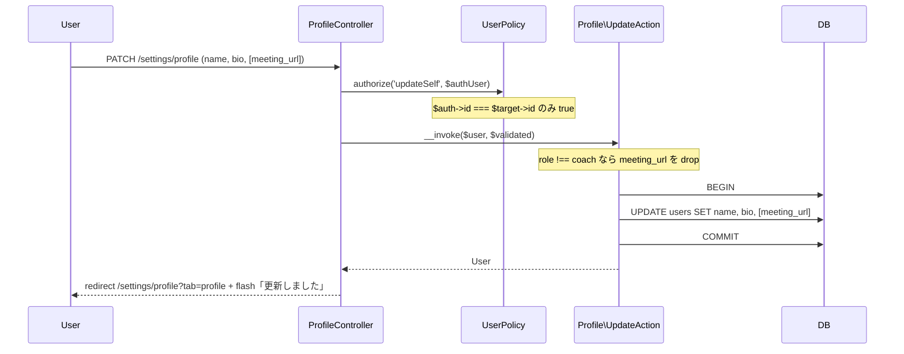
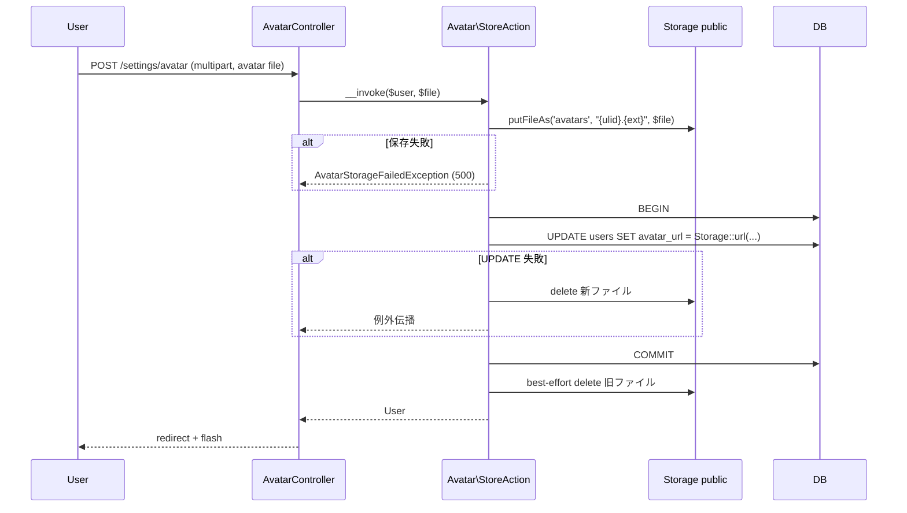
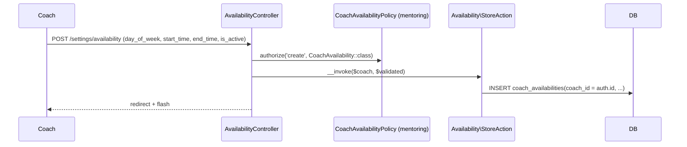

# settings-profile 設計

> **v3 改修反映**(2026-05-16):
> - **自己退会動線を完全撤回**(`SelfWithdrawController` / `SelfWithdrawAction` / `SelfWithdrawRequest` / `AdminSelfWithdrawForbiddenException` / `withdrawSelf` Policy / `tab-withdraw.blade.php` / 関連テスト 10+ 件削除)
> - **EnsureActiveLearning Middleware は適用しない**(product.md L482「プロフィール / 修了証 DL は許可」と整合、graduated ユーザーも自身のプロフィール管理は可能)
> - サイドバー「設定」サブページは `/settings/profile` / `/settings/password` の **2 タブ + coach 限定 `/settings/availability`** に縮減
> - プラン情報表示・追加面談購入 CTA は引き続き [[dashboard]] に集約

## アーキテクチャ概要

本 Feature は全ロールの **自己設定画面** を提供する。Clean Architecture(軽量版)に従い、Controller / FormRequest / Policy / UseCase(Action) / Service / Eloquent Model を分離する。本 Feature が新規所有するのは各種 Action / Controller / Blade のみ(モデル新設なし)。`User` / `CoachAvailability` は他 Feature 所有のものを参照しつつ UPDATE / CRUD する。

**通知設定 UI は提供しない**([[notification]] が全通知 DB+Mail 固定送信)。`UserNotificationSetting` / `NotificationType` Enum / `NotificationChannel` Enum / `NotificationSettingController` / `tab-notifications.blade.php` は **新設しない**。

**v3 で自己退会動線を撤回**。退会は admin に依頼するオペレーション(LMS 内に動線なし、product.md L497)、`/settings/withdraw` ルートおよび関連クラスを一切作らない。`AdminSelfWithdrawForbiddenException` も不要(そもそも自己退会できないため)。

### 1. プロフィール編集



### 2. アバターアップロード



### 3. パスワード変更(Fortify 統合)

Fortify 標準の `PUT /settings/password` を利用、`UpdateUserPassword` contract を本 Feature の `App\Actions\Fortify\UpdateUserPassword` が実装。`current_password` 照合 + `password: confirmed min:8` バリデーション + `Hash::make` 保存。

### 4. CoachAvailability CRUD(coach のみ)



## コンポーネント

### Controller

`app/Http/Controllers/`(`auth` middleware):

- `ProfileController` — `edit` / `update(Profile\UpdateRequest, Profile\UpdateAction)`
- `AvatarController` — `store(Avatar\StoreRequest, Avatar\StoreAction)` / `destroy(Avatar\DestroyAction)`
- `PasswordController` — Fortify 標準ルートを使用(Controller は本 Feature で持たない)
- `AvailabilityController`(coach のみ、`role:coach` middleware) — `index(Availability\IndexAction)` / `store(Availability\StoreRequest, Availability\StoreAction)` / `update($availability, Availability\UpdateRequest, Availability\UpdateAction)` / `destroy($availability, Availability\DestroyAction)`

### 明示的に持たない Controller(v3 撤回)

- **`SelfWithdrawController`** — `/settings/withdraw` ルート自体を持たない
- 旧 `WithdrawalController` などの自己退会関連も一切作らない

### Action(UseCase)

Controller method 名と完全一致(`.claude/rules/backend-usecases.md` 準拠):

- `app/UseCases/Profile/UpdateAction.php`(`ProfileController::update`)
- `app/UseCases/Avatar/StoreAction.php`(`AvatarController::store`、旧 `UpdateAvatarAction` を rename)
- `app/UseCases/Avatar/DestroyAction.php`(`AvatarController::destroy`)
- `app/UseCases/Availability/IndexAction.php`(`AvailabilityController::index`)
- `app/UseCases/Availability/StoreAction.php`(`AvailabilityController::store`)
- `app/UseCases/Availability/UpdateAction.php`(`AvailabilityController::update`)
- `app/UseCases/Availability/DestroyAction.php`(`AvailabilityController::destroy`)

```php
namespace App\UseCases\Profile;

class UpdateAction
{
    public function __invoke(User $user, array $validated): User
    {
        return DB::transaction(function () use ($user, $validated) {
            $attrs = ['name' => $validated['name'], 'bio' => $validated['bio'] ?? null];
            if ($user->role === UserRole::Coach && array_key_exists('meeting_url', $validated)) {
                $attrs['meeting_url'] = $validated['meeting_url'] ?: null;
            }
            $user->update($attrs);
            return $user->fresh();
        });
    }
}

namespace App\UseCases\Avatar;

class StoreAction
{
    public function __invoke(User $user, UploadedFile $file): User
    {
        $ulid = Str::ulid();
        $ext = $file->getClientOriginalExtension();
        $path = "avatars/{$ulid}.{$ext}";

        try {
            Storage::disk('public')->putFileAs(dirname($path), $file, basename($path));
        } catch (\Throwable $e) {
            throw new AvatarStorageFailedException(previous: $e);
        }

        $oldUrl = $user->avatar_url;
        try {
            DB::transaction(fn () => $user->update(['avatar_url' => Storage::url($path)]));
        } catch (\Throwable $e) {
            Storage::disk('public')->delete($path);  // rollback
            throw $e;
        }

        if ($oldUrl) {
            $oldPath = ltrim(parse_url($oldUrl, PHP_URL_PATH), '/');
            $oldPath = preg_replace('#^storage/#', '', $oldPath);
            Storage::disk('public')->delete($oldPath);  // best-effort
        }
        return $user->fresh();
    }
}

class DestroyAction
{
    public function __invoke(User $user): User
    {
        return DB::transaction(function () use ($user) {
            if ($user->avatar_url) {
                $path = preg_replace('#^storage/#', '', ltrim(parse_url($user->avatar_url, PHP_URL_PATH), '/'));
                Storage::disk('public')->delete($path);
            }
            $user->update(['avatar_url' => null]);
            return $user->fresh();
        });
    }
}

namespace App\UseCases\Availability;

// IndexAction / StoreAction / UpdateAction / DestroyAction
// CoachAvailability の CRUD、Policy 検証は Controller / FormRequest で完了済
```

### 明示的に持たない Action(v3 撤回)

- **`SelfWithdrawAction`** — 自己退会動線そのものがないため

### Policy

`app/Policies/`:

- `UserPolicy::updateSelf(User $auth, User $target): bool`($auth->id === $target->id のみ true)を **本 Feature で新設**
- **`UserPolicy::withdrawSelf` は提供しない**(v3 撤回)
- `CoachAvailabilityPolicy` は [[mentoring]] 所有を借用

### FormRequest

`.claude/rules/backend-http.md` 準拠 — `app/Http/Requests/{Entity}/{Action}Request.php`:

- `app/Http/Requests/Profile/UpdateRequest.php`(`name: required string max:50` / `bio: nullable string max:1000` / `meeting_url: nullable string url max:500`、authorize: `Policy::updateSelf`)
- `app/Http/Requests/Avatar/StoreRequest.php`(`avatar: required file mimes:png,jpg,jpeg,webp max:2048`)
- `app/Http/Requests/Availability/StoreRequest.php` / `Availability/UpdateRequest.php`(`day_of_week: required integer between:1,7` / `start_time: required date_format:H:i` / `end_time: required date_format:H:i + after:start_time` / `is_active: boolean`)

### 明示的に持たない FormRequest(v3 撤回)

- **`SelfWithdrawRequest`**

### Route

`routes/web.php`:

```php
Route::middleware('auth')->prefix('settings')->name('settings.')->group(function () {
    Route::get('profile', [ProfileController::class, 'edit'])->name('profile.edit');
    Route::patch('profile', [ProfileController::class, 'update'])->name('profile.update');
    Route::post('avatar', [AvatarController::class, 'store'])->name('avatar.store');
    Route::delete('avatar', [AvatarController::class, 'destroy'])->name('avatar.destroy');

    // Fortify が PUT /settings/password を提供(本 Feature はルート定義しない)

    // coach 限定
    Route::middleware('role:coach')->group(function () {
        Route::get('availability', [AvailabilityController::class, 'index'])->name('availability.index');
        Route::post('availability', [AvailabilityController::class, 'store'])->name('availability.store');
        Route::patch('availability/{availability}', [AvailabilityController::class, 'update'])->name('availability.update');
        Route::delete('availability/{availability}', [AvailabilityController::class, 'destroy'])->name('availability.destroy');
    });
});
```

> **v3 で `EnsureActiveLearning` Middleware は適用しない**(product.md L482「プロフィール / 修了証 DL は許可」と整合、graduated 受講生も自身のプロフィール管理は可能)。
> **`/settings/withdraw` ルートは提供しない**(v3 撤回)。

## Blade ビュー

`resources/views/settings/`:

| ファイル | 役割 |
|---|---|
| `profile.blade.php` | `<x-tabs>` で **「プロフィール / パスワード」の 2 タブ**(v3、「退会」タブ削除)、各タブ内の form を `_partials/{tab}.blade.php` で include |
| `_partials/tab-profile.blade.php` | name / bio + coach のみ meeting_url + avatar アップロード form |
| `_partials/tab-password.blade.php` | Fortify 標準の current_password / password / password_confirmation |
| `availability/index.blade.php` | coach 限定、`CoachAvailability` 一覧 + 作成 / 編集 / 削除モーダル |
| `availability/_partials/form.blade.php` | day_of_week / start_time / end_time / is_active 入力 |

### 明示的に持たない Blade(v3 撤回)

- **`_partials/tab-withdraw.blade.php`** — 自己退会タブ全削除
- `_partials/tab-notifications.blade.php` — そもそも作らない

## JavaScript

`resources/js/settings-profile/`:

- `avatar.js`(MIME / サイズのクライアント側検証、サーバ側と二重化)

## エラーハンドリング

`app/Exceptions/SettingsProfile/`:

- `AvatarStorageFailedException`(HTTP 500)

### 明示的に持たない例外(v3 撤回)

- **`AdminSelfWithdrawForbiddenException`** — そもそも自己退会動線がないため不要

## 関連要件マッピング

| 要件 ID | 実装ポイント |
|---|---|
| REQ-settings-profile-001 | `routes/web.php` で `/settings/profile` / `/settings/password` / `/settings/availability` のみ定義、**`/settings/withdraw` 撤回** |
| REQ-settings-profile-002 | `auth` middleware のみ(**EnsureActiveLearning は適用しない**、product.md L482 と整合) |
| REQ-settings-profile-003 | `views/settings/profile.blade.php` の `<x-tabs>` 2 タブ |
| REQ-settings-profile-004 | `_partials/tab-profile.blade.php` で `@if(auth()->user()->role === UserRole::Coach)` 分岐 |
| REQ-settings-profile-005 | `routes/web.php` の `role:coach` middleware |
| REQ-settings-profile-010〜014 | `ProfileController::update` + `Profile\UpdateAction` |
| REQ-settings-profile-020〜023 | `AvatarController` + `Avatar\StoreAction` / `Avatar\DestroyAction` |
| REQ-settings-profile-030〜034 | Fortify 標準ルート + `App\Actions\Fortify\UpdateUserPassword` |
| REQ-settings-profile-060〜065 | `AvailabilityController` + `Availability\{Index,Store,Update,Destroy}Action` |
| REQ-settings-profile-080〜082 | `UserPolicy::updateSelf` + `CoachAvailabilityPolicy`(mentoring 借用) |
| NFR-settings-profile-001 | 各 Action の `DB::transaction()` |
| NFR-settings-profile-002 | `app/Exceptions/SettingsProfile/AvatarStorageFailedException` のみ |
| NFR-settings-profile-004 | `Storage::disk('public')` 配下 |

## テスト戦略

### Feature(HTTP)

- `Profile/EditTest.php` / `UpdateTest.php`(name / bio 更新、coach の meeting_url 更新、student/admin の meeting_url drop)
- `Avatar/StoreTest.php` / `DestroyTest.php`(MIME 検証、サイズ検証、Storage 保存 / 削除確認)
- `Password/UpdateTest.php`(Fortify 標準動作、current_password 不一致で 422)
- `Availability/{Index,Store,Update,Destroy}Test.php`(coach のみ 200、admin/student 403)
- **`graduated` ユーザー動作確認**(v3): `/settings/profile` / `/settings/password` / `/settings/avatar` で 200(EnsureActiveLearning なし、product.md L482 と整合)

### 明示的に持たないテスト(v3 撤回)

- **`Withdraw/StoreTest.php`** — 自己退会動線そのものがないため
- `AdminSelfWithdrawForbiddenExceptionTest`

### Unit

- `Profile\UpdateActionTest`(role !== coach で meeting_url drop)
- `Avatar\StoreActionTest`(rollback シナリオ)
- `UserPolicy::updateSelfTest`
