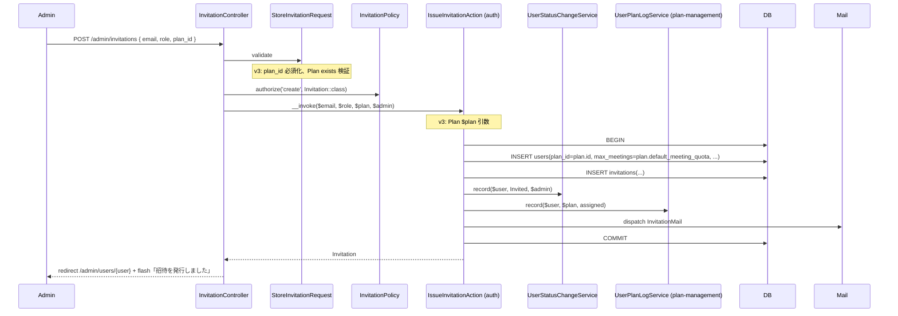
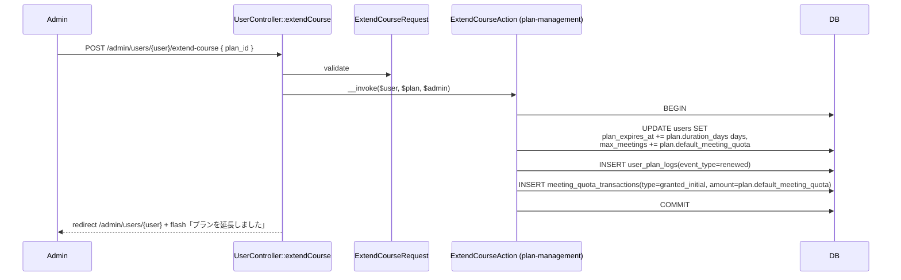
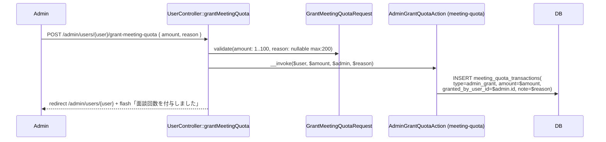
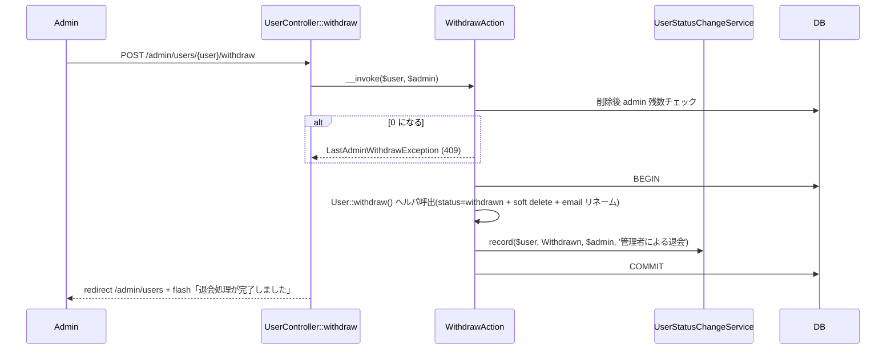

# user-management 設計

> **v3 改修反映**（2026-05-16）:
> - 招待モーダル + プラン延長モーダル + 面談回数手動付与 UI 追加
> - `UpdateAction`（プロフィール編集）/ `UpdateRoleAction`（ロール変更）撤回（admin が他者のプロフィール / ロールを変更する動線を撤回）
> - `UserStatus::Active` 参照を `UserStatus::InProgress` に統一、`Graduated` 値追加
> - `IssueInvitationAction` 呼出時に `Plan $plan` を渡す（v3、招待モーダルで Plan 選択）
>
> **2026-05-17 設計修正**: `UserStatusLog.event_type` カラムごと撤回(`from_status` / `to_status` で遷移を表現できるため冗長、`UserPlanLog.event_type` のみ 4 値で必要、引き算で揃える)。

## アーキテクチャ概要

admin 専用のユーザー運用画面と、Feature 横断のステータス変更記録基盤を提供する。Clean Architecture（軽量版）に従い、Controller / FormRequest / Policy / UseCase（Action）/ Service / Eloquent Model を分離する。

**v3 で 3 つの新 UI 追加**:
- 招待モーダルに `plan_id` 選択フィールド
- ユーザー詳細にプラン情報パネル
- プラン延長モーダル + 面談回数手動付与モーダル

**v3 で 2 つの Action 撤回**:
- `UpdateAction`（プロフィール編集、admin → 他者）
- `UpdateRoleAction`（ロール変更、admin → 他者）

### 1. 招待発行フロー（v3 で Plan 必須）



### 2. プラン延長フロー（v3 新規）



### 3. 面談回数手動付与（v3 新規）



### 4. 強制退会フロー



## データモデル

### Eloquent モデル

- **`UserStatusLog`** — `HasUlids` + `HasFactory`、`from_status` / `to_status` `UserStatus` cast(**4 値**、v3) / `changed_at` datetime cast、`belongsTo(User)` / `belongsTo(User, changed_by_user_id, changedBy)`。`scopeForUser` / `scopeRecent`。**イベント分類用の追加カラム(`event_type` 相当)は持たない**(`from_status` / `to_status` で遷移内容は完結し、追加カラムは冗長になるため、2026-05-17 設計修正で撤回)

> **`UserPlanLog.event_type` との設計上の対比**(2026-05-17 設計修正で明確化):
> - `UserPlanLog.event_type` は `assigned` / `renewed` / `canceled` / `expired` の **4 値で意味的に必要**(プラン遷移は from/to だけでは表現できない、「割当」「延長」「キャンセル」「期限満了」を別 event として区別する必要がある)
> - 一方 `UserStatusLog` は `from_status` → `to_status` の遷移だけで意味が完結する(invited → in_progress なら「オンボーディング完了」、in_progress → withdrawn なら「退会」と読み取れる)
> - したがって `UserStatusLog` に「全レコード 1 値固定の event_type」を追加するのは過剰設計。**必要なときだけカラムを持つ**(Laravel 標準寄せ + 引き算)
>
> **Status 監査 vs Plan 監査を別テーブルで持つ理由**:
> - **読み取り頻度の違い**: `UserStatusLog` は admin の「ユーザー詳細 → ステータス履歴」UI と Schedule Command の集計で頻繁に参照、`UserPlanLog` は「プラン延長履歴 / 卒業履歴」を見るときのみ
> - **INDEX 設計の違い**: `UserStatusLog` は `(user_id, changed_at)` が主、`UserPlanLog` は `(user_id, occurred_at)` + `(plan_id, occurred_at)` が主
> - **概念の独立性**: 「ステータス(状態)の遷移」と「プラン期間(期間 + 面談付与回数の組み合わせ)の遷移」は別ドメイン概念(プラン延長してもステータスは `in_progress` のまま不変)
> - 単一テーブルに統合すると `from_status` / `to_status` が NULL になる Plan 遷移行が混在し、`UNION` クエリでも分かりにくい

### ER 図

```mermaid
erDiagram
    USERS ||--o{ USER_STATUS_LOGS : "user_id"
    USERS ||--o{ USER_STATUS_LOGS : "changed_by_user_id (nullable)"

    USER_STATUS_LOGS {
        ulid id PK
        ulid user_id FK
        string from_status "v3: 4 値"
        string to_status "v3: 4 値"
        ulid changed_by_user_id "nullable"
        text changed_reason "nullable"
        timestamp changed_at
        timestamps
    }
```

## コンポーネント

### Controller

`app/Http/Controllers/Admin/`(`auth + role:admin` middleware):

- `UserController` — `index(IndexRequest)` / `show($user)` / **`withdraw($user)`** / **`extendCourse($user, ExtendCourseRequest)`**(v3) / **`grantMeetingQuota($user, GrantMeetingQuotaRequest)`**(v3)
- **`update` / `updateRole` メソッドは提供しない**(v3 撤回)
- `InvitationController` — `store(StoreInvitationRequest)`(招待発行) / `reissue($user)`(再招待) / `revoke($invitation)`(取消)

### Action

`.claude/rules/backend-usecases.md` の「Controller method 名 = Action クラス名」+「Feature 間連携のラッパー Action」規約に従い、本 Feature の Controller method ごとに同名のラッパー Action を配置(他 Feature の Action を直接 Controller に DI することは規約違反):

`app/UseCases/User/`(`Admin\UserController` 対応):

- `IndexAction` — `UserController::index`、フィルタ + paginate
- `ShowAction` — `UserController::show`、詳細取得
- **`WithdrawAction(User $user, ?User $admin)`** — `UserController::withdraw`、last admin チェック + User::withdraw + UserStatusChangeService::record
- **`ExtendCourseAction`(v3 新規、ラッパー)** — `UserController::extendCourse`、内部で [[plan-management]] の `Plan\ExtendCourseAction` を DI 呼出
- **`GrantMeetingQuotaAction`(v3 新規、ラッパー)** — `UserController::grantMeetingQuota`、内部で [[meeting-quota]] の `AdminGrantQuotaAction($user, $amount, $admin, $reason)` を DI 呼出
- **削除(v3 撤回)**: `UpdateAction`(プロフィール編集) / `UpdateRoleAction`(ロール変更)

`app/UseCases/Invitation/`(`Admin\InvitationController` 対応、すべて [[auth]] の Action を内部 DI するラッパー):

- **`StoreAction`** — `InvitationController::store`、内部で [[auth]] の `IssueInvitationAction($email, $role, $plan, $admin)` を呼ぶ
- **`ReissueAction`** — `InvitationController::reissue`、内部で [[auth]] の `IssueInvitationAction($email, $role, $plan, $admin, force: true)` または既存招待の再発行 helper を呼ぶ
- **`RevokeAction`** — `InvitationController::revoke`、内部で [[auth]] の `RevokeInvitationAction($invitation)` を呼ぶ

### Service

- **`UserStatusChangeService`** — `record(User $user, UserStatus $newStatus, ?User $changedBy, ?string $reason): UserStatusLog`、INSERT only(本 Feature 所有、各 Feature の Action から呼ばれる)。呼出時の `$user->status` を `from_status`、引数の `$newStatus` を `to_status` として `UserStatusLog` に INSERT する。`User.status` の UPDATE は呼出側責務(本 Service は INSERT のみで `DB::transaction` を持たない)。呼出側は record() を「`$user->status` が遷移前」の状態で呼ぶ契約を守る必要がある

### Policy

- `UserPolicy::view`(admin true)
- **`UserPolicy::withdraw`**(admin true)
- **`UserPolicy::extendCourse`**(v3 新規、admin true)
- **`UserPolicy::grantMeetingQuota`**(v3 新規、admin true)
- **`UserPolicy::update` / `UserPolicy::updateRole` は提供しない**(v3 撤回)
- `InvitationPolicy::create` / `revoke`(admin true、[[auth]] 借用)

### FormRequest

- `IndexRequest`(`role: nullable enum:UserRole` / **`status: nullable enum:UserStatus`**(v3 で 4 値含む) / `keyword: nullable string max:100` / `page: nullable integer`)
- **`StoreInvitationRequest`(v3 更新)** — `email: required email max:255 unique:users,email,NULL,id,deleted_at,NULL` / `role: required enum:UserRole` / **`plan_id: required ulid exists:plans,id`**(v3 必須)
- **`ExtendCourseRequest`(v3 新規)** — `plan_id: required ulid exists:plans,id`
- **`GrantMeetingQuotaRequest`(v3 新規)** — `amount: required integer min:1 max:100` / `reason: nullable string max:200`
- **削除(v3 撤回)**: `UpdateRequest` / `UpdateRoleRequest`

### Route

`routes/web.php`:

```php
Route::middleware(['auth', 'role:admin'])->prefix('admin')->name('admin.')->group(function () {
    Route::resource('users', UserController::class)->only(['index', 'show']);  // v3: update / destroy 不要
    Route::post('users/{user}/withdraw', [UserController::class, 'withdraw'])->name('users.withdraw');
    // v3 新規
    Route::post('users/{user}/extend-course', [UserController::class, 'extendCourse'])->name('users.extendCourse');
    Route::post('users/{user}/grant-meeting-quota', [UserController::class, 'grantMeetingQuota'])->name('users.grantMeetingQuota');

    Route::post('invitations', [InvitationController::class, 'store'])->name('invitations.store');
    Route::post('users/{user}/invitations/reissue', [InvitationController::class, 'reissue'])->name('invitations.reissue');
    Route::post('invitations/{invitation}/revoke', [InvitationController::class, 'revoke'])->name('invitations.revoke');
});
```

> **`Route::resource('users')` に `update` / `destroy` を含めない**(v3 撤回)。

## Blade ビュー

`resources/views/admin/users/`:

| ファイル | 役割 |
|---|---|
| `index.blade.php` | ユーザー一覧 + フィルタ(`role` / `status`(v3 で 4 値) / keyword) + 「+ 新規招待」ボタン |
| `show.blade.php` | 詳細(プロフィール + プラン情報パネル + 受講中資格 + ステータス履歴 + 招待履歴) + アクションボタン(再招待 / 取消 / 強制退会 / プラン延長 / 面談回数付与) |
| `_modals/invitation.blade.php` | 招待モーダル(email + role + **plan_id select**(v3、Plan::published()->ordered() から)) |
| **`_modals/extend-course.blade.php`(v3 新規)** | プラン延長モーダル(plan_id select) |
| **`_modals/grant-meeting-quota.blade.php`(v3 新規)** | 面談回数手動付与モーダル(amount + reason) |
| `_modals/withdraw-confirm.blade.php` | 強制退会確認モーダル |
| **`_partials/plan-info-panel.blade.php`(v3 新規)** | Plan 名 / plan_started_at / plan_expires_at / プラン残日数 / max_meetings / 残面談回数表示 |
| `_partials/status-history.blade.php` | UserStatusLog 一覧 |
| `_partials/invitation-history.blade.php` | Invitation 一覧 |

### 明示的に持たない Blade(v3 撤回)

- **`_modals/profile-edit.blade.php`** — admin による他者プロフィール編集動線なし
- **`_modals/role-change.blade.php`** — admin による他者ロール変更動線なし

## エラーハンドリング

`app/Exceptions/UserManagement/`:

- `LastAdminWithdrawException`(HTTP 409、「最後の管理者は退会できません。」)
- `UserAlreadyWithdrawnException`(HTTP 409)

## 関連要件マッピング

| 要件 ID | 実装ポイント |
|---|---|
| REQ-user-management-001〜004 | `Admin\UserController::index` + `IndexRequest`(v3 status enum 4 値) |
| REQ-user-management-010〜013 | `Admin\InvitationController::store` + `StoreInvitationRequest`(v3 で plan_id 必須) + [[auth]] `IssueInvitationAction($email, $role, $plan, $admin)` |
| REQ-user-management-020〜022 | `Admin\UserController::show` + `_partials/plan-info-panel.blade.php`(v3 新規) |
| REQ-user-management-022 | **撤回(v3)**: `update` / `updateRole` メソッド + Blade 提供せず |
| REQ-user-management-040〜041 | `Admin\UserController::withdraw` + `WithdrawAction` + `LastAdminWithdrawException` |
| **REQ-user-management-050〜051**(v3) | `Admin\UserController::extendCourse` + [[plan-management]] `ExtendCourseAction` |
| **REQ-user-management-060〜061**(v3) | `Admin\UserController::grantMeetingQuota` + [[meeting-quota]] `AdminGrantQuotaAction` |
| REQ-user-management-070〜072 | `UserStatusLog` Model + `UserStatusChangeService::record` |
| REQ-user-management-080〜081 | `routes/web.php` の `role:admin` + `UserPolicy::*` |

## テスト戦略

### Feature(HTTP)

- `Admin/User/IndexTest`(v3: status=graduated フィルタ動作)
- `Admin/User/ShowTest`(v3: プラン情報パネル表示)
- `Admin/User/WithdrawTest`(last admin で 409)
- **`Admin/User/ExtendCourseTest`(v3 新規)** — plan_expires_at + max_meetings 加算 / UserPlanLog renewed 記録 / MeetingQuotaTransaction granted_initial 記録
- **`Admin/User/GrantMeetingQuotaTest`(v3 新規)** — MeetingQuotaTransaction admin_grant 記録 / granted_by_user_id = admin
- **`Admin/Invitation/StoreTest`(v3 更新)** — plan_id 必須(欠落で 422) / 不正 plan_id で 422 / 正常時 User INSERT + UserPlanLog assigned 記録
- `Admin/Invitation/ReissueTest`(既存 plan_id 再利用)
- `Admin/Invitation/RevokeTest`

### Feature(UseCases / Services)

- `WithdrawActionTest`(last admin 検査 + User::withdraw 呼出 + UserStatusChangeService 記録)
- `UserStatusChangeServiceTest`(record + UserStatusLog INSERT、4 値網羅、v3)

### Unit

- `Policies/UserPolicyTest`(view / withdraw / extendCourse / grantMeetingQuota の admin 真偽値網羅)
