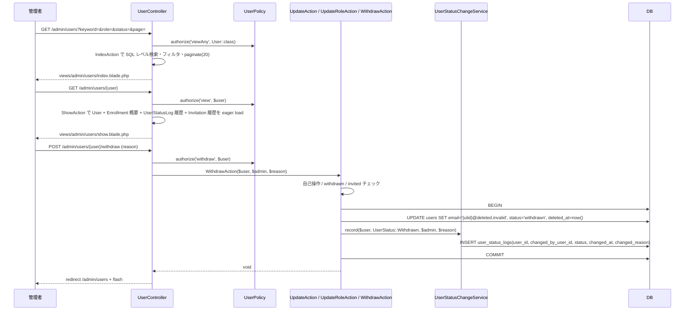
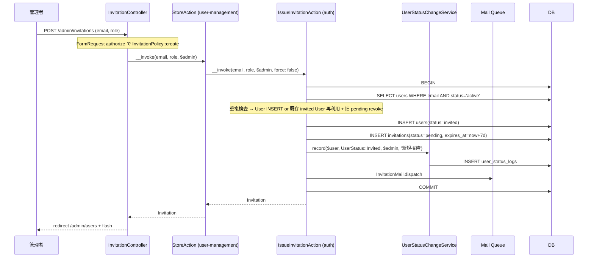
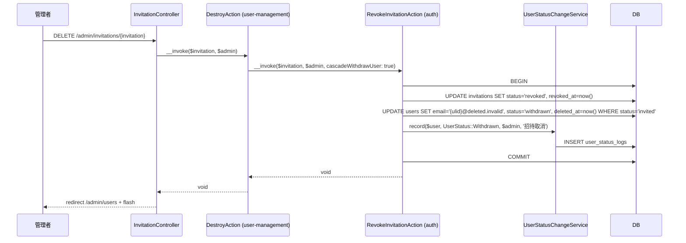
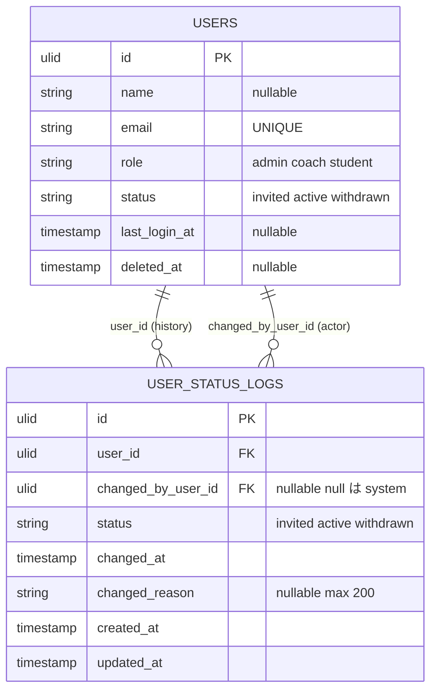
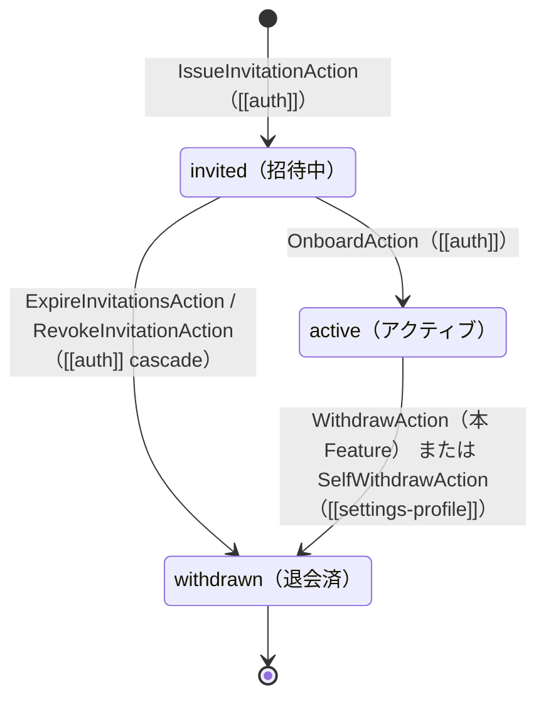

# user-management 設計

## アーキテクチャ概要

admin 専用のユーザー運用画面と、Feature 横断のステータス変更記録基盤を提供する。Clean Architecture（軽量版）に従い、Controller / FormRequest / Policy / UseCase（Action）/ Service / Eloquent Model を分離する。

### admin 操作の主フロー



### 招待発行フロー（auth 連携、Controller → ラッパー Action → auth Action）

`backend-usecases.md` の「1 Controller method = 1 Action クラス」規約に従い、`InvitationController` の各メソッドは **同名のラッパー Action** （`StoreAction` / `ResendAction` / `DestroyAction`）を `app/UseCases/Invitation/` に配置して呼ぶ。ラッパー内部で [[auth]] の `IssueInvitationAction` / `RevokeInvitationAction` を DI して呼び出す。

> Why: Controller method 名 = Action 名規約は Feature 横断の一貫性ルール。ラッパー Action は「user-management 文脈での admin actor 注入」「flash メッセージ用の戻り値整形」「将来の admin 専用追加責務（例: 監査メタ情報付与）」のフックポイントとしても機能する。



### 招待取消フロー（auth 連携、cascade withdraw）



## データモデル

### Eloquent モデル一覧

本 Feature が **新規追加** するのは `UserStatusLog` のみ。`User` / `Invitation` は [[auth]] で既に定義済みのため Read / Write 参照のみ行う。

- **`User`** — [[auth]] 既存。本 Feature では `name` / `email` / `bio` / `avatar_url` / `role` / `status` を UPDATE、`withdraw` フローで `deleted_at` + email リネームも行う。`statusLogs()` リレーション（`hasMany(UserStatusLog::class, 'user_id')`）と `statusChanges()`（`hasMany(UserStatusLog::class, 'changed_by_user_id')`、自分が変更者となったログ）を本 Feature で追加する。
- **`Invitation`** — [[auth]] 既存。本 Feature では User 詳細画面で履歴を Read-only 表示するためにのみ参照する。
- **`UserStatusLog`** — **新規**。`HasUlids`、SoftDeletes は採用しない（履歴は不可逆）。`belongsTo(User::class, 'user_id')` と `belongsTo(User::class, 'changed_by_user_id', 'changedBy')` の 2 リレーション。`changedBy` は `withTrashed()` を含めて解決する。

### ER 図



> `USERS` への 2 つの FK は Mermaid の制約で 2 行に分けて記述。実体は `user_status_logs` の 1 テーブル内の 2 カラム。

### 主要カラム + Enum

| Model | Enum | 値 | 日本語ラベル |
|---|---|---|---|
| `User.status` | `UserStatus`（[[auth]] 定義） | `Invited` / `Active` / `Withdrawn` | `招待中` / `アクティブ` / `退会済` |
| `User.role` | `UserRole`（[[auth]] 定義） | `Admin` / `Coach` / `Student` | `管理者` / `コーチ` / `受講生` |
| `UserStatusLog.status` | `UserStatus`（共用） | 同上 | 同上 |

### インデックス・制約（user_status_logs）

- `user_id`: 外部キー（`->constrained('users')`、デフォルト RESTRICT）。Certify は SoftDeletes 標準で物理削除を行わないため cascade 不要。
- `changed_by_user_id`: 外部キー（`->constrained('users')->nullable()`、デフォルト RESTRICT）。**NULL はシステム自動変更**（Schedule Command 等、actor User が存在しない遷移）を意味する。
- `(user_id)`: INDEX（User 詳細画面で履歴を時系列取得）。
- `(changed_by_user_id)`: INDEX（admin の操作監査で時系列取得する将来需要に備える）。
- `(changed_at)`: INDEX（log の時系列クエリ）。
- soft delete カラムは持たない（履歴は不可逆）。

## 状態遷移

`UserStatusLog` は履歴専用テーブルで状態を持たない（INSERT only / UPDATE 禁止）。記録される `status` の値は [[auth]] の `User.status` state diagram に従う。再掲:



> 各遷移時に呼び出し元 Action が `UserStatusChangeService::record(...)` を **同一トランザクション内** で呼ぶ責務を負う（NFR-user-management-001 / REQ-user-management-071）。

## コンポーネント

### Controller

ロール別 namespace は使わず（`structure.md` 規約）、ルートは `/admin/...` プレフィックスで `auth + role:admin` Middleware を適用する。

- **`UserController`** — admin 向け User 一覧 / 詳細 / プロフィール編集 / ロール変更 / 退会
  - `index(IndexRequest, IndexAction)` — 一覧 + 検索 + フィルタ + ページネーション
  - `show(User $user, ShowAction)` — 詳細（プロフィール / 受講中資格 / UserStatusLog 履歴 / Invitation 履歴）
  - `update(User $user, UpdateRequest, UpdateAction)` — プロフィール編集
  - `updateRole(User $user, UpdateRoleRequest, UpdateRoleAction)` — ロール変更
  - `withdraw(User $user, WithdrawRequest, WithdrawAction)` — 強制退会

- **`InvitationController`** — admin 向け招待操作（Action は user-management 配下の同名ラッパーを DI、ラッパーが内部で [[auth]] Action を呼ぶ）
  - `store(Invitation\StoreRequest, Invitation\StoreAction)` — 新規招待発行
  - `resend(User $user, Invitation\ResendRequest, Invitation\ResendAction)` — 再招待
  - `destroy(Invitation $invitation, Invitation\DestroyAction)` — 招待取消

> `backend-usecases.md` 規約「Controller メソッド名 = Action クラス名（PascalCase化）」に厳格準拠。ラッパー Action は内部で [[auth]] の `IssueInvitationAction` / `RevokeInvitationAction` を DI し、user-management 文脈での引数整形（admin actor 注入 / `force` フラグ固定 / `cascadeWithdrawUser` フラグ固定）を担う。

### Action（UseCase）

User 系は `app/UseCases/User/`、招待系は `app/UseCases/Invitation/` に配置。各 Action は単一トランザクション境界。すべて `__invoke()` を主とする。Controller メソッド名と Action クラス名は完全一致（`backend-usecases.md` 規約）。

#### `IndexAction`

```php
namespace App\UseCases\User;

class IndexAction
{
    public function __invoke(
        ?string $keyword,
        ?UserRole $role,
        ?UserStatus $status,
        int $perPage = 20,
    ): LengthAwarePaginator;
}
```

責務:
- (1) `User::query()` を起点に検索 / フィルタを SQL レベルで適用
- (2) `keyword` は `name` または `email` の部分一致（`where(fn ($q) => $q->where('name', 'LIKE', "%{$kw}%")->orWhere('email', 'LIKE', "%{$kw}%"))`）
- (3) `role` / `status` は完全一致 `where('role', $role)` / `where('status', $status)`
- (4) `status === Withdrawn` または `status === null` のうち、`Withdrawn` を明示選択した場合のみ `withTrashed()` を適用、それ以外は soft delete 除外
- (5) 並び順: `ORDER BY FIELD(status, 'active', 'invited', 'withdrawn'), created_at DESC`（MySQL の `FIELD()` で priority sort）
- (6) `paginate(20)` で返す

#### `ShowAction`

```php
class ShowAction
{
    public function __invoke(User $user): User;
}
```

責務:
- (1) `User` に `with(['enrollments.certification', 'statusLogs.changedBy' => fn ($q) => $q->withTrashed(), 'invitations'])` を eager load
- (2) `statusLogs` は `orderByDesc('changed_at')`、`invitations` は `orderByDesc('created_at')`、`enrollments` は `orderByDesc('created_at')->limit(10)`
- (3) Controller 側で `withTrashed()->findOrFail()` した `$user` を受け取る前提

#### `UpdateAction`

```php
class UpdateAction
{
    public function __invoke(User $user, array $validated): User
    {
        if ($user->status === UserStatus::Withdrawn) {
            throw new UserAlreadyWithdrawnException();
        }
        return DB::transaction(fn () => tap($user)->update($validated));
    }
}
```

責務:
- (1) `withdrawn` チェック
- (2) `name` / `email` / `bio` / `avatar_url` を UPDATE（`UserStatusLog` への記録なし）
- (3) email 重複は FormRequest 側で `unique:users,email,{$user->id}` ルールで担保

#### `UpdateRoleAction`

```php
class UpdateRoleAction
{
    public function __invoke(User $user, UserRole $newRole, User $admin): User
    {
        if ($user->is($admin)) {
            throw new SelfRoleChangeForbiddenException();
        }
        if ($user->status === UserStatus::Withdrawn) {
            throw new UserAlreadyWithdrawnException();
        }
        return DB::transaction(fn () => tap($user)->update(['role' => $newRole]));
    }
}
```

責務:
- (1) 自己ロール変更チェック
- (2) `withdrawn` チェック
- (3) `users.role` を UPDATE（`UserStatusLog` への記録なし、status 専用ログ）

#### `WithdrawAction`

```php
class WithdrawAction
{
    public function __construct(private UserStatusChangeService $statusChanger) {}

    public function __invoke(User $user, User $admin, string $reason): void
    {
        if ($user->is($admin)) {
            throw new SelfWithdrawForbiddenException();
        }
        if ($user->status === UserStatus::Withdrawn) {
            throw new UserAlreadyWithdrawnException();
        }
        if ($user->status === UserStatus::Invited) {
            throw new HttpException(422, '招待中ユーザーは「招待を取消」から削除してください。');
        }

        DB::transaction(function () use ($user, $admin, $reason) {
            $user->withdraw(); // [[auth]] 提供のヘルパ: email リネーム + status=withdrawn + soft delete
            $this->statusChanger->record($user, UserStatus::Withdrawn, $admin, $reason);
        });
    }
}
```

責務:
- (1) 自己退会 / 重複退会 / 招待中ガード
- (2) [[auth]] の `User::withdraw()` ヘルパ呼出（email リネーム + status 更新 + soft delete）+ `UserStatusChangeService::record` 呼出を **単一トランザクション**。[[auth]] / [[settings-profile]] の status 変更 Action と同じパターンで統一する

#### `Invitation\StoreAction`（招待発行のラッパー）

```php
namespace App\UseCases\Invitation;

use App\UseCases\Auth\IssueInvitationAction;

class StoreAction
{
    public function __construct(private IssueInvitationAction $issue) {}

    public function __invoke(string $email, UserRole $role, User $admin): Invitation
    {
        return ($this->issue)($email, $role, $admin, force: false);
    }
}
```

責務: `InvitationController::store` 用のラッパー。`force=false` を固定し、`admin` を `$invitedBy` として渡す。重複検査・User INSERT・Invitation INSERT・Mail dispatch・UserStatusLog 記録は [[auth]] `IssueInvitationAction` 側で完結。例外（`EmailAlreadyRegisteredException` / `PendingInvitationAlreadyExistsException`）は呼び出し元へそのまま伝播。

#### `Invitation\ResendAction`（再招待のラッパー）

```php
namespace App\UseCases\Invitation;

use App\UseCases\Auth\IssueInvitationAction;

class ResendAction
{
    public function __construct(private IssueInvitationAction $issue) {}

    public function __invoke(User $user, User $admin): Invitation
    {
        return ($this->issue)($user->email, $user->role, $admin, force: true);
    }
}
```

責務: `InvitationController::resend` 用のラッパー。対象 User の email / role を引き継いで `force=true` で [[auth]] `IssueInvitationAction` を呼ぶ。旧 pending Invitation は revoke、User は invited のまま、新 Invitation が同 user_id に紐付く（cascade なし、`UserStatusLog` 新規挿入なし）。

#### `Invitation\DestroyAction`（招待取消のラッパー）

```php
namespace App\UseCases\Invitation;

use App\UseCases\Auth\RevokeInvitationAction;

class DestroyAction
{
    public function __construct(private RevokeInvitationAction $revoke) {}

    public function __invoke(Invitation $invitation, User $admin): void
    {
        ($this->revoke)($invitation, $admin, cascadeWithdrawUser: true);
    }
}
```

責務: `InvitationController::destroy` 用のラッパー。`$admin`（呼出元から渡される）と `cascadeWithdrawUser=true` を [[auth]] `RevokeInvitationAction` に渡す。Invitation revoke + User cascade withdraw（status 更新 / email リネーム / soft delete）+ UserStatusLog 記録（changed_by_user_id=$admin / reason="招待取消"）が auth Action 側で完結。例外（`InvitationNotPendingException`）はそのまま伝播。

### Service

`app/Services/UserStatusChangeService.php`（`structure.md` のフラット配置）:

```php
namespace App\Services;

class UserStatusChangeService
{
    public function record(
        User $user,
        UserStatus $newStatus,
        ?User $changedBy,
        ?string $reason = null,
    ): UserStatusLog {
        return $user->statusLogs()->create([
            'changed_by_user_id' => $changedBy?->id,
            'status' => $newStatus,
            'changed_at' => now(),
            'changed_reason' => $reason,
        ]);
    }
}
```

責務: ステータス変更ログの INSERT のみ。
- 引数 `$newStatus` は呼び出し側が `User::update(['status' => ...])` した **後の値** を渡す責任を負う（REQ-user-management-072）
- `$changedBy === null` は Schedule Command 等のシステム自動変更を表す（[[auth]] の `ExpireInvitationsAction` 等）
- DB transaction は **呼び出し側で囲む**（NFR-user-management-005、Service 単体ではトランザクションを持たない）
- Notification の送信は行わない（呼び出し側 Action の責務）

### Policy

`app/Policies/UserPolicy.php`:

```php
class UserPolicy
{
    public function viewAny(User $auth): bool
    {
        return $auth->role === UserRole::Admin;
    }

    public function view(User $auth, User $target): bool
    {
        return $auth->role === UserRole::Admin;
    }

    public function update(User $auth, User $target): bool
    {
        return $auth->role === UserRole::Admin;
    }

    public function updateRole(User $auth, User $target): bool
    {
        return $auth->role === UserRole::Admin;
    }

    public function withdraw(User $auth, User $target): bool
    {
        return $auth->role === UserRole::Admin;
    }
}
```

> Policy は「ロール」観点のみで判定。自己操作禁止は **Action 内ドメイン例外** で表現する（REQ-user-management-081、`backend-policies.md` の「リソース固有認可は Policy で表現」原則と業務制約の分離）。

`InvitationPolicy` は [[auth]] 側で既に定義済み（`viewAny` / `create` / `revoke`）。本 Feature で追加・変更しない。

### FormRequest

`app/Http/Requests/User/` および `app/Http/Requests/Invitation/`:

| FormRequest | rules | authorize |
|---|---|---|
| `User\IndexRequest` | `keyword: nullable string max:100` / `role: nullable in:admin,coach,student` / `status: nullable in:invited,active,withdrawn` / `page: nullable integer min:1` | `$this->user()->can('viewAny', User::class)` |
| `User\UpdateRequest` | `name: required string max:50` / `email: required email max:255 unique:users,email,{user}` / `bio: nullable string max:1000` / `avatar_url: nullable url max:500` | `$this->user()->can('update', $this->route('user'))` |
| `User\UpdateRoleRequest` | `role: required in:admin,coach,student` | `$this->user()->can('updateRole', $this->route('user'))` |
| `User\WithdrawRequest` | `reason: required string max:200` | `$this->user()->can('withdraw', $this->route('user'))` |
| `Invitation\StoreRequest` | `email: required email max:255` / `role: required in:coach,student` | `$this->user()->can('create', Invitation::class)` |
| `Invitation\ResendRequest` | — | `$this->user()->can('create', Invitation::class)` |

### Route

`routes/web.php` に `auth + role:admin` Middleware の group で追加:

```php
Route::middleware(['auth', 'role:admin'])->prefix('admin')->group(function () {
    Route::get('users', [UserController::class, 'index'])->name('admin.users.index');
    Route::get('users/{user}', [UserController::class, 'show'])
        ->withTrashed()  // withdrawn User の詳細表示用
        ->name('admin.users.show');
    Route::patch('users/{user}', [UserController::class, 'update'])->name('admin.users.update');
    Route::patch('users/{user}/role', [UserController::class, 'updateRole'])->name('admin.users.updateRole');
    Route::post('users/{user}/withdraw', [UserController::class, 'withdraw'])->name('admin.users.withdraw');

    Route::post('invitations', [InvitationController::class, 'store'])->name('admin.invitations.store');
    Route::post('users/{user}/resend-invitation', [InvitationController::class, 'resend'])->name('admin.invitations.resend');
    Route::delete('invitations/{invitation}', [InvitationController::class, 'destroy'])->name('admin.invitations.destroy');
});
```

## Blade ビュー

`resources/views/admin/users/`:

| ファイル | 役割 |
|---|---|
| `admin/users/index.blade.php` | ユーザー一覧テーブル + 検索フォーム + ロール / ステータスフィルタ + ページネーション + 「+招待」ボタン（モーダル展開）|
| `admin/users/show.blade.php` | プロフィールカード / 操作ボタン群（編集 / ロール変更 / 退会 / 再招待 / 取消）/ 受講中資格カード / UserStatusLog タイムライン / Invitation 履歴 |
| `admin/users/_partials/profile-card.blade.php` | プロフィールカード（編集モーダルへの起点）|
| `admin/users/_partials/enrollments-section.blade.php` | 受講中資格概要 |
| `admin/users/_partials/status-log-timeline.blade.php` | UserStatusLog タイムライン（actor 名解決含む）|
| `admin/users/_partials/invitation-history.blade.php` | Invitation 履歴テーブル |
| `admin/users/_modals/invite-user-form.blade.php` | 「+招待」モーダル（email + role 入力）|
| `admin/users/_modals/edit-profile-form.blade.php` | プロフィール編集モーダル |
| `admin/users/_modals/change-role-form.blade.php` | ロール変更モーダル |
| `admin/users/_modals/withdraw-confirm.blade.php` | 退会確認モーダル（reason 入力）|
| `admin/users/_modals/cancel-invitation-confirm.blade.php` | 招待取消確認モーダル |

主要コンポーネント（Wave 0b で整備済み）:
- `<x-button>` / `<x-form.input>` / `<x-form.select>` / `<x-form.textarea>` / `<x-form.error>`
- `<x-modal>` / `<x-alert>` / `<x-card>` / `<x-badge>` / `<x-avatar>`
- `<x-paginator>` — Laravel paginator のラッパー

## エラーハンドリング

### 想定例外（`app/Exceptions/UserManagement/`）

- **`SelfRoleChangeForbiddenException`** — `AccessDeniedHttpException` 継承（HTTP 403）
  - メッセージ: 「自分自身のロールは変更できません。」
  - 発生: `UpdateRoleAction` で `$user->is($admin)` の場合
- **`SelfWithdrawForbiddenException`** — `AccessDeniedHttpException` 継承（HTTP 403）
  - メッセージ: 「自分自身を退会させることはできません。退会は [[settings-profile]] から行ってください。」
  - 発生: `WithdrawAction` で `$user->is($admin)` の場合
- **`UserAlreadyWithdrawnException`** — `ConflictHttpException` 継承（HTTP 409）
  - メッセージ: 「対象ユーザーは既に退会済みです。」
  - 発生: `UpdateAction` / `UpdateRoleAction` / `WithdrawAction` で `$user->status === UserStatus::Withdrawn` の場合

### [[auth]] から伝播する例外（本 Feature でハンドリング）

- `EmailAlreadyRegisteredException`（HTTP 409）: 招待発行時の email 重複（active User あり）。`InvitationController::store` がそのまま伝播 → 共通エラーハンドラで Flash メッセージ表示。
- `PendingInvitationAlreadyExistsException`（HTTP 409）: 招待発行時の重複 pending。`force=false` で発生するが、本 Feature の `store` は `force=false`、`resend` は `force=true` なので原則発生しない。万一発生時はそのまま伝播。
- `InvitationNotPendingException`（HTTP 409）: 取消対象が pending でない。`InvitationController::destroy` がそのまま伝播。
- `InvalidInvitationTokenException`（HTTP 410）: 本 Feature では発生しない（OnboardingController 専用）。

### 共通エラー表示

- ドメイン例外 → `app/Exceptions/Handler.php` で `HttpException` 系を catch し、`session()->flash('error', $e->getMessage())` + `back()` でリダイレクト + alert 表示
- FormRequest バリデーション失敗 → Laravel 標準の `back()->withErrors()` フロー、Blade 内で `@error` 表示

## 関連要件マッピング

| 要件ID | 実装ポイント |
|---|---|
| REQ-user-management-001 〜 008 | `routes/web.php`（`admin.users.index`）/ `UserController::index` / `Http\Requests\User\IndexRequest` / `UseCases\User\IndexAction`（`FIELD()` priority sort + 部分一致 LIKE + `withTrashed` 分岐） / `views/admin/users/index.blade.php` |
| REQ-user-management-010 〜 015 | `routes/web.php`（`admin.invitations.*`）/ `InvitationController::store` / `resend` / `destroy` / `UseCases\Invitation\StoreAction` / `ResendAction` / `DestroyAction`（各々が [[auth]] `IssueInvitationAction` / `RevokeInvitationAction` を内部で呼ぶラッパー）/ `Http\Requests\Invitation\StoreRequest` / `ResendRequest` / `views/admin/users/_modals/invite-user-form.blade.php` / `_modals/cancel-invitation-confirm.blade.php` |
| REQ-user-management-020 〜 024 | `UserController::show` / `UseCases\User\ShowAction`（eager load with `withTrashed` for changedBy）/ `views/admin/users/show.blade.php` + `_partials/*` / `routes/web.php` の `->withTrashed()` |
| REQ-user-management-030 〜 033 | `UserController::update` / `Http\Requests\User\UpdateRequest`（`unique:users,email,{user}` ルール）/ `UseCases\User\UpdateAction`（`UserAlreadyWithdrawnException` ガード）/ `views/admin/users/_modals/edit-profile-form.blade.php` |
| REQ-user-management-040 〜 043 | `UserController::updateRole` / `Http\Requests\User\UpdateRoleRequest` / `UseCases\User\UpdateRoleAction`（`SelfRoleChangeForbiddenException` + `UserAlreadyWithdrawnException` ガード）/ `views/admin/users/_modals/change-role-form.blade.php` |
| REQ-user-management-050 〜 054 | `UserController::withdraw` / `Http\Requests\User\WithdrawRequest` / `UseCases\User\WithdrawAction`（email リネーム + soft delete + UserStatusChangeService 呼出を単一トランザクション）/ `views/admin/users/_modals/withdraw-confirm.blade.php` |
| REQ-user-management-060 〜 062 | `database/migrations/{date}_create_user_status_logs_table.php` / `app/Models/UserStatusLog.php`（2 リレーション + `changedBy` の `withTrashed`）/ `database/factories/UserStatusLogFactory.php` |
| REQ-user-management-070 〜 073 | `app/Services/UserStatusChangeService.php`（`record()` メソッド）/ ビュー側の actor 名解決（`$log->changedBy?->name ?? 'システム'`）/ [[auth]] Action 側で本 Service を constructor injection |
| REQ-user-management-080 〜 083 | `routes/web.php`（`middleware(['auth', 'role:admin'])`）/ `app/Policies/UserPolicy.php`（5 メソッド admin 限定）/ FormRequest の `authorize()` で Policy 呼出 / [[auth]] の `InvitationPolicy` を再利用 |
| NFR-user-management-001 | 各 Action 内 `DB::transaction()` |
| NFR-user-management-002 | `IndexAction` 内 Eloquent クエリビルダ（`where` / `orderBy` / `paginate`）|
| NFR-user-management-003 | `IndexAction` の `LIKE %keyword%` ロジック |
| NFR-user-management-004 | `app/Exceptions/UserManagement/SelfRoleChangeForbiddenException.php` / `SelfWithdrawForbiddenException.php` / `UserAlreadyWithdrawnException.php` |
| NFR-user-management-005 | `UserStatusChangeService::record` は INSERT のみ、状態更新 / 通知送信なし |
| NFR-user-management-006 | `views/admin/users/*` 内で Wave 0b 共通コンポーネント参照 |
