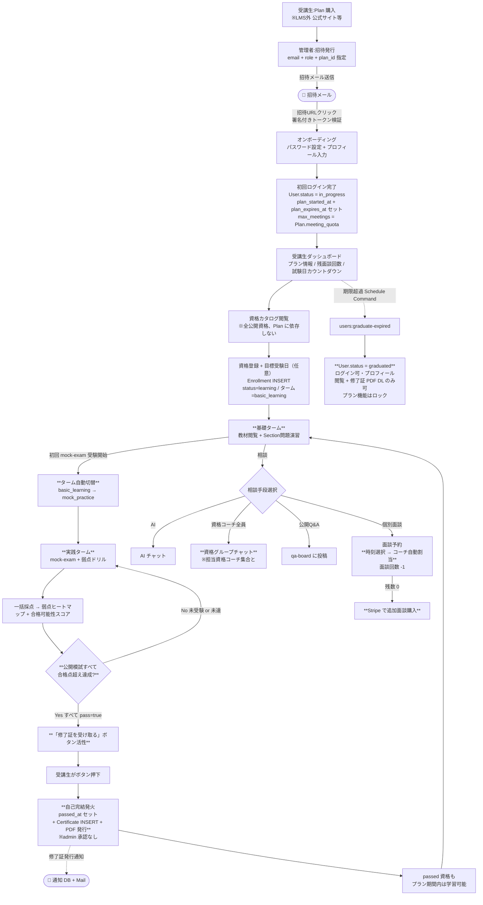
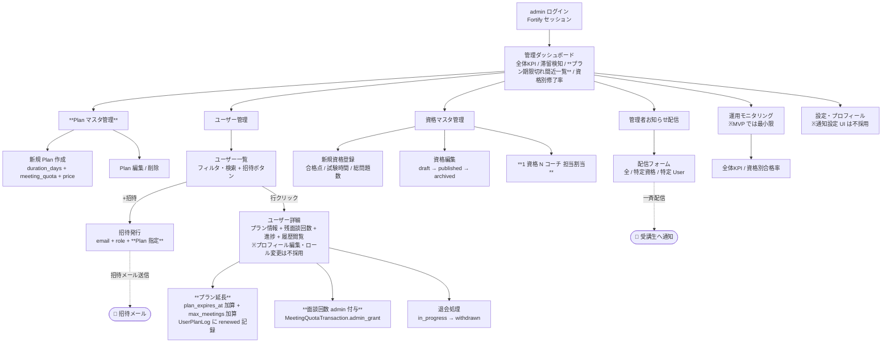
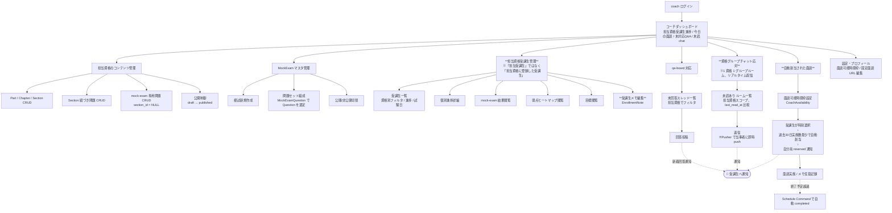
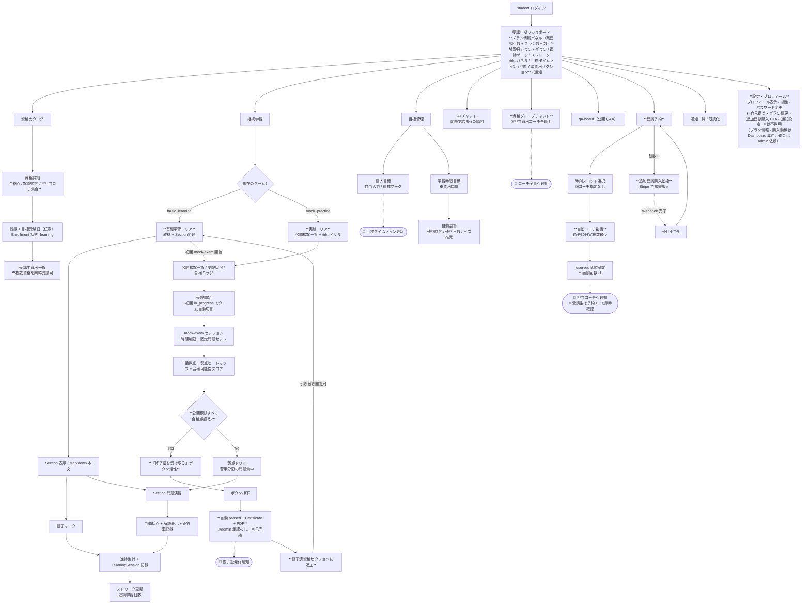
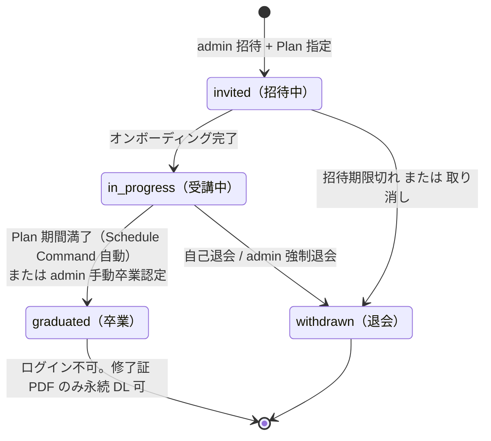
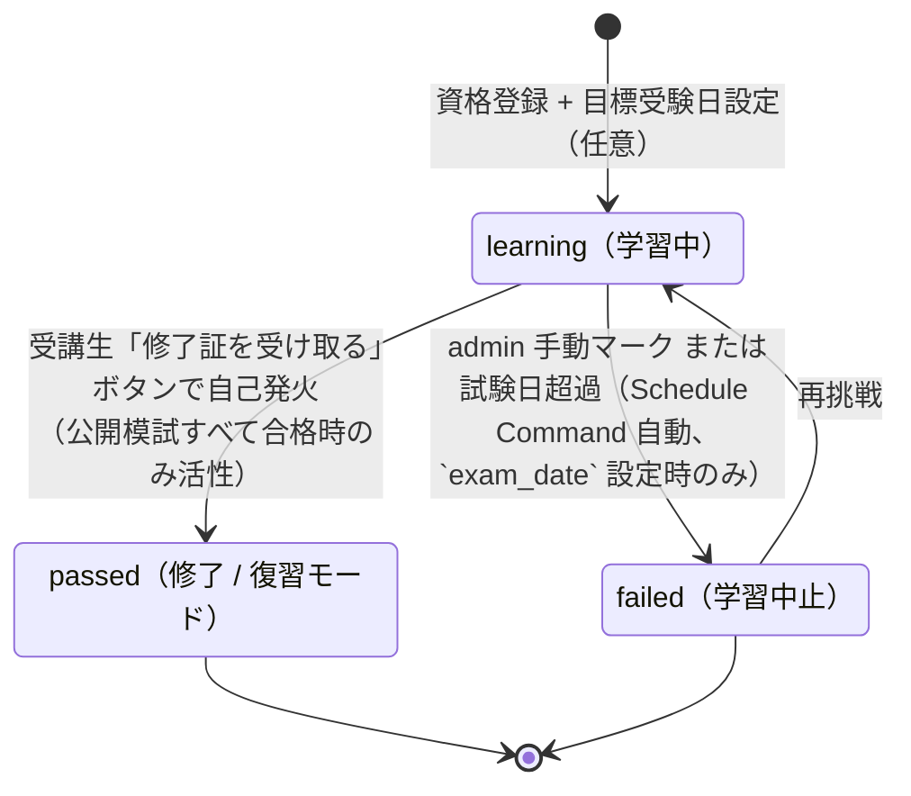
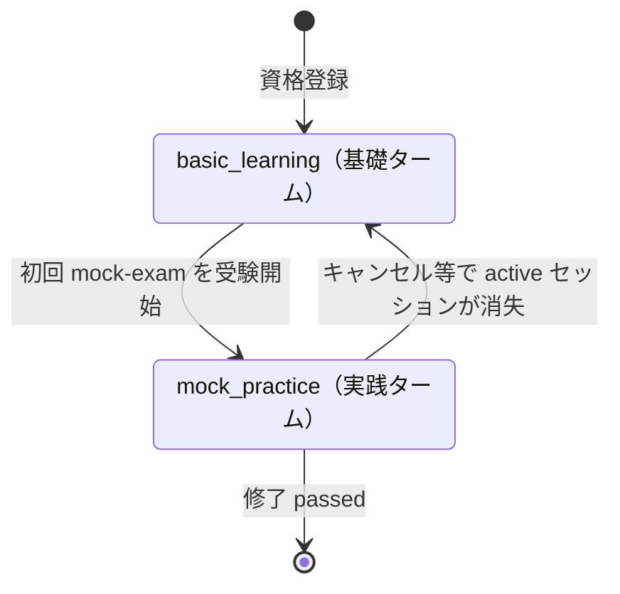
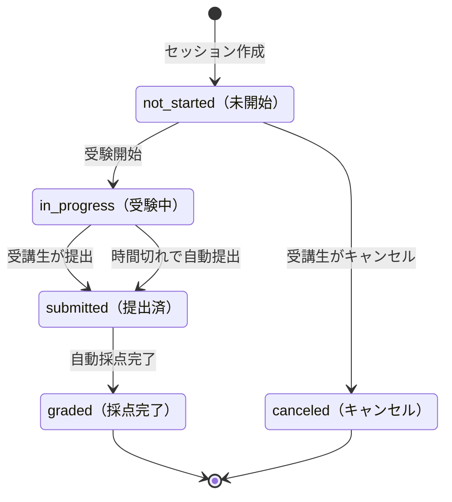
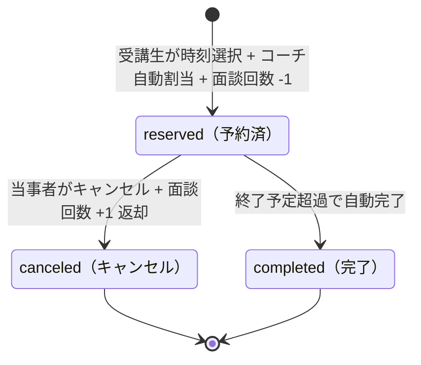

# Certify LMS — プロダクト定義

> マルチ資格対応・**プラン受講型** の資格取得LMS。プロダクト固有の定義（事業モデル・テーマ・ロール・UXフロー・Feature一覧）を集約する。
> **このドキュメントは構築側のみ参照**（受講生には渡らない）。受講生は提供PJコード + 要件シートで作業する。
> 技術スタック・規約は `tech.md`、ディレクトリ構成・命名規則は `structure.md` を参照。
> 各 Feature の詳細SDDは `../specs/{name}/` を参照（同じく構築側のみ）。

---

## 事業モデルと LMS の位置づけ

Certify LMS は **プラン受講型** の資格取得支援サービス。LMS は事業全体の一部であり、購入決済等は LMS 外で行われる。サービス全体の流れと LMS 内・外の責務境界を以下に整理する。

### サービス全体の流れ

```
[LMS 外]   受講生がプラン（Plan）購入 → 決済完了
              ↓
[admin]    LMS 内でユーザー招待（Plan 指定）
              ↓
[受講生]   招待 URL からオンボーディング → ログイン
              ↓
[プラン期間内] 全資格の教材閲覧・問題演習・模擬試験 + 担当資格コーチとの面談（回数消費）
              ↓
[プラン期間満了] 自動 graduated 遷移 → プラン機能（教材・問題・模試・面談・チャット）はロック / プロフィール閲覧 + 修了証 PDF DL は引き続き可
```

### Plan（プラン）の構造

| 要素 | 説明 | 例 |
|---|---|---|
| `duration_days` | プラン期間 | 30 / 90 / 180 日 |
| `meeting_quota` | 付帯面談回数 | 4 / 12 / 24 回 |

例: 「1 ヶ月プラン = 4 回」「3 ヶ月プラン = 12 回」「6 ヶ月プラン = 24 回」。`Plan` は admin が CRUD するマスタで、招待時に admin が select で指定する。**価格情報は LMS 内には持たない**（決済は LMS 外で完結、Plan の役割は招待時の `duration_days` + `meeting_quota` セット指定のみ）。一方、[[meeting-quota]] の `MeetingQuotaPlan` は LMS 内 Stripe 決済の SKU として `price` を保持する。

### LMS 内・外の責務境界

| LMS 外 | LMS 内 |
|---|---|
| 初回 Plan 購入決済 | admin によるユーザー招待 + Plan 指定 |
| 公式サイトの商品紹介 / 契約 | 全資格の学習体験（教材・問題・模試・面談・チャット・Q&A・AI 相談・修了証） |
| 契約解約画面 | 残面談回数表示 + Stripe による **追加面談回数** 購入のみ |

### 主要概念の使い分け（事業 × LMS）

| 概念 | 場所 | 意味 |
|---|---|---|
| **プラン期間** | `users.plan_expires_at` | Plan ベース、LMS 全体のサービス利用権 |
| **資格修了** | `enrollments.passed_at` | 個別資格レベル、受講生が「修了証を受け取る」ボタンで達成 |
| **目標受験日** | `enrollments.exam_date` | LMS 外の本試験日（任意、カウントダウン用） |
| **卒業** | `users.status = graduated` | プラン期間満了で自動遷移。ログインは可能だが、プラン機能（教材・問題・模試・面談・チャット・Q&A・AI 相談）は `EnsureActiveLearning` Middleware で全部ロック。プロフィール閲覧 + 修了証 PDF DL のみ許可 |

> ⚠️ 「**プラン期間満了（卒業）**」と「**資格修了**」は独立。プラン期間内に複数資格を修了できるし、修了せず期間が満了することもある。修了済資格の修了証 PDF は卒業後も永続 DL 可。

---

## 資格取得LMSのドメイン構造

本プロダクトは前述のプラン受講型事業基盤の上に成立する、一般教育LMSではなく「**資格取得**」に特化したLMSである。資格取得というドメインは以下4つの構造を持ち、これが Feature 設計とデータモデルの背骨になる。

| # | ドメイン構造 | 説明 | 主な反映先 |
|---|---|---|---|
| 1 | **目標受験日（試験日カウントダウン）** | 受講生はそれぞれ目標とする受験日を持つ。学習計画はそこから逆算される | `enrollments.exam_date` / dashboard カウントダウン |
| 2 | **合格点ゴール** | 「全範囲習得」ではなく「合格点超え」が目的。達成水準が外部仕様で明確 | `mock_exams.passing_score`(v3 で MockExam 側に移動、資格マスタからは撤回) |
| 3 | **問題演習中心の学習設計** | 教科書精読より「問題を解いて理解する」時間が長い。問題バンクの厚みと模擬試験（固定問題セット）が学習の中核 | `section_questions`(教材紐づき) + `mock_exam_questions`(模試独立リソース、v3 で分離、`difficulty` は撤回) |
| 4 | **苦手分野克服戦略** | 試験日まで有限時間。「弱点を潰す」戦略性が学習体験の核 | dashboard 分析パネル / mock-exam 結果ヒートマップ |

> ⚠️ この4構造が薄いと「ただのプラン学習サービス」になる。Feature 設計時は常にこの構造が表現されているかを点検する。

### ⚠️ 概念の混同を避けるべき2点

**1. 修了 vs 目標受験日（別概念）**

| 概念 | 場所 | 意味 | 反映 |
|---|---|---|---|
| **目標受験日** | LMS外 | 受講生が予定する本試験の日 | `enrollments.exam_date`、学習計画起点、カウントダウン |
| **修了（合格認定）** | LMS内 | LMS内で達成判定する学習修了 | mock-exam 合格点超え → 管理者承認 → `enrollments.passed_at` + 修了証発行 |

目標受験日より前に修了することも、修了せず受験日が来ることもある。両者は独立。

**2. 受講状態（バイナリ的） vs ターム（進行段階）**

学習プロセスの2軸:

- **受講状態 (`Enrollment.status`)**: `learning` / `paused` / `passed` / `failed` — 継続/休止/合格/不合格のバイナリ的状態
- **ターム (`Enrollment.current_term`)**: `basic_learning` / `mock_practice` — 学習進行段階（教習所の学科→技能のメタファー）
  - `basic_learning`（基礎ターム）: 教材閲覧 + Section紐づき問題演習
  - `mock_practice`（実践ターム）: mock-exam 中心 + 弱点ドリル
  - **切替トリガ**: **初回 mock-exam セッションを開始した時点で自動的に `mock_practice` へ遷移**（iField LMS の `start_project` RPC と同じ思想。事前条件・admin承認は不要、受講生主導）

**3. 3種類の「目標」用語の使い分け**

| 用語 | データ | 意味 | 主管 Feature |
|---|---|---|---|
| **目標受験日** | `Enrollments.exam_date` | 受講生が予定する本試験日（LMS外イベント）| enrollment |
| **個人目標** | `EnrollmentGoal` テーブル | 受講生が資格ごとに自由入力する自己設定ゴール（例: 「3月末までに過去問7割正答」）| enrollment |
| **学習時間目標** | `LearningHourTarget` テーブル | 資格単位の総学習時間ターゲット。`target_total_hours` のみ保存、残り時間・推奨ペースを自動逆算 | learning |

混乱を避けるため、本ドキュメント内では上記3種を必ず別の名前で呼ぶ。

**4. プラン期間満了（卒業） vs 資格修了（別概念）**

| 概念 | 場所 | 意味 | 反映 |
|---|---|---|---|
| **プラン期間満了（卒業）** | `users.status` / `users.plan_expires_at` | プラン機能利用権の終端 | Plan 期間満了で自動 `graduated` 遷移。ログイン可だが教材・問題・模試・面談などのプラン機能は利用不可、修了証 PDF DL とプロフィール閲覧のみ可 |
| **資格修了** | `enrollments.status` / `enrollments.passed_at` | 個別資格レベルの達成 | 公開模試すべて合格 → 受講生「修了証を受け取る」ボタンで自己発火、自動 `passed` 遷移 + Certificate PDF 発行 |

プラン期間内に複数資格を修了できるし、修了せず期間が満了することもある。両者は独立。卒業後も修了済資格の修了証 PDF は永続 DL 可。

### 個人目標（受講生の自己設定ゴール）

受講生が自分で立てた **個人目標** を Enrollment ごと（= 資格ごと）に記録し、ダッシュボードに **Wantedly 風タイムライン** で時系列表示。**資格に紐づく**ことで「基本情報の目標」「TOEICの目標」を分離して管理でき、コーチ/Admin が担当資格の受講生目標を見て介入判断できる。内容は受講生が自由に入力、コーチ・Admin は受講生詳細画面から閲覧のみ（介入はしない、必要なら chat で声かけ）。

```
enrollment_goals（受講生×資格 単位）
- id
- enrollment_id (FK)  ← 資格紐づき（どの資格に対する目標か明確）
- title         例: 「3月末までに過去問7割正答」「過去問の苦手分野を克服」
- description   任意、詳細メモ
- target_date   任意、期限
- achieved_at   NULL or 達成日時（受講生が「達成しました」ボタン）
- created_at / updated_at
```

> COACHTECH 流の「テンプレート + 個別コピー」方式は採用しない。**シンプルなCRUD + 達成マークのみ**。目標テンプレートのマスタも持たない（資格に紐づくが、内容は完全に受講生個別）。
> 資格非紐づきの総合目標（複数資格をまたぐ生活習慣等）は本機能のスコープ外（個人手帳で管理する範囲）。

## テーマ

マルチ資格対応の **プラン受講型** 資格取得 LMS（**Certify LMS**）。受講生は admin から指定された Plan に基づきプラン期間内に複数資格を同時学習でき、コーチが資格試験向けの教材と問題を作成し、管理者がプラットフォーム全体を運営する。

例題資格: 基本情報技術者、応用情報技術者、TOEIC など。受講生はプラン期間内であれば、登録した資格すべての教材閲覧・問題演習・模擬試験を制限なく利用できる。

## プロダクトのロール

| ロール | DB値 | 主な業務 | 権限スコープ |
|---|---|---|---|
| 管理者 | `admin` | プラットフォーム全体運営 / Plan マスタ CRUD / ユーザー招待（Plan 指定）/ プラン延長 / 資格マスタ CRUD / 統計分析 | **全資格 / 全ユーザー** に対する全操作（教材CRUD・受講生CRUD・コーチCRUD・ロール変更・Plan 管理含む）|
| コーチ | `coach` | 担当資格の教材・問題作成 / 面談対応 / 担当資格の受講生フォロー | **担当資格のみ** 教材・問題CRUD / **担当資格の受講生** に対する進捗閲覧・面談対応・チャット応対。他資格は閲覧不可 |
| 受講生 | `student` | 教材学習 / 問題演習 / 面談予約 / AI 相談 / コーチへの質問 / 修了証受領 | **自分が登録した資格のみ** 教材閲覧・問題演習 / **自分のデータのみ** プロフィール編集 / 自分が登録した資格の担当コーチ集合とのみグループチャット |

**運用モデル（実務LMSに準拠）**:
- ユーザー新規登録は **管理者からの招待制 + Plan 指定**。自己サインアップは存在しない。admin は招待時に Plan（`duration_days` + `meeting_quota` + `price` のセット）を指定する
- コーチの担当資格は **管理者が割当**（`certification_coach_assignments` 中間テーブル）。**1 コーチが複数資格・1 資格が複数コーチ** の双方を許容
- **受講生と担当コーチは直接紐づかない**: 受講生は登録資格に紐づく担当コーチ集合（複数）とやり取りする
  - **資格チャット** = **1 資格 1 グループルーム**（受講生 1 名 + 担当資格コーチ全員）
  - **面談予約** = 受講生は時刻スロットだけ選択 → 過去 30 日の実施数が少ないコーチを自動割当
  - `Enrollment.assigned_coach_id` は **持たない**（担当変更操作は不要、`certification_coach_assignments` の追加削除で自動的に反映）
- **面談回数は受講生に紐づく**（資格には紐づかない）: Plan 起点で初期付与（`users.max_meetings`）+ Stripe で追加購入可。複数資格を同じ回数プールから消費する。残数 0 で予約不可
- **プラン期間の管理**: `users.plan_expires_at` で期限を管理、満了で自動 `graduated` 遷移。admin は「プラン延長」操作で期限を加算可能（同 Plan の `duration_days` 加算 + `max_meetings` 加算）

---

## 主要UXフロー

事業モデル（プラン受講型 + Plan 起点）に沿った 4 ロールのフローを描く。実線が主動線、点線が通知連動。

### 1. 受講生ジャーニー全体（招待 → プラン修了 → 卒業）

公式サイト等での初回 Plan 購入から admin 招待 → プラン期間内学習 → 修了証受領 → プラン満了で卒業に至る俯瞰フロー。基礎 → 実践ターム自動切替は維持。修了は受講生「修了証を受け取る」ボタンで自己発火（admin 承認なし、Progate 流）。



> 補足: `passed_at`（LMS 内達成）と本試験受験（LMS 外 `exam_date`）は **独立**。`graduated` 後でも修了証 PDF は永続 DL 可。プラン延長を希望する受講生は admin に依頼し、admin が `ExtendCourseAction` を呼ぶ（`plan_expires_at` + `max_meetings` を加算、Schedule Command による graduated 遷移を未然に防ぐ）。

### 2. 管理者（admin）動線

プラットフォーム全体の運営。**Plan マスタ管理 + ユーザー招待（Plan 指定）+ プラン延長 + 資格マスタ管理 + 統計** が主任務。修了認定承認は撤回（自己完結化）、面談承認も撤回（自動割当）。



### 3. コーチ（coach）動線

担当資格のコンテンツ整備（教材 + 問題 + mock-exam マスタ組成）と、**担当資格に登録した受講生集合** のフォロー（資格グループチャット応対 + 自動割当された面談実施 + Q&A 回答 + 弱点把握 + 受講生メモ記録）が主任務。「担当受講生」概念はなく、資格に紐づく動線。



### 4. 受講生（student）学習サイクル詳細

ログイン後の学習導線。**プラン情報パネル / 残面談回数 / 修了済資格セクション** が「プラン受講モデル」固有の主役。基礎 → 実践ターム自動切替は維持。修了は自己完結（「修了証を受け取る」ボタン）、`passed` 後も復習モードで継続学習可。



---

## ステータス遷移

実務LMSで状態管理が重要な6つのエンティティ。`specs/{name}/design.md` で詳細を展開する際の前提。各状態に日本語ラベルを併記。

### A. User（プラン受講状態）

4 値構成。**`in_progress`（受講中）** は COACHTECH LMS の `IN_PROGRESS` を踏襲（旧 `active` よりプラン受講モデルの意味が明確）。**`graduated`（卒業）** は Plan 期間満了で Schedule Command が自動遷移させる。卒業後もログインは可能（プロフィール閲覧 + 修了証 PDF DL のみ）、プラン機能は `EnsureActiveLearning` Middleware でロック。`suspended`（休学）は採用しない（複数資格同時受講可モデルでは、休止したい受講生は単に学習を止めればよい）。



> `graduated` 遷移後もログインは可能だが、各プラン機能（教材閲覧 / 問題演習 / 模試 / 面談予約 / チャット / Q&A / AI 相談）は `EnsureActiveLearning` Middleware で利用不可。修了証 PDF DL とプロフィール閲覧のみ許可される。プラン延長を admin が行う場合は `in_progress` のうちに `plan_expires_at` を加算する `ExtendCourseAction` を呼ぶ（自動 graduated 遷移を未然に防ぐ）。

### B. Enrollment.status（資格×受講生 の受講状態）

3 値構成。`paused`（休止中）は採用しない（複数資格同時受講可モデルでは、休止したい受講生は他資格に集中すればよく、明示的な休止状態を持つ必要がない）。`passed`（修了）後もプラン期間内は教材・問題・模試の閲覧・演習・受験を引き続き許可する（status による機能制限なし、`User.status = in_progress` + Plan 期間内であれば学習可）。`failed` は `label()` で「学習中止」表記とし、「諦め」と「不合格」を同一概念として扱う。



> Note: `passed` 遷移は (1) 当該資格の公開模試すべてに合格点超えセッションがあり、かつ (2) 受講生本人が「修了証を受け取る」ボタンを押すことで起こる（admin 承認は不要、自己完結）。`passed` 後もプラン期間内は学習・演習・模試の許容判定対象（`status IN (learning, passed)` で統一）。プラン期間が満了したら User.status が `graduated` に遷移して各プラン機能はロック、`Enrollment.status` は最後の値のまま凍結（過去履歴として保持）。

### C. Enrollment.current_term（学習進行ターム）

教習所メタファー: 学科（基礎）→ 実技（実践）。受講状態とは別軸。**切替は受講生の初回 mock-exam 開始で自動**（iField LMS の `start_project` RPC と同じ思想、admin承認不要）。**キャンセル時はターム判定が再計算される**（active な MockExamSession が残っているか否かで basic_learning に戻る可能性あり）。



> **ターム判定ロジック**: `current_term = EXISTS(MockExamSession WHERE enrollment_id=X AND status IN ('in_progress','submitted','graded')) ? 'mock_practice' : 'basic_learning'`
> MockExamSession の作成/状態変化/削除のたびに再計算。`canceled` セッションは判定に含めない。

### D. Mock-exam Session（模擬試験セッション）

`canceled` は **`not_started` からのみ** 可能（受験開始前に「やっぱりやめる」を許容）。すでに `in_progress` 以降のセッションはキャンセル不可（提出 or 時間切れまで進む）。



### E. Meeting（面談）

3 値構成（COACHTECH LMS 流）。「申請 → 承認」のフローは撤回し、**受講生が時刻スロットを選んだ瞬間にコーチを自動割当 + 即時 `reserved` 確定**。完了遷移は Schedule Command の時刻ベース自動（`scheduled_at + 60 分 < now()` で `reserved → completed`）で、コーチの明示的な「完了」操作は不要。LMS 内に「面談中」状態は持たず、外部ツール（Google Meet 等）での実施に委ねる。



> **コーチ自動割当**: 過去 30 日の面談実施数が少ないコーチを優先（`CoachMeetingLoadService`）。
> **面談回数の出入り**: `reserved` 遷移時に `MeetingQuotaTransaction.consumed`（-1）、`canceled` 時に `refunded`（+1）。
> **自動完了**: Schedule Command `meetings:auto-complete` が日次で `scheduled_at + 60min < now()` の `reserved` を `completed` に遷移。
> **面談メモ**: `reserved` でも `completed` でもコーチが任意のタイミングで記録可。「未実施だが時間経過で completed」と「実施済 completed」の区別は LMS 内では持たず、面談メモの有無で運用上判断する（COACHTECH 流のドライ運用）。`canceled` への遷移は `scheduled_at < now()` 以降は不可（過去面談のキャンセル禁止）。

### F. ChatRoom（資格 × 受講生 × 担当資格コーチ全員 のグループルーム）

**1 資格 = 1 グループルーム** 構成（`Enrollment` 1 つあたり 1 ChatRoom、受講生 1 名 + 担当資格コーチ全員、`ChatMember` 中間テーブルで参加者管理）。**ステータス機能は持たない**（旧「未対応 → 対応中 → 解決済」の遷移管理は撤回、ChatRoom は単純なメッセージコンテナ）。代わりに **Pusher Broadcasting によるリアルタイム配信** で新着メッセージを当事者に即時 push、**未読バッジ** は `ChatMember.last_read_at` で各メンバー単位に管理する。

> ChatRoom は状態を持たないシンプルな設計。コーチが「未読あり」ルームをドリルダウンするには `ChatMember.last_read_at < ChatMessage.created_at` の存在を集計（バッジ機構を再利用）。担当コーチの増減（`certification_coach_assignments` 変更）は `ChatMember` の追加・削除で自動反映される。新たに担当に加わったコーチは過去ログを閲覧可、担当を外れたコーチは閲覧不可。

---

## Feature一覧

各 Feature の詳細仕様は `../specs/{name}/{requirements,design,tasks}.md` を参照。

**提供状態の凡例**:
- `既存実装` — 提供時点で動作。受講生のチケットは **バグ修正** が中心
- `既存実装+Basic拡張` — 動作する既存実装あり + Basic範囲の **新規機能・拡張** がチケット
- `未実装(Bladeのみ)` — UIだけ提供、ロジック・API・JS は **受講生が実装**
- `Advance` — Advance範囲。Basic側は触らず、純粋追加（SPA・リアルタイム・OAuth・Queue 等）

| # | Feature | 主ロール | 主モデル | 概要 | 提供状態 | Advance連携 |
|---|---|---|---|---|---|---|
| 1 | **auth** | 全 | `User`, `Invitation` | 招待URL発行（**有効期限 7日**、`signed:7d` 署名付きトークン、Schedule Command で期限切れ自動失効）→ 招待メール送信 → トークン検証 → オンボーディング（初回パスワード設定 + プロフィール、**role=coach の場合は `meeting_url` も必須入力**）→ Fortify ログイン / ログアウト / パスワードリセット。Role(`admin`/`coach`/`student`) + `EnsureUserRole` Middleware + **`EnsureActiveLearning` Middleware**（`graduated` ユーザーがプラン機能にアクセスしようとした際にロック、プロフィール / 修了証 DL は許可）| 既存実装 | — |
| 2 | **user-management** | admin | `User`, `UserStatusLog` | コーチ・受講生の招待発行・再招待（招待時に `plan_id` 指定）、ユーザー一覧（フィルタ・検索 + 招待動線）→ **詳細画面で退会処理 + プラン延長 + 面談回数手動付与 + プラン情報・進捗・履歴閲覧**（プロフィール編集・ロール変更は撤回、admin が他者のプロフィール / ロールを変更する動線は持たない）。**受講状態管理**（`invited`/`in_progress`/`graduated`/`withdrawn` 遷移と履歴ログ）| 既存実装 | — |
| 3 | **certification-management** | admin / student | `Certification`, `CertificationCategory`, `CertificationCoachAssignment`, `Certificate`（`user_id` / `enrollment_id` / `certification_id` / `issued_at` / `pdf_path` / `serial_no`）| 資格マスタCRUD（**`name` / `category_id` / `difficulty` / `description` の 4 カラム構成**、`code`/`slug`/`passing_score`/`total_questions`/`exam_duration_minutes` は不採用、合格点は `MockExam.passing_score` で資格内の模試ごとに設定、試験時間は LMS スコープ外）+ 公開状態（draft/published/archived）+ **1 資格 N コーチ 担当割当**（`certification_coach_assignments`）+ **受講生向け資格カタログ閲覧**（カタログ一覧・詳細画面、公開ステータスでフィルタ、受講中の資格は別タブで区別表示）+ **修了証発行**（Certificate ログ + Blade 達成画面 + **PDF出力**（`barryvdh/laravel-dompdf` で同期生成、`storage/app/private/certificates/{ulid}.pdf` に保存、受講生がダウンロード可能、テンプレートは Blade で定義）） | 既存実装 | — |
| 4 | **content-management** | coach | `Part`, `Chapter`, `Section`, `Question`, `QuestionOption`, `QuestionCategory`, `SectionImage` | 担当資格の Part / Chapter / Section / 問題 CRUD。Section は Markdown 本文（`league/commonmark` で HTML 変換、`` `<a>` `<code>` 等を許容）、問題は選択肢・正答・解説 + **出題分野（`QuestionCategory` マスタから選択、資格ごとに独立、業界標準寄せ）+ 難易度**。**`Question.section_id` は nullable**（Section紐づき問題 or mock-exam専用問題のどちらも作成可）。公開制御 + 順序入替 + **教材内画像アップロード**（コーチが教材作成時に画像をアップロード → Storage public driver に保存 → Markdown 内に `` 形式で参照、許容拡張子 `.png` / `.jpg` / `.webp`、最大 2MB/枚、`SectionImage` で管理）+ **教材全文検索**（受講生向け、`Section.title` / `Section.body` の部分一致検索）+ **問題カテゴリマスタ管理**（`QuestionCategory`、admin / 担当 coach が資格ごとに CRUD、表記ゆれ防止）| 既存実装 | — |
| 5 | **enrollment** | student / admin / coach | `Enrollment`, `EnrollmentGoal`, `EnrollmentStatusLog`, `EnrollmentNote` | 受講生 × 資格 多対多（**1 受講生が複数資格を同時受講可** — Certify LMS 独自の優位性）。**`exam_date`（目標受験日 / LMS外、任意）** + **`passed_at`（修了達成日 / LMS内）** + **受講状態**（`learning`/`passed`/`failed`、`EnrollmentStatusLog` で履歴管理）+ **`current_term`（`basic_learning`/`mock_practice`、初回mock-exam開始で自動切替）** + **個人目標**（受講生が資格ごとに自由入力する自己設定ゴール、`EnrollmentGoal`、コーチ/Admin閲覧のみ）+ **コーチ用受講生メモ**（`EnrollmentNote`、コーチが担当資格×受講生について書く自由ノート、面談以外の日々の観察記録、coach と admin のみ閲覧/編集可、受講生は閲覧不可）+ **修了の自己完結**（受講生が公開模試すべて合格達成で「修了証を受け取る」ボタン押下 → `ReceiveCertificateAction` 内で即時 `passed_at` セット + Certificate INSERT + PDF 発行 + EnrollmentStatusLog 記録、admin 承認フローなし）。`assigned_coach_id` は **持たない**（担当コーチは `certification_coach_assignments` で資格 × N コーチ N:M で表現）。受講生の自己登録、管理者の一括割当・解除 | 既存実装 | — |
| 6 | **learning** | student | `SectionProgress`, `LearningSession`, `LearningHourTarget` | Section 読了マーク + 教材閲覧 + **進捗自動集計**（Section→Chapter→Part→資格 完了率%）+ **学習時間トラッキング**（セッション開始/終了の自動記録、教材別集計）+ **学習時間目標**（資格単位、`target_total_hours` のみ保存 / 期間は `Enrollment.created_at` 〜 `Enrollment.exam_date` で代用 / 残り時間・残り日数・日次推奨ペースを自動逆算）+ **学習ストリーク**（連続学習日数の集計）+ 継続学習導線。**滞留検知ロジックは不採用**（運用モニタリング MVP 外、`StagnationDetectionService` 不要） | 既存実装 | — |
| 7 | **quiz-answering** | student | `SectionQuestionAnswer`, `SectionQuestionAttempt` | Section 紐づき問題の演習・解答送信・**自動採点**・解答履歴・解説表示・正答率記録 + **苦手分野ドリル**（カテゴリ別フィルタによる集中演習、mock-exam の `WeaknessAnalysisService` で抽出した苦手 SectionQuestion を出題）。**FE は Blade + Form POST + Redirect の純 Laravel 標準パターン**(2026-05-16 確定、JS / Sanctum SPA / 公開 JSON API は本 Feature では持たない、出題 → 解答送信 → 結果画面 → 次の問題リンクの PRG パターン) | 既存実装 | — |
| 8 | **mock-exam** | student / coach / admin | `MockExam`, `MockExamQuestion`, `MockExamSession`, `MockExamAnswer` | **本番形式の模擬試験**（資格LMS中核）: コーチが資格ごとに **MockExam マスタを複数作成** + **`MockExamQuestion` 中間テーブルで問題セットを事前固定** + `order` / `is_published` 設定。受講生は公開模試をいつでも・何度でも受験 → 時間制限 + 一括採点 + 採点後の **分野別正答率ヒートマップ** + **合格可能性スコア**（直近 3 回の平均得点率を `passing_score` の 90%以上 / 70-90% / 70%未満 で3バンド分け、3回未満は受験回数全体で算出）。実践ターム中の主役。**中断・再開対応**: `MockExamSession.status = in_progress` の間、各問題への解答は `MockExamAnswer` に **逐次保存**（送信ボタン不要、選択時に自動 PATCH）。ブラウザを閉じても再アクセス時に「進行中セッションあり」のバナーから **残り時間カウントダウン継続のまま再開可能**（サーバ時刻基準で残り時間を計算、クライアントタイマー改ざん不可）。**修了判定**: 公開模試すべてに合格点超え達成で修了申請可 → admin 承認。コーチは担当受講生の結果閲覧可 | 未実装(Bladeのみ) | — |
| 9 | **mentoring** | student / coach | `Meeting`, `MeetingMemo`, `CoachAvailability` | **資格単位の面談予約**（**受講生は時刻スロットだけ選択 → `CoachMeetingLoadService` が過去 30 日の実施数が少ないコーチを自動割当**、即時 `reserved` 確定、申請・承認・拒否フローなし）→ 当日通知 → 終了予定時刻超過で Schedule Command `meetings:auto-complete` が日次 `reserved → completed` 自動遷移 → コーチが MeetingMemo を任意のタイミングで記録 → 履歴閲覧。**Meeting.status 3 値**（`reserved` / `canceled` / `completed`、COACHTECH LMS 流）。**面談回数消費**: `reserved` 遷移で [[meeting-quota]] の `MeetingQuotaTransaction` `consumed` 挿入（-1）、キャンセルで `refunded`（+1）。受講生 0 残数時は予約ボタン不活性 + 追加購入 CTA。同時刻に複数コーチ空き時の負荷分散ロジック + 二重予約 DB 制約 | 未実装(Bladeのみ) | **Advance FE**（Google Calendar OAuth で空き枠取得・予約反映）|
| 10 | **chat** | student / coach | `ChatRoom`, `ChatMessage`, `ChatAttachment`, `ChatMember` | **資格単位の 1 グループルーム** = 1 Enrollment あたり 1 ChatRoom（受講生 1 名 + 担当資格コーチ全員、`ChatMember` 中間テーブルで参加者管理）。**ステータス機能なし**（旧「未対応 / 対応中 / 解決済」は撤回、ChatRoom は単純なメッセージコンテナ）。**Pusher Broadcasting によるリアルタイム配信**（新着メッセージを当事者に即時 push、chat 画面を開いている間も自動で追記）+ **未読バッジ** は `ChatMember.last_read_at` で個人別管理（自分の `last_read_at` 以降のメッセージ数をカウント）。メッセージの編集 / 削除は不可（学習相談の改竄防止 + admin 監査の信頼性）。最大長 2000 文字。**添付ファイル**（メッセージごとに画像 PNG/JPG/WebP / PDF を最大 3 ファイル × 5MB、**Storage private driver** に保存、`AttachmentController` 経由で配信し Policy で当事者のみ閲覧可、URL は `signed URL` 短期有効、`ChatAttachment` で管理）。担当コーチ増減は `certification_coach_assignments` 変更で `ChatMember` 自動同期。メッセージ作成時に [[notification]] へ通知発火 | 未実装(Bladeのみ) | リアルタイム Pusher 連携は本 Feature に含めるため Advance 連携項目なし |
| 11 | **qa-board** | student / coach | `QaThread`, `QaReply` | **公開Q&A掲示板**: 受講生による技術質問投稿 → コーチ/他受講生による回答 → 解決マーク。資格別フィルタ / 解決済み・未解決の絞り込み + **全文検索**（`QaThread.title` / `QaThread.body` / `QaReply.body` の部分一致検索）。chat (1on1) と異なり **公開・集合知型**、孤独感解消と他受講生からの学習促進。**添付ファイルは扱わない**（テキストのみ、公開掲示板で画像配信は管理コスト高）| 未実装(Bladeのみ) | — |
| 12 | **analytics-export** | admin / coach | （独自モデルなし、`ApiKeyMiddleware` のみ）| **管理運用向けデータエクスポート API**: `X-API-KEY` ヘッダ + `.env` の共通 API キー（`ANALYTICS_API_KEY`）で保護された読み取り専用 API。`GET /api/v1/admin/users` / `GET /api/v1/admin/enrollments` / `GET /api/v1/admin/mock-exam-sessions` の 3 本を提供。BE は **素データのみ**（軽い JSON Resource 整形 + フィルタクエリ + ページネーション + Eager Loading のみ、Action / Service / Policy / Sanctum なしのシンプル構成）。admin 視点で全件返却し、coach 別フィルタ等は GAS 側で実装。受講生は GAS（Google Apps Script）で API を叩いて Google Sheets に流し込み、Sheet 関数 / ピボット / 条件付き書式で「分析」を実装（BE = 素データ提供、加工・集計 = Sheet 側責務）。**読み取り専用**（書き込みは各 Feature 自前 API の流儀、quiz-answering の `/api/v1/quiz/...` と同じ）。PR では Sheet URL + 採点者シェア（必須）+ Sheet スクショ + GAS コード提出が動作確認必須 | 未実装 | **チケット選定時に Basic / Advance 配置を決定**（spec 自体は完成形を記述、配置は要件シート定義時に確定）|
| 13 | **notification** | student / coach | `Notification`（Laravel標準）+ `AdminAnnouncement` | Laravel Notification（**Database + Mail channel** 両方固定配信、ユーザー設定 UI なし）: ①**面談予約完了 → 担当コーチ宛のみ**（自動割当結果、受講生名 + 日時、受講生宛は予約 UI で即時確認のため通知不要）/ ②**修了証発行 → 受講生宛**（「修了証を受け取る」ボタン押下時の自己発火、Certificate PDF DL リンク含む）/ ③mock-exam 採点完了 → 受講生宛 / ④管理者お知らせ配信（admin → 全/特定資格/特定User への手動一斉 INSERT、`admin_announcements` テーブル）/ ⑤Q&A 自分質問への回答受信 → 受講生宛 / ⑥**新着 chat メッセージ**（コーチ → 受講生 + 受講生 → コーチ全員、Database + Mail）/ ⑦面談リマインド（前日 18 時 + 1 時間前、Schedule Command）。**滞留検知通知 / プラン期限間近通知は採用しない**（MVP スコープ外）。受講生は通知一覧画面 `/notifications` で時系列閲覧 + 既読化、TopBar 通知ベル + サイドバーバッジで未読件数把握 | 既存実装+Basic拡張 | **Advance Broadcasting**（Pusher + WebSocket で TopBar 通知ベルへリアルタイム push、全通知種別を含む。chat メッセージもリアルタイム配信される）|
| 14 | **dashboard** | 全 | （集計のみ、独自モデル少）| ロール別ダッシュボード:<br>・admin: 全体 KPI / 資格別合格率（運用モニタリングは MVP 最小限）<br>・coach: 担当資格受講生進捗 / 今日の面談 / 未対応Q&A / 未読チャット / **担当資格受講生の弱点ヒートマップ** / **受講生メモ閲覧・編集**（EnrollmentNote 一覧）<br>・student: 学習進捗ゲージ / **試験日カウントダウン** / **学習ストリーク** / **弱点分析パネル** / **学習時間目標ゲージ** / **目標タイムライン** / **修了済資格セクション**（受け取った修了証一覧 + PDF DL リンク）/ **プラン情報パネル**（残面談回数 / プラン残日数 / **追加面談購入 CTA** で `MeetingQuotaPlan` から選択 → Stripe checkout に遷移）/ 通知 / 面談予定 / 継続学習導線 | 既存実装 | パフォーマンス最適化（Advance: N+1 / インデックス / キャッシュ題材）|
| 15 | **ai-chat** | student | `AiChatConversation`, `AiChatMessage` | Gemini API 連携の学習相談チャット（**問題で詰まった瞬間の補助線**）。会話履歴保存 + プロンプト管理 | 未実装(Bladeのみ) | Advance全体（受講生がBE実装・UX拡張）|
| 16 | **settings-profile** | 全 | `User`（bio/avatar_url 拡張）, `CoachAvailability`（mentoringと共有）| **自分を管理する画面**（user-management = admin が他者を管理 と責務分離）。プロフィール表示・編集（名前 / メール / 自己紹介 / アイコン）+ パスワード変更 + **コーチのみ:面談可能時間枠設定 + 面談 URL 編集**（CoachAvailability + `users.meeting_url`）。**以下は提供しない**: ①自己退会動線（退会は admin に依頼するオペレーション、LMS 内に動線なし）/ ②プラン情報表示・追加面談購入 CTA（[[dashboard]] のプラン情報パネルに集約）/ ③通知設定 UI（[[notification]] は全通知 DB+Mail 固定送信） | 既存実装 | — |
| 17 | **plan-management** | admin | `Plan`, `UserPlanLog` | **プラン受講モデルの中核**: Plan マスタ（`duration_days` + `meeting_quota` のセット、例: 1 ヶ月 4 回 / 3 ヶ月 12 回 / 6 ヶ月 24 回）の admin CRUD + 受講生への Plan 紐づけ管理（`users.plan_id` / `plan_started_at` / `plan_expires_at` / `max_meetings`）+ **プラン延長 Action**（`ExtendCourseAction` で `plan_expires_at` 加算 + `max_meetings` 加算 + `UserPlanLog` 記録、admin の手動「プラン延長」ボタンから呼ぶ）+ Schedule Command `users:graduate-expired` による `users.status = graduated` 自動遷移（`plan_expires_at < now()` の `in_progress` ユーザーを日次で判定）+ プラン履歴（`UserPlanLog`、INSERT only、event_type は `assigned`（招待時）/ `renewed`（延長時）/ `canceled` / `expired`）+ `PlanExpirationService` で期限切れ判定 + dashboard / settings-profile に閲覧 API 提供。受講生視点では自分のプラン情報を [[settings-profile]] / [[dashboard]] で閲覧のみ。**価格情報は LMS 内では持たない**（決済は LMS 外で完結、Plan は admin 招待時の `duration_days` + `meeting_quota` セット指定用のマスタ） | 未実装 | — |
| 18 | **meeting-quota** | student / admin | `MeetingQuotaPlan`, `MeetingQuotaTransaction`, `Payment` | **面談回数の付与・消費・追加購入**: `users.max_meetings`（初期付与、Plan 起点）+ **`MeetingQuotaPlan` マスタ**（admin が CRUD する追加面談購入用の価格セット、複数 SKU 例: `1 回 ¥3,000` / `5 回パック ¥12,000` / `10 回パック ¥22,000`、`name + meeting_count + price + sort_order + status`、**LMS 内 Stripe 決済の SKU 情報として `price` を保持**）+ `MeetingQuotaTransaction`（INSERT only の監査ログ方式、iField LMS 流、type `granted_initial` / `purchased` / `consumed` / `refunded` / `admin_grant`、`reference_id` で `Meeting` や `Payment` を参照、`amount` は signed int で消費は -1）+ 残数集計 `MeetingQuotaService::remaining(User): int`（`User.max_meetings + SUM(transactions.amount)`）+ [[mentoring]] との連携（`reserved` 遷移で `consumed`、キャンセルで `refunded`）+ **Stripe 連携**（受講生が `MeetingQuotaPlan` の SKU を選択 → Checkout Session 作成 → 受講生ブラウザで決済 → Webhook 受信 → `Payment` レコード INSERT + `purchased` トランザクション挿入、その SKU の `meeting_count` 分を加算）+ **admin 手動付与 UI**（admin が受講生詳細画面から任意の回数を `admin_grant` トランザクションで直接付与、`granted_by` 記録）。受講生 UI は [[dashboard]] のプラン情報パネルから購入動線へ遷移 | 未実装 | — |

---

## 集計責務マトリクス

横断的な集計関心事の責務分担。各集計ロジックは **計算 Service の所有 Feature** に一意に配置し、複数 Feature から再利用する。dashboard Feature は **読み取り専用** で結果を集約表示し、独自の集計ロジックは持たない。

| 集計関心事 | 計算 Service | 所有 Feature | 主な利用先 |
|---|---|---|---|
| 進捗（Section→Chapter→Part→資格 完了率）| `ProgressService` | learning | learning + dashboard |
| 学習ストリーク（連続学習日数）| `StreakService` | learning | dashboard |
| 学習時間目標の残時間・推奨ペース | `LearningHourTargetService` | learning | dashboard |
| 弱点ヒートマップ（分野別正答率）| `WeaknessAnalysisService` | mock-exam | mock-exam（結果画面）+ dashboard + quiz-answering（苦手ドリルの問題抽出）|
| 合格可能性スコア | `WeaknessAnalysisService` | mock-exam | mock-exam + dashboard |
| 修了判定（公開模試すべて合格）| `CompletionEligibilityService` | enrollment | enrollment（修了申請ボタンの活性判定）+ dashboard |
| ターム判定（basic_learning / mock_practice）| `TermJudgementService` | enrollment | enrollment（MockExamSession 状態変化時に再計算）|
| 受講進捗 KPI（admin 用）| `EnrollmentStatsService` | enrollment | dashboard |
| コーチ稼働状況（admin 用）| `CoachActivityService` | mentoring | （dashboard 表示なし、必要時に user-management 等の個別管理画面で参照、v3 で dashboard から撤回） |
| 未読 chat 件数（ルーム別 / 自分宛 / `last_read_at` 比較）| `ChatUnreadCountService` | chat | chat（一覧バッジ）+ dashboard（coach: 未読 chat 件数）+ `SidebarBadgeComposer`（サイドバー `chat-rooms` メニューの badge）|
| 残面談回数集計（`max_meetings + SUM(amount)`） | `MeetingQuotaService` | meeting-quota | mentoring（予約時の残数判定 + 予約ボタン活性制御）+ dashboard（受講生: プラン情報パネル） |
| プラン期限切れ判定 + 卒業自動遷移 | `PlanExpirationService` | plan-management | Schedule Command `users:graduate-expired`（日次起動）+ dashboard（受講生: プラン残日数表示） |
| コーチ面談負荷（過去 30 日実施数） | `CoachMeetingLoadService` | mentoring | mentoring（自動割当時のコーチ選出ロジック、同時刻空きコーチが複数いる時の優先順位算出） |

> Service は構造的には `app/Services/{Feature}/{Service}.php` 配下に置いてもよいが、Certify LMS は `app/Services/{Service}.php` フラット配置を採用（`tech.md` 参照）。**所有 Feature** は責務マトリクス管理のための論理概念。

---

## スコープ外（明示）

教育PJスコープを引き締めるため、以下は **意図的に Certify LMS に含めない**。受講生に「ここまでがスコープ」と明示する境界線。

| 機能 | 理由 |
|---|---|
| 全文検索エンジン（Elasticsearch / Algolia 等）| `LIKE` / `MATCH AGAINST` で十分。検索インフラの学習は別領域。教材検索・Q&A検索は MySQL の部分一致で実装 |
| qa-board の画像 / ファイル添付 | テキストのみ（chat とは異なる方針）。公開掲示板で画像配信は管理コスト・モデレーション負荷が高い |
| chat / 教材以外のファイル添付（ZIP / 動画ファイル / Office 形式等）| chat は画像 + PDF のみ、教材は画像のみ。他のメディア種別は扱わない |
| 動画教材 | Section は Markdown 本文 + 画像のみ。動画埋め込み・ストリーミングは将来拡張領域 |
| 自己サインアップ | 管理者からの招待制（実務LMS準拠）|
| SNS連携 / SSO | Fortify ローカル認証 + [[analytics-export]] の API キー方式のみ（Sanctum SPA / 自前 FE SPA は LMS 全体で不採用、2026-05-16 確定）|
| 多言語化 | UI は日本語のみ |
| 決済機能 | 入会申込・支払いは LMS外（公式サイト等）|
| 動画通話（mentoring）| 面談は時間枠予約と当日通知まで。実際の通話 / 録画機能はスコープ外（外部ツール想定）|
| バッジ / リーダーボード / ランク / 称号 | 両参考LMS（COACHTECH / iField）とも実装なし。学習動機付けは試験日カウントダウン + 進捗ゲージ + ストリーク + 個人目標タイムラインで対応 |
| **進捗節目達成通知**（Section / Chapter / Part 完了 / 資格 50% 等のお祝い通知）| ゲーミフィケーション系として上記「バッジ / リーダーボード」と同一カテゴリ。ストリーク + 進捗ゲージ + 個人目標タイムライン（[[dashboard]] + [[learning]] + [[enrollment]] が提供）で代替し、[[notification]] では扱わない。受講生は dashboard で進捗を能動的に確認するモデル |
| **通知種別 × channel の ON/OFF 設定 UI**（Slack / Discord 流の細かい通知カスタマイズ）| [[notification]] は受講生宛 7 種類すべてを Database + Mail 両方固定送信する設計。「メール通知が多すぎる」等の不満は通知種別自体を絞ることで予防（Phase 0 の議論で受講生メリットと実装複雑度のバランス点として確定）。[[settings-profile]] にも通知設定タブは置かない |
| **admin / coach 宛通知**（未回答 Q&A 等のメール通知。**chat 新着はコーチ宛 Database + Mail を採用するため例外、`MeetingReservedNotification` もコーチ宛のみ採用するため例外**）| [[dashboard]] が「未対応 chat / 未回答 Q&A / 今日の面談」をロール別に集約表示するため、メール通知まで送るのは原則として二重管理。修了申請承認 / 面談予約申請 / 滞留検知 のフロー自体が v3 で撤回されたため通知対象にもならない。admin / coach は dashboard で能動的に運用情報を確認するモデル |
| **面談予約申請 / 拒否 / キャンセル通知**（受講生・コーチ間の状態変化通知）| dashboard の面談一覧 + 通知一覧の代替で十分。能動的に確認可能なため、通知過剰を避ける |
| **滞留検知 / 学習途絶リマインド通知** | MVP スコープ外。`StagnationDetectionService` 自体を持たない、受講生・admin・coach いずれにも滞留関連の表示・通知を提供しない |
| 2FA / IP制限 / 詳細セッション管理 / ログイン履歴 | 教育PJスコープ外。Fortify 標準セッション + パスワードリセットのみ |
| iCal export / カレンダー同期（標準形式）| Advance の Google Calendar OAuth 連携で代替（mentoring の空き枠取得・予約反映）|
| 学習データの一括エクスポート / インポート（CSV / JSON）| 管理運用領域、教育PJスコープ外。素データ取得は [[analytics-export]] の API キー認証 + GAS で代替可 |
| OAuth プロバイダ機能 / 第三者向け OAuth Authorization Code Flow / 個人 API トークン管理 UI | [[analytics-export]] は **共通 API キー 1 つ**（`.env` 管理）のみ。**Sanctum Personal Access Token / Sanctum SPA 認証 / OAuth プロバイダ / 個人トークン管理 UI / `HasApiTokens` trait は LMS 全体で不採用**（2026-05-16 確定、当初 [[quiz-answering]] で Sanctum SPA を検討したが撤回） |
| [[analytics-export]] での書き込み系 API（POST / PUT / DELETE）| [[analytics-export]] は **読み取り（GET）専用**。データ更新は各 Feature の Web Controller(`POST /quiz/...` 等の Web セッション + CSRF) で行う（公開 JSON API は本 LMS では提供しない、2026-05-16 確定）|
| 追加ロール（リーダー / メンター / TA / 保護者 等）| admin / coach / student の3ロールのみ。これ以上のロール階層は実務LMSとしても珍しく、スコープ外 |
| chat メッセージ全文検索 / ピン留め / リアクション | 未対応。チャットは短期的な相談用途、長期参照は qa-board / 面談メモへ誘導 |
| 解答時の自信度・解答時間記録 | 両参考LMSとも未実装。正答率記録 + 弱点ヒートマップで代替 |
| お気に入り / ブックマーク（教材・問題）| 両参考LMSとも未実装。受講中の Enrollment 自体がブックマーク的に機能 |
| サービス利用権の永続化（修了でログイン不可にならない設計） | Plan 期間ベースの利用権管理が事業要件。永続型を採用すると課金モデルが成立しない |
| 「全資格修了で自動卒業」モデル | 受講生は自分のペースで複数資格を学習する想定で、「全資格修了」の定義が曖昧（admin が随時新資格を追加できる）+ 卒業契機は Plan 期間満了で十分。`graduated` 遷移は `plan_expires_at` 一元判定 |
| Stripe 決済の admin 管理ダッシュボード（売上 / 返金 / サブスクリプション管理）| 決済の運用は Stripe ダッシュボード本体で完結。LMS 側は [[meeting-quota]] の `Payment` レコードを参照するのみ |
| Plan の途中変更 / 乗換時の按分精算 | admin は「プラン延長」操作のみ提供（同 Plan の `duration_days` / `max_meetings` 加算）、別 Plan への乗換時の差額計算はスコープ外。乗換が必要なら現契約を満了させて新規招待で対応する想定 |
| 1 受講生が複数 Plan を同時保有 | `users.plan_id` は 1 つだけ。Plan 期間中の追加プラン購入は不可、プラン延長か新規招待を経由 |
| 自己プラン購入動線（LMS 内での初回購入）| LMS 内では追加面談回数の購入のみ（[[meeting-quota]] が Stripe 連携）。初回プラン購入は LMS 外（公式サイト）で完結、admin が招待時に Plan を指定する運用 |
| 招待時に学習対象資格を限定する仕組み | 受講生は登録資格カタログから自由に Enrollment 可。admin が「この受講生はこの資格しか学べない」と制限する仕組みは持たない（資格ごとに `Enrollment` を作るだけ、Plan は資格に紐づかない） |
| 休止（Enrollment.paused / User.suspended）| 複数資格同時受講可モデルで「他資格に集中」で代替可能、Plan 期間が一律に進む前提では明示的な休止状態は不要 |
| 修了申請承認フロー（admin による承認）| 受講生「修了証を受け取る」ボタンで自己完結。本資格の試験合格ではなく LMS 内プラン修了の認定なので、重厚な admin 承認は不要（Progate 流） |

---

## 補足: SectionQuestion と MockExamQuestion の責務分担

Certify LMS の問題演習機能は **データ的にも UX 的にも完全に独立した 2 系統**。日常の練習（Section 紐づき問題）と節目のリハーサル（模試）を明確に役割分担する。テーブル設計上も **C 案: Section 問題は独立、模試問題は模試マスタの子リソース** を採用。

| 観点 | SectionQuestion（[[quiz-answering]] が演習機能を所有）| MockExamQuestion（[[mock-exam]] が所有）|
|---|---|---|
| **テーブル** | `section_questions` 独立リソース | `mock_exam_questions` 模試マスタの子リソース |
| **親エンティティ** | `Section`（教材階層、`section_id` NOT NULL）| `MockExam`（模試マスタ、`mock_exam_id` NOT NULL）|
| **選択肢テーブル** | `section_question_options`（子）| `mock_exam_question_options`（子）|
| **単位** | 1 問単位 | セッション = N 問（例: 80 問）|
| **出題** | Section に紐づく問題が固定で出題 | `MockExam` 配下の `MockExamQuestion` を `order` 順で出題 |
| **時間** | 制限なし、いつでも中断 OK | 制限あり（`MockExam.duration_minutes` を反映）、本番形式 |
| **採点** | 1 問ごと即時、解説即表示 | 一括採点後にヒートマップ・スコア |
| **解答記録** | `SectionQuestionAnswer`（[[quiz-answering]]）| `MockExamAnswer`（[[mock-exam]]）|
| **Question 単位サマリ** | `SectionQuestionAttempt`（[[quiz-answering]]）| なし（セッション単位の集計） |
| **目的** | 理解度確認、知識定着 | 本試験リハーサル、合否予測 |
| **結果出力** | 正答率記録のみ | 分野別正答率ヒートマップ + 合格可能性スコア |
| **タイミング** | 基礎ターム中の日常活動 | 初回受験で実践タームへ自動切替 / 節目のチェック |
| **再受験** | いつでも、何度でも | いつでも、何度でも（同じ問題が出る = 定着確認可能）|
| **修了との関係** | 修了判定には直接関与しない | 公開模試すべての合格点超え = 修了証受け取りボタン活性 |

### データモデル（C 案: 完全分離 + 模試問題は模試マスタの子）

```
SectionQuestion（Section 紐づき問題、教材の理解確認用）
├ id ULID
├ section_id (FK, NOT NULL)               ← nullable 撤回、必ず Section に紐づく
├ category_id (FK to question_categories) ← 共有マスタを参照
├ body / explanation / status / order
├ SoftDeletes + timestamps
└ SectionQuestionOption（子、選択肢）
   ├ id / section_question_id (FK) / body / is_correct / order

MockExam（模試マスタ、資格に紐づく）
├ id ULID
├ certification_id (FK)
├ title / description / passing_score / duration_minutes / order / is_published
├ created_by_user_id / updated_by_user_id
├ SoftDeletes + timestamps
└ MockExamQuestion（模試問題、模試マスタの子リソース） ★ 中間テーブルではなく独自リソース
   ├ id ULID
   ├ mock_exam_id (FK, NOT NULL)
   ├ category_id (FK to question_categories) ← 共有マスタを参照
   ├ body / explanation / order
   ├ SoftDeletes + timestamps
   └ MockExamQuestionOption（子、選択肢） ★ 新設
      ├ id / mock_exam_question_id (FK) / body / is_correct / order

QuestionCategory（共有カテゴリマスタ、資格ごとに独立）
├ id / certification_id (FK)
├ name / slug / sort_order / description
├ (certification_id, slug) UNIQUE
└ SectionQuestion / MockExamQuestion 両方から参照される（"データベース" カテゴリで両系統の正答率を測れる）

MockExamSession（受験セッション、不変履歴）
├ id / mock_exam_id / enrollment_id / user_id
├ status / generated_question_ids (JSON、MockExamQuestion.id のスナップショット配列)
├ total_questions / passing_score_snapshot / time_limit_minutes_snapshot
├ started_at / submitted_at / graded_at / canceled_at
└ total_correct / score_percentage / pass

MockExamAnswer（受験中の解答ログ）
├ id / mock_exam_session_id (FK) / mock_exam_question_id (FK)
├ selected_option_id (FK to mock_exam_question_options、nullOnDelete)
├ selected_option_body（スナップショット、Option 物理削除時の保険）
├ is_correct（採点時に確定）
└ answered_at
```

### 設計上のポイント

| ポイント | 説明 |
|---|---|
| **完全分離** | `SectionQuestion` と `MockExamQuestion` は別テーブル。同じ問題を両方で使い回せない（必要なら別途登録）。当初の `Question.section_id nullable` 設計は撤回 |
| **子リソース化** | `MockExamQuestion` は中間テーブル（旧設計）ではなく、`MockExam` の子として独立リソースで持つ。模試マスタ削除時に cascade、模試問題の追加・削除は模試詳細画面から |
| **共有カテゴリ** | `QuestionCategory` は両系統から参照（同じ「データベース」カテゴリで Section 問題の正答率と模試の正答率を統合的に分析可能、[[quiz-answering]] の苦手分野ドリルが模試の弱点と連動できる）|
| **`difficulty` 不採用** | 両系統のテーブルから削除。学習評価は「合格点超え + カテゴリ別正答率」で十分、難易度別の評価軸は持たない（コーチの作問負荷も軽減）|
| **不変履歴** | Question / Option を SoftDelete しても、過去の Answer / Attempt / MockExamAnswer は `selected_option_body` スナップショット + `withTrashed()` で履歴閲覧可能 |
| **問題管理 UI の分離** | Section 問題は **教材階層画面（content-management）** の Section 配下から CRUD、模試問題は **模試マスタ詳細画面（mock-exam）** から CRUD。コーチは画面が分かれているため混同しない |
| **弱点ドリルの仕組み** | 模試で検出された弱点カテゴリ（`WeaknessAnalysisService::getWeakCategories`）に対し、**SectionQuestion を出題**して 1 問単位の即時採点で集中演習。`QuestionCategory` が両系統共有マスタなので、模試で弱かった `category_id` で SectionQuestion を引ける。模試専用問題自体の復習は模試再受験で代替（時間制限ありの本番リハーサル） |

### 採点フロー（端的説明）

```
[1. 解答送信]
受講生が選択肢を選び送信
  ↓
MockExamAnswer に INSERT
├ mock_exam_question_id: どの問題への解答か
├ selected_option_id:    選択した MockExamQuestionOption の ID
├ selected_option_body:  Option 本文スナップショット（履歴保持用）
└ is_correct: NULL（まだ採点していない）

[2. 提出時 SubmitAction が走る（同期採点）]
for each MockExamAnswer in session:
    selected_option = MockExamQuestionOption::find(selected_option_id)
    answer.is_correct = selected_option.is_correct  ← Option 自体が正解情報を保持
    answer.save()

[3. セッション集計]
total_correct  = COUNT(MockExamAnswer WHERE session_id = X AND is_correct = true)
score_pct      = total_correct / total_questions * 100
pass           = score_pct >= passing_score_snapshot

[4. 分野別ヒートマップ]
SELECT category_id, COUNT(*) AS total, SUM(is_correct) AS correct
FROM mock_exam_answers
JOIN mock_exam_questions ON ...
WHERE session_id = X
GROUP BY category_id
```

つまり「**選択肢テーブル `MockExamQuestionOption` 自体が正解情報を持つ**」設計で、受講生の選んだ Option の `is_correct` で正誤を判定する。SectionQuestion 側も同じ仕組み（`SectionQuestionOption.is_correct` で判定、ただし即時採点）。

### mock-exam の主要ロジック（実装の見当）

| ロジック | 概要 | 複雑度 |
|---|---|---|
| 出題 | `MockExam.mockExamQuestions()->orderBy('order')` を `generated_question_ids` に展開 | 低 |
| 採点 | 上記採点フローを `DB::transaction` 内で `SubmitAction` が実行 | 低 |
| pass 判定 | `total_correct / total_questions * 100 >= passing_score_snapshot` | 低 |
| 分野別ヒートマップ | `MockExamAnswer JOIN MockExamQuestion GROUP BY category_id` の 1 クエリ | 低 |
| 合格可能性スコア | **直近 3 回**（受験回数 3 未満なら受験回数全体）の平均得点率を `passing_score` の 90% 以上 / 70-90% / 70% 未満 で 3 バンド分け | 低 |
| 修了判定 | `COUNT(mock_exams WHERE is_published)` と `COUNT(DISTINCT mock_exam_id FROM mock_exam_sessions WHERE pass=true)` の一致確認 | 低 |

すべて Eloquent + groupBy + aggregate で実装可能。N+1 / インデックス / キャッシュ最適化は dashboard と合わせて Advance 領域での題材として活用可。
