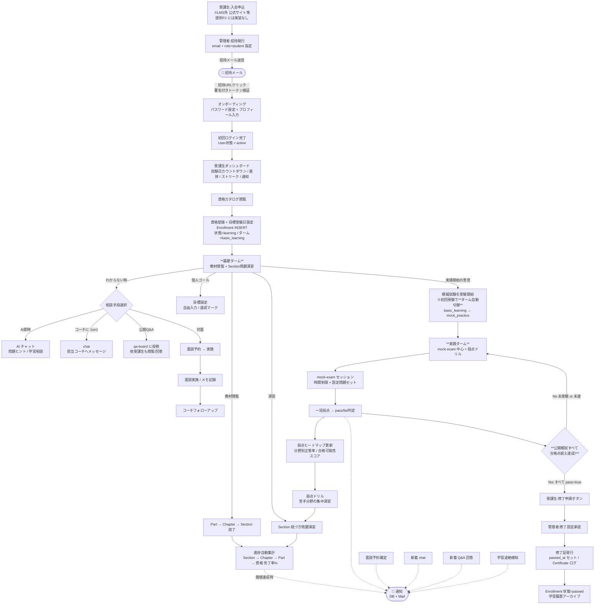
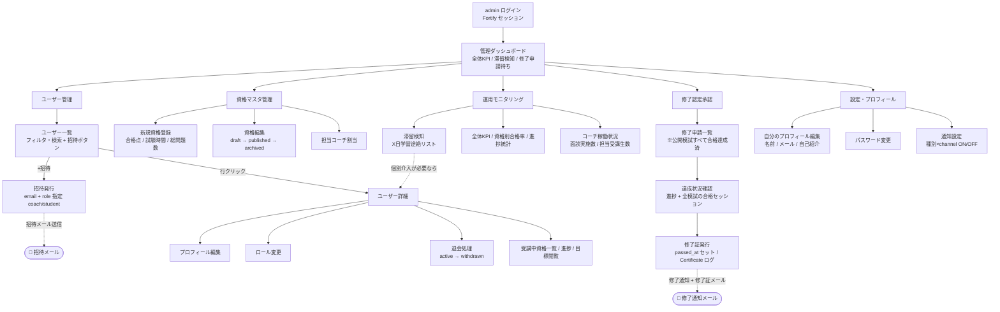
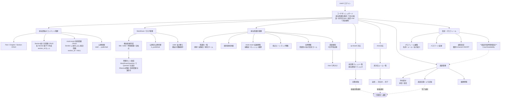
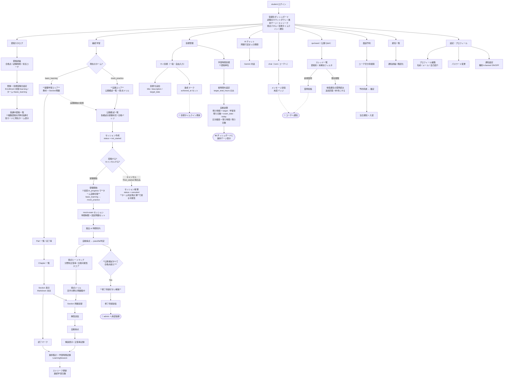
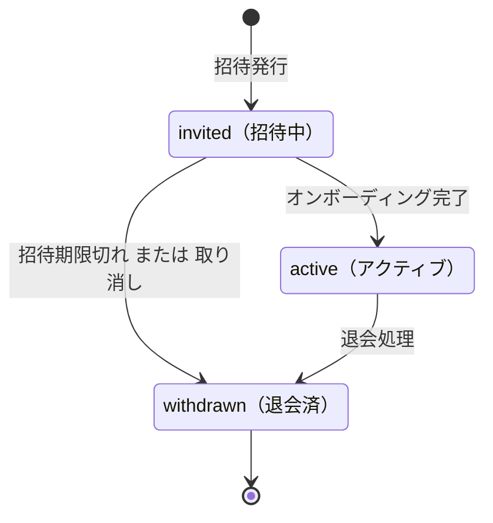
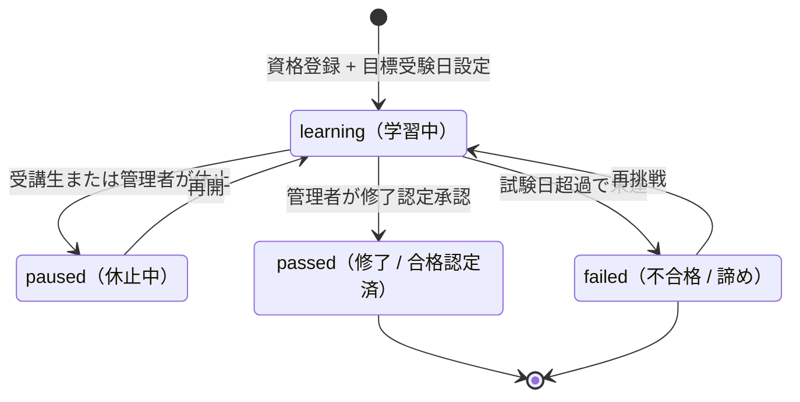
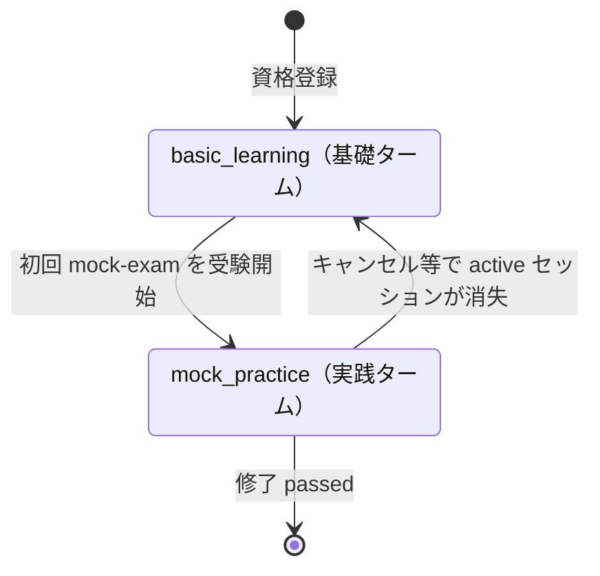
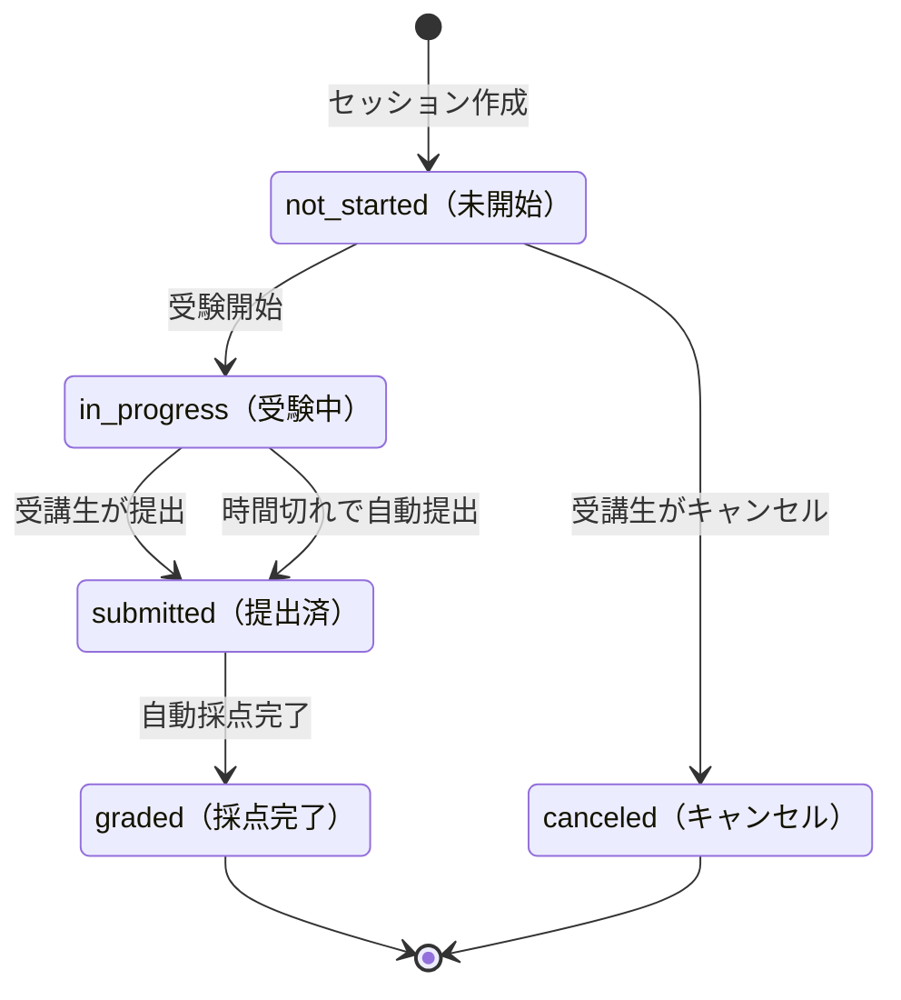
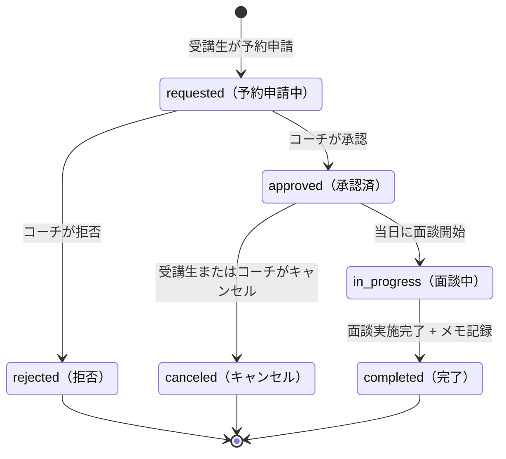
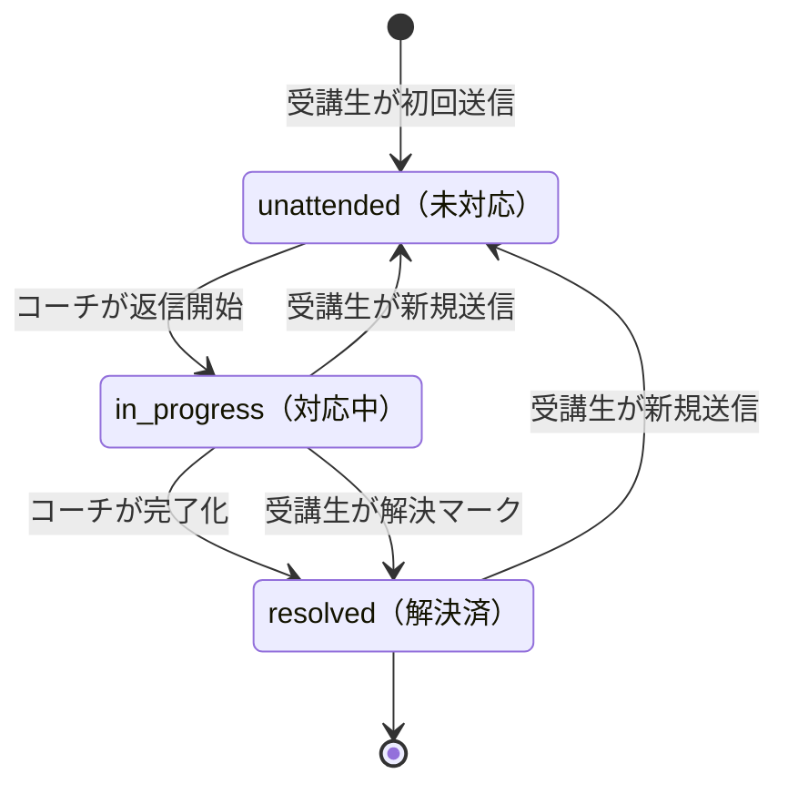

# Certify LMS — プロダクト定義

> マルチ資格対応の資格取得LMS。プロダクト固有の定義（テーマ・ロール・UXフロー・Feature一覧）を集約する。
> **このドキュメントは構築側のみ参照**（受講生には渡らない）。受講生は提供PJコード + 要件シートで作業する。
> 技術スタック・規約は `tech.md`、ディレクトリ構成・命名規則は `structure.md` を参照。
> 各 Feature の詳細SDDは `../specs/{name}/` を参照（同じく構築側のみ）。

---

## 資格取得LMSのドメイン構造

本プロダクトは一般教育LMSではなく「**資格取得**」に特化したLMSである。資格取得というドメインは以下4つの構造を持ち、これが Feature 設計とデータモデルの背骨になる。

| # | ドメイン構造 | 説明 | 主な反映先 |
|---|---|---|---|
| 1 | **目標受験日（試験日カウントダウン）** | 受講生はそれぞれ目標とする受験日を持つ。学習計画はそこから逆算される | `enrollments.exam_date` / dashboard カウントダウン |
| 2 | **合格点ゴール** | 「全範囲習得」ではなく「合格点超え」が目的。達成水準が外部仕様で明確 | `certifications.passing_score` / `total_questions` / `exam_duration` |
| 3 | **問題演習中心の学習設計** | 教科書精読より「問題を解いて理解する」時間が長い。問題バンクの厚みと模擬試験（固定問題セット）が学習の中核 | `questions.category` / `questions.difficulty` / `mock_exam_questions` 中間テーブル |
| 4 | **苦手分野克服戦略** | 試験日まで有限時間。「弱点を潰す」戦略性が学習体験の核 | dashboard 分析パネル / mock-exam 結果ヒートマップ |

> ⚠️ この4構造が薄いと「ただのコース学習サービス」になる。Feature 設計時は常にこの構造が表現されているかを点検する。

### ⚠️ 概念の混同を避けるべき2点

**1. 修了 vs 目標受験日（別概念）**

| 概念 | 場所 | 意味 | 反映 |
|---|---|---|---|
| **目標受験日** | LMS外 | 受講生が予定する本試験の日 | `enrollments.exam_date`、学習計画起点、カウントダウン |
| **修了（合格認定）** | LMS内 | LMS内で達成判定する学習修了 | mock-exam 合格点超え → 管理者承認 → `enrollments.passed_at` + 修了証発行 |

目標受験日より前に修了することも、修了せず受験日が来ることもある。両者は独立。

**2. 受講状態（バイナリ的） vs ターム（進行段階）**

学習プロセスの2軸:

- **受講状態 (`Enrollment.status`)**: `learning` / `paused` / `passed` / `failed` — 継続/休止/合格/不合格のバイナリ的状態
- **ターム (`Enrollment.current_term`)**: `basic_learning` / `mock_practice` — 学習進行段階（教習所の学科→技能のメタファー）
  - `basic_learning`（基礎ターム）: 教材閲覧 + Section紐づき問題演習
  - `mock_practice`（実践ターム）: mock-exam 中心 + 弱点ドリル
  - **切替トリガ**: **初回 mock-exam セッションを開始した時点で自動的に `mock_practice` へ遷移**（iField LMS の `start_project` RPC と同じ思想。事前条件・admin承認は不要、受講生主導）

### 目標（受講生の自己設定ゴール）

受講生が自分で立てた **個人目標** を Enrollment ごと（= 資格ごと）に記録し、ダッシュボードに **Wantedly 風タイムライン** で時系列表示。**資格に紐づく**ことで「基本情報の目標」「TOEICの目標」を分離して管理でき、コーチ/Admin が担当資格の受講生目標を見て介入判断できる。内容は受講生が自由に入力、コーチ・Admin は受講生詳細画面から閲覧のみ（介入はしない、必要なら chat で声かけ）。

```
enrollment_goals（受講生×資格 単位）
- id
- enrollment_id (FK)  ← 資格紐づき（どの資格に対する目標か明確）
- title         例: 「3月末までに過去問7割正答」「過去問の苦手分野を克服」
- description   任意、詳細メモ
- target_date   任意、期限
- achieved_at   NULL or 達成日時（受講生が「達成しました」ボタン）
- created_at / updated_at
```

> COACHTECH 流の「テンプレート + 個別コピー」方式は採用しない。**シンプルなCRUD + 達成マークのみ**。目標テンプレートのマスタも持たない（資格に紐づくが、内容は完全に受講生個別）。
> 資格非紐づきの総合目標（複数資格をまたぐ生活習慣等）は本機能のスコープ外（個人手帳で管理する範囲）。

## テーマ

マルチ資格対応の資格取得LMS（**Certify LMS**）。コーチが資格試験向けの教材と問題を作成、受講生が複数資格を選び学習・問題演習・コーチ面談、管理者がプラットフォーム全体を運営する。

例題資格: 基本情報技術者、応用情報技術者、TOEIC など。受講生は複数資格を同時学習可。

## プロダクトのロール

| ロール | DB値 | 主な業務 | 権限スコープ |
|---|---|---|---|
| 管理者 | `admin` | プラットフォーム全体運営 / 資格マスタCRUD / ユーザー招待・無効化 / 統計分析 / 修了認定承認 | **全資格 / 全ユーザー** に対する全操作（教材CRUD・受講生CRUD・コーチCRUD・ロール変更含む）|
| コーチ | `coach` | 担当資格の教材・問題作成 / 面談対応 / 担当受講生のフォロー | **担当資格のみ** 教材・問題CRUD / **担当受講生のみ** 進捗閲覧・面談対応・メッセージ送信。他資格は閲覧不可、他コーチの担当受講生にもアクセス不可 |
| 受講生 | `student` | 教材学習 / 問題演習 / 面談予約 / AI 相談 / コーチへの質問 | **自分が登録した資格のみ** 教材閲覧・問題演習 / **自分のデータのみ** プロフィール編集 / 担当コーチへのみメッセージ送信 |

**運用モデル（実務LMSに準拠）**:
- ユーザー新規登録は **管理者からの招待制**。自己サインアップは存在しない
- コーチの担当資格は **管理者が割当**（`certification_coach_assignments` 中間テーブル）。1コーチ複数資格・1資格複数コーチを許容
- 受講生の担当コーチは **資格×受講生** 単位で確定（`enrollments.assigned_coach_id` または別中間テーブル）

---

## 主要UXフロー

### 1. 受講生ジャーニー全体（招待 → 修了認定）

入会申込から受講生が修了認定（公開模試すべて合格 → 受講生申請 → admin 承認 → 修了証発行）に至るまでの俯瞰フロー。**基礎ターム → 実践ターム** の自動切替。実線が主動線、点線が通知連動。



> 補足: 修了（LMS内達成）と 本試験受験（LMS外、`exam_date` で表現）は **独立**。修了後の本試験受験はLMS外。本試験日が来ても修了未達なら `failed` 遷移可能（再挑戦も可）。
> 目標の達成記録は **受講生の自己申告**（システム自動付与ではない）。コーチ・Admin は受講生詳細から閲覧のみ。

### 2. 管理者（admin）動線

プラットフォーム全体の運営。ユーザー管理は **一覧→詳細を主軸**（招待動線は一覧から、編集系は詳細で）。修了認定承認は **公開模試すべて合格** が判定根拠。運用モニタリングは **KPI / 統計の俯瞰のみ**（個別介入は詳細遷移経由）。



### 3. コーチ（coach）動線

担当資格のコンテンツ整備（教材 + 問題 + **mock-exam マスタ組成**）と、担当受講生のフォロー（**面談 / chat / qa-board / 滞留検知 / 弱点把握 / 目標閲覧**）が主任務。



### 4. 受講生（student）学習サイクル詳細

ログイン後の学習導線。**ターム（basic_learning / mock_practice）**は初回 mock-exam 開始で自動切替（キャンセル時は再計算で戻る）。教材閲覧と問題演習が日常の中核、模擬試験が節目、chat / qa-board / 面談 / AI が補助線。試験日カウントダウン・弱点ヒートマップ・目標タイムラインが「資格LMS固有」の主役。



---

## ステータス遷移

実務LMSで状態管理が重要な6つのエンティティ。`specs/{name}/design.md` で詳細を展開する際の前提。各状態に日本語ラベルを併記。

### A. User（受講状態）

シンプルな3値構成。資格LMS文脈で長期休眠は稀のため `suspended` は採用せず（必要なら Enrollment.status の `paused` で資格単位の休止を表現）。



### B. Enrollment.status（資格×受講生 の受講状態）



> Note: `passed` 遷移は mock-exam で合格点超えが前提条件。

### C. Enrollment.current_term（学習進行ターム）

教習所メタファー: 学科（基礎）→ 実技（実践）。受講状態とは別軸。**切替は受講生の初回 mock-exam 開始で自動**（iField LMS の `start_project` RPC と同じ思想、admin承認不要）。**キャンセル時はターム判定が再計算される**（active な MockExamSession が残っているか否かで basic_learning に戻る可能性あり）。



> **ターム判定ロジック**: `current_term = EXISTS(MockExamSession WHERE enrollment_id=X AND status IN ('in_progress','submitted','graded')) ? 'mock_practice' : 'basic_learning'`
> MockExamSession の作成/状態変化/削除のたびに再計算。`canceled` セッションは判定に含めない。

### D. Mock-exam Session（模擬試験セッション）

`canceled` は **`not_started` からのみ** 可能（受験開始前に「やっぱりやめる」を許容）。すでに `in_progress` 以降のセッションはキャンセル不可（提出 or 時間切れまで進む）。



### E. Meeting（面談）



### F. ChatRoom（受講生×担当コーチ のメッセージルーム）

COACHTECH 流の「未対応 → 対応中 → 完了」を採用。**コーチ側だけでなく受講生からも解決マーク可能**（生徒主導の「ありがとう」終了に対応）。



---

## Feature一覧

各 Feature の詳細仕様は `../specs/{name}/{requirements,design,tasks}.md` を参照。

**提供状態の凡例**:
- `既存実装` — 提供時点で動作。受講生のチケットは **バグ修正** が中心
- `既存実装+Basic拡張` — 動作する既存実装あり + Basic範囲の **新規機能・拡張** がチケット
- `未実装(Bladeのみ)` — UIだけ提供、ロジック・API・JS は **受講生が実装**
- `Advance` — Advance範囲。Basic側は触らず、純粋追加（SPA・リアルタイム・OAuth・Queue 等）

| # | Feature | 主ロール | 主モデル | 概要 | 提供状態 | Advance連携 |
|---|---|---|---|---|---|---|
| 1 | **auth** | 全 | `User`, `Invitation` | 招待URL発行 → 招待メール送信 → トークン検証 → オンボーディング（初回パスワード設定 + プロフィール）→ Fortify ログイン / ログアウト / パスワードリセット。Role(`admin`/`coach`/`student`) + `EnsureUserRole` Middleware | 既存実装 | — |
| 2 | **user-management** | admin | `User`, `UserStatusLog` | コーチ・受講生の招待発行・再招待、ユーザー一覧（フィルタ・検索 + 招待動線）→ **詳細画面でプロフィール編集 / ロール変更 / 退会処理**。**受講状態管理**（`invited`/`active`/`withdrawn` 遷移と履歴ログ）| 既存実装 | — |
| 3 | **certification-management** | admin | `Certification`, `CertificationCategory`, `CertificationCoachAssignment`, `Certificate` | 資格マスタCRUD（資格コード / 名称 / 分類 / 難易度 / **合格点** / **試験時間** / **総問題数**）+ 公開状態（draft/published/archived）+ 担当コーチ割当 + **修了証発行ログ** | 既存実装 | — |
| 4 | **content-management** | coach | `Part`, `Chapter`, `Section`, `Question`, `QuestionOption` | 担当資格の Part / Chapter / Section / 問題 CRUD。Section は Markdown 本文、問題は選択肢・正答・解説 + **タグ（出題分野・難易度）**。**`Question.section_id` は nullable**（Section紐づき問題 or mock-exam専用問題のどちらも作成可）。公開制御 + 順序入替 | 既存実装 | — |
| 5 | **enrollment** | student / admin | `Enrollment`, `EnrollmentGoal` | 受講生 × 資格 多対多（**1受講生が複数資格を同時受講可** — Certify LMS 独自の優位性）。**`exam_date`（目標受験日 / LMS外）** + **`passed_at`（修了達成日 / LMS内）** + **受講状態**（`learning`/`paused`/`passed`/`failed`）+ **`current_term`（`basic_learning`/`mock_practice`、初回mock-exam開始で自動切替）** + 担当コーチ紐付け + **目標**（受講生が資格ごとに自由入力する個人ゴール、コーチ/Admin閲覧のみ）。受講生の自己登録、管理者の一括割当・解除 | 既存実装 | — |
| 6 | **learning** | student | `SectionProgress`, `LearningSession`, `LearningHourTarget` | Section 読了マーク + 教材閲覧 + **進捗自動集計**（Section→Chapter→Part→資格 完了率%）+ **学習時間トラッキング**（セッション開始/終了の自動記録、教材別集計）+ **学習時間目標**（資格単位、`target_total_hours` のみ保存 / 期間は `Enrollment.created_at` 〜 `Enrollment.exam_date` で代用 / 残り時間・残り日数・日次推奨ペースを自動逆算）+ 継続学習導線 | 既存実装 | — |
| 7 | **quiz-answering** | student | `Answer`, `QuestionAttempt` | Section 紐づき問題の演習・解答送信・**自動採点**・解答履歴・解説表示・正答率記録 | 既存実装+Basic拡張（API化）| **Advance SPA** で連携 |
| 8 | **mock-exam** | student / coach / admin | `MockExam`, `MockExamQuestion`, `MockExamSession`, `MockExamAnswer` | **本番形式の模擬試験**（資格LMS中核）: コーチが資格ごとに **MockExam マスタを複数作成** + **`MockExamQuestion` 中間テーブルで問題セットを事前固定** + `order` / `is_published` 設定。受講生は公開模試をいつでも・何度でも受験 → 時間制限 + 一括採点 + 採点後の **分野別正答率ヒートマップ** + **合格可能性スコア**。実践ターム中の主役。**修了判定**: 公開模試すべてに合格点超え達成で修了申請可 → admin 承認。コーチは担当受講生の結果閲覧可 | 未実装(Bladeのみ) | — |
| 9 | **mentoring** | student / coach | `Meeting`, `MeetingMemo`, `CoachAvailability` | コーチ面談予約申請 → コーチ確定/拒否 → 当日通知 → 実施（メモ記録）→ 履歴。Basic は時間枠手動指定の Blade UI | 既存実装（Basic Blade版） | **Advance FE**（Google Calendar OAuth で空き枠取得・予約反映）|
| 10 | **chat** | student / coach | `ChatRoom`, `ChatMessage` | 受講生 ↔ 担当コーチ の **1on1 プライベートメッセージング**。Basic は **非同期**（DB保存 + 画面遷移時取得、未読バッジ）。資格スコープ（受講生は登録資格ごとのルーム）。コーチは未対応ルーム一覧から応答 | 未実装(Bladeのみ) | **Advance Broadcasting**（Pusher + WebSocket でリアルタイム化）|
| 11 | **qa-board** | student / coach | `QaThread`, `QaReply` | **公開Q&A掲示板**: 受講生による技術質問投稿 → コーチ/他受講生による回答 → 解決マーク。資格別フィルタ / 解決済み・未解決の絞り込み。chat (1on1) と異なり **公開・集合知型**、孤独感解消と他受講生からの学習促進 | 未実装(Bladeのみ) | — |
| 12 | **public-api** | 外部 | `PersonalAccessToken`（Sanctum）| Sanctum トークン認証付き公開API。資格・教材・進捗等の取得を外部クライアントへ提供。トークン発行・失効も含む | 既存実装+Basic拡張（Sanctum、BookShelf応用の繰り返し成功体験）| **Advance SPA**（自前FEから同APIを呼ぶSPAを構築）|
| 13 | **notification** | 全 | `Notification`（Laravel標準）| Laravel Notification（**Database + Mail channel** 二段）: 進捗節目達成 / 面談予約確定 / mock-exam 採点完了 / 新規Q&A回答 / **修了認定承認・修了証発行** / **学習途絶リマインド** / 管理者お知らせ等。受講生は通知一覧画面で既読化 | 既存実装+Basic拡張（教材外、繰り返し成功体験）| **Advance Broadcasting**（Pusher + WebSocket でリアルタイム push）|
| 14 | **dashboard** | 全 | （集計のみ、独自モデル少）| ロール別ダッシュボード:<br>・admin: 全体KPI / 統計 / 滞留検知 / **修了申請待ち一覧**<br>・coach: 担当受講生進捗 / 今日の面談 / 未対応Q&A / 未読チャット / **担当受講生の弱点ヒートマップ**<br>・student: 学習進捗ゲージ / **試験日カウントダウン** / **学習ストリーク** / **弱点分析パネル** / **学習時間目標ゲージ（残り時間・残り日数・日次推奨ペース）** / **目標タイムライン（自己設定ゴールの達成履歴、Wantedly風）** / 通知 / 面談予定 / 継続学習導線 | 既存実装 | パフォーマンス最適化（Advance: N+1 / インデックス / キャッシュ題材）|
| 15 | **ai-chat** | student | `AiChatConversation`, `AiChatMessage` | Gemini API 連携の学習相談チャット（**問題で詰まった瞬間の補助線**）。会話履歴保存 + プロンプト管理 | 未実装(Bladeのみ) | Advance全体（受講生がBE実装・UX拡張）|
| 16 | **settings-profile** | 全 | `User`（bio/avatar_url 拡張）, `UserNotificationSetting`, `CoachAvailability`（mentoringと共有）| **自分を管理する画面**（user-management = admin が他者を管理 と責務分離）。プロフィール表示・編集（名前 / メール / 自己紹介 / アイコン）+ パスワード変更 + **通知設定**（通知種別 × channel ごとに on/off）+ **コーチのみ:面談可能時間枠設定**（CoachAvailability） | 既存実装 | — |

---

## 補足: Section紐づき問題 vs mock-exam の責務分担

Certify LMS の問題演習機能は2層構造。日常の練習（Section 問題）と節目のリハーサル（mock-exam）を明確に役割分担する。

| 観点 | Section 紐づき問題（quiz-answering）| mock-exam（mock-exam）|
|---|---|---|
| **単位** | 1問単位 | セッション = N問（例: 80問）|
| **出題** | Section に紐づく問題が固定で出題 | **MockExam マスタの問題セット（MockExamQuestion で事前固定）** が出題 |
| **時間** | 制限なし、いつでも中断OK | **制限あり**（資格の `exam_duration` を反映）、本番形式 |
| **採点** | 1問ごと即時、解説即表示 | **一括採点**後にヒートマップ・スコア |
| **目的** | 理解度確認、知識定着、復習 | **本試験リハーサル**、合否予測 |
| **結果出力** | 正答率記録のみ | **分野別正答率ヒートマップ** + **合格可能性スコア** |
| **タイミング** | 基礎ターム中の日常活動 | **初回受験で実践タームへ自動切替** / 節目のチェック |
| **再受験** | いつでも、何度でも | いつでも、何度でも（同じ問題が出る = 定着確認可能）|
| **修了との関係** | 修了判定には直接関与しない | **公開模試すべての合格点超え = 修了申請可** |

### Question と MockExam の関係（データモデル）

```
Question（問題マスタ、独立リソース）
- id
- certification_id (FK)
- section_id (FK, NULLABLE)  ← Section紐づき問題 or mock-exam専用問題
- category（出題分野タグ）
- difficulty
- 本文 / 選択肢 / 正答 / 解説

Section ↔ Question: 1対多
  Section が複数 Question を持つ。Question は section_id を1つだけ持つ（または NULL）

MockExam ↔ Question: 多対多（MockExamQuestion 中間テーブル）
  1つの Question が複数 MockExam に登場可能
  1つの MockExam が複数 Question を持つ
  → 「同じ問題を Section 学習でも mock-exam でも出題する」が成立
```

### mock-exam の主要ロジック（実装の見当）

| ロジック | 概要 | 複雑度 |
|---|---|---|
| 出題 | `MockExamQuestion` をそのままセッションに展開（`generated_question_ids` に保存） | 低 |
| 採点 | `MockExamAnswer.is_correct = (selected_option == Question.correct_option)`、`total_score = SUM(is_correct)` | 低 |
| pass 判定 | `total_score / question_count * 100 >= MockExam.passing_score` | 低 |
| 分野別ヒートマップ | `GROUP BY questions.category` + `SUM(is_correct) / COUNT(*)` の1クエリ | 低 |
| 合格可能性スコア | 直近N回の平均得点率 を `passing_score` の 90%以上 / 70-90% / 70%未満 で3バンド分け | 低 |
| 修了判定 | `COUNT(mock_exams WHERE is_published)` と `COUNT(DISTINCT mock_exam_id FROM mock_exam_sessions WHERE pass=true)` の一致確認 | 低 |

すべて Basic 範囲で Eloquent + groupBy + aggregate で実装可能。Advance では N+1 / インデックス / キャッシュ最適化の題材として活用。
