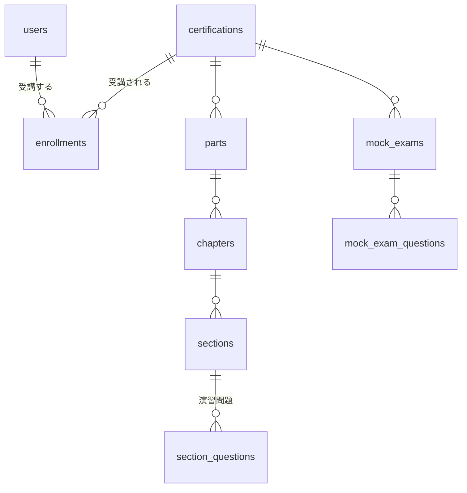

# ONBOARDING — Certify LMS コードリーディングガイド

このドキュメントは、Certify LMS の開発に参画した人向けの **コードリーディングガイド** です。仕様書ではなく「どこに何があり、どんな流儀で書かれているか」の**地図**として、最初の数時間で全体像を掴み、以降は各タスク着手時の起点として使ってください。

このプロジェクトの **フロントエンド（Blade / CSS / JavaScript）は完成形で提供されています**。あなたが実装するのは主に **バックエンド**（コントローラ・ロジック・認可・バリデーション等）です。フロントエンドの読み解き方は [§6 フロントエンド構造ガイド](#6-フロントエンド構造ガイド) にまとめています。

| 章 | 内容 |
|---|---|
| [1. プロダクトの全体像と用語](#1-プロダクトの全体像と用語) | 3 ロールの体験フローとドメイン用語 |
| [2. リクエストの流れとレイヤーマップ](#2-リクエストの流れとレイヤーマップ) | バックエンドの層構造・命名規則・ルーティング |
| [3. ドメインモデル地図](#3-ドメインモデル地図) | テーブルのクラスタ分けと中心関係 |
| [4. 既存パターンの典型例](#4-既存パターンの典型例手本の所在) | 「やりたいこと → 手本となる既存コード」対応表 |
| [5. データと Seeder](#5-データと-seeder) | デモデータの世界とリセット方法 |
| [6. フロントエンド構造ガイド](#6-フロントエンド構造ガイド) | Blade / JS / CSS の地図 |
| [7. 読み進め方](#7-読み進め方) | 初日の順路とタスク着手時のルーチン |

---

## 1. プロダクトの全体像と用語

Certify LMS は **マルチ資格対応の資格学習プラットフォーム** で、3 つのロールが登場します。

- **受講生（student）** — 管理者からの**招待メール**でアカウントを作成し（公開の会員登録はありません）、資格を受講します。教材（Part > Chapter > Section）で学習 → Section 末尾の演習問題で理解度確認 → 模擬試験で実力測定 → コーチと面談 → 修了、という流れを辿ります。
- **コーチ（coach）** — 担当資格の教材・演習問題・模試を管理し、担当受講生の進捗を見ながら面談・チャットでフォローします。
- **管理者（admin）** — ユーザーの招待・管理、資格マスタ、コーチ割当、面談回数の付与などプラットフォーム全体を運用します。

### 用語ミニ辞典

| 用語 | 意味 |
|---|---|
| Certification（資格） | 学習対象の資格（例: 基本情報技術者試験）。資格分類（CertificationCategory）に属し、公開状態（下書き / 公開中 / アーカイブ）を持つ |
| Enrollment（受講登録） | **受講生 × 資格の受講関係。このドメインの中心エンティティ**。学習ステータス・目標受験日・学習タームを持つ |
| Term（学習ターム） | 受講の段階。基礎学習（basic_learning）→ 実践（mock_practice）へ学習状況に応じて切り替わる |
| Part / Chapter / Section | 教材の 3 階層。本文（Markdown）は Section が持ち、画面では HTML に変換して表示する |
| SectionQuestion（演習問題） | Section に紐づく選択式の問題。出題分野（QuestionCategory）を持つ |
| MockExam（模試） | 本番形式の模擬試験。問題（MockExamQuestion）は演習問題とは**別管理**（共有しない） |
| MockExamSession | 受講生の模試受験 1 回分。開始 → 解答 → 提出 → 採点という状態を持つ |
| Meeting（面談） | 受講生とコーチの面談予約。面談回数の増減は MeetingQuotaTransaction（追記専用の取引履歴）で管理する |
| Plan（プラン） | 受講期間 + 面談回数のセット。ユーザーに割り当てられ、履歴は UserPlanLog に残る |
| Certificate（修了証） | 資格修了時に受講生が受け取る証明 |

---

## 2. リクエストの流れとレイヤーマップ

1 つの HTTP リクエストは次の順に流れます。**新しいコードをどの層に置くべきかは、この流れと近い既存実装から判断**してください。

```
routes/web.php            … 入口。URL・ミドルウェア・Controller の対応
→ Middleware              … 認証・ロール・状態チェック（app/Http/Middleware/）
→ Controller              … 薄い受付役。1 メソッド = 1 Action 呼び出しが基本形（app/Http/Controllers/）
→ FormRequest             … バリデーション + 認可（app/Http/Requests/{Entity}/）
→ Action                  … 1 業務操作 = 1 クラス（app/UseCases/{Entity}/）
→ Service / Model         … 横断ロジック / Eloquent（app/Services/, app/Models/）
→ view() / redirect()     … 画面表示・リダイレクト
```

### app/ ディレクトリの責務

| ディレクトリ | 責務 |
|---|---|
| `Http/Controllers/` | リクエスト受付とレスポンス。ビジネスロジックは持たず Action へ委譲 |
| `Http/Middleware/` | 認証・ロール（`EnsureUserRole` = `role:` エイリアス）・学習中チェック（`EnsureActiveLearning` = `active-learning`）等 |
| `Http/Requests/{Entity}/` | FormRequest。`rules()` のバリデーションと `authorize()` の認可 |
| `UseCases/{Entity}/` | **1 業務操作 = 1 Action クラス**（例: `StoreAction` / `UpdateAction` / `ReceiveCertificateAction`） |
| `Services/` | 複数 Entity にまたがる集計・判定ロジック（例: ストリーク計算、面談の空き枠計算） |
| `Models/` | Eloquent モデル（36 個）。リレーション・スコープ・キャストを集約 |
| `Policies/` | 認可ポリシー（28 個）。「誰がこのリソースに何をできるか」 |
| `Enums/` | 状態・種別の PHP Enum（例: `EnrollmentStatus` / `MeetingStatus` / `UserRole`） |
| `Notifications/` / `Mail/` | 通知・メール |
| `Console/Commands/` | 日次バッチ（招待の期限切れ・面談の自動完了など。`app/Console/Kernel.php` でスケジュール登録） |
| `Events/` / `Listeners/` | ドメインイベント |
| `Exceptions/` | ドメイン例外 |
| `View/Composers/` | レイアウト常駐部品へのデータ供給（§6 参照） |
| `Providers/` | サービスプロバイダ（Policy 登録は `AuthServiceProvider`） |

### 命名と配置の規則

- Controller: `{Entity}Controller`。メソッド内は「FormRequest 受取 → Action 呼び出し → レスポンス」の 3 手で薄く保つ
- Action: `app/UseCases/{Entity}/{動詞}Action.php`
- FormRequest: `app/Http/Requests/{Entity}/{動詞}Request.php`
- Service: `{役割}Service`
- Policy: `{Entity}Policy`
- テスト: `tests/Feature/Http/{Entity}/`（HTTP 経由）・`tests/Feature/UseCases/{Entity}/`（Action 単位）・`tests/Unit/`（Model / Service / Policy 等）

### ルーティングの構造（routes/web.php）

ロール × ミドルウェアのグループで構成されています。

- `Route::middleware('auth')` — 全ロール共通（ダッシュボード等）
- `Route::middleware(['auth', 'role:student', 'active-learning'])` — 受講生専用（学習・模試・面談など）。`active-learning` は「学習中ステータスの受講生のみ」を強制する
- `Route::middleware(['auth', 'role:admin'])->prefix('admin')` — 管理者専用
- `role:admin,coach` のような複数ロール指定もある（教材管理など）

`routes/api.php` は Sanctum 認証の最小構成のみです。

---

## 3. ドメインモデル地図

テーブルは大きく 8 クラスタに分かれます。まず中心の関係（ユーザー・資格・受講登録の三角と、その下の教材・模試の階層）を押さえてください。



### クラスタ別テーブル一覧

| クラスタ | テーブル | 概要 |
|---|---|---|
| ユーザー・契約 | users, user_status_logs, invitations, plans, user_plan_logs, meeting_packs, meeting_quota_transactions | 招待制のユーザー管理。プラン（受講期間 + 面談回数）の割当履歴と、面談回数の増減履歴（追記専用） |
| 資格・受講 | certifications, certification_categories, certification_coach_assignments, enrollments, enrollment_status_logs, certificates | 資格マスタ・コーチ割当・**受講登録（中心エンティティ）**・修了証 |
| 教材 | parts, chapters, sections, section_images, question_categories, section_questions, section_question_options | 教材 3 階層と Section 紐づき演習問題、出題分野マスタ |
| 演習解答 | section_question_answers, section_question_attempts | 受講生の演習問題への解答・受験履歴 |
| 学習進捗 | section_progresses, learning_sessions, learning_hour_targets | Section の読了マーク、学習セッション（時間計測）、学習時間目標 |
| 模試 | mock_exams, mock_exam_questions, mock_exam_question_options, mock_exam_sessions, mock_exam_answers | 模試マスタ・問題・選択肢・受験セッション・解答 |
| 面談 | meetings, meeting_memos, coach_availabilities | 面談予約・面談メモ・コーチの対応可能時間帯 |
| チャット | chat_rooms, chat_members, chat_messages | 資格単位のグループチャット（受講生 + 担当コーチ） |

各テーブルには `app/Models/` に対応する Model が 1:1 で存在します。**テーブルの意味やつながりに迷ったら、まず Model ファイルのリレーション定義（belongsTo / hasMany）と PHPDoc を読む**のが近道です。

---

## 4. 既存パターンの典型例（手本の所在）

「この種の実装をしたいとき、どの既存コードを手本にするか」の対応表です。手本ファイルを開き、**同じ構造・命名・テストの形で書く**のがこのプロジェクトの流儀です。

| やりたいこと | 手本 |
|---|---|
| マスタの CRUD 一式 | 出題分野マスタ: `QuestionCategoryController` + `app/UseCases/QuestionCategory/`（Index / Store / Update / Destroy）+ `app/Http/Requests/QuestionCategory/` + `QuestionCategoryPolicy` |
| 階層リソースの CRUD・公開状態遷移・並び替え | 教材階層: `app/UseCases/Part/`（Store / Update / Destroy / Publish / Unpublish / Reorder）と、Chapter / Section の同型実装 |
| 状態遷移を伴う業務操作 | 修了証の受領: `app/UseCases/Enrollment/ReceiveCertificateAction.php` / 模試の開始・提出: `app/UseCases/MockExamSession/StartAction.php`・`SubmitAction.php` |
| 複数 Entity にまたがる集計・判定 | 学習ストリーク: `app/Services/StreakService.php` / 面談の空き枠計算: `app/Services/MeetingAvailabilityService.php` |
| 認可（誰が何をできるか） | `app/Policies/MockExamPolicy.php`（ロール × 操作の判定）。FormRequest の `authorize()` や Controller から Policy へ委譲する形が基本 |
| バリデーション | `app/Http/Requests/Section/StoreRequest.php`（rules + 日本語 attributes） |
| ロールによるアクセス制御 | `app/Http/Middleware/EnsureUserRole.php`（`role:` エイリアスの実体） |
| メール通知 | `app/Notifications/Auth/ResetPasswordNotification.php`（Notification クラスの実例） |
| 日次バッチ | `app/Console/Commands/`（招待の期限切れ・面談の自動完了など） |
| Feature テスト（HTTP 経由） | `tests/Feature/Http/{Entity}/` 配下（`actingAs()` でロール別に検証する形） |
| Unit テスト（Model / Service） | `tests/Unit/Models/SectionTest.php` / `tests/Unit/Services/MeetingAvailabilityServiceTest.php` |

---

## 5. データと Seeder

`sail artisan migrate:fresh --seed` で、いつでもデータベースを初期状態に戻せます。Seeder（`database/seeders/`）は次の世界を作ります。

- **固定ログインアカウント**: admin 1 / コーチ 2 / 受講生 1（README の「ログインアカウント」参照）
- **ライフサイクル網羅のデモユーザー**: 招待中 / 受講中 / 卒業 / 退会の各状態（`UserLifecycleSeeder`）
- **資格マスタ**: 基本情報技術者試験・応用情報技術者試験ほか。公開中 / 下書き / アーカイブの状態を網羅
- **教材階層と演習問題**: 公開 / 下書きが混在し、全文検索でヒットする Markdown 本文入り（`ContentSeeder`）
- **模試・受験履歴、面談・対応可能時間帯、チャットルーム・メッセージ、修了証** など各機能のデモデータ

`DatabaseSeeder` の call 順がそのまま依存順になっています（ユーザー → プラン → 資格 → 受講登録 → 教材 → 学習・模試・面談・チャット）。**新しいテーブルを追加するタスクでは、この Seeder 群に倣って動作確認用データを足す**と、画面確認とデモがやりやすくなります。

---

## 6. フロントエンド構造ガイド

フロントエンドは完成形で提供されています。各 Blade / JS ファイルの先頭には、その画面・部品の **役割と構成** を説明するヘッダコメントが付いています。コメントは **フロントの構造と挙動だけ** を説明し、バックエンド設計には触れません（必要なバックエンドは、画面を読んで自分で設計します）。

### 6.1 ディレクトリ全体像

```
resources/
├── views/
│   ├── layouts/            # 共通レイアウト（app / guest / pdf）+ _partials（サイドバー・TopBar）
│   ├── components/          # 共通 Blade コンポーネント（<x-...>）
│   ├── errors/              # エラーページ（403/404/419/422/500/maintenance）
│   ├── {feature}/           # 機能ごとの画面（後述の「画面の構成パターン」）
│   └── ...
├── css/
│   └── app.css              # Tailwind エントリ + デザイントークン（CSS 変数）
└── js/
    ├── app.js               # JS エントリ（各モジュールの初期化を集約）
    ├── components/          # 共通 UI 挙動（modal / dropdown 等）
    ├── utils/               # 共通ユーティリティ（fetch ラッパー等）
    └── {feature}/           # 機能ごとの JS
```

ビルドは Vite（`npm run dev` / `npm run build`）。Blade からは `@vite(['resources/css/app.css', 'resources/js/app.js'])` で読み込みます。

### 6.2 レイアウト（`resources/views/layouts/`）

| ファイル | 用途 |
|---|---|
| `app.blade.php` | **認証後の共通レイアウト**。全ロール（受講生 / コーチ / 管理者）の画面が継承。サイドバー（`lg+` 固定 / 未満は drawer）+ TopBar + メイン（`@yield('content')`）。 |
| `guest.blade.php` | **未ログイン用**。中央のフォームカード。ログイン / オンボーディング / パスワードリセット / エラーページが継承。 |
| `pdf.blade.php` | PDF 生成専用（外部 CSS/JS なし）。 |
| `_partials/sidebar-{role}.blade.php` | ロール別サイドバー（`@include('layouts._partials.sidebar-' . role)` で切替）。 |
| `_partials/topbar.blade.php` | 全画面共通ヘッダ（検索 / 通知ベル / ユーザーメニュー）。 |

画面を作るときは `@extends('layouts.app')`（認証後）または `@extends('layouts.guest')`（認証前）で継承します。

#### レイアウト共通部品へのデータ供給 — View Composer

サイドバーや TopBar のような **全画面に常駐する部品** は、特定の画面（コントローラ）に属さない横断的なデータ（未読件数・受講中資格一覧など）を必要とします。これを各コントローラで毎回渡すのは重複が多いため、Laravel の **View Composer**（`app/View/Composers/`）が「対象 View の描画直前に、自動でデータを差し込む」役割を担います。**これらは提供済みのインフラで、あなたが実装する必要はありません**（どこからデータが来るかを把握しておくと、レイアウトが読み解きやすくなります）。

| View Composer | 供給先 | 渡すデータ |
|---|---|---|
| `SidebarBadgeComposer` | サイドバー | chat の未読ルーム数バッジ |
| `NotificationBadgeComposer` | TopBar 通知ベル | 未読通知件数バッジ |
| `EnrollmentSwitcherComposer` | 資格スイッチャー | 受講中の資格一覧 |
| `SectionPageMetaComposer` | フローティング AI 相談ウィジェット | 閲覧中 Section の文脈（Section / 資格名） |

`ServiceProvider` の `boot()` で対象 View に紐づけられ、`compose()` が `$view->with(...)` でデータを渡します。バッジ件数やウィジェットの文脈が「どの画面でも出る」のはこの仕組みのためです。あなたのバックエンドが生成したデータ（通知・チャット等）を、Composer がレイアウト表示用に集約している、と捉えてください。

### 6.3 共通コンポーネント（`resources/views/components/` = `<x-...>`）

**まずここを見てください。** 同じ UI を再発明せず、既存コンポーネントを組み合わせて画面を作れます。各ファイル先頭ヘッダに props / slot の概要があります。

| カテゴリ | コンポーネント | 用途の例 |
|---|---|---|
| ボタン | `<x-button>` / `<x-link-button>` | variant × size のボタン / リンク見た目のボタン |
| フォーム | `<x-form.input>` `textarea` `select` `checkbox` `radio` `file` `label` `hint` `error` `fieldset` | ラベル + 入力 + エラー表示が揃ったフォーム部品 |
| 表示 | `<x-card>` `<x-badge>` `<x-avatar>` `<x-icon>` `<x-empty-state>` | カード / ステータスバッジ / アバター / アイコン / 空状態 |
| オーバーレイ | `<x-modal>` `<x-dropdown>`（+ `dropdown.item`） | モーダル / ドロップダウン（素の JS で開閉） |
| フィードバック | `<x-alert>` `<x-flash>` | アラート / フラッシュメッセージ |
| ナビ | `<x-nav.sidebar>` `nav.item` `nav.section` `<x-breadcrumb>` `<x-tabs>` `<x-paginator>` | サイドバー / パンくず / タブ / ページネーション |
| テーブル | `<x-table>`（+ `table.row` `table.heading` `table.cell`） | 一覧テーブル |
| その他 | `<x-enrollment-switcher>` / `components/content-management/*` / `components/ai-chat/*` | 受講資格スイッチャー / 教材公開状態バッジ等 |

ローカルの `APP_ENV=local` でアクセスできる **`/_dev/components`** で、全コンポーネントの見た目を一覧確認できます。

### 6.4 画面の構成パターン（`resources/views/{feature}/`）

機能ごとにディレクトリがあり、慣習的に以下の構成です。

- `index.blade.php` — 一覧、`show.blade.php` — 詳細、`create` / `edit` — フォーム
- `_partials/` — 画面内で再利用する部品（カード・行・タイムライン等）
- `_modals/` — モーダル（確認ダイアログ・フォーム）

各ファイル先頭ヘッダの「構成:」行を読むと、その画面がどんなブロックで組まれているか一目で分かります。

### 6.5 JavaScript（`resources/js/`）

**フレームワークは使いません（素の JavaScript + Vite）。** `app.js` が各モジュールの `init...()` を `DOMContentLoaded` で呼ぶ構成です。

| 区分 | 場所 | 例 |
|---|---|---|
| エントリ | `app.js` | 各モジュールの初期化を集約 |
| 共通 UI 挙動 | `components/` | `modal` / `dropdown` / `flash` / `sidebar-drawer` / `textarea-counter` / `enrollment-switcher` |
| 共通ユーティリティ | `utils/` | `fetch-json`（fetch + CSRF + JSON のラッパー） |
| 機能別 | `{feature}/` | `ai-chat/*` / `mock-exam/*` / `mentoring/*` / `content-management/*` / `dashboard/*` / `notification/*` 等 |

#### Blade ↔ JS の連携（`data-*` フック）

JS は **`data-*` 属性** を目印に DOM を探して動作します（Blade 側が `data-modal-trigger="..."` 等を出し、JS がそれを拾う）。各 JS モジュール先頭ヘッダに「どの `data-*` を見るか」「公開する `init` 関数」が書かれています。**Blade と JS の接点は `data-*` 属性** と覚えておくと読みやすくなります。

> JS の API 呼び出し先（エンドポイント）や送受信データの詳細は、あなたが設計するバックボーンに関わるため、コメントでは深掘りしていません。提供 JS が「どの `data-*` を読み、どんな操作をするか」（フロント挙動）に注目してください。

### 6.6 スタイリング（Tailwind CSS）

- `resources/css/app.css` にデザイントークン（CSS 変数: `--border-subtle` 等）、`tailwind.config.js` にカラー（`primary` / `ink` / `surface` / `border-subtle` 等）・フォント・影を定義。
- ユーティリティファースト。`bg-primary-600` / `text-ink-900` / `border-subtle` のような **意味のある名前のクラス** を使います。
- 同じクラス組み合わせが 3 回以上出たらコンポーネント化（`<x-...>`）されています。

---

## 7. 読み進め方

### 初日の順路

1. README の手順で環境構築し、固定アカウントでログインする
2. 受講生 → コーチ → 管理者の順に画面をひと巡りする（§1 の体験フローを画面で確認）
3. §2〜§3 を読み、`routes/web.php` と `app/Models/Enrollment.php` を開いて答え合わせする
4. §6 で FE の構造を掴む（特に `layouts/` と `components/`、`/_dev/components`）

### タスク着手時のルーチン

1. 要件を読み、**関連する画面を実際に操作**する
2. `routes/web.php` で入口（URL → Controller）を特定する
3. Controller から FormRequest / Action / Service / Model へ潜って現状を把握する
4. **§4 の手本表からいちばん近い既存実装を選び、構造・命名・テストの形を倣う**
5. 動的な画面なら、対応する `resources/js/{feature}/` のヘッダで「どの `data-*` を見て何をするか」を確認する
6. 既存コードを読んでも決まらない仕様判断は、自分の設計案を添えて PM に確認する
