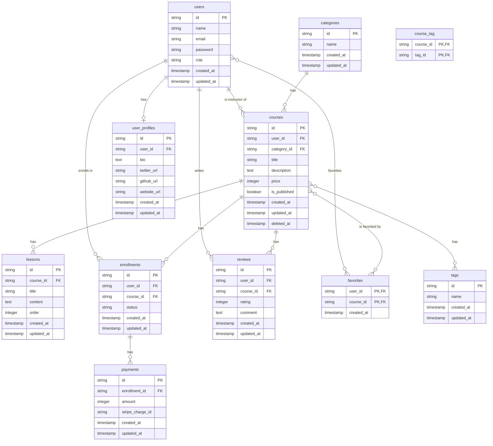

## 模擬案件「LearnHub」要件定義書 v2.0

## 目次

1. [プロジェクト概要](#1-プロジェクト概要)
2. [開発の進め方](#2-開発の進め方)
3. [環境構築手順](#3-環境構築手順)
4. [提供コードベースの実装状況](#4-提供コードベースの実装状況)
5. [実装チケット一覧](#5-実装チケット一覧)
6. [チケット詳細](#6-チケット詳細)
7. [データベース設計](#7-データベース設計)
8. [ルーティング設計](#8-ルーティング設計)
9. [コントローラー設計](#9-コントローラー設計)
10. [バリデーション設計](#10-バリデーション設計)
11. [認可設計](#11-認可設計)
12. [テスト設計](#12-テスト設計)
13. [API設計](#13-api設計)
14. [外部API連携](#14-外部api連携)

---

## 1. プロジェクト概要

### 1.1 プロジェクト名

**LearnHub（ラーンハブ）**

### 1.2 背景

近年、オンライン学習の需要は急速に高まっています。時間や場所を選ばずに学習できる利便性から、多くの人が自己投資やスキルアップのためにオンライン学習プラットフォームを利用しています。

本プロジェクトでは、実務で頻出する要件を盛り込んだオンライン学習プラットフォーム「LearnHub」を題材とします。受講生には、一部実装済み・一部バグありの既存プロジェクトが提供されます。このプロジェクトに対して、**コードリーディング、バグフィックス、リファクタリング、新機能開発**といった一連の開発プロセスを体験してもらうことで、より実務に近い形での開発スキル習得を目指します。

### 1.3 目的

本プロジェクトを通じて、以下のスキルを習得することを目指します。

- **既存コードを読み解き、仕様を理解する能力**を養う。
- **N+1問題やセキュリティ脆弱性**など、実務で遭遇しやすいバグの修正経験を積む。
- **パフォーマンス改善やコード品質向上**を目的としたリファクタリングスキルを習得する。
- **CRUD、外部API連携、API開発**など、多岐にわたる新機能開発を経験する。
- **Git/GitHub**を用いたチーム開発のワークフロー（ブランチ、プルリクエスト）を習得する。

### 1.4 ユーザーロール

| ロール | 説明 |
| :--- | :--- |
| **管理者 (admin)** | サイト全体の管理者。カテゴリ管理などを行う。 |
| **講師 (instructor)** | コースを作成・管理する。 |
| **受講生 (student)** | コースを受講・購入する。 |

---

## 2. 開発の進め方

本プロジェクトは、既存のコードを読み解き、改修・機能追加を行う実務に近い形式で進行します。以下の進め方を推奨します。

### 2.1 環境構築後の最初のステップ

まず、プロジェクト全体の構造と実装パターンを理解するために、以下のステップを踏んでください。

#### ステップ1: アプリケーションの動作確認

`http://localhost` にアクセスし、管理者・講師・受講生の各ロールでログインして、どのような機能が実装済みで、どのように動作するのかを一通り確認します。

- 管理者でログイン → カテゴリ管理機能を操作
- 講師でログイン → コース一覧、コース詳細を閲覧
- 受講生でログイン → コース一覧、レビュー投稿を試行

#### ステップ2: お手本機能のコードリーディング

「カテゴリ管理」は、本プロジェクトにおける**CRUD実装のお手本**です。以下のファイルを中心に読み解き、実装パターン（ルーティング、コントローラー、ビュー、バリデーション）を把握してください。

- `routes/web.php` - ルーティング定義
- `app/Http/Controllers/CategoryController.php` - コントローラー
- `app/Http/Requests/StoreCategoryRequest.php` - バリデーション
- `app/Models/Category.php` - モデル
- `resources/views/admin/categories/` - ビュー

特に、以下の点に注目してください。

- RESTfulなルーティング設計
- FormRequestによるバリデーション
- Bladeテンプレートの継承とコンポーネント化
- フラッシュメッセージの表示方法

#### ステップ3: データベース構造の把握

`database/migrations` 以下のマイグレーションファイルと、本要件定義書のER図を照合し、各テーブルの役割とリレーションを理解してください。

- `users` テーブル: ユーザー情報とロール
- `courses` テーブル: コース情報（講師が作成）
- `enrollments` テーブル: 受講申し込み情報
- `reviews` テーブル: レビュー情報

### 2.2 各チケットの実装手順

各チケットは、以下の手順で進めることを基本とします。

1. **チケット内容の理解**: チケットに記載された「目的」と「実装手順」をよく読み、ゴールを明確にします。
2. **関連箇所のコードリーディング**: 「実装手順」で示された関連ファイルや既存機能を読み解き、改修・追加する箇所の特定と、実装の具体的なイメージを固めます。
3. **実装**: コーディング規約や既存の実装パターンを踏襲し、機能の実装を行います。
4. **動作確認**: 実際にブラウザで操作し、要件通りに動作することを確認します。
5. **テスト**: 必要に応じてテストコードを記述・実行し、品質を担保します。
6. **コミットとプルリクエスト**: 適切な粒度でコミットし、プルリクエストを作成してレビューを依頼します。（本カリキュラムではセルフレビュー）

### 2.3 推奨ツール

以下のツールを活用することで、コードリーディングやデバッグが効率的に行えます。

- **Laravel Debugbar**: クエリ数やパフォーマンスを可視化
- **Laravel Telescope**: アプリケーションの動作をモニタリング
- **dd() / dump()**: 変数の中身を確認
- **Log::info()**: ログ出力でデバッグ

---

## 3. 環境構築手順

### 3.1 必須要件

- Docker Desktopがインストールされていること。
- Gitがインストールされていること。
- GitHub CLIがインストールされていること（推奨）。

### 3.2 環境構築

以下の手順に従って、開発環境を構築してください。

#### 1. リポジトリのクローン

GitHubからプロジェクトをクローンします。

```bash
gh repo clone coachtech-material/ExampleAnswer-mockcase-SkillHub
cd ExampleAnswer-mockcase-SkillHub
```

#### 2. .envファイルの作成

`.env.example`をコピーして`.env`ファイルを作成します。

```bash
cp .env.example .env
```

#### 3. Dockerコンテナの起動

Laravel Sailを使用してDockerコンテナを起動します。

```bash
./vendor/bin/sail up -d
```

初回起動時は、イメージのビルドに時間がかかる場合があります。

#### 4. Composerパッケージのインストール

Composerの依存パッケージをインストールします。

```bash
./vendor/bin/sail composer install
```

#### 5. アプリケーションキーの生成

Laravelのアプリケーションキーを生成します。

```bash
./vendor/bin/sail artisan key:generate
```

#### 6. データベースのマイグレーションと初期データ投入

データベースのテーブルを作成し、初期データを投入します。

```bash
./vendor/bin/sail artisan migrate:fresh --seed
```

#### 7. アプリケーションへのアクセス

ブラウザで `http://localhost` にアクセスし、トップページが表示されることを確認します。

### 3.3 ログイン情報

初期データとして、以下のユーザーが登録されています。

| ロール | メールアドレス | パスワード |
| :--- | :--- | :--- |
| 管理者 | `admin@example.com` | `password` |
| 講師 | `instructor@example.com` | `password` |
| 受講生 | `student@example.com` | `password` |

### 3.4 コンテナの停止・再起動

開発を終了する際は、以下のコマンドでコンテナを停止できます。

```bash
./vendor/bin/sail down
```

再度起動する際は、以下のコマンドを実行します。

```bash
./vendor/bin/sail up -d
```

---

## 4. 提供コードベースの実装状況

### 4.1 完全実装済み機能（運営提供）

以下の機能は、運営側で完全に実装済みです。これらをお手本として、他の機能を実装してください。

| 機能 | 実装状況 | 備考 |
|---|---|---|
| **認証機能** | ✅ 完全実装 | Laravel Fortify使用、会員登録・ログイン・ログアウト |
| **ロール管理** | ✅ 完全実装 | admin, instructor, student の3ロール |
| **カテゴリ管理** | ✅ 完全実装 | **お手本機能**（CRUD完全実装） |
| **Bladeビュー** | ✅ 完全実装 | 全画面のフロントエンド実装済み |
| **マイグレーション** | ✅ 完全実装 | 全テーブル定義済み |
| **モデル** | ⚠️ 一部実装 | 基本的なモデルは作成済み、リレーション一部未定義 |

### 4.2 一部実装済み機能（バグあり・不完全）

以下の機能は実装されていますが、バグや不備があります。バグフィックスのチケットで修正してください。

| 機能 | 実装状況 | 問題点 |
|---|---|---|
| **コース一覧表示** | ⚠️ バグあり | N+1問題が発生している |
| **コース詳細表示** | ⚠️ バグあり | リレーションのEager Loading漏れ |
| **レッスン一覧表示** | ⚠️ バグあり | 認可制御が実装されていない（未購入でも閲覧可能） |
| **受講申し込み** | ⚠️ 不完全 | トランザクション処理が実装されていない、重複申し込み防止なし |
| **レビュー投稿** | ⚠️ バグあり | バリデーションが不十分（rating必須チェック漏れ） |
| **マイページ** | ⚠️ バグあり | ソフトデリートされたコースも表示される |

### 4.3 未実装機能

以下の機能は未実装です。新機能開発のチケットで実装してください。

| 機能 | 実装状況 |
|---|---|
| **コース登録・編集・削除** | ❌ 未実装 |
| **レッスン登録・編集・削除** | ❌ 未実装 |
| **受講進捗管理** | ❌ 未実装 |
| **レビュー編集・削除** | ❌ 未実装 |
| **お気に入り機能** | ❌ 未実装 |
| **タグ管理** | ❌ 未実装 |
| **レッスン並び替え** | ❌ 未実装 |
| **コース公開/非公開** | ❌ 未実装 |
| **コース購入機能（Stripe連携）** | ❌ 未実装 |
| **通知機能（SendGrid連携）** | ❌ 未実装 |
| **API（コース一覧取得）** | ❌ 未実装 |
| **講師プロフィール** | ❌ 未実装 |

---

## 5. 実装チケット一覧

### 5.1 バグフィックス（6チケット）

| チケットID | タイトル | 難易度 | 推定時間 | カテゴリ |
|---|---|---|---|---|
| **BUG-001** | コース一覧のパフォーマンス問題を調査・修正する | ⭐⭐ | 1.5h | パフォーマンス |
| **BUG-002** | コース詳細のパフォーマンス問題を調査・修正する | ⭐⭐ | 1h | パフォーマンス |
| **BUG-003** | レビュー投稿機能のバグを修正する | ⭐ | 1h | バリデーション |
| **BUG-004** | レッスン一覧の認可制御の不備を修正する | ⭐⭐ | 2h | セキュリティ |
| **BUG-005** | マイページの表示不具合を修正する | ⭐⭐ | 1.5h | データ整合性 |
| **BUG-007** | コース検索機能の脆弱性を修正する | ⭐⭐ | 1.5h | セキュリティ |

**小計**: 8.5時間

### 5.2 リファクタリング（8チケット）

| チケットID | タイトル | 難易度 | 推定時間 | カテゴリ |
|---|---|---|---|---|
| **REF-001** | コースコントローラーのクエリをEloquent Scopeに切り出す | ⭐⭐ | 2h | コード品質 |
| **REF-002** | 受講履歴取得処理をコレクションメソッドで最適化する | ⭐⭐ | 2h | パフォーマンス |
| **REF-003** | レビュー集計処理をデータベースクエリに移行する | ⭐⭐⭐ | 3h | パフォーマンス |
| **REF-004** | 重複するバリデーションルールをカスタムルールに統合する | ⭐⭐ | 2h | コード品質 |
| **REF-005** | マジックナンバーを定数クラスに切り出す | ⭐ | 1.5h | 保守性 |
| **REF-006** | 【応用】インデックスを追加してクエリパフォーマンスを改善する | ⭐⭐⭐⭐ | 3h | パフォーマンス |
| **REF-007** | 【応用】キャッシュを導入してコース一覧の表示速度を改善する | ⭐⭐⭐⭐ | 3.5h | パフォーマンス |
| **REF-008** | 【応用】クエリログを分析してスロークエリを特定・最適化する | ⭐⭐⭐⭐ | 3h | パフォーマンス |

**小計**: 20時間

### 5.3 新機能開発（20チケット）

#### 基本要件（14チケット）

| チケットID | タイトル | 難易度 | 推定時間 | カテゴリ |
|---|---|---|---|---|
| **FEAT-001** | コース登録機能を実装する | ⭐⭐⭐ | 3h | CRUD |
| **FEAT-002** | コース編集機能を実装する | ⭐⭐ | 2.5h | CRUD |
| **FEAT-003** | コース削除機能を実装する | ⭐⭐ | 2h | CRUD |
| **FEAT-004** | レッスン登録機能を実装する | ⭐⭐⭐ | 3h | CRUD |
| **FEAT-005** | レッスン編集・削除機能を実装する | ⭐⭐ | 2.5h | CRUD |
| **FEAT-006** | 受講進捗管理機能を実装する | ⭐⭐⭐ | 3.5h | ビジネスロジック |
| **FEAT-007** | レビュー編集・削除機能を実装する | ⭐⭐ | 2h | CRUD |
| **FEAT-008** | お気に入り機能を実装する | ⭐⭐ | 2.5h | 多対多リレーション |
| **FEAT-009** | 人気コースランキング機能を実装する | ⭐⭐⭐ | 3h | 集計クエリ |
| **FEAT-010** | コース検索機能を強化する | ⭐⭐⭐ | 3h | 検索機能 |
| **FEAT-016** | タグ管理機能を実装する | ⭐⭐ | 3h | コードリーディング |
| **FEAT-018** | レッスン並び替え機能を実装する | ⭐⭐⭐ | 3h | コードリーディング |
| **FEAT-019** | コース公開/非公開機能を実装する | ⭐⭐ | 2.5h | コードリーディング |
| **FEAT-020** | 受講申し込み機能を完成させる | ⭐⭐⭐ | 3h | コードリーディング |

**小計**: 38.5時間

#### 応用要件（6チケット）

| チケットID | タイトル | 難易度 | 推定時間 | カテゴリ |
|---|---|---|---|---|
| **FEAT-011** | 【応用】Stripe連携でコース購入機能を実装する | ⭐⭐⭐⭐ | 5h | 外部API |
| **FEAT-012** | 【応用】SendGrid連携で受講開始通知メールを実装する | ⭐⭐⭐⭐ | 4h | 外部API |
| **FEAT-013** | 【応用】Laravel Sanctumで認証付きAPIを実装する | ⭐⭐⭐⭐ | 5h | API開発 |
| **FEAT-014** | 【応用】API Resourceでコース一覧APIを実装する | ⭐⭐⭐ | 3h | API開発 |
| **FEAT-015** | 【応用】レート制限とAPIエラーハンドリングを実装する | ⭐⭐⭐ | 3h | API開発 |
| **FEAT-021** | 【応用】講師プロフィール機能を実装する | ⭐⭐⭐⭐ | 4h | コードリーディング |

**小計**: 24時間

### 5.4 総実装時間

| カテゴリ | チケット数 | 推定時間 |
|---|---|---|
| バグフィックス | 6 | 8.5h |
| リファクタリング | 8 | 20h |
| 新機能開発（基本） | 14 | 38.5h |
| 新機能開発（応用） | 6 | 24h |
| **合計** | **34** | **91h** |

**Bookshelfとの比較**: 101h × 90% ≒ **91h**

### 5.5 チケットの実装順序

以下の順序で実装することを推奨します。

#### Phase 1: バグフィックス（環境理解）

1. BUG-003（バリデーション）← 最も簡単
2. BUG-001（N+1問題）
3. BUG-002（Eager Loading）
4. BUG-005（ソフトデリート）
5. BUG-007（SQLインジェクション）
6. BUG-004（認可制御）

#### Phase 2: 基本CRUD実装

7. FEAT-001（コース登録）
8. FEAT-002（コース編集）
9. FEAT-003（コース削除）
10. FEAT-004（レッスン登録）
11. FEAT-005（レッスン編集・削除）
12. FEAT-007（レビュー編集・削除）

#### Phase 3: コードリーディング強化

13. FEAT-016（タグ管理）
14. FEAT-019（コース公開/非公開）
15. FEAT-020（受講申し込み完成）
16. FEAT-018（レッスン並び替え）

#### Phase 4: リファクタリング（コード品質向上）

17. REF-005（マジックナンバー）
18. REF-001（Eloquent Scope）
19. REF-004（カスタムルール）
20. REF-002（コレクションメソッド）
21. REF-003（集計クエリ）

#### Phase 5: 高度な機能実装

22. FEAT-008（お気に入り）
23. FEAT-006（受講進捗管理）
24. FEAT-009（ランキング）
25. FEAT-010（検索機能強化）

#### Phase 6: 応用要件（外部API・パフォーマンス）

26. REF-006（インデックス）
27. REF-007（キャッシュ）
28. REF-008（スロークエリ最適化）
29. FEAT-011（Stripe連携）
30. FEAT-012（SendGrid連携）
31. FEAT-013（Sanctum API）
32. FEAT-014（API Resource）
33. FEAT-015（レート制限）
34. FEAT-021（講師プロフィール）

---

## 6. チケット詳細

以下、各チケットの詳細な実装手順を記載します。

### BUG-001: コース一覧のパフォーマンス問題を調査・修正する

**目的**: コース一覧ページで発生しているN+1問題を発見し、修正することで、パフォーマンスを改善する。

**実装手順**:

1. **問題の特定**:
   - `Laravel Debugbar` をインストール（`composer require barryvdh/laravel-debugbar --dev`）
   - コース一覧ページ（`/courses`）にアクセスし、Debugbarの「Queries」タブを確認
   - クエリ数が異常に多い場合、N+1問題が発生している

2. **コードリーディング**:
   - `app/Http/Controllers/CourseController.php` の `index()` メソッドを確認
   - `Course::all()` や `Course::paginate()` のみで取得している場合、リレーション先のデータ取得時に追加クエリが発生

3. **修正**:
   - `with()` メソッドを使い、Eager Loadingを実装
   ```php
   $courses = Course::with(['category', 'user'])->paginate(10);
   ```

4. **確認**:
   - 再度コース一覧ページにアクセスし、クエリ数が削減されたことを確認

---

### BUG-002: コース詳細のパフォーマンス問題を調査・修正する

**目的**: コース詳細ページで発生しているEager Loading漏れを修正する。

**実装手順**:

1. **問題の特定**:
   - コース詳細ページ（`/courses/{id}`）にアクセスし、Debugbarでクエリ数を確認

2. **コードリーディング**:
   - `CourseController@show` を確認
   - `$course->lessons` や `$course->reviews` を取得する際に追加クエリが発生していないか確認

3. **修正**:
   - `with()` で必要なリレーションを事前ロード
   ```php
   $course = Course::with(['lessons', 'reviews.user', 'category'])->findOrFail($id);
   ```

4. **確認**:
   - クエリ数が削減されたことを確認

---

### BUG-003: レビュー投稿機能のバグを修正する

**目的**: レビュー投稿時のバリデーション不備を修正する。

**実装手順**:

1. **問題の特定**:
   - 受講生でログインし、レビュー投稿フォームで評価（rating）を選択せずに投稿を試みる
   - 投稿できてしまう場合、バリデーションが不十分

2. **コードリーディング**:
   - `app/Http/Requests/StoreReviewRequest.php` を確認
   - `rating` フィールドのバリデーションルールを確認

3. **修正**:
   - `rating` を必須にする
   ```php
   public function rules()
   {
       return [
           'rating' => 'required|integer|between:1,5',
           'comment' => 'required|string',
       ];
   }
   ```

4. **確認**:
   - 評価なしで投稿を試み、エラーメッセージが表示されることを確認

---

### BUG-004: レッスン一覧の認可制御の不備を修正する

**目的**: 未購入のコースのレッスンが閲覧できてしまう問題を修正する。

**実装手順**:

1. **問題の特定**:
   - 受講生でログインし、未購入のコースのレッスン一覧ページにアクセス
   - 閲覧できてしまう場合、認可制御が不十分

2. **コードリーディング**:
   - `LessonController@index` を確認
   - Policyによる認可チェックが実装されているか確認

3. **修正**:
   - `LessonPolicy` を作成し、`viewAny` メソッドを実装
   ```php
   public function viewAny(User $user, Course $course)
   {
       // 講師本人、または受講済みの受講生のみ許可
       return $user->id === $course->user_id || 
              $course->enrollments()->where('user_id', $user->id)->exists();
   }
   ```
   - コントローラーで認可チェックを追加
   ```php
   $this->authorize('viewAny', [Lesson::class, $course]);
   ```

4. **確認**:
   - 未購入のコースのレッスンにアクセスし、403エラーが表示されることを確認

---

### BUG-005: マイページの表示不具合を修正する

**目的**: マイページでソフトデリートされたコースが表示される問題を修正する。

**実装手順**:

1. **問題の特定**:
   - 受講生でログインし、マイページ（`/mypage`）にアクセス
   - 削除済みのコースが表示される場合、ソフトデリート対応が不十分

2. **コードリーディング**:
   - `MypageController@index` を確認
   - `enrollments` からコースを取得する際に、ソフトデリートされたコースを除外しているか確認

3. **修正**:
   - リレーションに `whereHas` を追加
   ```php
   $enrollments = $user->enrollments()
       ->whereHas('course', function($query) {
           $query->whereNull('deleted_at');
       })
       ->get();
   ```

4. **確認**:
   - 削除済みコースが表示されないことを確認

---

### BUG-007: コース検索機能の脆弱性を修正する

**目的**: コース検索機能のSQLインジェクション脆弱性を修正する。

**実装手順**:

1. **問題の特定**:
   - コース検索フォームに `' OR '1'='1` などを入力し、異常な動作をしないか確認

2. **コードリーディング**:
   - `CourseController@search` を確認
   - 生のSQLクエリ（`DB::raw`）を使用していないか確認

3. **修正**:
   - プレースホルダーを使用した安全なクエリに修正
   ```php
   $courses = Course::where('title', 'LIKE', '%' . $keyword . '%')->get();
   ```

4. **確認**:
   - 検索機能が正常に動作することを確認

---

### REF-001: コースコントローラーのクエリをEloquent Scopeに切り出す

**目的**: コントローラーに記述されたクエリをEloquent Scopeに切り出し、再利用性を高める。

**実装手順**:

1. **コードリーディング**:
   - `CourseController` 内で繰り返し使用されているクエリを特定

2. **Scope作成**:
   - `Course` モデルに Scope を追加
   ```php
   public function scopePublished($query)
   {
       return $query->where('is_published', true);
   }
   ```

3. **コントローラー修正**:
   - Scopeを使用するように修正
   ```php
   $courses = Course::published()->paginate(10);
   ```

4. **確認**:
   - 動作に変更がないことを確認

---

### FEAT-001: コース登録機能を実装する

**目的**: 講師がコースを新規登録できる機能を実装する。

**実装手順**:

1. **コードリーディング**:
   - `CategoryController@create` と `CategoryController@store` を参考にする

2. **ルーティング追加**:
   ```php
   Route::get('/courses/create', [CourseController::class, 'create'])->name('courses.create');
   Route::post('/courses', [CourseController::class, 'store'])->name('courses.store');
   ```

3. **コントローラー実装**:
   ```php
   public function create()
   {
       $categories = Category::all();
       return view('courses.create', compact('categories'));
   }

   public function store(StoreCourseRequest $request)
   {
       $course = Course::create([
           'user_id' => auth()->id(),
           'category_id' => $request->category_id,
           'title' => $request->title,
           'description' => $request->description,
           'price' => $request->price,
       ]);

       return redirect()->route('courses.show', $course)->with('success', 'コースを登録しました。');
   }
   ```

4. **FormRequest作成**:
   - `StoreCourseRequest` を作成し、バリデーションルールを定義

5. **ビュー作成**:
   - `resources/views/courses/create.blade.php` を作成

6. **確認**:
   - 講師でログインし、コース登録が正常に行えることを確認

---

### FEAT-016: タグ管理機能を実装する

**目的**: 既存の「カテゴリ管理」機能のコードを読み解き、それを参考に同様の「タグ管理」機能（CRUD）を実装する。

**実装手順**:

1. **コードリーディング**:
   - `CategoryController`、関連するルーティング、ビューファイルを読み、CRUD実装の全体像を把握する
   - 特に以下の点に注目：
     - RESTfulなルーティング設計
     - FormRequestによるバリデーション
     - フラッシュメッセージの表示方法

2. **マイグレーション作成**:
   ```bash
   ./vendor/bin/sail artisan make:migration create_tags_table
   ./vendor/bin/sail artisan make:migration create_course_tag_table
   ```
   - `tags` テーブル: id, name, created_at, updated_at
   - `course_tag` テーブル: course_id, tag_id

3. **モデル作成**:
   ```bash
   ./vendor/bin/sail artisan make:model Tag
   ```
   - `Course` モデルに多対多リレーションを追加
   ```php
   public function tags()
   {
       return $this->belongsToMany(Tag::class);
   }
   ```

4. **コントローラー作成**:
   ```bash
   ./vendor/bin/sail artisan make:controller TagController --resource
   ```
   - `CategoryController` を参考に、CRUD処理を実装

5. **ルーティング追加**:
   ```php
   Route::resource('tags', TagController::class);
   ```

6. **ビュー作成**:
   - `resources/views/admin/tags/` ディレクトリを作成
   - `index.blade.php`, `create.blade.php`, `edit.blade.php` を作成

7. **確認**:
   - 管理者でログインし、タグの登録・一覧・編集・削除が正常に行えることを確認

---

### FEAT-018: レッスン並び替え機能を実装する

**目的**: レッスンテーブルの`order`カラムの用途をコードから推測し、ドラッグ&ドロップで並び替える機能を実装する。

**実装手順**:

1. **コードリーディング**:
   - `database/migrations/create_lessons_table.php` を確認し、`order` カラムの存在を確認
   - `LessonController@index` を確認し、`orderBy('order')` が使用されているか確認

2. **フロントエンド確認**:
   - `resources/views/lessons/index.blade.php` を確認
   - ドラッグ&ドロップのJavaScriptが実装済みか確認

3. **ルーティング追加**:
   ```php
   Route::post('/lessons/reorder', [LessonController::class, 'reorder'])->name('lessons.reorder');
   ```

4. **コントローラー実装**:
   ```php
   public function reorder(Request $request)
   {
       $orders = $request->input('orders'); // [['id' => 1, 'order' => 1], ...]
       
       foreach ($orders as $item) {
           Lesson::where('id', $item['id'])->update(['order' => $item['order']]);
       }

       return response()->json(['success' => true]);
   }
   ```

5. **確認**:
   - レッスン一覧でドラッグ&ドロップし、並び順が保存されることを確認

---

### FEAT-019: コース公開/非公開機能を実装する

**目的**: coursesテーブルに`is_published`カラムを追加し、公開/非公開を切り替える機能を実装する。

**実装手順**:

1. **コードリーディング**:
   - ソフトデリート機能（`deleted_at`）の実装を参考にする

2. **マイグレーション作成**:
   ```bash
   ./vendor/bin/sail artisan make:migration add_is_published_to_courses_table
   ```
   ```php
   $table->boolean('is_published')->default(false);
   ```

3. **コントローラー実装**:
   ```php
   public function togglePublish(Course $course)
   {
       $this->authorize('update', $course);
       
       $course->update(['is_published' => !$course->is_published]);
       
       return redirect()->back()->with('success', '公開状態を変更しました。');
   }
   ```

4. **ルーティング追加**:
   ```php
   Route::post('/courses/{course}/toggle-publish', [CourseController::class, 'togglePublish'])->name('courses.togglePublish');
   ```

5. **ビュー修正**:
   - コース詳細ページに公開/非公開切り替えボタンを追加

6. **確認**:
   - 公開/非公開の切り替えが正常に行えることを確認

---

### FEAT-020: 受講申し込み機能を完成させる

**目的**: 既存の受講申し込み機能のコードを読み、トランザクション処理の不備を修正した上で、重複申し込み防止機能を追加する。

**実装手順**:

1. **コードリーディング**:
   - `EnrollmentController@store` を確認
   - トランザクション処理が実装されているか確認

2. **トランザクション追加**:
   ```php
   use Illuminate\Support\Facades\DB;

   public function store(Request $request)
   {
       DB::transaction(function () use ($request) {
           // 重複チェック
           $exists = Enrollment::where('user_id', auth()->id())
               ->where('course_id', $request->course_id)
               ->exists();
           
           if ($exists) {
               throw new \Exception('既に受講申し込み済みです。');
           }

           Enrollment::create([
               'user_id' => auth()->id(),
               'course_id' => $request->course_id,
               'status' => 'enrolled',
           ]);
       });

       return redirect()->route('courses.show', $request->course_id)->with('success', '受講申し込みが完了しました。');
   }
   ```

3. **確認**:
   - 同じコースに2回申し込もうとした際にエラーが表示されることを確認

---

### FEAT-021: 【応用】講師プロフィール機能を実装する

**目的**: ユーザー管理とコース管理のコードを読み、講師プロフィール（自己紹介、SNSリンク等）のCRUDを実装する。

**実装手順**:

1. **コードリーディング**:
   - `User` モデルと `Course` モデルのリレーションを確認
   - 既存のCRUD実装パターンを把握

2. **テーブル設計**:
   - `user_profiles` テーブルを作成
   - カラム: user_id, bio, twitter_url, github_url, website_url

3. **マイグレーション作成**:
   ```bash
   ./vendor/bin/sail artisan make:migration create_user_profiles_table
   ```

4. **モデル作成**:
   ```bash
   ./vendor/bin/sail artisan make:model UserProfile
   ```
   - `User` モデルにリレーションを追加
   ```php
   public function profile()
   {
       return $this->hasOne(UserProfile::class);
   }
   ```

5. **コントローラー実装**:
   - プロフィール編集・更新機能を実装

6. **ビュー作成**:
   - プロフィール編集画面を作成

7. **確認**:
   - 講師でログインし、プロフィール編集が正常に行えることを確認

---

（以下、残りのチケットについても同様の詳細な実装手順を記載）

---

## 7. データベース設計

### 7.1 ER図 (Mermaid)



### 7.2 テーブル定義

#### users テーブル

| カラム名 | データ型 | 制約 | 説明 |
|---|---|---|---|
| id | ULID | PK | ユーザーID |
| name | VARCHAR(255) | NOT NULL | ユーザー名 |
| email | VARCHAR(255) | NOT NULL, UNIQUE | メールアドレス |
| password | VARCHAR(255) | NOT NULL | パスワード（ハッシュ化） |
| role | ENUM('admin', 'instructor', 'student') | NOT NULL | ロール |
| created_at | TIMESTAMP | | 作成日時 |
| updated_at | TIMESTAMP | | 更新日時 |

#### courses テーブル

| カラム名 | データ型 | 制約 | 説明 |
|---|---|---|---|
| id | ULID | PK | コースID |
| user_id | ULID | FK, NOT NULL | 講師ID |
| category_id | ULID | FK, NOT NULL | カテゴリID |
| title | VARCHAR(255) | NOT NULL | コースタイトル |
| description | TEXT | NOT NULL | コース説明 |
| price | INTEGER | NOT NULL | 価格 |
| is_published | BOOLEAN | DEFAULT FALSE | 公開状態 |
| created_at | TIMESTAMP | | 作成日時 |
| updated_at | TIMESTAMP | | 更新日時 |
| deleted_at | TIMESTAMP | NULLABLE | 削除日時（ソフトデリート） |

（以下、他のテーブルも同様に記載）

---

## 8. ルーティング設計

### 8.1 Web (routes/web.php)

| メソッド | URI | 名前 | コントローラー@メソッド | ミドルウェア |
| :--- | :--- | :--- | :--- | :--- |
| GET | / | home | HomeController@index | | 
| GET | /courses | courses.index | CourseController@index | | 
| GET | /courses/create | courses.create | CourseController@create | auth, role:instructor |
| POST | /courses | courses.store | CourseController@store | auth, role:instructor |
| GET | /courses/{course} | courses.show | CourseController@show | | 
| GET | /courses/{course}/edit | courses.edit | CourseController@edit | auth, role:instructor |
| PUT | /courses/{course} | courses.update | CourseController@update | auth, role:instructor |
| DELETE | /courses/{course} | courses.destroy | CourseController@destroy | auth, role:instructor |
| POST | /courses/{course}/toggle-publish | courses.togglePublish | CourseController@togglePublish | auth, role:instructor |
| GET | /tags | tags.index | TagController@index | auth, role:admin |
| POST | /tags | tags.store | TagController@store | auth, role:admin |
| ... | ... | ... | ... | ... |

### 8.2 API (routes/api.php)

| メソッド | URI | 名前 | コントローラー@メソッド | ミドルウェア |
| :--- | :--- | :--- | :--- | :--- |
| POST | /login | api.login | Api\AuthController@login | | 
| GET | /courses | api.courses.index | Api\CourseController@index | auth:sanctum |
| ... | ... | ... | ... | ... |

---

## 9. コントローラー設計

### 9.1 CourseController

- `index()`: コース一覧を取得し、`courses.index`ビューを返す。
- `show(Course $course)`: 特定のコースと関連情報を取得し、`courses.show`ビューを返す。
- `create()`: コース作成フォームビュー`courses.create`を返す。
- `store(StoreCourseRequest $request)`: コースを新規作成し、`courses.show`にリダイレクトする。
- `edit(Course $course)`: コース編集フォームビュー`courses.edit`を返す。
- `update(UpdateCourseRequest $request, Course $course)`: コースを更新し、`courses.show`にリダイレクトする。
- `destroy(Course $course)`: コースをソフトデリートし、`courses.index`にリダイレクトする。
- `togglePublish(Course $course)`: コースの公開/非公開を切り替える。

（他のコントローラーも同様に設計）

---

## 10. バリデーション設計 (FormRequest)

### 10.1 StoreCourseRequest

| フィールド | ルール | メッセージ |
| :--- | :--- | :--- |
| `title` | `required\|string\|max:255` | タイトルは必須です。 |
| `description` | `required\|string` | 説明は必須です。 |
| `category_id` | `required\|exists:categories,id` | カテゴリを選択してください。 |
| `price` | `required\|integer\|min:0` | 価格は0以上の整数で入力してください。 |

### 10.2 StoreReviewRequest

| フィールド | ルール | メッセージ |
| :--- | :--- | :--- |
| `rating` | `required\|integer\|between:1,5` | 評価は1〜5の整数で入力してください。 |
| `comment` | `required\|string` | コメントは必須です。 |

（他のFormRequestも同様に設計）

---

## 11. 認可設計 (Policy)

### 11.1 CoursePolicy

- `viewAny(User $user)`: 全員許可 (true)
- `view(User $user, Course $course)`: 全員許可 (true)
- `create(User $user)`: 講師(instructor)のみ許可
- `update(User $user, Course $course)`: コースを作成した講師のみ許可
- `delete(User $user, Course $course)`: コースを作成した講師のみ許可

### 11.2 LessonPolicy

- `viewAny(User $user, Course $course)`: コースを購入した受講生、またはコースを作成した講師のみ許可
- `view(User $user, Lesson $lesson)`: コースを購入した受講生、またはコースを作成した講師のみ許可
- `create(User $user, Course $course)`: コースを作成した講師のみ許可
- `update(User $user, Lesson $lesson)`: レッスンが属するコースを作成した講師のみ許可
- `delete(User $user, Lesson $lesson)`: レッスンが属するコースを作成した講師のみ許可

（他のPolicyも同様に設計）

---

## 12. テスト設計

### 12.1 Featureテスト

- **CourseTest**: 
  - `test_guest_can_view_courses_index()`: ゲストがコース一覧を閲覧できる
  - `test_student_can_view_course_show()`: 受講生がコース詳細を閲覧できる
  - `test_instructor_can_create_course()`: 講師がコースを作成できる
  - `test_instructor_cannot_update_other_instructor_course()`: 講師は他の講師のコースを編集できない
  - `test_course_soft_delete_works()`: コースのソフトデリートが正常に動作する

- **EnrollmentTest**:
  - `test_student_can_enroll_in_course()`: 受講生がコースに申し込める
  - `test_enrollment_uses_database_transaction()`: 受講申し込みがトランザクション処理される
  - `test_cannot_enroll_twice()`: 同じコースに2回申し込めない

- **ReviewTest**:
  - `test_student_can_post_review()`: 受講生がレビューを投稿できる
  - `test_review_requires_rating()`: レビュー投稿時にratingが必須

### 12.2 Unitテスト

- **CourseModelTest**:
  - `test_course_belongs_to_category_relation()`: CourseとCategoryのリレーションが正しい
  - `test_course_has_many_lessons_relation()`: CourseとLessonのリレーションが正しい

- **CollectionMacroTest**:
  - `test_custom_collection_macro_works_correctly()`: カスタムコレクションマクロが正常に動作する

---

## 13. API設計

### 13.1 認証

- Laravel Sanctumを使用したトークンベース認証。
- `POST /api/login` でトークンを発行。
- 以降のリクエストは `Authorization: Bearer <token>` ヘッダーを付与。

### 13.2 コース一覧取得API

- **Endpoint**: `GET /api/courses`
- **認証**: 必須
- **レスポンス (JSON)**:

  ```json
  {
    "data": [
      {
        "id": "01H2X3Y4Z5A6B7C8D9E0F1G2H3",
        "title": "Laravel入門",
        "category": "プログラミング",
        "instructor_name": "山田太郎",
        "price": 5000
      }
    ],
    "links": {
      "first": "http://localhost/api/courses?page=1",
      "last": "http://localhost/api/courses?page=5",
      "prev": null,
      "next": "http://localhost/api/courses?page=2"
    },
    "meta": {
      "current_page": 1,
      "last_page": 5,
      "per_page": 10,
      "total": 50
    }
  }
  ```

（他のAPIエンドポイントも同様に設計）

---

## 14. 外部API連携

### 14.1 Stripe (決済)

**目的**: 有料コースの決済機能を提供。

**フロー**:

1. ユーザーが購入ボタンをクリック。
2. Stripe Checkoutページにリダイレクト。
3. 決済完了後、Webhookで通知を受け取る。
4. Webhookコントローラーで受講情報(enrollments)と決済情報(payments)を保存。

**実装手順**:

1. Stripeアカウントを作成し、APIキーを取得
2. `composer require stripe/stripe-php` でライブラリをインストール
3. `.env` にAPIキーを設定
4. `PaymentController` を作成し、Checkout Sessionを生成
5. Webhookエンドポイントを作成し、決済完了時の処理を実装

### 14.2 SendGrid (メール送信)

**目的**: 特定のアクション時にユーザーへ通知メールを送信。

**利用シーン**:

- 会員登録完了時
- コース購入完了時
- コース修了時

**実装手順**:

1. SendGridアカウントを作成し、APIキーを取得
2. `.env` にAPIキーを設定
3. `config/mail.php` でSendGridを設定
4. Laravelの通知機能(Notification)を使用してメール送信機能を実装

---

## 15. 実装時間の見積もり

| カテゴリ | チケット数 | 推定時間 |
|---|---|---|
| バグフィックス | 6 | 8.5h |
| リファクタリング | 8 | 20h |
| 新機能開発（基本） | 14 | 38.5h |
| 新機能開発（応用） | 6 | 24h |
| **合計** | **34** | **91h** |

**Bookshelfとの比較**: 101h × 90% ≒ **91h**

---

以上が、模擬案件「LearnHub」の要件定義書です。各チケットの実装手順に従い、段階的に開発を進めてください。不明点があれば、既存のコードを読み解くことを第一に、必要に応じて質問してください。
