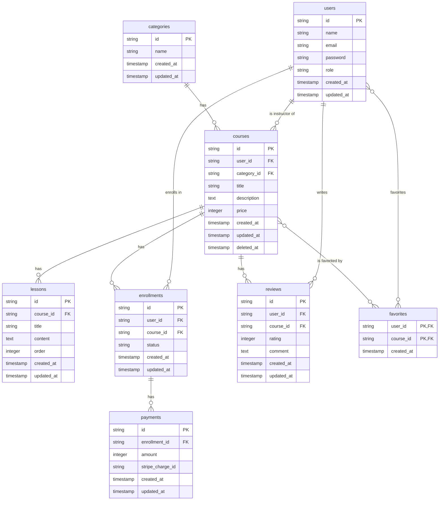

## 模擬案件「LearnHub」要件定義書

## 1. プロジェクト概要

### 1.1 プロジェクト名

**LearnHub（ラーンハブ）**

### 1.2 背景

近年、オンライン学習の需要は急速に高まっています。時間や場所を選ばずに学習できる利便性から、多くの人が自己投資やスキルアップのためにオンライン学習プラットフォームを利用しています。

本プロジェクトでは、実務で頻出する要件を盛り込んだオンライン学習プラットフォーム「LearnHub」を題材とします。受講生には、一部実装済み・一部バグありの既存プロジェクトが提供されます。このプロジェクトに対して、コードリーディング、バグフィックス、リファクタリング、新機能開発といった一連の開発プロセスを体験してもらうことで、より実務に近い形での開発スキル習得を目指します。

### 1.3 目的

- 既存コードを読み解き、仕様を理解する能力を養う。
- N+1問題やセキュリティ脆弱性など、実務で遭遇しやすいバグの修正経験を積む。
- パフォーマンス改善やコード品質向上を目的としたリファクタリングスキルを習得する。
- CRUD、外部API連携、API開発など、多岐にわたる新機能開発を経験する。
- Git/GitHubを用いたチーム開発のワークフロー（ブランチ、プルリクエスト）を習得する。

### 1.4 ユーザーロール

| ロール | 説明 |
| :--- | :--- |
| **管理者 (admin)** | サイト全体の管理者。カテゴリ管理などを行う。 |
| **講師 (instructor)** | コースを作成・管理する。 |
| **受講生 (student)** | コースを受講・購入する。 |

## 2. 環境構築手順

### 2.1 必須要件

- Docker Desktopがインストールされていること。

### 2.2 環境構築

1.  **リポジトリのクローン**

    ```bash
    gh repo clone <リポジトリ名>
    cd <リポジトリ名>
    ```

2.  **.envファイルの作成**

    `.env.example`をコピーして`.env`ファイルを作成します。

    ```bash
    cp .env.example .env
    ```

3.  **Dockerコンテナの起動**

    ```bash
    ./vendor/bin/sail up -d
    ```

4.  **Composerパッケージのインストール**

    ```bash
    ./vendor/bin/sail composer install
    ```

5.  **アプリケーションキーの生成**

    ```bash
    ./vendor/bin/sail artisan key:generate
    ```

6.  **データベースのマイグレーションと初期データ投入**

    ```bash
    ./vendor/bin/sail artisan migrate:fresh --seed
    ```

7.  **アプリケーションへのアクセス**

    ブラウザで `http://localhost` にアクセスし、トップページが表示されることを確認します。

### 2.3 ログイン情報

初期データとして、以下のユーザーが登録されています。

| ロール | メールアドレス | パスワード |
| :--- | :--- | :--- |
| 管理者 | `admin@example.com` | `password` |
| 講師 | `instructor@example.com` | `password` |
| 受講生 | `student@example.com` | `password` |

## 3. 提供コードベースの実装状況

### 3.1 完全実装済み機能（運営提供）

| 機能 | 実装状況 | 備考 |
|---|---|---|
| **認証機能** | ✅ 完全実装 | Laravel Fortify使用、会員登録・ログイン・ログアウト |
| **ロール管理** | ✅ 完全実装 | admin, instructor, student の3ロール |
| **カテゴリ管理** | ✅ 完全実装 | お手本機能（CRUD完全実装） |
| **Bladeビュー** | ✅ 完全実装 | 全画面のフロントエンド実装済み |
| **マイグレーション** | ✅ 完全実装 | 全テーブル定義済み |
| **モデル** | ⚠️ 一部実装 | 基本的なモデルは作成済み、リレーション一部未定義 |

### 3.2 一部実装済み機能（バグあり・不完全）

| 機能 | 実装状況 | 問題点 |
|---|---|---|
| **コース一覧表示** | ⚠️ バグあり | N+1問題が発生している |
| **コース詳細表示** | ⚠️ バグあり | リレーションのEager Loading漏れ |
| **レッスン一覧表示** | ⚠️ バグあり | 認可制御が実装されていない（未購入でも閲覧可能） |
| **受講申し込み** | ⚠️ 不完全 | トランザクション処理が実装されていない |
| **レビュー投稿** | ⚠️ バグあり | バリデーションが不十分（rating必須チェック漏れ） |
| **マイページ** | ⚠️ バグあり | ソフトデリートされたコースも表示される |

### 3.3 未実装機能

| 機能 | 実装状況 |
|---|---|
| **コース登録・編集・削除** | ❌ 未実装 |
| **レッスン登録・編集・削除** | ❌ 未実装 |
| **受講進捗管理** | ❌ 未実装 |
| **レビュー編集・削除** | ❌ 未実装 |
| **お気に入り機能** | ❌ 未実装 |
| **コース購入機能（Stripe連携）** | ❌ 未実装 |
| **通知機能（SendGrid連携）** | ❌ 未実装 |
| **API（コース一覧取得）** | ❌ 未実装 |

## 4. 実装チケット一覧

### 4.1 バグフィックス（7チケット）

| チケットID | タイトル | 難易度 | 推定時間 | カテゴリ |
|---|---|---|---|---|
| **BUG-001** | コース一覧のN+1問題を解決する | ⭐⭐ | 1.5h | パフォーマンス |
| **BUG-002** | コース詳細のEager Loading漏れを修正する | ⭐⭐ | 1h | パフォーマンス |
| **BUG-003** | レビュー投稿のバリデーション不備を修正する | ⭐ | 1h | バリデーション |
| **BUG-004** | レッスン一覧の認可制御を実装する | ⭐⭐ | 2h | セキュリティ |
| **BUG-005** | マイページのソフトデリート対応を修正する | ⭐⭐ | 1.5h | データ整合性 |
| **BUG-006** | 受講申し込みのトランザクション処理を追加する | ⭐⭐⭐ | 2.5h | データ整合性 |
| **BUG-007** | コース検索機能のSQLインジェクション脆弱性を修正する | ⭐⭐ | 1.5h | セキュリティ |

**小計**: 11時間

### 4.2 リファクタリング（8チケット）

| チケットID | タイトル | 難易度 | 推定時間 | カテゴリ |
|---|---|---|---|---|
| **REF-001** | コースコントローラーのクエリをEloquent Scopeに切り出す | ⭐⭐ | 2h | コード品質 |
| **REF-002** | 受講履歴取得処理をコレクションメソッドで最適化する | ⭐⭐ | 2h | パフォーマンス |
| **REF-003** | レビュー集計処理をデータベースクエリに移行する | ⭐⭐⭐ | 3h | パフォーマンス |
| **REF-004** | 重複するバリデーションルールをカスタムルールに統合する | ⭐⭐ | 2h | コード品質 |
| **REF-005** | マジックナンバーを定数クラスに切り出す | ⭐ | 1.5h | 保守性 |
| **REF-006** | 【応用】インデックスを追加してクエリパフォーマンスを改善する | ⭐⭐⭐⭐ | 3h | パフォーマンス |
| **REF-007** | 【応用】キャッシュを導入してコース一覧の表示速度を改善する | ⭐⭐⭐⭐ | 3.5h | パフォーマンス |
| **REF-008** | 【応用】クエリログを分析してスロークエリを特定・最適化する | ⭐⭐⭐⭐ | 3h | パフォーマンス |

**小計**: 20時間

### 4.3 新機能開発（15チケット）

#### 基本要件（10チケット）

| チケットID | タイトル | 難易度 | 推定時間 | カテゴリ |
|---|---|---|---|---|
| **FEAT-001** | コース登録機能を実装する | ⭐⭐⭐ | 3h | CRUD |
| **FEAT-002** | コース編集機能を実装する | ⭐⭐ | 2.5h | CRUD |
| **FEAT-003** | コース削除機能を実装する | ⭐⭐ | 2h | CRUD |
| **FEAT-004** | レッスン登録機能を実装する | ⭐⭐⭐ | 3h | CRUD |
| **FEAT-005** | レッスン編集・削除機能を実装する | ⭐⭐ | 2.5h | CRUD |
| **FEAT-006** | 受講進捗管理機能を実装する | ⭐⭐⭐ | 3.5h | ビジネスロジック |
| **FEAT-007** | レビュー編集・削除機能を実装する | ⭐⭐ | 2h | CRUD |
| **FEAT-008** | お気に入り機能を実装する | ⭐⭐ | 2.5h | 多対多リレーション |
| **FEAT-009** | 人気コースランキング機能を実装する | ⭐⭐⭐ | 3h | 集計クエリ |
| **FEAT-010** | コース検索機能を強化する（カテゴリ・価格帯フィルタ） | ⭐⭐⭐ | 3h | 検索機能 |

**小計**: 27時間

#### 応用要件（5チケット）

| チケットID | タイトル | 難易度 | 推定時間 | カテゴリ |
|---|---|---|---|---|
| **FEAT-011** | 【応用】Stripe連携でコース購入機能を実装する | ⭐⭐⭐⭐ | 5h | 外部API |
| **FEAT-012** | 【応用】SendGrid連携で受講開始通知メールを実装する | ⭐⭐⭐⭐ | 4h | 外部API |
| **FEAT-013** | 【応用】Laravel Sanctumで認証付きAPIを実装する | ⭐⭐⭐⭐ | 5h | API開発 |
| **FEAT-014** | 【応用】API Resourceでコース一覧APIを実装する | ⭐⭐⭐ | 3h | API開発 |
| **FEAT-015** | 【応用】レート制限とAPIエラーハンドリングを実装する | ⭐⭐⭐ | 3h | API開発 |

**小計**: 20時間

### 4.4 総実装時間

| カテゴリ | チケット数 | 推定時間 |
|---|---|---|
| バグフィックス | 7 | 11h |
| リファクタリング | 8 | 20h |
| 新機能開発（基本） | 10 | 27h |
| 新機能開発（応用） | 5 | 20h |
| **合計** | **30** | **78h** |

**Bookshelfとの比較**: 101h × 77% = **78h**

### 4.5 チケットの実装順序

#### Phase 1: バグフィックス（環境理解）
1. BUG-003（バリデーション）← 最も簡単
2. BUG-001（N+1問題）
3. BUG-002（Eager Loading）
4. BUG-005（ソフトデリート）
5. BUG-007（SQLインジェクション）
6. BUG-004（認可制御）
7. BUG-006（トランザクション）← 最も難しい

#### Phase 2: 基本CRUD実装
8. FEAT-001（コース登録）
9. FEAT-002（コース編集）
10. FEAT-003（コース削除）
11. FEAT-004（レッスン登録）
12. FEAT-005（レッスン編集・削除）
13. FEAT-007（レビュー編集・削除）

#### Phase 3: リファクタリング（コード品質向上）
14. REF-005（マジックナンバー）
15. REF-001（Eloquent Scope）
16. REF-004（カスタムルール）
17. REF-002（コレクションメソッド）
18. REF-003（集計クエリ）

#### Phase 4: 高度な機能実装
19. FEAT-008（お気に入り）
20. FEAT-006（受講進捗管理）
21. FEAT-009（ランキング）
22. FEAT-010（検索機能強化）

#### Phase 5: 応用要件（外部API・パフォーマンス）
23. REF-006（インデックス）
24. REF-007（キャッシュ）
25. REF-008（スロークエリ最適化）
26. FEAT-011（Stripe連携）
27. FEAT-012（SendGrid連携）
28. FEAT-013（Sanctum API）
29. FEAT-014（API Resource）
30. FEAT-015（レート制限）

## 5. データベース設計

### 5.1 ER図 (Mermaid)



### 5.2 テーブル定義

（各テーブルのカラム、データ型、制約などを詳細に記述）

## 6. ルーティング設計

### 6.1 Web (routes/web.php)

| メソッド | URI | 名前 | コントローラー@メソッド | ミドルウェア |
| :--- | :--- | :--- | :--- | :--- |
| GET | / | home | HomeController@index | | 
| GET | /courses | courses.index | CourseController@index | | 
| GET | /courses/create | courses.create | CourseController@create | auth, role:instructor |
| POST | /courses | courses.store | CourseController@store | auth, role:instructor |
| GET | /courses/{course} | courses.show | CourseController@show | | 
| GET | /courses/{course}/edit | courses.edit | CourseController@edit | auth, role:instructor |
| PUT | /courses/{course} | courses.update | CourseController@update | auth, role:instructor |
| DELETE | /courses/{course} | courses.destroy | CourseController@destroy | auth, role:instructor |
| ... | ... | ... | ... | ... |

### 6.2 API (routes/api.php)

| メソッド | URI | 名前 | コントローラー@メソッド | ミドルウェア |
| :--- | :--- | :--- | :--- | :--- |
| POST | /login | api.login | Api\AuthController@login | | 
| GET | /courses | api.courses.index | Api\CourseController@index | auth:sanctum |
| ... | ... | ... | ... | ... |

## 7. コントローラー設計

### 7.1 CourseController

- `index()`: コース一覧を取得し、`courses.index`ビューを返す。
- `show(Course $course)`: 特定のコースと関連情報を取得し、`courses.show`ビューを返す。
- `create()`: コース作成フォームビュー`courses.create`を返す。
- `store(StoreCourseRequest $request)`: コースを新規作成し、`courses.show`にリダイレクトする。
- ...

（他のコントローラーも同様に設計）

## 8. バリデーション設計 (FormRequest)

### 8.1 StoreCourseRequest

| フィールド | ルール | メッセージ |
| :--- | :--- | :--- |
| `title` | `required|string|max:255` | タイトルは必須です。 |
| `description` | `required|string` | 説明は必須です。 |
| `category_id` | `required|exists:categories,id` | カテゴリを選択してください。 |
| `price` | `required|integer|min:0` | 価格は0以上の整数で入力してください。 |

### 8.2 StoreReviewRequest

| フィールド | ルール | メッセージ |
| :--- | :--- | :--- |
| `rating` | `required|integer|between:1,5` | 評価は1〜5の整数で入力してください。 |
| `comment` | `required|string` | コメントは必須です。 |

（他のFormRequestも同様に設計）

## 9. 認可設計 (Policy)

### 9.1 CoursePolicy

- `viewAny(User $user)`: 全員許可 (true)
- `view(User $user, Course $course)`: 全員許可 (true)
- `create(User $user)`: 講師(instructor)のみ許可
- `update(User $user, Course $course)`: コースを作成した講師のみ許可
- `delete(User $user, Course $course)`: コースを作成した講師のみ許可

### 9.2 LessonPolicy

- `view(User $user, Lesson $lesson)`: コースを購入した受講生、またはコースを作成した講師のみ許可
- `create(User $user, Course $course)`: コースを作成した講師のみ許可
- ...

（他のPolicyも同様に設計）

## 10. テスト設計

### 10.1 Featureテスト

- **CourseTest**: 
  - `test_guest_can_view_courses_index()`
  - `test_student_can_view_course_show()`
  - `test_instructor_can_create_course()`
  - `test_instructor_cannot_update_other_instructor_course()`
- **EnrollmentTest**:
  - `test_student_can_enroll_in_course()`
  - `test_enrollment_uses_database_transaction()`

### 10.2 Unitテスト

- **CourseModelTest**:
  - `test_course_belongs_to_category_relation()`
- **CollectionMacroTest**:
  - `test_custom_collection_macro_works_correctly()`

## 11. API設計

### 11.1 認証

- Laravel Sanctumを使用したトークンベース認証。
- `POST /api/login` でトークンを発行。
- 以降のリクエストは `Authorization: Bearer <token>` ヘッダーを付与。

### 11.2 コース一覧取得API

- **Endpoint**: `GET /api/courses`
- **認証**: 必須
- **レスポンス (JSON)**:

  ```json
  {
    "data": [
      {
        "id": "ulid",
        "title": "コースタイトル",
        "category": "カテゴリ名",
        "instructor_name": "講師名"
      }
    ],
    "links": { ... },
    "meta": { ... }
  }
  ```

（他のAPIエンドポイントも同様に設計）

## 12. 外部API連携

### 12.1 Stripe (決済)

- **目的**: 有料コースの決済機能を提供。
- **フロー**:
  1. ユーザーが購入ボタンをクリック。
  2. Stripe Checkoutページにリダイレクト。
  3. 決済完了後、Webhookで通知を受け取る。
  4. Webhookコントローラーで受講情報(enrollments)と決済情報(payments)を保存。

### 12.2 SendGrid (メール送信)

- **目的**: 特定のアクション時にユーザーへ通知メールを送信。
- **利用シーン**:
  - 会員登録完了時
  - コース購入完了時
  - コース修了時
- **実装**: Laravelの通知機能(Notification)と連携して実装。

## 13. 実装時間の見積もり

| カテゴリ | チケット数 | 推定時間 |
|---|---|---|
| バグフィックス | 7 | 11h |
| リファクタリング | 8 | 20h |
| 新機能開発（基本） | 10 | 27h |
| 新機能開発（応用） | 5 | 20h |
| **合計** | **30** | **78h** |

**Bookshelfとの比較**: 101h × 77% ≒ **78h**
